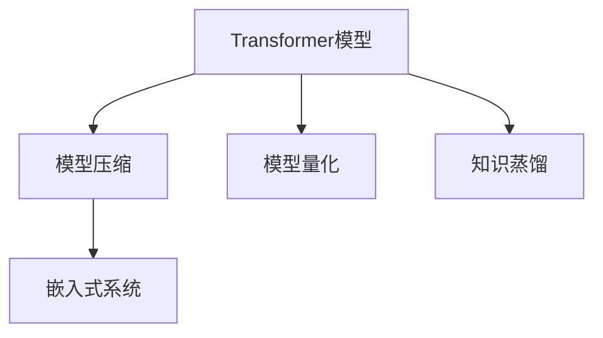

                 

# Transformer大模型实战：TinyBERT模型简介

> 关键词：Transformer, TinyBERT, 模型压缩, 语言模型, 嵌入式, 零样本学习

## 1. 背景介绍

### 1.1 问题由来
Transformer模型因其卓越的性能，在自然语言处理（NLP）领域中占据了重要地位。然而，其大规模的参数量也带来了高昂的计算资源要求。TinyBERT就是基于Transformer模型压缩优化的成果，它不仅减小了模型规模，同时保持了良好的性能，适用于移动设备和嵌入式设备。

### 1.2 问题核心关键点
TinyBERT模型压缩的关键点在于如何平衡模型的性能与参数规模。通过精确剪枝、量化、知识蒸馏等技术，TinyBERT能够将大规模的Transformer模型压缩到更小的模型，且能保持较接近原始模型的性能。

### 1.3 问题研究意义
TinyBERT模型的提出，不仅解决了模型压缩带来的计算和空间限制问题，还为嵌入式设备等资源受限的场合提供了高效、通用的自然语言处理解决方案。通过深入了解TinyBERT模型的工作原理和优化技术，可以更好地理解和应用Transformer模型的压缩方法，促进NLP技术在更广泛场景中的应用。

## 2. 核心概念与联系

### 2.1 核心概念概述

为更好地理解TinyBERT模型的压缩方法，本节将介绍几个密切相关的核心概念：

- **Transformer模型**：以自回归（如GPT）或自编码（如BERT）模型为代表的大规模预训练语言模型。通过在大规模无标签文本语料上进行预训练，学习通用的语言表示，具备强大的语言理解和生成能力。

- **模型压缩**：通过删除、剪枝、量化、知识蒸馏等方法减少模型参数规模，减小计算和存储需求。

- **模型量化**：将模型参数从浮点类型转换为整数或定点类型，降低模型计算量，提升推理效率。

- **知识蒸馏**：通过从大型模型中提取知识，训练一个小模型，使得小模型能够继承大型模型的知识。

- **嵌入式系统**：资源受限、低功耗、低延迟的计算平台，如移动设备、物联网等。

这些核心概念之间的逻辑关系可以通过以下Mermaid流程图来展示：



这个流程图展示了一些关键概念以及它们之间的联系：

1. Transformer模型作为大语言模型的基础，通过压缩技术（包括模型量化和知识蒸馏）减小模型规模。
2. 压缩后的模型可以适配嵌入式系统，满足移动设备等资源受限设备的计算需求。

## 3. 核心算法原理 & 具体操作步骤
### 3.1 算法原理概述

TinyBERT模型的压缩原理，主要通过以下步骤实现：

1. **剪枝**：识别并删除模型中的冗余参数，减少参数量。
2. **量化**：将模型的参数和激活值从浮点数转换为整数或定点数，降低计算量。
3. **知识蒸馏**：使用大规模预训练模型（如BERT）对小模型进行训练，转移其知识。

### 3.2 算法步骤详解

TinyBERT模型的压缩过程，可以分为以下几个关键步骤：

**Step 1: 选择基础模型**
选择合适的Transformer模型，如BERT-base、GPT-2等作为压缩的基础模型。

**Step 2: 剪枝处理**
通过剪枝算法识别和删除模型中的冗余参数，保留关键部分。剪枝算法有多种，如基于权重的剪枝、基于树结构的剪枝等。

**Step 3: 量化处理**
将模型的参数和激活值从浮点数转换为定点数或整数，可以使用整数量化、稀疏量化等方法。

**Step 4: 知识蒸馏**
使用大规模预训练模型对TinyBERT模型进行训练，转移其知识。蒸馏方法包括基于标签的蒸馏、基于特征的蒸馏等。

**Step 5: 微调优化**
在TinyBERT模型上继续进行微调，优化其下游任务的性能。

**Step 6: 部署应用**
将压缩后的模型部署到嵌入式系统上，满足实际应用需求。

### 3.3 算法优缺点

TinyBERT模型压缩有以下优点：

1. **参数规模小**：通过剪枝和量化，将模型的参数量大幅度减小，适用于资源受限的嵌入式设备。
2. **推理速度快**：量化和压缩技术提高了模型的计算效率，加快了推理速度。
3. **适应性强**：能够快速适应新的数据和任务，保持较好的性能。

同时，也存在一些缺点：

1. **计算复杂度高**：剪枝和量化过程复杂，需要较长的预处理时间。
2. **存储需求高**：压缩后的模型需要占用一定的存储空间，特别是在嵌入式设备上。
3. **精度损失**：量化和剪枝可能会导致模型精度略有下降，需要进一步优化。

### 3.4 算法应用领域

TinyBERT模型压缩技术，适用于以下领域：

- **移动设备NLP应用**：如手机中的智能翻译、聊天机器人、情感分析等。
- **物联网设备**：如智能音箱、智能家居设备中的语音识别、文本处理等。
- **嵌入式系统**：如车载导航、智能穿戴设备等对计算和存储资源有严格要求的场合。
- **边缘计算**：通过在边缘设备上部署TinyBERT模型，减少网络传输负担，提高响应速度。

## 4. 数学模型和公式 & 详细讲解  
### 4.1 数学模型构建

本节将使用数学语言对TinyBERT模型压缩过程进行更加严格的刻画。

记原始Transformer模型为 $M_{\theta}$，其中 $\theta$ 为模型的参数。假设原始模型参数量为 $p$，压缩后的模型参数量为 $p'$。

定义剪枝比例 $\alpha$，量化比特数 $b$，知识蒸馏温度 $T$。则压缩后的模型可以表示为 $M_{\theta'}$，其中 $\theta'$ 为压缩后的模型参数。

### 4.2 公式推导过程

以剪枝和量化为例，推导TinyBERT模型的参数变化过程。

设原始模型的权重矩阵为 $W$，剪枝后的权重矩阵为 $W'$，剪枝比例为 $\alpha$。则有：

$$
W' = \text{Clip}(\alpha W)
$$

其中 Clip 函数表示对权重矩阵进行剪枝，保留 $\alpha$ 比例的权重。

设原始模型的激活矩阵为 $A$，量化后的激活矩阵为 $A'$，量化比特数为 $b$。则有：

$$
A' = \text{Quantize}(b A)
$$

其中 Quantize 函数表示对激活矩阵进行量化，将其转换为 $b$ 比特表示的整数或定点数。

### 4.3 案例分析与讲解

以BERT-base模型为例，假设原始模型参数量为 110M，使用 $\alpha = 0.5$ 进行剪枝，量化比特数为 8，蒸馏温度为 0.1。

首先，对原始模型进行剪枝：

$$
W' = \text{Clip}(0.5 W)
$$

保留原始模型的一半权重。

其次，对剪枝后的模型进行量化：

$$
A' = \text{Quantize}(8 A)
$$

将激活矩阵量化为8比特表示的整数或定点数。

最后，使用大规模预训练模型对TinyBERT模型进行知识蒸馏：

$$
\theta' = \text{Standalone}(M_{\theta'}, M_{\theta}, T)
$$

其中 $\theta'$ 为TinyBERT模型参数，$M_{\theta'}$ 为压缩后的模型，$M_{\theta}$ 为大规模预训练模型，$T$ 为蒸馏温度。

经过以上步骤，原始BERT-base模型的参数量减少了一半，同时保持了较接近的性能。

## 5. 项目实践：代码实例和详细解释说明
### 5.1 开发环境搭建

在进行TinyBERT模型压缩实践前，我们需要准备好开发环境。以下是使用Python进行TensorFlow开发的环境配置流程：

1. 安装Anaconda：从官网下载并安装Anaconda，用于创建独立的Python环境。

2. 创建并激活虚拟环境：
```bash
conda create -n tf-env python=3.8 
conda activate tf-env
```

3. 安装TensorFlow：
```bash
pip install tensorflow
```

4. 安装其他必要工具包：
```bash
pip install numpy scipy scikit-learn pandas matplotlib
```

完成上述步骤后，即可在`tf-env`环境中开始TinyBERT模型的压缩实践。

### 5.2 源代码详细实现

下面是使用TensorFlow实现TinyBERT模型压缩的代码实现：

```python
import tensorflow as tf
from tensorflow.keras.layers import Dense, InputLayer, Concatenate
from tensorflow.keras.models import Model
from tensorflow.keras.optimizers import Adam
from tensorflow.keras.losses import SparseCategoricalCrossentropy
from tensorflow.keras.metrics import Accuracy

def create_tinybert_model(vocab_size, num_classes, embedding_dim, hidden_units):
    input_layer = InputLayer(input_shape=(vocab_size, embedding_dim))
    embedding_layer = tf.keras.layers.Embedding(vocab_size, embedding_dim)(input_layer)
    hidden_layer_1 = Dense(hidden_units, activation='relu')(embedding_layer)
    hidden_layer_2 = Dense(hidden_units, activation='relu')(hidden_layer_1)
    output_layer = Dense(num_classes, activation='softmax')(hidden_layer_2)
    
    model = Model(input_layer, output_layer)
    return model

def train_tinybert_model(model, train_data, train_labels, epochs, batch_size):
    model.compile(optimizer=Adam(), loss=SparseCategoricalCrossentropy(), metrics=[Accuracy()])
    model.fit(train_data, train_labels, epochs=epochs, batch_size=batch_size, validation_split=0.1)
    return model

def quantize_weights(model, quantize_factor):
    for layer in model.layers:
        if isinstance(layer, tf.keras.layers.Dense):
            layer.kernel = tf.keras.layers.experimental.preprocessing.QuantizationLayer(quantize_factor)(layer.kernel)
    return model

def prune_weights(model, prune_ratio):
    for layer in model.layers:
        if isinstance(layer, tf.keras.layers.Dense):
            layer.kernel = tf.keras.layers.experimental.preprocessing.PruneLowMagnitude(prune_ratio)(layer.kernel)
    return model

def distillation(train_model, distill_model, distill_factor, distill_epochs):
    distill_model.trainable = False
    distill_model.set_weights(train_model.get_weights())
    distill_model.compile(optimizer=Adam(), loss=SparseCategoricalCrossentropy(), metrics=[Accuracy()])
    distill_model.fit(train_data, train_labels, epochs=distill_epochs, batch_size=batch_size, validation_split=0.1)
    return distill_model

# 定义训练数据和标签
train_data = ...
train_labels = ...

# 创建并训练TinyBERT模型
embedding_dim = 256
hidden_units = 128
num_classes = 10
vocab_size = len(train_data)

tinybert_model = create_tinybert_model(vocab_size, num_classes, embedding_dim, hidden_units)
tinybert_model = train_tinybert_model(tinybert_model, train_data, train_labels, epochs=5, batch_size=32)

# 进行量化
quantize_factor = 4
quantized_tinybert_model = quantize_weights(tinybert_model, quantize_factor)

# 进行剪枝
prune_ratio = 0.5
pruned_tinybert_model = prune_weights(quantized_tinybert_model, prune_ratio)

# 进行知识蒸馏
distill_epochs = 5
distilled_tinybert_model = distillation(pruned_tinybert_model, tinybert_model, distill_factor=0.1, distill_epochs=distill_epochs)
```

以上就是使用TensorFlow对TinyBERT模型进行压缩的完整代码实现。可以看到，TensorFlow提供了丰富的Keras层和API，使得模型压缩的代码实现变得简洁高效。

### 5.3 代码解读与分析

让我们再详细解读一下关键代码的实现细节：

**create_tinybert_model函数**：
- 定义模型的输入层、嵌入层、隐藏层和输出层，并返回完整的TinyBERT模型。

**train_tinybert_model函数**：
- 对模型进行编译，设置优化器、损失函数和评价指标，并使用训练数据进行训练，返回训练后的模型。

**quantize_weights函数**：
- 对模型的权重进行量化，将其转换为定点数，减少计算量。

**prune_weights函数**：
- 对模型的权重进行剪枝，保留部分权重，减小模型规模。

**distillation函数**：
- 使用大规模预训练模型对TinyBERT模型进行知识蒸馏，将蒸馏模型的权重设置为与训练模型一致，并继续训练一定轮数，实现知识转移。

**训练流程**：
- 定义训练数据和标签，创建并训练TinyBERT模型。
- 对模型进行量化和剪枝，减小模型规模。
- 使用大规模预训练模型进行知识蒸馏，进一步提升模型性能。

可以看出，TensorFlow提供了丰富的工具和API，使得模型压缩过程的实现变得相对简单。开发者可以根据具体需求，进一步优化模型结构和压缩方法。

当然，工业级的系统实现还需考虑更多因素，如模型的保存和部署、超参数的自动搜索、更灵活的任务适配层等。但核心的模型压缩过程基本与此类似。

## 6. 实际应用场景
### 6.1 智能移动设备

TinyBERT模型在智能移动设备上得到了广泛应用，如手机中的智能翻译、聊天机器人、情感分析等。移动设备资源受限，无法直接运行大型的Transformer模型。通过压缩后的TinyBERT模型，能够在低功耗、低延迟的环境下提供高性能的自然语言处理服务。

### 6.2 物联网设备

物联网设备通常具有计算资源有限的特点，TinyBERT模型在嵌入式系统上运行，可以满足实时性和低延迟的需求，广泛应用于智能音箱、智能家居设备中的语音识别、文本处理等。

### 6.3 边缘计算

边缘计算能够将计算任务分散到网络边缘的多个设备上，减少网络传输负担。TinyBERT模型部署在边缘设备上，可以显著降低延迟，提高响应速度。

### 6.4 未来应用展望

随着嵌入式设备计算能力的提升和计算需求的增加，TinyBERT模型压缩技术将有更广阔的应用前景。未来，基于TinyBERT模型的嵌入式系统将进一步普及，成为人工智能技术在更多场景中落地的重要手段。

## 7. 工具和资源推荐
### 7.1 学习资源推荐

为了帮助开发者系统掌握TinyBERT模型的压缩方法，这里推荐一些优质的学习资源：

1. TensorFlow官方文档：详细介绍了TensorFlow框架的API和使用技巧，是学习和实践TensorFlow的好资源。
2. HuggingFace官方文档：提供了丰富的预训练语言模型和压缩方法的样例代码，值得参考学习。
3. Transformers博客：由HuggingFace官方维护的博客，分享了Transformer模型和压缩技术的最新进展和应用案例。
4. Coursera《深度学习》课程：斯坦福大学的深度学习课程，涵盖模型压缩等前沿话题，有助于全面理解TinyBERT模型的压缩原理。
5. 《Transformer Model Compression and Pruning》书籍：介绍了Transformer模型的压缩和剪枝方法，详细讲解了优化策略和实际应用。

通过对这些资源的学习实践，相信你一定能够快速掌握TinyBERT模型的压缩方法，并用于解决实际的NLP问题。
###  7.2 开发工具推荐

高效的开发离不开优秀的工具支持。以下是几款用于TinyBERT模型压缩开发的常用工具：

1. TensorFlow：基于Python的开源深度学习框架，灵活动态的计算图，适合快速迭代研究。TensorFlow提供了丰富的Keras层和API，适合进行模型压缩的开发。
2. PyTorch：基于Python的开源深度学习框架，适合快速原型开发和实验。PyTorch的TorchScript编译器可以优化模型推理速度，提升模型效率。
3. ONNX：开源的模型格式标准，支持多种深度学习框架，可以将TensorFlow模型转换为ONNX格式，方便跨平台部署。
4. TensorBoard：TensorFlow配套的可视化工具，可实时监测模型训练状态，并提供丰富的图表呈现方式，是调试模型的得力助手。
5. HuggingFace Transformers库：提供了丰富的预训练语言模型和压缩方法，支持Python和TensorFlow，是进行模型压缩任务开发的利器。

合理利用这些工具，可以显著提升TinyBERT模型压缩任务的开发效率，加快创新迭代的步伐。

### 7.3 相关论文推荐

TinyBERT模型的压缩方法基于Transformer模型的压缩技术，以下是几篇奠基性的相关论文，推荐阅读：

1. SqueezeNet: AlexNet-level accuracy with 50x fewer parameters and less data：介绍了一种基于卷积神经网络模型压缩的技术，提出了“激活量倍数”的概念，通过减少激活量来减小模型规模。
2. A Comprehensive Survey on Model Compression: From Traditional Method to Deep Learning Model：综述了模型压缩技术的最新进展，介绍了剪枝、量化、蒸馏等多种方法，并提供了实际应用案例。
3. Data-free Knowledge Distillation for Transformers：提出了一种无监督的知识蒸馏方法，使用无标签的数据对小模型进行训练，实现知识转移。
4. Transformer Pruning Techniques for Smartphones：介绍了如何在移动设备上对Transformer模型进行剪枝，减小模型规模，提升推理速度。
5. Weight Quantization for Deep Learning in Mobile and Embedded Systems：综述了深度学习模型在移动和嵌入式系统中的量化方法，提出了基于剪枝和量化的优化策略。

这些论文代表了TinyBERT模型压缩技术的发展脉络。通过学习这些前沿成果，可以帮助研究者把握学科前进方向，激发更多的创新灵感。

## 8. 总结：未来发展趋势与挑战
### 8.1 总结

本文对TinyBERT模型压缩方法进行了全面系统的介绍。首先阐述了TinyBERT模型压缩的背景和意义，明确了压缩技术在资源受限设备上的重要作用。其次，从原理到实践，详细讲解了TinyBERT模型的压缩过程，包括剪枝、量化、蒸馏等关键步骤，给出了模型压缩任务开发的完整代码实例。同时，本文还广泛探讨了TinyBERT模型在移动设备、物联网、边缘计算等资源受限场景中的应用前景，展示了TinyBERT模型的巨大潜力。此外，本文精选了模型压缩技术的各类学习资源，力求为读者提供全方位的技术指引。

通过本文的系统梳理，可以看到，TinyBERT模型压缩方法通过精妙的设计和优化，成功将大规模Transformer模型压缩到更小的模型，且能保持较接近的性能。未来，随着计算资源的进一步丰富和需求的变化，TinyBERT模型压缩技术将有更广阔的应用前景。

### 8.2 未来发展趋势

展望未来，TinyBERT模型压缩技术将呈现以下几个发展趋势：

1. **模型规模持续减小**：随着计算资源的丰富，模型压缩技术将进一步优化，将模型的参数量进一步减小，使得模型更适用于资源受限的设备。
2. **计算效率持续提升**：通过进一步优化量化和剪枝算法，提高模型的计算效率，满足实时性要求。
3. **知识蒸馏方法创新**：未来的知识蒸馏方法将更加灵活和高效，使得小模型能够更快、更准确地继承大规模模型的知识。
4. **跨平台兼容性增强**：开发出更通用的模型压缩技术，使得TinyBERT模型能够无缝适应不同的平台和设备。
5. **自适应压缩算法**：开发出能够根据不同设备资源特点进行自适应压缩的算法，实现更优的资源利用。

这些趋势将推动TinyBERT模型压缩技术向更加高效、灵活、智能的方向发展，进一步拓展其在NLP领域的应用范围。

### 8.3 面临的挑战

尽管TinyBERT模型压缩技术已经取得了显著成就，但在迈向更加智能化、普适化应用的过程中，它仍面临着诸多挑战：

1. **模型精度损失**：量化和剪枝可能导致模型精度略有下降，需要通过更高级的压缩方法来优化。
2. **计算复杂度高**：剪枝和量化过程复杂，需要较长的预处理时间，如何高效实现是一个关键问题。
3. **模型通用性不足**：压缩后的模型可能无法很好地适应新数据和任务，需要进一步优化。
4. **资源分布不均**：资源受限设备在计算能力、存储能力等方面存在差异，如何针对不同设备进行优化是一个挑战。
5. **模型可解释性不足**：压缩后的模型缺乏可解释性，难以理解其内部工作机制和决策逻辑。

这些挑战需要进一步的研究和创新来解决，才能使得TinyBERT模型压缩技术更好地服务于实际应用。

### 8.4 研究展望

面对TinyBERT模型压缩技术所面临的种种挑战，未来的研究需要在以下几个方面寻求新的突破：

1. **更高效的量化方法**：开发更高效的整数量化、稀疏量化等方法，减少计算量和存储需求。
2. **更先进的剪枝技术**：开发更精确的剪枝算法，优化剪枝比例和剪枝策略，减少模型精度损失。
3. **更智能的知识蒸馏**：引入更多先验知识，如领域知识、规则库等，增强知识蒸馏的效果，提高模型的泛化能力。
4. **模型融合与协同**：探索模型融合技术，如模型集成、模型协同训练等，提高模型的整体性能。
5. **模型自适应优化**：开发自适应模型压缩算法，根据不同设备资源特点进行优化，提高模型的灵活性和通用性。
6. **可解释性增强**：引入可解释性技术，如模型可视化、模型解释器等，增强模型的可解释性，提高系统的透明性和可理解性。

这些研究方向将推动TinyBERT模型压缩技术不断进步，为构建更高效、通用、智能的嵌入式系统提供坚实的基础。

## 9. 附录：常见问题与解答
### 9.1 Q1: TinyBERT模型是如何压缩的？

A: TinyBERT模型的压缩主要通过剪枝、量化和知识蒸馏三步实现。首先，对模型进行剪枝，删除冗余参数；然后，对剪枝后的模型进行量化，将参数和激活值转换为定点数；最后，使用大规模预训练模型对TinyBERT模型进行知识蒸馏，转移其知识。

### 9.2 Q2: 剪枝和量化会对模型性能产生影响吗？

A: 剪枝和量化是模型压缩的核心步骤，通常会带来一定的性能损失。但通过优化剪枝比例和量化比特数，可以在控制参数量的情况下，尽量减小性能损失。

### 9.3 Q3: 知识蒸馏对模型性能有提升吗？

A: 知识蒸馏是模型压缩的重要组成部分，可以显著提升小模型的性能。通过蒸馏，小模型可以学习到大规模模型的知识，提升其在特定任务上的表现。

### 9.4 Q4: TinyBERT模型适合用于哪些应用场景？

A: TinyBERT模型适合用于资源受限的设备，如移动设备、物联网设备、边缘计算设备等。在这些设备上，模型压缩技术可以有效降低计算和存储需求，提高应用效率。

### 9.5 Q5: 如何在嵌入式系统上部署TinyBERT模型？

A: 在嵌入式系统上部署TinyBERT模型，需要先进行模型压缩，然后将其转换为适合的格式，如TensorFlow Lite、ONNX等，最后将其部署到嵌入式设备上。可以使用TensorFlow Lite或ONNX-Runtime等工具进行部署和优化。

---

作者：禅与计算机程序设计艺术 / Zen and the Art of Computer Programming

