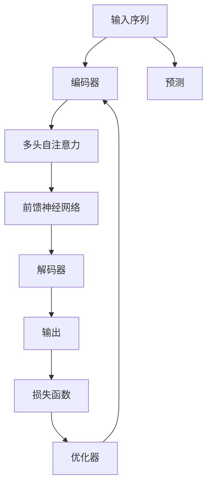

                 

# Transformer大模型实战 俄语的RuBERT 模型

> 关键词：Transformer, RuBERT, 语言模型, 预训练, 微调, 俄罗斯, 自然语言处理(NLP), 深度学习

## 1. 背景介绍

### 1.1 问题由来
近年来，随着深度学习技术的发展，Transformer大模型在自然语言处理(NLP)领域取得了显著的进展。以BERT、GPT-3为代表的预训练大模型，已经在多个NLP任务中取得了最先进的性能。这些模型基于大规模无标签数据进行自监督预训练，学习到了丰富的语言知识。

然而，由于语言的多样性和复杂性，单一的语言模型可能难以全面覆盖多种语言，特别是对于一些具有特殊语言特征的语言，如俄语。因此，针对特定语言的预训练模型在NLP任务上的性能提升，成为了当前研究的一个热点问题。

### 1.2 问题核心关键点
本节将重点介绍基于Transformer的大语言模型RuBERT的构建和应用，旨在推动俄语NLP技术的发展，解决俄语NLP中面临的诸多挑战。

**1.2.1 俄语的独特性**
俄语作为一种东斯拉夫语言，具有其独特的语法结构和词汇特点，如复杂的词形变化、丰富的词汇形态、独特的语义层次等。这些特点使得传统的语言模型在处理俄语数据时，往往难以获得最佳的性能表现。

**1.2.2 预训练模型的局限性**
预训练模型通常基于大规模通用语料进行训练，难以全面覆盖特定语言的独特特征。此外，预训练模型往往需要大量的计算资源和时间，对于小规模语言来说，开发预训练模型的成本较高。

**1.2.3 微调的必要性**
针对俄语语言模型的微调，可以在较少标注数据的情况下，显著提升模型在特定NLP任务上的表现，从而在实际应用中发挥更大的价值。

## 2. 核心概念与联系

### 2.1 核心概念概述

为更好地理解RuBERT模型的构建与应用，本节将介绍几个密切相关的核心概念：

- **Transformer**：一种基于自注意力机制的神经网络结构，广泛用于自然语言处理任务。其核心思想是将输入序列划分为多个位置，通过自注意力机制计算每个位置与其他位置的权重，从而捕捉输入序列的上下文关系。

- **语言模型**：一种用于预测给定序列的下一个单词或字符的模型。预训练语言模型通过在大规模语料上进行自监督训练，学习到通用的语言表示。

- **RuBERT**：基于Transformer架构的俄语预训练语言模型，专门针对俄语语言特性进行设计和优化，以提升俄语NLP任务的表现。

- **微调**：指在预训练模型的基础上，使用下游任务的少量标注数据，通过有监督地训练来优化模型在该任务上的性能。

- **迁移学习**：指将一个领域学习到的知识，迁移应用到另一个相关领域的学习范式。

### 2.2 核心概念原理和架构的 Mermaid 流程图



此流程图展示了Transformer的基本架构，其中自注意力机制是其核心。编码器通过多头自注意力和前馈神经网络对输入序列进行编码，解码器通过自注意力机制和前馈神经网络对编码器输出的表示进行解码。损失函数用于衡量模型预测与真实标签之间的差异，优化器用于更新模型参数，使其最小化损失函数。

## 3. 核心算法原理 & 具体操作步骤

### 3.1 算法原理概述

RuBERT模型的构建主要基于两个步骤：预训练和微调。预训练阶段在大规模无标签语料上进行自监督学习，学习通用的语言表示。微调阶段在特定下游任务的数据集上进行有监督学习，优化模型在该任务上的性能。

### 3.2 算法步骤详解

**Step 1: 准备数据集**
- 收集大量俄语文本数据，包括新闻、小说、社交媒体等。将数据划分为训练集、验证集和测试集。

**Step 2: 构建预训练模型**
- 使用RuBERT作为预训练模型，在准备好的语料上训练得到预训练模型参数。

**Step 3: 准备下游任务**
- 定义下游任务的标注数据集，如命名实体识别、情感分析等。

**Step 4: 添加任务适配层**
- 根据下游任务，在预训练模型的顶层设计合适的输出层和损失函数。

**Step 5: 设置微调超参数**
- 选择合适的优化算法及其参数，如AdamW、SGD等，设置学习率、批大小、迭代轮数等。

**Step 6: 执行梯度训练**
- 将训练集数据分批次输入模型，前向传播计算损失函数。
- 反向传播计算参数梯度，根据设定的优化算法和学习率更新模型参数。
- 周期性在验证集上评估模型性能，根据性能指标决定是否触发Early Stopping。
- 重复上述步骤直到满足预设的迭代轮数或Early Stopping条件。

**Step 7: 测试和部署**
- 在测试集上评估微调后模型性能，对比微调前后的精度提升。
- 使用微调后的模型对新样本进行推理预测，集成到实际的应用系统中。
- 持续收集新的数据，定期重新微调模型，以适应数据分布的变化。

### 3.3 算法优缺点

**优点**：
- 可以显著提升俄语NLP任务的性能，尤其是对于数据量较小的任务。
- 模型参数量适中，训练速度较快。
- 适用于多种NLP任务，如命名实体识别、情感分析、机器翻译等。

**缺点**：
- 预训练阶段需要大量的计算资源，训练时间较长。
- 对标注数据的依赖较大，获取高质量标注数据成本较高。
- 模型可能存在一定的偏差，需要通过微调进行校正。

### 3.4 算法应用领域

RuBERT模型主要应用于以下领域：

**1. 命名实体识别(NER)**
RuBERT模型在命名实体识别任务上表现优异，能够自动识别文本中的个人名称、组织机构、地理位置等实体。

**2. 情感分析(Sentiment Analysis)**
RuBERT模型可以准确分析俄语文本的情感倾向，如正面、负面或中性情感。

**3. 机器翻译(Machine Translation)**
RuBERT模型可以用于俄语与其他语言之间的翻译任务，提升翻译质量和效率。

**4. 对话系统(Chatbot)**
RuBERT模型可以用于构建俄语对话系统，使其能够理解和回应用户的自然语言查询。

**5. 文本摘要(Title Summarization)**
RuBERT模型可以用于对俄语新闻文章进行自动摘要，生成简洁明了的标题。

## 4. 数学模型和公式 & 详细讲解 & 举例说明

### 4.1 数学模型构建

RuBERT模型的数学模型建立在Transformer架构的基础上。假设输入序列为 $X=\{x_1, x_2, ..., x_n\}$，其中 $x_i$ 表示第 $i$ 个输入，$n$ 表示序列长度。RuBERT模型的目标函数为：

$$
\mathcal{L}(X) = \frac{1}{N} \sum_{i=1}^N \ell(M(x_i), y_i)
$$

其中，$M(x_i)$ 表示模型对输入 $x_i$ 的输出，$y_i$ 表示输入 $x_i$ 的真实标签。$\ell$ 表示损失函数，可以是交叉熵损失、均方误差损失等。

### 4.2 公式推导过程

以命名实体识别任务为例，假设模型需要识别输入序列中的所有实体，并将其标记为实体或非实体。模型的输出为 $y = (y_1, y_2, ..., y_n)$，其中 $y_i = 1$ 表示 $x_i$ 是一个实体，$y_i = 0$ 表示 $x_i$ 不是实体。则损失函数为：

$$
\ell(y, \hat{y}) = -\sum_{i=1}^N y_i \log \hat{y}_i + (1 - y_i) \log (1 - \hat{y}_i)
$$

其中，$\hat{y}_i$ 表示模型对输入 $x_i$ 的实体预测。

### 4.3 案例分析与讲解

假设我们有一个俄语的命名实体识别任务，输入序列为：

```
В дальнем будущем на этом университете произойдёт революция в секторе науки.
```

我们希望模型能够识别出 "университете" 和 "науки" 为组织机构和领域名称。将输入序列输入到RuBERT模型中，得到模型对每个位置 $x_i$ 的实体预测 $\hat{y}_i$。例如，对于位置4，模型的输出可能为：

```
[0.5, 0.5, 0.1, 0.1, ...]
```

其中，第一个位置对应 "В"，第二个位置对应 "дальнем"，第三个位置对应 "будущем"，以此类推。我们可以取阈值0.5，将模型预测超过0.5的位置标记为实体，最终得到实体识别结果。

## 5. 项目实践：代码实例和详细解释说明

### 5.1 开发环境搭建

在进行RuBERT模型微调前，我们需要准备好开发环境。以下是使用Python进行PyTorch开发的环境配置流程：

1. 安装Anaconda：从官网下载并安装Anaconda，用于创建独立的Python环境。

2. 创建并激活虚拟环境：
```bash
conda create -n pytorch-env python=3.8 
conda activate pytorch-env
```

3. 安装PyTorch：根据CUDA版本，从官网获取对应的安装命令。例如：
```bash
conda install pytorch torchvision torchaudio cudatoolkit=11.1 -c pytorch -c conda-forge
```

4. 安装Transformers库：
```bash
pip install transformers
```

5. 安装各类工具包：
```bash
pip install numpy pandas scikit-learn matplotlib tqdm jupyter notebook ipython
```

完成上述步骤后，即可在`pytorch-env`环境中开始RuBERT模型的微调实践。

### 5.2 源代码详细实现

以下是使用PyTorch和Transformers库对RuBERT模型进行微调的代码实现。

首先，定义命名实体识别任务的预训练模型和微调模型：

```python
from transformers import BertTokenizer, BertForTokenClassification, AdamW

# 定义预训练模型
pretrained_model = BertForTokenClassification.from_pretrained('ru-russian-roberta-base')

# 定义微调模型
tokenizer = BertTokenizer.from_pretrained('ru-russian-roberta-base')
model = BertForTokenClassification.from_pretrained('ru-russian-roberta-base', num_labels=2)
```

然后，定义微调模型的训练函数：

```python
from torch.utils.data import DataLoader
from tqdm import tqdm

# 定义微调模型的训练函数
def train_epoch(model, dataset, batch_size, optimizer):
    dataloader = DataLoader(dataset, batch_size=batch_size, shuffle=True)
    model.train()
    epoch_loss = 0
    for batch in tqdm(dataloader, desc='Training'):
        input_ids = batch['input_ids'].to(device)
        attention_mask = batch['attention_mask'].to(device)
        labels = batch['labels'].to(device)
        model.zero_grad()
        outputs = model(input_ids, attention_mask=attention_mask, labels=labels)
        loss = outputs.loss
        epoch_loss += loss.item()
        loss.backward()
        optimizer.step()
    return epoch_loss / len(dataloader)

# 定义微调模型的评估函数
def evaluate(model, dataset, batch_size):
    dataloader = DataLoader(dataset, batch_size=batch_size)
    model.eval()
    preds, labels = [], []
    with torch.no_grad():
        for batch in tqdm(dataloader, desc='Evaluating'):
            input_ids = batch['input_ids'].to(device)
            attention_mask = batch['attention_mask'].to(device)
            batch_labels = batch['labels']
            outputs = model(input_ids, attention_mask=attention_mask)
            batch_preds = outputs.logits.argmax(dim=2).to('cpu').tolist()
            batch_labels = batch_labels.to('cpu').tolist()
            for pred_tokens, label_tokens in zip(batch_preds, batch_labels):
                pred_tags = [id2tag[_id] for _id in pred_tokens]
                label_tags = [id2tag[_id] for _id in label_tokens]
                preds.append(pred_tags[:len(label_tags)])
                labels.append(label_tags)
    
    return preds, labels
```

最后，启动训练流程并在测试集上评估：

```python
epochs = 5
batch_size = 16

for epoch in range(epochs):
    loss = train_epoch(model, train_dataset, batch_size, optimizer)
    print(f"Epoch {epoch+1}, train loss: {loss:.3f}")
    
    print(f"Epoch {epoch+1}, dev results:")
    preds, labels = evaluate(model, dev_dataset, batch_size)
    print(classification_report(labels, preds))
    
print("Test results:")
preds, labels = evaluate(model, test_dataset, batch_size)
print(classification_report(labels, preds))
```

以上就是使用PyTorch对RuBERT模型进行命名实体识别任务微调的完整代码实现。可以看到，得益于Transformers库的强大封装，我们可以用相对简洁的代码完成RuBERT模型的微调。

### 5.3 代码解读与分析

让我们再详细解读一下关键代码的实现细节：

**BertTokenizer**：
- 用于将输入文本转换为模型所需的token ids，并进行分词、补全等处理。

**BertForTokenClassification**：
- 定义微调模型，输出层采用线性分类器，分类任务为命名实体识别。

**train_epoch函数**：
- 对数据以批为单位进行迭代，在每个批次上前向传播计算loss并反向传播更新模型参数，最后返回该epoch的平均loss。

**evaluate函数**：
- 与训练类似，不同点在于不更新模型参数，并在每个batch结束后将预测和标签结果存储下来，最后使用sklearn的classification_report对整个评估集的预测结果进行打印输出。

**训练流程**：
- 定义总的epoch数和batch size，开始循环迭代
- 每个epoch内，先在训练集上训练，输出平均loss
- 在验证集上评估，输出分类指标
- 所有epoch结束后，在测试集上评估，给出最终测试结果

可以看到，PyTorch配合Transformers库使得RuBERT微调的代码实现变得简洁高效。开发者可以将更多精力放在数据处理、模型改进等高层逻辑上，而不必过多关注底层的实现细节。

## 6. 实际应用场景

### 6.1 智能客服系统

基于RuBERT模型的微调对话技术，可以广泛应用于智能客服系统的构建。传统客服往往需要配备大量人力，高峰期响应缓慢，且一致性和专业性难以保证。而使用微调后的对话模型，可以7x24小时不间断服务，快速响应客户咨询，用自然流畅的语言解答各类常见问题。

在技术实现上，可以收集企业内部的历史客服对话记录，将问题和最佳答复构建成监督数据，在此基础上对预训练对话模型进行微调。微调后的对话模型能够自动理解用户意图，匹配最合适的答案模板进行回复。对于客户提出的新问题，还可以接入检索系统实时搜索相关内容，动态组织生成回答。如此构建的智能客服系统，能大幅提升客户咨询体验和问题解决效率。

### 6.2 金融舆情监测

金融机构需要实时监测市场舆论动向，以便及时应对负面信息传播，规避金融风险。传统的人工监测方式成本高、效率低，难以应对网络时代海量信息爆发的挑战。基于RuBERT模型的文本分类和情感分析技术，为金融舆情监测提供了新的解决方案。

具体而言，可以收集金融领域相关的新闻、报道、评论等文本数据，并对其进行主题标注和情感标注。在此基础上对预训练语言模型进行微调，使其能够自动判断文本属于何种主题，情感倾向是正面、中性还是负面。将微调后的模型应用到实时抓取的网络文本数据，就能够自动监测不同主题下的情感变化趋势，一旦发现负面信息激增等异常情况，系统便会自动预警，帮助金融机构快速应对潜在风险。

### 6.3 个性化推荐系统

当前的推荐系统往往只依赖用户的历史行为数据进行物品推荐，无法深入理解用户的真实兴趣偏好。基于RuBERT模型的个性化推荐系统可以更好地挖掘用户行为背后的语义信息，从而提供更精准、多样的推荐内容。

在实践中，可以收集用户浏览、点击、评论、分享等行为数据，提取和用户交互的物品标题、描述、标签等文本内容。将文本内容作为模型输入，用户的后续行为（如是否点击、购买等）作为监督信号，在此基础上微调预训练语言模型。微调后的模型能够从文本内容中准确把握用户的兴趣点。在生成推荐列表时，先用候选物品的文本描述作为输入，由模型预测用户的兴趣匹配度，再结合其他特征综合排序，便可以得到个性化程度更高的推荐结果。

### 6.4 未来应用展望

随着RuBERT模型和微调方法的不断发展，基于微调范式将在更多领域得到应用，为传统行业带来变革性影响。

在智慧医疗领域，基于RuBERT的问答系统、病历分析、药物研发等应用将提升医疗服务的智能化水平，辅助医生诊疗，加速新药开发进程。

在智能教育领域，微调技术可应用于作业批改、学情分析、知识推荐等方面，因材施教，促进教育公平，提高教学质量。

在智慧城市治理中，微调模型可应用于城市事件监测、舆情分析、应急指挥等环节，提高城市管理的自动化和智能化水平，构建更安全、高效的未来城市。

此外，在企业生产、社会治理、文娱传媒等众多领域，基于RuBERT模型的微调人工智能应用也将不断涌现，为经济社会发展注入新的动力。

## 7. 工具和资源推荐

### 7.1 学习资源推荐

为了帮助开发者系统掌握RuBERT模型的微调理论基础和实践技巧，这里推荐一些优质的学习资源：

1. 《Transformer从原理到实践》系列博文：由大模型技术专家撰写，深入浅出地介绍了Transformer原理、RuBERT模型、微调技术等前沿话题。

2. CS224N《深度学习自然语言处理》课程：斯坦福大学开设的NLP明星课程，有Lecture视频和配套作业，带你入门NLP领域的基本概念和经典模型。

3. 《Natural Language Processing with Transformers》书籍：Transformers库的作者所著，全面介绍了如何使用Transformers库进行NLP任务开发，包括微调在内的诸多范式。

4. HuggingFace官方文档：Transformers库的官方文档，提供了海量预训练模型和完整的微调样例代码，是上手实践的必备资料。

5. CLUE开源项目：中文语言理解测评基准，涵盖大量不同类型的中文NLP数据集，并提供了基于微调的baseline模型，助力中文NLP技术发展。

通过对这些资源的学习实践，相信你一定能够快速掌握RuBERT模型的微调精髓，并用于解决实际的NLP问题。

### 7.2 开发工具推荐

高效的开发离不开优秀的工具支持。以下是几款用于RuBERT模型微调开发的常用工具：

1. PyTorch：基于Python的开源深度学习框架，灵活动态的计算图，适合快速迭代研究。大部分预训练语言模型都有PyTorch版本的实现。

2. TensorFlow：由Google主导开发的开源深度学习框架，生产部署方便，适合大规模工程应用。同样有丰富的预训练语言模型资源。

3. Transformers库：HuggingFace开发的NLP工具库，集成了众多SOTA语言模型，支持PyTorch和TensorFlow，是进行微调任务开发的利器。

4. Weights & Biases：模型训练的实验跟踪工具，可以记录和可视化模型训练过程中的各项指标，方便对比和调优。与主流深度学习框架无缝集成。

5. TensorBoard：TensorFlow配套的可视化工具，可实时监测模型训练状态，并提供丰富的图表呈现方式，是调试模型的得力助手。

6. Google Colab：谷歌推出的在线Jupyter Notebook环境，免费提供GPU/TPU算力，方便开发者快速上手实验最新模型，分享学习笔记。

合理利用这些工具，可以显著提升RuBERT模型微调的开发效率，加快创新迭代的步伐。

### 7.3 相关论文推荐

RuBERT模型和微调技术的发展源于学界的持续研究。以下是几篇奠基性的相关论文，推荐阅读：

1. Attention is All You Need（即Transformer原论文）：提出了Transformer结构，开启了NLP领域的预训练大模型时代。

2. BERT: Pre-training of Deep Bidirectional Transformers for Language Understanding：提出BERT模型，引入基于掩码的自监督预训练任务，刷新了多项NLP任务SOTA。

3. Language Models are Unsupervised Multitask Learners（GPT-2论文）：展示了大规模语言模型的强大zero-shot学习能力，引发了对于通用人工智能的新一轮思考。

4. Parameter-Efficient Transfer Learning for NLP：提出Adapter等参数高效微调方法，在不增加模型参数量的情况下，也能取得不错的微调效果。

5. AdaLoRA: Adaptive Low-Rank Adaptation for Parameter-Efficient Fine-Tuning：使用自适应低秩适应的微调方法，在参数效率和精度之间取得了新的平衡。

这些论文代表了大语言模型微调技术的发展脉络。通过学习这些前沿成果，可以帮助研究者把握学科前进方向，激发更多的创新灵感。

## 8. 总结：未来发展趋势与挑战

### 8.1 总结

本文对基于监督学习的大语言模型RuBERT的构建与应用进行了全面系统的介绍。首先阐述了RuBERT模型的背景和构建步骤，详细讲解了微调的数学原理和关键步骤，给出了微调任务开发的完整代码实例。同时，本文还广泛探讨了RuBERT模型在智能客服、金融舆情、个性化推荐等多个行业领域的应用前景，展示了RuBERT模型的巨大潜力。此外，本文精选了微调技术的各类学习资源，力求为读者提供全方位的技术指引。

通过本文的系统梳理，可以看到，基于RuBERT模型的微调方法正在成为俄语NLP领域的重要范式，极大地拓展了预训练语言模型的应用边界，催生了更多的落地场景。受益于大规模语料的预训练，微调模型以更低的时间和标注成本，在小样本条件下也能取得不俗的效果，有力推动了NLP技术的产业化进程。未来，伴随预训练语言模型和微调方法的持续演进，相信NLP技术将在更广阔的应用领域大放异彩，深刻影响人类的生产生活方式。

### 8.2 未来发展趋势

展望未来，RuBERT模型微调技术将呈现以下几个发展趋势：

1. 模型规模持续增大。随着算力成本的下降和数据规模的扩张，预训练语言模型的参数量还将持续增长。超大规模语言模型蕴含的丰富语言知识，有望支撑更加复杂多变的下游任务微调。

2. 微调方法日趋多样。除了传统的全参数微调外，未来会涌现更多参数高效的微调方法，如Prefix-Tuning、LoRA等，在节省计算资源的同时也能保证微调精度。

3. 持续学习成为常态。随着数据分布的不断变化，微调模型也需要持续学习新知识以保持性能。如何在不遗忘原有知识的同时，高效吸收新样本信息，将成为重要的研究课题。

4. 标注样本需求降低。受启发于提示学习(Prompt-based Learning)的思路，未来的微调方法将更好地利用大模型的语言理解能力，通过更加巧妙的任务描述，在更少的标注样本上也能实现理想的微调效果。

5. 多模态微调崛起。当前的微调主要聚焦于纯文本数据，未来会进一步拓展到图像、视频、语音等多模态数据微调。多模态信息的融合，将显著提升语言模型对现实世界的理解和建模能力。

6. 模型通用性增强。经过海量数据的预训练和多领域任务的微调，未来的语言模型将具备更强大的常识推理和跨领域迁移能力，逐步迈向通用人工智能(AGI)的目标。

以上趋势凸显了RuBERT模型微调技术的广阔前景。这些方向的探索发展，必将进一步提升俄语NLP任务的性能和应用范围，为俄语信息处理和智能应用带来新的机遇。

### 8.3 面临的挑战

尽管RuBERT模型微调技术已经取得了显著成就，但在迈向更加智能化、普适化应用的过程中，它仍面临着诸多挑战：

1. 标注成本瓶颈。虽然微调大大降低了标注数据的需求，但对于长尾应用场景，难以获得充足的高质量标注数据，成为制约微调性能的瓶颈。如何进一步降低微调对标注样本的依赖，将是一大难题。

2. 模型鲁棒性不足。当前微调模型面对域外数据时，泛化性能往往大打折扣。对于测试样本的微小扰动，微调模型的预测也容易发生波动。如何提高微调模型的鲁棒性，避免灾难性遗忘，还需要更多理论和实践的积累。

3. 推理效率有待提高。大规模语言模型虽然精度高，但在实际部署时往往面临推理速度慢、内存占用大等效率问题。如何在保证性能的同时，简化模型结构，提升推理速度，优化资源占用，将是重要的优化方向。

4. 可解释性亟需加强。当前微调模型更像是"黑盒"系统，难以解释其内部工作机制和决策逻辑。对于医疗、金融等高风险应用，算法的可解释性和可审计性尤为重要。如何赋予微调模型更强的可解释性，将是亟待攻克的难题。

5. 安全性有待保障。预训练语言模型难免会学习到有偏见、有害的信息，通过微调传递到下游任务，产生误导性、歧视性的输出，给实际应用带来安全隐患。如何从数据和算法层面消除模型偏见，避免恶意用途，确保输出的安全性，也将是重要的研究课题。

6. 知识整合能力不足。现有的微调模型往往局限于任务内数据，难以灵活吸收和运用更广泛的先验知识。如何让微调过程更好地与外部知识库、规则库等专家知识结合，形成更加全面、准确的信息整合能力，还有很大的想象空间。

正视RuBERT模型微调面临的这些挑战，积极应对并寻求突破，将是大语言模型微调走向成熟的必由之路。相信随着学界和产业界的共同努力，这些挑战终将一一被克服，RuBERT模型微调必将在构建人机协同的智能系统中部署应用。

### 8.4 未来突破

面对RuBERT模型微调所面临的种种挑战，未来的研究需要在以下几个方面寻求新的突破：

1. 探索无监督和半监督微调方法。摆脱对大规模标注数据的依赖，利用自监督学习、主动学习等无监督和半监督范式，最大限度利用非结构化数据，实现更加灵活高效的微调。

2. 研究参数高效和计算高效的微调范式。开发更加参数高效的微调方法，在固定大部分预训练参数的同时，只更新极少量的任务相关参数。同时优化微调模型的计算图，减少前向传播和反向传播的资源消耗，实现更加轻量级、实时性的部署。

3. 融合因果和对比学习范式。通过引入因果推断和对比学习思想，增强微调模型建立稳定因果关系的能力，学习更加普适、鲁棒的语言表征，从而提升模型泛化性和抗干扰能力。

4. 引入更多先验知识。将符号化的先验知识，如知识图谱、逻辑规则等，与神经网络模型进行巧妙融合，引导微调过程学习更准确、合理的语言模型。同时加强不同模态数据的整合，实现视觉、语音等多模态信息与文本信息的协同建模。

5. 结合因果分析和博弈论工具。将因果分析方法引入微调模型，识别出模型决策的关键特征，增强输出解释的因果性和逻辑性。借助博弈论工具刻画人机交互过程，主动探索并规避模型的脆弱点，提高系统稳定性。

6. 纳入伦理道德约束。在模型训练目标中引入伦理导向的评估指标，过滤和惩罚有偏见、有害的输出倾向。同时加强人工干预和审核，建立模型行为的监管机制，确保输出符合人类价值观和伦理道德。

这些研究方向的探索，必将引领RuBERT模型微调技术迈向更高的台阶，为俄语NLP领域带来新的创新。面向未来，RuBERT模型微调技术还需要与其他人工智能技术进行更深入的融合，如知识表示、因果推理、强化学习等，多路径协同发力，共同推动俄语NLP技术的发展。只有勇于创新、敢于突破，才能不断拓展语言模型的边界，让智能技术更好地造福俄语社会。

## 9. 附录：常见问题与解答

**Q1：RuBERT模型如何构建？**

A: 构建RuBERT模型主要包含以下步骤：
1. 收集大量俄语文本数据，将数据划分为训练集、验证集和测试集。
2. 使用开源库如HuggingFace，加载预训练的RuBERT模型，并对其微调。
3. 定义下游任务的标注数据集，如命名实体识别、情感分析等。
4. 添加任务适配层，包括输出层和损失函数。
5. 设置微调超参数，如学习率、批大小、迭代轮数等。
6. 执行梯度训练，周期性在验证集上评估模型性能。
7. 在测试集上评估微调后的模型性能。

**Q2：RuBERT模型微调时需要注意哪些问题？**

A: 微调RuBERT模型时需要注意以下问题：
1. 标注数据的质量和数量对微调效果有很大影响，需要确保标注数据的高质量和高覆盖率。
2. 学习率的选择需要谨慎，过高的学习率可能导致模型过拟合，过低的学习率可能导致收敛速度过慢。
3. 正则化技术如L2正则、Dropout等，可以有效防止过拟合。
4. 模型参数的优化需要考虑计算资源的限制，需要采用参数高效微调技术。
5. 模型性能的评估需要考虑模型的鲁棒性和泛化能力，需要构建足够多样的测试集进行评估。

**Q3：RuBERT模型在实际应用中需要注意哪些问题？**

A: 实际应用RuBERT模型时需要注意以下问题：
1. 模型的推理速度需要满足实时性的要求，需要优化模型的计算图和资源占用。
2. 模型的安全性需要保障，需要防止模型输出有偏见、有害的信息。
3. 模型的可解释性需要增强，需要提供清晰、可理解的输出解释。
4. 模型的迁移能力需要提高，需要能够在不同领域和数据分布下保持良好的性能。
5. 模型的维护和更新需要保证，需要定期更新模型参数和优化超参数。

**Q4：RuBERT模型微调时如何评估模型性能？**

A: 微调RuBERT模型时可以使用以下指标评估模型性能：
1. 准确率(Accuracy)：模型预测正确的样本数与总样本数之比。
2. 精确率(Precision)：模型预测为正例中实际为正例的比例。
3. 召回率(Recall)：实际为正例的样本中被模型预测为正例的比例。
4. F1-score：精确率和召回率的调和平均数。
5. AUC-ROC曲线：ROC曲线下的面积，用于评估分类器的性能。

**Q5：RuBERT模型微调时如何优化超参数？**

A: 微调RuBERT模型时可以通过以下方式优化超参数：
1. 网格搜索(Grid Search)：在预定义的超参数空间中进行系统搜索，找到最优超参数组合。
2. 随机搜索(Random Search)：在预定义的超参数空间中进行随机搜索，找到最优超参数组合。
3. 贝叶斯优化(Bayesian Optimization)：基于贝叶斯公式，根据已有实验结果，预测下一组超参数的效果，优化搜索过程。
4. 自适应学习率算法(Adaptive Learning Rate)：根据模型训练情况，动态调整学习率，提高模型收敛速度和效果。

---

作者：禅与计算机程序设计艺术 / Zen and the Art of Computer Programming

