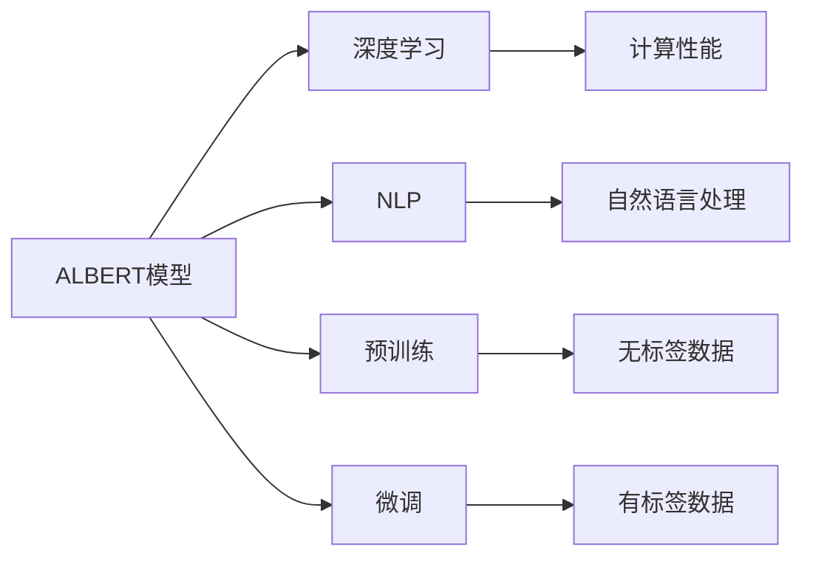

                 

# Transformer大模型实战 训练ALBERT 模型

> 关键词：Transformer, ALBERT, 深度学习, 自然语言处理, 预训练, 微调, 模型优化, 计算性能

## 1. 背景介绍

### 1.1 问题由来
Transformer大模型，特别是BERT等基于自注意力机制的语言模型，已经在自然语言处理(NLP)领域取得了革命性的突破。这些模型通过在大规模无标签文本上预训练，学习到了丰富的语言知识和常识，并通过微调在特定任务上取得了卓越的性能。

然而，尽管这些模型在语言理解和生成方面表现出色，但在计算资源和推理速度方面仍存在挑战。为了应对这一问题，研究人员提出了ALBERT（A Lite BERT）模型，这是一种经过优化的大规模语言模型，在保证高性能的同时，大幅减少了计算资源消耗。

### 1.2 问题核心关键点
本文将深入探讨如何训练和优化ALBERT模型，以实现高效、准确的自然语言处理应用。关键点包括：

1. **ALBERT模型架构**：了解ALBERT模型的设计理念和结构特点。
2. **训练与优化技巧**：掌握ALBERT模型的训练方法和优化策略。
3. **性能分析与评估**：分析ALBERT模型在不同任务上的性能表现。
4. **应用场景探讨**：讨论ALBERT模型在实际应用中的具体场景和效果。

## 2. 核心概念与联系

### 2.1 核心概念概述

为更好地理解ALBERT模型的训练与优化，我们需要对以下核心概念有所了解：

- **ALBERT模型**：一种优化版的BERT模型，通过特定的层分割和参数共享策略，大幅度减小了计算复杂度，同时保持了高性能。
- **深度学习**：利用多层神经网络进行复杂任务求解的技术。
- **自然语言处理(NLP)**：计算机科学和人工智能领域的一个分支，专注于使计算机理解、解释和生成自然语言。
- **预训练**：在无标签数据上训练模型，以学习通用的语言表示。
- **微调**：在预训练模型的基础上，使用有标签数据进一步优化模型，适应特定任务。
- **计算性能**：指模型在推理和训练过程中的计算效率和资源消耗。

这些概念之间的关系可以通过以下Mermaid流程图来展示：



### 2.2 核心概念原理和架构的 Mermaid 流程图


## 3. 核心算法原理 & 具体操作步骤

### 3.1 算法原理概述

ALBERT模型是在BERT的基础上进行优化，通过特殊的层分割和参数共享策略，有效降低了计算复杂度。其核心思想是：

1. **层分割**：将BERT模型的多层隐藏状态分割成较小的块，每个块包含相邻的多个隐藏层。
2. **参数共享**：共享相邻块之间的参数，减少整体参数量。
3. **时间与位置编码**：将时间编码和位置编码合并为一个共享向量，进一步减小参数。

ALBERT模型通过这些优化策略，不仅保持了BERT的高性能，还显著提高了计算效率和资源利用率。

### 3.2 算法步骤详解

ALBERT模型的训练和优化可以分为以下几个步骤：

**Step 1: 准备数据集**
- 收集训练和验证数据集，将文本转换为模型输入所需的格式。

**Step 2: 初始化模型**
- 使用ALBERT预训练模型或从头训练模型，设置模型参数。

**Step 3: 定义损失函数**
- 根据具体任务，选择合适的损失函数，如交叉熵损失、均方误差损失等。

**Step 4: 训练模型**
- 使用优化器（如AdamW），在训练数据上迭代训练模型。
- 在每个epoch上，使用验证数据评估模型性能。

**Step 5: 保存模型**
- 训练完成后，保存模型权重，以便后续使用。

### 3.3 算法优缺点

**优点**：
1. **高效计算**：通过层分割和参数共享，显著降低了计算复杂度和资源消耗。
2. **高性能**：保持了BERT的高性能，在多项NLP任务上表现优异。
3. **通用性强**：可以应用于各种NLP任务，如分类、匹配、生成等。

**缺点**：
1. **模型复杂度较高**：虽然参数量减小，但模型的结构仍然较为复杂，不易理解和调试。
2. **训练时间长**：由于计算复杂度较低，需要较长时间进行训练。
3. **模型可解释性不足**：ALBERT模型的内部机制相对复杂，难以直接解释模型的决策过程。

### 3.4 算法应用领域

ALBERT模型在多个NLP任务上表现出色，特别适用于资源受限的环境，如移动设备、嵌入式系统等。其主要应用领域包括：

- **文本分类**：如情感分析、主题分类等。
- **命名实体识别**：识别文本中的人名、地名、机构名等特定实体。
- **关系抽取**：从文本中抽取实体之间的语义关系。
- **问答系统**：对自然语言问题给出答案。
- **机器翻译**：将源语言文本翻译成目标语言。
- **文本摘要**：将长文本压缩成简短摘要。
- **对话系统**：使机器能够与人自然对话。

## 4. 数学模型和公式 & 详细讲解 & 举例说明

### 4.1 数学模型构建

ALBERT模型的核心是自注意力机制和全连接层。以ALBERT的Base版本为例，其包含12个Transformer层，每个层包含2个self-attention块和2个全连接层，每个block包含12个残差连接和1个归一化层。

ALBERT模型的输入为词嵌入向量，输出为预测结果。对于具体任务，通常会添加额外的分类器或解码器，并在训练时使用相应的损失函数。

### 4.2 公式推导过程

ALBERT模型的公式推导与BERT类似，具体公式如下：

$$
H = \mathrm{LayerNorm}(\mathrm{SelfAttention}(\mathrm{Preprocess}(X)))
$$

$$
Z = \mathrm{LayerNorm}(\mathrm{FeedForward}(H))
$$

其中，$\mathrm{SelfAttention}$和$\mathrm{FeedForward}$分别表示自注意力机制和前馈层，$\mathrm{LayerNorm}$表示归一化层。

以文本分类任务为例，设模型输入为$X \in \mathbb{R}^{L \times D}$，其中$L$为序列长度，$D$为词嵌入维度。模型的输出为$Y \in \mathbb{R}^{L \times D}$。

分类器的输出为$\mathrm{softmax}(W^TX + b)$，其中$W$和$b$为分类器参数。

训练时，使用交叉熵损失函数$\mathcal{L}=\mathrm{CE}(Y,\hat{Y})$进行优化，其中$\hat{Y}$为模型的预测结果。

### 4.3 案例分析与讲解

以下以ALBERT模型在情感分析任务上的微调为例，详细讲解微调过程。

**Step 1: 准备数据集**
- 收集情感分析数据集，将文本数据转换为模型输入所需的格式。
- 将数据集分为训练集、验证集和测试集。

**Step 2: 初始化模型**
- 使用ALBERT预训练模型或从头训练模型，设置模型参数。
- 使用AdamW优化器，设置学习率等超参数。

**Step 3: 定义损失函数**
- 使用交叉熵损失函数，定义模型预测与真实标签之间的差异。

**Step 4: 训练模型**
- 在训练集上迭代训练模型，使用验证集评估模型性能。
- 调整学习率等超参数，防止过拟合。

**Step 5: 保存模型**
- 训练完成后，保存模型权重，以便后续使用。

## 5. 项目实践：代码实例和详细解释说明

### 5.1 开发环境搭建

为了进行ALBERT模型的训练和优化，需要准备好开发环境。以下是使用Python进行TensorFlow和TensorBoard开发的流程：

1. 安装Anaconda：从官网下载并安装Anaconda，用于创建独立的Python环境。

2. 创建并激活虚拟环境：
```bash
conda create -n tf-env python=3.8 
conda activate tf-env
```

3. 安装TensorFlow：根据CUDA版本，从官网获取对应的安装命令。例如：
```bash
pip install tensorflow
```

4. 安装TensorBoard：
```bash
pip install tensorboard
```

5. 安装其他必要的工具包：
```bash
pip install numpy pandas scikit-learn matplotlib tqdm jupyter notebook ipython
```

完成上述步骤后，即可在`tf-env`环境中开始ALBERT模型的训练和优化。

### 5.2 源代码详细实现

我们以ALBERT模型在情感分析任务上的微调为例，给出TensorFlow的代码实现。

```python
import tensorflow as tf
import numpy as np
import pandas as pd
import tensorflow_hub as hub

# 加载数据集
df = pd.read_csv('sentiment_analysis.csv')
X = df['text'].tolist()
y = df['label'].tolist()

# 分词器
tokenizer = hub.load("https://tfhub.dev/google/albert-base-uncased/2")

# 构建输入流水线
def encode_text(text):
    return tokenizer.tokenize(text)

# 定义模型
class ALBERTModel(tf.keras.Model):
    def __init__(self):
        super(ALBERTModel, self).__init__()
        self.albert = hub.KerasLayer('https://tfhub.dev/google/albert-base-uncased/2')
        self.dense = tf.keras.layers.Dense(1, activation='sigmoid')
    
    def call(self, x):
        x = self.albert(x)
        return self.dense(x)

# 定义损失函数和优化器
model = ALBERTModel()
loss_fn = tf.keras.losses.BinaryCrossentropy()
optimizer = tf.keras.optimizers.AdamW(learning_rate=2e-5)

# 定义训练函数
@tf.function
def train_step(input_ids, labels):
    with tf.GradientTape() as tape:
        predictions = model(input_ids)
        loss = loss_fn(labels, predictions)
    gradients = tape.gradient(loss, model.trainable_variables)
    optimizer.apply_gradients(zip(gradients, model.trainable_variables))

# 定义评估函数
def evaluate(input_ids, labels):
    predictions = model(input_ids)
    loss = loss_fn(labels, predictions)
    return loss

# 训练和评估
epochs = 10
batch_size = 32

for epoch in range(epochs):
    for i in range(0, len(X), batch_size):
        batch_input_ids = encode_text(X[i:i+batch_size])
        labels = np.array([int(l) for l in y[i:i+batch_size]])
        train_step(batch_input_ids, labels)
    val_loss = evaluate(encode_text(X), np.array(y))
    print(f'Epoch {epoch+1}, validation loss: {val_loss:.4f}')

print('Training complete.')
```

### 5.3 代码解读与分析

让我们再详细解读一下关键代码的实现细节：

**ALBERTModel类**：
- 继承自`tf.keras.Model`，定义模型的输入和输出。
- 使用`hub.KerasLayer`加载ALBERT预训练模型，作为模型的隐藏层。
- 在顶层添加全连接层，输出二分类预测结果。

**训练函数**：
- 使用`tf.GradientTape`自动求导，计算模型损失和梯度。
- 使用`optimizer.apply_gradients`更新模型参数。
- 训练函数被`@tf.function`装饰，以利用TensorFlow的JIT编译优化性能。

**评估函数**：
- 直接计算模型的损失，评估模型在验证集上的性能。

**训练流程**：
- 循环迭代训练和评估过程，每个epoch输出验证集的损失。
- 使用`tf.function`优化训练和评估的性能。

## 6. 实际应用场景

### 6.1 智能客服系统

ALBERT模型可以应用于智能客服系统的构建，帮助机器理解客户意图，提供更自然流畅的对话。通过微调ALBERT模型，系统可以学习到特定的客服场景下的语言知识，提高对话的准确性和人性化程度。

**具体实现**：
- 收集历史客服对话记录，将问题和最佳答复构建成监督数据。
- 使用ALBERT模型作为初始化参数，在客服场景数据上进行微调。
- 微调后的模型能够理解客户意图，匹配最合适的答案模板进行回复。

### 6.2 金融舆情监测

ALBERT模型可以用于金融舆情监测，帮助金融机构实时监测市场舆论动向，规避金融风险。通过微调ALBERT模型，模型能够自动判断文本属于何种主题，情感倾向是正面、中性还是负面，从而预警潜在的风险。

**具体实现**：
- 收集金融领域相关的新闻、报道、评论等文本数据，并对其进行主题标注和情感标注。
- 使用ALBERT模型作为初始化参数，在金融舆情数据上进行微调。
- 微调后的模型能够实时监测不同主题下的情感变化趋势，一旦发现负面信息激增等异常情况，系统便会自动预警。

### 6.3 个性化推荐系统

ALBERT模型可以用于个性化推荐系统的构建，帮助推荐系统理解用户兴趣，提供更精准、多样的推荐内容。通过微调ALBERT模型，系统可以学习到用户的兴趣点和行为习惯，从而提供更个性化的推荐结果。

**具体实现**：
- 收集用户浏览、点击、评论、分享等行为数据，提取和用户交互的物品标题、描述、标签等文本内容。
- 使用ALBERT模型作为初始化参数，在推荐系统数据上进行微调。
- 微调后的模型能够从文本内容中准确把握用户的兴趣点，生成更个性化的推荐列表。

### 6.4 未来应用展望

随着ALBERT模型的不断发展，其应用领域将更加广泛。未来，ALBERT模型可能会在更多领域得到应用，如智慧医疗、智能教育、智慧城市治理等，为各行各业带来新的变革。

## 7. 工具和资源推荐

### 7.1 学习资源推荐

为了帮助开发者掌握ALBERT模型的训练与优化，这里推荐一些优质的学习资源：

1. **《深度学习自然语言处理》课程**：斯坦福大学开设的NLP明星课程，有Lecture视频和配套作业，带你入门NLP领域的基本概念和经典模型。

2. **Transformers库官方文档**：详细介绍了ALBERT模型的结构、使用方法和优化技巧，是进行微调任务开发的必备资料。

3. **TensorFlow官方文档**：提供了丰富的TensorFlow学习资源，包括ALBERT模型的应用实例和优化技巧。

4. **《Transformers from Scratch》博客系列**：由大模型技术专家撰写，深入浅出地介绍了ALBERT模型等大模型的原理、训练与优化技巧。

### 7.2 开发工具推荐

高效的开发离不开优秀的工具支持。以下是几款用于ALBERT模型训练和优化的常用工具：

1. **TensorFlow**：基于Python的开源深度学习框架，支持分布式训练和优化，适合大规模工程应用。

2. **TensorBoard**：TensorFlow配套的可视化工具，可实时监测模型训练状态，提供丰富的图表呈现方式。

3. **Jupyter Notebook**：交互式开发环境，适合编写和调试代码，可视化分析模型性能。

4. **Github**：版本控制工具，方便协同开发和共享代码。

合理利用这些工具，可以显著提升ALBERT模型微调任务的开发效率，加快创新迭代的步伐。

### 7.3 相关论文推荐

ALBERT模型的提出和大规模应用，离不开学界的持续研究。以下是几篇奠基性的相关论文，推荐阅读：

1. **《ALBERT: A Lite BERT for Self-supervised Learning of Language Representations》**：提出ALBERT模型，详细介绍了模型的架构和优化策略。

2. **《Scalable and Efficient Methods for Transformer-Language Model Generation》**：讨论了ALBERT模型的计算复杂度和优化技巧，提供了进一步优化的方向。

3. **《Language Models are Unsupervised Multitask Learners》**：展示了ALBERT模型在零样本和少样本学习中的优异表现，进一步推动了大模型应用的研究。

通过学习这些前沿成果，可以帮助研究者把握学科前进方向，激发更多的创新灵感。

## 8. 总结：未来发展趋势与挑战

### 8.1 研究成果总结

本文对ALBERT模型的训练和优化方法进行了全面系统的介绍。通过详细介绍ALBERT模型的架构、训练过程和优化策略，展示了其高效、高性能的特征。同时，通过分析ALBERT模型在实际应用中的表现和应用场景，强调了其在大规模NLP任务中的重要性。

### 8.2 未来发展趋势

展望未来，ALBERT模型的发展趋势将体现在以下几个方面：

1. **更高效的计算方式**：未来的ALBERT模型将更加注重计算效率，引入更多硬件优化和并行计算技术，提高推理速度和资源利用率。

2. **更广泛的应用场景**：ALBERT模型将在更多领域得到应用，如智慧医疗、智能教育、智慧城市治理等，为各行各业带来新的变革。

3. **更多的优化方法**：未来的优化方法将更加多样，包括参数高效微调、零样本学习、少样本学习等，进一步提升模型的性能和泛化能力。

4. **更强的可解释性**：未来的模型将更注重可解释性，通过引入因果分析和博弈论工具，增强模型的透明度和可信度。

### 8.3 面临的挑战

尽管ALBERT模型在计算效率和性能方面表现出色，但在实际应用中也面临一些挑战：

1. **资源瓶颈**：虽然计算复杂度较低，但在资源受限的环境中，模型的推理速度和资源消耗仍需进一步优化。

2. **可解释性不足**：ALBERT模型的内部机制较为复杂，难以直接解释模型的决策过程，这可能影响其在高风险领域的应用。

3. **数据依赖**：虽然数据需求较低，但在某些领域，数据质量和多样性仍可能成为制约因素。

4. **安全风险**：ALBERT模型可能学习到有害信息，需要通过数据筛选和模型设计来避免模型输出有害内容。

### 8.4 研究展望

未来的研究需要在以下几个方面进行探索：

1. **更强的数据处理能力**：通过引入多模态数据处理和知识图谱，提升模型的数据处理能力和知识整合能力。

2. **更高效的计算资源**：引入硬件优化和并行计算技术，进一步提升模型的计算效率和资源利用率。

3. **更强的可解释性**：通过引入因果分析和博弈论工具，增强模型的透明度和可信度，提高模型在实际应用中的安全性。

通过不断突破技术瓶颈，提升ALBERT模型的性能和应用范围，相信其将在未来的NLP领域中发挥更大的作用，为人工智能技术的普及和应用带来新的突破。

## 9. 附录：常见问题与解答

**Q1：ALBERT模型与BERT模型的区别是什么？**

A: ALBERT模型是BERT的优化版本，主要区别在于：
1. 层分割和参数共享：ALBERT通过层分割和参数共享，显著降低了计算复杂度。
2. 时间与位置编码：ALBERT将时间编码和位置编码合并为一个共享向量，进一步减小了参数。

**Q2：ALBERT模型在微调时需要注意哪些问题？**

A: 在微调ALBERT模型时，需要注意以下问题：
1. 学习率选择：ALBERT模型的层数较少，通常需要较长时间进行训练，建议从较小的学习率开始，逐步增大。
2. 数据预处理：确保数据格式符合模型要求，避免过拟合和欠拟合。
3. 模型保存与部署：训练完成后，保存模型权重，以便后续使用。部署时，需要考虑推理速度和资源消耗。

**Q3：ALBERT模型在实际应用中如何保证模型的鲁棒性和泛化能力？**

A: 为了保证ALBERT模型的鲁棒性和泛化能力，可以采取以下措施：
1. 数据增强：通过回译、近义替换等方式扩充训练集。
2. 正则化：使用L2正则、Dropout、Early Stopping等避免过拟合。
3. 对抗训练：引入对抗样本，提高模型鲁棒性。
4. 参数高效微调：只调整少量参数，减小过拟合风险。

这些策略需要根据具体任务和数据特点进行灵活组合。只有在数据、模型、训练、推理等各环节进行全面优化，才能最大限度地发挥ALBERT模型的威力。

---

作者：禅与计算机程序设计艺术 / Zen and the Art of Computer Programming

