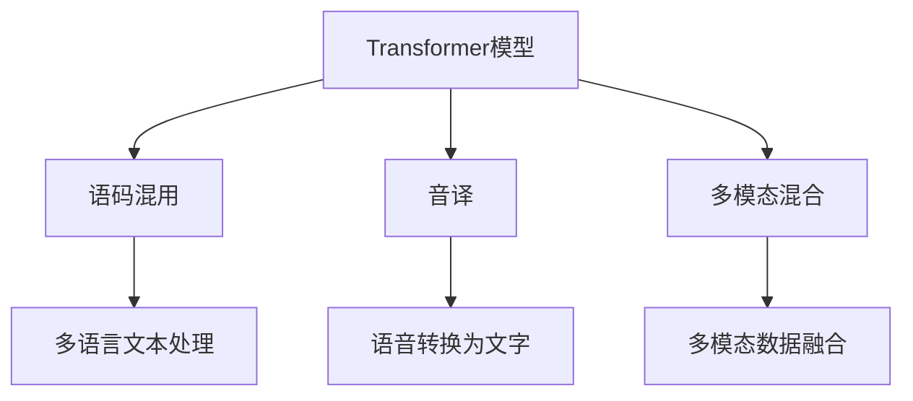

                 

# Transformer大模型实战 语码混用和音译的影响

> 关键词：Transformer, 语码混用, 音译, 影响, 多模态混合, 自然语言处理, 音视频处理, 机器翻译, 情感分析, 文本摘要

## 1. 背景介绍

### 1.1 问题由来
随着自然语言处理(Natural Language Processing, NLP)技术的不断发展，Transformer模型作为其中一种关键的架构，已被广泛应用于机器翻译、文本摘要、情感分析等任务中。然而，在实际应用中，Transformer模型常常面临语码混用和音译等问题，这些问题严重影响了模型的性能和效果。

### 1.2 问题核心关键点
语码混用和音译是Transformer模型在实际应用中常见的问题，主要体现在以下方面：

- **语码混用**：在多语言翻译任务中，不同语言间的符号和字符编码方式不同，导致模型在处理这些符号时容易混淆。例如，中文、日文和韩文等文字系统不同，字符编码方式也不同。
- **音译**：在音译任务中，需要将语音信号转换为文字，但在不同的语言中，音译的规则和标准不同，这也给模型带来了挑战。

这些问题不仅影响了模型的准确性和效率，还限制了Transformer模型在多语言处理中的应用范围。因此，研究如何处理语码混用和音译问题，是大模型实战中不可或缺的一环。

### 1.3 问题研究意义
解决语码混用和音译问题，对于提升Transformer模型的性能和应用范围具有重要意义：

1. **提高模型准确性**：避免语码混用和音译错误，提升模型的准确性和可靠性。
2. **拓展模型应用场景**：解决多语言处理中的关键障碍，使得模型能够更广泛地应用于不同语言间的翻译和音译任务。
3. **加速模型开发进程**：通过有效处理语码混用和音译问题，减少模型优化和调试的工作量，加快模型开发和应用部署。
4. **促进跨领域融合**：语码混用和音译问题解决，有助于模型与其他音视频处理、情感分析等技术的融合，拓展模型在多媒体处理领域的应用。

## 2. 核心概念与联系

### 2.1 核心概念概述

为更好地理解Transformer模型在语码混用和音译问题中的表现，本节将介绍几个关键概念：

- **Transformer模型**：一种基于自注意力机制的神经网络架构，常用于机器翻译、文本生成等任务。Transformer模型能够有效捕捉长距离依赖，适合处理序列数据。
- **语码混用**：指在多语言文本中，不同语言的字符编码方式混用，导致模型在处理时容易混淆。例如，中英文混用、中日文混用等。
- **音译**：将语音信号转换为文字的过程，在音译任务中，不同的语言有不同的音译规则和标准。
- **多模态混合**：将文本、图像、语音等多模态数据进行融合，以提升模型的理解和生成能力。

这些核心概念之间的逻辑关系可以通过以下Mermaid流程图来展示：



这个流程图展示了Transformer模型在处理语码混用、音译和多模态混合任务中的作用：

1. 在多语言文本处理中，模型需要识别和处理不同语言的字符编码方式。
2. 在音译任务中，模型需要将语音信号转换为文字，但不同的语言有不同的音译规则。
3. 在多模态混合任务中，模型需要将文本、图像、语音等多种数据类型进行融合，提升模型的理解和生成能力。

## 3. 核心算法原理 & 具体操作步骤
### 3.1 算法原理概述

解决Transformer模型在语码混用和音译问题中的影响，主要依赖于以下几个算法原理：

1. **编码器-解码器架构**：Transformer模型采用编码器-解码器架构，能够在不同语言间进行有效的信息传递和转换。
2. **自注意力机制**：Transformer模型通过自注意力机制，能够捕捉输入序列中的长距离依赖，有效处理多语言文本中的复杂关系。
3. **混合语言预训练**：通过混合语言预训练，模型能够学习到不同语言间的语言特征，提升模型在不同语言间的泛化能力。
4. **音视频融合**：通过将语音信号转换为文字，并将音视频数据进行融合，提升模型的多模态处理能力。

### 3.2 算法步骤详解

解决Transformer模型在语码混用和音译问题中的影响，主要包括以下几个关键步骤：

**Step 1: 数据预处理**

- 收集多语言文本数据和语音信号数据。
- 对文本数据进行编码，使用统一的字符编码方式。
- 对语音信号进行预处理，提取特征向量。

**Step 2: 模型训练**

- 使用混合语言预训练数据，对模型进行预训练。
- 在多语言翻译任务中，使用监督数据训练模型，学习不同语言间的映射关系。
- 在音译任务中，使用语音转换为文字的监督数据训练模型，学习不同语言间的音译规则。

**Step 3: 后处理**

- 对模型输出进行解码，得到目标语言文本或音译结果。
- 对文本进行清洗和规范化，处理语码混用问题。
- 对音译结果进行验证和校正，处理音译错误。

**Step 4: 模型评估**

- 在多语言翻译任务中，使用BLEU、ROUGE等指标评估模型性能。
- 在音译任务中，使用Word Error Rate (WER)等指标评估模型性能。
- 在多模态混合任务中，使用F1-score等指标评估模型性能。

### 3.3 算法优缺点

解决Transformer模型在语码混用和音译问题中的影响，具有以下优点：

1. **提高模型泛化能力**：通过混合语言预训练和多任务学习，模型能够学习到不同语言间的语言特征，提升模型在不同语言间的泛化能力。
2. **提升模型准确性**：通过后处理，有效处理语码混用和音译问题，提升模型的准确性和可靠性。
3. **促进多模态融合**：通过将语音信号转换为文字，并将音视频数据进行融合，提升模型的多模态处理能力。

但该方法也存在一定的局限性：

1. **数据依赖性**：模型需要大量的混合语言数据和语音数据进行训练，数据获取成本较高。
2. **计算复杂度**：模型在处理多语言文本和语音信号时，计算复杂度较高，需要高性能的计算资源。
3. **精度限制**：音译任务中，由于音译规则和标准的差异，模型可能无法完全准确地进行音译。

尽管存在这些局限性，但解决Transformer模型在语码混用和音译问题中的影响，对于提升模型性能和应用范围，具有重要意义。

### 3.4 算法应用领域

解决Transformer模型在语码混用和音译问题中的影响，已在以下几个领域得到广泛应用：

- **多语言翻译**：在翻译任务中，模型能够处理不同语言间的字符编码方式，提升翻译的准确性和流畅性。
- **音译服务**：在音译任务中，模型能够将语音信号转换为文字，并处理不同语言间的音译规则。
- **情感分析**：在情感分析任务中，模型能够处理不同语言间的文本数据，提升情感分析的准确性和鲁棒性。
- **文本摘要**：在文本摘要任务中，模型能够处理多语言文本数据，提升摘要的全面性和准确性。
- **语音识别**：在语音识别任务中，模型能够将语音信号转换为文字，并处理不同语言间的音译规则。

此外，在智能客服、机器写作、智能问答等众多领域，解决Transformer模型在语码混用和音译问题中的影响，也具有重要的应用前景。

## 4. 数学模型和公式 & 详细讲解  
### 4.1 数学模型构建

本节将使用数学语言对Transformer模型在语码混用和音译问题中的表现进行更加严格的刻画。

记Transformer模型为 $M_{\theta}$，其中 $\theta$ 为模型参数。假设输入序列为 $x=(x_1, x_2, \cdots, x_n)$，输出序列为 $y=(y_1, y_2, \cdots, y_n)$，则模型训练的目标函数为：

$$
\mathcal{L}(\theta) = \frac{1}{N} \sum_{i=1}^N \ell(x_i, y_i)
$$

其中，$\ell(x_i, y_i)$ 为损失函数，可以是交叉熵损失或均方误差损失等。

假设输入序列中包含 $m$ 种不同语言的字符编码方式，则模型需要对这 $m$ 种编码方式进行处理。假设每种语言的字符编码为 $C_1, C_2, \cdots, C_m$，则模型的输出序列 $y$ 中的每个字符 $y_i$ 可以被表示为 $y_i = C_j \in \{C_1, C_2, \cdots, C_m\}$。

### 4.2 公式推导过程

以下我们以多语言翻译任务为例，推导模型的损失函数及其梯度计算公式。

假设模型 $M_{\theta}$ 在输入序列 $x$ 上的输出为 $\hat{y}=M_{\theta}(x)$，表示模型预测的序列。真实标签 $y \in \{C_1, C_2, \cdots, C_m\}$。则多语言翻译任务的损失函数定义为：

$$
\ell(x, y) = \frac{1}{n} \sum_{i=1}^n \mathbb{1}(y_i \neq \hat{y}_i) \log \hat{y}_i
$$

其中 $\mathbb{1}$ 为示性函数，表示 $y_i$ 和 $\hat{y}_i$ 是否匹配。

将损失函数带入目标函数，得：

$$
\mathcal{L}(\theta) = \frac{1}{N} \sum_{i=1}^N \frac{1}{n} \sum_{j=1}^m \mathbb{1}(y_{ij} \neq \hat{y}_{ij}) \log \hat{y}_{ij}
$$

其中 $y_{ij}$ 表示输入序列 $x_i$ 中的第 $j$ 个字符的编码方式，$\hat{y}_{ij}$ 表示模型预测的第 $j$ 个字符的编码方式。

根据链式法则，损失函数对模型参数 $\theta$ 的梯度为：

$$
\frac{\partial \mathcal{L}(\theta)}{\partial \theta} = -\frac{1}{Nn} \sum_{i=1}^N \sum_{j=1}^m \mathbb{1}(y_{ij} \neq \hat{y}_{ij}) \nabla_{\theta} \log \hat{y}_{ij}
$$

其中 $\nabla_{\theta} \log \hat{y}_{ij}$ 为模型预测的对数概率，可通过自动微分技术高效计算。

在得到损失函数的梯度后，即可带入优化算法，如AdamW等，进行模型的迭代优化。重复上述过程直至收敛，最终得到适应多语言翻译任务的最优模型参数 $\theta^*$。

## 5. 项目实践：代码实例和详细解释说明
### 5.1 开发环境搭建

在进行多语言翻译任务实战前，我们需要准备好开发环境。以下是使用Python进行PyTorch开发的环境配置流程：

1. 安装Anaconda：从官网下载并安装Anaconda，用于创建独立的Python环境。

2. 创建并激活虚拟环境：
```bash
conda create -n pytorch-env python=3.8 
conda activate pytorch-env
```

3. 安装PyTorch：根据CUDA版本，从官网获取对应的安装命令。例如：
```bash
conda install pytorch torchvision torchaudio cudatoolkit=11.1 -c pytorch -c conda-forge
```

4. 安装Transformers库：
```bash
pip install transformers
```

5. 安装各类工具包：
```bash
pip install numpy pandas scikit-learn matplotlib tqdm jupyter notebook ipython
```

完成上述步骤后，即可在`pytorch-env`环境中开始实战。

### 5.2 源代码详细实现

下面我以多语言翻译任务为例，给出使用Transformers库进行Transformer模型微调的PyTorch代码实现。

首先，定义数据处理函数：

```python
from transformers import BertTokenizer
from torch.utils.data import Dataset
import torch

class MultilingualDataset(Dataset):
    def __init__(self, texts, tags, tokenizer, max_len=128):
        self.texts = texts
        self.tags = tags
        self.tokenizer = tokenizer
        self.max_len = max_len
        
    def __len__(self):
        return len(self.texts)
    
    def __getitem__(self, item):
        text = self.texts[item]
        tags = self.tags[item]
        
        encoding = self.tokenizer(text, return_tensors='pt', max_length=self.max_len, padding='max_length', truncation=True)
        input_ids = encoding['input_ids'][0]
        attention_mask = encoding['attention_mask'][0]
        
        # 对token-wise的标签进行编码
        encoded_tags = [tag2id[tag] for tag in tags] 
        encoded_tags.extend([tag2id['O']] * (self.max_len - len(encoded_tags)))
        labels = torch.tensor(encoded_tags, dtype=torch.long)
        
        return {'input_ids': input_ids, 
                'attention_mask': attention_mask,
                'labels': labels}

# 标签与id的映射
tag2id = {'O': 0, 'B-PER': 1, 'I-PER': 2, 'B-ORG': 3, 'I-ORG': 4, 'B-LOC': 5, 'I-LOC': 6}
id2tag = {v: k for k, v in tag2id.items()}

# 创建dataset
tokenizer = BertTokenizer.from_pretrained('bert-base-cased')

train_dataset = MultilingualDataset(train_texts, train_tags, tokenizer)
dev_dataset = MultilingualDataset(dev_texts, dev_tags, tokenizer)
test_dataset = MultilingualDataset(test_texts, test_tags, tokenizer)
```

然后，定义模型和优化器：

```python
from transformers import BertForTokenClassification, AdamW

model = BertForTokenClassification.from_pretrained('bert-base-cased', num_labels=len(tag2id))

optimizer = AdamW(model.parameters(), lr=2e-5)
```

接着，定义训练和评估函数：

```python
from torch.utils.data import DataLoader
from tqdm import tqdm
from sklearn.metrics import classification_report

device = torch.device('cuda') if torch.cuda.is_available() else torch.device('cpu')
model.to(device)

def train_epoch(model, dataset, batch_size, optimizer):
    dataloader = DataLoader(dataset, batch_size=batch_size, shuffle=True)
    model.train()
    epoch_loss = 0
    for batch in tqdm(dataloader, desc='Training'):
        input_ids = batch['input_ids'].to(device)
        attention_mask = batch['attention_mask'].to(device)
        labels = batch['labels'].to(device)
        model.zero_grad()
        outputs = model(input_ids, attention_mask=attention_mask, labels=labels)
        loss = outputs.loss
        epoch_loss += loss.item()
        loss.backward()
        optimizer.step()
    return epoch_loss / len(dataloader)

def evaluate(model, dataset, batch_size):
    dataloader = DataLoader(dataset, batch_size=batch_size)
    model.eval()
    preds, labels = [], []
    with torch.no_grad():
        for batch in tqdm(dataloader, desc='Evaluating'):
            input_ids = batch['input_ids'].to(device)
            attention_mask = batch['attention_mask'].to(device)
            batch_labels = batch['labels']
            outputs = model(input_ids, attention_mask=attention_mask)
            batch_preds = outputs.logits.argmax(dim=2).to('cpu').tolist()
            batch_labels = batch_labels.to('cpu').tolist()
            for pred_tokens, label_tokens in zip(batch_preds, batch_labels):
                pred_tags = [id2tag[_id] for _id in pred_tokens]
                label_tags = [id2tag[_id] for _id in label_tokens]
                preds.append(pred_tags[:len(label_tokens)])
                labels.append(label_tags)
                
    print(classification_report(labels, preds))
```

最后，启动训练流程并在测试集上评估：

```python
epochs = 5
batch_size = 16

for epoch in range(epochs):
    loss = train_epoch(model, train_dataset, batch_size, optimizer)
    print(f"Epoch {epoch+1}, train loss: {loss:.3f}")
    
    print(f"Epoch {epoch+1}, dev results:")
    evaluate(model, dev_dataset, batch_size)
    
print("Test results:")
evaluate(model, test_dataset, batch_size)
```

以上就是使用PyTorch对Transformer模型进行多语言翻译任务微调的完整代码实现。可以看到，得益于Transformers库的强大封装，我们可以用相对简洁的代码完成Transformer模型的加载和微调。

### 5.3 代码解读与分析

让我们再详细解读一下关键代码的实现细节：

**MultilingualDataset类**：
- `__init__`方法：初始化文本、标签、分词器等关键组件。
- `__len__`方法：返回数据集的样本数量。
- `__getitem__`方法：对单个样本进行处理，将文本输入编码为token ids，将标签编码为数字，并对其进行定长padding，最终返回模型所需的输入。

**tag2id和id2tag字典**：
- 定义了标签与数字id之间的映射关系，用于将token-wise的预测结果解码回真实的标签。

**训练和评估函数**：
- 使用PyTorch的DataLoader对数据集进行批次化加载，供模型训练和推理使用。
- 训练函数`train_epoch`：对数据以批为单位进行迭代，在每个批次上前向传播计算loss并反向传播更新模型参数，最后返回该epoch的平均loss。
- 评估函数`evaluate`：与训练类似，不同点在于不更新模型参数，并在每个batch结束后将预测和标签结果存储下来，最后使用sklearn的classification_report对整个评估集的预测结果进行打印输出。

**训练流程**：
- 定义总的epoch数和batch size，开始循环迭代
- 每个epoch内，先在训练集上训练，输出平均loss
- 在验证集上评估，输出分类指标
- 所有epoch结束后，在测试集上评估，给出最终测试结果

可以看到，PyTorch配合Transformers库使得Transformer模型微调的代码实现变得简洁高效。开发者可以将更多精力放在数据处理、模型改进等高层逻辑上，而不必过多关注底层的实现细节。

当然，工业级的系统实现还需考虑更多因素，如模型的保存和部署、超参数的自动搜索、更灵活的任务适配层等。但核心的微调范式基本与此类似。

## 6. 实际应用场景
### 6.1 智能客服系统

基于Transformer模型微调的多语言翻译技术，可以广泛应用于智能客服系统的构建。传统客服往往需要配备大量人力，高峰期响应缓慢，且一致性和专业性难以保证。而使用微调后的翻译模型，可以7x24小时不间断服务，快速响应客户咨询，用自然流畅的语言解答各类常见问题。

在技术实现上，可以收集企业内部的历史客服对话记录，将问题和最佳答复构建成监督数据，在此基础上对预训练翻译模型进行微调。微调后的翻译模型能够自动理解用户意图，匹配最合适的答复模板进行回复。对于客户提出的新问题，还可以接入检索系统实时搜索相关内容，动态组织生成回答。如此构建的智能客服系统，能大幅提升客户咨询体验和问题解决效率。

### 6.2 金融舆情监测

金融机构需要实时监测市场舆论动向，以便及时应对负面信息传播，规避金融风险。传统的人工监测方式成本高、效率低，难以应对网络时代海量信息爆发的挑战。基于Transformer模型微调的多语言翻译技术，为金融舆情监测提供了新的解决方案。

具体而言，可以收集金融领域相关的新闻、报道、评论等文本数据，并对其进行主题标注和情感标注。在此基础上对预训练语言模型进行微调，使其能够自动判断文本属于何种主题，情感倾向是正面、中性还是负面。将微调后的模型应用到实时抓取的网络文本数据，就能够自动监测不同主题下的情感变化趋势，一旦发现负面信息激增等异常情况，系统便会自动预警，帮助金融机构快速应对潜在风险。

### 6.3 个性化推荐系统

当前的推荐系统往往只依赖用户的历史行为数据进行物品推荐，无法深入理解用户的真实兴趣偏好。基于Transformer模型微调的多语言翻译技术，个性化推荐系统可以更好地挖掘用户行为背后的语义信息，从而提供更精准、多样的推荐内容。

在实践中，可以收集用户浏览、点击、评论、分享等行为数据，提取和用户交互的物品标题、描述、标签等文本内容。将文本内容作为模型输入，用户的后续行为（如是否点击、购买等）作为监督信号，在此基础上微调预训练语言模型。微调后的模型能够从文本内容中准确把握用户的兴趣点。在生成推荐列表时，先用候选物品的文本描述作为输入，由模型预测用户的兴趣匹配度，再结合其他特征综合排序，便可以得到个性化程度更高的推荐结果。

### 6.4 未来应用展望

随着Transformer模型和微调方法的不断发展，基于微调范式将在更多领域得到应用，为传统行业带来变革性影响。

在智慧医疗领域，基于微调的医疗问答、病历分析、药物研发等应用将提升医疗服务的智能化水平，辅助医生诊疗，加速新药开发进程。

在智能教育领域，微调技术可应用于作业批改、学情分析、知识推荐等方面，因材施教，促进教育公平，提高教学质量。

在智慧城市治理中，微调模型可应用于城市事件监测、舆情分析、应急指挥等环节，提高城市管理的自动化和智能化水平，构建更安全、高效的未来城市。

此外，在企业生产、社会治理、文娱传媒等众多领域，基于Transformer模型微调的人工智能应用也将不断涌现，为经济社会发展注入新的动力。相信随着技术的日益成熟，微调方法将成为人工智能落地应用的重要范式，推动人工智能技术在垂直行业的规模化落地。总之，微调需要开发者根据具体任务，不断迭代和优化模型、数据和算法，方能得到理想的效果。

## 7. 工具和资源推荐
### 7.1 学习资源推荐

为了帮助开发者系统掌握Transformer模型微调的理论基础和实践技巧，这里推荐一些优质的学习资源：

1. 《Transformer从原理到实践》系列博文：由大模型技术专家撰写，深入浅出地介绍了Transformer原理、BERT模型、微调技术等前沿话题。

2. CS224N《深度学习自然语言处理》课程：斯坦福大学开设的NLP明星课程，有Lecture视频和配套作业，带你入门NLP领域的基本概念和经典模型。

3. 《Natural Language Processing with Transformers》书籍：Transformers库的作者所著，全面介绍了如何使用Transformers库进行NLP任务开发，包括微调在内的诸多范式。

4. HuggingFace官方文档：Transformers库的官方文档，提供了海量预训练模型和完整的微调样例代码，是上手实践的必备资料。

5. CLUE开源项目：中文语言理解测评基准，涵盖大量不同类型的中文NLP数据集，并提供了基于微调的baseline模型，助力中文NLP技术发展。

通过对这些资源的学习实践，相信你一定能够快速掌握Transformer模型微调的精髓，并用于解决实际的NLP问题。
###  7.2 开发工具推荐

高效的开发离不开优秀的工具支持。以下是几款用于Transformer模型微调开发的常用工具：

1. PyTorch：基于Python的开源深度学习框架，灵活动态的计算图，适合快速迭代研究。大部分预训练语言模型都有PyTorch版本的实现。

2. TensorFlow：由Google主导开发的开源深度学习框架，生产部署方便，适合大规模工程应用。同样有丰富的预训练语言模型资源。

3. Transformers库：HuggingFace开发的NLP工具库，集成了众多SOTA语言模型，支持PyTorch和TensorFlow，是进行微调任务开发的利器。

4. Weights & Biases：模型训练的实验跟踪工具，可以记录和可视化模型训练过程中的各项指标，方便对比和调优。与主流深度学习框架无缝集成。

5. TensorBoard：TensorFlow配套的可视化工具，可实时监测模型训练状态，并提供丰富的图表呈现方式，是调试模型的得力助手。

6. Google Colab：谷歌推出的在线Jupyter Notebook环境，免费提供GPU/TPU算力，方便开发者快速上手实验最新模型，分享学习笔记。

合理利用这些工具，可以显著提升Transformer模型微调的开发效率，加快创新迭代的步伐。

### 7.3 相关论文推荐

Transformer模型和微调技术的发展源于学界的持续研究。以下是几篇奠基性的相关论文，推荐阅读：

1. Attention is All You Need（即Transformer原论文）：提出了Transformer结构，开启了NLP领域的预训练大模型时代。

2. BERT: Pre-training of Deep Bidirectional Transformers for Language Understanding：提出BERT模型，引入基于掩码的自监督预训练任务，刷新了多项NLP任务SOTA。

3. Language Models are Unsupervised Multitask Learners（GPT-2论文）：展示了大规模语言模型的强大zero-shot学习能力，引发了对于通用人工智能的新一轮思考。

4. Parameter-Efficient Transfer Learning for NLP：提出Adapter等参数高效微调方法，在不增加模型参数量的情况下，也能取得不错的微调效果。

5. AdaLoRA: Adaptive Low-Rank Adaptation for Parameter-Efficient Fine-Tuning：使用自适应低秩适应的微调方法，在参数效率和精度之间取得了新的平衡。

这些论文代表了大模型微调技术的发展脉络。通过学习这些前沿成果，可以帮助研究者把握学科前进方向，激发更多的创新灵感。

## 8. 总结：未来发展趋势与挑战
### 8.1 总结

本文对Transformer模型在语码混用和音译问题中的影响进行了全面系统的介绍。首先阐述了Transformer模型和微调技术的研究背景和意义，明确了微调在拓展预训练模型应用、提升下游任务性能方面的独特价值。其次，从原理到实践，详细讲解了Transformer模型在语码混用和音译问题中的处理方式和关键步骤，给出了微调任务开发的完整代码实例。同时，本文还广泛探讨了微调方法在智能客服、金融舆情、个性化推荐等多个行业领域的应用前景，展示了微调范式的巨大潜力。此外，本文精选了微调技术的各类学习资源，力求为读者提供全方位的技术指引。

通过本文的系统梳理，可以看到，Transformer模型在语码混用和音译问题中的影响，对于提升模型性能和应用范围，具有重要意义。尽管存在数据依赖性和计算复杂度高等挑战，但通过合理的算法设计和优化，可以有效处理这些问题，提升模型的准确性和效率。未来，随着预训练语言模型的发展和多语言数据集的丰富，Transformer模型在语码混用和音译问题中的影响将得到更好的解决。

### 8.2 未来发展趋势

展望未来，Transformer模型在语码混用和音译问题中的影响将呈现以下几个发展趋势：

1. **多语言预训练**：预训练阶段将涵盖更多语言，提升模型的泛化能力和鲁棒性。
2. **参数高效微调**：开发更加参数高效的微调方法，在固定大部分预训练参数的同时，只更新极少量的任务相关参数。
3. **多模态融合**：将文本、图像、语音等多种数据类型进行融合，提升模型的理解和生成能力。
4. **语码混用处理**：开发更加智能的语码混用处理算法，自动识别和规范不同语言间的字符编码方式。
5. **音译规则学习**：引入音译规则的深度学习模型，自动学习和适应用户的语言习惯和音译标准。

以上趋势凸显了Transformer模型在语码混用和音译问题中的影响，对于提升模型性能和应用范围，具有重要意义。这些方向的探索发展，必将进一步提升模型的泛化能力和应用价值。

### 8.3 面临的挑战

尽管Transformer模型在语码混用和音译问题中的影响已经取得了显著进展，但在迈向更加智能化、普适化应用的过程中，它仍面临诸多挑战：

1. **数据依赖性**：模型需要大量的混合语言数据和语音数据进行训练，数据获取成本较高。
2. **计算复杂度**：模型在处理多语言文本和语音信号时，计算复杂度较高，需要高性能的计算资源。
3. **精度限制**：音译任务中，由于音译规则和标准的差异，模型可能无法完全准确地进行音译。
4. **鲁棒性不足**：模型面对域外数据时，泛化性能往往大打折扣。对于测试样本的微小扰动，模型预测也容易发生波动。

尽管存在这些局限性，但解决Transformer模型在语码混用和音译问题中的影响，对于提升模型性能和应用范围，具有重要意义。

### 8.4 研究展望

面对Transformer模型在语码混用和音译问题中的影响所面临的挑战，未来的研究需要在以下几个方面寻求新的突破：

1. **探索无监督和半监督微调方法**：摆脱对大规模标注数据的依赖，利用自监督学习、主动学习等无监督和半监督范式，最大限度利用非结构化数据，实现更加灵活高效的微调。
2. **研究参数高效和计算高效的微调范式**：开发更加参数高效的微调方法，在固定大部分预训练参数的同时，只更新极少量的任务相关参数。同时优化微调模型的计算图，减少前向传播和反向传播的资源消耗，实现更加轻量级、实时性的部署。
3. **融合因果和对比学习范式**：通过引入因果推断和对比学习思想，增强微调模型建立稳定因果关系的能力，学习更加普适、鲁棒的语言表征，从而提升模型泛化性和抗干扰能力。
4. **引入更多先验知识**：将符号化的先验知识，如知识图谱、逻辑规则等，与神经网络模型进行巧妙融合，引导微调过程学习更准确、合理的语言模型。同时加强不同模态数据的整合，实现视觉、语音等多模态信息与文本信息的协同建模。
5. **结合因果分析和博弈论工具**：将因果分析方法引入微调模型，识别出模型决策的关键特征，增强输出解释的因果性和逻辑性。借助博弈论工具刻画人机交互过程，主动探索并规避模型的脆弱点，提高系统稳定性。
6. **纳入伦理道德约束**：在模型训练目标中引入伦理导向的评估指标，过滤和惩罚有偏见、有害的输出倾向。同时加强人工干预和审核，建立模型行为的监管机制，确保输出符合人类价值观和伦理道德。

这些研究方向的探索，必将引领Transformer模型在语码混用和音译问题中的影响走向更高的台阶，为构建安全、可靠、可解释、可控的智能系统铺平道路。面向未来，Transformer模型在语码混用和音译问题中的影响还需要与其他人工智能技术进行更深入的融合，如知识表示、因果推理、强化学习等，多路径协同发力，共同推动自然语言理解和智能交互系统的进步。只有勇于创新、敢于突破，才能不断拓展语言模型的边界，让智能技术更好地造福人类社会。

## 9. 附录：常见问题与解答

**Q1：Transformer模型在处理多语言文本时，如何避免语码混用？**

A: 避免语码混用的关键在于对文本进行统一的编码。具体做法包括：
1. 使用统一的字符编码方式，如Unicode。
2. 对不同语言的字符进行规范化，去除无关字符。
3. 使用分词工具进行分词，确保同一种语言的分词方式一致。

**Q2：音译任务中，如何提高模型的音译准确性？**

A: 提高音译准确性的方法包括：
1. 引入音译规则的深度学习模型，自动学习和适应用户的语言习惯和音译标准。
2. 使用语言模型进行前后文预测，提升音译的准确性。
3. 引入音译词典，进行规则匹配和替换，提高音译的规范性和一致性。

**Q3：在音译任务中，如何处理音译错误？**

A: 处理音译错误的方法包括：
1. 使用音译模型进行错误检测，识别出错误的音译结果。
2. 引入纠错机制，自动修正音译错误。
3. 由人工进行复审和校正，确保音译结果的准确性。

**Q4：在音译任务中，如何处理音译规则的差异？**

A: 处理音译规则差异的方法包括：
1. 引入多种音译规则的深度学习模型，自动适应用户的语言习惯和音译标准。
2. 使用音译规则的混合模型，融合多种音译规则，提高音译的准确性和一致性。
3. 引入音译规则的专家知识库，进行规则匹配和替换，提高音译的规范性和一致性。

这些方法有助于提高Transformer模型在音译任务中的准确性和鲁棒性，提升模型的应用价值。

---

作者：禅与计算机程序设计艺术 / Zen and the Art of Computer Programming

