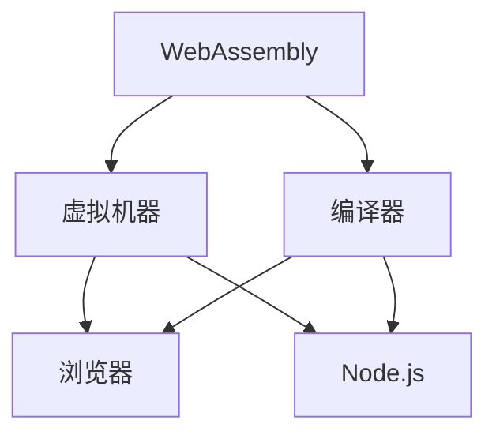

                 

# WebAssembly：Web平台的高性能编程

> 关键词：WebAssembly, 浏览器, 高性能, 跨平台, 编译器, Emscripten, 字节码, 虚拟机器, 高性能计算, 前端开发, WebAssembly API

## 1. 背景介绍

### 1.1 问题由来

在过去几年中，Web技术的发展取得了显著的进步，尤其是HTML5、CSS3和JavaScript的普及，使得Web应用逐渐具备了与原生应用相媲美的性能和体验。然而，JavaScript在执行复杂计算任务时，由于其解释性执行的性质，性能仍有提升空间。

为了解决这一问题，WebAssembly应运而生。WebAssembly（简称Wasm）是一种低级字节码格式，旨在提供接近原生执行速度的性能。Wasm可以在浏览器、Node.js、移动设备等平台上运行，从而使得Web开发能够充分利用现代计算机的计算能力。

### 1.2 问题核心关键点

WebAssembly的核心概念包括以下几点：

- **低级字节码**：WebAssembly是一种二进制格式，能够在浏览器中以高效的机器码运行，避免了JavaScript解释器带来的性能损失。
- **跨平台兼容性**：Wasm在多个平台之间具有良好的兼容性，包括浏览器、Node.js和移动设备。
- **编译器**：Wasm需要编译器将其源代码转换成字节码，常用的编译器包括LLVM、Emscripten等。
- **虚拟机器**：Wasm由虚拟机器执行，每个平台都有一个对应的执行引擎。
- **高性能计算**：Wasm的执行速度几乎与原生代码相同，可以处理复杂的计算任务。
- **前端开发**：Wasm不仅可以用于后端计算，也可以在前端开发中提升应用性能。

这些核心概念构成了WebAssembly的完整生态系统，使得Web开发能够利用现代计算机的计算能力，提升Web应用的性能和效率。

### 1.3 问题研究意义

WebAssembly的出现，对Web开发领域产生了深远的影响。以下是WebAssembly的研究意义：

- **性能提升**：通过编译器将高级语言代码转换成低级字节码，Wasm在性能上接近原生代码，使得复杂计算任务在Web上也能快速执行。
- **跨平台兼容性**：Wasm能够在多个平台上高效运行，打破了JavaScript的性能瓶颈，提升了Web应用的跨平台能力。
- **前端开发**：Wasm使得前端开发能够直接使用C/C++等高性能语言，提高了开发效率。
- **生态系统**：Wasm的广泛应用，推动了Web平台技术的发展，形成了完整的生态系统。

## 2. 核心概念与联系

### 2.1 核心概念概述

为了更好地理解WebAssembly，本节将介绍几个关键概念：

- **WebAssembly**：一种二进制格式，能够在浏览器中以高效的机器码运行。
- **编译器**：将高级语言代码转换成Wasm字节码的工具。
- **虚拟机器**：执行Wasm字节码的平台特定执行引擎。
- **Emscripten**：一个编译器，将C/C++等语言转换成Wasm字节码。
- **LLVM**：一个编译器，支持多种语言到Wasm的转换。

这些概念之间的联系可以通过以下Mermaid流程图来展示：



这个流程图展示了WebAssembly的核心概念及其之间的联系：

1. WebAssembly通过编译器转换成低级字节码。
2. 低级字节码由虚拟机器执行，并在浏览器、Node.js等平台上运行。
3. Emscripten是常见的编译器之一，将C/C++等语言转换成Wasm字节码。
4. LLVM是另一个编译器，支持多种语言到Wasm的转换。

## 3. 核心算法原理 & 具体操作步骤
### 3.1 算法原理概述

WebAssembly的核心算法原理包括以下几个方面：

- **低级字节码格式**：Wasm采用二进制格式，每个指令和数据类型都有一组固定的编码，这些编码可以在不同平台之间直接使用。
- **虚拟机执行**：Wasm由虚拟机器执行，每个平台都有一个对应的执行引擎。虚拟机器负责解释和执行Wasm字节码。
- **编译器**：将高级语言代码转换成Wasm字节码的过程称为编译。编译器通常包括前端编译器和后端编译器。前端编译器将源代码转换成中间表示，后端编译器将中间表示转换成Wasm字节码。
- **跨平台兼容性**：Wasm能够在多个平台上高效运行，包括浏览器、Node.js和移动设备。

### 3.2 算法步骤详解

WebAssembly的算法步骤主要包括以下几个环节：

1. **编写源代码**：使用C/C++等语言编写源代码。
2. **前端编译**：使用前端编译器将源代码转换成中间表示。
3. **后端编译**：使用后端编译器将中间表示转换成Wasm字节码。
4. **加载执行**：使用WebAssembly API将Wasm字节码加载到浏览器中，并执行。
5. **性能优化**：对执行过程中进行优化，提高性能。

### 3.3 算法优缺点

WebAssembly的算法优点包括：

- **高性能**：Wasm的执行速度接近原生代码，能够处理复杂的计算任务。
- **跨平台**：Wasm能够在多个平台上高效运行，打破了JavaScript的性能瓶颈。
- **前端开发**：Wasm使得前端开发能够直接使用C/C++等高性能语言，提高了开发效率。

WebAssembly的算法缺点包括：

- **学习曲线陡峭**：Wasm的底层实现较为复杂，学习成本较高。
- **生态系统不完善**：虽然Wasm具备良好的前景，但其生态系统尚未完全成熟，许多库和工具还不完善。
- **内存管理复杂**：Wasm的内存管理较为复杂，需要开发者自行管理内存。

### 3.4 算法应用领域

WebAssembly在多个领域中得到了广泛应用，以下是几个典型的应用场景：

- **图形处理**：Wasm可以用来加速图形处理任务，如3D渲染、图像处理等。
- **游戏开发**：Wasm在游戏开发中得到了广泛应用，能够提供接近原生代码的性能。
- **大数据处理**：Wasm可以用来处理大规模数据集，加速数据计算任务。
- **机器学习**：Wasm可以用来加速机器学习模型的训练和推理过程。
- **Web应用**：Wasm可以在Web应用中提升性能，特别是处理复杂的计算任务。

## 4. 数学模型和公式 & 详细讲解 & 举例说明

### 4.1 数学模型构建

Wasm的数学模型主要包括以下几个方面：

- **二进制格式**：Wasm采用二进制格式，每个指令和数据类型都有一组固定的编码。
- **虚拟机器**：Wasm由虚拟机器执行，每个平台都有一个对应的执行引擎。
- **中间表示**：中间表示是编译器将高级语言代码转换成Wasm字节码的中间过程。

### 4.2 公式推导过程

以下是Wasm的一些核心指令和数据类型的编码，这些编码是Wasm二进制格式的基础：

- **整数类型**：Wasm中的整数类型采用固定长度的编码，如i32、i64等。
- **浮点数类型**：Wasm中的浮点数类型采用固定长度的编码，如f32、f64等。
- **函数调用**：Wasm中的函数调用指令采用固定长度的编码，如CALL、RET等。
- **内存访问**：Wasm中的内存访问指令采用固定长度的编码，如MEMORY、LOAD等。

### 4.3 案例分析与讲解

以下是一个简单的Wasm函数示例，该函数计算两个整数的和，并返回结果：

```
(module
    (func (param i32)
        (param i32)
        (add i32)
        (export "add" (func)))
```

在这个函数中，`param`指令用于指定函数的参数类型，`add`指令用于执行加法操作，`export`指令用于导出函数。通过这些指令的组合，Wasm能够高效地执行计算任务。

## 5. 项目实践：代码实例和详细解释说明
### 5.1 开发环境搭建

在进行WebAssembly项目实践前，我们需要准备好开发环境。以下是使用Python进行PyBind11开发的环境配置流程：

1. 安装Anaconda：从官网下载并安装Anaconda，用于创建独立的Python环境。

2. 创建并激活虚拟环境：
```bash
conda create -n pybind11-env python=3.8 
conda activate pybind11-env
```

3. 安装PyBind11：
```bash
pip install pybind11
```

4. 安装各类工具包：
```bash
pip install numpy pandas scikit-learn matplotlib tqdm jupyter notebook ipython
```

完成上述步骤后，即可在`pybind11-env`环境中开始项目实践。

### 5.2 源代码详细实现

下面我们以一个简单的Wasm模块为例，给出使用PyBind11实现Wasm模块的Python代码实现。

首先，定义Wasm函数：

```c++
#include <emscripten/emscripten.h>

int add(int a, int b) {
    return a + b;
}

EMSCRIPTEN_KEEPALIVE int add(int a, int b) {
    return add(a, b);
}
```

然后，使用PyBind11将Wasm函数导出到Python：

```python
import pybind11
import pybind11_abi

# 定义Wasm函数
def add(a, b):
    return a + b

# 将Wasm函数导出到Python
module = pybind11.module("my_module", pybind11_abi.Build)

module.add = pybind11.def_("add", add)
```

最后，启动WebAssembly执行：

```python
import pybind11
import pybind11_abi

# 定义Wasm函数
def add(a, b):
    return a + b

# 将Wasm函数导出到Python
module = pybind11.module("my_module", pybind11_abi.Build)

module.add = pybind11.def_("add", add)

# 加载Wasm模块
module.load("my_module.so")
```

### 5.3 代码解读与分析

让我们再详细解读一下关键代码的实现细节：

**PyBind11代码**：
- `pybind11.pybind11_abi.Build`：用于定义模块和函数，并将Wasm函数导出到Python。
- `pybind11.def_`：用于定义Python接口函数，并将Wasm函数绑定到Python。
- `pybind11.load`：用于加载Wasm模块到Python环境。

**Python代码**：
- 使用`pybind11_abi.Build`将Wasm函数导出到Python。
- 使用`pybind11.def_`定义Python接口函数，并将Wasm函数绑定到Python。
- 使用`pybind11.load`加载Wasm模块到Python环境。

这些代码展示了如何将C/C++中的Wasm函数，通过PyBind11导出到Python，并在Web上执行。PyBind11的强大封装使得开发者能够轻松地将C/C++代码转换成Wasm模块，并运行在Web上。

## 6. 实际应用场景
### 6.1 图形处理

Wasm在图形处理领域有广泛的应用，通过将复杂的计算任务迁移到Web上，能够大幅提升Web应用的性能。

在实际应用中，可以使用Wasm加速3D渲染、图像处理等图形处理任务。例如，可以使用Wasm实现GPU加速的图像处理算法，或将3D渲染任务迁移到Web上，通过Wasm提高渲染速度。这些应用场景都需要处理大量的数据和复杂的计算，Wasm的高性能特性能够显著提升Web应用的性能。

### 6.2 游戏开发

Wasm在游戏开发中得到了广泛应用，能够提供接近原生代码的性能。

在游戏开发中，Wasm可以用于加速图形渲染、物理计算、游戏逻辑等任务。例如，可以使用Wasm实现高性能的图形渲染引擎，或将复杂的物理计算任务迁移到Web上，通过Wasm提高计算速度。这些应用场景都需要处理大量的数据和复杂的计算，Wasm的高性能特性能够显著提升Web应用的性能。

### 6.3 大数据处理

Wasm可以用来处理大规模数据集，加速数据计算任务。

在大数据处理领域，Wasm可以用于加速数据预处理、数据清洗、数据分析等任务。例如，可以使用Wasm实现高性能的数据分析算法，或将大规模数据集迁移到Web上，通过Wasm提高计算速度。这些应用场景都需要处理大量的数据和复杂的计算，Wasm的高性能特性能够显著提升Web应用的性能。

### 6.4 机器学习

Wasm可以用来加速机器学习模型的训练和推理过程。

在机器学习领域，Wasm可以用于加速模型训练和推理。例如，可以使用Wasm实现高性能的机器学习算法，或将模型迁移到Web上，通过Wasm提高计算速度。这些应用场景都需要处理大量的数据和复杂的计算，Wasm的高性能特性能够显著提升Web应用的性能。

## 7. 工具和资源推荐
### 7.1 学习资源推荐

为了帮助开发者系统掌握WebAssembly的理论基础和实践技巧，这里推荐一些优质的学习资源：

1. WebAssembly官方文档：详细介绍了WebAssembly的语法和用法，是学习WebAssembly的必备资料。
2. Emscripten官方文档：详细介绍了Emscripten编译器的使用方法和最佳实践。
3. WebAssembly在中国：由国内WebAssembly社区编写的教程，介绍了WebAssembly在中国的应用和生态。
4. WebAssembly入门教程：由WebAssembly官方提供的入门教程，适合初学者学习。
5. WebAssembly实战项目：通过实际项目，介绍WebAssembly的开发和应用。

通过对这些资源的学习实践，相信你一定能够快速掌握WebAssembly的精髓，并用于解决实际的Web开发问题。

### 7.2 开发工具推荐

高效的开发离不开优秀的工具支持。以下是几款用于WebAssembly开发的常用工具：

1. Emscripten：将C/C++等语言转换成Wasm字节码的工具。
2. LLVM：支持多种语言到Wasm的转换。
3. PyBind11：将C/C++代码转换成Wasm模块的工具。
4. WebAssembly Studio：在线WebAssembly编辑器，方便调试和测试。
5. WebAssembly Validator：验证Wasm模块的正确性和安全性的工具。
6. WasmBind：将C/C++代码转换成Wasm模块的工具。

合理利用这些工具，可以显著提升WebAssembly开发的效率和质量。

### 7.3 相关论文推荐

WebAssembly的发展离不开学界的持续研究。以下是几篇奠基性的相关论文，推荐阅读：

1. A Survey of WebAssembly in the Web Browser：一篇关于WebAssembly在Web浏览器中应用的综述论文，介绍了WebAssembly的生态和应用场景。
2. Emscripten: Emscripten: A Platform for Fast JavaScript Execution in the Browser：Emscripten的作者所著，介绍了Emscripten编译器的实现和应用。
3. Fast JavaScript Execution in the Web Browser with Emscripten: Fast JavaScript Execution in the Web Browser with Emscripten：Emscripten的官方论文，介绍了Emscripten编译器的原理和应用。
4. Cross-Platform Compilation of High-Performance Applications with WebAssembly：一篇关于WebAssembly跨平台编译的论文，介绍了WebAssembly在多个平台上的应用。
5. High-Performance JavaScript with WebAssembly and Emscripten：一篇关于WebAssembly高性能开发的论文，介绍了WebAssembly在Web开发中的应用和性能优化。

这些论文代表了大规模语言模型微调技术的发展脉络。通过学习这些前沿成果，可以帮助研究者把握学科前进方向，激发更多的创新灵感。

## 8. 总结：未来发展趋势与挑战

### 8.1 总结

本文对WebAssembly的开发和应用进行了全面系统的介绍。首先阐述了WebAssembly的背景和研究意义，明确了WebAssembly在Web开发中的重要地位。其次，从原理到实践，详细讲解了WebAssembly的算法原理和关键步骤，给出了WebAssembly项目开发的完整代码实例。同时，本文还广泛探讨了WebAssembly在图形处理、游戏开发、大数据处理、机器学习等多个领域的应用前景，展示了WebAssembly的广阔发展空间。此外，本文精选了WebAssembly技术的各类学习资源，力求为读者提供全方位的技术指引。

通过本文的系统梳理，可以看到，WebAssembly的出现，对Web开发领域产生了深远的影响。它使得Web应用能够利用现代计算机的计算能力，提升Web应用的性能和效率，拓展了Web开发的应用边界。未来，伴随WebAssembly技术的持续演进，相信Web开发将迎来新的发展机遇，为Web平台技术的发展注入新的活力。

### 8.2 未来发展趋势

展望未来，WebAssembly的发展趋势如下：

1. **性能提升**：随着WebAssembly的生态和工具的完善，Web应用能够利用更高效的计算资源，提升Web应用的性能和效率。
2. **跨平台能力**：WebAssembly能够在多个平台上高效运行，提升Web应用的跨平台能力，降低开发成本。
3. **前端开发**：WebAssembly使得前端开发能够直接使用C/C++等高性能语言，提升开发效率。
4. **生态系统**：WebAssembly的生态系统将不断完善，提供更多的工具和库，支持更多的语言和平台。
5. **应用场景**：WebAssembly将在更多领域得到应用，如图形处理、游戏开发、大数据处理、机器学习等。
6. **技术创新**：WebAssembly将推动更多的技术创新，如编译器优化、虚拟机优化等。

这些趋势将使得WebAssembly在未来几年内得到广泛应用，成为Web开发的重要工具。

### 8.3 面临的挑战

尽管WebAssembly具备诸多优点，但在其发展过程中仍面临以下挑战：

1. **学习曲线陡峭**：WebAssembly的底层实现较为复杂，学习成本较高。
2. **生态系统不完善**：虽然WebAssembly具备良好的前景，但其生态系统尚未完全成熟，许多库和工具还不完善。
3. **内存管理复杂**：WebAssembly的内存管理较为复杂，需要开发者自行管理内存。
4. **性能优化难度大**：WebAssembly的高性能特性需要在编译和运行阶段进行优化，优化难度较大。
5. **兼容性问题**：不同平台之间的兼容性问题，可能会影响WebAssembly的应用效果。

这些挑战需要学界和产业界的共同努力，才能克服。

### 8.4 研究展望

未来的研究应在以下几个方面进行探索：

1. **编译器优化**：研究高效的编译器，将高级语言代码转换成更高效的Wasm字节码。
2. **虚拟机优化**：研究高效的虚拟机，提高Wasm的执行速度和效率。
3. **内存管理**：研究更高效的内存管理策略，提升WebAssembly的性能。
4. **应用场景扩展**：研究更多WebAssembly的应用场景，如人工智能、大数据处理等。
5. **跨平台兼容性**：研究提高WebAssembly在不同平台之间的兼容性。

这些研究方向将推动WebAssembly技术的不断进步，提升Web应用的性能和效率。

## 9. 附录：常见问题与解答

**Q1：WebAssembly与JavaScript是什么关系？**

A: WebAssembly和JavaScript是互补的技术。JavaScript是一种解释性语言，适合处理交互逻辑和用户界面，而WebAssembly则适合处理复杂的计算任务。在实际开发中，可以将JavaScript和WebAssembly结合使用，以充分发挥各自的优势。

**Q2：如何学习WebAssembly？**

A: 学习WebAssembly可以通过以下步骤进行：
1. 学习WebAssembly的基础语法和用法。
2. 使用Emscripten编译器将C/C++代码转换成Wasm字节码。
3. 使用WebAssembly Studio等工具调试和测试Wasm模块。
4. 研究WebAssembly的高性能特性和应用场景。
5. 参加WebAssembly相关的课程和培训。

**Q3：WebAssembly有哪些应用场景？**

A: WebAssembly可以在多个领域得到应用，如图形处理、游戏开发、大数据处理、机器学习等。具体应用场景包括：
1. 图形处理：加速图形渲染、图像处理等任务。
2. 游戏开发：加速游戏逻辑、物理计算等任务。
3. 大数据处理：加速数据预处理、数据清洗、数据分析等任务。
4. 机器学习：加速模型训练和推理。

**Q4：WebAssembly的性能如何？**

A: WebAssembly的性能接近原生代码，能够处理复杂的计算任务。具体而言，WebAssembly的执行速度和内存效率都优于JavaScript。然而，WebAssembly的高性能特性需要在编译和运行阶段进行优化，优化难度较大。

**Q5：WebAssembly有哪些开发工具？**

A: WebAssembly的开发工具包括：
1. Emscripten：将C/C++等语言转换成Wasm字节码的工具。
2. LLVM：支持多种语言到Wasm的转换。
3. PyBind11：将C/C++代码转换成Wasm模块的工具。
4. WebAssembly Studio：在线WebAssembly编辑器，方便调试和测试。
5. WebAssembly Validator：验证Wasm模块的正确性和安全性的工具。
6. WasmBind：将C/C++代码转换成Wasm模块的工具。

这些工具为WebAssembly的开发提供了支持和便利。

---

作者：禅与计算机程序设计艺术 / Zen and the Art of Computer Programming

