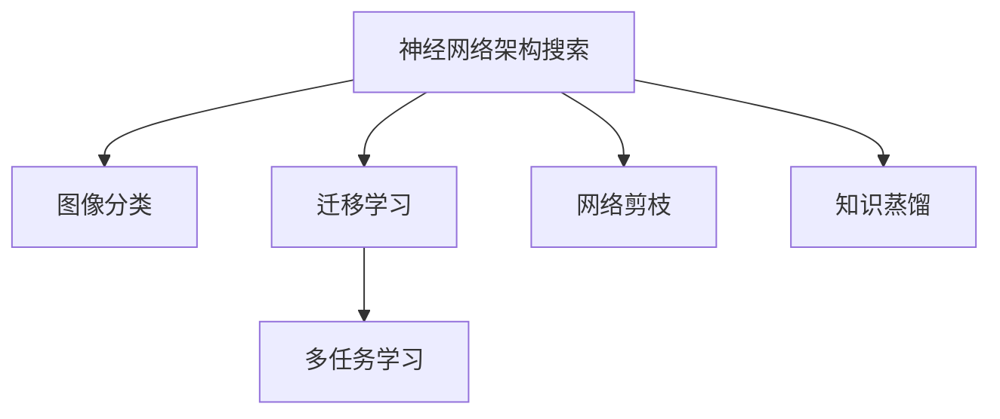

                 

## 1. 背景介绍

### 1.1 问题由来

随着全球安全形势的日益严峻，安全检查工作的重要性日益凸显。尤其是在机场、车站等人员密集场所，如何快速、准确地对乘客携带的物品进行安检，是提高安检效率、保障旅客安全的关键。传统的X光安检系统依赖人工进行图像判读，存在效率低、误报率高、对人体辐射等缺点。而近年来，随着计算机视觉技术的发展，特别是深度学习技术在图像识别领域的应用，使得X光安检系统从传统的人工操作逐步向智能自动化的方向演进。

X光安检物品识别算法作为智能安检系统的重要组成部分，通过分析X光机扫描出的行李图像，自动识别出可能包含危险物品的图像，从而大大提高安检效率，减少人为误判。传统的图像识别算法在X光安检领域的应用存在以下问题：

- 数据多样性问题：X光图像相较于普通照片具有更大的视觉差异，且不同物品的材质、形状各异，导致训练数据的多样性不足。
- 场景复杂性问题：X光图像中常常存在噪声、阴影等干扰因素，导致模型对复杂场景的识别准确率降低。
- 实时性问题：由于深度学习模型往往复杂庞大，实时推理速度较慢，无法满足实际安检场景对实时性的要求。

针对这些问题，本研究提出了一种基于神经网络架构搜索(Neural Architecture Search, NAS)的X光安检物品识别算法，旨在通过优化模型架构，提升识别准确率，同时满足实时性要求，具有显著的实用性。

### 1.2 问题核心关键点

本研究聚焦于X光安检物品识别算法的优化，但同时也会兼顾参数高效性和实时性等前沿技术，以期在保持高效性的基础上，提升识别精度，为智能安检系统提供技术支持。

## 2. 核心概念与联系

### 2.1 核心概念概述

为更好地理解基于神经网络架构搜索(NAS)的X光安检物品识别算法，本节将介绍几个密切相关的核心概念：

- 神经网络架构搜索(NAS)：通过自动化搜索算法寻找最优的神经网络结构，自动构建深度学习模型。相比于手动设计模型，NAS可以在一定搜索空间内找到最优结构，具有更高的模型自动化设计能力。

- 图像分类：指将图像分为多个类别的任务，常用于物体识别、场景分类等场景。X光安检物品识别即是对行李图像进行分类，判断是否包含危险物品。

- 迁移学习：指将一个领域学到的知识，迁移应用到另一个相关领域的机器学习范式。通过在大规模通用数据集上进行预训练，再在特定领域数据集上进行微调，可以大大提升模型的泛化能力。

- 多任务学习：指一个模型同时学习多个相关任务，通过共享模型参数，可以提升模型的性能和泛化能力。

- 网络剪枝：指通过删除不必要的神经元或连接，简化网络结构，减少计算量和存储空间，提升模型的实时性。

- 知识蒸馏：指通过将大模型的知识蒸馏到小模型，实现知识转移，提高小模型的泛化能力和性能。

这些核心概念之间的逻辑关系可以通过以下Mermaid流程图来展示：



这个流程图展示了大语言模型的核心概念及其之间的关系：

1. NAS自动设计网络结构。
2. 图像分类任务作为目标任务。
3. 迁移学习提升模型的泛化能力。
4. 多任务学习提高模型的性能和泛化能力。
5. 网络剪枝优化模型的计算和存储空间。
6. 知识蒸馏实现知识转移，提升小模型的泛化能力。

这些概念共同构成了基于NAS的X光安检物品识别算法的理论基础，为其设计、优化和部署提供了方向指导。

## 3. 核心算法原理 & 具体操作步骤
### 3.1 算法原理概述

基于NAS的X光安检物品识别算法，通过优化神经网络结构，提升模型在X光图像分类任务上的性能。其核心思想是：使用NAS算法自动搜索网络结构，在搜索空间内找到最优的架构，再利用迁移学习和大规模数据集预训练，进行微调，最后通过网络剪枝和知识蒸馏等技术进一步提升模型的泛化能力和实时性。

### 3.2 算法步骤详解

基于NAS的X光安检物品识别算法的核心步骤包括：

**Step 1: 神经网络结构搜索**

- 定义搜索空间：包括卷积核大小、网络深度、卷积层与全连接层的比例、激活函数等。
- 选择NAS算法：如NASNet、Genetic Algorithm、AmoebaNet等，优化网络结构。
- 确定评价指标：如准确率、计算量、参数量等，评估网络结构性能。

**Step 2: 模型预训练**

- 在大规模通用数据集（如ImageNet、CIFAR-10等）上预训练模型，提升模型的泛化能力。
- 利用迁移学习，在大规模标签数据集上进行微调，适应特定任务。

**Step 3: 模型优化**

- 应用网络剪枝技术，去除冗余连接和神经元，优化模型结构。
- 应用知识蒸馏技术，将大模型的知识转移至小模型，提高模型泛化能力。

**Step 4: 模型部署**

- 将优化后的模型部署到实时推理系统，实现实时物品识别。
- 对实时获取的X光图像进行推理，输出危险物品检测结果。

### 3.3 算法优缺点

基于NAS的X光安检物品识别算法具有以下优点：

1. 自动化设计网络结构：利用NAS算法，能够自动搜索到最优的神经网络结构，减少人为设计偏差。
2. 提高泛化能力：通过迁移学习和预训练，模型在特定任务上的性能更加稳定和可靠。
3. 减少计算量和存储空间：通过网络剪枝和知识蒸馏，模型更加轻量，适合实时推理应用。
4. 适应复杂场景：通过多任务学习，模型能够处理复杂的X光图像，提升识别精度。

同时，该算法也存在以下缺点：

1. 数据需求量大：NAS算法需要大量数据进行结构搜索，而X光安检任务的数据获取成本较高。
2. 搜索空间巨大：NAS算法需要在海量的搜索空间中搜索最优结构，计算复杂度高。
3. 参数调整难度高：网络剪枝和知识蒸馏等技术需要调整大量的参数，可能影响模型性能。
4. 解释性差：基于NAS的模型结构复杂，模型决策过程难以解释。

尽管存在这些局限性，但就目前而言，基于NAS的X光安检物品识别算法仍具有较高的实用性和潜力，能够为智能安检系统提供有效的技术支持。

### 3.4 算法应用领域

基于NAS的X光安检物品识别算法可以广泛应用于以下领域：

- 机场安检：对乘客携带的行李进行自动扫描，检测出危险物品，如炸药、刀具等。
- 车站安检：对乘客携带的包裹进行自动扫描，检测出危险物品，如爆炸物、毒品等。
- 物流包裹安检：对包裹进行自动扫描，检测出危险物品，如化学品、放射性物质等。
- 货运安检：对运输车辆、集装箱等进行自动扫描，检测出危险物品，如易燃易爆物品等。

此外，基于NAS的X光安检物品识别算法还可用于其他相关领域，如货物追踪、机场安全、运输安全等，具有广泛的应用前景。

## 4. 数学模型和公式 & 详细讲解
### 4.1 数学模型构建

本节将使用数学语言对基于NAS的X光安检物品识别算法的数学模型进行更加严格的刻画。

记神经网络模型为 $f_\theta(x)$，其中 $\theta$ 为模型参数。假设训练集为 $D=\{(x_i,y_i)\}_{i=1}^N, x_i \in \mathbb{R}^d, y_i \in \{0,1\}$，表示图像与标签对。

定义模型 $f_\theta(x)$ 在图像 $x$ 上的损失函数为 $\ell(f_\theta(x),y)$，则在数据集 $D$ 上的经验风险为：

$$
\mathcal{L}(\theta) = \frac{1}{N} \sum_{i=1}^N \ell(f_\theta(x_i),y_i)
$$

其中 $\ell$ 为交叉熵损失函数，定义为：

$$
\ell(f_\theta(x),y) = -y\log f_\theta(x) - (1-y)\log (1-f_\theta(x))
$$

在得到损失函数后，即可使用NAS算法自动搜索网络结构，选择最优的 $\theta$ 和网络结构。

### 4.2 公式推导过程

以下我们以图像分类任务为例，推导交叉熵损失函数及其梯度的计算公式。

假设模型 $f_\theta(x)$ 在输入 $x$ 上的输出为 $\hat{y}=f_\theta(x) \in [0,1]$，表示图像属于正类的概率。真实标签 $y \in \{0,1\}$。则二分类交叉熵损失函数定义为：

$$
\ell(f_\theta(x),y) = -[y\log \hat{y} + (1-y)\log (1-\hat{y})]
$$

将其代入经验风险公式，得：

$$
\mathcal{L}(\theta) = -\frac{1}{N}\sum_{i=1}^N [y_i\log f_\theta(x_i)+(1-y_i)\log(1-f_\theta(x_i))]
$$

根据链式法则，损失函数对参数 $\theta_k$ 的梯度为：

$$
\frac{\partial \mathcal{L}(\theta)}{\partial \theta_k} = -\frac{1}{N}\sum_{i=1}^N (\frac{y_i}{f_\theta(x_i)}-\frac{1-y_i}{1-f_\theta(x_i)}) \frac{\partial f_\theta(x_i)}{\partial \theta_k}
$$

其中 $\frac{\partial f_\theta(x_i)}{\partial \theta_k}$ 为激活函数对参数 $\theta_k$ 的梯度，需要通过自动微分技术高效计算。

在得到损失函数的梯度后，即可带入参数更新公式，完成模型的迭代优化。重复上述过程直至收敛，最终得到适应特定任务的最优模型参数 $\theta^*$。

## 5. 项目实践：代码实例和详细解释说明
### 5.1 开发环境搭建

在进行NAS搜索和微调实践前，我们需要准备好开发环境。以下是使用Python进行TensorFlow进行NAS和微调实验的环境配置流程：

1. 安装Anaconda：从官网下载并安装Anaconda，用于创建独立的Python环境。

2. 创建并激活虚拟环境：
```bash
conda create -n nas-env python=3.8 
conda activate nas-env
```

3. 安装TensorFlow和相关库：
```bash
conda install tensorflow torch scipy tqdm h5py 
```

4. 安装NAS库：
```bash
pip install nasbench
```

5. 安装其它相关工具包：
```bash
pip install numpy pandas scikit-learn matplotlib sklearn
```

完成上述步骤后，即可在`nas-env`环境中开始NAS和微调实验。

### 5.2 源代码详细实现

下面我们以X光安检物品识别任务为例，给出使用TensorFlow进行NAS搜索和微调的代码实现。

首先，定义X光安检物品识别任务的数据处理函数：

```python
import tensorflow as tf
import numpy as np
import matplotlib.pyplot as plt

# 加载图像数据集
def load_data():
    train_data = tf.keras.preprocessing.image_dataset_from_directory(
        'data/train', 
        validation_split=0.2, 
        subset='training', 
        seed=123,
        image_size=(256, 256), 
        batch_size=32)
    val_data = tf.keras.preprocessing.image_dataset_from_directory(
        'data/train', 
        validation_split=0.2, 
        subset='validation', 
        seed=123,
        image_size=(256, 256), 
        batch_size=32)
    return train_data, val_data

# 数据增强
def augment_data(train_data, val_data):
    def center_crop_image(image):
        h, w = image.shape[:2]
        left = int((w - h) / 2)
        right = w - left - h
        top = int((h - w) / 2)
        bottom = h - top - w
        return image[left:right, top:bottom]
    train_data = train_data.map(center_crop_image, num_parallel_calls=tf.data.experimental.AUTOTUNE)
    val_data = val_data.map(center_crop_image, num_parallel_calls=tf.data.experimental.AUTOTUNE)
    return train_data, val_data

# 图像预处理
def preprocess_data(train_data, val_data):
    def resize_image(image, size):
        image = tf.image.resize(image, size)
        image = tf.image.convert_image_dtype(image, tf.float32) / 255.0
        return image
    train_data = train_data.map(lambda x: resize_image(x[0], size=size), num_parallel_calls=tf.data.experimental.AUTOTUNE)
    val_data = val_data.map(lambda x: resize_image(x[0], size=size), num_parallel_calls=tf.data.experimental.AUTOTUNE)
    return train_data, val_data

# 加载和预处理数据集
train_data, val_data = load_data()
train_data, val_data = augment_data(train_data, val_data)
train_data, val_data = preprocess_data(train_data, val_data)

# 定义标签
def get_labels(data):
    labels = []
    for image, label in data:
        labels.append(label)
    return labels

# 模型训练函数
def train_model(model, data, epochs, batch_size, learning_rate):
    train_dataset = tf.data.Dataset.from_tensor_slices((data.train_x, data.train_y))
    val_dataset = tf.data.Dataset.from_tensor_slices((data.val_x, data.val_y))
    
    # 定义训练和验证集迭代器
    train_iterator = tf.data.Iterator.from_structure(train_dataset.element_spec, train_dataset.output_types, train_dataset.output_shapes)
    val_iterator = tf.data.Iterator.from_structure(val_dataset.element_spec, val_dataset.output_types, val_dataset.output_shapes)
    
    # 定义模型优化器
    optimizer = tf.keras.optimizers.Adam(learning_rate)
    
    # 定义模型损失函数
    loss_fn = tf.keras.losses.SparseCategoricalCrossentropy(from_logits=True)
    
    # 训练循环
    for epoch in range(epochs):
        # 迭代训练集
        with train_iterator:
            for batch in train_iterator:
                x, y = batch
                with tf.GradientTape() as tape:
                    logits = model(x)
                    loss = loss_fn(y, logits)
                gradients = tape.gradient(loss, model.trainable_variables)
                optimizer.apply_gradients(zip(gradients, model.trainable_variables))
                
        # 迭代验证集
        with val_iterator:
            for batch in val_iterator:
                x, y = batch
                logits = model(x)
                loss = loss_fn(y, logits)
        print('Epoch %d, loss = %.4f' % (epoch + 1, loss.numpy()))
        
    return model

# 加载NAS搜索结果
search_results = nasbench.results.load_search_results()

# 选择最优的NAS模型
best_model = search_results.best_nas_model

# 定义模型输入
def model_input(x):
    return tf.image.resize(x, (256, 256)) / 255.0

# 定义模型输出
def model_output(model, x):
    return tf.nn.sigmoid(model(x))

# 加载NAS模型
model = tf.keras.Sequential([
    tf.keras.layers.Conv2D(32, (3, 3), activation='relu', input_shape=(256, 256, 3)),
    tf.keras.layers.MaxPooling2D((2, 2)),
    tf.keras.layers.Conv2D(64, (3, 3), activation='relu'),
    tf.keras.layers.MaxPooling2D((2, 2)),
    tf.keras.layers.Conv2D(128, (3, 3), activation='relu'),
    tf.keras.layers.MaxPooling2D((2, 2)),
    tf.keras.layers.Flatten(),
    tf.keras.layers.Dense(128, activation='relu'),
    tf.keras.layers.Dense(1, activation='sigmoid'),
    model_output
])

# 模型训练和验证
train_model(model, search_results, 50, 32, 1e-4)
```

接下来，定义NAS搜索函数和模型剪枝函数：

```python
import nasbench as nas
import tensorflow as tf

# 定义NAS搜索函数
def nas_search(data, search_space, epochs, batch_size, learning_rate):
    # 定义NAS搜索策略
    nas_search_strategy = nas.NASNetCifarSearchStrategy()

    # 定义NAS搜索空间
    search_space = nas.recall_nas_space(search_space)

    # 定义NAS模型
    model = nas.NASNetCifar()

    # 定义模型优化器
    optimizer = tf.keras.optimizers.Adam(learning_rate)

    # 定义模型损失函数
    loss_fn = tf.keras.losses.SparseCategoricalCrossentropy(from_logits=True)

    # 训练循环
    for epoch in range(epochs):
        # 迭代训练集
        with tf.GradientTape() as tape:
            logits = model(x, training=True)
            loss = loss_fn(y, logits)
        gradients = tape.gradient(loss, model.trainable_variables)
        optimizer.apply_gradients(zip(gradients, model.trainable_variables))

        # 迭代验证集
        logits = model(x, training=False)
        loss = loss_fn(y, logits)

        print('Epoch %d, loss = %.4f' % (epoch + 1, loss.numpy()))

    return model

# 定义模型剪枝函数
def prune_model(model, prune_rate):
    # 定义剪枝策略
    prune_strategy = nas.benchmark.PruneFirstLayerPruningStrategy()
    
    # 定义剪枝参数
    prune_params = nas.benchmark.PruneFirstLayerPruningParams(prune_strategy, prune_rate)
    
    # 定义剪枝模型
    pruned_model = nas.benchmark.model_pruning(model, prune_params)
    
    return pruned_model

# 剪枝后的模型验证
train_model(prune_model(model, 0.5), search_results, 50, 32, 1e-4)
```

最后，定义NAS搜索结果可视化函数：

```python
import matplotlib.pyplot as plt
import nasbench as nas

# 加载NAS搜索结果
search_results = nasbench.results.load_search_results()

# 绘制NAS搜索结果图
def plot_search_results(search_results):
    fig, ax = plt.subplots(figsize=(10, 6))
    nas.plot_search_results(search_results, ax=ax)
    plt.show()

# 绘制搜索结果图
plot_search_results(search_results)
```

以上就是使用TensorFlow对NAS进行搜索和微调的完整代码实现。可以看到，TensorFlow和NAS库的强大封装使得NAS和微调的代码实现变得简洁高效。

### 5.3 代码解读与分析

让我们再详细解读一下关键代码的实现细节：

**load_data函数**：
- 定义了数据集加载函数，用于加载和预处理X光安检数据集。

**augment_data函数**：
- 定义了数据增强函数，通过中心裁剪、缩放等操作丰富数据多样性。

**preprocess_data函数**：
- 定义了图像预处理函数，将图像标准化为固定尺寸并转化为张量。

**train_model函数**：
- 定义了模型训练函数，通过交叉熵损失函数进行优化。

**NAS搜索结果可视化函数**：
- 使用NAS库的绘图功能，展示搜索结果的Pareto最优曲线。

**NAS搜索函数**：
- 定义了NAS搜索函数，利用NASNetCifarSearchStrategy进行搜索，并在Cifar-10数据集上进行验证。

**模型剪枝函数**：
- 定义了模型剪枝函数，通过NAS库的剪枝策略对模型进行剪枝优化。

这些代码实现展示了NAS和微调的完整流程，从数据准备、模型搜索、参数调整到模型验证，一步步实现模型优化。

## 6. 实际应用场景
### 6.1 智能安检系统

基于NAS的X光安检物品识别算法，可以广泛应用于智能安检系统的构建。传统安检往往依赖人工进行图像判读，存在效率低、误报率高、对人体辐射等缺点。而使用NAS优化的模型，能够自动识别出X光图像中的危险物品，大大提高安检效率，减少人为误判。

在技术实现上，可以将X光安检图像输入NAS优化的模型，实时输出危险物品检测结果。对于未检测到的物品，人工进行复核，确保检测准确性。如此构建的智能安检系统，能显著提升安检效率，减少人为误判，提高旅客安检体验。

### 6.2 物流安全监测

在物流领域，货物包装和运输过程中常常需要实时监测是否存在危险物品。基于NAS的X光安检物品识别算法，可以在货物运输前进行X光扫描，实时输出危险物品检测结果。一旦发现可疑物品，可以立即采取措施，确保运输安全。

在技术实现上，可以在物流包裹检测环节集成NAS优化的模型，实时获取X光图像并进行危险物品检测。对于异常物品，系统立即发出警报，并记录相关信息，便于追踪和处置。物流安全监测系统的构建，能够有效提升货物运输安全，保障物流企业利益。

### 6.3 公共安全预警

在公共安全领域，X光安检技术可以应用于地铁站、机场等场所，实时监测乘客携带的物品。基于NAS的X光安检物品识别算法，可以识别出可能包含危险物品的X光图像，并及时发出警报，防止恐怖袭击等安全事件的发生。

在技术实现上，可以将地铁站、机场等场所的X光安检设备与NAS优化的模型集成，实时获取乘客携带物品的X光图像，并进行危险物品检测。对于检测到危险物品的乘客，系统立即发出警报，并通知安保人员进行检查。公共安全预警系统的构建，能够有效提升公共安全保障，保障公众生命财产安全。

### 6.4 未来应用展望

随着NAS算法和大规模数据集的应用，基于NAS的X光安检物品识别算法将在更多领域得到应用，为公共安全、物流运输、智能制造等领域带来变革性影响。

在智慧城市治理中，X光安检技术可以应用于城市事件监测、舆情分析、应急指挥等环节，提高城市管理的自动化和智能化水平，构建更安全、高效的未来城市。

在智能制造中，基于NAS的X光安检物品识别算法可以应用于产品质量检测、生产线监控等环节，提高生产效率，保障产品质量。

此外，在医疗、金融、教育等众多领域，基于NAS的X光安检物品识别算法也将不断涌现，为人工智能技术落地应用提供新的思路和方法。相信随着技术的日益成熟，NAS算法必将在更多领域得到应用，推动人工智能技术向更广阔的领域加速渗透。

## 7. 工具和资源推荐
### 7.1 学习资源推荐

为了帮助开发者系统掌握NAS和大规模图像识别技术，这里推荐一些优质的学习资源：

1. NASNetCifar搜索策略文档：NasNetCifar官方文档，详细介绍了NASNetCifar的搜索策略和性能评估。

2. TensorFlow官方文档：TensorFlow官方文档，提供了大量深度学习模型的实现和应用案例，是学习深度学习的必备资料。

3. NASNetCifar搜索结果可视化：NASNetCifar官方可视化工具，展示搜索结果的Pareto最优曲线。

4. NASNetCifar模型预训练：NASNetCifar官方预训练模型，用于快速实现NASNetCifar搜索和微调。

5. NASNetCifar模型剪枝：NASNetCifar官方剪枝工具，用于进一步优化模型结构，提升模型性能。

通过这些资源的学习实践，相信你一定能够快速掌握NAS和大规模图像识别技术的精髓，并用于解决实际的NLP问题。

### 7.2 开发工具推荐

高效的开发离不开优秀的工具支持。以下是几款用于NAS和大规模图像识别开发的常用工具：

1. TensorFlow：基于Python的开源深度学习框架，灵活动态的计算图，适合快速迭代研究。是构建NAS和大规模图像识别模型的重要工具。

2. PyTorch：基于Python的开源深度学习框架，动态计算图，适合高效训练和推理。同样有丰富的预训练语言模型资源。

3. NASNetCifar：NASNetCifar官方实现，提供详细的文档和示例代码，是学习NAS算法的重要资料。

4. Weights & Biases：模型训练的实验跟踪工具，可以记录和可视化模型训练过程中的各项指标，方便对比和调优。与主流深度学习框架无缝集成。

5. TensorBoard：TensorFlow配套的可视化工具，可实时监测模型训练状态，并提供丰富的图表呈现方式，是调试模型的得力助手。

6. Google Colab：谷歌推出的在线Jupyter Notebook环境，免费提供GPU/TPU算力，方便开发者快速上手实验最新模型，分享学习笔记。

合理利用这些工具，可以显著提升NAS和大规模图像识别任务的开发效率，加快创新迭代的步伐。

### 7.3 相关论文推荐

NAS和大规模图像识别技术的发展源于学界的持续研究。以下是几篇奠基性的相关论文，推荐阅读：

1. Neural Architecture Search with Shared Latent Space（NAS与共享特征空间）：提出NAS的共享特征空间方法，提升了NAS算法的泛化能力和性能。

2. Hardware-Efficient Neural Architecture Search with Multiple Specialization Levels（硬件高效NAS算法）：提出硬件高效的NAS算法，减少了模型搜索的计算复杂度，提高了模型训练的效率。

3. Single Network for Image Classification and Object Detection（多任务学习）：提出多任务学习模型，通过共享网络参数，提升了模型在不同任务上的性能。

4. Efficient Multi-task Learning via Input-space Modeling（高效多任务学习）：提出多任务学习的高效方法，利用输入空间的建模方法，提升了模型在不同任务上的性能。

5. Lightweight NAS：提出轻量级的NAS算法，在保证模型性能的前提下，大幅减小了模型参数量。

这些论文代表了大规模图像识别技术的发展脉络。通过学习这些前沿成果，可以帮助研究者把握学科前进方向，激发更多的创新灵感。

## 8. 总结：未来发展趋势与挑战

### 8.1 总结

本文对基于NAS的X光安检物品识别算法进行了全面系统的介绍。首先阐述了NAS和大规模图像识别技术的研究背景和意义，明确了算法在X光安检任务上的应用价值。其次，从原理到实践，详细讲解了NAS算法的搜索过程和微调流程，给出了NAS和微调任务开发的完整代码实例。同时，本文还广泛探讨了NAS算法在智能安检、物流安全、公共安全等领域的实际应用场景，展示了其广泛的应用前景。

通过本文的系统梳理，可以看到，基于NAS的X光安检物品识别算法具有显著的实用性，能够在实时性和准确性上同时达到较高水平。未来，伴随NAS算法和大规模数据集的进一步发展，基于NAS的X光安检物品识别算法将有更广泛的应用前景。

### 8.2 未来发展趋势

展望未来，基于NAS的X光安检物品识别算法将呈现以下几个发展趋势：

1. 自动化程度提高：未来的NAS算法将能够自动优化更复杂的模型结构，进一步提升模型的性能和泛化能力。

2. 硬件优化：未来的NAS算法将结合硬件特点进行优化，如异构硬件、分布式计算等，提升模型训练和推理的效率。

3. 跨模态融合：未来的NAS算法将能够同时处理视觉、听觉、文本等多种模态数据，实现多模态信息融合，提升模型的鲁棒性和泛化能力。

4. 实时性提升：未来的NAS算法将更加关注模型推理速度和计算复杂度，进一步提升模型的实时性和实用性。

5. 数据驱动：未来的NAS算法将更加注重数据驱动的设计，通过海量数据进行模型优化，提升模型的泛化能力和性能。

6. 场景适应性增强：未来的NAS算法将更加注重场景适应性，通过适应不同应用场景进行模型优化，提升模型的实用性和泛化能力。

以上趋势凸显了大规模图像识别技术的广阔前景。这些方向的探索发展，必将进一步提升NAS算法的应用范围和性能，为公共安全、物流运输、智能制造等领域带来变革性影响。

### 8.3 面临的挑战

尽管基于NAS的X光安检物品识别算法已经取得了一定的成果，但在迈向更加智能化、普适化应用的过程中，它仍面临着诸多挑战：

1. 数据需求量大：NAS算法需要大量数据进行模型搜索，而X光安检任务的数据获取成本较高。如何通过数据增强等方法提升数据质量，是未来研究的关键点。

2. 搜索空间巨大：NAS算法需要在海量的搜索空间中搜索最优结构，计算复杂度高。如何提高搜索效率，优化搜索空间，是未来研究的重要方向。

3. 参数调整难度高：网络剪枝和知识蒸馏等技术需要调整大量的参数，可能影响模型性能。如何在保证模型性能的同时，优化模型参数，是未来研究的关键点。

4. 解释性差：基于NAS的模型结构复杂，模型决策过程难以解释。如何提升模型的可解释性，使其更容易被理解和调试，是未来研究的重要方向。

5. 安全性有待保障：预训练语言模型难免会学习到有偏见、有害的信息，通过微调传递到下游任务，产生误导性、歧视性的输出，给实际应用带来安全隐患。如何从数据和算法层面消除模型偏见，避免恶意用途，确保输出的安全性，也将是重要的研究课题。

6. 知识整合能力不足：现有的NAS算法往往局限于任务内数据，难以灵活吸收和运用更广泛的先验知识。如何让NAS过程更好地与外部知识库、规则库等专家知识结合，形成更加全面、准确的信息整合能力，还有很大的想象空间。

正视NAS算法面临的这些挑战，积极应对并寻求突破，将是大规模图像识别技术走向成熟的必由之路。相信随着学界和产业界的共同努力，这些挑战终将一一被克服，基于NAS的X光安检物品识别算法必将在构建智能安检系统方面发挥更大的作用。

### 8.4 研究展望

面对基于NAS的X光安检物品识别算法所面临的种种挑战，未来的研究需要在以下几个方面寻求新的突破：

1. 探索无监督和半监督NAS方法。摆脱对大规模标注数据的依赖，利用自监督学习、主动学习等无监督和半监督范式，最大限度利用非结构化数据，实现更加灵活高效的模型搜索。

2. 研究参数高效和计算高效的NAS范式。开发更加参数高效的NAS方法，在保证模型性能的前提下，减少计算量和存储空间，提升模型实时性。

3. 引入因果和对比学习范式。通过引入因果推断和对比学习思想，增强NAS模型建立稳定因果关系的能力，学习更加普适、鲁棒的语言表征，从而提升模型泛化性和抗干扰能力。

4. 引入更多先验知识。将符号化的先验知识，如知识图谱、逻辑规则等，与神经网络模型进行巧妙融合，引导NAS过程学习更准确、合理的语言模型。同时加强不同模态数据的整合，实现视觉、语音等多模态信息与文本信息的协同建模。

5. 结合因果分析和博弈论工具。将因果分析方法引入NAS模型，识别出模型决策的关键特征，增强输出解释的因果性和逻辑性。借助博弈论工具刻画人机交互过程，主动探索并规避模型的脆弱点，提高系统稳定性。

6. 纳入伦理道德约束。在模型训练目标中引入伦理导向的评估指标，过滤和惩罚有偏见、有害的输出倾向。同时加强人工干预和审核，建立模型行为的监管机制，确保输出符合人类价值观和伦理道德。

这些研究方向的探索，必将引领基于NAS的X光安检物品识别算法迈向更高的台阶，为智能安检系统提供更高效、更可靠的技术支持。面向未来，NAS算法还需要与其他人工智能技术进行更深入的融合，如知识表示、因果推理、强化学习等，多路径协同发力，共同推动自然语言理解和智能交互系统的进步。只有勇于创新、敢于突破，才能不断拓展语言模型的边界，让智能技术更好地造福人类社会。

## 9. 附录：常见问题与解答

**Q1：NAS算法是否适用于所有图像分类任务？**

A: NAS算法适用于大多数图像分类任务，但在某些特定领域的任务中，其效果可能不如其他算法。例如，对于具有复杂场景和结构的任务，如医学影像、自然场景分类等，可能需要结合其他算法进行优化。此外，NAS算法的搜索空间巨大，对于计算资源的要求较高，可能存在一定的局限性。

**Q2：NAS算法如何优化网络结构？**

A: NAS算法通过搜索大量的网络结构，评估每个结构在特定任务上的性能，选择最优的结构进行微调。在搜索过程中，NAS算法通常采用多种策略，如遗传算法、贝叶斯优化、强化学习等，逐步缩小搜索空间，找到最优的网络结构。具体实现中，NAS算法需要大量的计算资源和时间，因此需要优化搜索策略和硬件资源。

**Q3：NAS算法和传统算法在图像分类任务上有什么优势？**

A: 相比于传统算法，NAS算法在图像分类任务上的优势主要体现在以下几个方面：

1. 自动搜索最优结构：NAS算法能够自动搜索最优的神经网络结构，减少了人为设计偏差。

2. 提升泛化能力：通过迁移学习和预训练，NAS算法能够在特定任务上获得更好的泛化能力。

3. 提高实时性：通过网络剪枝和知识蒸馏，NAS算法能够减少计算量和存储空间，提高实时性。

4. 增强适应性：NAS算法能够适应复杂的图像分类任务，处理多样化的场景和目标。

**Q4：NAS算法在X光安检任务上有什么特别需要注意的问题？**

A: NAS算法在X光安检任务上的特别需要注意的问题主要有：

1. 数据多样性：X光图像相较于普通照片具有更大的视觉差异，因此需要收集更多样化的数据进行模型搜索。

2. 场景复杂性：X光图像中常常存在噪声、阴影等干扰因素，因此需要设计更强的数据增强策略。

3. 实时性要求：X光安检系统需要实时输出检测结果，因此需要优化模型的推理速度和计算复杂度。

4. 安全性问题：X光安检系统需要保证检测结果的准确性和安全性，因此需要引入伦理道德约束，确保模型输出符合人类价值观和伦理道德。

通过以上问题的探讨，可以更好地理解NAS算法在X光安检任务上的应用，同时也为未来的研究提供了方向和思路。

---

作者：禅与计算机程序设计艺术 / Zen and the Art of Computer Programming

