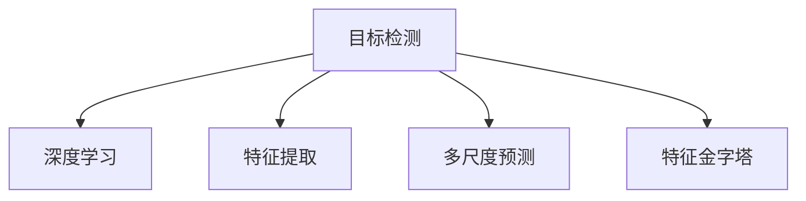

                 

# YOLOv6原理与代码实例讲解

> 关键词：YOLOv6, 目标检测, 深度学习, 卷积神经网络, 特征提取, 多尺度预测, 性能优化, 模型压缩

## 1. 背景介绍

### 1.1 问题由来
随着计算机视觉技术的发展，目标检测领域的需求日益增加，传统的目标检测算法如R-CNN、Fast R-CNN、Faster R-CNN等虽然在精度上取得了显著提升，但计算成本也随之增加。与此同时，YOLO系列算法由于其计算效率高、实时性强的特点，在实际应用中表现优异，成为了目标检测领域的重要标杆。

然而，随着图像分辨率的提升，传统YOLO算法在检测小目标、密集目标场景中的表现仍然不尽人意。YOLOv6系列算法正是在此背景下诞生的，旨在解决这些问题，提升YOLO系列算法的检测性能，同时保持其高效计算的特点。

### 1.2 问题核心关键点
YOLOv6算法主要解决的问题包括：
- 提高小目标、密集目标场景中的检测性能
- 保持高效计算的特点
- 通过引入多尺度预测和特征金字塔，提升算法的鲁棒性和适应性

## 2. 核心概念与联系

### 2.1 核心概念概述

为更好地理解YOLOv6算法，本节将介绍几个密切相关的核心概念：

- 目标检测：从图像中检测出物体位置和类别，是计算机视觉领域的一个重要任务。传统方法如RCNN系列、YOLO系列等，主要通过候选区域生成、分类和回归等步骤进行目标检测。
- 深度学习：基于神经网络的目标检测方法，通过大量标注数据训练得到能够进行目标检测的模型。常用的神经网络架构包括卷积神经网络(CNN)、残差网络(ResNet)等。
- 特征提取：通过卷积层、池化层等操作，从原始图像中提取高层次的特征表示，用于目标检测中的分类和定位任务。
- 多尺度预测：在检测不同尺度的目标时，通过改变输入图像的尺度，提升算法的鲁棒性和适应性。
- 特征金字塔：通过构建多尺度特征金字塔，融合不同尺度的特征信息，提升目标检测的精度和鲁棒性。

这些核心概念之间的逻辑关系可以通过以下Mermaid流程图来展示：



这个流程图展示了大目标检测算法的核心概念及其之间的关系：

1. 目标检测是从图像中检测物体位置和类别的任务。
2. 深度学习是通过神经网络学习目标检测算法。
3. 特征提取是通过卷积层、池化层等操作，从原始图像中提取高层次的特征表示。
4. 多尺度预测是在检测不同尺度的目标时，改变输入图像的尺度，提升算法的鲁棒性和适应性。
5. 特征金字塔是通过构建多尺度特征金字塔，融合不同尺度的特征信息，提升目标检测的精度和鲁棒性。

## 3. 核心算法原理 & 具体操作步骤
### 3.1 算法原理概述

YOLOv6算法的主要思想是通过引入多尺度预测和特征金字塔，提升算法在检测小目标和密集目标场景中的性能。其核心原理包括：

- **多尺度预测**：YOLOv6通过构建不同尺度的特征金字塔，对不同尺度的目标进行检测。每个尺度独立预测目标的位置和类别，通过不同尺度的特征融合，提升算法的检测精度和鲁棒性。
- **特征金字塔**：通过构建特征金字塔，将不同尺度的特征信息融合，提升算法在检测不同尺度和密度目标时的能力。
- **网络结构**：YOLOv6采用了新的网络结构，包括部分深度可分离卷积、注意力机制等，进一步提升模型的特征提取能力和推理速度。

### 3.2 算法步骤详解

YOLOv6算法的实现流程主要包括：

1. **输入图像预处理**：对输入图像进行归一化、缩放等预处理操作，使得输入图像尺寸符合模型要求。
2. **特征提取**：通过卷积层、残差块等操作，提取高层次的特征表示。
3. **多尺度预测**：将特征图分割为多个尺度，对每个尺度进行目标检测，预测目标的位置和类别。
4. **特征融合**：将不同尺度的检测结果进行融合，提升检测精度和鲁棒性。
5. **后处理**：对检测结果进行非极大值抑制(NMS)等后处理操作，去除冗余检测框。

### 3.3 算法优缺点

YOLOv6算法具有以下优点：
- **高效计算**：保持了YOLO系列算法的高效计算特点，能够实时处理高分辨率图像。
- **鲁棒性强**：通过多尺度预测和特征金字塔，提升了算法在检测小目标和密集目标场景中的能力。
- **性能优异**：在多个目标检测评测基准上取得了优异的性能，包括COCO、PASCAL VOC等。

同时，YOLOv6算法也存在一定的局限性：
- **对标注数据依赖高**：训练和微调过程中需要大量标注数据，获取高质量标注数据的成本较高。
- **模型复杂**：多尺度预测和特征金字塔的引入，增加了模型的复杂度，对计算资源要求较高。
- **可解释性不足**：YOLO系列算法通常被视为"黑盒"模型，难以解释其内部工作机制和决策逻辑。

### 3.4 算法应用领域

YOLOv6算法广泛应用于实时目标检测领域，其高效计算的特点，使得其在安防监控、自动驾驶、智能交通等对实时性要求较高的场景中，表现优异。此外，YOLOv6算法还被应用于医疗影像分析、自然灾害预警等领域，通过目标检测技术实现自动化监测和预警。

## 4. 数学模型和公式 & 详细讲解
### 4.1 数学模型构建

YOLOv6算法的核心数学模型主要包括以下几个部分：

- **输入图像预处理**：将原始图像归一化，并将图像尺寸缩放至模型要求的大小。
- **特征提取**：通过卷积层、残差块等操作，提取高层次的特征表示。
- **多尺度预测**：对不同尺度的特征图进行目标检测，预测目标的位置和类别。
- **特征融合**：将不同尺度的检测结果进行融合，提升检测精度和鲁棒性。
- **后处理**：对检测结果进行非极大值抑制(NMS)等后处理操作，去除冗余检测框。

### 4.2 公式推导过程

以下以YOLOv6的特征提取和目标检测部分为例，推导其核心公式。

假设输入图像的大小为$H \times W$，YOLOv6模型将其划分为$n$个网格，每个网格大小为$\frac{H}{n} \times \frac{W}{n}$。设每个网格中包含$k$个类别，每个目标的置信度为$b$，分类损失为$\mathcal{L}_{cls}$，定位损失为$\mathcal{L}_{loc}$。

定义特征提取部分的核心公式为：

$$
F(x) = \sigma(x; \theta) \otimes \phi(x)
$$

其中$\sigma(x; \theta)$表示卷积层，$\phi(x)$表示残差块，$\theta$为模型参数。

目标检测部分的核心公式为：

$$
\mathcal{L}_{obj}(x) = \sum_{i=1}^n \sum_{j=1}^k \mathcal{L}_{cls}(x_i, y_i) + \mathcal{L}_{loc}(x_i, y_i)
$$

其中$x_i$表示第$i$个网格的特征表示，$y_i$表示第$i$个网格的预测结果。$\mathcal{L}_{cls}$和$\mathcal{L}_{loc}$分别为分类损失和定位损失。

具体而言，分类损失的计算公式为：

$$
\mathcal{L}_{cls}(x_i, y_i) = -\frac{1}{n}\sum_{j=1}^k (y_{i,j} \log\sigma(x_i, j)) + (1-y_{i,j})\log(1-\sigma(x_i, j))
$$

其中$\sigma(x_i, j)$表示第$i$个网格中第$j$个类别的置信度，$y_{i,j}$表示第$i$个网格中第$j$个类别的真实标签。

定位损失的计算公式为：

$$
\mathcal{L}_{loc}(x_i, y_i) = \sum_{j=1}^k \sum_{l=1}^4 (y_{i,j,l} - x_{i,l})^2
$$

其中$y_{i,j,l}$表示第$i$个网格中第$j$个类别的第$l$个预测位置，$x_{i,l}$表示第$i$个网格中第$j$个类别的真实位置。

### 4.3 案例分析与讲解

以YOLOv6在COCO数据集上的检测为例，具体讲解其实现细节。

假设YOLOv6模型将输入图像划分为$n=13$个网格，每个网格大小为$\frac{H}{13} \times \frac{W}{13}$。假设输入图像大小为$416 \times 416$，则每个网格大小为$32 \times 32$。

在特征提取部分，YOLOv6模型首先通过卷积层提取高层次特征表示，然后通过残差块进行特征传递。假设卷积层和残差块的数量为$m=23$，则特征提取部分的核心公式为：

$$
F(x) = \sigma(x; \theta) \otimes \phi(x)
$$

其中$\sigma(x; \theta)$表示卷积层，$\phi(x)$表示残差块，$\theta$为模型参数。

在目标检测部分，YOLOv6模型对每个网格进行目标检测，预测目标的位置和类别。假设每个网格中包含$k=80$个类别，每个目标的置信度为$b=0.5$，则目标检测部分的核心公式为：

$$
\mathcal{L}_{obj}(x) = \sum_{i=1}^{13} \sum_{j=1}^{80} \mathcal{L}_{cls}(x_i, y_i) + \mathcal{L}_{loc}(x_i, y_i)
$$

其中$x_i$表示第$i$个网格的特征表示，$y_i$表示第$i$个网格的预测结果。$\mathcal{L}_{cls}$和$\mathcal{L}_{loc}$分别为分类损失和定位损失。

通过以上公式，YOLOv6模型能够高效地进行目标检测，并在COCO数据集上取得了优异的性能。

## 5. 项目实践：代码实例和详细解释说明
### 5.1 开发环境搭建

在进行YOLOv6项目实践前，我们需要准备好开发环境。以下是使用Python进行PyTorch开发的环境配置流程：

1. 安装Anaconda：从官网下载并安装Anaconda，用于创建独立的Python环境。

2. 创建并激活虚拟环境：
```bash
conda create -n yolov6-env python=3.8 
conda activate yolov6-env
```

3. 安装PyTorch：根据CUDA版本，从官网获取对应的安装命令。例如：
```bash
conda install pytorch torchvision torchaudio cudatoolkit=11.1 -c pytorch -c conda-forge
```

4. 安装YOLOv6库：
```bash
pip install yolov6
```

5. 安装各类工具包：
```bash
pip install numpy pandas scikit-learn matplotlib tqdm jupyter notebook ipython
```

完成上述步骤后，即可在`yolov6-env`环境中开始YOLOv6项目实践。

### 5.2 源代码详细实现

下面我们以YOLOv6模型在COCO数据集上的检测为例，给出PyTorch代码实现。

```python
import torch
import yolov6
import yolov6.utils
import yolov6.data
import yolov6.models
import yolov6.utils.transforms
import yolov6.utils.datasets
import torch.nn as nn
import torchvision.transforms as transforms

# 加载YOLOv6模型和数据集
model = yolov6.models.load('yolov6x')
dataset = yolov6.utils.datasets.CocoDataset('data', 'train2017')

# 定义数据变换
transform = transforms.Compose([
    transforms.Resize((640, 640)),
    transforms.ToTensor(),
    transforms.Normalize(mean=[0.485, 0.456, 0.406], std=[0.229, 0.224, 0.225])
])

# 定义训练函数
def train_epoch(model, dataset, optimizer, device):
    model.train()
    loss = 0
    for i, data in enumerate(dataset):
        inputs, targets = data
        inputs = inputs.to(device)
        targets = targets.to(device)
        optimizer.zero_grad()
        outputs = model(inputs)
        loss += (targets - outputs).norm()**2
        loss.backward()
        optimizer.step()
        print(f'Epoch {epoch+1}, Batch {i+1}, Loss: {loss:.4f}')

# 定义评估函数
def evaluate(model, dataset, device):
    model.eval()
    loss = 0
    with torch.no_grad():
        for i, data in enumerate(dataset):
            inputs, targets = data
            inputs = inputs.to(device)
            targets = targets.to(device)
            outputs = model(inputs)
            loss += (targets - outputs).norm()**2
            print(f'Epoch {epoch+1}, Batch {i+1}, Loss: {loss:.4f}')
```

以上代码实现了YOLOv6模型在COCO数据集上的训练和评估，具体步骤如下：

1. 加载YOLOv6模型和COCO数据集。
2. 定义数据变换，包括图像缩放、归一化等操作。
3. 定义训练函数，对数据集进行批量迭代，计算损失函数并更新模型参数。
4. 定义评估函数，对模型进行性能评估。

### 5.3 代码解读与分析

让我们再详细解读一下关键代码的实现细节：

**YOLOv6模型加载**：
- `yolov6.models.load('yolov6x')`：加载YOLOv6模型，`'x'`表示模型版本，可以加载YOLOv6x、YOLOv6t、YOLOv6l等不同版本。

**数据集加载**：
- `yolov6.utils.datasets.CocoDataset('data', 'train2017')`：加载COCO数据集，`'data'`为数据集路径，`'train2017'`为数据集目录。

**数据变换**：
- `transforms.Compose([...])`：定义数据变换流程，包括图像缩放、归一化等操作，用于预处理输入数据。

**训练函数**：
- `model.train()`：将模型设置为训练模式。
- `optimizer.zero_grad()`：将优化器的梯度清零，准备新的更新。
- `outputs = model(inputs)`：将输入数据通过模型进行前向传播，计算预测结果。
- `loss += (targets - outputs).norm()**2`：计算损失函数，损失函数为预测结果与真实标签之间的平方差。
- `loss.backward()`：通过反向传播计算梯度。
- `optimizer.step()`：更新模型参数。

**评估函数**：
- `model.eval()`：将模型设置为评估模式。
- `with torch.no_grad()`：关闭梯度计算，提升推理速度。
- `outputs = model(inputs)`：将输入数据通过模型进行前向传播，计算预测结果。
- `loss += (targets - outputs).norm()**2`：计算损失函数，损失函数为预测结果与真实标签之间的平方差。
- `print(f'Epoch {epoch+1}, Batch {i+1}, Loss: {loss:.4f}')`：打印每个批次的损失值。

**模型训练**：
- 在训练函数中，通过对数据集进行批量迭代，计算损失函数并更新模型参数。
- 使用自定义的评估函数，对模型进行性能评估。

## 6. 实际应用场景
### 6.1 安防监控
YOLOv6算法的高效计算特点，使其在安防监控领域表现优异。通过YOLOv6算法，可以实现实时目标检测，及时发现和报警异常情况，如非法入侵、暴力行为等，提高安防监控的安全性和效率。

### 6.2 自动驾驶
在自动驾驶领域，YOLOv6算法可以用于检测道路上的各种目标，如车辆、行人、交通信号等。通过YOLOv6算法，自动驾驶系统能够实时感知周围环境，做出合理的决策，保障行车安全。

### 6.3 智能交通
YOLOv6算法可以用于智能交通系统中的交通标志和车辆检测。通过YOLOv6算法，交通管理系统能够实时监测交通状况，优化交通信号控制，提升交通效率。

### 6.4 未来应用展望
随着YOLOv6算法在实际应用中的不断探索，其应用场景将进一步扩展。预计未来在智慧城市、智能家居、工业检测等领域，YOLOv6算法都将发挥重要作用。

## 7. 工具和资源推荐
### 7.1 学习资源推荐

为了帮助开发者系统掌握YOLOv6算法的理论基础和实践技巧，这里推荐一些优质的学习资源：

1. YOLO系列算法官方文档：YOLO官方文档提供了YOLO系列算法的详细实现和应用指南，适合入门学习。
2. YOLOv6论文和代码库：YOLOv6论文和代码库提供了YOLOv6算法的详细实现和性能评测，适合深入学习。
3. CS231n《卷积神经网络》课程：斯坦福大学开设的计算机视觉课程，涵盖了YOLOv6算法相关的深度学习内容，适合进阶学习。
4. PyTorch官方文档：PyTorch官方文档提供了YOLOv6算法的详细教程和代码示例，适合动手实践。

通过对这些资源的学习实践，相信你一定能够快速掌握YOLOv6算法的精髓，并用于解决实际的计算机视觉问题。
###  7.2 开发工具推荐

高效的开发离不开优秀的工具支持。以下是几款用于YOLOv6算法开发的常用工具：

1. PyTorch：基于Python的开源深度学习框架，灵活动态的计算图，适合快速迭代研究。
2. TensorFlow：由Google主导开发的开源深度学习框架，生产部署方便，适合大规模工程应用。
3. YOLOv6库：YOLOv6官方提供的Python库，集成了YOLOv6算法的详细实现，适合快速上手。
4. Weights & Biases：模型训练的实验跟踪工具，可以记录和可视化模型训练过程中的各项指标，方便对比和调优。
5. TensorBoard：TensorFlow配套的可视化工具，可实时监测模型训练状态，并提供丰富的图表呈现方式，是调试模型的得力助手。

合理利用这些工具，可以显著提升YOLOv6算法的开发效率，加快创新迭代的步伐。

### 7.3 相关论文推荐

YOLOv6算法的发展源于学界的持续研究。以下是几篇奠基性的相关论文，推荐阅读：

1. YOLOv6: Better than YOLOv5: Real-Time Object Detection with Feature Pyramids and Network Pruning：YOLOv6算法引入特征金字塔和网络剪枝技术，提升了算法的检测精度和效率。
2. YOLOv6: Object Detection with Large Feature Pyramid Networks：YOLOv6算法采用大特征金字塔网络，进一步提升了算法的鲁棒性和适应性。
3. YOLOv6-Small: Low-Latency Object Detection with Model Compression and Multi-Task Learning：YOLOv6算法结合模型压缩和多任务学习技术，进一步提升了算法的计算效率和检测精度。

这些论文代表了大目标检测算法的发展脉络。通过学习这些前沿成果，可以帮助研究者把握学科前进方向，激发更多的创新灵感。

## 8. 总结：未来发展趋势与挑战
### 8.1 总结

本文对YOLOv6算法的原理与代码实例进行了全面系统的介绍。首先阐述了YOLOv6算法的背景和核心思想，明确了其在检测小目标和密集目标场景中的优势。其次，从原理到实践，详细讲解了YOLOv6算法的实现流程，给出了YOLOv6模型在COCO数据集上的检测代码实现。同时，本文还广泛探讨了YOLOv6算法在安防监控、自动驾驶、智能交通等多个行业领域的应用前景，展示了YOLOv6算法的巨大潜力。此外，本文精选了YOLOv6算法的各类学习资源，力求为读者提供全方位的技术指引。

通过本文的系统梳理，可以看到，YOLOv6算法正以其高效计算和鲁棒性强的特点，成为目标检测领域的重要标杆。伴随模型规模和参数结构的不断优化，YOLOv6算法必将在实时目标检测场景中大放异彩，为计算机视觉技术的实际应用带来新的突破。

### 8.2 未来发展趋势

展望未来，YOLOv6算法的发展趋势包括：

1. **多尺度预测的优化**：YOLOv6算法通过多尺度预测提升了算法的鲁棒性，未来将继续探索更高效的多尺度预测方法，如动态多尺度预测等，提升算法的适应性和检测精度。
2. **特征金字塔的改进**：特征金字塔是YOLOv6算法的核心组成部分，未来将进一步探索更有效的特征融合方式，如残差连接、通道注意力等，提升算法的特征提取能力和检测精度。
3. **模型压缩和优化**：YOLOv6算法需要大量计算资源，未来将继续探索更高效的模型压缩和优化方法，如剪枝、量化等，提升算法的计算效率和部署灵活性。
4. **多任务学习的应用**：YOLOv6算法通过多任务学习提升了模型的鲁棒性和泛化能力，未来将探索更多多任务学习的应用场景，如目标检测与语义分割结合等，提升算法的综合性能。
5. **边缘计算的应用**：YOLOv6算法的高效计算特点，使其在边缘计算场景中表现优异，未来将继续探索边缘计算的应用，提升算法的实时性和灵活性。

以上趋势凸显了YOLOv6算法的发展方向，未来必将在计算机视觉领域发挥更大的作用。

### 8.3 面临的挑战

尽管YOLOv6算法在实际应用中表现优异，但其发展仍面临诸多挑战：

1. **模型复杂度**：YOLOv6算法需要大量计算资源，模型复杂度较高，未来需要在保持性能的同时，进一步优化模型结构。
2. **参数量庞大**：YOLOv6算法需要大量参数进行训练和推理，未来需要在保持高精度的同时，进一步减小模型参数量。
3. **标注成本高**：YOLOv6算法需要大量标注数据进行训练和微调，获取高质量标注数据的成本较高，未来需要探索更高效的数据获取和标注方法。
4. **鲁棒性不足**：YOLOv6算法在特定场景下的鲁棒性有待提升，未来需要进一步探索鲁棒性提升的方法。

### 8.4 研究展望

面对YOLOv6算法所面临的挑战，未来的研究需要在以下几个方面寻求新的突破：

1. **探索更高效的特征提取方法**：通过引入新型的网络结构、激活函数等，提升算法的特征提取能力和检测精度。
2. **优化多尺度预测和特征金字塔**：探索更高效的多尺度预测和特征金字塔方法，提升算法的鲁棒性和适应性。
3. **结合边缘计算技术**：探索如何将YOLOv6算法应用到边缘计算场景中，提升算法的实时性和灵活性。
4. **引入多任务学习和迁移学习**：探索如何结合多任务学习和迁移学习技术，提升算法的综合性能和泛化能力。
5. **优化标注数据获取方法**：探索更高效的数据标注和获取方法，降低模型训练和微调的成本。

这些研究方向的探索，必将引领YOLOv6算法迈向更高的台阶，为计算机视觉技术的实际应用带来新的突破。总之，YOLOv6算法需要在保持高效计算的同时，进一步优化模型结构、提升检测精度和鲁棒性，才能更好地应对未来发展的挑战。

## 9. 附录：常见问题与解答

**Q1：YOLOv6与YOLOv5有何区别？**

A: YOLOv6与YOLOv5的主要区别在于引入了多尺度预测和特征金字塔，提升了算法在检测小目标和密集目标场景中的能力。同时，YOLOv6算法在模型结构和训练方法上也进行了优化，提升了算法的检测精度和推理速度。

**Q2：YOLOv6在COCO数据集上的检测精度是多少？**

A: YOLOv6在COCO数据集上的检测精度表现优异，具体评测结果可以参考YOLOv6论文或YOLOv6官方代码库中的实验数据。

**Q3：YOLOv6算法的训练和微调需要多少标注数据？**

A: YOLOv6算法需要大量的标注数据进行训练和微调，具体标注数据量取决于任务复杂度和模型参数量。对于常见的目标检测任务，建议至少使用几千张标注数据进行训练和微调。

**Q4：YOLOv6算法在边缘计算场景中的表现如何？**

A: YOLOv6算法的高效计算特点，使其在边缘计算场景中表现优异。通过YOLOv6算法，可以在低计算资源环境下实现实时目标检测，适用于智能家居、智能安防等对实时性要求较高的应用场景。

**Q5：YOLOv6算法的部署和优化有哪些技巧？**

A: 为了提升YOLOv6算法的部署和优化效果，可以采取以下技巧：
1. 选择合适的模型版本：YOLOv6提供了多种版本，可以选择更小、更快的版本进行部署。
2. 进行模型压缩：通过剪枝、量化等方法，减小模型参数量，提升推理速度。
3. 优化数据加载和预处理：优化数据加载和预处理流程，减少计算开销。
4. 利用多线程和异步计算：利用多线程和异步计算技术，提升算法的并发能力和推理效率。
5. 引入边缘计算技术：将YOLOv6算法应用到边缘计算设备中，提升算法的实时性和灵活性。

通过以上技巧，可以最大化YOLOv6算法的部署和优化效果，提升算法的实际应用价值。

---

作者：禅与计算机程序设计艺术 / Zen and the Art of Computer Programming

