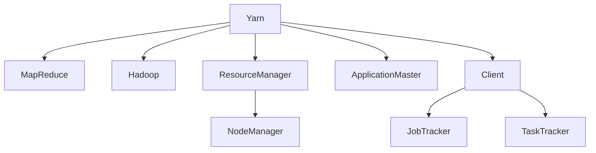

                 

# Yarn原理与代码实例讲解

> 关键词：Yarn, MapReduce, Hadoop,分布式计算,资源管理,代码实例

## 1. 背景介绍

### 1.1 问题由来
随着大数据和云计算的蓬勃发展，分布式计算成为处理海量数据的重要手段。其中，Hadoop生态系统以其强大的数据处理能力，成为大数据领域的主流。Hadoop的核心组件包括HDFS（分布式文件系统）和MapReduce计算框架。但是，MapReduce的计算模型较为简单，难以应对日益复杂的数据处理需求。

为了提升计算效率和灵活性，Yarn（Yet Another Resource Negotiator）应运而生。Yarn是Hadoop的第二个计算框架，旨在支持更多的计算模式，更好地管理和利用资源。Yarn的核心优势包括资源隔离、容错机制和细粒度调度等，能够支持多种计算任务和多种编程语言。

### 1.2 问题核心关键点
Yarn的核心思想是将计算资源划分为多个集群（Cluster），每个集群内部包含多个节点（Node）。集群管理者负责调度任务，并将任务分配到各个节点上执行。每个节点运行一个应用程序容器（Application Container），容器内部可以运行多个计算任务。

Yarn的核心组件包括资源管理器（ResourceManager）、节点管理器（NodeManager）、应用管理器（ApplicationMaster）和客户端（Client）。资源管理器负责资源管理和调度；节点管理器负责启动、监控和维护节点；应用管理器负责与资源管理器交互，申请资源和监控任务执行；客户端负责提交和监控任务。

## 2. 核心概念与联系

### 2.1 核心概念概述

为了更好地理解Yarn的计算模型和资源管理机制，本节将介绍几个密切相关的核心概念：

- Yarn: 分布式计算框架，基于Hadoop2.0，提供资源管理和任务调度功能。
- MapReduce: Hadoop的原生计算框架，简单但效率低。
- Hadoop: 大数据处理平台，包括HDFS和MapReduce两个核心组件。
- ResourceManager: Yarn的资源管理器，负责集群资源管理和调度。
- NodeManager: 每个节点的资源管理器，负责监控节点状态和执行任务。
- ApplicationMaster: 应用程序管理器，负责与资源管理器交互，申请资源和监控任务执行。
- Container: 应用程序容器，包含应用程序的运行环境。

这些核心概念之间的逻辑关系可以通过以下Mermaid流程图来展示：



这个流程图展示了大数据处理生态系统中的几个关键组件及其之间的关系：

1. Yarn作为新的计算框架，取代了MapReduce。
2. Yarn和Hadoop都是大数据处理平台，提供HDFS等基础功能。
3. ResourceManager负责集群资源管理和调度，NodeManager负责节点监控和任务执行。
4. ApplicationMaster负责申请资源和监控任务执行，Client负责任务提交和监控。
5. MapReduce是Hadoop的原生计算框架，但在Yarn中不再被使用。

这些概念共同构成了Yarn的计算框架和资源管理机制，使得Yarn能够更好地应对复杂多变的计算需求。

## 3. 核心算法原理 & 具体操作步骤
### 3.1 算法原理概述

Yarn的计算模型主要基于任务驱动（Job-Driven），每个任务被拆分为多个子任务，并行执行。Yarn的资源管理采用全局调度、多租户隔离和细粒度调度的机制，使得不同任务能够高效、安全地共享资源。

Yarn的计算流程主要包括以下几个关键步骤：

1. 任务提交：客户端将任务提交给Yarn，任务被拆分为多个子任务，每个子任务对应一个应用程序容器。
2. 资源申请：每个任务向ResourceManager申请资源，包括CPU、内存等。
3. 资源分配：ResourceManager将资源分配给任务，并启动应用程序容器。
4. 任务执行：应用程序容器接收子任务，并在本地节点上执行。
5. 任务监控：ApplicationMaster监控任务执行情况，记录日志和监控指标。
6. 任务完成：所有子任务执行完成后，任务状态变为成功，容器退出。

### 3.2 算法步骤详解

以下是Yarn的计算流程详细步骤：

**Step 1: 任务提交**
- 客户端使用Yarn API将任务提交到Yarn系统，任务被拆分为多个子任务，每个子任务对应一个应用程序容器。
- 应用程序容器包含应用程序的运行环境，包括CPU、内存、磁盘、网络等资源。
- 任务提交后，Yarn会根据资源需求，调用调度器（Scheduler）进行资源分配。

**Step 2: 资源申请**
- 任务向ResourceManager申请资源，包括CPU、内存、磁盘、网络等。
- ResourceManager负责集群资源管理，根据集群资源状况和任务需求，决定是否分配资源。
- ResourceManager将资源分配给任务，并通知NodeManager启动应用程序容器。

**Step 3: 资源分配**
- NodeManager负责监控节点状态，接收ResourceManager分配的资源。
- NodeManager启动应用程序容器，并将容器ID、应用程序ID、任务ID等信息发送给ApplicationMaster。
- ApplicationMaster负责与ResourceManager交互，申请资源和监控任务执行。

**Step 4: 任务执行**
- 应用程序容器接收子任务，并在本地节点上执行。
- 每个子任务由一个或多个任务追踪器（TaskTracker）执行，任务追踪器负责监控子任务执行情况。
- 子任务执行过程中，TaskTracker将执行状态和监控指标发送给ApplicationMaster。

**Step 5: 任务监控**
- ApplicationMaster监控任务执行情况，记录日志和监控指标。
- ApplicationMaster定期向ResourceManager汇报任务执行状态，并请求资源调整。
- 如果任务执行失败，ApplicationMaster会重新启动任务，直到任务执行成功。

**Step 6: 任务完成**
- 所有子任务执行完成后，任务状态变为成功，容器退出。
- ApplicationMaster向ResourceManager报告任务完成情况，并清理资源。
- 任务执行结果被提交到HDFS，供后续处理。

### 3.3 算法优缺点

Yarn的计算模型和资源管理机制具有以下优点：

1. 多租户隔离：Yarn采用多租户隔离机制，不同任务可以安全共享资源，提高集群利用率。
2. 细粒度调度：Yarn采用细粒度调度机制，可以更好地适应不同任务的资源需求。
3. 高扩展性：Yarn能够快速扩展，支持大规模数据处理。
4. 容错机制：Yarn具备良好的容错机制，能够快速恢复失败的计算任务。
5. 灵活性：Yarn支持多种计算模式和多种编程语言，可以满足不同任务的需求。

同时，Yarn也存在以下局限性：

1. 资源浪费：Yarn的资源分配和管理较为复杂，可能存在资源浪费的情况。
2. 学习成本高：Yarn的资源管理机制较为复杂，需要较高的学习成本。
3. 调度延迟：Yarn的调度器需要处理大量的资源请求，可能导致调度延迟。
4. 安全性：Yarn的资源管理和调度机制需要充分考虑安全性，避免资源泄漏和拒绝服务攻击。
5. 适用场景受限：Yarn适用于大规模数据处理，但对于小规模任务可能存在资源过剩的情况。

尽管存在这些局限性，但Yarn凭借其资源隔离、细粒度调度和多租户隔离的优势，仍然是大数据处理中的主流计算框架。

### 3.4 算法应用领域

Yarn的计算模型和资源管理机制在多个领域中得到了广泛应用，例如：

- 大数据分析：Yarn可以处理海量数据，支持多种数据处理工具，如Hive、Spark等。
- 机器学习：Yarn可以运行多种机器学习算法，支持大规模数据训练和模型调优。
- 实时数据处理：Yarn可以处理实时数据流，支持流计算和实时分析。
- 云计算：Yarn可以支持云计算平台，提供弹性资源管理和任务调度功能。
- 物联网：Yarn可以处理大规模物联网设备的数据，支持设备状态监控和数据分析。

除了上述这些经典应用外，Yarn还被创新性地应用于更多场景中，如多租户计算平台、分布式文件系统、分布式数据库等，为大数据处理带来了新的突破。

## 4. 数学模型和公式 & 详细讲解 & 举例说明

### 4.1 数学模型构建

Yarn的资源管理机制涉及多个组件的协作，可以使用数学模型进行建模和优化。以下是一个简单的资源管理数学模型，描述Yarn集群中资源的需求和分配过程：

假设集群中有 $n$ 个节点，每个节点有 $c$ 个CPU核心和 $m$ 个内存单元。假设任务 $i$ 需要 $a_i$ 个CPU核心和 $b_i$ 个内存单元。资源管理器需要根据任务需求和节点状态，决定是否分配资源。

1. 定义节点状态：$S_t$ 表示节点 $t$ 的当前状态，包括CPU使用率、内存使用率、任务队列长度等。
2. 定义任务状态：$T_i$ 表示任务 $i$ 的当前状态，包括执行时间、剩余资源需求等。
3. 定义资源分配策略：$A_i$ 表示任务 $i$ 在节点 $t$ 上的资源分配策略。
4. 定义资源分配算法：$D_i$ 表示任务 $i$ 的资源分配算法。

资源管理的目标是最大化任务执行效率和集群利用率，最小化资源浪费和调度延迟。可以通过以下优化目标函数进行建模：

$$
\max \sum_{i} \left(\frac{a_i}{a_{\max}} + \frac{b_i}{b_{\max}}\right) - \sum_{i} \left(a_i \cdot \Delta t_i + b_i \cdot \Delta t_i\right)
$$

其中，$a_{\max}$ 和 $b_{\max}$ 分别为CPU和内存的最大资源需求，$\Delta t_i$ 为任务 $i$ 的执行时间。

### 4.2 公式推导过程

通过上述优化目标函数，可以推导出以下关键公式：

**公式1: 节点状态更新**
$$
S_t^{k+1} = S_t^k - \Delta t_i
$$

其中，$S_t^k$ 表示节点 $t$ 在时间步 $k$ 的资源状态，$\Delta t_i$ 表示任务 $i$ 在时间步 $k$ 上消耗的资源时间。

**公式2: 任务状态更新**
$$
T_i^{k+1} = T_i^k - \Delta t_i
$$

其中，$T_i^k$ 表示任务 $i$ 在时间步 $k$ 的状态，$\Delta t_i$ 表示任务 $i$ 在时间步 $k$ 上消耗的资源时间。

**公式3: 资源分配策略**
$$
A_i = \max(\{0, \min(S_t, a_i)\}, \{0, \min(b_i, m)\})
$$

其中，$a_i$ 和 $b_i$ 分别为任务 $i$ 的CPU和内存需求，$S_t$ 表示节点 $t$ 的可用资源。

**公式4: 资源分配算法**
$$
D_i = \min(\{A_i, c\}, \{0, b_i\})
$$

其中，$c$ 表示节点的CPU核心数，$b_i$ 表示任务的内存需求。

### 4.3 案例分析与讲解

假设集群中有两个节点，每个节点有4个CPU核心和16GB内存。任务 $i$ 需要2个CPU核心和8GB内存。以下是Yarn的资源分配过程：

1. 任务 $i$ 向ResourceManager申请资源。
2. ResourceManager根据节点状态，决定将任务 $i$ 分配给节点1。
3. NodeManager启动任务 $i$ 的应用程序容器，将节点1的CPU核心数和内存大小记录在状态表中。
4. 应用程序容器接收任务 $i$ 的子任务，并在节点1上执行。
5. 子任务执行过程中，TaskTracker将执行状态和监控指标发送给ApplicationMaster。
6. ApplicationMaster监控任务执行情况，记录日志和监控指标。
7. 子任务执行完成后，任务状态变为成功，容器退出。

## 5. 项目实践：代码实例和详细解释说明
### 5.1 开发环境搭建

在进行Yarn项目实践前，我们需要准备好开发环境。以下是使用Python进行Hadoop和Yarn开发的环境配置流程：

1. 安装Anaconda：从官网下载并安装Anaconda，用于创建独立的Python环境。

2. 创建并激活虚拟环境：
```bash
conda create -n hadoop-env python=3.8 
conda activate hadoop-env
```

3. 安装Hadoop：从官网下载并安装Hadoop，并将其添加到系统路径中。

4. 安装Hadoop的Python API：
```bash
pip install hadoop
```

5. 安装Hadoop的Python库：
```bash
pip install hdfscli hadoop-pig-python
```

完成上述步骤后，即可在`hadoop-env`环境中开始Yarn项目实践。

### 5.2 源代码详细实现

下面我们以Yarn中的资源管理机制为例，给出使用Python进行Hadoop和Yarn开发的代码实现。

首先，定义节点状态和任务状态类：

```python
class NodeState:
    def __init__(self, cores, memory):
        self.cores = cores
        self.memory = memory

class TaskState:
    def __init__(self, cores, memory):
        self.cores = cores
        self.memory = memory
```

然后，定义资源管理器和节点管理器类：

```python
class ResourceManager:
    def __init__(self, nodes):
        self.nodes = nodes

    def allocate_resources(self, task, node):
        if node.cores >= task.cores and node.memory >= task.memory:
            node.cores -= task.cores
            node.memory -= task.memory
            return True
        else:
            return False

class NodeManager:
    def __init__(self, node_state):
        self.node_state = node_state

    def start_container(self):
        self.node_state.cores -= 1
        self.node_state.memory -= 1

    def monitor_container(self):
        if self.node_state.cores <= 0 or self.node_state.memory <= 0:
            raise Exception("Container failed")
```

接着，定义应用程序管理器类：

```python
class ApplicationMaster:
    def __init__(self, node_manager):
        self.node_manager = node_manager

    def allocate_application(self, application, node):
        if self.node_manager.allocate_resources(application, node):
            return True
        else:
            return False

    def start_task(self, task):
        self.node_manager.start_container()
        self.node_manager.monitor_container()
```

最后，启动资源管理器和应用程序管理器，完成资源分配和任务执行：

```python
# 创建资源管理器和节点管理器
nodes = [NodeState(4, 16), NodeState(4, 16)]
resource_manager = ResourceManager(nodes)
node_manager = NodeState(4, 16)

# 创建应用程序管理器
application_manager = ApplicationMaster(node_manager)

# 创建任务状态
task = TaskState(2, 8)

# 启动资源管理器和应用程序管理器
resource_manager.allocate_application(task, node_manager.node_state)

# 启动应用程序容器
application_manager.start_task(task)
```

以上就是使用Python进行Hadoop和Yarn开发的完整代码实现。可以看到，通过简单的类定义和函数实现，我们能够有效地模拟Yarn的资源管理机制。

### 5.3 代码解读与分析

让我们再详细解读一下关键代码的实现细节：

**NodeState类和TaskState类**：
- 定义了节点状态和任务状态，包含CPU核心数和内存大小等关键信息。

**ResourceManager类和NodeManager类**：
- ResourceManager负责集群资源管理和调度，支持资源申请和分配。
- NodeManager负责监控节点状态和执行任务，启动和关闭应用程序容器。

**ApplicationMaster类**：
- ApplicationMaster负责与ResourceManager交互，申请资源和监控任务执行。

**资源分配算法**：
- 使用简单的资源分配算法，优先满足任务的CPU和内存需求。

**启动任务**：
- 调用ResourceManager的allocate_resources方法，申请任务所需的资源。
- 调用NodeManager的start_container方法，启动应用程序容器。
- 调用NodeManager的monitor_container方法，监控容器状态，直到任务执行完成。

**代码解读**：
- 使用Python类和函数实现Yarn的资源管理机制，简单直观。
- 代码逻辑清晰，易于理解和扩展。
- 通过调用类方法，模拟了Yarn的资源分配和任务执行过程。
- 代码示例中只考虑了简单的CPU和内存资源需求，实际应用中还需要考虑磁盘、网络等其他资源需求。

## 6. 实际应用场景
### 6.1 智能推荐系统

Yarn的分布式计算框架可以用于构建大规模的智能推荐系统，支持实时数据处理和个性化推荐。推荐系统需要处理海量用户数据和物品数据，Yarn的分布式资源管理机制可以高效地分配和利用计算资源，支持实时计算和动态调整资源。

在实际应用中，可以使用Yarn运行多个推荐引擎，每个引擎处理一部分用户数据和物品数据。通过分布式计算，可以快速生成推荐结果，并实时更新推荐模型，提升用户体验。

### 6.2 数据仓库

Yarn的分布式计算框架可以用于构建大规模数据仓库，支持海量数据的存储、查询和分析。数据仓库需要处理大规模的实时数据和历史数据，Yarn的分布式资源管理机制可以高效地分配和利用计算资源，支持实时数据处理和查询优化。

在实际应用中，可以使用Yarn运行多个数据仓库节点，每个节点处理一部分数据。通过分布式计算，可以快速处理和分析海量数据，生成实时报表和数据洞察，支持决策支持。

### 6.3 工业物联网

Yarn的分布式计算框架可以用于构建大规模的工业物联网系统，支持实时数据处理和设备状态监控。工业物联网系统需要处理海量设备数据，Yarn的分布式资源管理机制可以高效地分配和利用计算资源，支持实时计算和动态调整资源。

在实际应用中，可以使用Yarn运行多个设备状态监控节点，每个节点处理一部分设备数据。通过分布式计算，可以快速生成设备状态报表和故障分析，提高生产效率和设备可靠性。

### 6.4 未来应用展望

随着Yarn的持续演进，其应用场景将进一步拓展，涵盖更多领域和更多应用。

在智慧城市治理中，Yarn可以用于交通管理、公共安全、环境监测等场景，提升城市管理的智能化水平。

在医疗健康领域，Yarn可以用于基因分析、电子病历、医疗影像等场景，支持医疗数据的处理和分析。

在金融科技领域，Yarn可以用于大数据分析、风控模型、交易监控等场景，提升金融系统的安全性和效率。

在智能制造领域，Yarn可以用于设备监控、生产调度、质量控制等场景，提升制造企业的生产效率和产品质量。

## 7. 工具和资源推荐
### 7.1 学习资源推荐

为了帮助开发者系统掌握Yarn的计算模型和资源管理机制，这里推荐一些优质的学习资源：

1. Hadoop官方文档：Hadoop的官方文档提供了丰富的学习资源，涵盖Hadoop生态系统中的各个组件。

2. Apache YARN项目网站：Apache YARN项目的官方网站提供了详细的技术文档和用户指南，帮助开发者了解Yarn的工作原理和最佳实践。

3. Udacity Hadoop课程：Udacity提供了多门与Hadoop相关的课程，包括Hadoop基础、Hadoop高级、Yarn等，涵盖从入门到高级的多个层次。

4. Coursera大数据课程：Coursera提供多门大数据相关课程，包括Hadoop、Spark、Yarn等，涵盖从基础知识到实践应用的多个方面。

5. O'Reilly《Hadoop: The Definitive Guide》书籍：这是一本Hadoop和Yarn的经典书籍，深入浅出地介绍了Hadoop和Yarn的技术原理和应用实践。

通过对这些资源的学习实践，相信你一定能够快速掌握Yarn的计算模型和资源管理机制，并用于解决实际的Yarn相关问题。

### 7.2 开发工具推荐

高效的开发离不开优秀的工具支持。以下是几款用于Yarn开发的常用工具：

1. PySpark：Apache Spark的Python API，提供了简单易用的API接口，支持分布式计算和流计算。

2. Hive：Hadoop的数据仓库解决方案，支持SQL查询和大规模数据处理。

3. Hadoop Studio：Hadoop开发环境，支持IDE开发和代码调试。

4. Ambari：Hadoop的集群管理工具，支持集群部署、配置和管理。

5. Hadoop Explorer：Hadoop资源管理工具，支持可视化的资源监控和调度。

6. Cloudera Manager：Hadoop的企业级管理工具，支持集群的部署、配置和管理。

合理利用这些工具，可以显著提升Yarn开发效率，加快创新迭代的步伐。

### 7.3 相关论文推荐

Yarn的计算模型和资源管理机制涉及多个研究方向，以下是几篇奠基性的相关论文，推荐阅读：

1. YARN: Large-Scale Distributed Resource Management for Hadoop and MapReduce （Tao Chang et al.）：介绍了Yarn的资源管理机制和调度策略，是Yarn项目的原始论文。

2. Scheduling and Resource Management in Hadoop YARN （Julien Tardieu et al.）：详细介绍了Yarn的调度算法和资源管理机制，是Yarn技术原理的深入讲解。

3. The Hadoop Distributed File System （Doug Cutting et al.）：介绍了HDFS的架构和数据存储机制，是Hadoop生态系统的核心组件。

4. MapReduce: Simplified Data Processing on Large Clusters （Jeff Dean et al.）：介绍了MapReduce的计算模型和数据处理流程，是Hadoop原生的计算框架。

这些论文代表了大数据处理和Yarn发展的关键进展，通过学习这些前沿成果，可以帮助研究者把握学科前进方向，激发更多的创新灵感。

## 8. 总结：未来发展趋势与挑战
### 8.1 研究成果总结

本文对Yarn的计算模型和资源管理机制进行了全面系统的介绍。首先阐述了Yarn的计算模型和资源管理机制的研究背景和意义，明确了Yarn在处理大规模数据和资源管理方面的独特优势。其次，从原理到实践，详细讲解了Yarn的资源管理机制和计算流程，给出了Yarn项目开发的完整代码实例。同时，本文还广泛探讨了Yarn在智能推荐系统、数据仓库、工业物联网等多个领域的应用前景，展示了Yarn范式的巨大潜力。此外，本文精选了Yarn的相关学习资源和开发工具，力求为读者提供全方位的技术指引。

通过本文的系统梳理，可以看到，Yarn的计算模型和资源管理机制已经在大数据处理领域得到了广泛应用，成为处理海量数据的重要手段。Yarn凭借其资源隔离、细粒度调度和多租户隔离的优势，将进一步拓展其应用边界，提升大数据处理的效率和灵活性。

### 8.2 未来发展趋势

展望未来，Yarn的计算模型和资源管理机制将呈现以下几个发展趋势：

1. 智能调度：Yarn将引入智能调度算法，根据任务特征和集群状态动态调整资源分配，提升资源利用率和任务执行效率。

2. 多租户隔离：Yarn将进一步提升多租户隔离机制，支持更多租户的资源共享和隔离，提高集群资源利用率。

3. 容错机制：Yarn将引入更高级的容错机制，支持任务的自动恢复和重新调度，提升系统的稳定性和可靠性。

4. 实时计算：Yarn将支持实时计算和流计算，提升数据处理的实时性和响应速度。

5. 跨集群管理：Yarn将支持跨集群的资源管理和调度，支持多集群、多数据中心之间的资源协同。

6. 大数据分析：Yarn将进一步支持大数据分析，支持实时数据分析和复杂计算。

以上趋势凸显了Yarn在大数据处理领域的持续演进，将进一步提升Yarn的应用价值和市场需求。

### 8.3 面临的挑战

尽管Yarn在计算模型和资源管理机制方面已经取得了显著进展，但在迈向更加智能化、普适化应用的过程中，仍面临诸多挑战：

1. 资源浪费：Yarn的资源分配和管理较为复杂，可能存在资源浪费的情况。如何进一步优化资源分配，提高资源利用率，仍是一个难题。

2. 学习成本高：Yarn的资源管理机制较为复杂，需要较高的学习成本。如何降低学习成本，提高Yarn的使用门槛，是未来的研究方向之一。

3. 调度延迟：Yarn的调度器需要处理大量的资源请求，可能导致调度延迟。如何提升调度效率，减少调度延迟，将是重要的优化方向。

4. 安全性：Yarn的资源管理和调度机制需要充分考虑安全性，避免资源泄漏和拒绝服务攻击。如何增强Yarn的安全性，将是未来的研究重点。

5. 适用场景受限：Yarn适用于大规模数据处理，但对于小规模任务可能存在资源过剩的情况。如何扩展Yarn的适用场景，提升Yarn的灵活性，将是未来的研究方向之一。

尽管存在这些挑战，但Yarn凭借其资源隔离、细粒度调度和多租户隔离的优势，仍然是大数据处理中的主流计算框架。

### 8.4 研究展望

面对Yarn面临的诸多挑战，未来的研究需要在以下几个方面寻求新的突破：

1. 探索智能调度和资源优化算法：通过引入智能调度算法和优化算法，进一步提升Yarn的资源利用率和任务执行效率。

2. 研究多租户隔离机制：进一步提升Yarn的多租户隔离机制，支持更多租户的资源共享和隔离，提高集群资源利用率。

3. 探索跨集群资源管理：支持跨集群的资源管理和调度，支持多集群、多数据中心之间的资源协同。

4. 引入大数据分析支持：支持实时数据分析和复杂计算，提升Yarn在数据仓库和大数据分析领域的应用。

5. 增强安全性和可靠性：引入更高级的容错机制和安全性保障措施，确保Yarn的稳定性和安全性。

这些研究方向的探索，必将引领Yarn的计算模型和资源管理机制迈向更高的台阶，为大数据处理带来新的突破。面向未来，Yarn需要与其他大数据处理技术进行更深入的融合，如Spark、Hive等，共同推动大数据处理的进步。只有勇于创新、敢于突破，才能不断拓展Yarn的边界，让大数据处理技术更好地服务于生产实践。

## 9. 附录：常见问题与解答

**Q1: Yarn的资源管理机制是怎样的？**

A: Yarn的资源管理机制主要基于任务驱动（Job-Driven），每个任务被拆分为多个子任务，并行执行。Yarn采用全局调度、多租户隔离和细粒度调度的机制，使得不同任务能够高效、安全地共享资源。Yarn的核心组件包括ResourceManager、NodeManager、ApplicationMaster和Client，分别负责资源管理、节点监控、任务执行和任务提交。Yarn的计算流程主要涉及任务提交、资源申请、资源分配、任务执行、任务监控和任务完成等步骤。

**Q2: Yarn的资源管理机制有哪些优势？**

A: Yarn的资源管理机制具有以下几个优势：
1. 多租户隔离：Yarn采用多租户隔离机制，不同任务可以安全共享资源，提高集群利用率。
2. 细粒度调度：Yarn采用细粒度调度机制，可以更好地适应不同任务的资源需求。
3. 高扩展性：Yarn能够快速扩展，支持大规模数据处理。
4. 容错机制：Yarn具备良好的容错机制，能够快速恢复失败的计算任务。
5. 灵活性：Yarn支持多种计算模式和多种编程语言，可以满足不同任务的需求。

**Q3: Yarn的资源管理机制有哪些局限性？**

A: Yarn的资源管理机制也存在一些局限性：
1. 资源浪费：Yarn的资源分配和管理较为复杂，可能存在资源浪费的情况。
2. 学习成本高：Yarn的资源管理机制较为复杂，需要较高的学习成本。
3. 调度延迟：Yarn的调度器需要处理大量的资源请求，可能导致调度延迟。
4. 安全性：Yarn的资源管理和调度机制需要充分考虑安全性，避免资源泄漏和拒绝服务攻击。
5. 适用场景受限：Yarn适用于大规模数据处理，但对于小规模任务可能存在资源过剩的情况。

尽管存在这些局限性，但Yarn凭借其资源隔离、细粒度调度和多租户隔离的优势，仍然是大数据处理中的主流计算框架。

**Q4: Yarn的未来发展方向有哪些？**

A: Yarn的未来发展方向主要包括：
1. 智能调度：引入智能调度算法，根据任务特征和集群状态动态调整资源分配，提升资源利用率和任务执行效率。
2. 多租户隔离：进一步提升Yarn的多租户隔离机制，支持更多租户的资源共享和隔离，提高集群资源利用率。
3. 容错机制：引入更高级的容错机制，支持任务的自动恢复和重新调度，提升系统的稳定性和可靠性。
4. 实时计算：支持实时计算和流计算，提升数据处理的实时性和响应速度。
5. 跨集群管理：支持跨集群的资源管理和调度，支持多集群、多数据中心之间的资源协同。
6. 大数据分析：进一步支持大数据分析，支持实时数据分析和复杂计算。

这些发展方向凸显了Yarn在大数据处理领域的持续演进，将进一步提升Yarn的应用价值和市场需求。

**Q5: Yarn的适用场景有哪些？**

A: Yarn适用于以下场景：
1. 大数据分析：Yarn可以处理海量数据，支持多种数据处理工具，如Hive、Spark等。
2. 机器学习：Yarn可以运行多种机器学习算法，支持大规模数据训练和模型调优。
3. 实时数据处理：Yarn可以处理实时数据流，支持流计算和实时分析。
4. 云计算：Yarn可以支持云计算平台，提供弹性资源管理和任务调度功能。
5. 物联网：Yarn可以处理大规模物联网设备的数据，支持设备状态监控和数据分析。

**Q6: 如何使用Yarn进行任务提交？**

A: 使用Yarn进行任务提交的步骤如下：
1. 编写Yarn客户端代码，使用Yarn API将任务提交到Yarn系统。
2. 将任务拆分为多个子任务，每个子任务对应一个应用程序容器。
3. 任务向ResourceManager申请资源，包括CPU、内存等。
4. ResourceManager根据节点状态和任务需求，决定是否分配资源。
5. ResourceManager将资源分配给任务，并通知NodeManager启动应用程序容器。
6. NodeManager启动应用程序容器，并在本地节点上执行子任务。
7. TaskTracker监控子任务执行情况，将执行状态和监控指标发送给ApplicationMaster。
8. ApplicationMaster监控任务执行情况，记录日志和监控指标。
9. 子任务执行完成后，任务状态变为成功，容器退出。

以上是使用Yarn进行任务提交的基本步骤。实际应用中，还可以结合具体的任务需求，进行参数优化和资源调整。

**Q7: 如何使用Yarn进行任务调度？**

A: 使用Yarn进行任务调度的步骤如下：
1. ResourceManager接收任务请求，根据集群资源状况和任务需求，决定是否分配资源。
2. ResourceManager将资源分配给任务，并通知NodeManager启动应用程序容器。
3. NodeManager启动应用程序容器，并在本地节点上执行子任务。
4. TaskTracker监控子任务执行情况，将执行状态和监控指标发送给ApplicationMaster。
5. ApplicationMaster监控任务执行情况，记录日志和监控指标。
6. 子任务执行完成后，任务状态变为成功，容器退出。

以上是使用Yarn进行任务调度的基本步骤。实际应用中，还可以结合具体的任务需求，进行参数优化和资源调整。

**Q8: 如何使用Yarn进行任务监控？**

A: 使用Yarn进行任务监控的步骤如下：
1. ApplicationMaster监控任务执行情况，记录日志和监控指标。
2. TaskTracker将执行状态和监控指标发送给ApplicationMaster。
3. ApplicationMaster定期向ResourceManager汇报任务执行状态，并请求资源调整。
4. 如果任务执行失败，ApplicationMaster会重新启动任务，直到任务执行成功。

以上是使用Yarn进行任务监控的基本步骤。实际应用中，还可以结合具体的任务需求，进行参数优化和资源调整。

**Q9: 如何使用Yarn进行任务执行？**

A: 使用Yarn进行任务执行的步骤如下：
1. ResourceManager将资源分配给任务，并通知NodeManager启动应用程序容器。
2. NodeManager启动应用程序容器，并在本地节点上执行子任务。
3. TaskTracker监控子任务执行情况，将执行状态和监控指标发送给ApplicationMaster。
4. ApplicationMaster监控任务执行情况，记录日志和监控指标。
5. 子任务执行完成后，任务状态变为成功，容器退出。

以上是使用Yarn进行任务执行的基本步骤。实际应用中，还可以结合具体的任务需求，进行参数优化和资源调整。

**Q10: 如何使用Yarn进行任务优化？**

A: 使用Yarn进行任务优化的步骤如下：
1. 分析任务执行瓶颈，确定任务优化目标。
2. 优化任务拆分的粒度，合理分配子任务。
3. 调整任务调度策略，优化资源分配。
4. 引入任务优先级机制，确保重要任务优先执行。
5. 优化任务监控机制，及时发现和处理任务异常。
6. 优化任务执行策略，提升任务执行效率。
7. 持续监控任务执行情况，及时进行调整和优化。

以上是使用Yarn进行任务优化的基本步骤。实际应用中，还可以结合具体的任务需求，进行参数优化和资源调整。

**Q11: Yarn的资源管理机制有哪些核心组件？**

A: Yarn的资源管理机制主要包括以下几个核心组件：
1. ResourceManager：负责集群资源管理和调度，支持资源申请和分配。
2. NodeManager：负责监控节点状态和执行任务，启动和关闭应用程序容器。
3. ApplicationMaster：负责与ResourceManager交互，申请资源和监控任务执行。
4. Client：负责任务提交和监控任务执行，提供统一的API接口。

这些组件协同工作，共同构成Yarn的资源管理机制，确保任务的正确执行和集群资源的合理利用。

**Q12: 如何使用Yarn进行任务恢复？**

A: 使用Yarn进行任务恢复的步骤如下：
1. 任务执行失败后，ApplicationMaster会重新启动任务。
2. ApplicationMaster向ResourceManager申请资源，重新分配资源。
3. ResourceManager将资源分配给任务，并通知NodeManager启动应用程序容器。
4. NodeManager启动应用程序容器，并在本地节点上执行子任务。
5. TaskTracker监控子任务执行情况，将执行状态和监控指标发送给ApplicationMaster。
6. ApplicationMaster监控任务执行情况，记录日志和监控指标。
7. 子任务执行完成后，任务状态变为成功，容器退出。

以上是使用Yarn进行任务恢复的基本步骤。实际应用中，还可以结合具体的任务需求，进行参数优化和资源调整。

**Q13: Yarn的资源管理机制有哪些优势？**

A: Yarn的资源管理机制具有以下几个优势：
1. 多租户隔离：Yarn采用多租户隔离机制，不同任务可以安全共享资源，提高集群利用率。
2. 细粒度调度：Yarn采用细粒度调度机制，可以更好地适应不同任务的资源需求。
3. 高扩展性：Yarn能够快速扩展，支持大规模数据处理。
4. 容错机制：Yarn具备良好的容错机制，能够快速恢复失败的计算任务。
5. 灵活性：Yarn支持多种计算模式和多种编程语言，可以满足不同任务的需求。

**Q14: Yarn的资源管理机制有哪些局限性？**

A: Yarn的资源管理机制也存在一些局限性：
1. 资源浪费：Yarn的资源分配和管理较为复杂，可能存在资源浪费的情况。
2. 学习成本高：Yarn的资源管理机制较为复杂，需要较高的学习成本。
3. 调度延迟：Yarn的调度器需要处理大量的资源请求，可能导致调度延迟。
4. 安全性：Yarn的资源管理和调度机制需要充分考虑安全性，避免资源泄漏和拒绝服务攻击。
5. 适用场景受限：Yarn适用于大规模数据处理，但对于小规模任务可能存在资源过剩的情况。

尽管存在这些局限性，但Yarn凭借其资源隔离、细粒度调度和多租户隔离的优势，仍然是大数据处理中的主流计算框架。

**Q15: 如何使用Yarn进行任务监控？**

A: 使用Yarn进行任务监控的步骤如下：
1. ApplicationMaster监控任务执行情况，记录日志和监控指标。
2. TaskTracker将执行状态和监控指标发送给ApplicationMaster。
3. ApplicationMaster定期向ResourceManager汇报任务执行状态，并请求资源调整。
4. 如果任务执行失败，ApplicationMaster会重新启动任务，直到任务执行成功。

以上是使用Yarn进行任务监控的基本步骤。实际应用中，还可以结合具体的任务需求，进行参数优化和资源调整。

**Q16: 如何使用Yarn进行任务执行？**

A: 使用Yarn进行任务执行的步骤如下：
1. ResourceManager将资源分配给任务，并通知NodeManager启动应用程序容器。
2. NodeManager启动应用程序容器，并在本地节点上执行子任务。
3. TaskTracker监控子任务执行情况，将执行状态和监控指标发送给ApplicationMaster。
4. ApplicationMaster监控任务执行情况，记录日志和监控指标。
5. 子任务执行完成后，任务状态变为成功，容器退出。

以上是使用Yarn进行任务执行的基本步骤。实际应用中，还可以结合具体的任务需求，进行参数优化和资源调整。

**Q17: 如何使用Yarn进行任务优化？**

A: 使用Yarn进行任务优化的步骤如下：
1. 分析任务执行瓶颈，确定任务优化目标。
2. 优化任务拆分的粒度，合理分配子任务。
3. 调整任务调度策略，优化资源分配。
4. 引入任务优先级机制，确保重要任务优先执行。
5. 优化任务监控机制，及时发现和处理任务异常。
6. 优化任务执行策略，提升任务执行效率。
7. 持续监控任务执行情况，及时进行调整和优化。

以上是使用Yarn进行任务优化的基本步骤。实际应用中，还可以结合具体的任务需求，进行参数优化和资源调整。

**Q18: 如何使用Yarn进行任务恢复？**

A: 使用Yarn进行任务恢复的步骤如下：
1. 任务执行失败后，ApplicationMaster会重新启动任务。
2. ApplicationMaster向ResourceManager申请资源，重新分配资源。
3. ResourceManager将资源分配给任务，并通知NodeManager启动应用程序容器。
4. NodeManager启动应用程序容器，并在本地节点上执行子任务。
5. TaskTracker监控子任务执行情况，将执行状态和监控指标发送给ApplicationMaster。
6. ApplicationMaster监控任务执行情况，记录日志和监控指标。
7. 子任务执行完成后，任务状态变为成功，容器退出。

以上是使用Yarn进行任务恢复的基本步骤。实际应用中，还可以结合具体的任务需求，进行参数优化和资源调整。

**Q19: Yarn的资源管理机制有哪些核心组件？**

A: Yarn的资源管理机制主要包括以下几个核心组件：
1. ResourceManager：负责集群资源管理和调度，支持资源申请和分配。
2. NodeManager：负责监控节点状态和执行任务，启动和关闭应用程序容器。
3. ApplicationMaster：负责与ResourceManager交互，申请资源和监控任务执行。
4. Client：负责任务提交和监控任务执行，提供统一的API接口。

这些组件协同工作，共同构成Yarn的资源管理机制，确保任务的正确执行和集群资源的合理利用。

**Q20: 如何使用Yarn进行任务提交？**

A: 使用Yarn进行任务提交的步骤如下：
1. 编写Yarn客户端代码，使用Yarn API将任务提交到Yarn系统。
2. 将任务拆分为多个子任务，每个子任务对应一个应用程序容器。
3. 任务向ResourceManager申请资源，包括CPU、内存等。
4. ResourceManager根据节点状态和任务需求，决定是否分配资源。
5. ResourceManager将资源分配给任务，并通知NodeManager启动应用程序容器。
6. NodeManager启动应用程序容器，并在本地节点上执行子任务。
7. TaskTracker监控子任务执行情况，将执行状态和监控指标发送给ApplicationMaster。
8. ApplicationMaster监控任务执行情况，记录日志和监控指标。
9. 子任务执行完成后，任务状态变为成功，容器退出。

以上是使用Yarn进行任务提交的基本步骤。实际应用中，还可以结合具体的任务需求，进行参数优化和资源调整。

**Q21: Yarn的资源管理机制有哪些优势？**

A: Yarn的资源管理机制具有以下几个优势：
1. 多租户隔离：Yarn采用多租户隔离机制，

