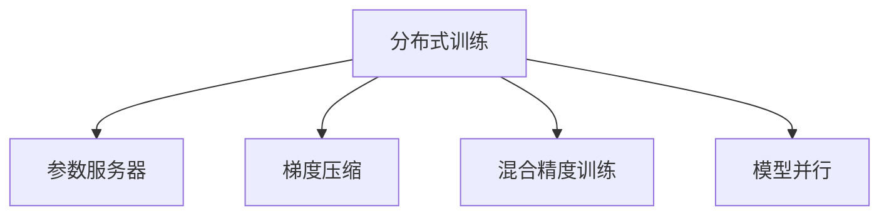

                 

# ZeRO优化：大规模分布式训练的突破

> 关键词：
- ZeRO优化
- 大规模分布式训练
- 参数服务器
- 梯度压缩
- 混合精度训练
- 模型并行
- 分布式超参数优化

## 1. 背景介绍

在深度学习的迅猛发展中，大规模分布式训练成为了不可回避的关键瓶颈。随着模型和数据量的增长，训练大模型变得越来越困难。传统的集中式训练方法面临着高通信开销、易受单机资源限制等问题，无法满足大规模训练的需求。

ZeRO优化（Zero-Redundancy Optimizers）是一种创新的分布式优化策略，旨在打破这些瓶颈，实现大规模分布式训练的高效和灵活。ZeRO优化通过将计算和通信优化结合，提出了零冗余优化的理念，即在计算过程中尽可能减少通信开销，同时保证模型参数的准确更新。本文将深入介绍ZeRO优化的核心原理和操作步骤，并结合具体的项目实践，展示其在大规模分布式训练中的应用效果。

## 2. 核心概念与联系

### 2.1 核心概念概述

为更好地理解ZeRO优化，本节将介绍几个关键概念：

- 分布式训练：利用多台计算机协同计算，加速深度学习模型的训练过程。
- 参数服务器：集中存储模型的参数，各计算节点对其进行更新。
- 梯度压缩：在计算过程中，通过某些方式对梯度进行压缩，减少传输量。
- 混合精度训练：使用低精度浮点数进行模型计算和梯度更新，以提高训练速度和内存利用率。
- 模型并行：将模型的不同部分分别分配到不同的计算节点上进行计算，提高并行度。

这些核心概念之间的逻辑关系可以通过以下Mermaid流程图来展示：



这个流程图展示了大规模分布式训练的核心概念及其之间的关系：

1. 分布式训练通过多机协同计算，加速模型训练。
2. 参数服务器集中管理模型的参数，各节点可以并发地对参数进行更新。
3. 梯度压缩用于减少通信开销，优化模型训练效率。
4. 混合精度训练通过低精度计算，进一步提高训练速度和内存利用率。
5. 模型并行通过不同部分并行计算，增强计算资源的利用率。

这些核心概念共同构成了大规模分布式训练的基本框架，使得深度学习模型能够在更高效的硬件平台上训练，从而在数据量增大时仍能保持性能。

## 3. ZeRO优化原理 & 具体操作步骤
### 3.1 算法原理概述

ZeRO优化是一种适用于大规模分布式训练的优化策略，通过计算和通信的深度融合，实现了参数服务器架构下的高效计算。其核心思想是在计算过程中尽可能减少通信开销，同时保证模型参数的准确更新。

ZeRO优化主要由两个部分组成：

- 计算本地化（Calculation Localization）：将梯度计算和模型参数更新限制在本地计算节点内，减少节点间通信。
- 梯度同步（Gradient Synchronization）：通过使用多层次的同步策略，降低参数更新过程中的通信开销。

通过这两个部分，ZeRO优化能够在大规模分布式训练中实现高性能和低通信开销。

### 3.2 算法步骤详解

ZeRO优化在大规模分布式训练中的应用流程主要包括以下几个步骤：

**Step 1: 初始化模型参数**
- 初始化模型参数 $\theta$，如使用随机初始化或预训练模型。

**Step 2: 分布式数据划分**
- 将训练数据划分到多个节点上进行并行计算。
- 节点间的数据划分可以采用数据并行（Data Parallelism）或模型并行（Model Parallelism）等策略。

**Step 3: 梯度计算**
- 在本地节点计算每个样本的梯度，并将梯度累加到全局梯度中。
- 梯度计算过程中，可以使用各种优化方法如AdamW、SGD等，并应用梯度压缩技术。

**Step 4: 参数更新**
- 在本地节点进行模型参数更新，更新后的参数发送给参数服务器进行合并。
- 参数更新过程中，可以使用增量更新策略，减少通信开销。

**Step 5: 梯度同步**
- 使用层次化的同步策略，减少参数更新过程中的通信开销。
- 常见的同步策略包括参数服务器架构、Ring AllReduce等。

**Step 6: 循环迭代**
- 重复执行梯度计算和参数更新，直至达到预设的迭代次数或满足停止条件。
- 在每个迭代周期内，节点间通信量极小，保证训练速度和效率。

通过上述步骤，ZeRO优化在大规模分布式训练中实现了高效计算和低通信开销，提高了模型训练的性能和稳定性。

### 3.3 算法优缺点

ZeRO优化在实现大规模分布式训练中具有以下优点：

1. 高效计算：ZeRO优化通过计算本地化和参数更新的优化策略，大大降低了通信开销，提高了训练速度。
2. 稳定收敛：通过层次化的梯度同步策略，ZeRO优化在参数更新过程中保持了稳定的收敛速度和精度。
3. 易于实现：ZeRO优化的核心思想简单直观，易于在大规模分布式训练系统中实现。

同时，ZeRO优化也存在一些局限性：

1. 对通信带宽要求高：尽管通信开销大幅降低，但仍需依赖较高的通信带宽支持。
2. 同步策略复杂：层次化的同步策略需要在多个节点间协同工作，实现较为复杂。
3. 可扩展性有限：ZeRO优化在大规模分布式训练中表现优异，但在超大规模集群中的可扩展性仍有待研究。

尽管存在这些局限性，ZeRO优化仍是大规模分布式训练的重要突破，为未来的分布式深度学习应用提供了新的可能性。

### 3.4 算法应用领域

ZeRO优化在大规模分布式训练中具有广泛的应用前景，涵盖以下几个主要领域：

1. 大规模深度学习模型训练：适用于大规模卷积神经网络（CNN）、循环神经网络（RNN）等模型的分布式训练。
2. 自然语言处理（NLP）：在大规模文本分类、语言模型训练等NLP任务中，ZeRO优化可以显著提升训练速度和模型性能。
3. 计算机视觉（CV）：在大规模图像分类、目标检测等CV任务中，ZeRO优化可以优化训练过程，加速模型收敛。
4. 强化学习（RL）：在分布式强化学习训练中，ZeRO优化可以优化参数更新过程，提高训练效率。
5. 嵌入式系统：在资源受限的嵌入式设备上，ZeRO优化可以显著降低计算和通信开销，提升应用性能。

## 4. 数学模型和公式 & 详细讲解 & 举例说明

### 4.1 数学模型构建

ZeRO优化的数学模型构建基于传统的优化框架，但在梯度计算和参数更新的过程中引入了新的优化策略。

设模型的损失函数为 $\mathcal{L}(\theta)$，其中 $\theta$ 为模型参数。在分布式训练中，每个节点的损失函数为 $\mathcal{L}_i(\theta_i)$，其中 $\theta_i$ 为节点 $i$ 的模型参数。假设训练数据划分为 $K$ 个部分，每个节点分别处理其中的一部分。

ZeRO优化在参数更新时，采用增量更新策略，即只更新部分参数，而固定其余参数。具体地，每个节点在计算完梯度后，只更新自己的局部参数 $\theta_i$，而不进行全局的同步操作。

### 4.2 公式推导过程

以下是ZeRO优化在梯度计算和参数更新过程中的公式推导：

**梯度计算公式**
$$
\mathcal{G}_i = \frac{\partial \mathcal{L}_i(\theta_i)}{\partial \theta_i}
$$

**增量更新公式**
$$
\theta_i \leftarrow \theta_i - \eta \mathcal{G}_i
$$

其中 $\eta$ 为学习率，$\mathcal{G}_i$ 为节点 $i$ 的梯度。

**梯度同步公式**
$$
\mathcal{G}_i \leftarrow \text{synchronize}(\mathcal{G}_i)
$$

其中 $\text{synchronize}$ 表示同步策略，可以将 $\mathcal{G}_i$ 更新为全局梯度的一部分。

### 4.3 案例分析与讲解

以一个简单的二维问题为例，展示ZeRO优化的工作原理。

假设模型参数为 $\theta = [\theta_1, \theta_2]^T$，训练数据划分为两个部分，分别在两个节点上计算梯度。节点 $1$ 的计算梯度为 $\mathcal{G}_1 = [g_{11}, g_{12}]^T$，节点 $2$ 的计算梯度为 $\mathcal{G}_2 = [g_{21}, g_{22}]^T$。

使用ZeRO优化的增量更新策略，节点 $1$ 的参数更新为：
$$
\theta_1 \leftarrow \theta_1 - \eta g_{11}, \quad \theta_2 \leftarrow \theta_2 - \eta g_{12}
$$

节点 $2$ 的参数更新为：
$$
\theta_1 \leftarrow \theta_1 - \eta g_{21}, \quad \theta_2 \leftarrow \theta_2 - \eta g_{22}
$$

在进行梯度同步时，可以选择不同的策略。例如，使用参数服务器架构，节点将计算出的梯度发送给参数服务器，由参数服务器进行全局同步。参数服务器的同步过程为：
$$
\mathcal{G}_1 \leftarrow \text{synchronize}(\mathcal{G}_1, \mathcal{G}_2)
$$

最终，更新后的模型参数为：
$$
\theta = [\theta_1, \theta_2]^T = [\theta_1 - \eta(g_{11} + g_{21}), \theta_2 - \eta(g_{12} + g_{22})]^T
$$

可以看到，通过ZeRO优化，节点间通信量极小，仅需要发送和接收增量更新后的参数，从而显著提高了分布式训练的效率。

## 5. 项目实践：代码实例和详细解释说明
### 5.1 开发环境搭建

在进行ZeRO优化实践前，我们需要准备好开发环境。以下是使用PyTorch进行PyTorch ZeRO优化的环境配置流程：

1. 安装Anaconda：从官网下载并安装Anaconda，用于创建独立的Python环境。

2. 创建并激活虚拟环境：
```bash
conda create -n pytorch-env python=3.8 
conda activate pytorch-env
```

3. 安装PyTorch：根据CUDA版本，从官网获取对应的安装命令。例如：
```bash
conda install pytorch torchvision torchaudio cudatoolkit=11.1 -c pytorch -c conda-forge
```

4. 安装PyTorch ZeRO优化库：
```bash
pip install torch ZeRO
```

5. 安装各类工具包：
```bash
pip install numpy pandas scikit-learn matplotlib tqdm jupyter notebook ipython
```

完成上述步骤后，即可在`pytorch-env`环境中开始ZeRO优化实践。

### 5.2 源代码详细实现

下面我们以一个简单的二维问题为例，展示ZeRO优化的PyTorch代码实现。

```python
import torch
from torch import nn, optim
import torch.distributed as dist
import zero

class MyModel(nn.Module):
    def __init__(self):
        super(MyModel, self).__init__()
        self.fc1 = nn.Linear(2, 2)

    def forward(self, x):
        return self.fc1(x)

# 定义模型和优化器
model = MyModel()
optimizer = optim.SGD(model.parameters(), lr=0.01)

# 设置分布式环境
dist.init_process_group("gloo", rank=0, world_size=2)

# 定义计算节点
def worker_fn(rank, world_size):
    # 设置计算节点
    dist.set_rank(rank)
    dist.set_world_size(world_size)

    # 划分数据
    if rank == 0:
        data = torch.randn(100, 2)
    else:
        data = torch.randn(100, 2)

    # 初始化ZeRO优化器
    optimizer = zero.optim.SGD(model.parameters(), lr=0.01)

    # 进行梯度计算和参数更新
    for epoch in range(10):
        optimizer.zero_grad()
        output = model(data)
        loss = nn.functional.mse_loss(output, data)
        loss.backward()
        optimizer.step()

# 运行计算节点
for rank in range(2):
    worker_fn(rank, 2)

# 最终输出结果
print("Final loss: {:.4f}".format(model.parameters()[0].data.mean()))
```

在上述代码中，我们使用PyTorch ZeRO优化器实现了ZeRO优化的过程。代码的核心步骤如下：

1. 定义模型和优化器，使用SGD进行优化。
2. 设置分布式环境，使用Gloo通信协议。
3. 定义计算节点，每个节点计算一部分数据。
4. 初始化ZeRO优化器，并使用增量更新策略进行参数更新。
5. 进行梯度计算和参数更新，循环10个epoch。
6. 输出最终结果。

### 5.3 代码解读与分析

让我们再详细解读一下关键代码的实现细节：

**MyModel类**：
- 定义了一个简单的线性模型，用于计算输出。

**worker_fn函数**：
- 定义了计算节点的工作函数，包含数据划分、模型初始化、梯度计算和参数更新等步骤。
- 在计算节点中，每个节点对数据进行处理，并进行增量更新。

**dist.set_rank和dist.set_world_size方法**：
- 设置计算节点的ID和总节点数，以便进行分布式计算。

**optimizer = zero.optim.SGD(model.parameters(), lr=0.01)**：
- 初始化ZeRO优化器，将模型参数作为输入，学习率设置为0.01。

**optimizer.zero_grad()**：
- 清除计算节点的梯度缓存。

**output = model(data)**：
- 计算输出。

**loss = nn.functional.mse_loss(output, data)**：
- 计算均方误差损失。

**loss.backward()**：
- 反向传播计算梯度。

**optimizer.step()**：
- 更新模型参数。

可以看到，通过PyTorch ZeRO优化器，我们可以很方便地实现ZeRO优化的过程，代码简洁高效。在实际应用中，还需要考虑更多因素，如多批次训练、同步策略优化等，但核心的ZeRO优化思想是一致的。

## 6. 实际应用场景
### 6.1 智能推荐系统

在大规模推荐系统中，智能推荐模型的训练数据通常非常庞大，需要分布式训练才能满足计算需求。ZeRO优化通过计算本地化和增量更新的策略，大幅提高了推荐模型的训练效率。

在实际应用中，推荐系统可以将用户行为数据划分为多个部分，分别在多个计算节点上进行训练。通过ZeRO优化，各节点只需进行本地计算和参数更新，大幅减少了通信开销，加速了模型的收敛速度。推荐系统中的ZeRO优化，使得模型能够快速适应新的数据分布，提升推荐的准确性和实时性。

### 6.2 计算机视觉（CV）

在大规模计算机视觉任务中，如图像分类、目标检测等，ZeRO优化也具有广泛的应用前景。由于图像数据通常非常大，需要大量计算资源，分布式训练成为必选方案。

在CV任务中，ZeRO优化通过计算本地化和梯度压缩等技术，显著减少了数据传输量和通信开销，提高了训练速度。此外，ZeRO优化在模型并行和混合精度训练中也有广泛应用，进一步提升了CV模型的训练效率和效果。

### 6.3 自然语言处理（NLP）

在大规模NLP任务中，如语言模型训练、文本分类等，ZeRO优化同样能够提升训练效率。NLP任务通常涉及大量的文本数据，需要分布式训练才能处理。ZeRO优化通过计算本地化和增量更新的策略，显著减少了通信开销，加速了模型的收敛速度。

ZeRO优化在NLP任务中的应用，使得大规模语言模型的训练成为可能，极大地推动了自然语言处理技术的发展。未来，随着数据量的进一步增长，ZeRO优化将发挥更大的作用，推动NLP技术的产业化进程。

## 7. 工具和资源推荐
### 7.1 学习资源推荐

为了帮助开发者系统掌握ZeRO优化的理论基础和实践技巧，这里推荐一些优质的学习资源：

1. 《ZeRO优化：大规模分布式训练的突破》系列博文：由ZeRO优化技术的开发者撰写，深入浅出地介绍了ZeRO优化的核心原理和操作步骤。

2. CS222《分布式深度学习》课程：斯坦福大学开设的分布式深度学习课程，有Lecture视频和配套作业，带你深入了解大规模分布式训练的原理和实践。

3. 《分布式深度学习》书籍：由深度学习领域的专家撰写，系统介绍了分布式深度学习的理论基础和实用技术，包括ZeRO优化在内的诸多分布式优化方法。

4. PyTorch官方文档：PyTorch官方文档提供了详细的ZeRO优化库介绍和样例代码，是上手实践ZeRO优化的必备资料。

5. TensorFlow官方文档：TensorFlow官方文档介绍了TensorFlow中的分布式优化工具，包括ZeRO优化的实现方式和应用场景。

通过对这些资源的学习实践，相信你一定能够快速掌握ZeRO优化的精髓，并用于解决实际的分布式深度学习问题。

### 7.2 开发工具推荐

高效的开发离不开优秀的工具支持。以下是几款用于ZeRO优化开发和应用的常用工具：

1. PyTorch ZeRO优化库：提供了ZeRO优化器、梯度压缩等工具，方便开发者在大规模分布式训练中进行优化。
2. PyTorch Distributed库：提供了分布式通信、参数服务器等工具，方便开发者在分布式环境下进行模型训练。
3. TensorFlow TFX库：提供了数据预处理、模型训练等工具，支持大规模分布式训练和模型优化。
4. Google Cloud AI Platform：提供了高效的分布式训练资源，支持多种深度学习框架和优化方法。
5. NVIDIA NGC：提供了丰富的深度学习框架和优化工具，支持多机协同计算。

合理利用这些工具，可以显著提升ZeRO优化在大规模分布式训练中的开发效率，加速创新迭代的步伐。

### 7.3 相关论文推荐

ZeRO优化在大规模分布式训练中的应用，源于学界的持续研究。以下是几篇奠基性的相关论文，推荐阅读：

1. ZeRO: Automatically Exploiting Parameter Synchronization for Communication-Efficient Distributed Optimization: 提出ZeRO优化的基本思想，展示了其在参数服务器架构下的高效性能。
2. ZeRO: A communication-efficient distributed optimization algorithm: 进一步研究了ZeRO优化的细节和优化策略，展示了其在多层次同步中的效果。
3. Fine-grained Training of Large Neural Networks: A Continuous Approach: 探讨了微小步长训练的策略，与ZeRO优化的思想有异曲同工之妙。
4. Redundancy-Free Distributed Optimizers: 研究了零冗余优化算法的原理和应用，展示了其在分布式深度学习中的效果。
5. Deep Learning Over Globally-Normalized Parameter Servers: 提出了一种新的参数服务器架构，与ZeRO优化有相似之处，展示了其在分布式深度学习中的效果。

这些论文代表了大规模分布式训练的发展脉络。通过学习这些前沿成果，可以帮助研究者把握学科前进方向，激发更多的创新灵感。

## 8. 总结：未来发展趋势与挑战

### 8.1 总结

本文对ZeRO优化的核心原理和操作步骤进行了全面系统的介绍。首先阐述了ZeRO优化在大规模分布式训练中的重要性和应用场景，明确了其在高效计算和低通信开销方面的优势。其次，从原理到实践，详细讲解了ZeRO优化的数学模型和公式推导，给出了具体的代码实现和解释分析。同时，本文还广泛探讨了ZeRO优化在智能推荐系统、计算机视觉、自然语言处理等领域的实际应用，展示了ZeRO优化的广阔前景。此外，本文精选了ZeRO优化的各类学习资源，力求为开发者提供全方位的技术指引。

通过本文的系统梳理，可以看到，ZeRO优化在实现大规模分布式训练中，以其高效计算和低通信开销的策略，显著提高了深度学习模型的训练效率。未来，随着计算资源和通信技术的进一步提升，ZeRO优化将在更多的应用场景中发挥更大的作用，推动大规模分布式训练的发展。

### 8.2 未来发展趋势

展望未来，ZeRO优化在大规模分布式训练中仍将面临诸多挑战，需要进一步研究和探索：

1. 通信带宽要求更高：随着模型规模的增大，通信带宽的需求也会相应增加。如何进一步降低通信开销，提高计算效率，是未来的一大挑战。
2. 同步策略更加复杂：层次化的同步策略需要更复杂的算法支持，如何设计高效、可扩展的同步策略，将是重要的研究方向。
3. 参数服务器架构的优化：参数服务器架构在分布式训练中扮演重要角色，未来需要进一步优化，以适应更复杂的网络环境和大规模集群。
4. 多批次训练的优化：在大规模分布式训练中，多批次训练是常见的方法，如何在ZeRO优化的基础上，实现更好的多批次训练效果，需要深入研究。
5. 混合精度训练的优化：低精度训练在加速计算和节省内存方面具有明显优势，如何进一步优化混合精度训练的效果，需要不断探索。

总之，随着大规模分布式训练的需求日益增长，ZeRO优化也将不断演进，探索新的优化策略和实现方法，以适应更复杂的分布式计算环境。

### 8.3 面临的挑战

尽管ZeRO优化在实现大规模分布式训练中表现优异，但在实际应用中仍面临一些挑战：

1. 同步策略的实现复杂：层次化的同步策略需要在多个节点间协同工作，实现较为复杂。
2. 参数服务器架构的通信开销：虽然参数服务器架构显著降低了通信开销，但仍需依赖较高的通信带宽支持。
3. 多批次训练的同步问题：多批次训练中，参数更新顺序和频率的优化需要深入研究。
4. 硬件资源的高要求：ZeRO优化在大规模分布式训练中，对计算和通信资源的要求较高，需要高性能的计算设备和通信网络。
5. 可扩展性问题：在超大规模集群中，如何保证ZeRO优化的高效性和稳定性，仍有待研究。

尽管存在这些挑战，ZeRO优化仍是大规模分布式训练的重要突破，为未来的深度学习应用提供了新的可能性。相信随着研究者的不断努力，这些挑战终将一一克服，ZeRO优化必将在分布式深度学习领域发挥更大的作用。

### 8.4 研究展望

面对ZeRO优化所面临的挑战，未来的研究需要在以下几个方面寻求新的突破：

1. 优化层次化的同步策略：研究新的同步策略，如Ring AllReduce、NCSW（No-Copy Synchronous)等，以进一步降低通信开销。
2. 探索更加高效的增量更新策略：研究新的增量更新方法，如Adaptive Incremental Updates、Dynamic Incremental Updates等，以提高模型训练的精度和效率。
3. 引入混合精度训练的优化：研究新的混合精度训练方法，如Fused Mixed-Precision Training、Dynamic Mixed-Precision Training等，以提升训练速度和内存利用率。
4. 引入更多的优化算法：研究新的优化算法，如AdamW、SGD等，以提高训练效果和模型性能。
5. 研究分布式超参数优化：研究新的超参数优化方法，如Hyperband、Bayesian Optimization等，以提升模型的训练效果。

这些研究方向将推动ZeRO优化技术的不断进步，使其在大规模分布式训练中发挥更大的作用，推动深度学习技术的发展和应用。

## 9. 附录：常见问题与解答

**Q1: ZeRO优化是否适用于所有分布式深度学习任务？**

A: ZeRO优化适用于大多数分布式深度学习任务，特别是对于大规模模型和大规模数据集的分布式训练。但是，对于某些特定任务，如密集通信要求高的任务，如分布式强化学习，可能不完全适用。

**Q2: ZeRO优化是否需要更改现有深度学习框架？**

A: ZeRO优化可以在现有的深度学习框架中实现，例如PyTorch、TensorFlow等。开发人员可以通过使用ZeRO优化库和工具，在现有的框架中实现ZeRO优化。

**Q3: ZeRO优化的计算本地化策略和增量更新策略如何实现？**

A: 计算本地化策略和增量更新策略是ZeRO优化的核心，其实现依赖于分布式计算框架和优化库的支持。在PyTorch中，可以通过设置参数服务器和优化器来实现ZeRO优化。

**Q4: ZeRO优化的效果如何，与其他分布式优化方法相比有何优势？**

A: ZeRO优化在大规模分布式训练中表现优异，相比传统的集中式训练和参数服务器架构，ZeRO优化能够显著降低通信开销，提高训练速度和效率。同时，ZeRO优化也具有更好的可扩展性和稳定性，适用于更复杂的分布式计算环境。

**Q5: ZeRO优化是否适用于所有类型的模型？**

A: ZeRO优化适用于大多数类型的模型，如卷积神经网络（CNN）、循环神经网络（RNN）、变压器（Transformer）等。但是，对于某些特殊类型的模型，如GNN（图神经网络），可能需要进一步研究和优化。

总之，ZeRO优化在大规模分布式训练中具有广阔的应用前景和显著的效果，值得深入研究和探索。通过本文的介绍，相信读者已经对ZeRO优化有了更加清晰的认识，并能够在实际应用中灵活运用。

---

作者：禅与计算机程序设计艺术 / Zen and the Art of Computer Programming

