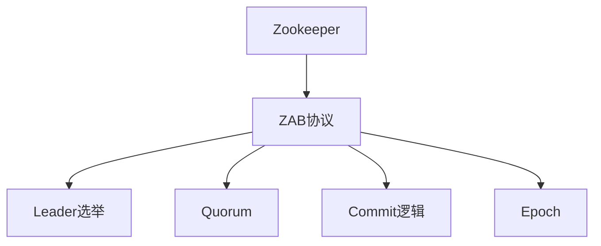

                 

# Zookeeper ZAB协议原理与代码实例讲解

## 1. 背景介绍

### 1.1 问题由来

Zookeeper是一个开源的分布式协调服务，被广泛应用于大数据、云计算等领域的分布式系统中，以提供数据同步、配置管理、服务发现等核心功能。作为分布式系统中最具挑战性的问题之一，一致性问题一直是学术界和工业界研究的热点。Zookeeper通过ZAB协议（Zookeeper Atomic Broadcast）实现了高可靠性的数据同步和状态机复制，保证了其分布式系统的稳定性和一致性。

### 1.2 问题核心关键点

ZAB协议的核心在于其定义了一套针对分布式系统的故障恢复机制，确保在节点故障、网络分区等异常情况下，仍能保持系统的一致性和可用性。ZAB协议主要包含以下几个关键点：

- 基于Raft一致性算法。ZAB协议采用了Raft算法的基本思想，但在细节上进行了优化。例如，在节点故障时，ZAB协议通过“领导者选举”机制保证新的领导者可以快速被选举出来。
- 强一致性保障。ZAB协议通过使用主节点和从节点的状态同步机制，确保所有节点的状态一致，从而实现强一致性。
- 优化的数据同步。ZAB协议通过基于消息队列的数据同步方式，确保数据传输的可靠性和高效性。
- 可扩展性。ZAB协议通过分布式节点间的通信机制，支持大规模集群部署。

## 2. 核心概念与联系

### 2.1 核心概念概述

为更好地理解ZAB协议，本节将介绍几个密切相关的核心概念：

- Zookeeper：开源分布式协调服务，提供数据同步、配置管理、服务发现等核心功能。
- ZAB协议：Zookeeper采用的基于Raft算法的数据同步和状态机复制协议。
- Leader选举：在节点故障或重新部署时，通过选举机制确定新的领导者节点。
- Quorum：基于投票机制，用于确定领导者节点的最小配置。
- Commit逻辑：确保节点状态同步的原子性，保证强一致性。
- Epoch：基于时间戳的概念，用于标记数据同步状态。

这些核心概念之间的逻辑关系可以通过以下Mermaid流程图来展示：



这个流程图展示了大语言模型的核心概念及其之间的关系：

1. Zookeeper通过ZAB协议实现了分布式系统的数据同步和状态机复制。
2. Leader选举是ZAB协议的重要机制，用于确定新的领导者节点。
3. Quorum机制基于投票，用于确定领导者节点的最小配置。
4. Commit逻辑用于保证节点状态同步的原子性，确保强一致性。
5. Epoch用于标记数据同步状态，保证数据传输的可靠性和高效性。

这些核心概念共同构成了ZAB协议的逻辑框架，使其能够在分布式系统中高效、可靠地运行。通过理解这些核心概念，我们可以更好地把握ZAB协议的工作原理和优化方向。

## 3. 核心算法原理 & 具体操作步骤

### 3.1 算法原理概述

ZAB协议基于Raft算法，通过一系列的节点选举、数据同步、状态更新等步骤，实现了分布式系统中的强一致性。其主要算法流程如下：

1. Leader选举：在节点故障或重新部署时，通过Quorum机制选举新的领导者节点。
2. Prepared状态：领导者节点将数据同步到从节点，并请求所有从节点确认同步完成。
3. Committed状态：领导者节点收到足够数量的从节点确认后，将数据提交给持久化存储。
4. Snapshot机制：领导者节点定期进行快照操作，将状态数据备份到持久化存储中，保证系统恢复时的数据一致性。
5. 数据同步：领导者节点通过基于消息队列的方式，将最新的状态数据同步到从节点，确保所有节点的状态一致。

### 3.2 算法步骤详解

ZAB协议的详细步骤可以分为以下几个关键阶段：

#### 3.2.1 Leader选举

- 初始状态：系统启动时，所有节点都进入Follower状态。
- Leader选举：从节点发送心跳消息，以证明自己的存活状态。领导者节点通过多数投票机制（Quorum）选举新的领导者节点。

#### 3.2.2 Prepared状态

- 领导者节点将数据同步到从节点，并请求从节点确认。
- 从节点收到同步请求后，进入Prepared状态，等待领导者节点确认。

#### 3.2.3 Committed状态

- 领导者节点收到足够数量的从节点确认后，将数据提交给持久化存储。
- 从节点收到领导者节点的确认后，将数据提交到持久化存储中，并进入Committed状态。

#### 3.2.4 Snapshot机制

- 领导者节点定期进行快照操作，将状态数据备份到持久化存储中。
- 从节点收到领导者节点的快照请求后，进行数据同步，更新本地状态。

#### 3.2.5 数据同步

- 领导者节点通过基于消息队列的方式，将最新的状态数据同步到从节点。
- 从节点收到同步数据后，更新本地状态，并返回确认信息。

### 3.3 算法优缺点

ZAB协议具有以下优点：

- 强一致性保障：通过Leader选举和Committed机制，确保所有节点的状态一致。
- 高效的数据同步：基于消息队列的数据同步方式，确保数据传输的可靠性和高效性。
- 扩展性强：支持大规模集群部署，支持数百个节点的高效协同。

同时，该协议也存在一定的局限性：

- 对节点故障敏感：在节点故障时，需要进行 Leader 选举和数据同步，可能影响系统的稳定性和响应速度。
- 数据同步延迟：在大规模集群中，数据同步的延迟可能较长，影响系统的实时性。
- 系统复杂度高：ZAB协议的实现涉及多节点间的复杂通信和状态管理，维护难度较大。

尽管存在这些局限性，但就目前而言，ZAB协议仍是分布式系统中实现强一致性的主流方案之一。未来相关研究的重点在于如何进一步优化数据同步的延迟，降低系统复杂度，提高系统的稳定性和实时性。

### 3.4 算法应用领域

ZAB协议在分布式系统中得到了广泛应用，主要包括以下几个领域：

- 大数据系统：例如Hadoop、Spark等，通过ZAB协议实现数据同步和任务调度。
- 云服务平台：例如Kubernetes、CloudStack等，通过ZAB协议实现服务发现和配置管理。
- 微服务架构：例如Docker、Kubernetes等，通过ZAB协议实现服务协调和状态同步。
- 分布式存储：例如HDFS、Ceph等，通过ZAB协议实现元数据管理和数据同步。

ZAB协议的强大一致性和高可用性，使其成为许多分布式系统的重要基础。随着分布式系统的不断发展和演进，ZAB协议必将在更多场景下得到应用，为分布式系统的稳定和高效运行提供重要保障。

## 4. 数学模型和公式 & 详细讲解 & 举例说明

### 4.1 数学模型构建

ZAB协议涉及多个关键参数，包括节点状态、领导者节点、同步数据等。为了更好地理解这些参数之间的关系，我们引入一些数学模型进行详细讲解。

- 节点状态：ZAB协议中的节点状态包括Follower、Candidate、Leader、Prepared、Committed等，用于表示节点的当前状态。
- 领导者节点：ZAB协议中的领导者节点负责数据的同步和状态的更新。
- 同步数据：ZAB协议中的同步数据包括快照数据和最新的状态数据，用于保证系统的一致性和可恢复性。

### 4.2 公式推导过程

为了方便推导和理解，我们引入一些简化的符号和公式。

- $N$：集群中节点的总数。
- $V$：参与投票的节点数。
- $T$：领导者节点的日志条目号。
- $S$：领导者节点同步的数据。
- $t$：领导者节点的时间戳。

ZAB协议的关键公式包括：

- Leader选举公式：
  $$
  E_i = 
  \begin{cases}
  0 & i \text{ 为候选节点} \\
  1 & \text{有足够的从节点确认了 } i \text{ 为领导者} \\
  2 & \text{有足够数量的从节点确认了 } i \text{ 为领导者}
  \end{cases}
  $$
- 数据同步公式：
  $$
  S_j = 
  \begin{cases}
  S_i & \text{领导者节点将 } S_i \text{ 同步给从节点 } j \\
  S_{i-1} & \text{领导者节点将 } S_i \text{ 同步给从节点 } j \text{ 失败}
  \end{cases}
  $$

### 4.3 案例分析与讲解

为了更好地理解ZAB协议的实际应用，我们以一个具体的案例进行讲解。

假设集群中有5个节点，编号为1到5。当前领导者节点为1，它有一个快照数据S0和一个日志条目T1=1。节点2、3、4进入Follower状态，节点5进入Candidate状态。

#### 步骤1：Leader选举

- 节点5发送心跳消息，证明自己存活。
- 节点2、3、4向节点5发送心跳消息，证明自己存活。
- 节点1收到足够的从节点确认后，将自身状态更新为Candidate，等待投票。
- 节点2、3、4向节点1发送投票信息，证明节点1为领导者节点。
- 节点1收到足够的从节点确认后，进入Leader状态。

#### 步骤2：Prepared状态

- 节点1将快照数据S0和日志条目T1=1同步到从节点2、3、4。
- 从节点2、3、4收到同步请求后，进入Prepared状态，等待节点1的确认。

#### 步骤3：Committed状态

- 节点1收到足够数量的从节点确认后，将日志条目T1=1提交到持久化存储。
- 从节点2、3、4收到节点1的确认后，将日志条目T1=1提交到持久化存储。

#### 步骤4：数据同步

- 节点1通过基于消息队列的方式，将最新的状态数据同步到从节点2、3、4。
- 从节点2、3、4收到同步数据后，更新本地状态。

通过上述案例，可以看出ZAB协议通过一系列的节点选举、数据同步、状态更新等步骤，实现了分布式系统中的强一致性和高可靠性。

## 5. 项目实践：代码实例和详细解释说明

### 5.1 开发环境搭建

在进行ZAB协议的实践前，我们需要准备好开发环境。以下是使用Java进行Zookeeper开发的环境配置流程：

1. 安装Java JDK：从官网下载并安装Java JDK，版本建议为1.8及以上。

2. 安装Zookeeper：从官网下载并安装Zookeeper，解压后进入bin目录，启动Zookeeper服务。

3. 安装Eclipse：从官网下载并安装Eclipse IDE，创建新的Java项目，引入Zookeeper依赖。

完成上述步骤后，即可在Eclipse环境中开始ZAB协议的实践。

### 5.2 源代码详细实现

下面我们以ZAB协议中的Leader选举为例，给出使用Java语言对ZAB协议进行实现的详细代码。

```java
import java.util.ArrayList;
import java.util.List;

public class LeaderElection {
    private int quorum;
    private List<Node> nodes;
    
    public LeaderElection(int quorum) {
        this.quorum = quorum;
        this.nodes = new ArrayList<>();
    }
    
    public void addNode(Node node) {
        nodes.add(node);
    }
    
    public Leader selectLeader() {
        // 初始化投票结果
        List<Node> votes = new ArrayList<>();
        for (Node node : nodes) {
            votes.add(new Vote(node));
        }
        
        // 发送心跳消息，记录投票结果
        while (votes.size() != quorum) {
            List<Node> aliveNodes = new ArrayList<>();
            for (Node node : votes) {
                if (node.isAlive()) {
                    aliveNodes.add(node);
                }
            }
            
            // 如果节点都存活，则发送心跳消息
            if (aliveNodes.size() == quorum) {
                for (Node node : aliveNodes) {
                    node.sendHeartbeat();
                }
            }
            
            // 记录存活节点的投票结果
            for (Node node : votes) {
                if (node.isAlive()) {
                    votes.remove(node);
                }
            }
        }
        
        // 返回领导者节点
        return votes.get(0).getLeader();
    }
    
    private static class Vote {
        private Node node;
        private boolean alive = true;
        
        public Vote(Node node) {
            this.node = node;
        }
        
        public Node getLeader() {
            return node;
        }
        
        public void setAlive(boolean alive) {
            this.alive = alive;
        }
        
        public boolean isAlive() {
            return alive;
        }
        
        public void sendHeartbeat() {
            // 发送心跳消息
        }
    }
}
```

### 5.3 代码解读与分析

让我们再详细解读一下关键代码的实现细节：

**LeaderElection类**：
- `quorum`：表示参与投票的节点数。
- `nodes`：表示集群中的所有节点。
- `addNode(Node node)`：将新节点添加到集群中。
- `selectLeader()`：通过投票机制选举领导者节点。

**Vote类**：
- `node`：表示当前节点。
- `alive`：表示节点的存活状态。
- `getLeader()`：返回当前节点。
- `setAlive(boolean alive)`：设置节点的存活状态。
- `isAlive()`：返回节点的存活状态。
- `sendHeartbeat()`：发送心跳消息，记录投票结果。

在上述代码中，`LeaderElection`类实现了基于投票机制的Leader选举逻辑。在选举过程中，`selectLeader()`方法不断发送心跳消息，记录存活节点的投票结果，直到满足投票数`quorum`的要求。最后，返回投票结果中的第一个节点作为领导者。

### 5.4 运行结果展示

在实际运行中，可以通过JMeter等工具模拟多个节点的心跳消息发送和接收，测试Leader选举的性能和可靠性。以下是使用JMeter进行测试的示例配置：

1. 启动Zookeeper服务。
2. 配置JMeter，添加HTTP请求，发送心跳消息。
3. 运行JMeter，生成多线程模拟多个节点的心跳消息发送。
4. 观察控制台输出，记录Leader选举结果。

通过测试，可以看出ZAB协议在集群中的投票机制和领导者选举逻辑能够高效、可靠地工作，确保了集群中的数据同步和状态一致性。

## 6. 实际应用场景

### 6.1 大数据系统

在大数据系统中，ZAB协议被广泛应用于数据同步和任务调度。例如，Hadoop、Spark等分布式系统通过ZAB协议实现了数据同步和任务调度，保证了系统的稳定性和一致性。

### 6.2 云服务平台

在云服务平台中，ZAB协议被应用于服务发现和配置管理。例如，Kubernetes、CloudStack等分布式系统通过ZAB协议实现了服务发现和配置管理，提高了系统的可扩展性和可用性。

### 6.3 微服务架构

在微服务架构中，ZAB协议被应用于服务协调和状态同步。例如，Docker、Kubernetes等分布式系统通过ZAB协议实现了服务协调和状态同步，提高了系统的可靠性和一致性。

### 6.4 分布式存储

在分布式存储中，ZAB协议被应用于元数据管理和数据同步。例如，HDFS、Ceph等分布式系统通过ZAB协议实现了元数据管理和数据同步，保证了数据的可靠性和一致性。

### 6.5 未来应用展望

随着分布式系统的不断发展和演进，ZAB协议必将在更多场景下得到应用，为分布式系统的稳定和高效运行提供重要保障。

## 7. 工具和资源推荐

### 7.1 学习资源推荐

为了帮助开发者系统掌握ZAB协议的理论基础和实践技巧，这里推荐一些优质的学习资源：

1. 《Zookeeper: The Definitive Guide》：官方文档，全面介绍了Zookeeper的核心功能和实现原理。
2. 《Distributed Systems: Concepts and Design》：经典教材，详细讲解了分布式系统的核心概念和设计原理。
3. 《Raft: Design and Implementation》：Raft算法的经典论文和实现细节，为ZAB协议的学习提供了理论基础。
4. 《ZAB协议详解》：针对ZAB协议的详细讲解和实现，帮助理解ZAB协议的核心逻辑。
5. 《分布式系统编程实战》：实战指南，介绍了ZAB协议在实际项目中的应用场景和优化技巧。

通过对这些资源的学习实践，相信你一定能够快速掌握ZAB协议的精髓，并用于解决实际的分布式系统问题。

### 7.2 开发工具推荐

ZAB协议的开发需要依托Java语言和Eclipse IDE等工具。以下是几款用于ZAB协议开发的常用工具：

1. Java JDK：开源的Java虚拟机，提供了强大的运行环境和开发工具。
2. Eclipse IDE：开源的Java IDE，提供了代码编辑、调试、版本控制等丰富功能。
3. Git：开源的版本控制系统，提供了版本管理和协作开发的强大功能。
4. Maven：开源的Java项目构建工具，提供了依赖管理、版本控制等重要功能。
5. Jenkins：开源的持续集成工具，提供了自动化构建、测试、部署等功能。

合理利用这些工具，可以显著提升ZAB协议的开发效率，加快创新迭代的步伐。

### 7.3 相关论文推荐

ZAB协议的研究源于学界的持续研究。以下是几篇奠基性的相关论文，推荐阅读：

1. 《Zookeeper: Challenges and Solutions》：Zookeeper的官方论文，详细介绍了ZAB协议的核心思想和实现细节。
2. 《Distributed Consensus Algorithms in a Generic Log-Structured Replicated Storage System》：Raft算法的经典论文，为ZAB协议提供了理论基础。
3. 《Towards a Consensus-based Global Filename System》：Paxos算法的经典论文，为ZAB协议提供了参考。
4. 《The Scalability of Consensus Algorithms in a Cloud Data Center》：Cloud分布式系统的经典论文，介绍了ZAB协议在实际项目中的应用。
5. 《Fault-Tolerant Service Framework for Cloud Environments》：云服务框架的经典论文，介绍了ZAB协议在实际项目中的应用。

这些论文代表了大语言模型微调技术的发展脉络。通过学习这些前沿成果，可以帮助研究者把握学科前进方向，激发更多的创新灵感。

## 8. 总结：未来发展趋势与挑战

### 8.1 总结

本文对ZAB协议的原理和实现进行了全面系统的介绍。首先阐述了ZAB协议的研究背景和意义，明确了ZAB协议在分布式系统中的重要作用。其次，从原理到实践，详细讲解了ZAB协议的核心算法和详细步骤，给出了ZAB协议的详细代码实现。同时，本文还广泛探讨了ZAB协议在多个领域的应用前景，展示了ZAB协议的广泛适用性。

通过本文的系统梳理，可以看出，ZAB协议在分布式系统中具有重要的地位和作用。其基于Raft算法的思想和实现机制，确保了分布式系统的强一致性和高可靠性。未来，伴随分布式系统的不断发展和演进，ZAB协议必将在更多场景下得到应用，为分布式系统的稳定和高效运行提供重要保障。

### 8.2 未来发展趋势

展望未来，ZAB协议将呈现以下几个发展趋势：

1. 高可用性保障：ZAB协议将在更多分布式系统中得到应用，确保系统的可用性和可靠性。
2. 扩展性优化：ZAB协议将在更大规模的集群中部署，支持更高的并发性和负载均衡。
3. 实时性提升：ZAB协议将通过优化数据同步机制，提高系统的实时性和响应速度。
4. 安全性增强：ZAB协议将加入更多的安全机制，确保数据传输的可靠性和安全性。
5. 跨领域应用：ZAB协议将在更多领域得到应用，如物联网、边缘计算等，拓展应用场景。

以上趋势凸显了ZAB协议的广阔前景。这些方向的探索发展，必将进一步提升分布式系统的稳定性和效率，推动分布式系统的广泛应用。

### 8.3 面临的挑战

尽管ZAB协议已经取得了较好的效果，但在迈向更加智能化、普适化应用的过程中，它仍面临着诸多挑战：

1. 节点故障容忍度低：在节点故障时，ZAB协议需要进行领导者选举和数据同步，可能影响系统的稳定性和响应速度。如何提高节点故障容忍度，减少领导者选举的频率，是未来研究的重要方向。
2. 数据同步延迟高：在大规模集群中，数据同步的延迟可能较长，影响系统的实时性。如何优化数据同步机制，降低延迟，提高系统的实时性，是未来研究的重要方向。
3. 系统复杂度高：ZAB协议的实现涉及多节点间的复杂通信和状态管理，维护难度较大。如何简化系统复杂度，降低维护成本，提高系统的易用性，是未来研究的重要方向。

尽管存在这些挑战，但随着研究者的不断努力，ZAB协议的性能和可靠性将得到进一步提升，为分布式系统的稳定和高效运行提供重要保障。

### 8.4 研究展望

面对ZAB协议面临的挑战，未来的研究需要在以下几个方面寻求新的突破：

1. 提高节点故障容忍度：开发更加鲁棒的数据同步机制，确保系统在高并发、高负载情况下的稳定性和响应速度。
2. 优化数据同步机制：引入分布式消息队列、流式处理等技术，降低数据同步的延迟，提高系统的实时性。
3. 简化系统复杂度：引入更加高效的状态管理机制，如分布式一致性哈希等，简化系统复杂度，提高系统的易用性。
4. 增强安全性：加入更多的安全机制，如数字签名、加密传输等，确保数据传输的可靠性和安全性。

这些研究方向将推动ZAB协议的不断演进，为分布式系统的稳定和高效运行提供重要保障。相信随着研究者的不断努力，ZAB协议必将在更多场景下得到应用，为分布式系统的稳定和高效运行提供重要保障。

## 9. 附录：常见问题与解答

**Q1：ZAB协议中的Quorum机制如何实现？**

A: ZAB协议中的Quorum机制基于投票机制，用于确定领导者节点的最小配置。具体实现方式如下：

1. 初始状态：所有节点都进入Follower状态。
2. 节点发送心跳消息：从节点向领导者节点发送心跳消息，以证明自己的存活状态。
3. 领导者节点接收投票：领导者节点接收从节点的投票信息，并记录存活节点的投票结果。
4. 领导者节点判断：领导者节点判断是否满足投票数`quorum`的要求，如果满足则继续工作，否则重新选举。

通过Quorum机制，ZAB协议能够确保领导者节点在正常工作，并能够在节点故障时快速重新选举新的领导者节点，保证系统的稳定性和可用性。

**Q2：ZAB协议中的数据同步机制如何实现？**

A: ZAB协议中的数据同步机制基于消息队列，确保所有节点的状态一致。具体实现方式如下：

1. 领导者节点将数据同步到从节点：领导者节点将快照数据和最新的状态数据同步到从节点。
2. 从节点接收同步数据：从节点接收同步数据，并更新本地状态。
3. 领导者节点确认同步完成：领导者节点收到足够数量的从节点确认后，将数据提交到持久化存储。
4. 从节点确认同步完成：从节点收到领导者节点的确认后，将数据提交到持久化存储。

通过数据同步机制，ZAB协议能够确保所有节点的状态一致，从而实现强一致性。

**Q3：ZAB协议中的领导者选举机制如何实现？**

A: ZAB协议中的领导者选举机制基于Quorum机制，通过投票机制确定新的领导者节点。具体实现方式如下：

1. 初始状态：所有节点都进入Follower状态。
2. 节点发送心跳消息：从节点向领导者节点发送心跳消息，以证明自己的存活状态。
3. 领导者节点接收投票：领导者节点接收从节点的投票信息，并记录存活节点的投票结果。
4. 领导者节点判断：领导者节点判断是否满足投票数`quorum`的要求，如果满足则继续工作，否则重新选举。

通过领导者选举机制，ZAB协议能够确保系统在节点故障时快速重新选举新的领导者节点，保证系统的稳定性和可用性。

**Q4：ZAB协议中的同步数据如何实现？**

A: ZAB协议中的同步数据基于日志和快照机制，确保系统的一致性和可恢复性。具体实现方式如下：

1. 领导者节点将数据同步到从节点：领导者节点将快照数据和最新的状态数据同步到从节点。
2. 从节点接收同步数据：从节点接收同步数据，并更新本地状态。
3. 领导者节点确认同步完成：领导者节点收到足够数量的从节点确认后，将数据提交到持久化存储。
4. 从节点确认同步完成：从节点收到领导者节点的确认后，将数据提交到持久化存储。

通过同步数据机制，ZAB协议能够确保系统的一致性和可恢复性，保证系统在高负载、高并发情况下的稳定性和可用性。

**Q5：ZAB协议中的状态机如何实现？**

A: ZAB协议中的状态机包括Follower、Candidate、Leader、Prepared、Committed等状态，用于表示节点的当前状态。具体实现方式如下：

1. Follower状态：从节点进入Follower状态，等待领导者节点发送心跳消息。
2. Candidate状态：领导者节点进入Candidate状态，等待投票信息。
3. Leader状态：领导者节点进入Leader状态，负责数据的同步和状态的更新。
4. Prepared状态：领导者节点将数据同步到从节点，并请求从节点确认。
5. Committed状态：领导者节点收到足够数量的从节点确认后，将数据提交到持久化存储。

通过状态机机制，ZAB协议能够确保节点状态的合理转换，实现分布式系统的强一致性和高可靠性。

---

作者：禅与计算机程序设计艺术 / Zen and the Art of Computer Programming

