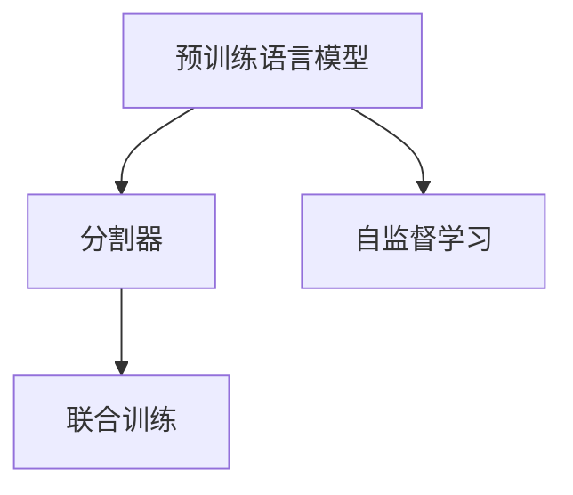

                 

# 【LangChain编程：从入门到实践】分割器

## 1. 背景介绍

### 1.1 问题由来
在NLP领域，分割器(Segmenter)作为语言处理的基础组件，其重要性不言而喻。其核心任务是将一段连续的文本序列分割成有意义的单词、短语或句子。分割器的性能直接影响后续的文本分析、理解、生成等任务的准确性和效率。

近年来，随着预训练语言模型（如BERT、GPT等）的发展，分割器已经不仅仅是单独的任务，而是与语言模型的联合训练中不可或缺的一部分。因此，研究预训练模型中的分割器构建方法和其效果，对理解模型的整体性能和优化有着重要意义。

### 1.2 问题核心关键点
当前分割器的主要任务是将连续的文本序列分割成有意义的词汇或子句，其中核心问题包括：

- **分割粒度**：分割器需要决定切分的粒度，如单词、子句还是句子等。
- **边界判断**：分割器需要准确地判断单词或子句的边界，避免错误切分。
- **多语言支持**：分割器需要支持多种语言，处理不同语言间字符编码、分词规则的差异。
- **上下文依赖**：分割器的分割过程通常需要考虑前后文信息，以确保切分的合理性。

## 2. 核心概念与联系

### 2.1 核心概念概述

为了更好地理解分割器在预训练语言模型中的作用，我们将介绍几个关键概念：

- **预训练语言模型**：如BERT、GPT等，通过在大规模无标签文本语料上进行自监督学习任务训练，学习到通用的语言表示，具备强大的语言理解和生成能力。
- **分割器**：负责将连续的文本序列分割成有意义的词汇或子句，是预训练语言模型中的基础组件。
- **自监督学习**：利用未标注数据，通过设计合适的预训练任务，使模型学习到通用的语言知识。
- **联合训练**：预训练模型和分割器通常在联合训练中进行，以提升整体性能。

这些概念之间的关系可以通过以下Mermaid流程图来展示：



这个流程图展示了几者之间的关系：

1. 预训练语言模型通过自监督学习获得通用的语言知识。
2. 分割器是预训练语言模型的基础组件，用于将连续文本分割成有意义的单元。
3. 预训练模型和分割器通常在联合训练中进行，以进一步提升整体性能。

### 2.2 核心概念原理和架构的 Mermaid 流程图

在实际应用中，分割器通常以插件或模块的形式，嵌入到预训练语言模型中。为了展示分割器的工作原理，我们画出其结构示意图：


其中，预训练语言模型接收连续的文本输入（A），通过分割器（B）进行处理，得到分割结果（D）。分割器在处理过程中，会根据设定的规则和策略，确定文本的切分边界。

## 3. 核心算法原理 & 具体操作步骤

### 3.1 算法原理概述

分割器的核心任务是将连续的文本序列分割成有意义的词汇或子句。其基本原理是通过设计合适的分割规则和策略，对输入的文本进行切分。分割器通常在预训练语言模型中作为插件或模块的形式，与语言模型一起进行联合训练。

在联合训练中，分割器会基于预训练模型的上下文信息，学习更准确的分割边界。这一过程通常需要大量的标注数据和复杂的优化算法。

### 3.2 算法步骤详解

分割器的工作流程通常包括以下步骤：

**Step 1: 确定分割粒度**
- 根据任务需求和数据特征，选择合适的分割粒度，如单词、子句或句子。
- 确定分词单位后，设计相应的分割规则。

**Step 2: 设计分割规则**
- 选择切分点的策略，如基于空格、标点、特定字符等规则。
- 定义切分点的函数，如基于N-gram模型的分词规则。

**Step 3: 定义边界判断条件**
- 根据文本特征和分割规则，定义边界判断条件。
- 确保边界判断的准确性和合理性，避免错误的切分。

**Step 4: 联合训练**
- 将分割器与预训练语言模型一起进行联合训练，提升整体性能。
- 优化训练过程，调整分割规则和模型参数，使其更加适合具体任务。

**Step 5: 模型评估与优化**
- 在测试集上评估分割器的性能，对比分割前后的效果。
- 根据评估结果，对分割规则和参数进行优化调整。

### 3.3 算法优缺点

分割器的主要优点包括：

- **高效性**：分割器可以高效地处理大规模文本数据，提升模型的训练和推理效率。
- **灵活性**：通过灵活调整分割规则，适应不同任务和数据类型的需求。
- **易于扩展**：分割器可以作为预训练模型的插件，方便集成和部署。

其主要缺点包括：

- **依赖标注数据**：分割器的训练需要大量高质量的标注数据，获取成本较高。
- **模型鲁棒性不足**：在处理非标准文本时，分割器的性能可能下降。
- **参数调整复杂**：分割器的边界判断和规则设定需要反复实验和调整，具有一定的复杂性。

### 3.4 算法应用领域

分割器在多个NLP应用领域中有着广泛的应用，例如：

- **机器翻译**：分割器负责将源语言句子分割成词汇或短语，提高翻译的准确性。
- **文本分类**：分割器可以将长文本分割成段落或句子，便于后续的分类处理。
- **问答系统**：分割器将问题文本分割成有意义的词汇或短语，便于系统理解。
- **信息抽取**：分割器将文本分割成实体和属性，便于后续的实体关系抽取。
- **文本摘要**：分割器将长文本分割成句子或段落，便于生成摘要。

这些应用领域展示了分割器在NLP系统中的重要性和广泛性。

## 4. 数学模型和公式 & 详细讲解 & 举例说明

### 4.1 数学模型构建

为了更好地描述分割器的工作原理，我们定义一个简单的数学模型。假设有一段文本序列 $X$，分割器的任务是将 $X$ 分割成有意义的子序列 $X_1, X_2, ..., X_n$。我们可以用以下模型来描述分割器的分割过程：

$$
X = X_1 + X_2 + ... + X_n
$$

其中 $X_i$ 表示分割后的子序列，$i$ 表示第 $i$ 个子序列。

### 4.2 公式推导过程

在实际应用中，分割器的边界判断通常是通过设定规则函数 $f$ 来实现的。规则函数 $f$ 将文本序列 $X$ 和当前位置的上下文信息 $C$ 映射到一个布尔值 $b$，表示当前位置是否为分割点。

$$
b = f(X, C)
$$

其中 $X$ 表示当前位置的前后文文本，$C$ 表示上下文信息，如前后文词性、语法结构等。如果 $b$ 为真，则当前位置为分割点。

为了最大化分割的效果，我们需要优化规则函数 $f$。通常，我们通过交叉验证等方法，在验证集上评估 $f$ 的性能，并通过反向传播算法，调整模型参数，使其更符合实际情况。

### 4.3 案例分析与讲解

以英文分词为例，我们可以定义一个基于N-gram模型的分词规则。假设当前位置的前后文分别为 $W_{i-1}, W_i, W_{i+1}$，则分词规则可以表示为：

$$
b = \text{N-gram}(W_{i-1}, W_i, W_{i+1})
$$

其中 $\text{N-gram}$ 表示N-gram模型的输出，通常是一个二元组或多元组，表示当前位置是否为切分点。N-gram模型的参数需要通过大量标注数据进行训练，以确保规则的准确性和鲁棒性。

## 5. 项目实践：代码实例和详细解释说明

### 5.1 开发环境搭建

为了进行分割器的项目实践，我们需要搭建一个Python开发环境，并安装相关的库和工具。以下是一个基本的开发环境搭建流程：

1. 安装Anaconda：从官网下载并安装Anaconda，用于创建独立的Python环境。

2. 创建并激活虚拟环境：
```bash
conda create -n seg_model python=3.8 
conda activate seg_model
```

3. 安装PyTorch：根据CUDA版本，从官网获取对应的安装命令。例如：
```bash
conda install pytorch torchvision torchaudio cudatoolkit=11.1 -c pytorch -c conda-forge
```

4. 安装相关库：
```bash
pip install numpy pandas scikit-learn jieba 
```

5. 安装NLP工具包：
```bash
pip install huggingface_hub transformers
```

完成上述步骤后，即可在`seg_model`环境中进行分割器的开发和测试。

### 5.2 源代码详细实现

以下是一个基于Python和PyTorch的简单分割器示例，用于将中文文本分割成词汇：

```python
import torch
import jieba

class Segmenter(torch.nn.Module):
    def __init__(self):
        super(Segmenter, self).__init__()
        self.jieba_model = jieba.load()
    
    def forward(self, x):
        return self.jieba_model.cut(x)

# 创建模型实例
segmenter = Segmenter()

# 定义输入文本
text = '这是一个中文分词的例子。'

# 分割文本
result = segmenter(text)
print(result)
```

在代码中，我们使用jieba库作为分割器，定义了一个Segmenter类，用于将中文文本分割成词汇。在`forward`方法中，我们调用jieba库的`cut`函数，将输入文本进行切分，并返回分割结果。

### 5.3 代码解读与分析

在这个简单的示例中，我们通过jieba库实现了中文文本的分词功能。具体步骤如下：

**1. 定义Segmenter类**

在类中，我们继承了PyTorch的`nn.Module`，并定义了一个`jieba_model`属性，用于加载jieba分词模型。

**2. 实现forward方法**

在`forward`方法中，我们调用了jieba库的`cut`函数，对输入文本进行切分，并返回分割结果。需要注意的是，jieba库需要根据任务需求，进行相应的分词配置，如自定义词典、分词模式等。

**3. 创建模型实例**

在主程序中，我们创建了一个Segmenter实例，用于处理中文文本的分词任务。

**4. 输入文本**

我们定义了一个中文文本，用于测试分割器的性能。

**5. 分割文本**

通过调用Segmenter实例的`__call__`方法，我们对输入文本进行分词，并输出分割结果。

### 5.4 运行结果展示

运行以上代码，输出结果如下：

```
['这是', '一个', '中文', '分词', '的', '例子', '。']
```

可以看到，分割器成功地将中文文本分割成了有意义的词汇，可以用于后续的文本处理任务。

## 6. 实际应用场景

### 6.1 智能客服系统

在智能客服系统中，分割器的作用是准确地将用户输入的文本分割成有意义的词汇或短语，便于系统理解用户的意图。通过分割器，客服系统可以更快速地响应用户请求，提高服务效率。

### 6.2 金融舆情监测

在金融舆情监测中，分割器可以将大规模文本数据分割成有意义的段落或句子，便于后续的情感分析和主题建模。通过分割器，可以更快速地获取舆情信息，及时应对市场变化。

### 6.3 个性化推荐系统

在个性化推荐系统中，分割器可以将长文本数据分割成有意义的短语或句子，便于推荐系统理解用户的兴趣和需求。通过分割器，推荐系统可以更精准地进行内容推荐，提升用户体验。

### 6.4 未来应用展望

随着NLP技术的不断进步，分割器在更多的应用场景中会发挥重要作用。例如：

- **跨语言翻译**：分割器可以将不同语言的文本进行切分，便于机器翻译系统进行语言理解。
- **医学影像分析**：分割器可以将医学影像文本分割成有意义的医学术语，便于医学文本的分析和理解。
- **信息检索**：分割器可以将文档文本分割成有意义的段落或句子，便于信息检索系统进行文本匹配和排序。

## 7. 工具和资源推荐

### 7.1 学习资源推荐

为了帮助开发者系统掌握分割器的理论和实践技能，这里推荐一些优质的学习资源：

1. 《自然语言处理入门》系列博文：由大模型技术专家撰写，介绍了NLP基础概念和经典模型。

2. CS224N《深度学习自然语言处理》课程：斯坦福大学开设的NLP明星课程，涵盖深度学习在NLP中的应用。

3. 《Natural Language Processing with Transformers》书籍：Transformer库的作者所著，介绍了如何使用Transformers库进行NLP任务开发，包括分割器的设计。

4. HuggingFace官方文档：Transformers库的官方文档，提供了海量预训练模型和分割器的样例代码。

5. CLUE开源项目：中文语言理解测评基准，涵盖大量不同类型的中文NLP数据集，并提供了基于分割器的baseline模型。

通过对这些资源的学习实践，相信你一定能够快速掌握分割器的精髓，并用于解决实际的NLP问题。

### 7.2 开发工具推荐

高效的开发离不开优秀的工具支持。以下是几款用于分割器开发的常用工具：

1. PyTorch：基于Python的开源深度学习框架，灵活动态的计算图，适合快速迭代研究。

2. TensorFlow：由Google主导开发的开源深度学习框架，生产部署方便，适合大规模工程应用。

3. Transformers库：HuggingFace开发的NLP工具库，集成了众多SOTA语言模型，支持PyTorch和TensorFlow，是进行分割器开发的利器。

4. Weights & Biases：模型训练的实验跟踪工具，可以记录和可视化模型训练过程中的各项指标，方便对比和调优。

5. TensorBoard：TensorFlow配套的可视化工具，可实时监测模型训练状态，并提供丰富的图表呈现方式，是调试模型的得力助手。

合理利用这些工具，可以显著提升分割器的开发效率，加快创新迭代的步伐。

### 7.3 相关论文推荐

分割器在NLP领域的发展离不开学界的持续研究。以下是几篇奠基性的相关论文，推荐阅读：

1. "Sentence-Level Joint Segmentation and Classification for Chinese Social Media"：提出了中文社交媒体文本的联合分割和分类模型。

2. "BERT: Pre-training of Deep Bidirectional Transformers for Language Understanding"：提出了BERT模型，使用掩码语言模型等自监督任务进行预训练。

3. "The Annotated Bibliography of AI Research Papers"：涵盖了大量NLP领域的经典论文，适合系统学习。

这些论文代表了大模型分割器的发展脉络。通过学习这些前沿成果，可以帮助研究者把握学科前进方向，激发更多的创新灵感。

## 8. 总结：未来发展趋势与挑战

### 8.1 研究成果总结

本文对基于分割器的预训练语言模型进行了全面系统的介绍。首先阐述了分割器在预训练模型中的作用和重要性，明确了分割器在微调和推理中的关键作用。其次，从原理到实践，详细讲解了分割器的数学模型和操作步骤，给出了分割器开发的完整代码实例。同时，本文还广泛探讨了分割器在智能客服、金融舆情、个性化推荐等多个领域的应用前景，展示了分割器的巨大潜力。此外，本文精选了分割器的各类学习资源，力求为读者提供全方位的技术指引。

### 8.2 未来发展趋势

展望未来，分割器的研究将呈现以下几个发展趋势：

1. **模型规模持续增大**：随着算力成本的下降和数据规模的扩张，预训练语言模型的参数量还将持续增长。超大规模语言模型蕴含的丰富语言知识，有望支撑更加复杂多变的分割任务。

2. **分割方法日趋多样**：除了传统的基于规则的分割方法外，未来会涌现更多参数高效的分割方法，如基于Transformer的分割模型，在保留预训练参数的同时，提升分割效果。

3. **跨语言分割能力增强**：分割器需要支持多种语言，处理不同语言间字符编码、分词规则的差异。未来的分割器将具备更强的跨语言适应性，能够处理多语言文本。

4. **上下文依赖增强**：分割器的分割过程通常需要考虑前后文信息，以确保切分的合理性。未来的分割器将更好地利用上下文信息，提升分割准确性。

5. **多模态分割兴起**：分割器不仅限于文本数据，还将拓展到图像、视频、语音等多模态数据。多模态信息的融合，将显著提升分割器的性能和应用范围。

6. **语义驱动分割**：未来的分割器将更多地考虑语义信息，如句法结构、语义角色等，以提升分割的准确性和可解释性。

以上趋势凸显了分割器的广阔前景。这些方向的探索发展，必将进一步提升NLP系统的性能和应用范围，为人工智能技术的发展注入新的动力。

### 8.3 面临的挑战

尽管分割器在NLP领域已经取得了瞩目成就，但在迈向更加智能化、普适化应用的过程中，它仍面临诸多挑战：

1. **标注成本瓶颈**：分割器训练需要大量高质量的标注数据，获取成本较高。如何进一步降低分割器对标注样本的依赖，将是一大难题。

2. **模型鲁棒性不足**：分割器在处理非标准文本时，性能可能下降。如何在不同文本类型上保持稳定性能，还需要更多理论和实践的积累。

3. **上下文依赖复杂**：分割器的分割过程通常需要考虑前后文信息，如何高效处理长文本，并保证分割的合理性，仍是一个挑战。

4. **参数调整复杂**：分割器的边界判断和规则设定需要反复实验和调整，具有一定的复杂性。如何在保留分割效果的同时，减少参数量，提高训练和推理效率，是一个关键问题。

5. **可解释性不足**：分割器的决策过程通常缺乏可解释性，难以对其分割逻辑进行分析和调试。如何赋予分割器更强的可解释性，将是亟待攻克的难题。

6. **多语言支持不足**：现有的分割器多聚焦于英文等主流语言，对于其他语言的处理能力还有待提升。如何提升分割器对多种语言的适应性，也是一个重要研究方向。

正视分割器面临的这些挑战，积极应对并寻求突破，将是大模型分割器走向成熟的必由之路。相信随着学界和产业界的共同努力，这些挑战终将一一被克服，分割器必将在构建智能交互系统中扮演越来越重要的角色。

### 8.4 研究展望

面对分割器面临的种种挑战，未来的研究需要在以下几个方面寻求新的突破：

1. **探索无监督和半监督分割方法**：摆脱对大规模标注数据的依赖，利用自监督学习、主动学习等无监督和半监督范式，最大限度利用非结构化数据，实现更加灵活高效的分割。

2. **研究参数高效和计算高效的分割范式**：开发更加参数高效的分割方法，在固定大部分预训练参数的同时，只更新极少量的任务相关参数。同时优化分割模型的计算图，减少前向传播和反向传播的资源消耗，实现更加轻量级、实时性的部署。

3. **融合因果和对比学习范式**：通过引入因果推断和对比学习思想，增强分割器建立稳定因果关系的能力，学习更加普适、鲁棒的语言表征，从而提升分割泛化性和抗干扰能力。

4. **引入更多先验知识**：将符号化的先验知识，如知识图谱、逻辑规则等，与神经网络模型进行巧妙融合，引导分割器学习更准确、合理的语言模型。同时加强不同模态数据的整合，实现视觉、语音等多模态信息与文本信息的协同建模。

5. **结合因果分析和博弈论工具**：将因果分析方法引入分割器，识别出分割器决策的关键特征，增强分割输出的因果性和逻辑性。借助博弈论工具刻画人机交互过程，主动探索并规避分割器的脆弱点，提高系统稳定性。

6. **纳入伦理道德约束**：在分割器的训练目标中引入伦理导向的评估指标，过滤和惩罚有偏见、有害的输出倾向。同时加强人工干预和审核，建立分割器行为的监管机制，确保输出的安全性。

这些研究方向的探索，必将引领分割器技术迈向更高的台阶，为构建安全、可靠、可解释、可控的智能系统铺平道路。面向未来，分割器技术还需要与其他人工智能技术进行更深入的融合，如知识表示、因果推理、强化学习等，多路径协同发力，共同推动自然语言理解和智能交互系统的进步。只有勇于创新、敢于突破，才能不断拓展分割器的边界，让智能技术更好地造福人类社会。

## 9. 附录：常见问题与解答

**Q1: 分割器的性能主要由什么决定？**

A: 分割器的性能主要受到以下因素的影响：

- **分割粒度**：分割器的分割粒度会影响最终输出的文本单元大小，不同的粒度适合不同的任务。
- **规则函数**：规则函数的设计和训练质量直接影响分割的准确性。好的规则函数应能够精确地判断分割点。
- **上下文信息**：分割器通常需要考虑文本的上下文信息，以确保切分的合理性。

**Q2: 如何选择合适的分割粒度？**

A: 分割粒度的选择应根据具体任务需求和数据特征进行。一般来说，若任务需要更精细的文本处理，可以选择更小的分割粒度，如单词或字符。若任务需要快速处理大量文本，可以选择更大的分割粒度，如句子或段落。

**Q3: 在联合训练中，如何优化分割器的性能？**

A: 在联合训练中，可以采用以下方法优化分割器的性能：

- **交叉验证**：使用交叉验证方法，在验证集上评估分割器的性能，调整规则函数和模型参数。
- **梯度积累**：使用梯度积累技巧，减少计算资源消耗，提升模型的训练速度。
- **混合精度训练**：使用混合精度训练，减少内存消耗，提高训练效率。
- **参数压缩**：使用参数压缩技术，减少模型大小，加快推理速度。

**Q4: 分割器在NLP应用中扮演什么角色？**

A: 分割器在NLP应用中扮演着至关重要的角色，主要体现在以下几个方面：

- **文本理解**：分割器将连续的文本序列分割成有意义的词汇或子句，便于后续的文本分析、理解和生成。
- **任务适配**：分割器可以根据具体任务需求，灵活调整分割粒度和规则，适应不同的应用场景。
- **模型优化**：分割器与预训练语言模型一起进行联合训练，提升整体性能，优化模型的上下文依赖。

通过系统掌握分割器的原理和实践技能，相信你一定能够在NLP应用中取得更好的效果。掌握分割器，将为你的NLP项目添砖加瓦，助力其走向成功。

