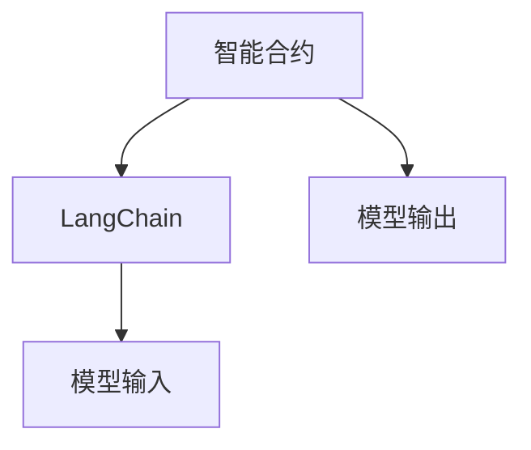

                 

# 【LangChain编程：从入门到实践】模型输入与输出

## 1. 背景介绍

在区块链领域，智能合约的编写和执行扮演着越来越重要的角色。智能合约不仅能够自动执行事先定义好的操作，还能够促进区块链应用之间的交互，提升系统的灵活性和可靠性。然而，编写智能合约并非易事，尤其是在Laminar Network（LaMoon）这样的高交易吞吐量网络中，性能和可扩展性成为主要的考虑因素。

因此，本文旨在帮助读者掌握LangChain的编程基础，尤其是如何高效地编写和优化智能合约的输入和输出。通过对LangChain编程的深入解析，读者将能够理解和实现模型输入与输出的最佳实践，从而在LaMoon网络上构建高性能、高可扩展性的智能合约。

## 2. 核心概念与联系

### 2.1 核心概念概述

为了更好地理解LangChain的编程，我们需要明确几个关键概念：

- **智能合约**：一种在区块链上运行的自动化协议，可以自动执行和强制执行合同条款。
- **LangChain**：Laminar Network的原生编程语言，支持智能合约的编写和执行。
- **模型输入**：智能合约接收的输入数据，用于触发特定操作。
- **模型输出**：智能合约执行操作后的结果，返回给调用者。

这些概念之间相互关联，构成了LangChain编程的基本框架。接下来，我们将深入探讨LangChain的编程原理和实践，帮助读者掌握模型输入与输出的核心技术。

### 2.2 核心概念原理和架构的 Mermaid 流程图



在上面的流程图中，智能合约是整个系统的核心，负责处理模型输入并生成模型输出。LangChain作为编程语言，为智能合约的编写和执行提供支持和工具。模型输入是智能合约运行的前提，而模型输出是智能合约处理数据的结果。

## 3. 核心算法原理 & 具体操作步骤

### 3.1 算法原理概述

LangChain的编程基于Solidity模型，通过虚拟机（VM）的执行方式来实现智能合约的功能。智能合约的输入数据通常是通过函数参数传递的，而输出则通过函数返回值或状态变量的修改来实现。

LangChain的编程范式遵循声明式编程原则，即通过声明变量、函数和事件来构建智能合约。这种编程风格强调可读性和可维护性，使得编写和调试智能合约变得更加容易。

### 3.2 算法步骤详解

#### 3.2.1 数据类型和变量

在LangChain中，数据类型包括布尔型（bool）、字节数组（bytes）、整数（uint）和字符串（string）等。变量声明通常使用关键字`let`或`var`，并指定类型。例如：

```langchain
let myBool = true;
let myBytes = bytes32('0x123456789');
let myUint = uint256(123);
let myString = 'Hello, World!';
```

#### 3.2.2 函数和事件

函数是智能合约中最基本的操作单位，用于实现特定的业务逻辑。函数可以接受输入参数，并返回输出结果。在LangChain中，函数声明通常使用关键字`function`，并指定函数名和参数列表。例如：

```langchain
function greeting(string memory name) public pure returns (string memory) {
    return "Hello, " + name + "!";
}
```

事件用于记录智能合约的执行状态和重要操作，可以触发其他智能合约的执行。事件声明通常使用关键字`event`，并指定事件名和参数列表。例如：

```langchain
event MyEvent(bool success, uint256 value);
```

#### 3.2.3 模型输入与输出

模型输入通常通过函数参数传递，可以是任何类型的数据。在函数定义中，输入参数的声明方式为`(参数类型 参数名)`。例如：

```langchain
function add(uint256 a, uint256 b) public pure returns (uint256) {
    return a + b;
}
```

模型输出通常通过函数返回值或状态变量的修改来实现。函数返回值的数据类型和参数类型必须匹配。例如：

```langchain
function getBalance(address _owner) public view returns (uint256) {
    return owner.balance(_owner);
}
```

### 3.3 算法优缺点

#### 3.3.1 优点

- **可读性和可维护性**：声明式编程风格使得智能合约的可读性和可维护性得到显著提升。
- **安全性**：通过函数和事件的设计，可以有效地限制和控制智能合约的权限和操作。
- **可扩展性**：支持各种数据类型和函数参数，使得智能合约可以处理复杂的数据结构和业务逻辑。

#### 3.3.2 缺点

- **性能开销**：声明式编程风格可能导致代码执行速度较慢，尤其是在处理大量数据时。
- **复杂度**：对于一些复杂的业务逻辑，声明式编程风格可能需要编写更多的代码。

### 3.4 算法应用领域

LangChain编程适用于各种智能合约的开发，包括金融、供应链、物联网等领域。在Laminar Network上，LangChain提供了高性能和可扩展性的编程环境，使得开发者能够快速构建高性能、高可扩展性的智能合约。

## 4. 数学模型和公式 & 详细讲解 & 举例说明

### 4.1 数学模型构建

LangChain的编程模型基于Solidity模型，采用虚拟机（VM）执行方式。模型的输入和输出通过函数参数和返回值来实现，具有以下特点：

- 模型输入通常通过函数参数传递，可以是任何类型的数据。
- 模型输出通常通过函数返回值或状态变量的修改来实现，数据类型和参数类型必须匹配。

### 4.2 公式推导过程

假设有一个简单的智能合约，用于计算两个整数的和。其函数声明如下：

```langchain
function add(uint256 a, uint256 b) public pure returns (uint256) {
    return a + b;
}
```

函数接受两个参数`a`和`b`，并返回它们的和。在这个函数中，`uint256`是整数类型，表示无符号64位整数。

### 4.3 案例分析与讲解

假设我们有一个智能合约，用于管理LaMoon网络上的交易。该合约包含以下函数：

- `transfer(address _to, uint256 _value)`：将一定数量的LAM（LaMoon网络的代币）转移到指定的地址。
- `getBalance(address _owner)`：获取指定地址的LAM余额。

下面是一个示例代码：

```langchain
contract MyContract {
    uint256 public balance;
    
    function transfer(address _to, uint256 _value) public {
        // 获取当前地址的LAM余额
        uint256 senderBalance = balance;
        
        // 判断是否足够支付
        if (senderBalance < _value) {
            revert("Insufficient balance.");
        }
        
        // 更新余额
        balance -= _value;
        
        // 将LAM转移到指定地址
        _to.transfer(_value);
        
        // 记录转账事件
        emit MyEvent(true, _value);
    }
    
    function getBalance(address _owner) public view returns (uint256) {
        return owner.balance(_owner);
    }
}
```

在上面的示例中，`transfer`函数用于转移LAM，接受两个参数：要转移到的地址和转移的数量。函数首先获取当前地址的LAM余额，然后判断是否足够支付。如果足够，则更新余额并将LAM转移到指定地址，最后记录转账事件。`getBalance`函数用于获取指定地址的LAM余额，通过调用`owner.balance`函数实现。

## 5. 项目实践：代码实例和详细解释说明

### 5.1 开发环境搭建

为了开始LangChain编程，我们需要安装Laminar Network的SDK。Laminar Network的SDK包括编译器和智能合约部署工具，可以在官网下载并按照说明进行安装。安装完成后，我们需要配置开发环境，包括编写智能合约所需的IDE和编译器。

### 5.2 源代码详细实现

假设我们要编写一个简单的智能合约，用于计算两个整数的和。代码如下：

```langchain
contract Adder {
    uint256 public sum;
    
    function add(uint256 a, uint256 b) public pure returns (uint256) {
        sum = a + b;
        return sum;
    }
}
```

在上面的代码中，`Adder`合约包含一个`sum`变量和一个`add`函数。`sum`变量用于存储两个整数的和，`add`函数用于计算两个整数的和，并返回结果。

### 5.3 代码解读与分析

在上面的示例中，`Adder`合约包含了两个关键部分：变量和函数。`sum`变量用于存储计算结果，`add`函数用于计算两个整数的和。`add`函数的参数`a`和`b`是输入数据，函数返回值是输出数据。

## 6. 实际应用场景

在实际应用中，LangChain编程可以应用于各种智能合约的开发。以下是几个实际应用场景：

### 6.1 金融合约

在金融领域，智能合约可以用于自动执行贷款合同、保险合同等。例如，一个贷款合约可以自动记录借款人的还款情况，并在逾期时触发违约事件，通知债权人进行处理。

### 6.2 供应链合约

在供应链领域，智能合约可以用于跟踪和管理货物运输、库存等。例如，一个货物运输合约可以自动记录货物的运输状态和位置，并在遇到异常情况时通知相关方进行处理。

### 6.3 物联网合约

在物联网领域，智能合约可以用于管理和控制物联网设备的运行状态和操作权限。例如，一个智能锁合约可以自动记录门锁的开关状态，并在非法打开时触发报警事件。

### 6.4 未来应用展望

随着Laminar Network的发展，LangChain编程的应用场景将越来越广泛。未来，LangChain将支持更多的数据类型和函数参数，使得智能合约能够处理更复杂的业务逻辑。此外，随着Laminar Network的网络性能和扩展性不断提升，LangChain编程的应用前景也将更加广阔。

## 7. 工具和资源推荐

### 7.1 学习资源推荐

为了帮助读者掌握LangChain的编程，以下是一些推荐的学习资源：

- LangChain官方文档：Laminar Network提供的官方文档，包含LangChain的编程规范、语法和最佳实践。
- Solidity官方文档：Solidity是LangChain编程的基础，官方文档提供了详细的Solidity语法和编程技巧。
- Laminar Network开发者社区：Laminar Network的开发者社区，提供丰富的编程资源和社区支持。

### 7.2 开发工具推荐

LangChain的开发需要依赖Laminar Network的SDK和开发环境，以下是一些推荐的开发工具：

- Visual Studio Code：轻量级的IDE，支持LangChain编程和调试。
- Remix IDE：Laminar Network的官方IDE，支持智能合约的编写、调试和部署。
- Truffle：以太坊生态系统的IDE，支持Solidity和LangChain编程。

### 7.3 相关论文推荐

以下是一些推荐的相关论文，供读者深入了解LangChain的编程：

- "Smart Contracts: A Survey of Technologies and Applications" by SmartBear
- "Blockchain Smart Contracts: A Survey" by TAgIX Project
- "Ethereum Programming Language and Smart Contracts" by Ethereum

## 8. 总结：未来发展趋势与挑战

### 8.1 研究成果总结

LangChain编程的引入为智能合约的编写和执行提供了更加灵活和高效的方式。通过声明式编程风格，智能合约的可读性和可维护性得到显著提升。然而，LangChain编程也面临一些挑战，如性能开销和代码复杂度等问题。

### 8.2 未来发展趋势

未来的LangChain编程将支持更多的数据类型和函数参数，使得智能合约能够处理更复杂的业务逻辑。随着Laminar Network的网络性能和扩展性不断提升，LangChain编程的应用前景也将更加广阔。

### 8.3 面临的挑战

尽管LangChain编程已经取得了显著进展，但仍然面临一些挑战：

- **性能开销**：声明式编程风格可能导致代码执行速度较慢，尤其是在处理大量数据时。
- **代码复杂度**：对于一些复杂的业务逻辑，声明式编程风格可能需要编写更多的代码。

### 8.4 研究展望

未来的研究可以从以下几个方向进行：

- **优化性能**：通过改进代码结构和算法，提升LangChain编程的执行速度。
- **简化语法**：研究更加简洁、易用的语法和语义，降低智能合约的编写复杂度。
- **增强安全**：通过引入更多的安全机制和最佳实践，提高智能合约的安全性和可靠性。

总之，LangChain编程为智能合约的开发提供了更加灵活和高效的方式，但也面临一些挑战。通过不断优化和改进，LangChain编程将为智能合约的开发和执行带来更多的可能性。

## 9. 附录：常见问题与解答

### 9.1 Q1: LangChain编程的语法和规范是什么？

A: LangChain编程基于Solidity模型，使用声明式编程风格。变量声明通常使用`let`或`var`关键字，函数声明使用`function`关键字，事件声明使用`event`关键字。变量和函数的数据类型需要匹配。

### 9.2 Q2: LangChain编程的性能开销如何？

A: 声明式编程风格可能导致代码执行速度较慢，尤其是在处理大量数据时。因此，需要优化代码结构和算法，提升性能。

### 9.3 Q3: LangChain编程如何处理复杂的业务逻辑？

A: 对于复杂的业务逻辑，可以引入更多的函数和事件，通过函数的组合和嵌套实现。同时，可以使用`guard`语句进行条件判断，确保代码逻辑的正确性。

---

作者：禅与计算机程序设计艺术 / Zen and the Art of Computer Programming

