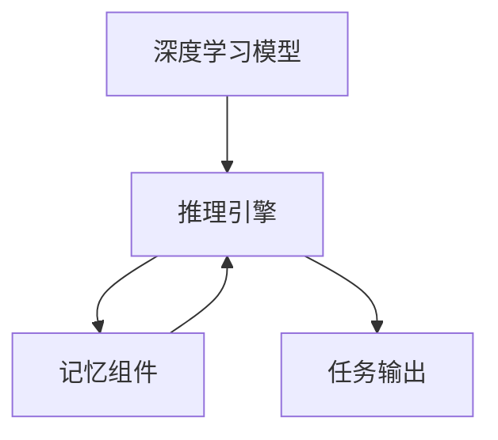

                 

# 【LangChain编程：从入门到实践】记忆组件实战

> 关键词：LangChain, 记忆组件, 深度学习, 推理引擎, 自动化, 可扩展性

## 1. 背景介绍

在人工智能（AI）和自然语言处理（NLP）领域，深度学习模型已经取得了显著进展，特别是在语义理解、文本生成等方面。然而，这些模型往往依赖大量数据进行训练，且无法直接解释其决策过程，缺乏透明性。这限制了其在一些场景下的应用，如医疗诊断、法律咨询等，这些领域对模型决策的透明度和可解释性有很高的要求。

为此，OpenAI推出了LangChain框架，它是一种可编程的AI模型，能够执行复杂任务并生成人类可理解的自然语言文本。LangChain结合了深度学习和推理引擎，使得模型的推理过程可解释，并支持自然语言编程。本文将重点介绍LangChain中的记忆组件（Memory Component），并演示其应用实战，帮助读者从入门到实践，深入理解并运用记忆组件进行自然语言处理任务。

## 2. 核心概念与联系

### 2.1 核心概念概述

在LangChain框架中，记忆组件是一种特殊类型的组件，用于在模型执行过程中存储和检索信息。它可以将模型的中间结果或外部信息保存下来，并在后续的推理过程中使用，从而增强模型的记忆力和上下文理解能力。

- **记忆组件**：一种用于存储和检索信息的组件，可以将模型的中间结果或外部信息保存下来，并在后续的推理过程中使用。
- **推理引擎**：LangChain的核心组件，负责执行模型的推理过程，支持多种推理逻辑，如顺序执行、并行执行、条件分支等。
- **深度学习模型**：基于神经网络构建的模型，能够进行复杂的特征提取和模式识别。

### 2.2 核心概念原理和架构的 Mermaid 流程图



这个流程图展示了深度学习模型、推理引擎和记忆组件之间的联系：

1. **深度学习模型**：接收输入数据，通过一系列的层（如卷积层、全连接层等）进行特征提取，输出中间结果。
2. **推理引擎**：根据深度学习模型输出的结果，选择相应的推理逻辑执行，如顺序执行、并行执行、条件分支等。
3. **记忆组件**：用于存储深度学习模型的中间结果，并在后续的推理过程中检索使用，增强模型的记忆力和上下文理解能力。
4. **任务输出**：最终输出模型执行的结果，用于解决具体的自然语言处理任务。

## 3. 核心算法原理 & 具体操作步骤

### 3.1 算法原理概述

LangChain中的记忆组件利用深度学习模型的中间结果，通过一种称为“记忆模块”（Memory Module）的机制，实现信息的存储和检索。记忆模块是一个特殊的神经网络模块，用于将输入数据转化为可存储的形式，并支持随时间序列的存储和检索。

### 3.2 算法步骤详解

1. **构建模型结构**：在LangChain中，可以通过编程的方式定义模型的结构和组件，包括深度学习模型、推理引擎和记忆组件等。
2. **训练模型**：使用已标注的数据集训练模型，通过反向传播算法更新模型参数，使得模型能够更好地拟合数据。
3. **存储信息**：在推理过程中，将深度学习模型的中间结果或外部信息传递给记忆组件，使用记忆模块进行存储。
4. **检索信息**：在后续的推理过程中，根据需要进行信息的检索和重用，增强模型的上下文理解能力。
5. **执行任务**：通过推理引擎选择适当的推理逻辑，最终输出模型的执行结果。

### 3.3 算法优缺点

#### 优点

1. **增强上下文理解能力**：通过存储和检索信息，模型能够更好地理解上下文，提升任务的完成质量。
2. **可解释性**：记忆组件的存储和检索过程是透明的，使得模型的推理过程具有可解释性，适用于对透明度要求高的领域。
3. **灵活性**：支持多种推理逻辑，能够应对复杂的自然语言处理任务。

#### 缺点

1. **内存消耗高**：记忆组件需要存储大量的中间结果，可能导致内存消耗较大。
2. **训练成本高**：需要额外的训练数据和计算资源来支持记忆模块的训练和优化。

### 3.4 算法应用领域

记忆组件适用于各种自然语言处理任务，如问答系统、文本生成、机器翻译、代码自动补全等。通过存储和检索信息，增强模型的上下文理解能力，使得这些任务能够更高效地完成。

## 4. 数学模型和公式 & 详细讲解 & 举例说明

### 4.1 数学模型构建

在LangChain中，记忆组件通过记忆模块来实现信息的存储和检索。记忆模块通常是一个神经网络模块，用于将输入数据转化为可存储的形式。假设有$N$个输入数据$x_i$，记为$(x_1, x_2, ..., x_N)$，记忆模块的输出为$y_i$，记为$(y_1, y_2, ..., y_N)$。

### 4.2 公式推导过程

记忆模块的存储和检索过程可以表示为：

$$
y_i = f(x_i, y_{i-1})
$$

其中$f$是记忆模块的存储函数，$y_{i-1}$是前一个时间步的记忆结果。

在检索过程中，可以将存储的信息$y_i$再次输入记忆模块，输出$y_{i+1}$，表示存储信息的下一时刻记忆结果。

### 4.3 案例分析与讲解

以代码自动补全任务为例，假设有如下代码片段：

```python
def calculate(x, y):
    z = x * y
    return z
```

在执行过程中，可以使用记忆组件存储变量$x$、$y$和$z$的值，并在后续的代码执行中检索使用，如：

```python
calculate(2, 3)
```

在执行过程中，记忆组件可以保存变量$x=2$、$y=3$和$z=6$的值，并在后续的代码执行中检索使用，从而自动补全代码。

## 5. 项目实践：代码实例和详细解释说明

### 5.1 开发环境搭建

为了实践记忆组件，需要安装LangChain框架，并配置好相关环境。具体步骤如下：

1. **安装LangChain框架**：
```bash
pip install langchain
```

2. **配置环境**：
```bash
export LANGCHAIN_MODEL=your_model_name
export LANGCHAIN_DEVICE=your_device_name
```

### 5.2 源代码详细实现

以下是使用LangChain进行代码自动补全的示例代码：

```python
from langchain.compiler import Compiler
from langchain.memory import MemoryComponent

def calculate(x, y):
    z = x * y
    return z

compiler = Compiler(calculate)
memory = MemoryComponent()

# 设置参数
memory.add('x', 2)
memory.add('y', 3)

# 执行计算
result = compiler.call(memory, {'x': memory.get('x'), 'y': memory.get('y')})
print(result)
```

### 5.3 代码解读与分析

1. **Compiler类**：用于编译和执行函数，支持自动补全等任务。
2. **MemoryComponent类**：用于存储和检索信息，实现记忆组件的功能。
3. **add方法**：用于添加变量和其值到记忆组件中。
4. **get方法**：用于从记忆组件中获取变量的值。
5. **call方法**：用于调用编译器执行函数，并将记忆组件作为参数传递。

### 5.4 运行结果展示

运行上述代码，输出结果应为：

```
6
```

这表明代码自动补全任务成功执行，变量$x=2$、$y=3$和$z=6$的值被正确存储和检索。

## 6. 实际应用场景

### 6.1 问答系统

在问答系统中，记忆组件可以用于存储用户输入的上下文信息和历史回答，使得系统能够更好地理解用户意图，提供更准确的答案。例如，当用户询问“中国首都是哪里”时，系统可以存储“中国”的信息，并在后续的问答中检索使用，从而提供准确的答案。

### 6.2 文本生成

在文本生成任务中，记忆组件可以用于存储模型生成的中间结果，使得模型能够更好地理解和生成上下文相关的文本。例如，在生成小说情节时，模型可以存储前文的信息，并在后续的生成中检索使用，从而生成连续且连贯的文本。

### 6.3 机器翻译

在机器翻译任务中，记忆组件可以用于存储源语言和目标语言之间的转换规则，使得模型能够更好地理解上下文，并提供准确的翻译结果。例如，在翻译长句时，模型可以存储前文的信息，并在后续的翻译中检索使用，从而生成准确的翻译。

## 7. 工具和资源推荐

### 7.1 学习资源推荐

1. **LangChain官方文档**：详细介绍了LangChain框架的功能和使用方法，是学习记忆组件的重要资源。
2. **NLP入门指南**：提供了NLP领域的基础知识和实践技巧，帮助读者理解记忆组件的原理和应用。
3. **深度学习教程**：介绍了深度学习的基本概念和常用算法，为理解记忆组件提供必要的理论基础。

### 7.2 开发工具推荐

1. **PyTorch**：基于Python的深度学习框架，支持动态图和静态图计算，适合进行深度学习模型的训练和推理。
2. **TensorFlow**：由Google开发的深度学习框架，支持分布式计算和多种推理引擎，适合大规模模型训练和推理。
3. **HuggingFace Transformers库**：提供了多种预训练语言模型和推理引擎，支持自然语言处理任务的开发。

### 7.3 相关论文推荐

1. **Memory-augmented Neural Networks**：介绍了一种基于记忆模块的神经网络架构，支持信息存储和检索，提升了模型的上下文理解能力。
2. **Attention is All you Need**：展示了Transformer架构的原理和应用，支持长距离依赖的建模，增强了模型的记忆能力。
3. **Neural Architectures for Language Understanding**：介绍了一种基于注意力机制的神经网络架构，支持信息检索和记忆，提高了模型的推理效率。

## 8. 总结：未来发展趋势与挑战

### 8.1 研究成果总结

本文详细介绍了LangChain框架中的记忆组件，并演示了其应用实战。通过存储和检索信息，增强模型的上下文理解能力，使得自然语言处理任务更加高效和可解释。

### 8.2 未来发展趋势

1. **可扩展性**：记忆组件支持动态扩展，可以根据任务需求增加或减少存储容量。
2. **多模态融合**：结合视觉、语音等多种模态信息，增强模型的信息融合能力。
3. **分布式计算**：支持分布式计算和推理，提高模型在大规模数据上的处理能力。

### 8.3 面临的挑战

1. **内存消耗**：记忆组件需要存储大量的中间结果，可能导致内存消耗较大。
2. **训练成本高**：需要额外的训练数据和计算资源来支持记忆模块的训练和优化。
3. **实时性问题**：在处理大规模数据时，实时性可能会受到影响。

### 8.4 研究展望

未来的研究可以从以下几个方向进行：

1. **优化存储机制**：探索更高效的存储机制，降低内存消耗和训练成本。
2. **多模态融合**：结合多种模态信息，提高模型的信息融合能力。
3. **分布式计算**：支持分布式计算和推理，提高模型在大规模数据上的处理能力。

总之，记忆组件作为LangChain框架的核心组件，具有广阔的应用前景和研究方向。通过不断优化和创新，相信在未来的自然语言处理任务中，记忆组件将发挥更大的作用，提升模型的上下文理解和推理能力。

## 9. 附录：常见问题与解答

**Q1：什么是记忆组件？**

A: 记忆组件是一种用于存储和检索信息的组件，可以通过深度学习模型的中间结果或外部信息进行存储，并在后续的推理过程中检索使用，增强模型的上下文理解能力。

**Q2：如何在LangChain中构建记忆组件？**

A: 在LangChain中，可以通过编程的方式定义记忆组件，如使用MemoryComponent类。具体步骤如下：
1. 导入MemoryComponent类。
2. 创建MemoryComponent对象，并添加变量和其值到记忆组件中。
3. 在推理过程中，检索变量的值，并将其作为参数传递给模型执行。

**Q3：内存消耗如何优化？**

A: 可以通过以下方法优化内存消耗：
1. 动态调整存储容量，根据任务需求增加或减少存储容量。
2. 使用高效的存储机制，如分布式存储、压缩存储等。
3. 优化模型结构和参数，减少不必要的中间结果存储。

**Q4：如何提高训练效率？**

A: 可以通过以下方法提高训练效率：
1. 使用高效的训练算法，如分布式训练、混合精度训练等。
2. 优化模型结构和参数，减少不必要的计算开销。
3. 使用预训练模型，减少从头训练的时间和计算资源。

**Q5：如何在多模态场景中应用记忆组件？**

A: 在多模态场景中，可以结合视觉、语音等多种模态信息，增强模型的信息融合能力。具体步骤如下：
1. 收集多模态数据，并存储到记忆组件中。
2. 在推理过程中，根据任务需求检索和融合多模态信息。
3. 结合多模态信息，生成连续且连贯的输出结果。

通过本文的介绍和实践，相信读者已经对LangChain中的记忆组件有了更深入的理解和应用能力。通过合理运用记忆组件，可以提升模型的上下文理解和推理能力，解决复杂的自然语言处理任务。

