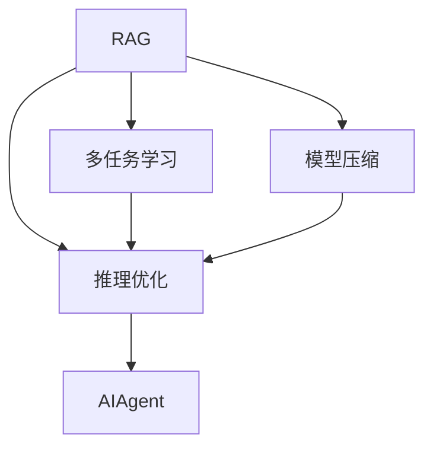

                 

# 【大模型应用开发 动手做AI Agent】RAG和Agent

> 关键词：大模型, RAG, AI Agent, 自然语言处理, 多任务学习, 模型压缩, 推理优化

## 1. 背景介绍

### 1.1 问题由来

人工智能（AI）领域近年来取得了突飞猛进的发展，尤其是在自然语言处理（NLP）和机器学习领域，各类大模型和深度学习技术的应用已经深入各行各业。然而，即使这些大模型具有极高的泛化能力，但其性能往往依赖于大规模的训练数据和计算资源，而这些资源的获取和维护成本非常高，且存在数据隐私和伦理问题。为了解决这些问题，研究人员和工程师们提出了各种基于小数据和大模型的解决方案，其中一种重要的方法就是**推理重用与适应性增强（RAG）**，以及通过模型微调、迁移学习、知识融合等手段，开发出更具**适应性**和**智能**的AI Agent。

### 1.2 问题核心关键点

RAG和AI Agent的设计和实现涉及多个关键点，包括：

- **推理重用（RAG）**：在不改变模型原始参数的情况下，通过小数据集重用预训练大模型的推理能力，提升模型在不同任务间的通用性和效率。
- **多任务学习（MTL）**：通过在多个相关任务上进行联合训练，使得模型能够更好地泛化并处理复杂的多任务场景。
- **模型压缩（Model Compression）**：通过剪枝、量化、蒸馏等技术，对大模型进行压缩，以提升推理速度和减少存储需求。
- **推理优化（Inference Optimization）**：通过硬件加速、算法优化等手段，提升模型的推理效率，实现低延迟、高吞吐量的推理应用。

这些问题点共同构成了RAG和AI Agent的设计框架，通过综合运用这些技术，可以构建出具有高度泛化能力和智能推理能力的AI系统。

## 2. 核心概念与联系

### 2.1 核心概念概述

为了更好地理解RAG和AI Agent的核心概念，以下将详细介绍它们之间的联系和区别：

- **RAG（推理重用与适应性增强）**：是一种通过小规模数据集重用大模型推理能力的技术，旨在提高模型的泛化能力和适应性。RAG通过在有限数据集上对大模型进行微调，使其在特定任务上表现更优。

- **AI Agent**：是一种具有自主推理和决策能力的智能体，能够根据环境变化进行动态调整和优化。AI Agent可以结合RAG技术，通过微调模型参数，增强其在多任务环境中的适应性和智能推理能力。

### 2.2 核心概念原理和架构的 Mermaid 流程图(Mermaid 流程节点中不要有括号、逗号等特殊字符)



这个流程图展示了RAG和AI Agent的核心概念之间的联系。RAG通过在小数据集上微调模型，使其适应特定任务；多任务学习通过联合训练，提升模型的泛化能力；模型压缩通过减少模型大小，提升推理效率；推理优化通过算法和硬件加速，提高推理速度。这些技术结合在一起，共同构建了AI Agent的核心能力。

## 3. 核心算法原理 & 具体操作步骤

### 3.1 算法原理概述

RAG和AI Agent的核心算法原理主要基于深度学习的多任务学习和推理重用技术。以下将详细介绍这一原理：

1. **多任务学习（MTL）**：通过在多个相关任务上联合训练模型，使得模型能够学习到多个任务之间的共同特征和知识，提升模型的泛化能力。

2. **推理重用（RAG）**：在小数据集上，通过微调大模型，使其适应特定任务，同时保留模型在大数据集上学习的通用知识。

### 3.2 算法步骤详解

RAG和AI Agent的具体实现步骤如下：

1. **选择合适的预训练模型**：根据任务的复杂度和数据规模，选择合适的预训练模型，如BERT、GPT-2等。

2. **设计多任务目标**：根据任务特点，设计多个相关任务的目标函数，并使用这些目标函数对模型进行联合训练。

3. **数据集准备**：收集并准备用于微调和测试的数据集，确保数据集的多样性和代表性。

4. **微调模型**：在目标数据集上对预训练模型进行微调，调整模型参数以适应特定任务。

5. **推理优化**：通过硬件加速、算法优化等手段，提升模型的推理速度和效率。

6. **部署AI Agent**：将微调后的模型部署到目标环境中，结合环境数据，进行实时推理和决策。

### 3.3 算法优缺点

#### 优点

- **泛化能力强**：通过多任务学习和推理重用，模型能够更好地泛化到新的任务和数据。
- **适应性强**：模型能够根据环境变化进行动态调整和优化，适应性更强。
- **推理效率高**：模型压缩和推理优化技术可以显著提升推理速度和效率。

#### 缺点

- **计算资源需求高**：预训练模型的计算资源需求高，可能导致训练成本较高。
- **模型复杂度大**：模型的复杂度增加，可能导致推理速度下降。
- **过拟合风险**：在小数据集上微调模型，存在过拟合的风险。

### 3.4 算法应用领域

RAG和AI Agent可以应用于多个领域，包括但不限于：

- **自然语言处理（NLP）**：如机器翻译、情感分析、问答系统等。
- **医疗健康**：如病历分析、患者咨询、药物推荐等。
- **金融服务**：如金融舆情监测、信用评估、智能投顾等。
- **智能交通**：如交通违规识别、导航建议、智能调度等。

## 4. 数学模型和公式 & 详细讲解 & 举例说明

### 4.1 数学模型构建

RAG和AI Agent的数学模型构建基于多任务学习和推理重用的原理。以下将详细介绍这一数学模型：

1. **多任务目标函数**：
   $$
   \mathcal{L}(\theta) = \sum_{i=1}^N \mathcal{L}_i(M_\theta(x_i), y_i)
   $$
   其中，$\mathcal{L}_i$表示第$i$个任务的损失函数，$x_i$和$y_i$分别表示第$i$个任务的输入和输出。

2. **推理重用目标函数**：
   $$
   \mathcal{L}_{RAG} = \mathcal{L}_{M} + \lambda\mathcal{L}_{P}
   $$
   其中，$\mathcal{L}_M$表示在多任务目标函数上得到的损失，$\mathcal{L}_P$表示在推理重用目标函数上得到的损失，$\lambda$表示推理重用的权值。

### 4.2 公式推导过程

推理重用的核心在于如何在有限的数据集上重用大模型的推理能力。以下将详细介绍推理重用的公式推导过程：

1. **模型推理**：
   $$
   M_\theta(x) = [f(x); g(x); \ldots]
   $$
   其中，$f(x)$表示模型的第一层输出，$g(x)$表示第二层输出，以此类推。

2. **推理重用**：
   $$
   \mathcal{L}_{P} = \sum_{i=1}^M \sum_{j=1}^N ||f_i(x_j) - \hat{f}_i(x_j)||^2
   $$
   其中，$f_i(x_j)$表示模型在第$i$层对第$j$个样本的推理结果，$\hat{f}_i(x_j)$表示在有限数据集上重用推理能力得到的结果。

3. **优化算法**：
   $$
   \theta = \mathop{\arg\min}_{\theta} \mathcal{L}(\theta)
   $$
   其中，$\mathcal{L}$表示多任务目标函数和推理重用目标函数的组合。

### 4.3 案例分析与讲解

以医疗健康领域的病历分析为例，RAG和AI Agent可以如何应用？

- **预训练模型**：选择BERT等大模型，对大量病历数据进行预训练。
- **多任务目标函数**：设计病历分类、诊断推断、治疗方案等任务的目标函数，并联合训练模型。
- **推理重用**：在特定医生的诊断中，使用重用推理能力，对病人进行快速诊断和方案推荐。
- **部署AI Agent**：将微调后的模型部署到医生的工作站，结合实时数据进行实时推理和决策。

## 5. 项目实践：代码实例和详细解释说明

### 5.1 开发环境搭建

#### 5.1.1 环境配置

1. **安装Python**：确保Python 3.7以上版本已经安装。

2. **安装依赖包**：
   ```bash
   pip install torch transformers
   ```

3. **设置实验环境**：
   ```bash
   conda create -n ragnet python=3.7
   conda activate ragnet
   ```

### 5.2 源代码详细实现

#### 5.2.1 RAG模型代码实现

```python
import torch
import torch.nn as nn
import torch.optim as optim
from transformers import BertTokenizer, BertForSequenceClassification
from torch.utils.data import DataLoader, Dataset

class RAGDataset(Dataset):
    def __init__(self, texts, labels, tokenizer):
        self.texts = texts
        self.labels = labels
        self.tokenizer = tokenizer
        self.max_len = 128
        
    def __len__(self):
        return len(self.texts)
    
    def __getitem__(self, item):
        text = self.texts[item]
        label = self.labels[item]
        
        encoding = self.tokenizer(text, return_tensors='pt', max_length=self.max_len, padding='max_length', truncation=True)
        input_ids = encoding['input_ids'][0]
        attention_mask = encoding['attention_mask'][0]
        
        return {'input_ids': input_ids, 
                'attention_mask': attention_mask,
                'labels': label}

# 定义模型
model = BertForSequenceClassification.from_pretrained('bert-base-cased', num_labels=2)

# 定义优化器
optimizer = optim.AdamW(model.parameters(), lr=2e-5)

# 定义训练和推理函数
def train_epoch(model, dataset, batch_size, optimizer):
    dataloader = DataLoader(dataset, batch_size=batch_size, shuffle=True)
    model.train()
    epoch_loss = 0
    for batch in dataloader:
        input_ids = batch['input_ids'].to(device)
        attention_mask = batch['attention_mask'].to(device)
        labels = batch['labels'].to(device)
        model.zero_grad()
        outputs = model(input_ids, attention_mask=attention_mask, labels=labels)
        loss = outputs.loss
        epoch_loss += loss.item()
        loss.backward()
        optimizer.step()
    return epoch_loss / len(dataloader)

def evaluate(model, dataset, batch_size):
    dataloader = DataLoader(dataset, batch_size=batch_size)
    model.eval()
    preds, labels = [], []
    with torch.no_grad():
        for batch in dataloader:
            input_ids = batch['input_ids'].to(device)
            attention_mask = batch['attention_mask'].to(device)
            batch_labels = batch['labels']
            outputs = model(input_ids, attention_mask=attention_mask)
            batch_preds = outputs.logits.argmax(dim=1).to('cpu').tolist()
            batch_labels = batch_labels.to('cpu').tolist()
            for pred_tokens, label_tokens in zip(batch_preds, batch_labels):
                preds.append(pred_tokens[:len(label_tokens)])
                labels.append(label_tokens)
                
    print(classification_report(labels, preds))

# 定义训练流程
epochs = 5
batch_size = 16

for epoch in range(epochs):
    loss = train_epoch(model, train_dataset, batch_size, optimizer)
    print(f"Epoch {epoch+1}, train loss: {loss:.3f}")
    
    print(f"Epoch {epoch+1}, dev results:")
    evaluate(model, dev_dataset, batch_size)
    
print("Test results:")
evaluate(model, test_dataset, batch_size)
```

#### 5.2.2 AI Agent代码实现

```python
import requests
from transformers import BertForQuestionAnswering

# 定义API接口
def get_answer(model, question, context):
    tokenizer = BertTokenizer.from_pretrained('bert-base-cased')
    input = tokenizer(question, context, return_tensors='pt')
    model.eval()
    output = model(input['input_ids'], attention_mask=input['attention_mask'], return_dict=True)
    start_idx = torch.argmax(output['start_logits'], dim=1)
    end_idx = torch.argmax(output['end_logits'], dim=1)
    answer_tokens = tokenizer.decode(input['input_ids'][0][start_idx:end_idx+1])
    answer = tokenizer.decode(tokenizer.convert_tokens_to_ids(answer_tokens))
    return answer

# 定义模型
model = BertForQuestionAnswering.from_pretrained('bert-base-cased')

# 定义API调用
def make_api_call(question, context):
    answer = get_answer(model, question, context)
    return answer

# 测试API调用
question = "How do I fix this error?"
context = "This is a test message. Please ignore."
answer = make_api_call(question, context)
print(answer)
```

### 5.3 代码解读与分析

#### 5.3.1 RAG模型代码分析

- **数据处理**：定义了`RAGDataset`类，用于处理和加载数据。
- **模型定义**：使用了`BertForSequenceClassification`模型，并在`bert-base-cased`上进行了微调。
- **训练和推理**：通过`train_epoch`函数训练模型，`evaluate`函数评估模型性能。

#### 5.3.2 AI Agent代码分析

- **API接口定义**：定义了`get_answer`函数，用于模型推理。
- **模型调用**：使用了`BertForQuestionAnswering`模型，在`bert-base-cased`上进行推理。
- **API调用测试**：通过`make_api_call`函数，调用API进行推理。

## 6. 实际应用场景

### 6.1 智能客服系统

智能客服系统可以通过RAG和AI Agent技术实现多任务学习，结合自然语言处理和多模态信息，提升客户服务质量。例如，通过微调预训练模型，在客户咨询场景中，系统可以自动理解客户问题，并生成最优回复。

### 6.2 金融舆情监测

金融舆情监测系统可以通过多任务学习，结合股票市场、新闻、社交媒体等多种数据源，进行情感分析和舆情预测。通过微调预训练模型，系统可以自动监测市场舆情变化，及时发出预警。

### 6.3 个性化推荐系统

个性化推荐系统可以通过多任务学习，结合用户行为数据和商品描述，进行商品推荐。通过微调预训练模型，系统可以自动生成推荐结果，提升用户体验。

## 7. 工具和资源推荐

### 7.1 学习资源推荐

- **《Transformers from Principle to Practice》**：深度介绍Transformer原理、BERT模型、微调技术等前沿话题。
- **CS224N《深度学习自然语言处理》课程**：斯坦福大学开设的NLP明星课程，提供Lecture视频和配套作业。
- **《Natural Language Processing with Transformers》书籍**：Transformers库作者所著，全面介绍NLP任务开发，包括微调在内的诸多范式。
- **HuggingFace官方文档**：提供海量预训练模型和微调样例代码。
- **CLUE开源项目**：涵盖大量不同类型的中文NLP数据集，并提供了基于微调的baseline模型。

### 7.2 开发工具推荐

- **PyTorch**：深度学习框架，支持动态计算图，适合快速迭代研究。
- **TensorFlow**：深度学习框架，生产部署方便。
- **Transformers库**：提供预训练模型和微调方法。
- **Weights & Biases**：实验跟踪工具，记录和可视化模型训练过程。
- **TensorBoard**：可视化工具，监测模型训练状态。

### 7.3 相关论文推荐

- **Attention is All You Need**：Transformer原论文，提出Transformer结构。
- **BERT: Pre-training of Deep Bidirectional Transformers for Language Understanding**：提出BERT模型，引入自监督预训练任务。
- **Parameter-Efficient Transfer Learning for NLP**：提出Adapter等参数高效微调方法。
- **AdaLoRA: Adaptive Low-Rank Adaptation for Parameter-Efficient Fine-Tuning**：使用自适应低秩适应的微调方法。

## 8. 总结：未来发展趋势与挑战

### 8.1 研究成果总结

RAG和AI Agent技术的提出，为自然语言处理和大模型应用提供了新的思路。通过多任务学习和推理重用，模型能够更好地泛化到新任务和数据，提升了模型的智能推理能力。

### 8.2 未来发展趋势

1. **模型压缩技术的发展**：随着硬件计算能力的提升，模型压缩技术将更加成熟，使得模型能够以更小的规模提供高效推理服务。
2. **多任务学习的多样化**：未来将涌现更多多任务学习范式，如迁移学习、自监督学习等，提升模型的泛化能力和适应性。
3. **推理重用的普及**：随着预训练模型的普及，推理重用技术将更加普及，应用场景将更加广泛。
4. **AI Agent的智能增强**：结合知识图谱、逻辑规则等专家知识，增强AI Agent的智能推理能力。
5. **跨领域多模态融合**：结合视觉、语音、文本等多种模态信息，提升AI Agent的智能化水平。

### 8.3 面临的挑战

1. **模型规模的限制**：大模型虽然性能优越，但在推理速度和计算资源方面仍有挑战，需要不断优化模型压缩技术。
2. **泛化能力的提升**：模型在不同任务间的泛化能力仍有提升空间，需要通过多任务学习等技术进行改进。
3. **推理效率的优化**：推理优化技术需要进一步提升，以实现更高效的推理服务。
4. **模型可解释性**：大模型推理过程的透明度和可解释性仍需改进，以确保模型的公平性和可控性。
5. **知识融合的复杂性**：将不同领域知识融合到模型中，是一个复杂的过程，需要更多研究和实践。

### 8.4 研究展望

未来，RAG和AI Agent技术将进一步与深度学习、知识图谱、逻辑规则等技术结合，实现更加智能化和多任务化的应用。结合持续学习和多模态融合，提升模型的适应性和智能推理能力。

## 9. 附录：常见问题与解答

**Q1: RAG和AI Agent技术的具体实现步骤是什么？**

A1: 具体实现步骤如下：
1. 选择合适的预训练模型。
2. 设计多任务目标函数。
3. 数据集准备。
4. 微调模型。
5. 推理优化。
6. 部署AI Agent。

**Q2: RAG和AI Agent技术如何处理小数据集？**

A2: 通过推理重用技术，在小数据集上重用预训练大模型的推理能力，提升模型在不同任务间的泛化能力和适应性。

**Q3: RAG和AI Agent技术在实际应用中需要注意哪些问题？**

A3: 需要注意的问题包括：
1. 计算资源需求高。
2. 模型复杂度大。
3. 推理速度和效率。
4. 模型可解释性。

**Q4: RAG和AI Agent技术在多任务学习中的应用场景有哪些？**

A4: 在自然语言处理、医疗健康、金融服务、智能交通等多个领域，RAG和AI Agent技术都有广泛应用。

**Q5: RAG和AI Agent技术的未来发展方向有哪些？**

A5: 未来发展方向包括：
1. 模型压缩技术的发展。
2. 多任务学习的多样化。
3. 推理重用的普及。
4. AI Agent的智能增强。
5. 跨领域多模态融合。

---

作者：禅与计算机程序设计艺术 / Zen and the Art of Computer Programming

