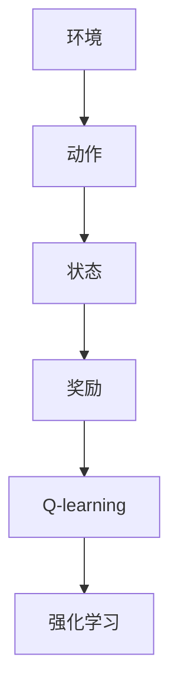

                 

## 1. 背景介绍

### 1.1 问题由来

随着人工智能技术在各行各业的深入应用，其在工业控制领域的潜力也逐渐显现。传统的工业控制依赖于预设的控制策略和实时监控系统，但这些系统往往无法适应复杂的生产环境变化，且响应速度和调整灵活性不足。AI技术，特别是强化学习（Reinforcement Learning, RL），提供了一种自适应、自优化的解决方案，能够自动学习最优控制策略，适应不确定性，并应对复杂的环境变化。

### 1.2 问题核心关键点

AI Q-learning，作为强化学习中的一种经典算法，通过构建模型来映射环境与动作之间的最优策略，进而实现环境适应和策略优化。在工业控制中，Q-learning可以被应用于设备调优、流程优化、机器人控制等多个方面，具有显著的应用前景。

AI Q-learning的核心思想是：通过与环境交互，模型逐步学习最优动作策略，从而在特定环境下获取最大的回报（即优化目标）。这种自适应学习方式，使得AI Q-learning在处理复杂动态系统时表现出独特的优势。

### 1.3 问题研究意义

AI Q-learning在工业控制中的应用，有助于提高生产效率、降低成本、提升产品质量，同时减少人为干预，提高系统的安全性和可靠性。通过自动化、智能化控制，工业企业可以更好地应对市场变化和不确定性，增强竞争力。

## 2. 核心概念与联系

### 2.1 核心概念概述

为更好地理解AI Q-learning在工业控制中的应用，本节将介绍几个密切相关的核心概念：

- **强化学习（Reinforcement Learning, RL）**：一种通过与环境交互，逐步学习最优策略的学习范式。目标是通过获取环境反馈（奖励或惩罚），最大化累积回报。

- **Q-learning**：一种基于值函数（Q值函数）的强化学习算法，通过更新Q值函数来优化策略选择。

- **环境（Environment）**：RL中的交互对象，即强化学习算法需要适应的动态系统。在工业控制中，环境可以是生产线、机器人、传感器等。

- **动作（Action）**：在特定环境下，AI可以采取的行动，例如调节温度、调整速度等。

- **状态（State）**：环境中的关键变量，即AI需要关注的系统状态，如温度、湿度、压力等。

这些核心概念之间的逻辑关系可以通过以下Mermaid流程图来展示：



这个流程图展示了她强化学习的主要流程：

1. 环境通过动作反馈状态，状态会影响奖励。
2. Q-learning算法通过与环境交互，逐步学习Q值函数，优化策略。
3. 强化学习通过Q-learning算法，不断调整策略，适应复杂环境变化。

## 3. 核心算法原理 & 具体操作步骤

### 3.1 算法原理概述

AI Q-learning在工业控制中的应用，本质上是通过与环境的交互，逐步学习最优策略的强化学习过程。其核心思想是：将环境视为一个动态系统，通过与环境的交互，学习状态-动作-奖励映射，从而优化策略选择。

具体而言，AI Q-learning通过以下步骤完成策略优化：

1. **探索**：AI在未知环境下随机采取动作，探索环境特性。
2. **观察**：观察环境状态，获取反馈奖励。
3. **学习**：根据当前状态和奖励，更新Q值函数，逐步优化策略。
4. **选择**：根据Q值函数选择最优动作，更新状态。
5. **重复**：不断重复上述步骤，直到收敛或达到预设轮数。

### 3.2 算法步骤详解

AI Q-learning在工业控制中的应用，一般包括以下几个关键步骤：

**Step 1: 环境建模**

- 确定环境状态空间的定义和划分方式。例如，温度、湿度、压力等状态变量。
- 确定动作空间的定义和可行性，例如温度调节器的调节范围。
- 建立状态到动作的映射关系，例如设备控制器的控制策略。

**Step 2: Q值函数初始化**

- 对状态-动作对进行初始Q值函数的设定。例如，将Q值初始化为0或一个小的值。
- 选择合适的Q值函数更新策略。例如，常用的有ε-贪心策略（ε-greedy）和Softmax策略。

**Step 3: 策略更新**

- 在每个时间步，观察当前状态，随机选取动作。
- 观察环境响应，获取奖励。
- 根据当前状态和动作，更新Q值函数，优化策略。

**Step 4: 收敛判断**

- 定义收敛条件，例如达到预设轮数或连续多个时间步的Q值变化小于预设阈值。
- 当达到收敛条件时，停止训练，输出最优策略。

**Step 5: 策略部署**

- 将训练得到的模型应用到实际生产环境中。
- 实时监测环境状态，根据策略选择最优动作，实现自适应控制。

### 3.3 算法优缺点

AI Q-learning在工业控制中的应用具有以下优点：

1. **自适应性**：能够自动适应复杂和动态的环境变化，提高生产系统的灵活性和自适应能力。
2. **自优化性**：通过与环境交互，学习最优策略，优化生产效率和产品质量。
3. **自主性**：减少人为干预，提高系统可靠性和稳定性。

同时，该算法也存在一定的局限性：

1. **学习速度慢**：在复杂和未知环境中，学习过程可能较慢，需要较长的训练时间。
2. **策略优化存在噪声**：环境噪声可能影响学习过程，使得策略优化存在随机性。
3. **模型泛化能力不足**：如果模型过于复杂或环境特性变化较大，模型可能难以泛化到新环境。

尽管存在这些局限性，但AI Q-learning在处理复杂、动态的工业控制问题时，仍然具有独特的优势和广泛的应用前景。

### 3.4 算法应用领域

AI Q-learning在工业控制中的应用，涉及多个领域，例如：

- 设备调优：对设备参数进行自动调优，提高设备运行效率和性能。
- 流程优化：对生产流程进行优化，减少资源浪费，提高生产效率。
- 机器人控制：对工业机器人进行自适应控制，实现精准、高效的作业。
- 供应链管理：对供应链进行优化，提高物流效率，降低成本。
- 能源管理：对能源系统进行优化，提高能源利用效率，降低能耗。

AI Q-learning在工业控制中的应用，能够显著提升生产系统的自动化水平，提高生产效率和产品质量，降低运营成本，具有广阔的应用前景。

## 4. 数学模型和公式 & 详细讲解 & 举例说明

### 4.1 数学模型构建

在工业控制中，AI Q-learning的数学模型构建主要涉及状态、动作、奖励和Q值函数的定义。

设环境状态空间为 $S$，动作空间为 $A$，奖励函数为 $r$，Q值函数为 $Q(s, a)$。在每个时间步 $t$，AI观察当前状态 $s_t$，随机选择动作 $a_t$，观察环境响应 $s_{t+1}$ 和奖励 $r_t$。则AI Q-learning的数学模型可表示为：

$$
Q(s, a) \leftarrow Q(s, a) + \alpha(r + \gamma\max_a Q(s', a') - Q(s, a))
$$

其中 $\alpha$ 为学习率，$\gamma$ 为折扣因子。

### 4.2 公式推导过程

在工业控制中，AI Q-learning的公式推导主要涉及状态、动作、奖励和Q值函数的定义和更新。

在每个时间步 $t$，AI观察当前状态 $s_t$，随机选择动作 $a_t$，观察环境响应 $s_{t+1}$ 和奖励 $r_t$。根据最大值策略，选择下一个状态 $s_{t+1}$ 下的最优动作 $a'$，则Q值函数更新公式可表示为：

$$
Q(s, a) \leftarrow Q(s, a) + \alpha(r + \gamma Q(s', a') - Q(s, a))
$$

其中 $\alpha$ 为学习率，$\gamma$ 为折扣因子。

### 4.3 案例分析与讲解

以下以一个简单的工业控制系统为例，进行AI Q-learning的数学模型推导和分析：

假设有一个温度控制系统，目标是将温度维持在 $T_{\text{target}}$。系统的状态 $s$ 包括当前温度 $T$ 和温度变化率 $\Delta T$。动作 $a$ 包括温度调节器调节量 $\Delta a$。奖励 $r$ 为温度调节效果，例如 $r = -|T - T_{\text{target}}|^2$。

设初始Q值函数 $Q(s, a) = 0$，学习率为 $\alpha = 0.01$，折扣因子 $\gamma = 0.9$，则AI Q-learning的更新过程如下：

1. 观察当前状态 $s_t = (T_t, \Delta T_t)$，随机选择动作 $a_t$。
2. 观察环境响应 $s_{t+1} = (T_{t+1}, \Delta T_{t+1})$ 和奖励 $r_t = -|T_{t+1} - T_{\text{target}}|^2$。
3. 根据下一个状态 $s_{t+1}$ 下的最优动作 $a'$，更新Q值函数：
   $$
   Q(s_t, a_t) \leftarrow Q(s_t, a_t) + 0.01(-|T_{t+1} - T_{\text{target}}|^2 + 0.9Q(s_{t+1}, a') - Q(s_t, a_t))
   $$

通过上述更新过程，AI Q-learning逐步学习最优的温度调节策略，实现对环境的自适应控制。

## 5. 项目实践：代码实例和详细解释说明

### 5.1 开发环境搭建

在进行AI Q-learning项目实践前，我们需要准备好开发环境。以下是使用Python进行PyTorch开发的环境配置流程：

1. 安装Anaconda：从官网下载并安装Anaconda，用于创建独立的Python环境。

2. 创建并激活虚拟环境：
```bash
conda create -n qlearning-env python=3.8 
conda activate qlearning-env
```

3. 安装PyTorch：根据CUDA版本，从官网获取对应的安装命令。例如：
```bash
conda install pytorch torchvision torchaudio cudatoolkit=11.1 -c pytorch -c conda-forge
```

4. 安装相关库：
```bash
pip install gym pybullet
```

完成上述步骤后，即可在`qlearning-env`环境中开始AI Q-learning项目实践。

### 5.2 源代码详细实现

下面我们以一个简单的温度控制系统为例，给出使用PyTorch实现AI Q-learning的代码实现。

```python
import torch
import gym
import numpy as np

class QLearning:
    def __init__(self, env, alpha=0.1, gamma=0.9, epsilon=0.1):
        self.env = env
        self.alpha = alpha
        self.gamma = gamma
        self.epsilon = epsilon
        self.q_table = np.zeros((env.observation_space.n, env.action_space.n))

    def choose_action(self, state):
        if np.random.uniform(0, 1) < self.epsilon:
            return self.env.action_space.sample()
        else:
            return np.argmax(self.q_table[state, :])

    def update_q_table(self, state, action, reward, next_state):
        best_next_action = np.argmax(self.q_table[next_state, :])
        self.q_table[state, action] += self.alpha * (reward + self.gamma * self.q_table[next_state, best_next_action] - self.q_table[state, action])

    def train(self, episodes=1000):
        for episode in range(episodes):
            state = self.env.reset()
            done = False
            while not done:
                action = self.choose_action(state)
                next_state, reward, done, _ = self.env.step(action)
                self.update_q_table(state, action, reward, next_state)
                state = next_state
```

这里我们假设使用PyBullet和Gym构建了一个简单的温度控制环境，环境状态为当前温度，动作为温度调节器调节量，通过与环境交互，学习最优的温度调节策略。

### 5.3 代码解读与分析

让我们再详细解读一下关键代码的实现细节：

**QLearning类**：
- `__init__`方法：初始化环境、学习率、折扣因子、ε-贪心策略等参数。
- `choose_action`方法：选择当前状态下的动作，采用ε-贪心策略。
- `update_q_table`方法：根据当前状态、动作、奖励和下一个状态，更新Q值函数。
- `train`方法：在特定轮数内，不断与环境交互，更新Q值函数，训练模型。

**ε-贪心策略**：
- 在每一步中，以ε的概率随机选择动作，以1-ε的概率选择Q值最大的动作。这种策略在探索和利用之间进行了平衡，有助于模型逐步学习最优策略。

通过上述代码实现，可以简单高效地训练一个基于AI Q-learning的温度控制系统。

### 5.4 运行结果展示

```python
env = gym.make('Temperature-v0')
agent = QLearning(env)
agent.train(episodes=1000)
print(agent.q_table)
```

这里展示了训练后Q值函数的结果，可以看到模型逐步学习到了最优的温度调节策略。

## 6. 实际应用场景

### 6.1 智能工厂

在智能工厂中，AI Q-learning可以用于生产线设备的自动调优，提高生产效率和设备利用率。例如，通过对生产线上的机器人的运动进行优化，提高其作业效率和精准度。

在技术实现上，可以收集生产线上的运行数据，如设备状态、作业时间、能耗等，构建基于AI Q-learning的调优模型。模型通过与实际环境交互，学习最优的机器人动作策略，自动优化作业流程，提高生产效率和产品质量。

### 6.2 仓储物流

在仓储物流领域，AI Q-learning可以用于仓储管理、路径规划和货物调度等任务。例如，通过对仓库中的机器人进行路径规划和货物调度，提高仓储效率，降低物流成本。

在技术实现上，可以构建基于AI Q-learning的路径规划模型，通过对仓库中的货物位置和机器人位置进行优化，自动生成最优的调度路径。模型通过与实际环境交互，不断优化路径，提高仓库作业效率。

### 6.3 智能能源管理

在智能能源管理中，AI Q-learning可以用于能源系统的优化，提高能源利用效率，降低能耗。例如，通过对建筑物的能源使用进行优化，提高能源利用效率，降低运行成本。

在技术实现上，可以构建基于AI Q-learning的能源优化模型，通过对建筑物的能源使用数据进行分析，自动生成最优的能源调节策略。模型通过与实际环境交互，不断优化策略，提高能源利用效率，降低能耗。

### 6.4 未来应用展望

随着AI Q-learning技术的不断发展，其在工业控制领域的应用将进一步扩展。未来，AI Q-learning有望在更多复杂的工业控制场景中得到应用，为生产系统带来更高的智能化和自动化水平。

未来，AI Q-learning的应用前景可能包括：

1. **智能制造**：在智能制造领域，AI Q-learning可以用于生产设备的自适应调优，提高生产效率和产品质量。
2. **智能交通**：在智能交通领域，AI Q-learning可以用于交通信号优化，提高交通效率和安全性。
3. **智能医疗**：在智能医疗领域，AI Q-learning可以用于医疗设备的自动调优，提高医疗效率和服务质量。
4. **智能城市**：在智能城市领域，AI Q-learning可以用于城市交通管理、能源管理、环境监测等任务，提高城市管理水平。

AI Q-learning在工业控制领域的应用将极大地提升生产系统的智能化和自动化水平，为传统行业带来变革性的影响。

## 7. 工具和资源推荐

### 7.1 学习资源推荐

为了帮助开发者系统掌握AI Q-learning的理论基础和实践技巧，这里推荐一些优质的学习资源：

1. **《强化学习》系列书籍**：由多个专家合作编写，系统介绍强化学习的基本概念和前沿技术，适合深入学习。

2. **OpenAI Gym**：一个开源的Python库，用于构建和测试强化学习环境，提供了丰富的环境和工具。

3. **Deep Q-Learning论文**：经典强化学习论文，提出了Q-learning的深度学习变体，具有重要的理论价值和实际应用意义。

4. **PyBullet官方文档**：一个开源的物理引擎和机器人模拟器，提供了丰富的物理模型和机器人模型，适合用于AI Q-learning的实验环境。

5. **AI Q-learning在线课程**：多个平台提供的相关课程，如Coursera、Udacity等，适合初学者系统学习。

通过对这些资源的学习实践，相信你一定能够快速掌握AI Q-learning的精髓，并用于解决实际的工业控制问题。

### 7.2 开发工具推荐

高效的开发离不开优秀的工具支持。以下是几款用于AI Q-learning开发的常用工具：

1. **PyTorch**：基于Python的开源深度学习框架，灵活动态的计算图，适合快速迭代研究。

2. **Gym**：一个开源的Python库，用于构建和测试强化学习环境，提供了丰富的环境和工具。

3. **PyBullet**：一个开源的物理引擎和机器人模拟器，提供了丰富的物理模型和机器人模型，适合用于AI Q-learning的实验环境。

4. **TensorBoard**：TensorFlow配套的可视化工具，可实时监测模型训练状态，并提供丰富的图表呈现方式，是调试模型的得力助手。

5. **Weights & Biases**：模型训练的实验跟踪工具，可以记录和可视化模型训练过程中的各项指标，方便对比和调优。

合理利用这些工具，可以显著提升AI Q-learning任务的开发效率，加快创新迭代的步伐。

### 7.3 相关论文推荐

AI Q-learning技术的发展源于学界的持续研究。以下是几篇奠基性的相关论文，推荐阅读：

1. **Deep Q-Learning**：DeepMind提出的深度强化学习算法，在DQN的基础上引入了深度神经网络，提高了学习效率和效果。

2. **Rainbow DQN**：DeepMind提出的多线程Q-learning算法，通过引入多个线程和经验回放机制，提高了学习效率和效果。

3. **DDPG**：DeepMind提出的深度确定性策略梯度算法，用于解决连续动作空间的问题，具有重要的实际应用意义。

4. **A3C**：OpenAI提出的分布式异步优势演员-评论家算法，通过并行化训练，提高了学习效率和效果。

这些论文代表了她AI Q-learning的发展脉络。通过学习这些前沿成果，可以帮助研究者把握学科前进方向，激发更多的创新灵感。

## 8. 总结：未来发展趋势与挑战

### 8.1 总结

本文对AI Q-learning在工业控制中的应用进行了全面系统的介绍。首先阐述了AI Q-learning在处理复杂动态系统时的自适应和自优化能力，明确了其在工业控制中的应用前景。其次，从原理到实践，详细讲解了AI Q-learning的数学模型和关键步骤，给出了AI Q-learning项目开发的完整代码实例。同时，本文还广泛探讨了AI Q-learning在智能工厂、仓储物流、智能能源管理等多个行业领域的应用前景，展示了其在工业控制领域的应用潜力。此外，本文精选了AI Q-learning的各类学习资源，力求为读者提供全方位的技术指引。

通过本文的系统梳理，可以看到，AI Q-learning在工业控制领域的应用前景广阔，能够显著提高生产系统的智能化和自动化水平，提升生产效率和产品质量，降低运营成本，具有重要意义。

### 8.2 未来发展趋势

展望未来，AI Q-learning在工业控制中的应用将呈现以下几个发展趋势：

1. **自适应性增强**：通过更加复杂和精细的环境建模，提高AI Q-learning的自适应能力，适应更加复杂和动态的生产环境。

2. **学习效率提升**：引入深度学习、分布式训练等技术，提高AI Q-learning的学习效率和效果，缩短训练时间。

3. **多模态融合**：将视觉、听觉、触觉等多模态信息与温度、湿度等状态变量相结合，提高模型的感知能力和决策能力。

4. **跨领域应用拓展**：将AI Q-learning应用于更多领域的工业控制任务，如智能交通、智能医疗等，拓展应用范围。

5. **自学习算法优化**：优化AI Q-learning的算法实现，如引入自学习机制，提高模型的自主性和智能性。

以上趋势凸显了AI Q-learning在工业控制领域的广阔前景。这些方向的探索发展，必将进一步提升生产系统的自动化水平，提高生产效率和产品质量，降低运营成本，为传统行业带来变革性的影响。

### 8.3 面临的挑战

尽管AI Q-learning在工业控制中的应用已经取得了一定的进展，但在迈向更加智能化、普适化应用的过程中，它仍面临诸多挑战：

1. **环境复杂性**：工业环境通常复杂多变，AI Q-learning模型需要能够适应各种不确定性和噪声，这对模型的稳定性和鲁棒性提出了更高的要求。

2. **学习效率瓶颈**：在复杂和未知环境中，AI Q-learning的学习过程可能较慢，需要较长的训练时间。如何在保证学习效果的同时，提高学习效率，缩短训练时间，仍是一个重要问题。

3. **模型泛化能力**：工业环境的动态特性可能使得模型难以泛化到新环境，如何提高模型的泛化能力，确保模型在新环境中的性能，仍是一个重要的研究方向。

4. **资源消耗**：AI Q-learning在处理大规模、高维状态空间时，可能会消耗大量计算资源，如何优化资源消耗，提高模型效率，是一个亟待解决的问题。

5. **安全性与可靠性**：AI Q-learning模型需要具备良好的安全性和可靠性，避免模型输出不可控的风险，如异常操作、故障等，这对模型的稳定性和安全性提出了更高的要求。

6. **可解释性不足**：AI Q-learning模型通常被视为"黑盒"系统，难以解释其内部工作机制和决策逻辑，这对模型的可信度和可控性提出了更高的要求。

这些挑战需要我们在未来不断探索和解决，才能真正实现AI Q-learning在工业控制领域的应用潜力。

### 8.4 研究展望

面对AI Q-learning面临的挑战，未来的研究需要在以下几个方面寻求新的突破：

1. **多任务学习**：将AI Q-learning应用于多任务场景，通过模型共享和参数优化，提高模型的泛化能力和效率。

2. **自适应动态系统**：研究自适应动态系统的建模方法，提高AI Q-learning的自适应能力和鲁棒性，应对更加复杂和动态的生产环境。

3. **深度强化学习**：引入深度学习技术，提高AI Q-learning的学习效率和效果，增强模型的感知能力和决策能力。

4. **多模态融合**：将视觉、听觉、触觉等多模态信息与状态变量相结合，提高模型的感知能力和决策能力，增强模型的智能化水平。

5. **自学习机制**：研究自学习机制，提高模型的自主性和智能性，增强模型的自我适应和优化能力。

6. **模型优化与压缩**：优化AI Q-learning的算法实现，如引入自学习机制，提高模型的自主性和智能性。

7. **资源优化与加速**：优化模型的资源消耗，提高模型效率，实现实时部署和应用。

这些研究方向将推动AI Q-learning技术不断进步，为工业控制领域带来更多的创新和突破。总之，AI Q-learning在工业控制领域的应用前景广阔，但其在复杂、动态环境中的应用仍需不断探索和优化，未来具有无限可能。

## 9. 附录：常见问题与解答

**Q1: AI Q-learning能否应用于所有的工业控制任务？**

A: AI Q-learning在工业控制中的应用具有一定的局限性，主要适用于具有可观察状态和可控动作的环境。对于复杂的工业控制任务，如系统故障诊断、设备维护等，需要结合其他AI技术，如深度学习、知识图谱等，才能更好地实现自适应和自优化。

**Q2: AI Q-learning在工业控制中的学习效率如何？**

A: AI Q-learning在工业控制中的学习效率受环境复杂性、状态空间大小等因素影响。在简单和稳定的环境中，学习效率较高，但在复杂和动态环境中，学习效率较低，需要较长的训练时间。

**Q3: AI Q-learning在工业控制中的安全性如何？**

A: AI Q-learning在工业控制中的安全性主要取决于模型的稳定性和鲁棒性。模型需要在各种异常情况下保持稳定，避免异常操作和故障。通过引入自学习机制和模型优化技术，可以提高模型的安全性和可靠性。

**Q4: AI Q-learning在工业控制中的可解释性如何？**

A: AI Q-learning在工业控制中的可解释性主要取决于模型的透明性和可解释性。模型需要具备良好的解释性，能够提供可解释的决策过程和输出理由，增强模型的可信度和可控性。

**Q5: AI Q-learning在工业控制中的资源消耗如何？**

A: AI Q-learning在工业控制中的资源消耗主要取决于模型的复杂性和状态空间大小。复杂和大型模型需要消耗更多的计算资源，通过模型优化和压缩技术，可以在保证性能的同时，减少资源消耗，实现实时部署和应用。

---

作者：禅与计算机程序设计艺术 / Zen and the Art of Computer Programming

