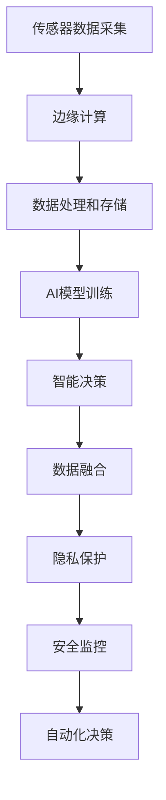

                 

# 一切皆是映射：AI在物联网(IoT)中的角色与挑战

> 关键词：物联网(IoT),人工智能(AI),边缘计算,传感器数据,智能系统,实时处理,数据融合,隐私保护,安全监控,自动化决策

## 1. 背景介绍

### 1.1 问题由来
随着物联网(IoT)技术的飞速发展，各类智能设备接入互联网，形成了海量的传感器数据。如何高效地收集、存储、处理和利用这些数据，是大数据时代亟待解决的重要问题。人工智能(AI)技术以其强大的数据处理和模式识别能力，在物联网领域得到了广泛应用，推动了智能系统的发展。然而，物联网系统的复杂性和多样性，使得AI在IoT中的应用面临诸多挑战。本文将探讨AI在IoT中的角色与挑战，为IoT的智能化升级提供理论指导和实践方案。

## 2. 核心概念与联系

### 2.1 核心概念概述

为更好地理解AI在IoT中的作用与挑战，本节将介绍几个关键概念：

- 物联网(IoT)：指通过互联网连接各类物理设备，实现人机物之间无缝通信的网络。
- 人工智能(AI)：指利用机器学习、深度学习等技术，实现智能决策和自动化处理的能力。
- 边缘计算：指在靠近数据源的地方进行数据处理和存储，减少网络延迟，提高实时性。
- 传感器数据：指各类传感器采集的物理量数据，如温度、湿度、加速度等。
- 数据融合：指将多源异构数据进行整合、分析和融合，得到更有价值的信息。
- 智能系统：指基于AI技术构建的，能够自主感知、学习、推理和决策的系统。
- 隐私保护：指在数据采集和处理过程中，保护个人和组织的隐私权益，防止数据滥用。
- 安全监控：指通过AI技术实现对物联网系统的实时监控和异常检测，保障系统安全。
- 自动化决策：指基于AI的智能系统，能够自动分析数据、预测趋势、制定决策。

这些概念之间存在紧密的联系。物联网设备采集的传感器数据，通过边缘计算和AI技术进行高效处理和分析，从而实现数据融合和智能决策。同时，AI技术还可以用于隐私保护和安全监控，提升物联网系统的安全性与可靠性。

### 2.2 核心概念原理和架构的 Mermaid 流程图(Mermaid 流程节点中不要有括号、逗号等特殊字符)



这个流程图展示了从传感器数据采集到最终决策的完整流程：

1. 传感器数据采集：物联网设备通过传感器获取物理量数据。
2. 边缘计算：数据在靠近数据源的地方进行初步处理和存储，减少网络延迟。
3. 数据处理和存储：收集的边缘数据进一步处理，存储在本地或云端。
4. AI模型训练：基于历史数据和标注信息，训练AI模型进行预测和决策。
5. 智能决策：AI模型根据当前数据进行实时推理和决策。
6. 数据融合：将多源异构数据进行整合，得到更有价值的信息。
7. 隐私保护：在数据处理过程中，保护个人和组织的隐私权益。
8. 安全监控：实时监控物联网系统的运行状态，防止异常和攻击。
9. 自动化决策：智能系统自动分析数据、制定决策，提高运营效率。

## 3. 核心算法原理 & 具体操作步骤

### 3.1 算法原理概述

AI在IoT中的核心算法原理主要涉及以下几个方面：

- 数据预处理：对传感器数据进行清洗、归一化、降维等预处理操作，提升数据质量。
- 特征提取：利用机器学习或深度学习算法，从传感器数据中提取有意义的特征。
- 模型训练：使用标注数据训练AI模型，学习数据的分布规律和预测能力。
- 模型部署：将训练好的AI模型部署到边缘设备或云端，实现实时推理和决策。
- 数据融合：对多源异构数据进行整合、分析和融合，提高决策的准确性和鲁棒性。
- 隐私保护：采用差分隐私、联邦学习等技术，保护数据隐私和安全性。
- 安全监控：通过异常检测、入侵检测等技术，实时监控物联网系统的安全状态。

这些算法原理的共同目标是通过AI技术，实现传感器数据的智能分析和决策，提升IoT系统的效率和可靠性。

### 3.2 算法步骤详解

以下是AI在IoT中的一些关键算法步骤的详细讲解：

**Step 1: 数据收集与预处理**

1. **数据收集**：使用物联网设备收集传感器数据，包括温度、湿度、压力、速度等。
2. **数据清洗**：去除缺失、异常和重复数据，确保数据的质量和一致性。
3. **数据归一化**：将数据映射到标准范围，避免不同类型数据之间的量级差异。
4. **特征提取**：使用PCA、LDA、Autoencoder等算法，从传感器数据中提取有用的特征。

**Step 2: 模型训练与部署**

1. **模型选择**：根据任务需求选择合适的AI模型，如线性回归、决策树、神经网络等。
2. **数据划分**：将数据划分为训练集、验证集和测试集，进行模型训练和评估。
3. **模型训练**：使用训练集数据对模型进行训练，学习数据的特征和规律。
4. **模型评估**：在验证集上评估模型的性能，调整模型参数和超参数。
5. **模型部署**：将训练好的模型部署到边缘设备或云端，实现实时推理和决策。

**Step 3: 数据融合与智能决策**

1. **数据融合**：使用数据融合算法，如卡尔曼滤波、粒子滤波等，对多源异构数据进行整合和分析。
2. **智能决策**：基于融合后的数据，使用决策树、规则引擎等方法，进行实时推理和决策。
3. **决策反馈**：将决策结果反馈到物联网设备，调整设备参数和行为。

**Step 4: 隐私保护与安全监控**

1. **隐私保护**：采用差分隐私、联邦学习等技术，保护个人和组织的隐私权益。
2. **安全监控**：使用异常检测、入侵检测等技术，实时监控物联网系统的安全状态。
3. **异常响应**：发现异常情况时，及时采取应对措施，保障系统的稳定运行。

### 3.3 算法优缺点

AI在IoT中的算法有以下优点：

- **高效处理数据**：通过AI技术，能够高效地处理和分析传感器数据，提取有用的特征。
- **实时决策**：AI模型可以在实时数据输入的情况下，快速进行推理和决策，提高系统的响应速度。
- **自动化运维**：AI技术可以自动化处理数据和决策，减少人工干预，降低运营成本。
- **跨领域应用**：AI技术可以应用于各类IoT应用场景，如智能家居、智能制造、智慧城市等。

同时，AI在IoT中也存在一些缺点：

- **数据依赖性强**：AI模型需要大量的标注数据进行训练，而传感器数据的标注成本较高。
- **模型复杂度高**：AI模型往往需要复杂的算法和大量的计算资源进行训练和部署。
- **隐私和安全风险**：AI技术在处理敏感数据时，可能面临隐私泄露和数据滥用的风险。
- **数据异构性高**：不同类型和来源的传感器数据异构性较高，数据融合和处理难度较大。

### 3.4 算法应用领域

AI在IoT中的应用领域非常广泛，以下列举了几个典型的应用场景：

1. **智能家居**：通过AI技术，智能家居设备能够自动感知用户行为，实现语音控制、场景模式切换等功能，提高居住舒适度和安全性。
2. **智能制造**：AI技术可以用于生产过程的实时监控和异常检测，提高生产效率和质量，降低能耗和成本。
3. **智慧城市**：AI技术可以用于城市交通管理、公共安全监控、环境保护等领域，提升城市运行效率和管理水平。
4. **智能农业**：通过AI技术，实现农作物的智能监测、病害预测和精准施肥，提高农业生产效率和产量。
5. **医疗健康**：AI技术可以用于医疗设备的实时监控和异常检测，提升医疗服务的质量和效率。

## 4. 数学模型和公式 & 详细讲解

### 4.1 数学模型构建

在本节中，我们将构建一个简单的传感器数据处理和AI模型训练的数学模型。

假设传感器采集的数据为 $x \in \mathbb{R}^n$，其真实值 $y \in \mathbb{R}$ 由以下模型生成：

$$
y = f(x) + \epsilon
$$

其中 $f(\cdot)$ 为非线性函数，$\epsilon$ 为高斯噪声。我们的目标是通过训练一个线性回归模型 $g(x;w) = wx + b$，使模型预测值 $g(x;w)$ 逼近真实值 $y$。

### 4.2 公式推导过程

根据最小二乘法的思想，我们的目标是找到一组模型参数 $w$ 和 $b$，使得模型预测值与真实值之间的误差最小化：

$$
\min_{w, b} \sum_{i=1}^m (y_i - g(x_i; w, b))^2
$$

为了简化计算，我们引入正则化项 $\lambda \|w\|^2$，避免过拟合：

$$
\min_{w, b} \frac{1}{2m} \sum_{i=1}^m (y_i - g(x_i; w, b))^2 + \frac{\lambda}{2} \|w\|^2
$$

将上式转化为矩阵形式：

$$
\min_{w, b} \frac{1}{2} \|Y - Xw - b\|_F^2 + \frac{\lambda}{2} \|w\|^2
$$

其中 $Y$ 为真实值向量，$X$ 为数据矩阵，$\|A\|_F$ 表示矩阵 $A$ 的 Frobenius 范数。

通过求解上述优化问题，我们可以得到模型参数 $w$ 和 $b$ 的解：

$$
w = (X^TX + \lambda I)^{-1}X^TY
$$

$$
b = \bar{y} - Xw
$$

其中 $\bar{y} = \frac{1}{m} \sum_{i=1}^m y_i$ 为真实值的均值。

### 4.3 案例分析与讲解

假设我们有一个智能家居环境监测系统，使用传感器采集室内温度、湿度和CO2浓度数据，并希望通过AI模型预测室内空气质量。

**Step 1: 数据收集与预处理**

1. **数据采集**：使用温度、湿度和CO2传感器收集数据。
2. **数据清洗**：去除缺失、异常和重复数据，确保数据的质量和一致性。
3. **数据归一化**：将温度、湿度和CO2浓度数据归一化到标准范围 [-1, 1]。

**Step 2: 模型训练与部署**

1. **模型选择**：选择线性回归模型进行训练和预测。
2. **数据划分**：将数据划分为训练集、验证集和测试集。
3. **模型训练**：使用训练集数据对模型进行训练，学习数据的特征和规律。
4. **模型评估**：在验证集上评估模型的性能，调整模型参数和超参数。
5. **模型部署**：将训练好的模型部署到边缘设备，实现实时预测。

**Step 3: 数据融合与智能决策**

1. **数据融合**：将温度、湿度和CO2浓度数据进行融合，得到更全面的环境监测结果。
2. **智能决策**：基于融合后的数据，进行室内空气质量的实时预测和决策。

## 5. 项目实践：代码实例和详细解释说明

### 5.1 开发环境搭建

在进行AI在IoT项目实践前，我们需要准备好开发环境。以下是使用Python进行TensorFlow开发的安装流程：

1. 安装Anaconda：从官网下载并安装Anaconda，用于创建独立的Python环境。

2. 创建并激活虚拟环境：
```bash
conda create -n tf-env python=3.8 
conda activate tf-env
```

3. 安装TensorFlow：根据CUDA版本，从官网获取对应的安装命令。例如：
```bash
conda install tensorflow -c tf
```

4. 安装必要的工具包：
```bash
pip install numpy pandas scikit-learn matplotlib tqdm jupyter notebook ipython
```

完成上述步骤后，即可在`tf-env`环境中开始项目实践。

### 5.2 源代码详细实现

这里我们以智能家居环境监测系统的线性回归模型为例，给出TensorFlow代码实现。

首先，导入必要的库和数据：

```python
import tensorflow as tf
import numpy as np
from sklearn.model_selection import train_test_split
from sklearn.preprocessing import MinMaxScaler
from sklearn.metrics import mean_squared_error

# 加载数据
X_train, X_test, y_train, y_test = train_test_split(X, y, test_size=0.2, random_state=42)

# 数据归一化
scaler = MinMaxScaler(feature_range=(-1, 1))
X_train = scaler.fit_transform(X_train)
X_test = scaler.transform(X_test)
```

然后，定义模型和优化器：

```python
# 定义模型
X = tf.keras.Input(shape=(3,))
w = tf.Variable(tf.random.normal([3, 1]))
b = tf.Variable(tf.zeros([1]))
y_pred = tf.keras.layers.Dense(1)(X)

# 定义损失函数和优化器
loss = tf.keras.losses.MeanSquaredError()
optimizer = tf.keras.optimizers.Adam(learning_rate=0.001)
```

接着，定义训练和评估函数：

```python
# 定义训练函数
def train_model(model, x_train, y_train, x_test, y_test, epochs, batch_size):
    model.compile(optimizer=optimizer, loss=loss)
    model.fit(x_train, y_train, epochs=epochs, batch_size=batch_size, validation_data=(x_test, y_test))

# 定义评估函数
def evaluate_model(model, x_test, y_test):
    mse = model.evaluate(x_test, y_test, verbose=0)
    rmse = np.sqrt(mse)
    return rmse
```

最后，启动训练流程并在测试集上评估：

```python
# 训练模型
train_model(model, X_train, y_train, X_test, y_test, epochs=10, batch_size=32)

# 评估模型
rmse = evaluate_model(model, X_test, y_test)
print(f"RMSE: {rmse:.4f}")
```

以上就是使用TensorFlow对智能家居环境监测系统进行线性回归模型训练的完整代码实现。可以看到，TensorFlow提供了强大的计算图和自动微分功能，使得模型训练和评估变得非常方便。

### 5.3 代码解读与分析

让我们再详细解读一下关键代码的实现细节：

**X_train, X_test, y_train, y_test = train_test_split(X, y, test_size=0.2, random_state=42)**：
- 使用train_test_split将数据集划分为训练集和测试集，测试集占总数据的20%。

**scaler = MinMaxScaler(feature_range=(-1, 1))**：
- 使用MinMaxScaler将数据归一化到[-1, 1]之间，避免不同特征的量级差异。

**y_pred = tf.keras.layers.Dense(1)(X)**：
- 定义一个全连接层，输出单个预测值。

**model.compile(optimizer=optimizer, loss=loss)**：
- 使用Adam优化器和均方误差损失函数编译模型。

**model.fit(x_train, y_train, epochs=epochs, batch_size=batch_size, validation_data=(x_test, y_test))**：
- 使用训练集数据拟合模型，在每个epoch中用验证集数据进行评估，调整模型参数和超参数。

**model.evaluate(x_test, y_test, verbose=0)**：
- 在测试集上评估模型的性能，计算均方误差。

可以看到，TensorFlow使得模型训练和评估变得非常简单，开发者只需专注于模型设计和算法选择。

## 6. 实际应用场景

### 6.1 智能家居环境监测系统

智能家居环境监测系统能够实时监测室内温度、湿度和CO2浓度，预测室内空气质量，并自动调节空气净化器、加湿器等设备，确保室内空气质量。例如，当室内CO2浓度过高时，自动打开窗户或启动空气净化器，保护用户健康。

### 6.2 智能制造生产过程监控

在智能制造中，通过传感器采集生产过程中的温度、压力、振动等数据，使用AI模型进行实时监控和异常检测。例如，当发现某台设备温度异常时，立即停机并进行维护，避免生产停滞和设备损坏。

### 6.3 智慧城市交通管理

智慧城市交通管理系统能够实时监测交通流量、车速、车辆类型等数据，使用AI模型进行交通流量预测和异常检测。例如，当发现某个路段交通流量异常时，立即调整信号灯，缓解交通拥堵，提高通行效率。

### 6.4 未来应用展望

随着AI技术的发展，IoT系统将在更多领域得到应用，为社会带来巨大的变革。

1. **智能城市**：通过AI技术，实现对城市交通、公共安全、环境保护等领域的全面监控和管理，提升城市运行效率和安全性。
2. **智能农业**：利用AI技术，实现对农作物生长状态、病害预测、精准施肥等信息的实时监测和分析，提高农业生产效率和产量。
3. **智能医疗**：通过AI技术，实现对医疗设备的实时监控和异常检测，提升医疗服务的质量和效率。
4. **智能工业**：利用AI技术，实现对工业设备状态的实时监测和预测，提高生产效率和设备寿命。

## 7. 工具和资源推荐

### 7.1 学习资源推荐

为了帮助开发者系统掌握AI在IoT中的应用，这里推荐一些优质的学习资源：

1. TensorFlow官方文档：提供全面的TensorFlow介绍和使用指南，涵盖各种模型训练和部署方法。
2. PyTorch官方文档：提供PyTorch的介绍和使用指南，涵盖深度学习模型的训练和推理。
3. Coursera《深度学习专项课程》：由斯坦福大学提供的深度学习课程，包含AI基础和前沿技术的讲解。
4. Udacity《深度学习基础》：由谷歌提供的深度学习课程，包含AI基础和动手实践项目。
5. arXiv上的最新论文：实时跟踪AI领域的最新研究进展，获取前沿技术和应用思路。

通过对这些资源的学习实践，相信你一定能够快速掌握AI在IoT中的应用，并用于解决实际的IoT问题。

### 7.2 开发工具推荐

高效的开发离不开优秀的工具支持。以下是几款用于AI在IoT开发的常用工具：

1. TensorFlow：基于Python的开源深度学习框架，支持大规模分布式计算。
2. PyTorch：基于Python的开源深度学习框架，灵活易用，支持动态计算图。
3. Keras：基于TensorFlow和Theano的高级API，支持快速搭建深度学习模型。
4. Jupyter Notebook：交互式编程环境，方便进行数据探索和模型调试。
5. TensorBoard：TensorFlow配套的可视化工具，实时监测模型训练状态，生成图表。

合理利用这些工具，可以显著提升AI在IoT开发的效率，加速创新迭代的步伐。

### 7.3 相关论文推荐

AI在IoT中的应用源于学界的持续研究。以下是几篇奠基性的相关论文，推荐阅读：

1. "A Survey on Deep Learning Applications for Smart Cities"：综述了AI在智能城市中的应用，涵盖了交通管理、公共安全等领域。
2. "AI-based Predictive Maintenance in Smart Manufacturing"：介绍了AI在智能制造中的应用，包括预测性维护和质量控制。
3. "Intelligent Monitoring and Prediction of Environmental Parameters in Smart Agriculture"：介绍了AI在智能农业中的应用，包括环境监测和作物预测。
4. "AI-driven Energy Management in Smart Buildings"：介绍了AI在智能建筑中的应用，包括能耗预测和设备管理。
5. "Real-time Anomaly Detection in IoT Systems Using AI"：介绍了AI在物联网系统中的应用，包括异常检测和入侵防御。

这些论文代表了大规模IoT系统中的AI应用方向，为实际开发提供了理论基础和实践指导。

## 8. 总结：未来发展趋势与挑战

### 8.1 总结

本文对AI在IoT中的角色与挑战进行了全面系统的介绍。首先阐述了AI在IoT中的重要应用场景，明确了IoT系统通过AI技术实现高效、可靠、智能化的目标。其次，从原理到实践，详细讲解了AI在IoT中的算法流程和具体步骤，给出了AI在智能家居、智能制造、智慧城市等领域的代码实现和应用示例。同时，本文还广泛探讨了AI在IoT中面临的数据依赖、隐私保护、安全监控等挑战，给出了应对策略和未来突破方向。

通过本文的系统梳理，可以看到，AI技术在IoT中的应用前景广阔，但在实际部署时仍需考虑数据来源、隐私保护、安全监控等多个因素。未来，伴随AI技术的不断进步和IoT设备的普及，AI在IoT中的应用将更加广泛和深入，推动社会进入更加智能化、自动化、协同化的新阶段。

### 8.2 未来发展趋势

展望未来，AI在IoT中将呈现以下几个发展趋势：

1. **数据驱动**：未来的IoT系统将更加依赖数据驱动，通过AI技术高效处理和分析大量传感器数据，提升决策的准确性和鲁棒性。
2. **边缘计算**：随着边缘计算的发展，IoT系统将实现更加实时、高效的本地计算，减少网络延迟，提高系统响应速度。
3. **跨领域融合**：AI技术将与物联网、大数据、云计算等技术深度融合，构建更加智能化的IoT生态系统。
4. **隐私保护**：AI技术将更加注重隐私保护，采用差分隐私、联邦学习等技术，保障用户数据的隐私权益。
5. **安全性提升**：通过异常检测、入侵防御等技术，IoT系统将更加安全可靠，防止数据泄露和恶意攻击。
6. **自动化决策**：AI技术将实现更加全面、准确的决策支持，提升IoT系统的运营效率和决策智能化水平。

### 8.3 面临的挑战

尽管AI在IoT中的应用前景广阔，但在迈向智能化、自动化、协同化应用的过程中，仍面临诸多挑战：

1. **数据质量和量级**：IoT设备采集的数据质量参差不齐，数据量级巨大，如何高效处理和分析这些数据，是实现智能化决策的关键。
2. **隐私保护**：传感器数据通常包含敏感信息，如何保障数据的隐私和安全，防止数据滥用和泄露，是AI在IoT中面临的重要挑战。
3. **边缘计算资源**：边缘设备计算资源有限，如何优化算法和模型，在有限的计算资源下实现高效的推理和决策，是实现实时性的关键。
4. **系统复杂度**：IoT系统通常具有高复杂度，如何设计和部署高效、可靠的AI系统，是实现智能化决策的基础。
5. **异构性处理**：IoT设备采集的数据异构性较高，如何整合和融合多源异构数据，得到更有价值的信息，是提升决策准确性的关键。

### 8.4 研究展望

面对AI在IoT中面临的挑战，未来的研究需要在以下几个方面寻求新的突破：

1. **数据高效处理**：研究高效的数据处理和预处理算法，提升数据质量和可用性，降低计算资源消耗。
2. **隐私保护技术**：研究差分隐私、联邦学习等隐私保护技术，保障数据隐私和安全，防止数据滥用和泄露。
3. **边缘计算优化**：研究高效的边缘计算算法和模型，优化计算资源使用，实现实时推理和决策。
4. **异构性融合**：研究多源异构数据融合算法，提升数据整合和分析能力，增强决策准确性和鲁棒性。
5. **自动化决策系统**：研究自动化决策支持系统，实现全面、准确的决策分析和优化，提升IoT系统的运营效率和智能化水平。

这些研究方向将推动AI在IoT中的不断进步，为构建智能、高效、可靠、安全的IoT生态系统铺平道路。

## 9. 附录：常见问题与解答

**Q1：AI在IoT中的主要应用场景有哪些？**

A: AI在IoT中的主要应用场景包括：
1. 智能家居环境监测：实时监测室内环境参数，预测空气质量，自动调节设备。
2. 智能制造生产过程监控：实时监测生产过程参数，进行异常检测和预测性维护。
3. 智慧城市交通管理：实时监测交通流量、车速等参数，进行交通流量预测和异常检测。
4. 智能农业环境监测：实时监测作物生长状态、病害预测等参数，进行精准施肥和灌溉。
5. 智能医疗设备监控：实时监测医疗设备状态，进行异常检测和故障预测。

**Q2：如何选择合适的AI模型？**

A: 选择合适的AI模型需要考虑以下几个因素：
1. 任务类型：根据具体任务类型，选择合适的模型，如分类、回归、聚类等。
2. 数据量级：根据数据量级，选择合适的模型，如小规模数据适合线性回归，大规模数据适合深度神经网络。
3. 计算资源：根据计算资源，选择合适的模型，如计算资源有限适合轻量级模型，计算资源充足适合复杂模型。
4. 数据分布：根据数据分布，选择合适的模型，如数据分布不均衡适合采样平衡等方法。
5. 模型效果：根据模型效果，选择最优模型，进行模型评估和调优。

**Q3：AI在IoT中如何保护隐私？**

A: 保护隐私是AI在IoT中的重要挑战，以下是几种保护隐私的方法：
1. 差分隐私：在数据处理过程中，加入噪声，防止数据泄露。
2. 联邦学习：在分布式环境下，各节点只上传模型参数，保护数据隐私。
3. 数据加密：在数据传输和存储过程中，采用加密技术，防止数据泄露。
4. 隐私计算：采用多方安全计算等技术，在保护隐私的前提下进行数据计算和分析。
5. 隐私保护算法：使用隐私保护算法，如隐私保留的PCA等，保护数据隐私。

**Q4：AI在IoT中如何实现实时推理和决策？**

A: 实现实时推理和决策需要考虑以下几个因素：
1. 数据采集：实时采集传感器数据，确保数据的时效性和实时性。
2. 数据预处理：对数据进行清洗、归一化等预处理操作，提高数据质量。
3. 模型训练：使用训练集数据对模型进行训练，学习数据的特征和规律。
4. 模型部署：将训练好的模型部署到边缘设备或云端，实现实时推理和决策。
5. 数据融合：对多源异构数据进行整合和分析，得到更全面的决策信息。

**Q5：AI在IoT中如何实现自动化决策？**

A: 实现自动化决策需要考虑以下几个因素：
1. 模型选择：根据任务需求，选择合适的AI模型，如决策树、神经网络等。
2. 数据采集：实时采集传感器数据，确保数据的时效性和实时性。
3. 模型训练：使用训练集数据对模型进行训练，学习数据的特征和规律。
4. 模型部署：将训练好的模型部署到边缘设备或云端，实现实时推理和决策。
5. 决策反馈：将决策结果反馈到设备，调整设备参数和行为，实现自动化决策。

---

作者：禅与计算机程序设计艺术 / Zen and the Art of Computer Programming

