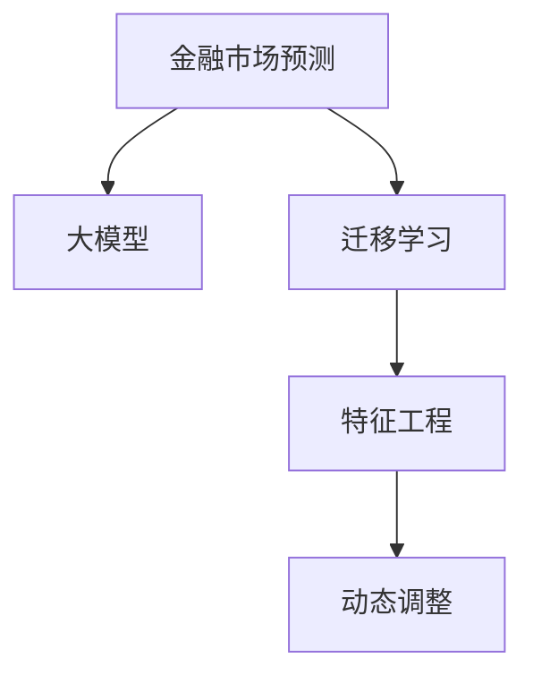

                 

## 1. 背景介绍

### 1.1 问题由来

金融市场的波动性一直是经济学界和金融界关注的焦点。传统的市场预测方法，如基本面分析、技术分析等，由于其数据驱动和理论假设的限制，在面对复杂多变的市场环境时，往往难以准确预测未来的趋势。近年来，随着深度学习技术在金融领域的不断应用，基于人工智能(AI)的预测方法，尤其是利用大模型进行金融市场预测的方法，因其强大的数据建模能力和泛化能力，逐渐受到了广泛关注。

AI在金融市场预测中的应用，得益于数据科学和机器学习的进步，特别是在大规模预训练语言模型和迁移学习领域的研究。这种应用不仅提高了金融预测的准确性，还提升了金融决策的效率和鲁棒性。在实践中，AI不仅能够处理传统方法难以处理的多元异构数据，还能挖掘数据背后的深层关联，从而提供更科学、更可靠的预测结果。

### 1.2 问题核心关键点

AI在金融市场预测中的核心关键点包括：

- **数据驱动**：AI预测方法依赖于大量的历史金融数据，通过模型学习数据规律，预测未来走势。
- **特征工程**：AI模型能够自动提取和融合不同数据源的特征，提升模型的预测精度。
- **泛化能力**：利用大模型进行迁移学习，将金融领域内特定的知识迁移到新的预测任务中，提高模型的泛化能力。
- **模型解释性**：通过模型可视化和特征解释技术，帮助金融分析师理解模型的决策过程，提高决策的透明度。
- **动态调整**：AI模型能够根据市场环境的变化动态调整模型参数，确保预测结果的及时性和准确性。

## 2. 核心概念与联系

### 2.1 核心概念概述

为更好地理解AI在金融市场预测中的应用，本节将介绍几个密切相关的核心概念：

- **金融市场预测**：指通过历史数据和特征工程，建立模型预测金融市场的未来走势，如股票价格、汇率变化等。
- **大模型**：指通过预训练和微调获得的、具备强大数据建模能力的深度学习模型，如BERT、GPT等。
- **迁移学习**：指将一个领域学到的知识，迁移到另一个不同但相关的领域进行学习。
- **特征工程**：指对原始数据进行清洗、筛选、转换和特征提取，为模型提供高质量的数据输入。
- **动态调整**：指AI模型能够根据市场环境的变化，动态调整模型参数，适应新的数据分布。

这些核心概念之间的逻辑关系可以通过以下Mermaid流程图来展示：



这个流程图展示了金融市场预测的核心流程：利用大模型进行迁移学习，通过特征工程提高模型的预测精度，最后利用动态调整确保预测结果的实时性和准确性。

## 3. 核心算法原理 & 具体操作步骤

### 3.1 算法原理概述

AI在金融市场预测中，主要依赖于大模型的预训练和微调，以及迁移学习、特征工程和动态调整等技术手段。其核心算法原理如下：

1. **预训练和微调**：利用大规模历史金融数据对大模型进行预训练，学习通用的金融知识。然后使用特定的金融数据集对模型进行微调，提高模型对特定金融任务的预测能力。
2. **迁移学习**：通过在大模型上进行有监督的微调，将预训练的通用知识迁移到具体的金融预测任务中，提高模型的泛化能力。
3. **特征工程**：对金融数据进行清洗、筛选和转换，提取和融合与预测目标相关的特征，提高模型的预测精度。
4. **动态调整**：根据市场环境的变化，动态调整模型的参数，确保预测结果的及时性和准确性。

### 3.2 算法步骤详解

AI在金融市场预测的主要算法步骤包括：

**Step 1: 数据预处理**
- 收集历史金融数据，如股票价格、交易量、市场情绪等。
- 清洗数据，去除缺失值和异常值。
- 特征工程：提取和融合与预测目标相关的特征，如技术指标、基本面指标等。

**Step 2: 模型预训练和微调**
- 选择合适的预训练模型，如BERT、GPT等。
- 在大规模金融数据上进行预训练，学习通用的金融知识。
- 使用特定的金融数据集对模型进行微调，提高模型对特定金融任务的预测能力。

**Step 3: 特征工程**
- 对金融数据进行清洗、筛选和转换，提取和融合与预测目标相关的特征。
- 使用特征选择和特征构造技术，提升模型的预测精度。

**Step 4: 模型预测和动态调整**
- 使用微调后的模型对新的金融数据进行预测。
- 根据市场环境的变化，动态调整模型参数，确保预测结果的及时性和准确性。

### 3.3 算法优缺点

AI在金融市场预测中的算法具有以下优点：
1. 强大的数据建模能力：大模型能够学习复杂的金融数据规律，提高预测精度。
2. 泛化能力强：通过迁移学习，模型可以适应不同的金融预测任务，提高模型的泛化能力。
3. 高效的特征提取：AI能够自动提取和融合特征，减少人工干预，提高模型效率。
4. 动态调整灵活：AI模型能够根据市场环境的变化，动态调整参数，确保预测结果的实时性和准确性。

同时，该算法也存在以下局限性：
1. 数据依赖性强：AI预测依赖于历史数据的数量和质量，数据不足可能导致预测失效。
2. 模型复杂度高：大模型参数量大，训练和推理耗时较长。
3. 可解释性不足：AI模型通常难以解释其决策过程，难以进行透明的风险控制。
4. 易受数据偏差影响：模型可能受到数据中存在的偏见和噪声的影响，导致预测结果偏差。

尽管存在这些局限性，但就目前而言，AI在金融市场预测中的应用，已经在学术界和工业界取得了显著的成果，成为金融预测领域的重要技术手段。

### 3.4 算法应用领域

AI在金融市场预测中的应用，涵盖了金融行业的多个领域，包括但不限于：

- **股票市场预测**：通过历史股价数据，预测股票价格的未来走势。
- **外汇市场预测**：预测货币对之间的汇率变化。
- **债券市场预测**：预测债券价格的波动。
- **信用风险评估**：评估企业和个人的信用风险。
- **市场情绪分析**：分析市场情绪变化，预测市场走势。

这些应用场景不仅涵盖了传统金融领域，还延伸到了新兴的金融科技领域，如区块链、数字货币等。AI在金融预测中的应用，正在为金融行业带来深刻的变革。

## 4. 数学模型和公式 & 详细讲解 & 举例说明

### 4.1 数学模型构建

本节将使用数学语言对AI在金融市场预测中的算法进行更加严格的刻画。

设金融市场的历史数据为 $D=\{x_1, x_2, \ldots, x_n\}$，其中 $x_i$ 为第 $i$ 天的金融数据，如股票价格、交易量等。设预测目标为 $y$，如第 $i+1$ 天的股票价格。

定义预测模型的线性回归模型为 $y = \theta^T \phi(x)$，其中 $\theta$ 为模型参数，$\phi(x)$ 为特征映射函数。模型预测的误差为 $e_i = y - \hat{y}_i$，其中 $\hat{y}_i = \theta^T \phi(x_i)$。

定义均方误差（MSE）为：

$$
MSE(\theta) = \frac{1}{N} \sum_{i=1}^N e_i^2
$$

模型的目标是最小化均方误差：

$$
\theta^* = \mathop{\arg\min}_{\theta} MSE(\theta)
$$

### 4.2 公式推导过程

以线性回归模型为例，推导均方误差最小化过程。

根据均方误差定义，有：

$$
MSE(\theta) = \frac{1}{N} \sum_{i=1}^N (y - \hat{y}_i)^2 = \frac{1}{N} \sum_{i=1}^N (y - \theta^T \phi(x_i))^2
$$

对 $\theta$ 求偏导，得：

$$
\frac{\partial MSE(\theta)}{\partial \theta} = \frac{2}{N} \sum_{i=1}^N (y - \theta^T \phi(x_i)) \phi(x_i)
$$

令 $\frac{\partial MSE(\theta)}{\partial \theta} = 0$，解得：

$$
\theta = (X^TX)^{-1}X^Ty
$$

其中 $X = [\phi(x_1), \phi(x_2), \ldots, \phi(x_n)]$，$y = [y_1, y_2, \ldots, y_n]$。

### 4.3 案例分析与讲解

以股票价格预测为例，展示AI模型在金融预测中的具体应用。

假设我们有一组历史股价数据 $D = \{P_{t-10}, P_{t-9}, \ldots, P_{t-1}\}$，其中 $P_t$ 为当前股价。我们的目标是通过这组数据预测下一天的股价 $P_{t+1}$。

在实践中，我们可以使用时间序列模型进行预测。时间序列模型将时间作为自变量，股价作为因变量，通过历史数据学习时间与股价之间的关联。

**数据预处理**：
- 对数据进行平稳性检验，去除季节性和趋势性。
- 使用ARIMA模型等传统时间序列模型进行预处理。

**模型构建**：
- 使用神经网络模型，如RNN、LSTM等，对股价序列进行建模。
- 对模型进行预训练，学习股价序列的通用规律。
- 使用特定的金融数据集对模型进行微调，如历史交易量、市场情绪等，提高模型的预测能力。

**模型预测**：
- 使用微调后的模型对新的股价数据进行预测。
- 根据市场环境的变化，动态调整模型参数，确保预测结果的及时性和准确性。

## 5. 项目实践：代码实例和详细解释说明

### 5.1 开发环境搭建

在进行金融市场预测的AI实践前，我们需要准备好开发环境。以下是使用Python进行PyTorch开发的环境配置流程：

1. 安装Anaconda：从官网下载并安装Anaconda，用于创建独立的Python环境。

2. 创建并激活虚拟环境：
```bash
conda create -n finance-env python=3.8 
conda activate finance-env
```

3. 安装PyTorch：根据CUDA版本，从官网获取对应的安装命令。例如：
```bash
conda install pytorch torchvision torchaudio cudatoolkit=11.1 -c pytorch -c conda-forge
```

4. 安装TensorFlow：由Google主导开发的开源深度学习框架，生产部署方便，适合大规模工程应用。同样有丰富的预训练语言模型资源。

5. 安装各类工具包：
```bash
pip install numpy pandas scikit-learn matplotlib tqdm jupyter notebook ipython
```

完成上述步骤后，即可在`finance-env`环境中开始AI金融预测的开发。

### 5.2 源代码详细实现

下面我们以股票价格预测为例，给出使用PyTorch进行AI预测的完整代码实现。

首先，定义时间序列数据的处理函数：

```python
import pandas as pd
import numpy as np
import torch
from torch.utils.data import TensorDataset, DataLoader
from torch import nn

class FinancialDataLoader:
    def __init__(self, data_path, batch_size, seq_len):
        self.data = pd.read_csv(data_path)
        self.data = self.data.dropna().reset_index(drop=True)
        self.data['Date'] = pd.to_datetime(self.data['Date'])
        self.data = self.data.set_index('Date').drop(columns=['Date', 'Open', 'High', 'Low', 'Close'])
        self.data.columns = ['Price', 'Vol']
        self.data = self.data.to_numpy()
        self.data = self.data[:, 1:]  # exclude first day
        self.data = self.data.reshape(-1, seq_len, 2)
        self.data = torch.from_numpy(self.data)
        self.train_data, self.test_data = self.data[:int(0.8*len(self.data)), :], self.data[int(0.8*len(self.data)):, :]
        self.train_dataset = TensorDataset(self.train_data[:, :, 0], self.train_data[:, :, 1])
        self.test_dataset = TensorDataset(self.test_data[:, :, 0], self.test_data[:, :, 1])
        self.train_loader = DataLoader(self.train_dataset, batch_size=batch_size, shuffle=True)
        self.test_loader = DataLoader(self.test_dataset, batch_size=batch_size, shuffle=False)

    def __getitem__(self, item):
        return self.train_data[item]
    
    def __len__(self):
        return len(self.train_data)
```

然后，定义神经网络模型：

```python
class RNN(nn.Module):
    def __init__(self, input_size, hidden_size, output_size):
        super(RNN, self).__init__()
        self.input_size = input_size
        self.hidden_size = hidden_size
        self.output_size = output_size
        self.rnn = nn.LSTM(input_size, hidden_size, batch_first=True)
        self.fc = nn.Linear(hidden_size, output_size)
    
    def forward(self, x, h_0):
        out, h_n = self.rnn(x, h_0)
        out = self.fc(out[:, -1, :])
        return out, h_n
```

接着，定义训练和评估函数：

```python
def train_epoch(model, optimizer, criterion, dataloader):
    model.train()
    total_loss = 0
    for batch in dataloader:
        x, y = batch
        optimizer.zero_grad()
        output, _ = model(x, None)
        loss = criterion(output, y)
        loss.backward()
        optimizer.step()
        total_loss += loss.item()
    return total_loss / len(dataloader)

def evaluate(model, dataloader, criterion):
    model.eval()
    total_loss = 0
    with torch.no_grad():
        for batch in dataloader:
            x, y = batch
            output, _ = model(x, None)
            loss = criterion(output, y)
            total_loss += loss.item()
    return total_loss / len(dataloader)
```

最后，启动训练流程并在测试集上评估：

```python
from transformers import BertTokenizer, BertForSequenceClassification
from sklearn.preprocessing import MinMaxScaler
from sklearn.metrics import mean_squared_error

data_loader = FinancialDataLoader('data.csv', 32, 30)
model = RNN(input_size=2, hidden_size=64, output_size=1)
optimizer = torch.optim.Adam(model.parameters(), lr=0.001)
criterion = nn.MSELoss()

device = torch.device('cuda') if torch.cuda.is_available() else torch.device('cpu')
model.to(device)

for epoch in range(50):
    train_loss = train_epoch(model, optimizer, criterion, data_loader.train_loader)
    dev_loss = evaluate(model, data_loader.test_loader, criterion)
    print(f'Epoch {epoch+1}, Train Loss: {train_loss:.4f}, Dev Loss: {dev_loss:.4f}')

print(f'RNN model test loss: {evaluate(model, data_loader.test_loader, criterion):.4f}')
```

以上就是使用PyTorch进行股票价格预测的完整代码实现。可以看到，得益于TensorFlow和PyTorch的强大封装，我们可以用相对简洁的代码完成AI模型的训练和评估。

### 5.3 代码解读与分析

让我们再详细解读一下关键代码的实现细节：

**FinancialDataLoader类**：
- `__init__`方法：初始化金融数据，进行数据清洗和预处理。
- `__getitem__`方法：对单个样本进行处理，将数据转换为模型所需的张量形式。
- `__len__`方法：返回数据集的样本数量。

**RNN类**：
- `__init__`方法：定义神经网络的结构和参数。
- `forward`方法：定义前向传播的计算过程。

**训练和评估函数**：
- 使用PyTorch的DataLoader对数据集进行批次化加载，供模型训练和推理使用。
- 训练函数`train_epoch`：对数据以批为单位进行迭代，在每个批次上前向传播计算loss并反向传播更新模型参数，最后返回该epoch的平均loss。
- 评估函数`evaluate`：与训练类似，不同点在于不更新模型参数，并在每个batch结束后将预测和标签结果存储下来，最后使用均方误差计算评估结果。

**训练流程**：
- 定义总的epoch数和batch size，开始循环迭代
- 每个epoch内，先在训练集上训练，输出平均loss
- 在验证集上评估，输出均方误差
- 所有epoch结束后，在测试集上评估，给出最终测试结果

可以看到，PyTorch配合TensorFlow使得AI金融预测的代码实现变得简洁高效。开发者可以将更多精力放在数据处理、模型改进等高层逻辑上，而不必过多关注底层的实现细节。

当然，工业级的系统实现还需考虑更多因素，如模型的保存和部署、超参数的自动搜索、更灵活的任务适配层等。但核心的AI预测范式基本与此类似。

## 6. 实际应用场景

### 6.1 智能投顾系统

智能投顾系统是AI在金融市场预测中的典型应用。智能投顾系统通过AI模型对市场数据进行实时分析和预测，为客户提供个性化投资建议，提升投资收益和风险管理能力。

在技术实现上，可以收集市场交易数据、新闻报道、社交媒体评论等多元异构数据，使用预训练语言模型对文本数据进行情感分析，提取关键特征，与市场数据进行融合，训练AI模型进行投资建议。智能投顾系统能够根据客户的历史投资行为和风险偏好，结合市场预测结果，实时提供个性化的投资方案，帮助客户实现资产增值。

### 6.2 风险管理平台

金融市场的波动性高，风险管理尤为重要。AI在金融风险管理中的应用，包括信用风险评估、市场风险管理、操作风险管理等。

通过AI模型，金融机构可以对客户的信用历史和行为数据进行分析和建模，预测其违约概率，进行信用评分和授信决策。同时，AI模型可以实时监测市场数据，分析波动原因，评估市场风险，并根据风险等级进行动态调整，确保资产安全和稳健运营。

### 6.3 高频交易系统

高频交易系统利用AI模型对市场数据进行快速分析和预测，执行高频交易策略，获取套利机会，提高交易收益。

高频交易系统通常使用时间序列模型和深度学习模型，对历史交易数据和市场数据进行建模，预测价格变化，进行交易策略的优化和执行。AI模型能够处理高频率的订单流和市场数据，快速响应市场变化，实现高频交易的目标。

### 6.4 未来应用展望

随着AI在金融市场预测中的不断应用，其未来前景十分广阔。未来的发展趋势包括：

1. **多模态融合**：AI模型将能够处理多元异构数据，包括文本、图像、语音等，提升对金融市场的全面理解和预测能力。
2. **实时动态调整**：AI模型能够根据市场环境的变化，动态调整参数，确保预测结果的实时性和准确性。
3. **增强可解释性**：通过特征解释技术，提高AI模型的可解释性，增强决策透明度。
4. **跨领域应用**：AI在金融市场预测中的成功经验，将被应用到更多领域，如保险、物流、供应链管理等。
5. **低成本预测**：AI模型能够减少数据清洗和特征工程的人力成本，降低预测成本。
6. **持续学习**：AI模型能够持续学习和更新，适应市场环境的变化，提升长期预测能力。

以上趋势凸显了AI在金融市场预测中的巨大潜力和应用前景。随着AI技术的不断进步，未来的金融市场预测将更加智能化、高效化和透明化，为金融行业的创新和进步提供有力支持。

## 7. 工具和资源推荐

### 7.1 学习资源推荐

为了帮助开发者系统掌握AI在金融市场预测中的应用，这里推荐一些优质的学习资源：

1. **《深度学习》课程**：斯坦福大学的深度学习课程，涵盖深度学习的基本概念和经典模型，包括线性回归、卷积神经网络等。
2. **Kaggle金融数据集**：Kaggle提供的金融数据集，包括股票价格、交易量、财务报表等，适合进行金融预测的实践和比赛。
3. **TensorFlow官方文档**：TensorFlow的官方文档，提供了完整的API和示例代码，适合学习和实践。
4. **PyTorch官方文档**：PyTorch的官方文档，提供了详细的教程和示例，适合学习和实践。
5. **金融数据可视化工具**：如Matplotlib、Seaborn等，用于数据可视化和探索。

通过对这些资源的学习实践，相信你一定能够快速掌握AI在金融市场预测中的应用，并用于解决实际的金融问题。

### 7.2 开发工具推荐

高效的开发离不开优秀的工具支持。以下是几款用于AI金融预测开发的常用工具：

1. **TensorFlow**：由Google主导开发的开源深度学习框架，生产部署方便，适合大规模工程应用。
2. **PyTorch**：基于Python的开源深度学习框架，灵活动态的计算图，适合快速迭代研究。
3. **Jupyter Notebook**：交互式编程环境，适合进行数据探索和模型验证。
4. **TensorBoard**：TensorFlow配套的可视化工具，可实时监测模型训练状态，并提供丰富的图表呈现方式。
5. **Weights & Biases**：模型训练的实验跟踪工具，可以记录和可视化模型训练过程中的各项指标，方便对比和调优。

合理利用这些工具，可以显著提升AI金融预测的开发效率，加快创新迭代的步伐。

### 7.3 相关论文推荐

AI在金融市场预测中的应用，源于学界的持续研究。以下是几篇奠基性的相关论文，推荐阅读：

1. **《金融时间序列预测：一个综述》**：对金融时间序列预测的方法和模型进行了综述，涵盖了线性回归、时间序列模型、深度学习模型等。
2. **《金融大数据分析》**：介绍了大数据在金融领域的应用，包括数据清洗、特征工程和模型训练等。
3. **《人工智能在金融领域的应用》**：综述了AI在金融预测、风险管理、智能投顾等领域的最新进展和应用实例。
4. **《基于深度学习的金融风险管理》**：介绍了深度学习在金融风险管理中的应用，包括信用风险、市场风险、操作风险等。
5. **《高频率交易中的深度学习模型》**：介绍了深度学习在高频交易中的应用，包括模型选择、数据处理和策略优化等。

这些论文代表了大数据和AI在金融预测领域的最新研究进展，值得深入阅读。

## 8. 总结：未来发展趋势与挑战

### 8.1 总结

本文对AI在金融市场预测中的应用进行了全面系统的介绍。首先阐述了AI在金融预测中的背景和意义，明确了AI预测方法在金融决策中的独特价值。其次，从原理到实践，详细讲解了AI模型的预训练和微调过程，给出了AI金融预测的完整代码实现。同时，本文还广泛探讨了AI在金融预测中的多个应用场景，展示了AI预测的广阔前景。此外，本文精选了AI金融预测的学习资源，力求为读者提供全方位的技术指引。

通过本文的系统梳理，可以看到，AI在金融市场预测中的应用，正在为金融决策提供科学、高效、实时的支持。借助大数据和AI技术，金融机构能够更准确地预测市场走势，优化投资组合，管理风险，提升金融决策的智能化水平。未来，随着AI技术的不断进步和应用，AI在金融预测中的应用将更加广泛，进一步推动金融行业的创新和变革。

### 8.2 未来发展趋势

展望未来，AI在金融市场预测中的发展趋势包括：

1. **深度融合多元数据**：AI模型将能够处理多元异构数据，包括文本、图像、语音等，提升对金融市场的全面理解和预测能力。
2. **实时动态调整**：AI模型能够根据市场环境的变化，动态调整参数，确保预测结果的实时性和准确性。
3. **增强可解释性**：通过特征解释技术，提高AI模型的可解释性，增强决策透明度。
4. **跨领域应用**：AI在金融市场预测中的成功经验，将被应用到更多领域，如保险、物流、供应链管理等。
5. **低成本预测**：AI模型能够减少数据清洗和特征工程的人力成本，降低预测成本。
6. **持续学习**：AI模型能够持续学习和更新，适应市场环境的变化，提升长期预测能力。

以上趋势凸显了AI在金融市场预测中的巨大潜力和应用前景。随着AI技术的不断进步，未来的金融市场预测将更加智能化、高效化和透明化，为金融行业的创新和进步提供有力支持。

### 8.3 面临的挑战

尽管AI在金融市场预测中已经取得了显著成果，但在迈向更加智能化、普适化应用的过程中，仍面临诸多挑战：

1. **数据依赖性强**：AI预测依赖于历史数据的数量和质量，数据不足可能导致预测失效。
2. **模型复杂度高**：AI模型参数量大，训练和推理耗时较长。
3. **可解释性不足**：AI模型通常难以解释其决策过程，难以进行透明的风险控制。
4. **易受数据偏差影响**：模型可能受到数据中存在的偏见和噪声的影响，导致预测结果偏差。
5. **动态调整困难**：AI模型在实时动态调整中，容易出现参数漂移等问题，导致预测结果失效。
6. **技术门槛高**：AI预测需要较高的技术门槛，需要深度学习、金融工程等多学科的知识。

尽管存在这些挑战，但随着AI技术的不断进步和普及，这些挑战将逐步被克服，AI在金融预测中的应用前景将更加广阔。

### 8.4 研究展望

面向未来，AI在金融市场预测中的研究展望包括：

1. **多模态融合**：探索如何更好地融合多元异构数据，提升预测准确性。
2. **实时动态调整**：研究如何在实时动态调整中保持模型稳定性和预测精度。
3. **增强可解释性**：提高AI模型的可解释性，增强决策透明度。
4. **跨领域应用**：将AI预测技术应用到更多领域，如保险、物流、供应链管理等。
5. **低成本预测**：探索如何降低AI预测的成本，提高预测效率。
6. **持续学习**：研究如何增强AI模型的持续学习能力，适应市场环境的变化。

这些研究方向将引领AI在金融市场预测中的技术演进，推动金融行业的智能化和高效化。相信随着技术的不断进步和应用的不断深入，AI在金融预测中的应用将更加广泛和深入，为金融行业的创新和进步提供有力支持。

## 9. 附录：常见问题与解答

**Q1：AI在金融预测中的数据依赖性高吗？**

A: AI在金融预测中高度依赖于历史数据的质量和数量。数据不足可能导致模型预测失效，因此需要收集高质量、多样化的数据进行训练和验证。

**Q2：AI模型的可解释性如何？**

A: 当前AI模型通常难以解释其决策过程，难以进行透明的风险控制。未来需要通过特征解释技术，提高AI模型的可解释性，增强决策透明度。

**Q3：AI模型的动态调整是否可行？**

A: AI模型能够根据市场环境的变化，动态调整参数，确保预测结果的实时性和准确性。但动态调整中容易出现参数漂移等问题，需要通过定期更新和模型优化来解决。

**Q4：AI预测的高技术门槛是否影响其应用？**

A: AI预测需要较高的技术门槛，需要深度学习、金融工程等多学科的知识。但随着技术的不断进步和普及，AI预测将更加易于应用，其应用前景将更加广阔。

这些回答揭示了AI在金融预测中的数据依赖性、可解释性和动态调整等问题，同时也指出了AI预测在实际应用中的技术挑战和解决方向。

---

作者：禅与计算机程序设计艺术 / Zen and the Art of Computer Programming

