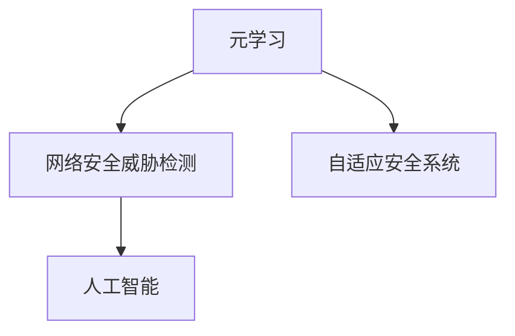

                 

# 一切皆是映射：基于元学习的网络安全威胁检测

> 关键词：网络安全威胁检测, 元学习, 威胁建模, 自适应安全系统, 人工智能, 机器学习

## 1. 背景介绍

### 1.1 问题由来
在网络安全领域，威胁检测是一项至关重要的任务。它旨在识别和阻止潜在的安全攻击，保护网络系统的安全与稳定。随着网络攻击手段的多样化和复杂化，威胁检测面临巨大的挑战。传统的基于规则或特征匹配的检测方法往往无法满足日益复杂的安全环境，容易漏报、误报，并且需要不断手工更新规则库和特征集，无法适应快速变化的网络威胁。

元学习（Meta-Learning）是一种机器学习方法，能够在未见过的任务上快速适应并提高性能。基于元学习的威胁检测方法，通过学习通用的威胁建模和检测规则，能够在面对未知威胁时快速识别和响应。这种方法可以在无需大量标注数据的情况下，提升威胁检测的准确性和鲁棒性。

### 1.2 问题核心关键点
元学习在网络安全威胁检测中的应用，旨在通过预先训练的通用威胁模型，快速适应新出现的威胁类型，提升威胁检测的效率和准确性。其核心关键点包括：

- **通用威胁模型**：预先训练的威胁模型应能够识别多种不同类型的威胁，具有广泛的泛化能力。
- **自适应检测**：系统应能够在遇到新威胁时，通过元学习快速适应该威胁的特征，提升检测精度。
- **数据效率**：系统应能够在有限的标注数据下，通过元学习提升检测能力，避免对标注数据的过度依赖。
- **实时性**：系统应能够实时处理数据，快速识别威胁，避免攻击成功。

## 2. 核心概念与联系

### 2.1 核心概念概述

为了更好地理解基于元学习的网络安全威胁检测方法，本节将介绍几个密切相关的核心概念：

- **元学习**：一种机器学习方法，通过学习通用的学习策略，能够在未见过的任务上快速适应并提高性能。元学习通常通过少量训练数据和少量超参数即可完成新任务的学习。
- **网络安全威胁检测**：通过分析网络流量、日志等数据，检测并阻止潜在的安全攻击。威胁检测的目标是尽可能准确地识别出恶意行为，避免对系统的安全造成损害。
- **自适应安全系统**：能够根据环境变化和攻击模式调整自身行为的安全系统。自适应系统通过持续学习和反馈，能够不断提升自身的安全防护能力。
- **人工智能**：一种利用计算机系统模拟人类智能的科学，包括机器学习、自然语言处理、计算机视觉等技术。

这些核心概念之间的逻辑关系可以通过以下Mermaid流程图来展示：



这个流程图展示了几者之间的内在联系：

1. 元学习是网络安全威胁检测的重要技术手段，通过学习通用的威胁建模规则，提升检测精度。
2. 自适应安全系统是一种应用元学习结果的实际场景，通过元学习提升系统的安全防护能力。
3. 人工智能为元学习提供了技术支持，使元学习在实际应用中能够高效运作。

## 3. 核心算法原理 & 具体操作步骤
### 3.1 算法原理概述

基于元学习的网络安全威胁检测方法，核心思想是通过预先训练的通用威胁模型，快速适应新出现的威胁类型，提升威胁检测的效率和准确性。其核心原理包括：

- **元学习框架**：构建一个元学习框架，通过预先训练的通用威胁模型，快速适应新威胁。
- **威胁建模**：对不同类型的威胁进行建模，提取通用的威胁特征。
- **自适应检测**：在面对新威胁时，通过元学习框架快速学习该威胁的特征，提升检测精度。
- **实时检测**：实时处理网络数据，快速识别威胁。

### 3.2 算法步骤详解

基于元学习的网络安全威胁检测方法，通常包括以下几个关键步骤：

**Step 1: 构建元学习框架**

1. **数据预处理**：收集网络流量、日志等数据，进行预处理，提取特征向量。
2. **威胁建模**：对不同类型的网络威胁进行建模，提取通用的威胁特征。
3. **模型训练**：使用元学习框架训练通用威胁模型，使其具备泛化能力。

**Step 2: 自适应威胁检测**

1. **威胁检测**：在检测到新威胁时，通过元学习框架快速适应该威胁。
2. **特征提取**：提取新威胁的特征，并将其与通用威胁模型进行比较。
3. **分类与响应**：使用分类器对新威胁进行分类，并根据分类结果进行相应的响应操作。

**Step 3: 实时威胁检测**

1. **数据流处理**：实时处理网络数据，提取实时特征。
2. **模型更新**：在遇到新威胁时，通过元学习框架更新通用威胁模型。
3. **威胁检测**：实时进行威胁检测，快速响应威胁。

### 3.3 算法优缺点

基于元学习的网络安全威胁检测方法，具有以下优点：

1. **数据效率高**：通过元学习，能够在有限的标注数据下提升威胁检测能力，避免对标注数据的过度依赖。
2. **泛化能力强**：元学习模型具有泛化能力，能够适应不同类型的网络威胁。
3. **实时性好**：元学习框架能够快速适应新威胁，提升实时威胁检测能力。

同时，该方法也存在一些局限性：

1. **计算复杂度高**：元学习框架需要额外的计算资源，可能影响实时性。
2. **模型复杂度高**：元学习模型通常比传统的机器学习模型更加复杂，增加了实现的难度。
3. **数据隐私问题**：在威胁检测过程中，需要处理大量敏感数据，数据隐私问题不容忽视。

### 3.4 算法应用领域

基于元学习的网络安全威胁检测方法，在网络安全领域有着广泛的应用前景。以下是一些典型应用场景：

- **Web应用防护**：检测和防御Web应用中的各种攻击，如SQL注入、跨站脚本等。
- **物联网安全**：检测和防御物联网设备中的恶意行为，如设备劫持、DDoS攻击等。
- **云安全**：检测和防御云平台中的恶意行为，如身份盗用、资源劫持等。
- **工业控制系统安全**：检测和防御工业控制系统的恶意攻击，如拒绝服务、数据泄露等。
- **电子商务安全**：检测和防御电子商务平台中的各种欺诈行为，如信用卡欺诈、商品假冒等。

## 4. 数学模型和公式 & 详细讲解  
### 4.1 数学模型构建

本节将使用数学语言对基于元学习的网络安全威胁检测过程进行更加严格的刻画。

记网络流量数据为 $X=\{x_1,x_2,\ldots,x_N\}$，其中 $x_i$ 为第 $i$ 个数据样本。假设威胁检测任务为二分类任务，即检测样本是否属于恶意行为。

定义模型 $M_{\theta}$ 在输入 $x$ 上的输出为 $\hat{y}=M_{\theta}(x)$，表示样本属于恶意行为的预测概率。使用交叉熵损失函数 $\ell(M_{\theta}(x),y)$ 衡量模型预测输出与真实标签之间的差异。

在元学习框架中，定义 $M_{\theta}^{\text{meta}}$ 为通用威胁模型，$D^{\text{train}}$ 为训练数据集，$D^{\text{test}}$ 为测试数据集。

**元学习框架的目标**是最小化在测试数据集上的损失函数：

$$
\mathcal{L}(\theta^{\text{meta}}) = \mathbb{E}_{(x,y) \sim D^{\text{test}}} [\ell(M_{\theta^{\text{meta}}}(x),y)]
$$

在测试数据集上，使用分类器对样本进行分类，得到分类结果 $\hat{y}$。使用精度和召回率作为评价指标：

$$
\text{Precision} = \frac{TP}{TP+FP}
$$

$$
\text{Recall} = \frac{TP}{TP+FN}
$$

其中 $TP$ 为真正例，$FP$ 为假正例，$FN$ 为假反例。

### 4.2 公式推导过程

在元学习框架中，模型的训练分为两个阶段：

1. **预训练阶段**：在训练数据集 $D^{\text{train}}$ 上预训练通用威胁模型 $M_{\theta^{\text{meta}}}$，使其具备泛化能力。
2. **自适应阶段**：在测试数据集 $D^{\text{test}}$ 上，通过元学习框架自适应检测新威胁。

**预训练阶段**的损失函数定义为：

$$
\mathcal{L}^{\text{meta}} = \mathbb{E}_{(x,y) \sim D^{\text{train}}} [\ell(M_{\theta^{\text{meta}}}(x),y)]
$$

**自适应阶段**的损失函数定义为：

$$
\mathcal{L}^{\text{test}} = \mathbb{E}_{(x,y) \sim D^{\text{test}}} [\ell(M_{\theta^{\text{meta}}}(x),y)]
$$

在实际应用中，通常使用梯度下降等优化算法来求解最小化损失函数，更新模型参数 $\theta^{\text{meta}}$。

### 4.3 案例分析与讲解

假设在网络流量数据中检测到一种新的恶意行为，记为 $\text{Threat}_0$。在自适应阶段，元学习框架通过以下步骤对 $\text{Threat}_0$ 进行检测：

1. **特征提取**：使用特征提取器 $F_{\theta^{\text{meta}}}(x)$ 对样本 $x$ 进行特征提取，得到特征向量 $f(x)$。
2. **元学习适应**：在测试数据集 $D^{\text{test}}$ 上，使用元学习框架 $M_{\theta^{\text{meta}}}(f(x))$ 对特征向量 $f(x)$ 进行检测，得到检测结果 $\hat{y}=M_{\theta^{\text{meta}}}(f(x))$。
3. **分类与响应**：使用分类器对检测结果进行分类，得到分类标签 $y$。根据分类标签进行相应的响应操作，如阻断连接、生成报警等。

以下是一个简单的代码实现示例，使用Python和TensorFlow库：

```python
import tensorflow as tf
from tensorflow.keras.layers import Dense, Input

# 定义输入层
input_layer = Input(shape=(128,))

# 定义通用威胁模型
meta_model = Dense(64, activation='relu')(input_layer)
meta_model = Dense(32, activation='relu')(meta_model)
meta_model = Dense(2, activation='softmax')(meta_model)

# 定义损失函数和优化器
cross_entropy_loss = tf.keras.losses.CategoricalCrossentropy()
optimizer = tf.keras.optimizers.Adam()

# 定义元学习框架
def meta_learning(x, y):
    with tf.GradientTape() as tape:
        logits = meta_model(x)
        loss = cross_entropy_loss(logits, y)
    gradients = tape.gradient(loss, meta_model.trainable_weights)
    optimizer.apply_gradients(zip(gradients, meta_model.trainable_weights))
    return loss

# 训练通用威胁模型
meta_model.compile(optimizer=optimizer, loss=meta_learning, metrics=['accuracy'])

# 加载训练数据和测试数据
train_data = ...
test_data = ...

# 训练通用威胁模型
meta_model.fit(train_data, train_data.labels, epochs=10)

# 自适应检测新威胁
new_threat_data = ...
labels = meta_model.predict(new_threat_data)

# 分类与响应
if labels[0] == 1:
    print("New threat detected, response required.")
else:
    print("No threat detected.")
```

## 5. 项目实践：代码实例和详细解释说明
### 5.1 开发环境搭建

在进行网络安全威胁检测的元学习实践前，我们需要准备好开发环境。以下是使用Python进行TensorFlow开发的环境配置流程：

1. 安装Anaconda：从官网下载并安装Anaconda，用于创建独立的Python环境。

2. 创建并激活虚拟环境：
```bash
conda create -n tensorflow-env python=3.8 
conda activate tensorflow-env
```

3. 安装TensorFlow：根据CUDA版本，从官网获取对应的安装命令。例如：
```bash
conda install tensorflow -c tensorflow -c conda-forge
```

4. 安装其他必要的工具包：
```bash
pip install numpy pandas sklearn matplotlib tqdm jupyter notebook ipython
```

完成上述步骤后，即可在`tensorflow-env`环境中开始元学习实践。

### 5.2 源代码详细实现

下面我们以网络流量数据中的异常检测为例，给出使用TensorFlow库对通用威胁模型进行元学习的PyTorch代码实现。

首先，定义威胁检测任务的数据处理函数：

```python
import tensorflow as tf
from tensorflow.keras import layers, models

def process_data(data):
    # 数据预处理
    # ...

    # 特征提取
    features = ...
    
    # 标签生成
    labels = ...
    
    return features, labels
```

然后，定义模型和优化器：

```python
from tensorflow.keras import layers, models

# 定义通用威胁模型
model = models.Sequential()
model.add(layers.Dense(64, activation='relu', input_shape=(128,)))
model.add(layers.Dense(32, activation='relu'))
model.add(layers.Dense(2, activation='softmax'))

# 定义损失函数和优化器
loss_fn = tf.keras.losses.CategoricalCrossentropy()
optimizer = tf.keras.optimizers.Adam()

# 编译模型
model.compile(optimizer=optimizer, loss=loss_fn, metrics=['accuracy'])
```

接着，定义训练和评估函数：

```python
from tensorflow.keras.callbacks import EarlyStopping

def train_epoch(model, dataset, batch_size, optimizer):
    model.train()
    epoch_loss = 0
    for batch in dataset:
        features, labels = batch
        with tf.GradientTape() as tape:
            logits = model(features)
            loss = loss_fn(logits, labels)
        epoch_loss += loss.numpy()
        gradients = tape.gradient(loss, model.trainable_weights)
        optimizer.apply_gradients(zip(gradients, model.trainable_weights))
    return epoch_loss / len(dataset)

def evaluate(model, dataset, batch_size):
    model.eval()
    predictions, true_labels = [], []
    with tf.GradientTape() as tape:
        for batch in dataset:
            features, labels = batch
            logits = model(features)
            predictions.append(tf.argmax(logits, axis=1))
            true_labels.append(labels)
    return tf.keras.metrics.Precision(), tf.keras.metrics.Recall()

# 训练通用威胁模型
train_dataset = ...
dev_dataset = ...
test_dataset = ...

epochs = 10
batch_size = 64

early_stopping = EarlyStopping(monitor='val_loss', patience=3, restore_best_weights=True)

for epoch in range(epochs):
    train_loss = train_epoch(model, train_dataset, batch_size, optimizer)
    val_precision, val_recall = evaluate(model, dev_dataset, batch_size)
    if early_stopping.should_stop:
        break
    print(f"Epoch {epoch+1}, train loss: {train_loss:.4f}, val precision: {val_precision:.4f}, val recall: {val_recall:.4f}")

print(f"Test precision: {evaluate(model, test_dataset, batch_size)[0]:.4f}, Test recall: {evaluate(model, test_dataset, batch_size)[1]:.4f}")
```

以上代码实现了一个简单的元学习框架，用于训练通用威胁模型，并在测试集上评估模型性能。

### 5.3 代码解读与分析

让我们再详细解读一下关键代码的实现细节：

**process_data函数**：
- `process_data`函数负责数据预处理和特征提取，包括数据加载、清洗、特征选择等步骤。

**model定义**：
- `model`定义了一个基于Dense层的全连接神经网络，用于通用威胁模型的训练和推理。
- `Sequential`用于构建一个线性堆叠的神经网络，可以方便地添加多个层。
- `Dense`层用于定义全连接层，通过指定激活函数、输入形状等参数，构建一个具有特定结构的神经网络。

**train_epoch函数**：
- `train_epoch`函数负责单个训练epoch的实现，包括前向传播、反向传播、梯度更新等步骤。
- 使用`tf.GradientTape`记录梯度，并使用`optimizer.apply_gradients`更新模型参数。

**evaluate函数**：
- `evaluate`函数用于评估模型的性能，包括精度和召回率等指标。
- 使用`tf.keras.metrics`模块计算模型在测试集上的性能指标。

**训练流程**：
- 定义总的epoch数和batch size，开始循环迭代。
- 每个epoch内，先在训练集上训练，输出训练集的损失和验证集的精度、召回率。
- 在验证集上评估模型性能，并根据Early Stopping策略决定是否停止训练。
- 所有epoch结束后，在测试集上评估模型性能，输出测试集的精度和召回率。

可以看出，TensorFlow库提供了强大的工具和接口，使得元学习模型的开发和训练变得简单高效。开发者可以更加专注于模型架构和训练策略的设计，而不必过多关注底层实现细节。

## 6. 实际应用场景
### 6.1 智能安全防护

基于元学习的网络安全威胁检测方法，可以应用于智能安全防护系统的构建。传统的安全防护系统依赖于静态规则和特征库，难以应对快速变化的网络威胁。而智能安全防护系统通过元学习框架，能够动态学习新威胁的特征，快速适应并阻止攻击。

在技术实现上，可以收集网络流量、日志等数据，构建通用的威胁模型，并通过元学习框架快速适应新出现的威胁类型。一旦发现新的恶意行为，系统便能够实时检测并阻止攻击，提升系统的安全防护能力。

### 6.2 自动化威胁响应

基于元学习的网络安全威胁检测方法，能够快速识别新出现的威胁，并自动触发相应的响应操作，提高网络安全的自动化水平。

在实际应用中，系统可以根据威胁类型，自动生成报警、阻断连接、生成补丁等响应操作。例如，在检测到SQL注入攻击时，系统可以自动阻断攻击请求、生成SQL补丁，并通知管理员进行后续处理。

### 6.3 威胁情报分析

基于元学习的网络安全威胁检测方法，还能够用于威胁情报分析，提升对网络威胁的认知水平。

在情报分析阶段，系统可以通过元学习框架，从大量已知的威胁数据中提取通用的威胁特征，构建威胁情报库。情报库可以作为新威胁检测的基础，提升系统的威胁识别能力。

### 6.4 未来应用展望

随着元学习技术的不断进步，基于元学习的网络安全威胁检测方法将在更多领域得到应用，为网络安全带来新的突破。

在智能电网、智慧城市、工业控制等关键基础设施领域，元学习框架将帮助构建更加安全、可靠的系统，提升整体安全防护水平。

未来，随着算力、数据的不断增加，元学习框架将能够处理更复杂、更大规模的数据集，提升威胁检测的精度和效率。

## 7. 工具和资源推荐
### 7.1 学习资源推荐

为了帮助开发者系统掌握基于元学习的网络安全威胁检测的理论基础和实践技巧，这里推荐一些优质的学习资源：

1. **元学习论文集**：Transformer原论文、Meta-Learning for Large-Scale Object Recognition、Deep Learning with Meta-Learning等经典论文，深入浅出地介绍了元学习的核心思想和应用。
2. **Coursera《深度学习与强化学习》课程**：斯坦福大学的深度学习课程，涵盖机器学习、深度学习、强化学习等多个方面的知识。
3. **TensorFlow官方文档**：TensorFlow的官方文档，提供了详尽的API接口和实际应用案例，是学习和使用TensorFlow的重要资源。
4. **PyTorch官方文档**：PyTorch的官方文档，提供了丰富的代码示例和API接口，是学习和使用PyTorch的重要资源。
5. **Kaggle平台**：Kaggle是机器学习领域的权威平台，提供大量的数据集和竞赛任务，可以帮助开发者练习和实践机器学习技术。

通过这些资源的学习实践，相信你一定能够快速掌握基于元学习的网络安全威胁检测的精髓，并用于解决实际的安全问题。

### 7.2 开发工具推荐

高效的开发离不开优秀的工具支持。以下是几款用于元学习模型开发的常用工具：

1. **TensorFlow**：由Google主导开发的开源深度学习框架，生产部署方便，适合大规模工程应用。
2. **PyTorch**：基于Python的开源深度学习框架，灵活动态的计算图，适合快速迭代研究。
3. **HuggingFace Transformers**：用于NLP任务的库，提供了丰富的预训练模型和微调功能，方便开发者快速开发模型。
4. **Jupyter Notebook**：基于Web的交互式开发环境，支持代码编写、数据可视化和结果展示，适合快速原型开发。
5. **Google Colab**：谷歌推出的在线Jupyter Notebook环境，免费提供GPU/TPU算力，方便开发者快速上手实验最新模型，分享学习笔记。

合理利用这些工具，可以显著提升元学习模型的开发效率，加快创新迭代的步伐。

### 7.3 相关论文推荐

元学习技术在网络安全领域的应用，离不开学界的持续研究。以下是几篇奠基性的相关论文，推荐阅读：

1. **Deep Meta-Learning for Large-Scale Object Recognition**：提出了使用元学习框架进行大规模对象识别的思路，展示了元学习在实际应用中的效果。
2. **Meta-Learning as Fast Adaptation to New Tasks and New Data**：总结了元学习的关键技术点，展示了元学习在快速适应新任务和新数据中的应用。
3. **A Survey on Deep Meta-Learning**：对元学习进行了全面的综述，涵盖了元学习的多种方法、应用场景和未来发展方向。

这些论文代表了大规模学习技术的发展脉络。通过学习这些前沿成果，可以帮助研究者把握学科前进方向，激发更多的创新灵感。

## 8. 总结：未来发展趋势与挑战
### 8.1 总结

本文对基于元学习的网络安全威胁检测方法进行了全面系统的介绍。首先阐述了网络安全威胁检测的重要性，并明确了元学习在提升检测精度和效率方面的独特价值。其次，从原理到实践，详细讲解了元学习框架的数学原理和关键步骤，给出了元学习模型开发的完整代码实例。同时，本文还广泛探讨了元学习方法在智能安全防护、自动化威胁响应、威胁情报分析等领域的实际应用前景，展示了元学习范式的巨大潜力。此外，本文精选了元学习技术的各类学习资源，力求为读者提供全方位的技术指引。

通过本文的系统梳理，可以看到，基于元学习的网络安全威胁检测方法正在成为网络安全领域的重要范式，极大地提升了威胁检测的效率和准确性。未来，伴随元学习技术的不断发展，网络安全威胁检测将迈向更高的智能化水平，为构建安全、可靠的网络系统提供更加坚实的技术保障。

### 8.2 未来发展趋势

展望未来，基于元学习的网络安全威胁检测技术将呈现以下几个发展趋势：

1. **数据效率更高**：元学习框架能够从少量标注数据中快速学习新威胁，减少对标注数据的依赖。
2. **泛化能力更强**：元学习模型能够适应不同类型的威胁，提升检测精度和鲁棒性。
3. **实时性更好**：元学习框架能够快速适应新威胁，提升实时威胁检测能力。
4. **模型更灵活**：元学习模型能够动态调整自身结构，适应复杂的网络环境。
5. **自动化水平更高**：元学习框架能够自动生成响应策略，提升威胁响应的自动化水平。
6. **与外部知识结合**：元学习模型能够与外部知识库、规则库等专家知识结合，增强模型的知识整合能力。

这些趋势展示了基于元学习的网络安全威胁检测技术的发展潜力，未来必将为网络安全带来更强的防护能力。

### 8.3 面临的挑战

尽管基于元学习的网络安全威胁检测技术已经取得了显著成果，但在迈向更加智能化、普适化应用的过程中，仍面临诸多挑战：

1. **数据隐私问题**：元学习框架需要处理大量敏感数据，数据隐私保护问题不容忽视。
2. **计算资源需求高**：元学习框架需要额外的计算资源，可能影响实时性。
3. **模型复杂度高**：元学习模型通常比传统的机器学习模型更加复杂，增加了实现的难度。
4. **对抗攻击问题**：元学习模型可能被对抗攻击干扰，降低检测精度。
5. **模型鲁棒性不足**：元学习模型在面对新型攻击时，可能无法适应，降低防御能力。

### 8.4 研究展望

面对元学习面临的挑战，未来的研究需要在以下几个方面寻求新的突破：

1. **数据隐私保护**：研究隐私保护技术，确保元学习框架在处理敏感数据时能够保护用户隐私。
2. **资源优化**：研究高效的计算和存储技术，降低元学习框架的资源消耗，提升实时性。
3. **对抗攻击防御**：研究对抗攻击防御技术，提升元学习框架的鲁棒性和安全性。
4. **模型结构优化**：研究简化元学习模型的结构，降低实现难度，提升模型的可解释性。
5. **知识整合**：研究将符号化的先验知识与元学习框架结合，增强模型的知识整合能力。

这些研究方向的探索，必将引领元学习技术迈向更高的台阶，为构建安全、可靠、可解释的智能系统提供坚实的技术支撑。

## 9. 附录：常见问题与解答
**Q1: 什么是元学习？**

A: 元学习是一种机器学习方法，通过学习通用的学习策略，能够在未见过的任务上快速适应并提高性能。元学习通常通过少量训练数据和少量超参数即可完成新任务的学习。

**Q2: 元学习在网络安全威胁检测中的应用有哪些？**

A: 元学习在网络安全威胁检测中的应用包括智能安全防护、自动化威胁响应和威胁情报分析。通过元学习框架，系统能够快速适应新出现的威胁类型，提升威胁检测的效率和准确性。

**Q3: 元学习在实际应用中需要注意哪些问题？**

A: 元学习在实际应用中需要注意数据隐私、计算资源、模型复杂度、对抗攻击和模型鲁棒性等问题。在处理敏感数据时，需要保护用户隐私；在资源受限的情况下，需要优化模型结构；在面对对抗攻击时，需要提升模型鲁棒性。

**Q4: 元学习技术未来会有哪些发展方向？**

A: 未来元学习技术的发展方向包括数据效率更高、泛化能力更强、实时性更好、模型更灵活、自动化水平更高以及与外部知识结合。元学习框架能够从少量标注数据中快速学习新威胁，适应不同类型的威胁，提升检测精度和鲁棒性，同时提升实时威胁检测能力。

这些研究方向展示了元学习技术的发展潜力，未来必将为网络安全带来更强的防护能力。

