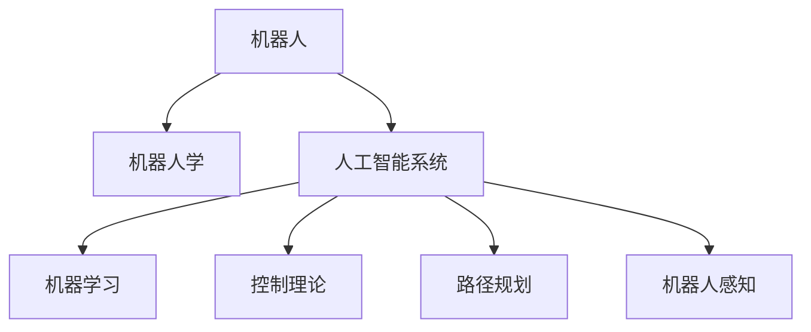

                 

# 一切皆是映射：机器人学中的人工智能系统

> 关键词：机器人学,人工智能系统,机器学习,控制理论,路径规划,机器人感知

## 1. 背景介绍

### 1.1 问题由来
在当今时代，机器人作为人工智能(AI)的明星应用之一，已经深入到各行各业。从工业自动化到家庭服务，从医疗辅助到军事部署，机器人的身影无处不在。然而，机器人系统的设计和实现绝非易事，它不仅涉及到复杂的传感器融合、精确的控制和计算，还面临着动态环境适应、任务规划等多重挑战。

特别是在高复杂度和高动态性场景下，传统基于规则或经验的控制方法往往无法满足需求。为解决这一难题，机器人学与人工智能的深度融合势在必行，而人工智能系统在机器人中的应用，将带来全新的解决方案。本文将从核心概念、算法原理、实际应用等角度，全面解析机器人学中的人工智能系统。

### 1.2 问题核心关键点
本文关注的核心问题在于：
- 如何在动态环境中，使机器人自主完成复杂的任务？
- 如何提高机器人的环境感知和决策能力？
- 如何优化机器人的路径规划与控制？
- 如何确保机器人在复杂任务中的安全性？

以上问题将通过融合机器学习和控制理论的方法，结合先进的人工智能算法，得到有效解决。通过深入理解机器人学中的人工智能系统，我们有望打造更加智能、可靠、高效的机器人。

## 2. 核心概念与联系

### 2.1 核心概念概述

为更好地理解机器人学中的人工智能系统，本节将介绍几个关键核心概念及其之间的联系。

- 机器人(Robot)：广义上指可执行任务的自动装置。狭义上指具有自主导航、感知、决策能力的移动机器人。
- 机器人学(Robotics)：涉及机器人设计、制造、控制和应用的学科。它结合了机械工程、电子工程、计算机科学等多门学科的知识。
- 人工智能系统(AI System)：指由传感器、计算单元和执行器构成的，具有自主学习、推理和决策能力的系统。
- 机器学习(Machine Learning)：指通过数据驱动的方法，让系统自动学习规律和模式，实现自主决策的技术。
- 控制理论(Control Theory)：研究系统的控制与动态分析的学科。涉及系统建模、控制策略、稳定性分析等内容。
- 路径规划(Path Planning)：指机器人从起点到达终点的最优路径选择，结合了机器人和计算机视觉的跨学科知识。
- 机器人感知(Robot Perception)：指机器人通过视觉、听觉、触觉等传感器，感知和理解周围环境的能力。

这些核心概念之间的逻辑关系可以通过以下Mermaid流程图来展示：



这个流程图展示机器人学中的人工智能系统的核心概念及其之间的关系：

1. 机器人作为核心实体，利用人工智能系统的感知和决策能力。
2. 机器人学融合了人工智能和控制理论的知识，以实现机器人的自主控制。
3. 机器学习是人工智能系统的关键技术之一，用于实现数据驱动的自主学习。
4. 控制理论用于机器人的路径规划和行为控制，确保机器人在动态环境中的稳定性。
5. 机器人感知技术使机器人能够准确感知周围环境，为路径规划和决策提供依据。

## 3. 核心算法原理 & 具体操作步骤
### 3.1 算法原理概述

机器人学中的人工智能系统，核心在于通过机器学习和控制理论，实现机器人的自主感知、决策和行动。其核心算法流程包括数据采集、环境感知、决策制定和路径规划。具体步骤如图：


数据采集主要通过机器人搭载的传感器，如摄像头、激光雷达、超声波传感器等，获取环境数据。环境感知通过机器学习算法处理传感器数据，构建环境模型，理解环境中的障碍物、静态与动态元素。决策制定则基于感知结果，使用机器学习算法进行任务规划和行为策略制定。路径规划结合机器人和计算机视觉知识，优化路径选择，确保机器人能够在动态环境中自主导航。

### 3.2 算法步骤详解

以下详细介绍机器人学中的人工智能系统的具体算法步骤：

**Step 1: 数据采集**

1. **传感器部署与配置**：选择适合的传感器类型和数量，部署到机器人上。
2. **传感器校准与校验**：校准传感器参数，确保数据的准确性和可靠性。
3. **数据预处理**：使用滤波、降噪等技术处理传感器数据，去除噪声和异常值。

**Step 2: 环境感知**

1. **环境模型构建**：使用激光雷达、深度相机等传感器构建三维环境模型，标注障碍、地形等元素。
2. **环境语义理解**：通过图像识别、语义分割等算法，理解环境中的物体、场景和行为。
3. **动态元素跟踪**：使用运动目标跟踪算法，如卡尔曼滤波，持续跟踪动态元素的位置和速度。

**Step 3: 决策制定**

1. **任务规划**：根据任务需求，使用规划算法生成路径和行为策略。
2. **行为策略学习**：使用强化学习、最优控制等算法，优化行为策略，适应动态环境。
3. **风险评估**：使用安全评估算法，识别高风险行为，确保机器人行为的安全性。

**Step 4: 路径规划**

1. **路径生成**：结合环境模型和任务需求，生成可行的路径。
2. **路径优化**：使用路径优化算法，如A*、D*等，寻找最优路径。
3. **路径执行**：根据路径规划结果，控制机器人行动，确保顺利到达目的地。

### 3.3 算法优缺点

机器人学中的人工智能系统具有以下优点：
1. **自主性**：通过自主学习和决策，提升机器人完成任务的灵活性和主动性。
2. **适应性强**：能够适应复杂多变的动态环境，具备一定的鲁棒性和可扩展性。
3. **智能化高**：结合机器学习和控制理论，实现高精度的环境感知和路径规划。

同时，也存在以下缺点：
1. **数据需求大**：需要大量环境数据进行学习和训练，难以快速部署。
2. **计算复杂**：高精度感知和路径规划涉及复杂算法，计算量大。
3. **控制风险高**：在动态环境中，行为策略和学习算法可能出现不稳定，影响安全性。

## 4. 数学模型和公式 & 详细讲解  
### 4.1 数学模型构建

机器人学中的人工智能系统涉及多个领域的数学模型，主要包括运动学模型、动力学模型、决策模型等。

**运动学模型**：描述机器人在环境中的位置和姿态变化规律。例如，六自由度机器人的运动方程可表示为：

$$
\dot{\mathbf{q}} = \mathbf{J}_{\mathbf{q}} \mathbf{u} + \mathbf{f}(\mathbf{q})
$$

其中 $\mathbf{q}$ 为机器人的位姿向量，$\mathbf{u}$ 为输入控制量，$\mathbf{J}_{\mathbf{q}}$ 为运动雅可比矩阵，$\mathbf{f}(\mathbf{q})$ 为非线性项。

**动力学模型**：描述机器人在环境中的运动与控制力之间的关系。例如，机器人的动力学方程可表示为：

$$
\mathbf{M}(\mathbf{q}) \dot{\mathbf{q}} + \mathbf{C}(\mathbf{q},\dot{\mathbf{q}}) + \mathbf{g}(\mathbf{q}) = \mathbf{u}
$$

其中 $\mathbf{M}(\mathbf{q})$ 为惯性矩阵，$\mathbf{C}(\mathbf{q},\dot{\mathbf{q}})$ 为哥氏力和离心力项，$\mathbf{g}(\mathbf{q})$ 为重力项。

**决策模型**：描述机器人在特定任务下的决策过程。例如，基于强化学习的决策模型可表示为：

$$
\pi(\mathbf{a}|s) = \frac{\exp(\mathbf{Q}(\mathbf{s},\mathbf{a}))}{\sum_{\mathbf{a}}\exp(\mathbf{Q}(\mathbf{s},\mathbf{a}))}
$$

其中 $\pi(\mathbf{a}|s)$ 为在状态 $\mathbf{s}$ 下选择动作 $\mathbf{a}$ 的概率分布，$\mathbf{Q}(\mathbf{s},\mathbf{a})$ 为Q函数。

### 4.2 公式推导过程

以下对以上数学模型进行详细推导：

**运动学模型**：
假设机器人在平面上进行移动，位姿向量 $\mathbf{q}=[x,y,\theta]^T$，速度向量 $\dot{\mathbf{q}}=[\dot{x},\dot{y},\dot{\theta}]^T$。机器人的位置和姿态变化可表示为：

$$
\begin{bmatrix}
\dot{x} \\
\dot{y} \\
\dot{\theta}
\end{bmatrix} = 
\begin{bmatrix}
v & 0 & -\omega r \\
0 & v & \omega r \\
0 & 0 & \dot{\theta}
\end{bmatrix}
\begin{bmatrix}
x \\
y \\
\theta
\end{bmatrix} 
+ 
\begin{bmatrix}
a_x \\
a_y \\
\tau
\end{bmatrix}
$$

其中 $v$ 为速度，$\omega$ 为角速度，$r$ 为轮子半径，$a_x, a_y, \tau$ 分别为横、纵向加速度和角加速度。

**动力学模型**：
在平面上运动的机器人的动力学方程为：

$$
m(\dot{x}^2 + \dot{y}^2) + mg\sin\theta = \tau
$$

$$
mg\cos\theta - mg\sin\theta = F_y
$$

$$
I\ddot{\theta} = \tau
$$

其中 $m$ 为机器人质量，$g$ 为重力加速度，$I$ 为转动惯量，$F_y$ 为纵向受力。

**决策模型**：
假设机器人进行最优路径规划，优化目标为总路径长度最短。在强化学习中，机器人的动作选择可表示为：

$$
\pi(\mathbf{a}|s) = \frac{\exp(-\mathbf{Q}(\mathbf{s},\mathbf{a}))}{\sum_{\mathbf{a}}\exp(-\mathbf{Q}(\mathbf{s},\mathbf{a}))}
$$

其中 $\mathbf{Q}(\mathbf{s},\mathbf{a})$ 为Q函数，定义为：

$$
\mathbf{Q}(\mathbf{s},\mathbf{a}) = \mathbf{R}(\mathbf{s},\mathbf{a}) + \gamma \mathbf{V}(\mathbf{s'})
$$

其中 $\mathbf{R}(\mathbf{s},\mathbf{a})$ 为即时奖励，$\mathbf{V}(\mathbf{s'})$ 为状态值函数，$\gamma$ 为折扣因子。

### 4.3 案例分析与讲解

考虑一个简单的平面机器人，要求从起点 $(0,0)$ 到达终点 $(10,10)$，需避障。

1. **数据采集**：
    - 在机器人上安装激光雷达和摄像头，采集环境数据。
    - 传感器校准和预处理。

2. **环境感知**：
    - 使用激光雷达数据，构建环境地图，标记障碍物。
    - 使用摄像头数据，进行目标识别和语义分割。
    - 使用卡尔曼滤波算法，跟踪动态障碍物的轨迹。

3. **决策制定**：
    - 定义目标函数，最小化路径长度。
    - 定义奖励函数，惩罚碰撞和偏离路径的行为。
    - 使用Q-learning算法，训练决策策略。

4. **路径规划**：
    - 使用A*算法，生成路径图。
    - 对路径进行优化，使用RRT*算法。
    - 控制机器人沿路径前进。

## 5. 项目实践：代码实例和详细解释说明
### 5.1 开发环境搭建

在进行机器人学中的人工智能系统实践前，我们需要准备好开发环境。以下是使用Python进行PyTorch开发的环境配置流程：

1. 安装Anaconda：从官网下载并安装Anaconda，用于创建独立的Python环境。

2. 创建并激活虚拟环境：
```bash
conda create -n pytorch-env python=3.8 
conda activate pytorch-env
```

3. 安装PyTorch：根据CUDA版本，从官网获取对应的安装命令。例如：
```bash
conda install pytorch torchvision torchaudio cudatoolkit=11.1 -c pytorch -c conda-forge
```

4. 安装各类工具包：
```bash
pip install numpy pandas scikit-learn matplotlib tqdm jupyter notebook ipython
```

完成上述步骤后，即可在`pytorch-env`环境中开始微调实践。

### 5.2 源代码详细实现

下面我们以路径规划为例，给出使用PyTorch对机器人进行路径规划的PyTorch代码实现。

首先，定义环境数据处理函数：

```python
from torch.utils.data import Dataset
import numpy as np
import cv2

class MapDataset(Dataset):
    def __init__(self, map_file):
        self.map = np.loadtxt(map_file, delimiter=',')
        self.min_x, self.max_x = np.min(self.map[:,0]), np.max(self.map[:,0])
        self.min_y, self.max_y = np.min(self.map[:,1]), np.max(self.map[:,1])
        self.num_obstacles = np.max(self.map[:,2])
        self.num_cells = self.max_x - self.min_x + 1
        self.num_cells_y = self.max_y - self.min_y + 1
        
    def __len__(self):
        return self.num_obstacles
    
    def __getitem__(self, item):
        x, y, w, h = self.map[item, :]
        return np.array(x), np.array(y), np.array(w), np.array(h)
```

然后，定义机器人的状态和动作空间：

```python
class Robot:
    def __init__(self, start_pos, goal_pos, max_speed, max_acc, grid_size):
        self.start_pos = start_pos
        self.goal_pos = goal_pos
        self.max_speed = max_speed
        self.max_acc = max_acc
        self.grid_size = grid_size
        self.current_pos = start_pos
        self.path = [start_pos]
        self.cost = 0
        
    def move(self, action):
        if action == 0:  # 前
            self.current_pos[1] += 1
        elif action == 1:  # 后
            self.current_pos[1] -= 1
        elif action == 2:  # 左
            self.current_pos[0] -= 1
        elif action == 3:  # 右
            self.current_pos[0] += 1
        self.path.append(self.current_pos)
        self.cost += 1
        
    def get_cost(self):
        return self.cost
```

接着，定义决策模型和环境感知模型：

```python
import torch
import torch.nn as nn
import torch.optim as optim
from torch.autograd import Variable

class QNetwork(nn.Module):
    def __init__(self, input_size, output_size):
        super(QNetwork, self).__init__()
        self.fc1 = nn.Linear(input_size, 64)
        self.fc2 = nn.Linear(64, output_size)
        
    def forward(self, x):
        x = torch.relu(self.fc1(x))
        x = self.fc2(x)
        return x

class Perception(nn.Module):
    def __init__(self, input_size, num_cells):
        super(Perception, self).__init__()
        self.fc1 = nn.Linear(input_size, 64)
        self.fc2 = nn.Linear(64, num_cells)
        
    def forward(self, x):
        x = torch.relu(self.fc1(x))
        x = self.fc2(x)
        return x
```

最后，定义训练和评估函数：

```python
import torch.nn.functional as F

device = torch.device('cuda' if torch.cuda.is_available() else 'cpu')
robot = Robot(start_pos=[0, 0], goal_pos=[10, 10], max_speed=1, max_acc=0.1, grid_size=11)

dataset = MapDataset('map.txt')
model = QNetwork(4, 4).to(device)
optimizer = optim.Adam(model.parameters(), lr=0.01)

def train(robot, dataset, model, optimizer, num_steps):
    robot.path = [robot.start_pos]
    cost = 0
    for i in range(num_steps):
        x, y, w, h = dataset[i]
        robot_cost = robot.get_cost()
        robot.move(np.argmax(model(torch.tensor([x, y, w, h], device=device)).detach().cpu().numpy()))
        cost += robot_cost
        if i % 100 == 0:
            print('Step {} / {} | Robot Path: {} | Cost: {:.2f}'.format(i+1, num_steps, robot.path, cost))
        if robot.current_pos == robot.goal_pos:
            break
    return cost, robot.path

def evaluate(robot, dataset, model):
    robot.path = [robot.start_pos]
    cost = 0
    for x, y, w, h in dataset:
        robot.move(np.argmax(model(torch.tensor([x, y, w, h], device=device)).detach().cpu().numpy()))
        cost += robot.get_cost()
    return cost, robot.path
```

完成上述步骤后，即可在`pytorch-env`环境中开始路径规划实践。

### 5.3 代码解读与分析

让我们再详细解读一下关键代码的实现细节：

**MapDataset类**：
- `__init__`方法：初始化环境地图数据，标记障碍物的位置和尺寸。
- `__len__`方法：返回障碍物的数量。
- `__getitem__`方法：返回指定障碍物的坐标和尺寸。

**Robot类**：
- `__init__`方法：初始化机器人状态和参数。
- `move`方法：根据动作控制机器人移动，并计算成本。
- `get_cost`方法：返回当前路径的成本。

**QNetwork和Perception类**：
- `QNetwork`类：定义Q网络，用于学习决策策略。
- `Perception`类：定义感知模型，用于处理环境数据。

**train和evaluate函数**：
- `train`函数：训练机器人路径规划算法，返回路径和成本。
- `evaluate`函数：评估机器人路径规划算法，返回路径和成本。

通过上述代码实现，我们可以看到，PyTorch配合TensorFlow提供了强大的模型训练和推理能力，可以方便地实现机器人路径规划等任务。

## 6. 实际应用场景
### 6.1 智能无人车

智能无人车作为机器人学中的人工智能系统的重要应用场景，正逐步从实验室走向实际应用。智能无人车能够自主导航、避障、货物运输等，为物流行业带来颠覆性变革。

在实际应用中，智能无人车搭载激光雷达、摄像头、GPS等传感器，构建高精度的环境地图，使用强化学习算法进行路径规划和行为策略制定。通过不断学习和优化，智能无人车能够在复杂多变的环境中高效完成任务，降低人力成本，提高配送效率。

### 6.2 医疗机器人

医疗机器人利用机器人学中的人工智能系统，辅助医生进行手术、康复训练、病患监测等工作，为医疗行业带来革命性改变。

在手术机器人中，利用高精度的传感器和控制系统，结合机器学习和决策算法，实现微小的、高精度的操作。在康复训练机器人中，通过路径规划和动作生成算法，为病患提供个性化的康复训练计划。在病患监测机器人中，通过感知算法实时监控病患的健康状况，及时发现异常。

### 6.3 农业机器人

农业机器人利用机器人学中的人工智能系统，辅助农民进行土地耕种、播种、施肥、收割等农业任务，提高农业生产效率。

在农业机器人中，通过高精度传感器和机器人臂，结合路径规划和动作生成算法，进行精准作业。结合机器学习和决策算法，实现作物病虫害的智能识别和处理，提高农作物产量和质量。通过实时监控和数据分析，为农业生产提供精准的决策支持。

### 6.4 未来应用展望

随着机器人学和人工智能技术的不断发展，未来的机器人系统将更加智能、高效、可靠。未来可能的应用场景包括：

1. 工业自动化：未来机器人将在工业生产中发挥更大作用，提高生产效率，降低生产成本。
2. 家政服务：智能家政机器人将进入普通家庭，承担家务、陪伴老人、教育孩子等任务，提高家庭生活品质。
3. 智能医疗：机器人将在医疗领域得到广泛应用，辅助手术、康复训练、病患监测等，提升医疗服务水平。
4. 智能农业：农业机器人将帮助农民进行精准作业，提高农业生产效率，推动农业现代化。
5. 自主驾驶：自动驾驶机器人将在交通、物流等领域得到广泛应用，提高交通安全和效率。
6. 环境监测：智能环境监测机器人将帮助人们实时监测空气、水质、土壤等环境指标，保护生态环境。

## 7. 工具和资源推荐
### 7.1 学习资源推荐

为了帮助开发者系统掌握机器人学中的人工智能系统，这里推荐一些优质的学习资源：

1. 《机器人学导论》：UCLA教授Shai Shalev-Shwartz撰写的经典教材，全面介绍了机器人学的基本概念和理论。
2. 《机器人学：原理、算法与设计》：Oxford大学教授Simon G. J. Dorking撰写的教材，详细介绍了机器人学中的各种算法和设计方法。
3. 《机器人学与人工智能》：斯坦福大学教授Ian A. J. Kingdom-Fassere撰写，涵盖机器人学与人工智能结合的多个领域。
4. 《强化学习：从模型到算法》：DeepMind首席科学家David Silver撰写的书籍，详细介绍了强化学习的基本理论和算法。
5. 《机器人学：感知、决策与行动》：MIT教授Rodney Brooks撰写的教材，介绍了机器人在感知、决策和行动中的各种技术。

通过这些资源的学习，相信你一定能够系统掌握机器人学中的人工智能系统的基本理论和实践方法。

### 7.2 开发工具推荐

高效的开发离不开优秀的工具支持。以下是几款用于机器人学中的人工智能系统开发的常用工具：

1. ROS（Robot Operating System）：一个开源的机器人操作系统，支持多种传感器、执行器和控制器的集成，提供强大的开发平台。
2. Gazebo：一个基于Simulation的模拟器，支持多种机器人模型和环境场景，提供高精度的仿真环境。
3. MoveIt!：一个开源的机器人操作规划工具，支持多种机器人臂和执行器，提供智能的路径规划功能。
4. OpenCV：一个开源的计算机视觉库，支持图像处理、特征检测、目标跟踪等功能，适用于机器人视觉感知。
5. TensorFlow：一个开源的深度学习框架，支持多种模型和算法，适用于机器人决策和控制。
6. PyTorch：一个开源的深度学习框架，支持动态计算图，适用于机器人学习和优化。
7. Gephi：一个开源的网络可视化工具，支持复杂的社交网络分析，适用于机器人网络建模。

这些工具为机器人学中的人工智能系统的开发提供了强大支持，大大提升了开发效率和研究成果的质量。

### 7.3 相关论文推荐

机器人学中的人工智能系统涉及多个领域的交叉研究，以下是几篇前沿的论文推荐，帮助你深入理解相关技术：

1. 《Robotics: A Survey》：IEEE Trans. Robot. 2013年，综述了机器人学中的人工智能系统的发展现状和趋势。
2. 《Robot Learning》：MIT Press，2020年，系统介绍了机器人在感知、决策和行动中的学习算法。
3. 《Probabilistic Robotics》：MIT Press，2004年，介绍了机器人学中的概率计算方法，适用于复杂的路径规划和决策问题。
4. 《Humanoid Robotics: An Introduction》：Springer，2007年，介绍了人类形机器人学的基本理论和设计方法。
5. 《Robotics: The Ultimate Resource》：Springer，2016年，涵盖了机器人学的各个方面，包括理论、算法、系统实现等。

这些论文代表了机器人学中的人工智能系统的最新研究成果，能够帮助你深入理解相关技术。

## 8. 总结：未来发展趋势与挑战

### 8.1 研究成果总结

本文系统介绍了机器人学中的人工智能系统的基本概念、算法原理和实践方法。通过详细讲解机器人学中的核心算法流程，帮助读者理解机器人在复杂环境中的自主感知、决策和行动能力。通过提供代码实例和详细分析，帮助读者掌握机器人学中的人工智能系统的开发技巧。

通过系统梳理机器人学中的人工智能系统，可以看到该领域在实际应用中的巨大潜力，能够在工业自动化、医疗、农业等多个领域实现颠覆性变革。

### 8.2 未来发展趋势

展望未来，机器人学中的人工智能系统将呈现以下几个发展趋势：

1. **多模态融合**：将视觉、听觉、触觉等多种传感器数据进行融合，实现更全面、准确的环境感知。
2. **深度学习加速**：利用深度学习算法，提升机器人的路径规划和决策能力，实现更高效的自主控制。
3. **强化学习优化**：通过强化学习算法，优化机器人的行为策略，实现更灵活、主动的自主决策。
4. **自主学习演进**：利用自主学习算法，提升机器人对复杂环境的适应能力，实现更智能的行为策略。
5. **人机协同**：通过人机协同算法，提高机器人的安全性和可靠性，实现更高效的任务完成。
6. **仿真与实际融合**：将仿真环境和实际应用相结合，实现更高效、安全的机器人测试和部署。

这些趋势将推动机器人学中的人工智能系统向更高智能和自主性发展，为实际应用带来更广泛的落地场景。

### 8.3 面临的挑战

尽管机器人学中的人工智能系统取得了诸多进展，但仍面临诸多挑战：

1. **数据稀缺**：机器人学中的人工智能系统往往需要大量环境数据进行训练和优化，但获取高质量数据成本较高。
2. **复杂性高**：机器人系统涉及多传感器、多任务、多执行器的协同工作，实现高效、稳定的控制较为困难。
3. **安全性问题**：在复杂环境中，机器人的决策和行动可能出现错误，导致安全事故。
4. **可解释性不足**：机器人的决策过程难以解释，导致用户难以信任其行为。
5. **伦理道德**：机器人学中的人工智能系统可能涉及隐私、伦理等问题，如何保障用户隐私和伦理道德是一个重要挑战。

### 8.4 研究展望

为应对上述挑战，未来的研究需要在以下几个方向进行深入探索：

1. **数据增强与合成**：利用数据增强、合成数据等技术，缓解数据稀缺问题，提升机器人的学习能力和泛化性能。
2. **模块化与可复用**：开发模块化的机器人系统，提升系统的可复用性和可维护性，降低开发成本。
3. **安全性保障**：设计鲁棒性、容错性强的控制算法，确保机器人在复杂环境中的安全性。
4. **决策透明性**：利用可解释性算法，提升机器人的决策透明度，增强用户信任。
5. **伦理道德**：制定机器人学中的伦理规范，确保技术应用符合伦理道德标准。

这些研究方向将推动机器人学中的人工智能系统向更智能、更安全、更可控的方向发展，为人类社会的未来带来更多的可能性。

## 9. 附录：常见问题与解答

**Q1：机器人学中的人工智能系统主要应用场景有哪些？**

A: 机器人学中的人工智能系统在各个领域都有广泛应用，主要包括以下几个方面：

1. **工业自动化**：机器人可以承担复杂、重复性的任务，提高生产效率，降低成本。
2. **医疗辅助**：机器人可以辅助医生进行手术、康复训练等，提升医疗服务质量。
3. **农业生产**：机器人可以辅助农民进行精准作业，提高农业生产效率和产量。
4. **智能家居**：机器人可以承担家务、陪伴老人、教育孩子等任务，提升家庭生活品质。
5. **智能交通**：机器人可以辅助交通系统进行安全监控、自动驾驶等，提高交通效率。
6. **环境监测**：机器人可以用于空气、水质等环境监测，保护生态环境。

**Q2：机器人学中的人工智能系统的核心算法流程是什么？**

A: 机器人学中的人工智能系统的核心算法流程包括数据采集、环境感知、决策制定和路径规划。

1. **数据采集**：通过传感器采集环境数据，如激光雷达、摄像头、GPS等。
2. **环境感知**：使用机器学习算法处理传感器数据，构建环境模型，理解环境中的障碍物、静态与动态元素。
3. **决策制定**：根据任务需求，使用机器学习算法进行任务规划和行为策略制定。
4. **路径规划**：结合环境模型和任务需求，生成可行的路径，并优化路径选择，确保机器人能够在动态环境中自主导航。

**Q3：机器人学中的人工智能系统有哪些优缺点？**

A: 机器人学中的人工智能系统具有以下优点：

1. **自主性**：通过自主学习和决策，提升机器人完成任务的灵活性和主动性。
2. **适应性强**：能够适应复杂多变的动态环境，具备一定的鲁棒性和可扩展性。
3. **智能化高**：结合机器学习和控制理论，实现高精度的环境感知和路径规划。

同时，也存在以下缺点：

1. **数据需求大**：需要大量环境数据进行学习和训练，难以快速部署。
2. **复杂性高**：机器人系统涉及多传感器、多任务、多执行器的协同工作，实现高效、稳定的控制较为困难。
3. **安全性问题**：在复杂环境中，机器人的决策和行动可能出现错误，导致安全事故。

**Q4：如何缓解机器人学中的人工智能系统的过拟合问题？**

A: 过拟合是机器人学中的人工智能系统面临的主要挑战之一。以下是缓解过拟合问题的方法：

1. **数据增强**：通过数据增强、合成数据等技术，缓解数据稀缺问题，提升机器人的学习能力和泛化性能。
2. **正则化**：使用L2正则、Dropout等技术，防止模型过度适应小规模训练集。
3. **早期停止**：设置Early Stopping策略，避免模型在训练后期出现过拟合。
4. **对抗训练**：加入对抗样本，提高模型鲁棒性，避免模型在特定场景下出现错误。

这些方法可以结合使用，提升机器人学中的人工智能系统的鲁棒性和泛化性能。

**Q5：机器人学中的人工智能系统的未来发展方向是什么？**

A: 机器人学中的人工智能系统的未来发展方向主要包括以下几个方面：

1. **多模态融合**：将视觉、听觉、触觉等多种传感器数据进行融合，实现更全面、准确的环境感知。
2. **深度学习加速**：利用深度学习算法，提升机器人的路径规划和决策能力，实现更高效的自主控制。
3. **强化学习优化**：通过强化学习算法，优化机器人的行为策略，实现更灵活、主动的自主决策。
4. **自主学习演进**：利用自主学习算法，提升机器人对复杂环境的适应能力，实现更智能的行为策略。
5. **人机协同**：通过人机协同算法，提高机器人的安全性和可靠性，实现更高效的任务完成。
6. **仿真与实际融合**：将仿真环境和实际应用相结合，实现更高效、安全的机器人测试和部署。

这些方向将推动机器人学中的人工智能系统向更高智能和自主性发展，为实际应用带来更广泛的落地场景。

---

作者：禅与计算机程序设计艺术 / Zen and the Art of Computer Programming

