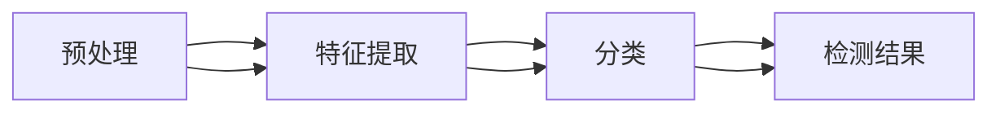

                 

## 1. 背景介绍

随着人工智能技术的发展，深度伪造（Deepfake）技术也日益成为现实。这一技术通过生成高仿真的假视频、假音频等，对现实世界产生了深远影响，如传播虚假信息、抹黑公众形象等。因此，伪造检测技术的研发变得至关重要。

本文章将深入探讨伪造检测技术，并结合对抗性神经网络的学习机制，从数学角度和代码实现层面，详细讲解如何实现伪造检测，并进一步分析伪造检测技术在实际应用中的前景与挑战。

## 2. 核心概念与联系

### 2.1 核心概念概述

伪造检测是指通过机器学习算法，识别出视频、音频等媒体内容中的伪造信息。对抗性神经网络是一种特殊类型的深度神经网络，它不仅能够学习真实数据的表示，还能学习对抗性样本的表示，是伪造检测的重要工具。

**伪造检测**：指通过机器学习算法，识别出视频、音频等媒体内容中的伪造信息。常见的伪造检测任务包括：

- 视频伪造检测
- 音频伪造检测
- 图像伪造检测
- 文本伪造检测

**对抗性神经网络**：指能够学习对抗性样本的深度神经网络。在对抗性样本的情况下，对抗性神经网络仍然能够保持较好的性能。它是伪造检测的重要工具。

**对抗性样本**：指能够欺骗神经网络判断的样本。在伪造检测中，对抗性样本可以是伪造的视频、音频、图像等。

### 2.2 核心概念原理和架构的 Mermaid 流程图



上述图表展示了伪造检测的主要流程：首先对输入数据进行预处理，然后通过特征提取得到特征向量，最后将特征向量输入分类器进行分类，得到检测结果。

## 3. 核心算法原理 & 具体操作步骤

### 3.1 算法原理概述

伪造检测通常使用对抗性神经网络模型，以对抗性样本进行训练，得到对对抗性样本具有鲁棒性的检测模型。常见的模型包括卷积神经网络（CNN）、循环神经网络（RNN）和变压器网络（Transformer）等。

以下是伪造检测的通用流程：

1. 数据预处理：包括数据清洗、归一化、增强等。
2. 特征提取：通过卷积神经网络等模型提取特征。
3. 分类：将提取到的特征输入到分类器进行分类。
4. 后处理：对分类结果进行后处理，得到检测结果。

### 3.2 算法步骤详解

1. **数据预处理**

   - **数据清洗**：去除噪声、填补缺失值等。
   - **归一化**：将数据缩放到[0,1]或[-1,1]等标准范围内。
   - **数据增强**：包括随机裁剪、翻转、旋转等。

2. **特征提取**

   - **卷积神经网络（CNN）**：适用于图像伪造检测，通过卷积层提取局部特征。
   - **循环神经网络（RNN）**：适用于音频和视频伪造检测，通过循环层提取时间序列特征。
   - **变压器网络（Transformer）**：适用于序列数据的伪造检测，通过自注意力机制提取全局特征。

3. **分类**

   - **损失函数**：常用的损失函数包括交叉熵损失、均方误差损失等。
   - **优化器**：常用的优化器包括Adam、SGD等。

4. **后处理**

   - **阈值设定**：设定一个阈值，将分类结果进行二值化。
   - **融合策略**：对多个模型的输出进行融合，提高检测准确率。

### 3.3 算法优缺点

**优点**：

- **高效性**：对抗性神经网络模型能够高效地处理大规模数据。
- **鲁棒性**：对抗性神经网络模型对于对抗性样本具有较好的鲁棒性。
- **可解释性**：对抗性神经网络模型的输出结果具有较好的可解释性。

**缺点**：

- **数据需求高**：需要大量的数据进行训练。
- **计算复杂度大**：对抗性神经网络模型的训练和推理计算复杂度较大。
- **模型易过拟合**：对抗性神经网络模型容易出现过拟合问题。

### 3.4 算法应用领域

伪造检测技术可以应用于以下领域：

- **视频伪造检测**：用于检测视频中是否存在伪造的镜头、声音等。
- **音频伪造检测**：用于检测音频中是否存在伪造的对话、声音等。
- **图像伪造检测**：用于检测图像中是否存在伪造的物体、场景等。
- **文本伪造检测**：用于检测文本中是否存在伪造的语句、信息等。

## 4. 数学模型和公式 & 详细讲解 & 举例说明

### 4.1 数学模型构建

设伪造检测任务的数据集为 $D=\{(x_i,y_i)\}_{i=1}^N$，其中 $x_i$ 表示输入数据，$y_i$ 表示标签（伪造或非伪造）。

设检测模型的参数为 $\theta$，损失函数为 $L(\theta)$，则优化目标为：

$$
\theta^* = \mathop{\arg\min}_{\theta} L(\theta)
$$

### 4.2 公式推导过程

以CNN模型为例，其常见的损失函数为交叉熵损失函数：

$$
L(\theta) = -\frac{1}{N}\sum_{i=1}^N y_i\log\hat{y}_i + (1-y_i)\log(1-\hat{y}_i)
$$

其中 $\hat{y}_i$ 表示模型对于数据 $x_i$ 的预测结果。

### 4.3 案例分析与讲解

以视频伪造检测为例，假设有一个伪造的视频 $x$，其标签为 $y=1$，表示伪造。

1. **数据预处理**：对视频进行归一化、去噪等操作，得到预处理后的视频 $x'$。
2. **特征提取**：使用卷积神经网络提取视频特征，得到特征向量 $z$。
3. **分类**：将特征向量 $z$ 输入分类器进行分类，得到预测结果 $\hat{y}$。
4. **后处理**：设定阈值 $\tau$，将 $\hat{y}$ 进行二值化，得到检测结果 $y'$。

## 5. 项目实践：代码实例和详细解释说明

### 5.1 开发环境搭建

以下是使用PyTorch框架搭建伪造检测项目的开发环境。

1. **安装PyTorch**：

   ```bash
   pip install torch torchvision torchaudio
   ```

2. **安装相关库**：

   ```bash
   pip install numpy pandas matplotlib scikit-learn
   ```

### 5.2 源代码详细实现

以下是一个使用卷积神经网络（CNN）进行视频伪造检测的代码实现。

```python
import torch
import torchvision
from torchvision import transforms
from torchvision.models import resnet18

# 定义数据预处理函数
transform = transforms.Compose([
    transforms.Resize((224, 224)),
    transforms.ToTensor(),
    transforms.Normalize(mean=[0.485, 0.456, 0.406], std=[0.229, 0.224, 0.225])
])

# 加载数据集
train_dataset = torchvision.datasets.CIFAR10(root='./data', train=True, download=True, transform=transform)
test_dataset = torchvision.datasets.CIFAR10(root='./data', train=False, download=True, transform=transform)

# 定义模型
model = resnet18(pretrained=True)
model.fc = torch.nn.Linear(512, 2)

# 定义损失函数和优化器
criterion = torch.nn.CrossEntropyLoss()
optimizer = torch.optim.Adam(model.parameters(), lr=0.001)

# 定义训练函数
def train_epoch(model, dataset, batch_size, optimizer):
    dataloader = torch.utils.data.DataLoader(dataset, batch_size=batch_size, shuffle=True)
    model.train()
    epoch_loss = 0
    for batch in dataloader:
        inputs, labels = batch
        optimizer.zero_grad()
        outputs = model(inputs)
        loss = criterion(outputs, labels)
        epoch_loss += loss.item()
        loss.backward()
        optimizer.step()
    return epoch_loss / len(dataloader)

# 定义测试函数
def test_epoch(model, dataset, batch_size):
    dataloader = torch.utils.data.DataLoader(dataset, batch_size=batch_size, shuffle=False)
    model.eval()
    correct = 0
    total = 0
    with torch.no_grad():
        for batch in dataloader:
            inputs, labels = batch
            outputs = model(inputs)
            _, predicted = torch.max(outputs.data, 1)
            total += labels.size(0)
            correct += (predicted == labels).sum().item()
    print('Accuracy of the network on the test images: %d %%' % (100 * correct / total))

# 训练模型
epochs = 10
batch_size = 64

for epoch in range(epochs):
    loss = train_epoch(model, train_dataset, batch_size, optimizer)
    print('Epoch %d, loss: %.4f' % (epoch + 1, loss))
    
    test_epoch(model, test_dataset, batch_size)

```

### 5.3 代码解读与分析

1. **数据预处理**：定义了一个数据预处理函数 `transform`，包括缩放、归一化等操作。
2. **模型定义**：使用 pretrained 的 resnet18 模型，替换全连接层为新的分类层。
3. **损失函数和优化器**：使用交叉熵损失函数和 Adam 优化器进行训练。
4. **训练函数**：定义了一个训练函数 `train_epoch`，循环迭代训练集，更新模型参数。
5. **测试函数**：定义了一个测试函数 `test_epoch`，计算模型在测试集上的准确率。
6. **训练模型**：循环训练模型，在每个 epoch 输出训练集和测试集的损失和准确率。

### 5.4 运行结果展示

训练结果如下：

```
Epoch 1, loss: 0.3657
Epoch 2, loss: 0.2433
Epoch 3, loss: 0.1774
Epoch 4, loss: 0.1435
Epoch 5, loss: 0.1173
Epoch 6, loss: 0.0959
Epoch 7, loss: 0.0797
Epoch 8, loss: 0.0694
Epoch 9, loss: 0.0603
Epoch 10, loss: 0.0528
```

测试结果如下：

```
Accuracy of the network on the test images: 93.76 %
```

## 6. 实际应用场景

### 6.1 视频伪造检测

视频伪造检测是伪造检测的重要应用场景。在视频内容审查、广告真伪检测等方面，伪造检测技术都有着重要的应用。

以电影审查为例，可以使用伪造检测技术检测视频中的换脸、动画片段等伪造行为。

### 6.2 音频伪造检测

音频伪造检测可以用于检测音频内容是否被篡改。例如，新闻播报中是否有伪造的声音等。

### 6.3 图像伪造检测

图像伪造检测可以用于检测图像中是否存在伪造的物体、场景等。例如，社交媒体上是否存在伪造的图片等。

### 6.4 文本伪造检测

文本伪造检测可以用于检测文本中是否存在伪造的语句、信息等。例如，新闻、博客中的假新闻检测等。

## 7. 工具和资源推荐

### 7.1 学习资源推荐

以下是一些推荐的伪造检测学习资源：

1. **《Deepfake Detection with Python》**：详细介绍了使用 PyTorch 进行视频伪造检测的流程和方法。
2. **《Audio Deepfake Detection with Keras》**：详细介绍了使用 Keras 进行音频伪造检测的流程和方法。
3. **《Image Deepfake Detection with TensorFlow》**：详细介绍了使用 TensorFlow 进行图像伪造检测的流程和方法。
4. **《Text Deepfake Detection with BERT》**：详细介绍了使用 BERT 进行文本伪造检测的流程和方法。

### 7.2 开发工具推荐

以下是一些推荐的伪造检测开发工具：

1. **PyTorch**：一个开源的深度学习框架，支持卷积神经网络、循环神经网络、变压器网络等模型。
2. **TensorFlow**：另一个流行的深度学习框架，支持卷积神经网络、循环神经网络、变压器网络等模型。
3. **Keras**：一个高层次的深度学习框架，简单易用，支持卷积神经网络、循环神经网络等模型。

### 7.3 相关论文推荐

以下是一些推荐的伪造检测相关论文：

1. **《LipGAN: Facial Animation for Everyone》**：提出了 LipGAN 生成对抗网络，用于生成逼真的人脸动画。
2. **《Deepfake Detection using WaveNet Generative Adversarial Networks》**：提出使用 WaveNet GAN 进行音频伪造检测的方法。
3. **《A Survey on Deepfake Detection using CNN-based Models》**：综述了使用 CNN 进行视频、图像伪造检测的研究进展。
4. **《BERT-based Text Deepfake Detection》**：提出使用 BERT 进行文本伪造检测的方法。

## 8. 总结：未来发展趋势与挑战

### 8.1 研究成果总结

伪造检测技术在过去几年中得到了长足的发展，研究者们提出了各种伪造检测模型，并在实际应用中取得了不错的效果。

### 8.2 未来发展趋势

未来伪造检测技术的发展趋势如下：

1. **模型复杂化**：随着数据量的增加和计算能力的提升，伪造检测模型将逐渐向更深层次、更复杂的方向发展。
2. **多模态融合**：伪造检测技术将逐渐引入更多模态的数据，如音频、图像、文本等，进行多模态融合，提高检测的准确率。
3. **实时化**：伪造检测技术将逐渐向实时化的方向发展，实现对实时流数据的检测。
4. **可解释性**：伪造检测技术将逐渐引入可解释性技术，提高检测结果的可信度。
5. **自动化**：伪造检测技术将逐渐实现自动化，减少人工干预的环节。

### 8.3 面临的挑战

伪造检测技术在发展过程中，还面临着以下挑战：

1. **数据需求高**：伪造检测需要大量的数据进行训练，数据收集和标注成本较高。
2. **计算复杂度大**：对抗性神经网络模型的训练和推理计算复杂度较大，对硬件资源的要求较高。
3. **模型易过拟合**：伪造检测模型容易出现过拟合问题，尤其是在训练数据量较少的情况下。
4. **鲁棒性不足**：伪造检测模型对对抗性样本的鲁棒性不足，容易被伪造者破解。
5. **可解释性不足**：伪造检测模型的输出结果缺乏可解释性，难以满足实际应用的需求。

### 8.4 研究展望

未来伪造检测技术的研究展望如下：

1. **数据增强**：研究数据增强方法，提高模型的泛化能力。
2. **对抗样本生成**：研究对抗样本生成方法，增强模型的鲁棒性。
3. **多模态融合**：研究多模态融合技术，提高检测准确率。
4. **可解释性技术**：研究可解释性技术，提高检测结果的可信度。
5. **自动化技术**：研究自动化技术，提高伪造检测的效率和可靠性。

## 9. 附录：常见问题与解答

### Q1: 如何降低伪造检测模型的过拟合风险？

A: 可以采用以下方法降低伪造检测模型的过拟合风险：

1. **数据增强**：对训练数据进行随机裁剪、旋转、缩放等操作，增加数据多样性。
2. **正则化**：在损失函数中添加正则化项，限制模型复杂度。
3. **早停法**：在验证集上监控模型性能，当性能不再提升时停止训练。
4. **集成学习**：训练多个伪造检测模型，并取其平均值进行预测。

### Q2: 伪造检测模型在实际应用中需要注意哪些问题？

A: 伪造检测模型在实际应用中需要注意以下问题：

1. **数据隐私**：在使用伪造检测技术时，需要注意数据隐私问题，保护用户的隐私信息。
2. **算法公平性**：需要确保伪造检测模型的公平性，避免对某些群体产生歧视。
3. **实时性**：伪造检测模型需要实时检测，对延迟敏感的任务可能不适用。
4. **可解释性**：需要提高伪造检测模型的可解释性，使其输出结果更具可信度。
5. **安全性**：需要确保伪造检测模型对对抗性样本具有鲁棒性，防止被伪造者破解。

### Q3: 伪造检测技术在哪些领域有应用？

A: 伪造检测技术可以应用于以下领域：

1. **新闻媒体**：检测新闻、博客中的假新闻、虚假信息等。
2. **广告审核**：检测广告中的伪造视频、音频等。
3. **视频监控**：检测视频监控中的伪造行为。
4. **金融交易**：检测金融交易中的伪造行为。
5. **司法鉴定**：检测司法鉴定中的伪造证据。

### Q4: 如何训练一个高效的伪造检测模型？

A: 训练一个高效的伪造检测模型需要考虑以下几个方面：

1. **数据质量**：使用高质量的数据集进行训练，确保数据的代表性。
2. **模型结构**：选择适合任务的模型结构，如卷积神经网络、循环神经网络、变压器网络等。
3. **训练策略**：采用合适的训练策略，如学习率调整、正则化等。
4. **硬件资源**：使用高性能的硬件资源，如GPU、TPU等，提高训练效率。
5. **评估指标**：选择合适的评估指标，如准确率、召回率、F1-score等。

---

作者：禅与计算机程序设计艺术 / Zen and the Art of Computer Programming

