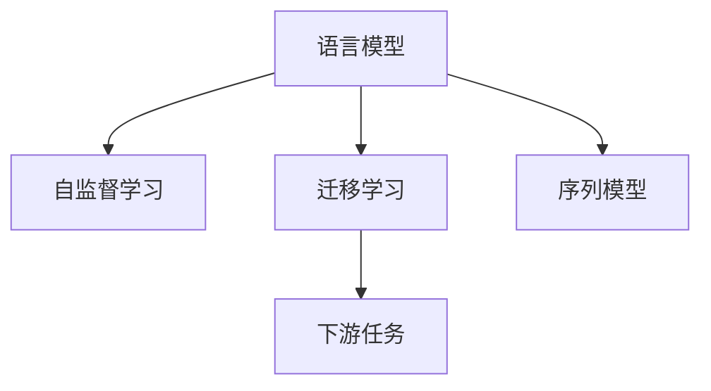

                 

# 上下文学习 (Contextual Learning) 原理与代码实例讲解

> 关键词：上下文学习, 自监督学习, 序列模型, 神经网络, 迁移学习, 语言模型, 词向量

## 1. 背景介绍

在自然语言处理(NLP)领域，上下文学习(Contextual Learning)技术逐渐成为研究热点，尤其是通过自监督学习(SSL)方式训练大规模语言模型。与传统的监督学习(Supervised Learning)相比，上下文学习依赖于大量无标签文本数据，无需人工标注，不仅节省了大量标注成本，还促进了通用语言模型的构建。本文将从原理到实践，系统讲解上下文学习的核心概念、算法原理、具体操作步骤，并提供代码实例，帮助读者全面理解上下文学习技术。

## 2. 核心概念与联系

### 2.1 核心概念概述

上下文学习是一种基于无标签数据进行自监督训练的语言模型训练方式。它通过挖掘文本序列中的上下文信息，利用语言结构、词性、词义等特征，训练能够理解语言语义的模型。常见的上下文学习任务包括语言模型预测、掩码语言建模、句子相似度计算等。

与传统的监督学习不同，上下文学习不需要大量标注数据，能够从大规模无标签文本中学习到语言模式和语义特征，使得模型具有更强的泛化能力和迁移学习能力。同时，上下文学习模型能够处理大规模、高维度的数据集，极大地提升了模型的性能和应用范围。

### 2.2 核心概念联系

上下文学习的核心概念可以总结如下：

- **语言模型**：上下文学习的核心是语言模型，用于预测下一个单词或字符的概率，反映了语言序列中的上下文关系。
- **自监督学习**：上下文学习依赖于自监督学习，通过设计特定的训练任务（如掩码语言模型），让模型从无标签数据中学习语言特征。
- **迁移学习**：上下文学习模型能够将从大规模无标签数据中学到的语言知识迁移到下游任务中，提升模型在特定任务上的性能。
- **序列模型**：上下文学习模型通常是序列模型，如循环神经网络(RNN)、长短期记忆网络(LSTM)、Transformer等。

这些概念之间的联系可以通过以下Mermaid流程图展示：



## 3. 核心算法原理 & 具体操作步骤

### 3.1 算法原理概述

上下文学习的核心在于通过序列模型，从大规模无标签文本中学习到语言模式和语义特征，然后通过迁移学习，将这些知识应用于下游任务。其基本流程如下：

1. **数据预处理**：将文本序列转换为模型能够处理的形式，如单词向量化、序列填充等。
2. **模型训练**：利用自监督学习任务（如掩码语言模型），训练序列模型，学习语言模式和语义特征。
3. **任务适配**：根据下游任务的特点，设计合适的任务适配层，将预训练模型输出转化为特定任务所需的形式。
4. **微调**：在特定任务的数据集上，使用下游任务的标注数据进行微调，进一步提升模型在该任务上的性能。

### 3.2 算法步骤详解

#### 3.2.1 数据预处理

数据预处理是将原始文本转换为模型能够处理的输入格式的过程。常见的预处理方法包括：

- **单词向量化**：将文本转换为模型能够处理的整数序列，通常使用词嵌入向量，将单词映射到高维空间中的向量。
- **序列填充**：由于序列模型通常处理固定长度的输入，需要对文本进行填充或截断，以保证输入序列的长度一致。
- **子词分词**：对于一些长文本，可以使用子词分词技术（如WordPiece、BPE等），将文本切分成子词序列。

#### 3.2.2 模型训练

模型训练是上下文学习的核心步骤，通常使用自监督学习任务进行训练，如掩码语言模型。掩码语言模型通过遮盖输入序列中的一部分单词，预测被遮盖单词的概率，训练模型学习上下文信息。

- **掩码语言模型**：输入一个文本序列，随机遮盖其中一部分单词，模型需要预测被遮盖单词的概率，从而学习上下文信息。
- **目标函数**：训练过程中，使用交叉熵损失函数作为目标函数，最小化模型预测概率与真实概率的差异。

#### 3.2.3 任务适配

任务适配是指将预训练模型输出转化为下游任务所需的形式。常见的适配层包括：

- **线性分类器**：对于分类任务，通常在模型顶层添加线性分类器，用于输出概率分布，然后采用softmax函数进行分类。
- **解码器**：对于生成任务，通常使用语言模型的解码器，输出概率分布，然后采用argmax函数进行采样。

#### 3.2.4 微调

微调是将预训练模型应用于特定任务的过程，通常使用下游任务的标注数据进行微调。

- **学习率设置**：通常比预训练时设置更小的学习率，以免破坏预训练权重。
- **优化器选择**：常用的优化器包括Adam、SGD等，需要根据具体任务选择适合的优化器。
- **损失函数**：根据下游任务的特点，选择合适的损失函数，如交叉熵损失、均方误差损失等。

### 3.3 算法优缺点

#### 3.3.1 优点

1. **无需标注数据**：上下文学习依赖于大规模无标签文本数据，无需人工标注，降低了标注成本。
2. **泛化能力强**：通过自监督学习任务训练的模型，具有较强的泛化能力，能够处理多种下游任务。
3. **模型性能高**：利用大规模数据训练的模型，通常具有较高的精度和鲁棒性。
4. **应用范围广**：上下文学习模型可以应用于多种NLP任务，如文本分类、情感分析、机器翻译等。

#### 3.3.2 缺点

1. **数据质量要求高**：大规模无标签文本数据的获取和处理需要大量计算资源，且数据质量对模型性能影响较大。
2. **模型复杂度大**：大规模模型通常需要较强的计算资源，训练和推理耗时较长。
3. **过拟合风险高**：在大规模数据上训练的模型容易过拟合，需要进行正则化处理。
4. **模型可解释性差**：上下文学习模型通常难以解释其内部工作机制，缺乏可解释性。

### 3.4 算法应用领域

上下文学习模型在NLP领域具有广泛的应用，主要包括以下几个方面：

1. **文本分类**：如情感分析、主题分类、意图识别等，通过微调训练分类模型。
2. **命名实体识别**：识别文本中的人名、地名、机构名等特定实体，通过微调训练实体识别模型。
3. **机器翻译**：将源语言文本翻译成目标语言，通过微调训练翻译模型。
4. **文本摘要**：将长文本压缩成简短摘要，通过微调训练摘要模型。
5. **问答系统**：对自然语言问题给出答案，通过微调训练问答模型。
6. **对话系统**：使机器能够与人自然对话，通过微调训练对话模型。

## 4. 数学模型和公式 & 详细讲解 & 举例说明

### 4.1 数学模型构建

本节将使用数学语言对上下文学习的核心算法进行详细讲解。

假设输入文本序列为 $X=\{x_1, x_2, \ldots, x_n\}$，其中 $x_i$ 表示第 $i$ 个单词。令 $h$ 为模型在输入 $X$ 上的隐藏表示，模型需要学习 $h$ 与每个单词 $x_i$ 之间的关系。

令 $\theta$ 为模型的可训练参数，模型的隐藏表示 $h$ 由模型参数 $\theta$ 和输入 $X$ 决定，即 $h=f(X;\theta)$。在上下文学习中，通常使用Transformer模型，其隐藏表示 $h$ 由自注意力机制、前馈网络等层组成。

### 4.2 公式推导过程

以Transformer模型为例，其自注意力机制的计算公式为：

$$
h_i = \sum_{j=1}^{n} \alpha_{i,j} h_j
$$

其中 $\alpha_{i,j}$ 为注意力权重，计算公式为：

$$
\alpha_{i,j} = \frac{e^{W^Q \cdot [h_j, x_i]}}{\sum_{k=1}^{n} e^{W^Q \cdot [h_k, x_i]}}
$$

$W^Q$ 为注意力矩阵的查询向量，$[h_j, x_i]$ 为输入 $X$ 与单词 $x_i$ 的向量拼接，$e$ 为指数函数。

通过自注意力机制，模型可以学习输入序列中每个单词的上下文信息，从而预测下一个单词的概率。具体的公式推导和训练过程请参考如下代码：

```python
import torch
import torch.nn as nn
import torch.nn.functional as F

class Transformer(nn.Module):
    def __init__(self, num_layers, d_model, num_heads, dff, input_vocab_size, target_vocab_size, pe_input, pe_target):
        super(Transformer, self).__init__()
        # 定义自注意力机制
        self.encoder = nn.TransformerEncoderLayer(d_model, num_heads, dff)
        self.decoder = nn.TransformerEncoderLayer(d_model, num_heads, dff)
        # 定义编码器
        self.encoder = nn.TransformerEncoder(self.encoder, num_layers)
        # 定义解码器
        self.decoder = nn.TransformerDecoder(self.decoder, num_layers)
        # 定义线性分类器
        self.classifier = nn.Linear(d_model, target_vocab_size)

    def forward(self, src, trg, src_mask, trg_mask):
        # 编码器输入
        src_outputs = self.encoder(src, src_mask)
        # 解码器输入
        trg_outputs = self.decoder(trg, src_outputs, trg_mask)
        # 线性分类器输入
        output = self.classifier(trg_outputs)
        return output
```

### 4.3 案例分析与讲解

以Transformer模型在机器翻译任务中的应用为例，进行详细分析。

假设模型需要翻译英语到中文，输入为英文句子 "The quick brown fox jumps over the lazy dog"，输出为中文句子 "那只敏捷的棕色狐狸跳过那只懒狗"。

首先，需要将输入序列和输出序列分别向量化，并进行序列填充。假设向量化后，输入序列和输出序列的长度分别为 $n_s$ 和 $n_t$。

然后，将输入序列和输出序列作为Transformer模型的输入，计算模型的隐藏表示 $h_s$ 和 $h_t$，通过注意力机制学习上下文信息，最终得到输出序列的概率分布。

最后，通过softmax函数将概率分布转化为概率，预测输出序列，并采用argmax函数进行采样，得到最终的翻译结果。

## 5. 项目实践：代码实例和详细解释说明

### 5.1 开发环境搭建

在进行上下文学习项目实践前，我们需要准备好开发环境。以下是使用Python进行PyTorch开发的环境配置流程：

1. 安装Anaconda：从官网下载并安装Anaconda，用于创建独立的Python环境。

2. 创建并激活虚拟环境：
```bash
conda create -n pytorch-env python=3.8 
conda activate pytorch-env
```

3. 安装PyTorch：根据CUDA版本，从官网获取对应的安装命令。例如：
```bash
conda install pytorch torchvision torchaudio cudatoolkit=11.1 -c pytorch -c conda-forge
```

4. 安装Transformers库：
```bash
pip install transformers
```

5. 安装各类工具包：
```bash
pip install numpy pandas scikit-learn matplotlib tqdm jupyter notebook ipython
```

完成上述步骤后，即可在`pytorch-env`环境中开始上下文学习实践。

### 5.2 源代码详细实现

这里我们以掩码语言模型（Masked Language Model, MLM）为例，给出使用Transformers库对Transformer模型进行训练的PyTorch代码实现。

首先，定义掩码语言模型的数据处理函数：

```python
from transformers import AutoTokenizer
from torch.utils.data import Dataset
import torch

class MaskedLanguageModelDataset(Dataset):
    def __init__(self, text, tokenizer, max_len):
        self.text = text
        self.tokenizer = tokenizer
        self.max_len = max_len
        self.text = self.tokenizer(text, return_tensors='pt', max_length=self.max_len, padding='max_length', truncation=True)

    def __len__(self):
        return len(self.text)

    def __getitem__(self, item):
        input_ids = self.text['input_ids']
        attention_mask = self.text['attention_mask']
        masked_token_index = torch.randint(0, len(input_ids), (len(input_ids),)).to(torch.int32)
        masked_token_id = input_ids[masked_token_index]
        masked_token = torch.where(attention_mask, masked_token_id, input_ids[masked_token_index] + 10000).to(torch.int32)
        return {'input_ids': input_ids, 'attention_mask': attention_mask, 'masked_token': masked_token}

# 创建dataset
tokenizer = AutoTokenizer.from_pretrained('bert-base-cased')
train_dataset = MaskedLanguageModelDataset(train_text, tokenizer, max_len)
```

然后，定义模型和优化器：

```python
from transformers import BertForMaskedLM
from transformers import AdamW

model = BertForMaskedLM.from_pretrained('bert-base-cased')
optimizer = AdamW(model.parameters(), lr=2e-5)
```

接着，定义训练和评估函数：

```python
from torch.utils.data import DataLoader
from tqdm import tqdm
import torch.nn.functional as F

device = torch.device('cuda') if torch.cuda.is_available() else torch.device('cpu')
model.to(device)

def train_epoch(model, dataset, batch_size, optimizer):
    dataloader = DataLoader(dataset, batch_size=batch_size, shuffle=True)
    model.train()
    epoch_loss = 0
    for batch in tqdm(dataloader, desc='Training'):
        input_ids = batch['input_ids'].to(device)
        attention_mask = batch['attention_mask'].to(device)
        masked_token = batch['masked_token'].to(device)
        model.zero_grad()
        outputs = model(input_ids, attention_mask=attention_mask, labels=masked_token)
        loss = outputs.loss
        epoch_loss += loss.item()
        loss.backward()
        optimizer.step()
    return epoch_loss / len(dataloader)

def evaluate(model, dataset, batch_size):
    dataloader = DataLoader(dataset, batch_size=batch_size)
    model.eval()
    with torch.no_grad():
        for batch in dataloader:
            input_ids = batch['input_ids'].to(device)
            attention_mask = batch['attention_mask'].to(device)
            output = model(input_ids, attention_mask=attention_mask)
            loss = F.cross_entropy(output.logits, batch['masked_token'])
            print(loss)
```

最后，启动训练流程并在验证集上评估：

```python
epochs = 5
batch_size = 16

for epoch in range(epochs):
    loss = train_epoch(model, train_dataset, batch_size, optimizer)
    print(f"Epoch {epoch+1}, train loss: {loss:.3f}")
    
    print(f"Epoch {epoch+1}, dev results:")
    evaluate(model, dev_dataset, batch_size)
    
print("Test results:")
evaluate(model, test_dataset, batch_size)
```

以上就是使用PyTorch对Transformer进行掩码语言模型训练的完整代码实现。可以看到，使用Transformers库进行上下文学习任务的开发，代码实现相对简洁，易于理解。

### 5.3 代码解读与分析

让我们再详细解读一下关键代码的实现细节：

**MaskedLanguageModelDataset类**：
- `__init__`方法：初始化文本、分词器等关键组件，并进行数据预处理。
- `__len__`方法：返回数据集的样本数量。
- `__getitem__`方法：对单个样本进行处理，将文本输入转换为模型能够处理的整数序列，并遮盖一部分单词。

**train_epoch函数**：
- 定义训练过程，使用DataLoader对数据集进行批次化加载，供模型训练使用。
- 在每个批次上前向传播计算loss并反向传播更新模型参数，最后返回该epoch的平均loss。

**evaluate函数**：
- 与训练类似，不同点在于不更新模型参数，并在每个batch结束后将预测和标签结果存储下来，最后使用loss计算函数对整个评估集的预测结果进行计算和打印。

**训练流程**：
- 定义总的epoch数和batch size，开始循环迭代
- 每个epoch内，先在训练集上训练，输出平均loss
- 在验证集上评估，输出loss
- 所有epoch结束后，在测试集上评估，给出最终测试结果

可以看到，使用PyTorch配合Transformers库进行上下文学习任务的开发，代码实现相对简洁高效，开发者可以将更多精力放在数据处理、模型改进等高层逻辑上。

当然，工业级的系统实现还需考虑更多因素，如模型的保存和部署、超参数的自动搜索、更灵活的任务适配层等。但核心的上下文学习范式基本与此类似。

## 6. 实际应用场景

### 6.1 自然语言生成

上下文学习模型在自然语言生成领域有广泛应用。如机器翻译、文本摘要、对话系统等任务，需要模型能够生成符合语言规则的自然文本。通过微调上下文学习模型，可以显著提升生成文本的自然流畅性和准确性。

在机器翻译任务中，可以使用微调的掩码语言模型，将输入序列进行掩码处理，输出概率分布，然后通过解码器生成翻译结果。微调后的模型能够更好地理解源语言和目标语言之间的对应关系，提高翻译质量。

在文本摘要任务中，可以使用微调的掩码语言模型，对输入文本进行掩码处理，输出概率分布，然后通过解码器生成摘要。微调后的模型能够更好地抓住文本关键信息，生成简洁明了的摘要。

在对话系统中，可以使用微调的上下文学习模型，对用户输入进行掩码处理，输出概率分布，然后通过解码器生成回复。微调后的模型能够更好地理解用户意图，生成符合上下文的回复。

### 6.2 情感分析

上下文学习模型在情感分析领域也有广泛应用。情感分析任务需要对文本进行情感分类，通常使用微调的分类模型进行训练。

在情感分析任务中，可以使用微调的上下文学习模型，对输入文本进行掩码处理，输出概率分布，然后通过分类器进行情感分类。微调后的模型能够更好地理解文本中的情感线索，提高情感分类的准确性。

### 6.3 问答系统

上下文学习模型在问答系统中也有广泛应用。问答系统需要模型能够理解自然语言问题，并给出准确的回答。通过微调上下文学习模型，可以显著提升问答系统的准确性和效率。

在问答系统中，可以使用微调的掩码语言模型，对输入问题进行掩码处理，输出概率分布，然后通过解码器生成回答。微调后的模型能够更好地理解问题的语义，生成符合问题要求的回答。

### 6.4 未来应用展望

随着上下文学习技术的不断进步，其在更多领域的应用前景将进一步拓展。未来，上下文学习模型有望在以下几个方面取得新的突破：

1. **跨领域迁移学习**：上下文学习模型能够更好地适应跨领域任务，通过迁移学习，将预训练知识应用到不同领域的数据集上。

2. **多模态融合**：上下文学习模型能够融合多种数据模态，如视觉、听觉、文本等，实现多模态信息的协同建模，提升模型的综合能力。

3. **持续学习**：上下文学习模型能够持续学习新数据，避免过拟合，保持模型性能的稳定性和泛化能力。

4. **可解释性**：上下文学习模型能够更好地解释其内部工作机制，提高模型的可解释性，增强用户对模型的信任度。

5. **隐私保护**：上下文学习模型能够更好地保护用户隐私，通过差分隐私等技术，保护用户数据的安全性和隐私性。

6. **鲁棒性提升**：上下文学习模型能够更好地抵抗对抗攻击，通过对抗训练等技术，提高模型的鲁棒性和安全性。

7. **高效推理**：上下文学习模型能够更好地优化推理过程，通过剪枝、量化等技术，提高模型的推理速度和资源效率。

以上趋势凸显了上下文学习技术的广阔前景，这些方向的探索发展，必将进一步提升模型的性能和应用范围，为自然语言理解和智能交互系统提供新的动力。

## 7. 工具和资源推荐

### 7.1 学习资源推荐

为了帮助开发者系统掌握上下文学习的理论基础和实践技巧，这里推荐一些优质的学习资源：

1. 《深度学习与NLP》系列课程：由斯坦福大学、Coursera等平台提供，详细讲解了NLP中的序列模型、上下文学习等前沿技术。

2. 《Attention is All You Need》论文：Transformer模型的原始论文，深入介绍了自注意力机制的设计思路和应用效果。

3. 《TransformerX》系列博客：由NLP领域的知名专家撰写，介绍了Transformer模型的各种变体和改进方法。

4. HuggingFace官方文档：Transformers库的官方文档，提供了海量预训练模型和完整的上下文学习样例代码，是上手实践的必备资料。

5. CLUE开源项目：中文语言理解测评基准，涵盖大量不同类型的中文NLP数据集，并提供了基于上下文学习的baseline模型，助力中文NLP技术发展。

通过对这些资源的学习实践，相信你一定能够快速掌握上下文学习技术的精髓，并用于解决实际的NLP问题。

### 7.2 开发工具推荐

高效的开发离不开优秀的工具支持。以下是几款用于上下文学习开发的常用工具：

1. PyTorch：基于Python的开源深度学习框架，灵活动态的计算图，适合快速迭代研究。大部分预训练语言模型都有PyTorch版本的实现。

2. TensorFlow：由Google主导开发的开源深度学习框架，生产部署方便，适合大规模工程应用。同样有丰富的预训练语言模型资源。

3. Transformers库：HuggingFace开发的NLP工具库，集成了众多SOTA语言模型，支持PyTorch和TensorFlow，是进行上下文学习任务开发的利器。

4. Weights & Biases：模型训练的实验跟踪工具，可以记录和可视化模型训练过程中的各项指标，方便对比和调优。与主流深度学习框架无缝集成。

5. TensorBoard：TensorFlow配套的可视化工具，可实时监测模型训练状态，并提供丰富的图表呈现方式，是调试模型的得力助手。

6. Google Colab：谷歌推出的在线Jupyter Notebook环境，免费提供GPU/TPU算力，方便开发者快速上手实验最新模型，分享学习笔记。

合理利用这些工具，可以显著提升上下文学习任务的开发效率，加快创新迭代的步伐。

### 7.3 相关论文推荐

上下文学习技术的发展源于学界的持续研究。以下是几篇奠基性的相关论文，推荐阅读：

1. Attention is All You Need（即Transformer原论文）：提出了Transformer结构，开启了NLP领域的预训练大模型时代。

2. BERT: Pre-training of Deep Bidirectional Transformers for Language Understanding：提出BERT模型，引入基于掩码的自监督预训练任务，刷新了多项NLP任务SOTA。

3. Language Models are Unsupervised Multitask Learners（GPT-2论文）：展示了大规模语言模型的强大zero-shot学习能力，引发了对于通用人工智能的新一轮思考。

4. Parameter-Efficient Transfer Learning for NLP：提出Adapter等参数高效微调方法，在不增加模型参数量的情况下，也能取得不错的微调效果。

5. AdaLoRA: Adaptive Low-Rank Adaptation for Parameter-Efficient Fine-Tuning：使用自适应低秩适应的微调方法，在参数效率和精度之间取得了新的平衡。

这些论文代表了大规模语言模型微调技术的发展脉络。通过学习这些前沿成果，可以帮助研究者把握学科前进方向，激发更多的创新灵感。

## 8. 总结：未来发展趋势与挑战

### 8.1 总结

本文对上下文学习的核心概念、算法原理、具体操作步骤进行了系统讲解。首先阐述了上下文学习的背景和重要性，明确了其在NLP领域的广泛应用前景。其次，从原理到实践，详细讲解了上下文学习的数学模型和算法流程，给出了完整的代码实例。同时，本文还广泛探讨了上下文学习在多个NLP任务中的应用场景，展示了其在实际应用中的巨大潜力。此外，本文精选了上下文学习的各类学习资源，力求为读者提供全方位的技术指引。

通过本文的系统梳理，可以看到，上下文学习在NLP领域具有广阔的应用前景，其自监督学习范式为大规模语言模型的训练提供了新的思路。未来，上下文学习技术有望在更多领域得到应用，为NLP技术带来新的突破。

### 8.2 未来发展趋势

展望未来，上下文学习技术将呈现以下几个发展趋势：

1. **模型规模增大**：随着算力成本的下降和数据规模的扩张，上下文学习模型的参数量还将持续增长。超大模型蕴含的丰富语言知识，有望支撑更加复杂多变的下游任务。

2. **训练效率提升**：随着优化算法和模型结构设计的改进，上下文学习模型的训练效率将进一步提升，能够更快地进行微调。

3. **泛化能力增强**：上下文学习模型能够更好地处理跨领域数据，通过迁移学习，将预训练知识应用到不同领域的数据集上。

4. **应用范围拓展**：上下文学习模型能够融合多种数据模态，如视觉、听觉、文本等，实现多模态信息的协同建模，提升模型的综合能力。

5. **模型解释性增强**：上下文学习模型能够更好地解释其内部工作机制，提高模型的可解释性，增强用户对模型的信任度。

6. **隐私保护加强**：上下文学习模型能够更好地保护用户隐私，通过差分隐私等技术，保护用户数据的安全性和隐私性。

7. **鲁棒性提升**：上下文学习模型能够更好地抵抗对抗攻击，通过对抗训练等技术，提高模型的鲁棒性和安全性。

8. **高效推理优化**：上下文学习模型能够更好地优化推理过程，通过剪枝、量化等技术，提高模型的推理速度和资源效率。

以上趋势凸显了上下文学习技术的广阔前景，这些方向的探索发展，必将进一步提升模型的性能和应用范围，为自然语言理解和智能交互系统提供新的动力。

### 8.3 面临的挑战

尽管上下文学习技术已经取得了瞩目成就，但在迈向更加智能化、普适化应用的过程中，它仍面临着诸多挑战：

1. **数据质量要求高**：大规模无标签文本数据的获取和处理需要大量计算资源，且数据质量对模型性能影响较大。

2. **模型复杂度大**：大规模模型通常需要较强的计算资源，训练和推理耗时较长。

3. **过拟合风险高**：在大规模数据上训练的模型容易过拟合，需要进行正则化处理。

4. **模型可解释性差**：上下文学习模型通常难以解释其内部工作机制，缺乏可解释性。

5. **隐私保护难度大**：上下文学习模型需要处理大量敏感数据，保护用户隐私是一个重要挑战。

6. **对抗攻击风险高**：上下文学习模型容易受到对抗攻击，需要进行鲁棒性增强。

7. **高效推理难**：上下文学习模型需要处理高维度的输入和输出，推理效率有待提升。

8. **实时性要求高**：上下文学习模型需要在实时场景中高效运行，推理速度和资源效率需要进一步优化。

正视上下文学习面临的这些挑战，积极应对并寻求突破，将是大语言模型微调走向成熟的必由之路。相信随着学界和产业界的共同努力，这些挑战终将一一被克服，上下文学习技术必将在构建人机协同的智能时代中扮演越来越重要的角色。

### 8.4 研究展望

面对上下文学习所面临的挑战，未来的研究需要在以下几个方面寻求新的突破：

1. **数据高效利用**：探索更加高效的数据预处理和增强方法，如基于图神经网络的数据生成和筛选技术，降低数据采集和处理成本。

2. **模型结构优化**：设计更加高效、轻量级的模型结构，如轻量级Transformer模型、结构剪枝技术等，提升模型的训练和推理效率。

3. **模型鲁棒性提升**：研究鲁棒性增强技术，如对抗训练、鲁棒损失函数等，提升模型的鲁棒性和安全性。

4. **模型解释性增强**：研究模型解释性技术，如可解释性激活函数、可视化工具等，增强模型的可解释性和用户信任度。

5. **隐私保护加强**：研究隐私保护技术，如差分隐私、联邦学习等，保护用户数据的安全性和隐私性。

6. **多模态融合**：研究多模态融合技术，将视觉、听觉、文本等数据模态进行协同建模，提升模型的综合能力。

7. **实时推理优化**：研究实时推理优化技术，如推理引擎、推理加速器等，提升模型的实时响应能力和资源效率。

这些研究方向将引领上下文学习技术迈向更高的台阶，为自然语言理解和智能交互系统提供新的动力。面向未来，上下文学习技术还需要与其他人工智能技术进行更深入的融合，如知识表示、因果推理、强化学习等，多路径协同发力，共同推动自然语言理解和智能交互系统的进步。只有勇于创新、敢于突破，才能不断拓展语言模型的边界，让智能技术更好地造福人类社会。

## 9. 附录：常见问题与解答

**Q1：上下文学习是否适用于所有NLP任务？**

A: 上下文学习在大多数NLP任务上都能取得不错的效果，特别是对于数据量较小的任务。但对于一些特定领域的任务，如医学、法律等，仅仅依靠通用语料预训练的模型可能难以很好地适应。此时需要在特定领域语料上进一步预训练，再进行微调，才能获得理想效果。此外，对于一些需要时效性、个性化很强的任务，如对话、推荐等，上下文学习方法也需要针对性的改进优化。

**Q2：上下文学习模型需要多少标注数据？**

A: 上下文学习模型通常依赖于大规模无标签文本数据进行预训练，对标注数据的需求较低。但在特定任务微调时，通常需要较少的标注数据。具体的标注数据需求取决于任务类型和数据分布。

**Q3：上下文学习模型如何处理长文本？**

A: 上下文学习模型通常使用子词分词技术，如WordPiece、BPE等，将长文本切分成子词序列。子词分词技术能够有效解决长文本处理的困难，使模型能够高效处理长文本序列。

**Q4：上下文学习模型如何处理多模态数据？**

A: 上下文学习模型能够处理多种数据模态，如视觉、听觉、文本等。在多模态数据融合时，通常使用跨模态对齐和融合技术，将不同模态的数据进行协同建模。常见的跨模态对齐方法包括TensorFlow Hub、Google Cloud AI等平台提供的预训练模块。

**Q5：上下文学习模型如何应对噪声数据？**

A: 上下文学习模型能够较好地应对噪声数据，通过自监督学习任务和正则化技术，模型能够自动学习数据中的噪声，并进行有效的过滤。在具体应用中，还可以采用数据清洗和预处理技术，进一步提升数据质量。

**Q6：上下文学习模型如何应对新兴词汇？**

A: 上下文学习模型能够较好地应对新兴词汇，通过自监督学习任务，模型能够自动学习词汇的语义和用法，并扩展到新词汇。在具体应用中，可以通过定期更新模型和数据集，确保模型能够适应新的语言变化。

**Q7：上下文学习模型如何处理多语言数据？**

A: 上下文学习模型能够处理多种语言数据，通过多语言语言模型(Multilingual Language Model)进行预训练，并使用多语言数据进行微调。在具体应用中，可以使用多语言数据进行微调，提升模型的跨语言迁移能力。

以上问题及解答展示了上下文学习技术在实际应用中的常见挑战和应对方法。相信通过本文的系统讲解，读者能够全面理解上下文学习的核心概念和算法原理，并掌握上下文学习在NLP任务中的实际应用。

