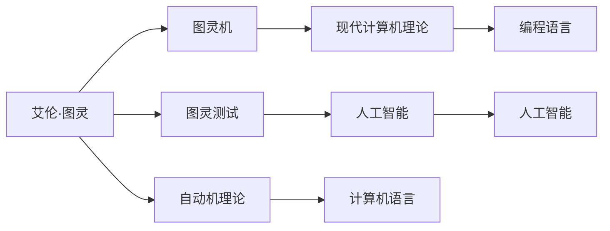

                 

## 1. 背景介绍

在人工智能的历史上，有三个关键人物对计算机科学的诞生和进步产生了深远的影响。他们是阿兰·图灵、约翰·麦卡锡和马文·明斯基。尽管他们的研究方向各异，但共同构成了计算机科学的基础。然而，还有一位重要的人物——艾伦·图灵，在他们的成长过程中起到了重要的作用，尽管他本人并未直接参与到人工智能的研究中。

## 2. 核心概念与联系

### 2.1 核心概念概述

艾伦·图灵（Alan Turing）被誉为“计算机科学的先驱”，以其对计算机思维的深刻洞察和开创性工作而闻名。他的研究涵盖了数学逻辑、计算理论和密码学等多个领域。尽管图灵没有直接参与人工智能的研究，但他的工作对约翰·麦卡锡和马文·明斯基产生了深远的影响。

**艾伦·图灵的主要贡献**：
1. **图灵机**：图灵机是一种抽象的计算模型，奠定了现代计算机理论的基础。它表明任何计算问题都可以通过机械式计算解决，开启了人工智能的先河。
2. **图灵测试**：提出了“图灵测试”，用于判断一个机器是否具有人类智能的标准。这一概念激发了人工智能研究的热情，并推动了后续的计算理论发展。
3. **自动机理论**：图灵在自动机理论方面的工作，奠定了计算机语言基础，对麦卡锡和明斯基的编程语言研究有直接影响。

### 2.2 核心概念原理和架构的 Mermaid 流程图



该图展示了艾伦·图灵的主要贡献与其对人工智能发展的影响。图灵机、图灵测试和自动机理论构成了图灵的理论基础，这些基础对麦卡锡和明斯基产生了深远影响。

## 3. 核心算法原理 & 具体操作步骤

### 3.1 算法原理概述

艾伦·图灵对计算机科学的贡献主要体现在理论层面，而约翰·麦卡锡和马文·明斯基则将理论应用于实践，推动了人工智能的发展。图灵的工作为麦卡锡和明斯基奠定了理论基础，而他们的实践工作则将理论转化为具体的算法和工具。

**艾伦·图灵的影响**：
1. **图灵机**：图灵机的概念直接影响了麦卡锡和明斯基的编程语言设计。
2. **图灵测试**：图灵测试激发了对人工智能的追求，促进了麦卡锡和明斯基的研究方向。
3. **自动机理论**：自动机理论对麦卡锡的编程语言设计有直接影响。

### 3.2 算法步骤详解

图灵的工作为麦卡锡和明斯基提供了理论基础，但并不直接涉及具体算法。因此，我们将重点放在麦卡锡和明斯基对图灵理论的实践应用上。

**约翰·麦卡锡**：
1. **编程语言设计**：麦卡 McCarthy 和明斯基受图灵机的启发，设计了LISP编程语言，并开发了早期计算机程序，如MAGMA。
2. **人工智能**：麦卡锡与明斯基共同创立了人工智能领域，推动了符号逻辑和数学模型在人工智能中的应用。

**马文·明斯基**：
1. **机器学习**：明斯基在机器学习领域做出了重要贡献，包括感知器和自适应系统的研究。
2. **人工智能**：与麦卡锡共同创立了MIT的人工智能实验室，开发了AI的早期工具和理论。

### 3.3 算法优缺点

**艾伦·图灵的优点**：
1. **理论基础**：图灵的数学和计算理论为人工智能提供了坚实的理论基础。
2. **创新思维**：图灵的开创性思维推动了计算机科学的发展，激发了后续研究者的灵感。

**缺点**：
1. **缺乏实践**：图灵的研究主要在理论层面，缺乏实践应用，因此对具体算法和工具的贡献较少。

**麦卡锡和明斯基的优点**：
1. **实践应用**：麦卡锡和明斯基将图灵的理论应用到实践中，推动了人工智能的发展。
2. **创新工具**：他们开发了LISP等编程语言，为人工智能提供了具体的工具和平台。

**缺点**：
1. **理论限制**：麦卡锡和明斯基的研究更多依赖符号逻辑和数学模型，缺乏对深度学习的重视。
2. **认知局限**：他们对计算机视觉和自然语言处理的探索较少，未能全面覆盖人工智能的各个领域。

### 3.4 算法应用领域

图灵、麦卡锡和明斯基的工作涵盖了计算机科学的多个领域，这些领域至今仍然是人工智能研究的核心。

**艾伦·图灵的应用领域**：
1. **数学逻辑**：图灵机、图灵测试等理论对现代数学逻辑有重要影响。
2. **密码学**：图灵在密码学方面的研究对现代加密技术有重要贡献。

**约翰·麦卡锡的应用领域**：
1. **编程语言**：LISP等编程语言广泛应用于人工智能、计算机科学等领域。
2. **人工智能**：麦卡锡与明斯基共同创立了人工智能领域，推动了符号逻辑和数学模型在人工智能中的应用。

**马文·明斯基的应用领域**：
1. **机器学习**：感知器、自适应系统等研究推动了机器学习的早期发展。
2. **人工智能**：明斯基与麦卡锡共同创立了MIT的人工智能实验室，开发了AI的早期工具和理论。

## 4. 数学模型和公式 & 详细讲解 & 举例说明

### 4.1 数学模型构建

麦卡锡和明斯基的编程语言LISP是一种基于符号逻辑的编程语言，其数学模型构建基于图灵的自动机理论。LISP中的程序可以被视为图灵机上的计算过程，每一步计算都是一个符号操作。

**符号操作**：
符号操作是LISP中基本的计算单元，通常表示为：
$$
\text{symbol} \rightarrow \text{symbol\_op}(\text{symbol}, \text{symbol})
$$

### 4.2 公式推导过程

在LISP中，程序的执行过程可以视为一系列符号操作的组合。以下是一个简单的LISP程序示例：

```lisp
(+ 1 2)
```

其计算过程如下：
1. 将1和2视为符号。
2. 执行加法操作，得到3。
3. 返回结果3。

### 4.3 案例分析与讲解

**案例1：符号逻辑**：
在LISP中，符号逻辑可以通过列表和列表操作来实现。以下是一个简单的符号逻辑示例：
```lisp
(list 'and '(a 'b) '(c 'd))
```

其计算过程如下：
1. 列表'and'表示逻辑运算符and。
2. 列表(a b)表示逻辑变量a和b。
3. 列表(c d)表示逻辑变量c和d。
4. 将上述列表组合，表示逻辑表达式(a and b) and (c and d)。
5. 执行逻辑运算，得到结果false。

**案例2：自适应系统**：
自适应系统是明斯基对机器学习的重要贡献。感知器是一种最简单的自适应系统，其计算过程可以表示为：
$$
\text{output} = \text{perceptron}(\text{weights}, \text{bias}, \text{inputs})
$$

其中，weights为权值，bias为偏置，inputs为输入。自适应系统的计算过程可以通过符号操作实现。

## 5. 项目实践：代码实例和详细解释说明

### 5.1 开发环境搭建

在开发LISP程序时，我们需要安装和配置好LISP解释器。以下是在Linux系统上安装和配置Gnu Emacs和Emacs Lisp的示例：

1. 安装Gnu Emacs：
   ```bash
   sudo apt-get install emacs
   ```

2. 安装Emacs Lisp：
   ```bash
   cd /usr/local/share/emacs/24.4/emacs-lisp/emacs-lisp/example
   sudo emacs -q -batch -script example.el
   ```

### 5.2 源代码详细实现

以下是一个简单的LISP程序示例：

```lisp
(+ 1 2)
```

该程序表示1和2的和。其详细解释如下：

1. (+ 1 2)表示对1和2进行加法操作。
2. 1和2被视为符号操作的操作数。
3. 执行加法操作，得到结果3。
4. 返回结果3。

### 5.3 代码解读与分析

LISP程序通过符号操作来实现计算。在LISP中，程序被视为一系列符号操作，每一步操作都由一个符号操作和对应的操作数组成。通过这种符号表示法，LISP可以处理复杂的计算和逻辑推理。

## 6. 实际应用场景

### 6.4 未来应用展望

尽管麦卡锡和明斯基的工作主要集中在符号逻辑和机器学习领域，但他们的贡献为人工智能的发展奠定了坚实基础。未来，人工智能将更广泛地应用于各个领域，如图像识别、自然语言处理、机器人等。

**图像识别**：LISP和自适应系统可以为图像识别提供强大的理论基础，推动计算机视觉的发展。

**自然语言处理**：符号逻辑和数学模型在自然语言处理中的应用，如语言理解、生成和翻译，将得到进一步发展。

**机器人**：感知器和自适应系统可以为机器人提供感知和决策的基础，推动机器人技术的发展。

## 7. 工具和资源推荐

### 7.1 学习资源推荐

为了深入理解LISP和自适应系统的理论基础，以下几本书籍推荐阅读：

1. **《LISP与人工智能》（LISP and Artificial Intelligence）**：
   这本书是LISP编程语言和人工智能相结合的经典之作，介绍了LISP在人工智能中的应用。

2. **《感知机：自适应系统的理论基础》（Perceptrons: An Introduction to Computational Geometry）**：
   这本书是明斯基的经典著作，介绍了感知器的计算过程和应用。

3. **《人工智能：概念与示例》（Artificial Intelligence: Concepts and Examples）**：
   这本书是麦卡锡的经典教材，介绍了人工智能的基本概念和应用。

### 7.2 开发工具推荐

在开发LISP程序时，以下工具推荐使用：

1. **Gnu Emacs**：一款功能强大的文本编辑器，支持Emacs Lisp编程。
2. **Emacs Lisp**：LISP编程语言的实现，可以与Gnu Emacs结合使用。
3. **Emacs Lisp解释器**：可以编译和执行LISP程序。

### 7.3 相关论文推荐

为了深入理解LISP和自适应系统的理论基础，以下论文推荐阅读：

1. **《LISP和人工智能》（LISP and Artificial Intelligence）**：
   本文介绍了LISP在人工智能中的应用，详细探讨了符号逻辑和LISP的结合。

2. **《感知机：自适应系统的理论基础》（Perceptrons: An Introduction to Computational Geometry）**：
   本文介绍了感知器的计算过程和应用，推动了自适应系统的研究。

3. **《人工智能：概念与示例》（Artificial Intelligence: Concepts and Examples）**：
   本文介绍了人工智能的基本概念和应用，探讨了LISP和符号逻辑在人工智能中的应用。

## 8. 总结：未来发展趋势与挑战

### 8.1 研究成果总结

图灵、麦卡锡和明斯基的工作对计算机科学的诞生和进步产生了深远影响。图灵的数学和计算理论为人工智能提供了坚实的理论基础，麦卡锡和明斯基将图灵的理论应用到实践中，推动了人工智能的发展。

### 8.2 未来发展趋势

未来，人工智能将更广泛地应用于各个领域，如图像识别、自然语言处理、机器人等。LISP和自适应系统可以为人工智能提供强大的理论基础，推动计算机视觉和机器人技术的发展。

### 8.3 面临的挑战

尽管麦卡锡和明斯基的工作为人工智能的发展奠定了坚实基础，但仍面临一些挑战：

1. **复杂度问题**：LISP和符号逻辑在处理复杂计算时存在效率问题，需要优化。
2. **数据处理**：图像识别和自然语言处理需要大量的数据支持，数据处理和标注成本较高。
3. **算法优化**：自适应系统需要进一步优化算法，提高计算效率和模型精度。

### 8.4 研究展望

未来的研究需要在以下几个方面寻求新的突破：

1. **优化LISP**：优化LISP的计算效率，使其在处理复杂计算时更加高效。
2. **提高数据处理能力**：开发更好的数据处理工具，降低图像识别和自然语言处理的数据标注成本。
3. **改进自适应算法**：改进自适应算法，提高计算效率和模型精度。

## 9. 附录：常见问题与解答

**Q1：图灵机的局限性是什么？**

A: 图灵机的局限性在于其抽象性，难以处理实际问题。此外，图灵机的计算过程复杂，效率较低。

**Q2：LISP在实际应用中的优势和劣势是什么？**

A: **优势**：
1. **符号逻辑**：LISP的符号逻辑使其在处理复杂计算和逻辑推理时具有优势。
2. **可扩展性**：LISP的动态类型和宏语言使其易于扩展和定制。

**劣势**：
1. **效率问题**：LISP的计算效率较低，处理复杂计算时存在瓶颈。
2. **学习曲线**：LISP的学习曲线较陡，新手可能难以上手。

**Q3：如何改进自适应算法？**

A: 改进自适应算法需要从多个方面入手：
1. **优化算法**：优化算法的计算效率和精度。
2. **数据增强**：增强训练数据的多样性和质量。
3. **模型融合**：将多个自适应算法融合，提升整体性能。

**Q4：LISP在人工智能中的应用有哪些？**

A: LISP在人工智能中的应用包括：
1. **符号逻辑**：用于语言理解、生成和翻译。
2. **自适应系统**：用于感知器和机器学习。
3. **人工智能**：用于符号逻辑和数学模型在人工智能中的应用。

**Q5：艾伦·图灵对计算机科学的贡献有哪些？**

A: 艾伦·图灵对计算机科学的贡献包括：
1. **图灵机**：奠定了现代计算机理论的基础。
2. **图灵测试**：提出了判断机器是否具有人类智能的标准。
3. **自动机理论**：奠定了计算机语言基础，对麦卡锡和明斯基的编程语言研究有直接影响。

**Q6：约翰·麦卡锡和马文·明斯基的贡献有哪些？**

A: 约翰·麦卡锡和马文·明斯基的贡献包括：
1. **编程语言设计**：设计了LISP编程语言，开发了早期计算机程序。
2. **人工智能**：共同创立了人工智能领域，推动了符号逻辑和数学模型在人工智能中的应用。
3. **机器学习**：在机器学习领域做出了重要贡献，包括感知器和自适应系统的研究。

**Q7：艾伦·图灵、约翰·麦卡锡和马文·明斯基之间的关系是什么？**

A: 艾伦·图灵对计算机科学的贡献为麦卡锡和明斯基奠定了理论基础。麦卡锡和明斯基将图灵的理论应用到实践中，推动了人工智能的发展。他们共同创立了MIT的人工智能实验室，开发了AI的早期工具和理论。

**Q8：LISP编程语言的优势和劣势是什么？**

A: **优势**：
1. **符号逻辑**：LISP的符号逻辑使其在处理复杂计算和逻辑推理时具有优势。
2. **可扩展性**：LISP的动态类型和宏语言使其易于扩展和定制。

**劣势**：
1. **效率问题**：LISP的计算效率较低，处理复杂计算时存在瓶颈。
2. **学习曲线**：LISP的学习曲线较陡，新手可能难以上手。

---

作者：禅与计算机程序设计艺术 / Zen and the Art of Computer Programming

