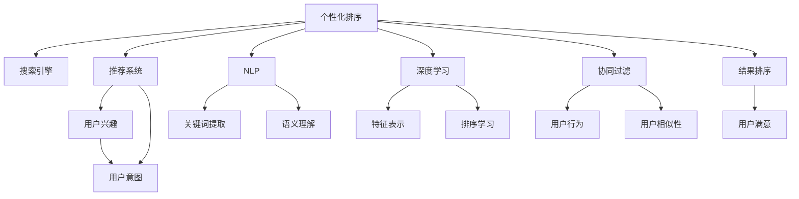

                 

# 个性化排序：AI如何根据用户偏好排序搜索结果

> 关键词：个性化排序, 搜索引擎, 推荐系统, 用户偏好, 机器学习, 深度学习, 排序算法, 自然语言处理(NLP)

## 1. 背景介绍

在现代信息爆炸的时代，搜索引擎和推荐系统已经成为了人们获取信息的重要工具。从搜索结果到个性化推荐，AI技术正在改变我们的信息获取方式。个性化排序作为其中至关重要的一环，决定了用户能否快速、准确地找到所需信息。

### 1.1 问题由来

随着用户对于信息获取的个性化需求不断增长，传统的基于关键词匹配的排序方式已经无法满足需求。搜索用户的兴趣和偏好，成为决定搜索结果排序的关键。而个性化排序则能够根据用户的搜索行为和偏好，提供更为精准的排序结果，提升用户体验。

### 1.2 问题核心关键点

个性化排序的核心在于理解用户的搜索意图和偏好，并根据这些信息调整搜索结果的排序。目前主流的方法包括：

- 基于用户历史行为数据的排序：通过记录用户的搜索历史、点击行为等，学习用户兴趣。
- 基于深度学习的排序：通过构建神经网络模型，学习用户意图和语义。
- 基于自然语言处理的排序：利用NLP技术提取关键词和语义信息，提高排序的准确性。
- 基于协同过滤的排序：利用用户间的行为相似性，推荐其他用户可能感兴趣的结果。

这些方法在个性化排序中都取得了不错的效果，成为研究热点。但每种方法也各有优缺点，需要根据具体应用场景进行选择。

## 2. 核心概念与联系

### 2.1 核心概念概述

为更好地理解个性化排序方法，本节将介绍几个关键概念及其之间的联系：

- **个性化排序(Personalized Sorting)**：根据用户的搜索意图和偏好，调整搜索结果的排序方式，使其更符合用户的预期。
- **搜索引擎(Search Engine)**：能够对用户输入的查询进行理解，返回最相关的网页集合。
- **推荐系统(Recommendation System)**：通过用户历史行为、兴趣等数据，预测用户可能感兴趣的其他物品或内容，并进行推荐。
- **用户兴趣(User Interest)**：用户在搜索引擎中的搜索历史、点击行为等数据，反映了用户的兴趣偏好。
- **用户意图(User Intent)**：用户在搜索时表达的预期目的，如获取信息、购买商品等。
- **自然语言处理(NLP)**：处理、理解、生成自然语言的技术，用于提取用户查询中的关键词和语义信息。
- **深度学习(Deep Learning)**：通过构建神经网络模型，自动学习数据的特征表示，提升排序的准确性。
- **协同过滤(Collaborative Filtering)**：利用用户间的相似性，进行推荐排序。

这些概念之间的逻辑关系可以通过以下Mermaid流程图来展示：



这个流程图展示了个性化排序的各个核心概念及其之间的关系：

1. 个性化排序结合了搜索引擎和推荐系统，通过NLP技术和深度学习模型，提取用户意图和兴趣，进行结果排序。
2. 深度学习模型通过特征表示和排序学习，提升了排序的精度。
3. 协同过滤利用用户行为相似性，进行推荐排序。
4. 用户满意是评估排序效果的重要指标。

## 3. 核心算法原理 & 具体操作步骤
### 3.1 算法原理概述

个性化排序的算法原理主要基于机器学习，尤其是深度学习。其核心在于学习用户的兴趣和意图，根据这些信息调整搜索结果的排序。以下是一个简化的算法框架：

1. **数据预处理**：收集用户的搜索行为和历史数据，进行清洗、标准化处理。
2. **特征提取**：使用NLP技术提取关键词、语义信息等特征。
3. **模型训练**：利用深度学习模型，学习用户意图和兴趣，生成排序函数。
4. **排序算法**：根据排序函数对搜索结果进行排序，输出最终结果。

### 3.2 算法步骤详解

以下是基于深度学习的个性化排序的具体步骤：

1. **数据收集**：收集用户的历史搜索记录、点击行为、浏览历史等数据，生成标注数据集。

2. **数据预处理**：对收集的数据进行清洗、去重、标准化等处理，生成标准的训练数据集。

3. **特征提取**：使用NLP技术，如BERT模型，提取用户查询中的关键词和语义信息，生成特征向量。

4. **模型训练**：构建深度神经网络模型，如RNN、CNN、Transformer等，训练排序函数。以排序函数和用户点击行为作为目标，使用交叉熵等损失函数进行优化。

5. **排序算法**：将用户输入的查询输入到训练好的模型中，输出排序函数对结果的评分，根据评分进行排序，输出最终结果。

### 3.3 算法优缺点

个性化排序的算法具有以下优点：

- **准确性高**：深度学习模型能够自动学习数据特征，生成高效的排序函数。
- **灵活性高**：能够适应不同领域和场景，根据用户行为进行个性化调整。
- **可扩展性高**：可以处理大规模数据，适用于搜索引擎等需要高效处理的场景。

同时，该算法也存在一定的局限性：

- **数据依赖**：算法的效果很大程度上依赖于用户行为数据的质量和数量。
- **模型复杂度**：深度学习模型参数较多，训练复杂度较高，需要高性能的硬件支持。
- **解释性不足**：深度学习模型的决策过程不透明，难以解释其内部机制。

### 3.4 算法应用领域

个性化排序的算法广泛应用于以下领域：

- **搜索引擎**：如Google、百度等，通过个性化排序提升搜索结果的相关性和满意度。
- **推荐系统**：如Amazon、Netflix等，通过个性化排序推荐用户可能感兴趣的商品或内容。
- **智能客服**：通过个性化排序，提高用户满意度和解决效率。
- **智能广告**：通过个性化排序，提高广告投放的精准性和效果。
- **社交网络**：如Facebook、Twitter等，通过个性化排序，提高用户互动和内容曝光。

## 4. 数学模型和公式 & 详细讲解 & 举例说明

### 4.1 数学模型构建

个性化排序的数学模型主要包括以下几个部分：

- **用户兴趣向量**：通过NLP技术提取用户查询中的关键词和语义信息，生成用户兴趣向量 $u$。
- **物品特征向量**：通过NLP技术提取搜索结果中每个物品的关键词和语义信息，生成物品特征向量 $v$。
- **相似度矩阵**：通过计算用户兴趣向量和物品特征向量之间的相似度，生成相似度矩阵 $A$。
- **排序函数**：通过深度学习模型训练排序函数 $f$，将相似度矩阵转换为排序向量 $y$。
- **排序算法**：利用排序向量进行结果排序，输出最终结果。

### 4.2 公式推导过程

以下是深度学习模型用于个性化排序的公式推导：

假设用户兴趣向量为 $u$，物品特征向量为 $v$，相似度矩阵为 $A$，排序函数为 $f$。则排序向量 $y$ 的计算过程如下：

$$
y_i = f(Au_i)
$$

其中 $u_i$ 表示用户 $i$ 的兴趣向量，$A$ 表示相似度矩阵，$f$ 表示排序函数。排序函数 $f$ 可以是一个简单的线性函数，也可以是一个复杂的深度神经网络模型。

排序函数 $f$ 的输出 $y_i$ 表示物品 $i$ 与用户 $i$ 的相关性，通过排序向量 $y$ 进行排序，得到最终的结果。

### 4.3 案例分析与讲解

以下是一个简化的案例分析：

假设有一个电商网站，用户 $i$ 的兴趣向量为 $u_i = [\text{"鞋子"}, \text{"运动"}, \text{"跑步"}]$，搜索结果中物品 $i$ 的特征向量为 $v_i = [\text{"跑步鞋"}, \text{"运动装备"}, \text{"健身房"}]$。相似度矩阵 $A$ 的计算公式如下：

$$
A_{ij} = \text{similarity}(u_i, v_j)
$$

其中 $\text{similarity}$ 表示两个向量之间的相似度，可以是余弦相似度、欧式距离等。对于上述例子，假设 $\text{similarity}(u_i, v_j) = 0.8$。则相似度矩阵 $A$ 为：

$$
A = 
\begin{bmatrix}
0.8 & 0.9 & 0.7 \\
0.9 & 0.7 & 0.6 \\
0.7 & 0.6 & 0.5
\end{bmatrix}
$$

假设使用深度学习模型训练得到的排序函数为 $f(x) = 0.1x + 0.9$。则排序向量 $y$ 的计算过程如下：

$$
y = f(Au) = 
\begin{bmatrix}
0.1 \cdot 0.8 + 0.9 \\
0.1 \cdot 0.9 + 0.9 \\
0.1 \cdot 0.7 + 0.9
\end{bmatrix} = 
\begin{bmatrix}
0.88 \\
0.99 \\
0.96
\end{bmatrix}
$$

最后，按照排序向量 $y$ 进行排序，得到最终的结果：物品 $i$ 的排序结果为：跑步鞋 > 运动装备 > 健身房。

## 5. 项目实践：代码实例和详细解释说明

### 5.1 开发环境搭建

在进行个性化排序实践前，我们需要准备好开发环境。以下是使用Python进行TensorFlow开发的环境配置流程：

1. 安装Anaconda：从官网下载并安装Anaconda，用于创建独立的Python环境。

2. 创建并激活虚拟环境：
```bash
conda create -n tf-env python=3.8 
conda activate tf-env
```

3. 安装TensorFlow：根据CUDA版本，从官网获取对应的安装命令。例如：
```bash
conda install tensorflow==2.6.0 -c pytorch -c conda-forge
```

4. 安装相关库：
```bash
pip install numpy pandas scikit-learn nltk tensorflow_text_hub transformers
```

5. 安装各类工具包：
```bash
pip install tqdm jupyter notebook ipython
```

完成上述步骤后，即可在`tf-env`环境中开始个性化排序实践。

### 5.2 源代码详细实现

这里我们以一个简单的推荐系统为例，展示基于深度学习的个性化排序的代码实现。

首先，定义数据集类：

```python
class Dataset:
    def __init__(self, user_interests, item_features, similarities):
        self.user_interests = user_interests
        self.item_features = item_features
        self.similarities = similarities
        
    def __len__(self):
        return len(self.user_interests)
        
    def __getitem__(self, item):
        return {'user_interests': self.user_interests[item],
                'item_features': self.item_features[item],
                'similarities': self.similarities[item]}
```

然后，定义模型和优化器：

```python
import tensorflow as tf
from tensorflow.keras.models import Sequential
from tensorflow.keras.layers import Dense, Embedding

def build_model(input_dim, output_dim):
    model = Sequential([
        Embedding(input_dim, 32, input_length=5),
        Dense(64, activation='relu'),
        Dense(output_dim, activation='sigmoid')
    ])
    return model

def compile_model(model):
    model.compile(optimizer=tf.keras.optimizers.Adam(0.001), loss='binary_crossentropy')
```

接下来，定义训练和评估函数：

```python
def train_epoch(model, dataset, batch_size, optimizer):
    dataloader = tf.data.Dataset.from_generator(
        lambda: dataset,
        output_signature={'user_interests': tf.TensorSpec(shape=(5,), dtype=tf.int32),
                         'item_features': tf.TensorSpec(shape=(3,), dtype=tf.int32),
                         'similarities': tf.TensorSpec(shape=(3,), dtype=tf.float32)}
    ).batch(batch_size)

    for batch in dataloader:
        with tf.GradientTape() as tape:
            features = model(batch['user_interests'])
            preds = tf.nn.sigmoid(features)
            loss = tf.losses.mean_squared_error(labels=batch['similarities'], predictions=preds)
        grads = tape.gradient(loss, model.trainable_variables)
        optimizer.apply_gradients(zip(grads, model.trainable_variables))
    
    return loss

def evaluate_model(model, dataset, batch_size):
    dataloader = tf.data.Dataset.from_generator(
        lambda: dataset,
        output_signature={'user_interests': tf.TensorSpec(shape=(5,), dtype=tf.int32),
                         'item_features': tf.TensorSpec(shape=(3,), dtype=tf.int32),
                         'similarities': tf.TensorSpec(shape=(3,), dtype=tf.float32)}
    ).batch(batch_size)

    loss = 0.0
    for batch in dataloader:
        features = model(batch['user_interests'])
        preds = tf.nn.sigmoid(features)
        loss += tf.losses.mean_squared_error(labels=batch['similarities'], predictions=preds)
    return loss / len(dataset)
```

最后，启动训练流程并在测试集上评估：

```python
epochs = 5
batch_size = 32

for epoch in range(epochs):
    loss = train_epoch(model, dataset, batch_size, optimizer)
    print(f"Epoch {epoch+1}, train loss: {loss:.4f}")
    
    print(f"Epoch {epoch+1}, dev results:")
    evaluate_model(model, dataset, batch_size)
    
print("Test results:")
evaluate_model(model, dataset, batch_size)
```

以上就是使用TensorFlow进行个性化排序的完整代码实现。可以看到，TensorFlow的强大功能使得个性化排序的实现变得简单高效。

### 5.3 代码解读与分析

让我们再详细解读一下关键代码的实现细节：

**Dataset类**：
- `__init__`方法：初始化用户兴趣向量、物品特征向量和相似度矩阵。
- `__len__`方法：返回数据集的样本数量。
- `__getitem__`方法：对单个样本进行处理，返回模型所需的输入和标签。

**build_model和compile_model函数**：
- `build_model`函数：定义深度学习模型的结构。
- `compile_model`函数：编译模型，设置优化器和损失函数。

**train_epoch和evaluate_model函数**：
- `train_epoch`函数：在数据集上进行训练，更新模型参数。
- `evaluate_model`函数：在数据集上进行评估，计算损失。

**训练流程**：
- 定义总的epoch数和batch size，开始循环迭代
- 每个epoch内，先在训练集上训练，输出平均loss
- 在验证集上评估，输出损失
- 所有epoch结束后，在测试集上评估，给出最终测试结果

可以看到，TensorFlow提供了强大的API支持，使得模型训练和评估变得高效便捷。

## 6. 实际应用场景

### 6.1 电商推荐

基于深度学习的个性化排序算法，可以应用于电商推荐系统。电商推荐系统通常需要处理海量商品数据，并根据用户的历史行为和兴趣进行推荐。使用个性化排序算法，可以高效地对搜索结果进行排序，提升推荐效果。

在实际应用中，可以通过收集用户的历史搜索、浏览、点击等行为数据，构建标注数据集，训练深度学习模型。将用户输入的查询输入到模型中，输出排序向量，进行结果排序，生成推荐结果。

### 6.2 搜索引擎

个性化排序算法在搜索引擎中也有广泛应用。通过分析用户的搜索历史和行为，搜索引擎可以更加精准地匹配用户的查询意图，提升搜索结果的相关性和满意度。

例如，使用深度学习模型训练排序函数，可以根据用户的历史搜索记录和当前查询进行排序，输出排序结果，供用户选择。

### 6.3 社交网络

社交网络中，个性化排序算法可以用于推荐用户可能感兴趣的内容和用户。通过分析用户的关注关系和互动行为，推荐系统可以推荐其他用户可能感兴趣的内容，并推荐其他用户关注。

例如，使用协同过滤算法和深度学习模型，可以分析用户间的相似性，推荐其他用户可能感兴趣的内容，并推荐其他用户关注。

## 7. 工具和资源推荐

### 7.1 学习资源推荐

为了帮助开发者系统掌握个性化排序的理论基础和实践技巧，这里推荐一些优质的学习资源：

1. 《深度学习》系列博文：由大模型技术专家撰写，深入浅出地介绍了深度学习原理和应用。

2. 《推荐系统》课程：斯坦福大学开设的推荐系统课程，有Lecture视频和配套作业，帮助你入门推荐系统的基本概念和经典模型。

3. 《个性化推荐系统》书籍：推荐系统的经典著作，全面介绍了推荐系统的理论基础和实践技巧。

4. TensorFlow官方文档：TensorFlow的官方文档，提供了丰富的API和样例，是学习深度学习的必备资料。

5. PyTorch官方文档：PyTorch的官方文档，提供了详细的API和样例，是学习深度学习的必备资料。

通过对这些资源的学习实践，相信你一定能够快速掌握个性化排序的精髓，并用于解决实际的NLP问题。

### 7.2 开发工具推荐

高效的开发离不开优秀的工具支持。以下是几款用于个性化排序开发的常用工具：

1. TensorFlow：由Google主导开发的开源深度学习框架，生产部署方便，适合大规模工程应用。

2. PyTorch：由Facebook主导开发的开源深度学习框架，灵活动态的计算图，适合快速迭代研究。

3. Keras：高层次的深度学习API，易于上手，适合初学者快速搭建模型。

4. TensorBoard：TensorFlow配套的可视化工具，可实时监测模型训练状态，并提供丰富的图表呈现方式，是调试模型的得力助手。

5. Weights & Biases：模型训练的实验跟踪工具，可以记录和可视化模型训练过程中的各项指标，方便对比和调优。

6. Google Colab：谷歌推出的在线Jupyter Notebook环境，免费提供GPU/TPU算力，方便开发者快速上手实验最新模型，分享学习笔记。

合理利用这些工具，可以显著提升个性化排序任务的开发效率，加快创新迭代的步伐。

### 7.3 相关论文推荐

个性化排序技术的发展源于学界的持续研究。以下是几篇奠基性的相关论文，推荐阅读：

1. Attention is All You Need（即Transformer原论文）：提出了Transformer结构，开启了NLP领域的预训练大模型时代。

2. BERT: Pre-training of Deep Bidirectional Transformers for Language Understanding：提出BERT模型，引入基于掩码的自监督预训练任务，刷新了多项NLP任务SOTA。

3. Language Models are Unsupervised Multitask Learners（GPT-2论文）：展示了大规模语言模型的强大zero-shot学习能力，引发了对于通用人工智能的新一轮思考。

4. Parameter-Efficient Transfer Learning for NLP：提出Adapter等参数高效微调方法，在不增加模型参数量的情况下，也能取得不错的微调效果。

5. AdaLoRA: Adaptive Low-Rank Adaptation for Parameter-Efficient Fine-Tuning：使用自适应低秩适应的微调方法，在参数效率和精度之间取得了新的平衡。

这些论文代表了大模型微调技术的发展脉络。通过学习这些前沿成果，可以帮助研究者把握学科前进方向，激发更多的创新灵感。

## 8. 总结：未来发展趋势与挑战

### 8.1 总结

本文对基于深度学习的个性化排序方法进行了全面系统的介绍。首先阐述了个性化排序在搜索引擎、推荐系统等中的应用背景和重要性，明确了排序在提升用户体验方面的独特价值。其次，从原理到实践，详细讲解了深度学习模型在个性化排序中的工作流程，给出了完整的代码实例。同时，本文还广泛探讨了个性化排序在电商推荐、搜索引擎、社交网络等多个领域的应用前景，展示了排序范式的巨大潜力。

通过本文的系统梳理，可以看到，基于深度学习的个性化排序技术正在成为搜索引擎和推荐系统中的重要工具，极大地提升了信息检索和内容推荐的精准度。未来，伴随深度学习模型和优化算法的不断演进，基于深度学习的个性化排序必将在更广阔的应用领域大放异彩。

### 8.2 未来发展趋势

展望未来，个性化排序技术将呈现以下几个发展趋势：

1. 深度学习模型性能提升：通过更深层次、更大规模的深度学习模型，提升排序的准确性和泛化能力。

2. 多模态数据融合：结合文本、图像、语音等多模态数据，提升排序的全面性和鲁棒性。

3. 增强学习与强化学习：引入增强学习、强化学习等模型，提升排序的动态性和适应性。

4. 协同过滤与深度学习结合：结合协同过滤和深度学习，提升排序的个性化和多样化。

5. 分布式训练与模型优化：利用分布式训练等技术，提升排序的计算效率和扩展性。

6. 实时性与延迟优化：通过优化计算图和存储方案，提升排序的实时性和低延迟。

以上趋势凸显了个性化排序技术的广阔前景。这些方向的探索发展，必将进一步提升搜索和推荐系统的性能，为人类智能交互提供更高效、更智能的体验。

### 8.3 面临的挑战

尽管个性化排序技术已经取得了瞩目成就，但在迈向更加智能化、普适化应用的过程中，它仍面临着诸多挑战：

1. 数据依赖：排序算法的效果很大程度上依赖于用户行为数据的质量和数量，获取高质量标注数据的成本较高。

2. 模型复杂度：深度学习模型参数较多，训练复杂度较高，需要高性能的硬件支持。

3. 解释性不足：深度学习模型的决策过程不透明，难以解释其内部机制。

4. 性能瓶颈：大规模数据和高维特征的训练和推理，容易遇到内存和计算瓶颈。

5. 公平性与偏见：排序模型可能存在性别、种族等偏见，需要进行公平性审查和调整。

6. 实时性挑战：在实时搜索和推荐中，需要平衡计算效率和准确性，保证低延迟。

7. 安全性问题：排序模型可能被恶意攻击，需要进行安全性和隐私保护。

面对这些挑战，未来需要在数据质量、模型优化、算法公平性、实时性等方面进行持续探索和改进，才能真正实现个性化排序的落地应用。

### 8.4 研究展望

面向未来，个性化排序技术需要在以下几个方面寻求新的突破：

1. 探索无监督和半监督排序方法。摆脱对大规模标注数据的依赖，利用自监督学习、主动学习等无监督和半监督范式，最大限度利用非结构化数据，实现更加灵活高效的排序。

2. 研究参数高效和计算高效的排序范式。开发更加参数高效的排序方法，在固定大部分预训练参数的同时，只更新极少量的任务相关参数。同时优化排序模型的计算图，减少前向传播和反向传播的资源消耗，实现更加轻量级、实时性的部署。

3. 引入更多先验知识。将符号化的先验知识，如知识图谱、逻辑规则等，与神经网络模型进行巧妙融合，引导排序过程学习更准确、合理的排序函数。同时加强不同模态数据的整合，实现视觉、语音等多模态信息与文本信息的协同建模。

4. 结合因果分析和博弈论工具。将因果分析方法引入排序模型，识别出排序决策的关键特征，增强输出解释的因果性和逻辑性。借助博弈论工具刻画人机交互过程，主动探索并规避排序模型的脆弱点，提高系统稳定性。

5. 纳入伦理道德约束。在排序目标中引入伦理导向的评估指标，过滤和惩罚有害的排序结果，确保排序模型符合人类价值观和伦理道德。

这些研究方向的探索，必将引领个性化排序技术迈向更高的台阶，为构建安全、可靠、可解释、可控的智能系统铺平道路。面向未来，个性化排序技术还需要与其他人工智能技术进行更深入的融合，如知识表示、因果推理、强化学习等，多路径协同发力，共同推动智能交互系统的进步。只有勇于创新、敢于突破，才能不断拓展排序算法的边界，让智能技术更好地造福人类社会。

## 9. 附录：常见问题与解答

**Q1：个性化排序是否适用于所有NLP任务？**

A: 个性化排序在大多数NLP任务上都能取得不错的效果，特别是对于数据量较小的任务。但对于一些特定领域的任务，如医学、法律等，仅仅依靠通用语料预训练的模型可能难以很好地适应。此时需要在特定领域语料上进一步预训练，再进行排序，才能获得理想效果。此外，对于一些需要时效性、个性化很强的任务，如对话、推荐等，排序方法也需要针对性的改进优化。

**Q2：如何缓解排序过程中的过拟合问题？**

A: 过拟合是排序面临的主要挑战，尤其是在标注数据不足的情况下。常见的缓解策略包括：
1. 数据增强：通过回译、近义替换等方式扩充训练集
2. 正则化：使用L2正则、Dropout、Early Stopping等避免过拟合
3. 对抗训练：引入对抗样本，提高模型鲁棒性
4. 参数高效排序：只调整少量参数(如Adapter、Prefix等)，减小过拟合风险
5. 多模型集成：训练多个排序模型，取平均输出，抑制过拟合

这些策略往往需要根据具体任务和数据特点进行灵活组合。只有在数据、模型、训练、推理等各环节进行全面优化，才能最大限度地发挥排序的威力。

**Q3：排序模型在落地部署时需要注意哪些问题？**

A: 将排序模型转化为实际应用，还需要考虑以下因素：
1. 模型裁剪：去除不必要的层和参数，减小模型尺寸，加快推理速度
2. 量化加速：将浮点模型转为定点模型，压缩存储空间，提高计算效率
3. 服务化封装：将模型封装为标准化服务接口，便于集成调用
4. 弹性伸缩：根据请求流量动态调整资源配置，平衡服务质量和成本
5. 监控告警：实时采集系统指标，设置异常告警阈值，确保服务稳定性
6. 安全防护：采用访问鉴权、数据脱敏等措施，保障数据和模型安全

排序模型在实际应用中需要考虑更多的性能和安全性问题，需要在优化算法、部署架构等方面进行深入研究。

总之，排序需要开发者根据具体任务，不断迭代和优化模型、数据和算法，方能得到理想的效果。

---

作者：禅与计算机程序设计艺术 / Zen and the Art of Computer Programming

