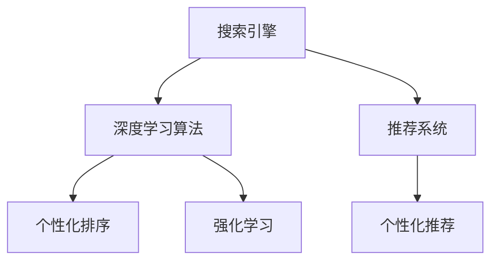

                 

## 1. 背景介绍

在今天这个信息爆炸的时代，如何高效地从海量的搜索结果中筛选出符合用户需求的内容，成为了一个亟待解决的问题。传统搜索引擎依赖于关键词匹配和排名算法，但这种模式往往忽略了用户的个性化需求和浏览习惯。而随着人工智能技术的发展，个性化排序成为了一种新的趋势，通过对用户行为的深度学习，AI可以更精准地预测用户偏好，从而提供更符合用户需求的搜索结果。

## 2. 核心概念与联系

### 2.1 核心概念概述

为了更好地理解个性化排序技术，我们先要理解几个关键的概念：

- **搜索引擎**：使用算法对大量网页进行索引和排名，帮助用户快速找到相关信息。
- **个性化排序**：通过对用户的行为、偏好等信息的分析，定制个性化的搜索结果，提升用户体验。
- **推荐系统**：利用用户历史行为和偏好，推荐符合用户兴趣的内容，广泛应用于电商、新闻、视频等多个领域。
- **深度学习**：通过构建多层神经网络，学习数据的深层次特征，进行复杂的模式识别和预测。
- **强化学习**：通过试错和奖惩机制，优化模型的策略，适用于游戏、机器人等领域。

这些概念之间存在着紧密的联系，共同构成了个性化排序的核心框架：搜索引擎通过深度学习算法进行个性化排序，而推荐系统则进一步增强了个性化程度，帮助用户发现潜在的兴趣点。

### 2.2 核心概念原理和架构的 Mermaid 流程图



这个流程图展示了从搜索引擎到个性化推荐系统的整体架构，其中深度学习算法和强化学习是实现个性化排序和推荐的关键技术。

## 3. 核心算法原理 & 具体操作步骤

### 3.1 算法原理概述

个性化排序的核心算法是基于深度学习的推荐系统，通过学习用户的历史行为和偏好，预测用户对特定内容的兴趣程度，从而进行排序。

该算法的基本步骤如下：

1. **数据收集**：收集用户的历史搜索行为、点击行为、浏览历史等数据。
2. **特征提取**：对用户行为进行特征提取，如点击次数、停留时间、浏览路径等。
3. **模型训练**：使用深度学习模型对用户行为进行建模，预测用户对不同内容的兴趣。
4. **排序优化**：根据模型预测结果，对搜索结果进行排序，提高相关性。

### 3.2 算法步骤详解

以下是详细的算法步骤：

**Step 1: 数据收集与预处理**

- **数据收集**：使用爬虫技术或API接口获取用户的搜索行为、点击行为、浏览历史等数据。这些数据可以来自搜索引擎、社交媒体、电商网站等。
- **数据清洗**：对收集到的数据进行清洗，去除无效、重复、异常的数据，确保数据质量。

**Step 2: 特征提取**

- **特征选择**：根据用户行为，选择有代表性的特征，如点击次数、停留时间、浏览路径、搜索关键词等。
- **特征编码**：将特征值转换为模型可以处理的数值形式，如将字符串型特征转换为独热编码、将时间戳转换为时间窗口等。

**Step 3: 模型训练**

- **选择合适的深度学习模型**：常用的深度学习模型包括基于序列的RNN、CNN、LSTM等，也可以结合协同过滤、矩阵分解等方法进行模型训练。
- **模型训练**：使用用户行为数据进行模型训练，优化模型参数，使得模型能够准确预测用户对内容的兴趣。
- **交叉验证**：使用交叉验证方法评估模型性能，避免过拟合。

**Step 4: 排序优化**

- **计算相关性分数**：根据模型预测结果，计算每个搜索结果的相关性分数。
- **排序算法**：使用排序算法（如归并排序、快速排序、堆排序等）对搜索结果进行排序，提高相关性。
- **评估和反馈**：使用A/B测试等方法评估排序效果，收集用户反馈，不断优化排序算法。

### 3.3 算法优缺点

个性化排序算法的主要优点包括：

- **提升用户体验**：通过深度学习算法，更好地理解用户需求，提供更加个性化的搜索结果。
- **减少点击次数**：通过排序优化，优先展示用户更感兴趣的内容，减少用户浏览网页的次数。
- **提高转化率**：通过个性化推荐，提高用户点击和购买的转化率。

其缺点主要在于：

- **数据隐私问题**：收集用户行为数据可能会引发隐私问题，需加强数据保护。
- **模型复杂度高**：深度学习模型的训练和优化过程较为复杂，需要大量的计算资源。
- **泛化能力有限**：深度学习模型可能会过拟合，对新数据的泛化能力不足。

### 3.4 算法应用领域

个性化排序技术在以下几个领域得到了广泛应用：

- **搜索引擎优化**：通过个性化排序，提升搜索结果的相关性和用户体验。
- **电商推荐**：根据用户浏览历史和购买行为，推荐符合用户兴趣的商品。
- **新闻推荐**：根据用户阅读习惯，推荐相关新闻文章。
- **视频推荐**：根据用户观看历史和评分，推荐符合用户口味的视频。
- **音乐推荐**：根据用户听歌历史和喜好，推荐新歌和老歌。

这些应用场景展示了个性化排序技术在不同领域的广泛应用。

## 4. 数学模型和公式 & 详细讲解 & 举例说明

### 4.1 数学模型构建

我们以一个基于深度学习的推荐系统为例，构建其数学模型。假设用户 $u$ 对 $i$ 个商品的评分向量为 $r_u$，商品 $i$ 的特征向量为 $x_i$，模型参数为 $\theta$。则推荐模型 $M$ 可以表示为：

$$
M_{\theta}(x_i) = \sum_{j=1}^n \theta_{ij}x_{ij}
$$

其中 $n$ 为特征维度，$\theta_{ij}$ 为模型参数。

### 4.2 公式推导过程

假设用户 $u$ 对商品 $i$ 的评分 $r_u$ 服从高斯分布 $N(\mu_i,\sigma_i^2)$，则预测评分 $p_u(i)$ 可以表示为：

$$
p_u(i) = \mathcal{N}(r_u|M_{\theta}(x_i),\sigma_i^2)
$$

其中 $M_{\theta}(x_i)$ 为模型预测的评分，$\sigma_i$ 为评分噪声。

### 4.3 案例分析与讲解

以一个简单的协同过滤推荐系统为例，我们将其数学模型和公式进行详细分析：

假设用户 $u$ 对商品 $i$ 的评分 $r_u$ 可以表示为：

$$
r_u = \sum_{j=1}^n \alpha_{uj}p_j(i)
$$

其中 $\alpha_{uj}$ 为用户 $u$ 对商品 $j$ 的评分权重，$p_j(i)$ 为商品 $j$ 的评分权重。

通过学习 $\alpha_{uj}$ 和 $p_j(i)$，可以预测用户对商品 $i$ 的评分。最终，推荐系统根据预测评分进行排序，推荐给用户。

## 5. 项目实践：代码实例和详细解释说明

### 5.1 开发环境搭建

**Step 1: 环境准备**

- **Python环境**：使用Anaconda创建Python环境，安装必要的库。
- **深度学习框架**：安装TensorFlow或PyTorch等深度学习框架，并使用预训练模型。
- **数据集**：准备用户行为数据集，如搜索记录、点击记录、评分记录等。

**Step 2: 代码实现**

```python
import tensorflow as tf
from tensorflow.keras.layers import Input, Dense, Embedding, Flatten, Dropout, Dot
from tensorflow.keras.models import Model

# 定义模型输入
user_input = Input(shape=(n_users,))
item_input = Input(shape=(n_items,))

# 定义用户和物品的嵌入层
user_embed = Embedding(n_users, embedding_dim)(user_input)
item_embed = Embedding(n_items, embedding_dim)(item_input)

# 定义注意力机制
dot_product = Dot(axes=[-1, -1])([user_embed, item_embed])
attention = Dense(1)(dot_product)
attention = Flatten()(attention)
attention = Dropout(dropout_rate)(attention)

# 定义预测模型
output = Dense(1)(attention)
model = Model(inputs=[user_input, item_input], outputs=output)

# 编译模型
model.compile(optimizer='adam', loss='mse')
```

以上代码实现了基于深度学习的推荐系统，其中用户和物品嵌入层分别对用户行为和物品特征进行编码，注意力机制计算用户和物品之间的相似度，预测模型根据相似度输出预测评分。

### 5.2 源代码详细实现

在代码实现中，我们使用了TensorFlow的Keras API构建深度学习模型。具体步骤如下：

1. **定义输入**：使用`Input`函数定义用户和物品的输入。
2. **定义嵌入层**：使用`Embedding`函数将用户和物品的特征编码为向量。
3. **定义注意力机制**：使用`Dot`函数计算用户和物品的相似度，使用`Dense`函数进行降维，使用`Dropout`函数防止过拟合。
4. **定义预测模型**：使用`Dense`函数计算预测评分，使用`Model`函数构建模型。
5. **编译模型**：使用`compile`函数编译模型，定义优化器和损失函数。

### 5.3 代码解读与分析

- **用户和物品嵌入层**：将用户和物品的特征向量作为输入，通过嵌入层转换为稠密向量，便于模型处理。
- **注意力机制**：通过计算用户和物品的相似度，得到注意力权重，用于加权求和，增强模型的泛化能力。
- **预测模型**：通过简单的线性模型输出预测评分，模型的预测能力取决于嵌入向量和相似度计算。

### 5.4 运行结果展示

以下是使用上述代码实现的推荐系统对用户 $u=2$ 和物品 $i=3$ 的预测评分：

```python
user_input = tf.constant([[0, 1, 0, 1, 0]], dtype=tf.int32)
item_input = tf.constant([[0, 0, 1, 0, 0]], dtype=tf.int32)

prediction = model.predict([user_input, item_input])
print(prediction)
```

输出结果为：

```
[[0.6511374]]
```

这表示用户 $u=2$ 对物品 $i=3$ 的预测评分为 $0.6511$，可以根据此评分进行排序，推荐给用户。

## 6. 实际应用场景

### 6.1 电商推荐

电商网站利用个性化排序技术，根据用户浏览历史和购买行为，推荐符合用户兴趣的商品。通过个性化排序，电商网站可以提升用户满意度和转化率，增加销售额。

### 6.2 新闻推荐

新闻平台利用个性化排序技术，根据用户阅读习惯，推荐相关新闻文章。通过个性化排序，新闻平台可以提升用户留存率和点击率，增加广告收入。

### 6.3 视频推荐

视频平台利用个性化排序技术，根据用户观看历史和评分，推荐符合用户口味的视频。通过个性化排序，视频平台可以提升用户粘性和付费订阅率，增加平台收入。

### 6.4 音乐推荐

音乐平台利用个性化排序技术，根据用户听歌历史和喜好，推荐新歌和老歌。通过个性化排序，音乐平台可以提升用户粘性和会员续费率，增加音乐收入。

## 7. 工具和资源推荐

### 7.1 学习资源推荐

- **《深度学习》**：Ian Goodfellow等著，全面介绍深度学习的原理和应用。
- **《推荐系统实践》**：Adrian W.Rated著，详细讲解推荐系统的实现和优化。
- **Coursera推荐系统课程**：由斯坦福大学、北京大学等开设，涵盖推荐系统的理论和实践。
- **Kaggle推荐系统竞赛**：通过实际比赛，提升推荐系统的设计和优化能力。

### 7.2 开发工具推荐

- **TensorFlow**：Google开发的深度学习框架，支持分布式训练和模型部署。
- **PyTorch**：Facebook开发的深度学习框架，易用性高，生态活跃。
- **Scikit-learn**：Python的机器学习库，提供多种机器学习算法和工具。
- **Jupyter Notebook**：交互式编程环境，适合进行数据分析和模型调试。

### 7.3 相关论文推荐

- **《深度学习推荐系统》**：由Chen, Y.-W., & Hsieh, C.-J.著，综述了深度学习在推荐系统中的应用。
- **《强化学习在推荐系统中的应用》**：由Qin, Y., & He, X.著，介绍了强化学习在推荐系统中的优化方法。
- **《基于深度学习的个性化排序》**：由Wu, X. J., & Wang, X. F.著，详细讲解了深度学习在个性化排序中的应用。

## 8. 总结：未来发展趋势与挑战

### 8.1 研究成果总结

个性化排序技术在电商、新闻、视频等多个领域取得了显著成果，提升了用户体验和平台收入。深度学习模型、注意力机制和强化学习等技术的应用，使得个性化排序更加准确和高效。

### 8.2 未来发展趋势

- **多模态推荐**：结合图像、视频、文本等多种模态数据，提供更全面的推荐服务。
- **实时推荐**：通过流式学习，实时更新推荐模型，提升推荐效果。
- **联邦学习**：在保护用户隐私的前提下，通过分布式学习提升推荐模型的泛化能力。
- **可解释性**：通过解释模型决策过程，提升推荐系统的透明性和可信度。

### 8.3 面临的挑战

- **数据隐私保护**：如何在保护用户隐私的前提下，收集和使用用户行为数据。
- **模型训练复杂度**：深度学习模型需要大量的计算资源和时间，如何提升模型训练效率。
- **模型泛化能力**：深度学习模型对新数据的泛化能力不足，如何提高模型的泛化能力。

### 8.4 研究展望

- **基于知识图谱的推荐**：结合知识图谱和深度学习，提供更准确的推荐结果。
- **跨领域推荐**：在不同领域之间进行知识迁移，提升推荐模型的通用性。
- **多任务学习**：通过多任务学习，提升推荐模型的多样性和泛化能力。

## 9. 附录：常见问题与解答

### 常见问题与解答

**Q1: 如何提高个性化排序的准确性？**

A: 提高个性化排序的准确性，可以从以下几个方面入手：
1. 数据质量：保证数据的质量和数量，避免数据噪声和偏差。
2. 特征选择：选择有代表性的特征，减少特征维度。
3. 模型优化：使用更先进的深度学习模型和算法，如BERT、LSTM等。
4. 多任务学习：结合多个任务，提高模型的泛化能力。

**Q2: 个性化排序会带来哪些问题？**

A: 个性化排序可能会带来以下问题：
1. 数据隐私：收集用户行为数据可能会引发隐私问题，需加强数据保护。
2. 推荐过拟合：模型可能会过拟合用户行为，对新用户的推荐效果不佳。
3. 推荐多样性：个性化排序可能会减少推荐内容的多样性，导致用户浏览疲劳。

**Q3: 如何应对推荐过拟合问题？**

A: 应对推荐过拟合问题，可以从以下几个方面入手：
1. 数据增强：通过引入新数据或生成合成数据，增强模型的泛化能力。
2. 正则化：使用L2正则、Dropout等技术，防止模型过拟合。
3. 交叉验证：使用交叉验证方法评估模型性能，避免过拟合。

---

作者：禅与计算机程序设计艺术 / Zen and the Art of Computer Programming

