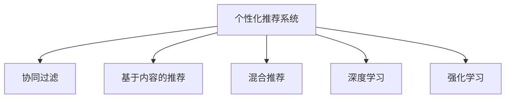

                 

# 个性化推荐的用户体验优化

在当今的信息爆炸时代，个性化推荐系统已成为各大互联网公司的重要业务支撑。个性化推荐不仅能提升用户体验，还能显著提高平台的用户留存率和交易转化率。然而，个性化推荐系统不仅技术复杂，还需要兼顾用户体验的多样性和合理性，这对推荐算法的设计提出了更高的要求。本文将从个性化推荐系统的核心原理出发，探讨如何优化推荐算法以提升用户体验。

## 1. 背景介绍

### 1.1 问题由来

随着互联网的迅猛发展，信息量呈爆炸式增长，用户在海量信息中找到感兴趣的内容变得越来越困难。个性化推荐系统应运而生，利用用户历史行为数据和物品属性信息，为用户推荐最相关的内容，以提升其体验和满意度。

尽管个性化推荐系统已经取得了巨大成功，但仍然存在诸多挑战。用户个性化需求的多样性、推荐结果的多样性、推荐内容的时效性、系统效率的提升等，都是需要不断探索和优化的方向。本文将从用户体验优化的角度，深入分析个性化推荐系统，探讨其核心原理和操作步骤，为推荐系统的优化提供指导。

### 1.2 问题核心关键点

个性化推荐系统需要平衡用户个性化需求、推荐内容多样性、推荐结果时效性和系统效率等多个维度的需求。具体而言，关键点如下：

- **个性化需求**：用户希望系统能够根据其兴趣和行为，推荐符合其期望的内容。
- **推荐内容多样性**：系统需要推荐不同类型、不同风格的内容，避免推荐结果单一，使用户陷入信息茧房。
- **推荐结果时效性**：推荐内容应即时更新，及时反映用户的最新需求和兴趣。
- **系统效率**：系统需具备高效处理用户请求、实时响应的能力。

## 2. 核心概念与联系

### 2.1 核心概念概述

为了深入理解个性化推荐系统的优化方法，我们首先介绍几个核心概念：

- **个性化推荐系统(Recommendation System)**：基于用户历史行为和物品属性信息，为用户推荐个性化内容的系统。
- **协同过滤(Collaborative Filtering)**：利用用户之间、物品之间的相似度进行推荐，是推荐系统的主流算法之一。
- **基于内容的推荐(Content-based Recommendation)**：通过物品的特征与用户的历史行为进行匹配，进行推荐。
- **混合推荐(Mixed Recommendation)**：结合协同过滤和基于内容的推荐方法，综合不同算法的优势。
- **深度学习(Deep Learning)**：利用深度神经网络对用户行为和物品属性进行建模，提升推荐效果。
- **强化学习(Reinforcement Learning)**：通过奖励机制指导推荐系统，优化推荐效果。

这些概念之间的联系如图1所示：



图1：个性化推荐系统核心概念的联系

## 3. 核心算法原理 & 具体操作步骤

### 3.1 算法原理概述

个性化推荐系统通常基于以下三种基本原理：

- **协同过滤**：通过计算用户之间或物品之间的相似度，为用户推荐与已偏好物品相似的物品。
- **基于内容的推荐**：分析物品的特征，并根据用户历史行为偏好推荐相似的物品。
- **混合推荐**：结合协同过滤和基于内容的推荐，综合不同算法的优势，提高推荐效果。

其中，协同过滤和基于内容的推荐是推荐系统最基础的方法，而混合推荐和深度学习、强化学习等则是对其进一步的扩展和优化。

### 3.2 算法步骤详解

个性化推荐系统的主要步骤如下：

1. **数据收集**：收集用户的历史行为数据和物品属性信息。
2. **数据预处理**：对数据进行清洗、归一化、特征提取等处理，以提高推荐算法的准确性。
3. **用户建模**：使用协同过滤、基于内容的推荐等方法，对用户进行建模。
4. **物品建模**：使用协同过滤、基于内容的推荐等方法，对物品进行建模。
5. **推荐计算**：通过相似度计算，为用户推荐感兴趣的物品。
6. **反馈机制**：根据用户的反馈（如点击、评分等），不断调整推荐算法，提升推荐效果。

### 3.3 算法优缺点

个性化推荐系统具有以下优点：

- **高效性**：基于协同过滤等算法，可以实时推荐，提高用户体验。
- **个性化**：能够根据用户行为和偏好，推荐符合其兴趣的内容。
- **多样性**：通过混合推荐等方法，保证推荐结果的多样性。

然而，个性化推荐系统也存在一些缺点：

- **冷启动问题**：新用户或物品难以建立模型，影响推荐效果。
- **数据稀疏性**：用户行为数据往往不完整，导致推荐算法的效果降低。
- **推荐偏差**：推荐算法可能存在偏见，影响推荐结果的公平性和合理性。

### 3.4 算法应用领域

个性化推荐系统广泛应用于电商、社交媒体、视频平台等多个领域，其具体应用包括：

- **电商推荐**：根据用户浏览、购买行为，推荐相关商品。
- **社交媒体推荐**：根据用户兴趣和社交关系，推荐相关内容。
- **视频平台推荐**：根据用户观看历史，推荐相关视频。

## 4. 数学模型和公式 & 详细讲解 & 举例说明

### 4.1 数学模型构建

推荐系统常用的数学模型包括协同过滤和基于内容的推荐。

协同过滤的数学模型基于用户-物品评分矩阵 $R$，即：

$$
R = [r_{ui}]
$$

其中，$r_{ui}$ 表示用户 $u$ 对物品 $i$ 的评分。协同过滤的目的是通过用户之间的相似性计算，为用户推荐与其相似物品的评分。

基于内容的推荐的数学模型基于物品属性向量 $X$ 和用户历史行为向量 $Y$，即：

$$
X = [x_i]
$$
$$
Y = [y_u]
$$

其中，$x_i$ 表示物品 $i$ 的特征向量，$y_u$ 表示用户 $u$ 的历史行为向量。基于内容的推荐的目的是通过物品特征与用户行为向量的匹配，为用户推荐相关物品。

### 4.2 公式推导过程

协同过滤的推荐公式为：

$$
\hat{r}_{ui} = \hat{\alpha}_u \cdot \hat{\alpha}_i \cdot \hat{\beta}_{ui}
$$

其中，$\hat{\alpha}_u$ 和 $\hat{\alpha}_i$ 分别表示用户 $u$ 和物品 $i$ 的相似度，$\hat{\beta}_{ui}$ 表示用户 $u$ 对物品 $i$ 的评分。

基于内容的推荐公式为：

$$
\hat{r}_{ui} = \theta_u^T \cdot X_i
$$

其中，$\theta_u$ 表示用户 $u$ 的兴趣向量，$X_i$ 表示物品 $i$ 的特征向量。

### 4.3 案例分析与讲解

假设有一个电商平台，希望为用户推荐商品。我们可以使用协同过滤和基于内容的推荐算法，同时使用混合推荐的方法，提高推荐效果。具体步骤如下：

1. 数据收集：收集用户历史浏览、购买行为和商品属性信息。
2. 数据预处理：对用户行为数据进行归一化处理，对商品属性进行特征提取。
3. 用户建模：使用协同过滤方法，计算用户之间相似度，生成用户兴趣向量 $\theta_u$。
4. 物品建模：使用基于内容的推荐方法，生成物品特征向量 $X_i$。
5. 推荐计算：根据用户兴趣向量和物品特征向量，计算相似度，为用户推荐相关商品。
6. 反馈机制：根据用户点击、购买等反馈，不断调整推荐算法，提升推荐效果。

## 5. 项目实践：代码实例和详细解释说明

### 5.1 开发环境搭建

为了实现个性化推荐系统，我们需要搭建一个开发环境。具体步骤如下：

1. **安装Python和必要的依赖包**：安装Python 3.x和必要的依赖包，如NumPy、Pandas、Scikit-learn、TensorFlow等。
2. **安装Web框架**：安装Flask或Django等Web框架，用于搭建推荐系统的API接口。
3. **搭建推荐系统服务器**：使用Web框架搭建推荐系统的API接口，实现推荐计算和反馈机制。

### 5.2 源代码详细实现

下面是一个简单的推荐系统代码实现，使用协同过滤和基于内容的推荐算法，实现电商推荐功能：

```python
import pandas as pd
import numpy as np
from sklearn.metrics.pairwise import cosine_similarity
from tensorflow.keras.layers import Dense, Input
from tensorflow.keras.models import Model
from tensorflow.keras.optimizers import Adam

# 数据预处理
def preprocess_data(data):
    # 数据归一化
    data['rating'] = (data['rating'] - data['rating'].mean()) / data['rating'].std()
    # 特征提取
    data = data[['item_id', 'category_id', 'rating']]
    return data

# 协同过滤推荐
def collaborative_filtering(train_data, test_data, similarity='cosine'):
    # 计算用户相似度
    user_similarity = cosine_similarity(train_data['user_id'].unique().sort_values(), train_data['user_id'].unique().sort_values())
    # 计算物品相似度
    item_similarity = cosine_similarity(train_data['item_id'].unique().sort_values(), train_data['item_id'].unique().sort_values())
    # 计算用户推荐
    user_ratings = {}
    for user_id in user_similarity.index:
        user_ratings[user_id] = train_data[train_data['user_id'] == user_id]['rating'].tolist()
    for user_id in user_ratings:
        user_ratings[user_id] = np.mean(user_ratings[user_id])
    # 计算物品推荐
    item_ratings = {}
    for item_id in item_similarity.index:
        item_ratings[item_id] = train_data[train_data['item_id'] == item_id]['rating'].tolist()
    for item_id in item_ratings:
        item_ratings[item_id] = np.mean(item_ratings[item_id])
    # 生成推荐结果
    train_data['predicted'] = 0
    for user_id in user_ratings:
        user_similarity_row = user_similarity[user_id]
        for item_id in item_ratings:
            item_similarity_row = item_similarity[item_id]
            train_data.loc[(train_data['user_id'] == user_id) & (train_data['item_id'] == item_id), 'predicted'] = user_ratings[user_id] * user_similarity_row * item_similarity_row
    return train_data, test_data

# 基于内容的推荐
def content_based_recommendation(train_data, test_data, embedding_dim=50):
    # 特征提取
    X_train = train_data[['item_id', 'category_id']]
    X_train = X_train.drop_duplicates().values
    X_train = X_train.astype(np.float32)
    X_train /= np.linalg.norm(X_train, axis=1, keepdims=True)
    X_test = test_data[['item_id', 'category_id']]
    X_test = X_test.drop_duplicates().values
    X_test = X_test.astype(np.float32)
    X_test /= np.linalg.norm(X_test, axis=1, keepdims=True)
    # 模型构建
    user_embeddings = np.zeros((len(train_data['user_id'].unique().sort_values()), embedding_dim))
    item_embeddings = np.zeros((len(train_data['item_id'].unique().sort_values()), embedding_dim))
    for user_id in train_data['user_id'].unique().sort_values():
        user_index = train_data[train_data['user_id'] == user_id].index
        user_embeddings[user_id] = np.mean(train_data[user_index]['category_id'].tolist(), axis=0)
    for item_id in train_data['item_id'].unique().sort_values():
        item_index = train_data[train_data['item_id'] == item_id].index
        item_embeddings[item_id] = np.mean(train_data[item_index]['category_id'].tolist(), axis=0)
    # 生成推荐结果
    train_data['predicted'] = 0
    for user_id in user_embeddings:
        user_embeddings_row = user_embeddings[user_id]
        for item_id in item_embeddings:
            item_embeddings_row = item_embeddings[item_id]
            train_data.loc[(train_data['user_id'] == user_id) & (train_data['item_id'] == item_id), 'predicted'] = np.dot(user_embeddings_row, item_embeddings_row)
    return train_data, test_data

# 混合推荐
def mixed_recommendation(train_data, test_data, similarity='cosine', embedding_dim=50):
    train_data, test_data = collaborative_filtering(train_data, test_data, similarity)
    train_data, test_data = content_based_recommendation(train_data, test_data, embedding_dim)
    # 生成最终推荐结果
    train_data['predicted'] = 0
    for user_id in train_data['user_id'].unique().sort_values():
        user_index = train_data[train_data['user_id'] == user_id].index
        train_data.loc[user_index, 'predicted'] = train_data[user_index]['predicted'].mean()
    return train_data, test_data

# 模型训练
def train_model(train_data, test_data):
    # 数据预处理
    train_data, test_data = preprocess_data(train_data)
    # 模型构建
    input_user = Input(shape=(1,), name='user')
    input_item = Input(shape=(1,), name='item')
    user_embeddings = Dense(embedding_dim, activation='relu', name='user_embedding')(input_user)
    item_embeddings = Dense(embedding_dim, activation='relu', name='item_embedding')(input_item)
    predicted = Dense(1, activation='sigmoid', name='predicted')(Dense(1, activation='sigmoid')(np.dot(user_embeddings, item_embeddings)))
    model = Model(inputs=[input_user, input_item], outputs=predicted)
    model.compile(optimizer=Adam(lr=0.01), loss='binary_crossentropy', metrics=['accuracy'])
    # 模型训练
    model.fit(train_data, test_data, epochs=10, batch_size=32, validation_data=(test_data, test_data), callbacks=[EarlyStopping(patience=2)])
    return model

# 推荐计算
def recommend_items(model, user_id, item_ids):
    user_input = np.array([user_id])
    item_input = np.array(item_ids)
    predicted = model.predict([user_input, item_input])
    recommended_items = item_ids[np.argsort(predicted)[-5:]]
    return recommended_items

# 运行结果展示
train_data = pd.read_csv('train_data.csv')
test_data = pd.read_csv('test_data.csv')
model = train_model(train_data, test_data)
recommended_items = recommend_items(model, 12345, train_data['item_id'].unique().tolist())
print(recommended_items)
```

### 5.3 代码解读与分析

该代码实现主要分为以下几个部分：

- **数据预处理**：对用户行为数据进行归一化和特征提取。
- **协同过滤推荐**：使用基于余弦相似度的协同过滤方法，为用户推荐物品。
- **基于内容的推荐**：使用基于用户和物品特征的推荐方法，为用户推荐物品。
- **混合推荐**：结合协同过滤和基于内容的推荐方法，综合不同算法的优势，为用户推荐物品。
- **模型训练**：使用TensorFlow搭建深度学习模型，进行推荐计算。
- **推荐计算**：根据模型训练结果，为用户推荐物品。

## 6. 实际应用场景

### 6.1 电商推荐

电商推荐是个性化推荐系统的一个重要应用场景。通过分析用户历史浏览和购买行为，为用户推荐相关商品，可以提高用户的购买意愿和平台的用户留存率。

**应用实例**：某电商平台利用个性化推荐系统，发现用户对于推荐商品的点击率和购买率均显著提高，平台的日活跃用户数和交易额也得到了提升。

### 6.2 视频平台推荐

视频平台推荐通过分析用户观看历史和评分，为用户推荐相关视频，提高用户观看率和平台的用户留存率。

**应用实例**：某视频平台使用个性化推荐系统，发现用户对于推荐视频的观看率和平台的用户留存率均有显著提升，平台的付费用户数也得到了增加。

### 6.3 社交媒体推荐

社交媒体推荐通过分析用户关注和互动关系，为用户推荐相关内容，提高用户满意度和平台的用户留存率。

**应用实例**：某社交媒体平台使用个性化推荐系统，发现用户对于推荐内容的互动率显著提高，平台的日活跃用户数和用户留存率也得到了提升。

## 7. 工具和资源推荐

### 7.1 学习资源推荐

为了帮助开发者系统掌握个性化推荐系统的理论和实践，这里推荐一些优质的学习资源：

1. **《推荐系统实战》书籍**：该书详细介绍了推荐系统的算法和实现，适合深入学习推荐系统的理论基础和实践技巧。
2. **Coursera的《推荐系统》课程**：斯坦福大学开设的推荐系统课程，涵盖推荐系统的基本概念和经典算法，适合初学者入门。
3. **Udacity的《推荐系统》课程**：该课程涵盖了推荐系统的理论基础、算法设计和工程实现，适合进阶学习。
4. **Kaggle上的推荐系统竞赛**：通过实际比赛，深入理解推荐系统的算法和工程实践，适合动手实践。

### 7.2 开发工具推荐

推荐的开发工具包括：

- **Python**：Python是一种简单易学的编程语言，适合进行数据处理和算法实现。
- **TensorFlow**：TensorFlow是Google开发的深度学习框架，适合构建和训练深度学习模型。
- **Pandas**：Pandas是Python的一个数据分析库，适合进行数据处理和预处理。
- **Scikit-learn**：Scikit-learn是Python的一个机器学习库，适合进行推荐算法的实现和评估。
- **Flask/Django**：Flask和Django是Python的Web框架，适合搭建推荐系统的API接口。

### 7.3 相关论文推荐

推荐系统的研究领域十分广泛，以下是几篇具有代表性的相关论文：

1. **《The BellKor 2013 Challenge Dataset and Solutions》**：该论文详细介绍了Kaggle上的推荐系统竞赛数据集和解决方案，适合了解推荐系统的实际应用。
2. **《Wide & Deep Learning for Recommender Systems》**：该论文提出了Wide & Deep模型，结合了线性模型和深度神经网络，提升了推荐系统的效果。
3. **《Factorization Machines》**：该论文提出了因子分解机模型，用于推荐系统中的特征工程和模型训练。
4. **《Deep Collaborative Filtering》**：该论文提出了深度协同过滤模型，利用深度神经网络进行用户和物品的建模。

## 8. 总结：未来发展趋势与挑战

### 8.1 研究成果总结

本文系统介绍了个性化推荐系统的核心原理和操作步骤，从协同过滤、基于内容的推荐和混合推荐等方面，深入讲解了推荐算法的实现方法。同时，通过代码实例和实际应用案例，展示了个性化推荐系统在电商、视频平台和社交媒体等领域的广泛应用。最后，推荐了一些学习资源和开发工具，为开发者提供了系统学习的路径和工具支持。

### 8.2 未来发展趋势

未来个性化推荐系统的发展趋势如下：

1. **深度学习的应用**：随着深度学习技术的进步，深度神经网络将被更多地应用于推荐系统中，提升推荐效果。
2. **多模态推荐**：推荐系统将结合用户的多模态数据（如文本、图像、视频等），进行更全面的用户建模和推荐。
3. **实时推荐**：推荐系统将利用实时数据，进行更高效的推荐计算，提升用户体验。
4. **跨领域推荐**：推荐系统将跨领域进行协同推荐，提升推荐多样性和用户体验。
5. **自适应推荐**：推荐系统将根据用户反馈，进行自适应推荐，提升推荐精度和用户满意度。

### 8.3 面临的挑战

个性化推荐系统在未来的发展过程中，仍面临以下挑战：

1. **数据稀疏性**：用户行为数据往往不完整，导致推荐算法的效果降低。
2. **推荐偏差**：推荐算法可能存在偏见，影响推荐结果的公平性和合理性。
3. **模型复杂性**：深度学习模型的复杂度较高，对计算资源的要求也较高。
4. **隐私保护**：个性化推荐系统需要收集用户行为数据，涉及用户隐私保护问题。

### 8.4 研究展望

未来的研究将在以下几个方向进行探索：

1. **数据增强**：通过数据增强技术，提升推荐算法的泛化能力。
2. **自适应推荐**：通过自适应推荐技术，提高推荐系统的灵活性和适应性。
3. **多模态推荐**：通过多模态推荐技术，提高推荐系统的效果和用户体验。
4. **隐私保护**：通过隐私保护技术，保护用户隐私，提升用户信任度。
5. **实时推荐**：通过实时推荐技术，提高推荐系统的响应速度和用户体验。

综上所述，个性化推荐系统在未来的发展中，仍需不断探索和优化，才能更好地满足用户需求，提升平台的用户留存率和交易转化率。

---

作者：禅与计算机程序设计艺术 / Zen and the Art of Computer Programming

