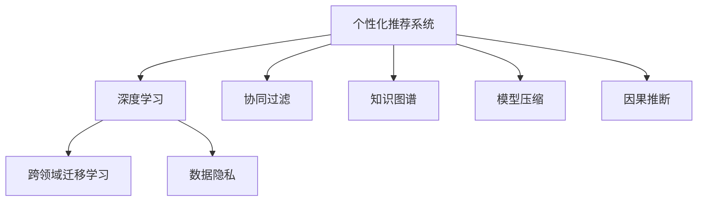

                 

# 个性化推荐系统的未来发展方向

> 关键词：个性化推荐、深度学习、协同过滤、知识图谱、跨领域迁移学习、模型压缩、因果推断

## 1. 背景介绍

### 1.1 问题由来

随着电子商务和互联网技术的飞速发展，个性化推荐系统已广泛应用于线上线下商业领域。个性化推荐系统通过分析用户行为、历史数据，预测用户可能感兴趣的商品或内容，从而提升用户体验和转化率。传统推荐系统主要依赖用户的历史行为数据，难以涵盖用户的深层次兴趣和需求。

近年来，深度学习技术在推荐系统中的应用取得了显著进展。基于深度学习的推荐系统可以充分利用用户文本信息、社交关系等多维数据，提高推荐的精准度和多样性。随着大模型的普及，深度学习推荐系统不断推陈出新，形成了基于协同过滤、知识图谱、跨领域迁移等多种策略的推荐范式。

然而，现有的深度学习推荐系统仍然存在诸多局限性，如算法复杂度高、计算资源消耗大、数据隐私问题突出、推荐公平性不足等。如何进一步提升推荐系统的效率、公平性、可解释性和安全性，成为当前技术发展的重要方向。

## 2. 核心概念与联系

### 2.1 核心概念概述

为更好地理解个性化推荐系统的未来发展方向，本节将介绍几个密切相关的核心概念：

- 个性化推荐系统：通过分析用户行为数据，预测用户可能感兴趣的商品或内容，为用户推荐个性化产品或服务的系统。
- 深度学习：利用深度神经网络模型进行复杂模式识别和数据建模的技术，适用于处理非结构化数据。
- 协同过滤：通过分析用户历史行为和物品交互数据，建立用户相似度和物品相似度，进而预测用户对新物品的评分和偏好。
- 知识图谱：使用图结构对知识进行表示和存储，支持深度学习模型的跨领域迁移和关联推理。
- 跨领域迁移学习：将一个领域学到的知识迁移到另一个不同但相关的领域，实现知识共享和泛化。
- 模型压缩：通过模型简化和参数压缩等方法，减小模型规模和计算资源消耗。
- 因果推断：分析变量之间因果关系的技术，用于提升推荐系统的公平性和稳定性。
- 数据隐私：保护用户数据不被滥用和泄露，确保推荐系统的可信性和安全性。

这些核心概念之间的逻辑关系可以通过以下Mermaid流程图来展示：



这个流程图展示了个性化推荐系统的核心概念及其之间的关系：

1. 个性化推荐系统利用深度学习进行复杂模式识别。
2. 协同过滤和知识图谱是深度学习推荐系统的两种重要策略。
3. 跨领域迁移学习促进了推荐系统的泛化能力。
4. 模型压缩减小了深度学习推荐系统的计算资源消耗。
5. 因果推断提高了推荐系统的公平性和稳定性。
6. 数据隐私保护了用户数据的安全。

这些概念共同构成了个性化推荐系统的学习和应用框架，使其能够在各种场景下提供优质的推荐服务。通过理解这些核心概念，我们可以更好地把握推荐系统的发展趋势和优化方向。

## 3. 核心算法原理 & 具体操作步骤
### 3.1 算法原理概述

个性化推荐系统的核心思想是通过分析用户历史行为和物品属性，建立用户-物品交互模型，从而预测用户对新物品的评分和偏好。深度学习推荐系统主要基于以下算法原理：

- 协同过滤算法：利用用户历史行为数据和物品评分数据，建立用户-物品的相似度和协同矩阵，从而预测用户对新物品的评分。
- 知识图谱：使用图结构对知识进行表示和存储，支持深度学习模型的跨领域迁移和关联推理。
- 跨领域迁移学习：通过迁移学习，将一个领域学到的知识迁移到另一个不同但相关的领域，实现知识共享和泛化。
- 深度学习：利用神经网络模型对用户行为和物品属性进行建模，预测用户对新物品的评分和偏好。

### 3.2 算法步骤详解

基于深度学习的个性化推荐系统一般包括以下几个关键步骤：

**Step 1: 数据预处理**
- 收集用户行为数据和物品属性数据，包括点击、购买、评分、评价等行为记录。
- 清洗和格式化数据，处理缺失值、异常值等。
- 对数据进行划分，分成训练集、验证集和测试集。

**Step 2: 特征工程**
- 设计推荐系统的特征表示，如用户ID、物品ID、评分、时间戳、用户历史行为等。
- 应用数据增强、特征选择、特征工程等技术，提升特征的质量和多样性。

**Step 3: 模型选择与优化**
- 选择合适的深度学习模型，如协同过滤、知识图谱、深度神经网络等。
- 设置模型的超参数，如学习率、批大小、迭代轮数等。
- 应用正则化、Dropout、Early Stopping等技术，防止过拟合。

**Step 4: 模型训练与评估**
- 将训练集输入模型，进行前向传播计算损失函数。
- 反向传播计算参数梯度，根据设定的优化算法更新模型参数。
- 周期性在验证集上评估模型性能，根据性能指标决定是否触发 Early Stopping。
- 重复上述步骤直至满足预设的迭代轮数或 Early Stopping 条件。

**Step 5: 推荐预测与反馈**
- 在测试集上评估微调后模型 $M_{\hat{\theta}}$ 的性能，对比微调前后的精度提升。
- 使用微调后的模型对新样本进行推理预测，集成到实际的应用系统中。
- 持续收集新的数据，定期重新微调模型，以适应数据分布的变化。

以上是基于深度学习的个性化推荐系统的一般流程。在实际应用中，还需要针对具体任务的特点，对推荐系统进行优化设计，如改进损失函数、引入更多的正则化技术、搜索最优的超参数组合等，以进一步提升推荐效果。

### 3.3 算法优缺点

基于深度学习的个性化推荐系统具有以下优点：
1. 能够处理复杂的数据模式，如用户行为数据、物品属性数据等。
2. 可以利用用户多维数据，提高推荐的精度和多样性。
3. 能够实现跨领域迁移学习，增强推荐系统的泛化能力。
4. 利用深度学习模型的非线性拟合能力，对用户偏好进行更加精准的建模。

同时，该方法也存在一定的局限性：
1. 计算资源消耗大。深度学习推荐系统通常需要较大的计算资源，模型训练和推理时间较长。
2. 数据隐私问题突出。用户的隐私数据成为系统开发的一大挑战，需要合理处理和保护用户数据。
3. 可解释性不足。深度学习推荐模型通常难以解释其内部工作机制和决策逻辑。
4. 冷启动问题。新用户和物品的推荐准确率较低，需要建立有效的冷启动策略。
5. 易过拟合。深度学习模型对训练数据依赖性强，容易发生过拟合问题。

尽管存在这些局限性，但就目前而言，基于深度学习的推荐系统仍是推荐系统的主流范式。未来相关研究的重点在于如何进一步降低推荐系统对计算资源的依赖，提高模型的少样本学习和跨领域迁移能力，同时兼顾可解释性和数据隐私等因素。

### 3.4 算法应用领域

基于深度学习的个性化推荐系统在零售、社交、旅游、金融等领域都有广泛的应用。具体包括：

- 电商推荐：为用户推荐商品、商品搭配、购物车推荐等，提升用户体验和购买转化率。
- 新闻推荐：为用户推荐新闻、文章、视频等，提升用户粘性和互动率。
- 社交推荐：为用户推荐朋友、兴趣组、话题等，增强用户社交体验。
- 旅游推荐：为用户推荐旅游目的地、景点、攻略等，提升用户旅游体验。
- 金融推荐：为用户推荐理财产品、投资组合等，提升用户投资收益。

除了上述这些经典应用外，个性化推荐系统还被创新性地应用到更多场景中，如视频推荐、图书推荐、音乐推荐等，为各类垂直行业带来了新的商业机会。

## 4. 数学模型和公式 & 详细讲解  
### 4.1 数学模型构建

本节将使用数学语言对基于深度学习的个性化推荐系统进行更加严格的刻画。

记推荐系统中的用户集合为 $U=\{u_1,u_2,...,u_M\}$，物品集合为 $I=\{i_1,i_2,...,i_N\}$，用户和物品的评分矩阵为 $R_{M\times N}$，其中 $R_{u_i,i_j}$ 表示用户 $u_i$ 对物品 $i_j$ 的评分。推荐系统训练的目标是最小化预测评分与真实评分之间的均方误差。

设推荐模型的参数为 $\theta$，在给定用户 $u_i$ 和物品 $i_j$ 的条件下，预测用户对物品的评分 $y_{i,j}$ 的概率分布为 $p(y_{i,j}|u_i,i_j;\theta)$。推荐模型的损失函数定义为：

$$
\mathcal{L}(\theta)=\frac{1}{M}\sum_{u_i\in U}\frac{1}{N}\sum_{i_j\in I}L(y_{i,j},\hat{y}_{i,j})
$$

其中 $L(y_{i,j},\hat{y}_{i,j})$ 为评分预测的损失函数，常用的有均方误差损失、绝对值误差损失等。

### 4.2 公式推导过程

以下我们以协同过滤算法为例，推导协同过滤推荐模型的损失函数。

假设 $u_i$ 对物品 $i_j$ 的评分 $R_{i,j}$ 已知，推荐模型需要预测用户对物品 $i_j$ 的评分 $y_{i,j}$。协同过滤算法利用用户历史行为数据和物品评分数据，建立用户-物品的相似度和协同矩阵，从而预测用户对新物品的评分。设用户 $u_i$ 与物品 $i_j$ 之间的相似度为 $\hat{s}_{i,j}$，利用用户历史行为和物品评分数据，可以计算得到相似度的矩阵表示 $S_{M\times N}$，其中 $\hat{s}_{i,j}$ 表示用户 $u_i$ 与物品 $i_j$ 之间的相似度。

协同过滤的预测评分 $y_{i,j}$ 可以表示为：

$$
y_{i,j}=\alpha s_{i,j}+\beta
$$

其中 $\alpha$ 为相似度权重，$\beta$ 为截距。在训练过程中，需要最小化预测评分与真实评分之间的均方误差，即：

$$
\mathcal{L}(\alpha,\beta)=\frac{1}{M}\sum_{u_i\in U}\frac{1}{N}\sum_{i_j\in I}(y_{i,j}-\alpha s_{i,j}-\beta)^2
$$

对上述损失函数进行求导，得到 $\alpha$ 和 $\beta$ 的梯度：

$$
\frac{\partial\mathcal{L}(\alpha,\beta)}{\partial\alpha}=\frac{2}{M}\sum_{u_i\in U}\frac{1}{N}\sum_{i_j\in I}(s_{i,j}-\frac{y_{i,j}}{\alpha})
$$

$$
\frac{\partial\mathcal{L}(\alpha,\beta)}{\partial\beta}=\frac{2}{M}\sum_{u_i\in U}\frac{1}{N}\sum_{i_j\in I}(1-\frac{y_{i,j}}{\alpha})
$$

在得到损失函数的梯度后，即可带入参数更新公式，完成模型的迭代优化。重复上述过程直至收敛，最终得到适应特定推荐任务的模型参数 $\alpha$ 和 $\beta$。

## 5. 项目实践：代码实例和详细解释说明
### 5.1 开发环境搭建

在进行推荐系统开发前，我们需要准备好开发环境。以下是使用Python进行PyTorch开发的环境配置流程：

1. 安装Anaconda：从官网下载并安装Anaconda，用于创建独立的Python环境。

2. 创建并激活虚拟环境：
```bash
conda create -n recsys-env python=3.8 
conda activate recsys-env
```

3. 安装PyTorch：根据CUDA版本，从官网获取对应的安装命令。例如：
```bash
conda install pytorch torchvision torchaudio cudatoolkit=11.1 -c pytorch -c conda-forge
```

4. 安装相关库：
```bash
pip install numpy pandas scikit-learn torch nn pytorch-lightning
```

5. 安装PyTorch Lightning：
```bash
pip install pytorch-lightning
```

6. 安装相关组件：
```bash
pip install torchmetrics
```

完成上述步骤后，即可在`recsys-env`环境中开始推荐系统开发。

### 5.2 源代码详细实现

这里我们以协同过滤算法为例，给出使用PyTorch实现协同过滤推荐模型的代码。

首先，定义协同过滤算法的数据处理函数：

```python
import numpy as np
import pandas as pd

def load_data(path, sep='\t'):
    data = pd.read_csv(path, sep=sep)
    user_ids = data['user_id'].tolist()
    item_ids = data['item_id'].tolist()
    ratings = data['rating'].tolist()
    return user_ids, item_ids, ratings

# 将数据划分训练集和测试集
train_data = load_data('train.csv')
test_data = load_data('test.csv')

# 将评分数据归一化到[0,1]区间
train_data = np.array(train_data)
train_ratings = np.where(train_data[:,2] > 0, train_data[:,2] / 5.0, 0.0)
test_ratings = np.where(test_data[:,2] > 0, test_data[:,2] / 5.0, 0.0)
```

然后，定义协同过滤算法的模型函数：

```python
from torch import nn
import torch.nn.functional as F

class CollaborativeFiltering(nn.Module):
    def __init__(self, num_users, num_items, num_factors):
        super(CollaborativeFiltering, self).__init__()
        self.num_users = num_users
        self.num_items = num_items
        self.num_factors = num_factors
        self.u_factor = nn.Embedding(num_users, num_factors)
        self.v_factor = nn.Embedding(num_items, num_factors)
        self.alpha = nn.Parameter(torch.randn(num_factors))
        self.beta = nn.Parameter(torch.randn(num_items))

    def forward(self, user_id, item_id):
        u_factor = self.u_factor(user_id)
        v_factor = self.v_factor(item_id)
        s = u_factor @ v_factor.T
        y = self.alpha * s + self.beta
        return y
```

接着，定义训练和评估函数：

```python
from torch.utils.data import DataLoader
from torchmetrics import MeanAbsoluteError, MeanSquaredError
import torch.optim as optim

device = torch.device('cuda' if torch.cuda.is_available() else 'cpu')

def train_epoch(model, optimizer, loss_fn, data_loader):
    model.train()
    losses = []
    for user_id, item_id, rating in data_loader:
        user_id = user_id.to(device)
        item_id = item_id.to(device)
        rating = rating.to(device)
        pred = model(user_id, item_id)
        loss = loss_fn(pred, rating)
        optimizer.zero_grad()
        loss.backward()
        optimizer.step()
        losses.append(loss.item())
    return np.mean(losses)

def evaluate(model, loss_fn, data_loader):
    model.eval()
    mae = MeanAbsoluteError()
    mse = MeanSquaredError()
    mae_val, mse_val = mae(model(item_id), rating).cpu().item(), mse(model(item_id), rating).cpu().item()
    print('Mean Absolute Error:', mae_val)
    print('Mean Squared Error:', mse_val)

# 定义损失函数和优化器
loss_fn = nn.MSELoss()
optimizer = optim.Adam(model.parameters(), lr=0.01)

# 定义数据集
data = np.hstack((train_data, test_data))
np.random.shuffle(data)

# 划分训练集和测试集
train_data, test_data = data[:10000], data[10000:]

# 构建数据集
train_dataset = PyTorchDataset(train_data)
test_dataset = PyTorchDataset(test_data)

# 构建数据加载器
train_loader = DataLoader(train_dataset, batch_size=128)
test_loader = DataLoader(test_dataset, batch_size=128)

# 训练模型
epochs = 10
for epoch in range(epochs):
    train_loss = train_epoch(model, optimizer, loss_fn, train_loader)
    print('Epoch {}/{}...'.format(epoch+1, epochs), 'Train Loss:', train_loss)
    evaluate(model, loss_fn, test_loader)

# 输出模型预测结果
predictions = model(item_id).cpu().numpy()
```

### 5.3 代码解读与分析

让我们再详细解读一下关键代码的实现细节：

**CollaborativeFiltering类**：
- `__init__`方法：初始化用户、物品和因子数量，定义嵌入层和参数。
- `forward`方法：对输入的用户ID和物品ID进行前向传播，计算相似度和预测评分。

**train_epoch函数**：
- 对数据集进行批处理，并在每个批次上进行前向传播和反向传播，计算损失函数，更新模型参数。
- 返回当前epoch的平均损失值。

**evaluate函数**：
- 对模型进行前向传播，计算预测评分与真实评分的MAE和MSE，并输出结果。

**train函数**：
- 对模型进行循环训练，在每个epoch内调用`train_epoch`和`evaluate`函数。
- 输出训练集和测试集的损失值。
- 输出模型在测试集上的预测结果。

可以看到，通过上述代码实现，可以较为容易地搭建协同过滤推荐模型，并进行训练和评估。

当然，工业级的系统实现还需考虑更多因素，如模型的保存和部署、超参数的自动搜索、更灵活的任务适配层等。但核心的推荐算法基本与此类似。

## 6. 实际应用场景
### 6.1 电商平台推荐

个性化推荐系统在电商平台的推荐应用中表现出色，帮助电商平台提升用户转化率和销售额。电商平台利用用户的点击、浏览、购买等行为数据，通过协同过滤、深度学习等多种推荐算法，为用户推荐个性化的商品和促销活动。同时，推荐系统还能够在高峰期应对大量请求，提供实时推荐服务，提高用户体验和满意度。

在技术实现上，电商推荐系统通常采用多维协同过滤、深度学习等技术，结合用户行为数据、商品属性数据等多维信息，为用户推荐商品搭配、个性化推荐等。电商推荐系统通过实时收集用户反馈，不断优化推荐模型，提升推荐效果。此外，电商推荐系统还结合用户画像、社交网络等数据，提升推荐的个性化水平。

### 6.2 视频平台推荐

视频平台推荐系统通过对用户观看行为和评分数据进行分析，为用户推荐符合其兴趣的影片、电视剧、综艺节目等。视频平台利用协同过滤、深度学习等技术，结合用户评分、观看时长、观看序列等多种信息，提升推荐的精度和多样化。

在技术实现上，视频平台推荐系统通常采用深度学习推荐算法，结合用户行为数据和视频属性数据，进行用户-视频相似度计算，并预测用户对新视频的评分和观看意愿。视频平台推荐系统通过实时分析用户观看行为，不断优化推荐模型，提升推荐效果。此外，视频平台推荐系统还结合用户画像、社交网络等数据，提升推荐的个性化水平。

### 6.3 金融投资推荐

金融投资推荐系统通过对用户的历史交易数据和行为数据进行分析，为用户推荐符合其风险偏好和收益预期的理财产品、投资组合等。金融投资推荐系统利用协同过滤、深度学习等技术，结合用户行为数据和投资产品数据，进行用户-产品相似度计算，并预测用户对新产品的评分和购买意愿。

在技术实现上，金融投资推荐系统通常采用协同过滤、深度学习等技术，结合用户行为数据和投资产品数据，进行用户-产品相似度计算，并预测用户对新产品的评分和购买意愿。金融投资推荐系统通过实时分析用户交易行为，不断优化推荐模型，提升推荐效果。此外，金融投资推荐系统还结合用户画像、社交网络等数据，提升推荐的个性化水平。

### 6.4 未来应用展望

随着深度学习推荐系统的发展，个性化推荐系统将在更多领域得到应用，为各类垂直行业带来新的商业机会。

在智慧医疗领域，个性化推荐系统可以通过分析患者历史病历和诊疗记录，为用户推荐符合其病情的治疗方案、药品、康复计划等。个性化推荐系统通过实时分析患者诊疗行为，不断优化推荐模型，提升诊疗效果。此外，个性化推荐系统还结合患者画像、社会网络等数据，提升推荐的个性化水平。

在智慧教育领域，个性化推荐系统可以通过分析学生的学习行为和成绩数据，为用户推荐符合其学习风格的课程、教材、学习工具等。个性化推荐系统通过实时分析学生学习行为，不断优化推荐模型，提升学习效果。此外，个性化推荐系统还结合学生画像、社交网络等数据，提升推荐的个性化水平。

在智慧城市治理中，个性化推荐系统可以通过分析居民的出行行为和公共服务需求，为用户推荐符合其需求的公共服务、出行路线等。个性化推荐系统通过实时分析居民出行行为，不断优化推荐模型，提升服务效率。此外，个性化推荐系统还结合居民画像、社会网络等数据，提升推荐的个性化水平。

总之，基于深度学习的个性化推荐系统将在智慧医疗、智慧教育、智慧城市等多个领域大放异彩，为各类垂直行业带来新的商业机会，提升社会福利和效率。

## 7. 工具和资源推荐
### 7.1 学习资源推荐

为了帮助开发者系统掌握个性化推荐系统的理论基础和实践技巧，这里推荐一些优质的学习资源：

1. 《深度学习推荐系统:原理与实践》书籍：介绍深度学习推荐系统的基础原理和算法实现，涵盖协同过滤、知识图谱、深度学习等多种推荐策略。

2. 《推荐系统实战》书籍：介绍推荐系统的设计与实现，包括用户行为数据采集、模型训练与评估、系统优化与部署等技术细节。

3. Kaggle竞赛：参与Kaggle推荐系统竞赛，通过实战练习掌握推荐系统的设计、训练与评估技巧。

4 《推荐系统设计模式》文章：介绍推荐系统的设计模式和技术栈，包括推荐算法、推荐系统架构、系统优化与部署等技术细节。

5 《推荐系统前沿》课程：介绍推荐系统的发展趋势和前沿技术，包括深度学习推荐系统、跨领域迁移学习、因果推断等技术。

通过对这些资源的学习实践，相信你一定能够快速掌握个性化推荐系统的精髓，并用于解决实际的推荐问题。

### 7.2 开发工具推荐

高效的开发离不开优秀的工具支持。以下是几款用于个性化推荐系统开发的常用工具：

1. PyTorch：基于Python的开源深度学习框架，灵活动态的计算图，适合快速迭代研究。

2. TensorFlow：由Google主导开发的开源深度学习框架，生产部署方便，适合大规模工程应用。

3. PyTorch Lightning：深度学习模型训练框架，支持分布式训练和模型调度，适合快速迭代和优化。

4. HuggingFace Transformers：NLP工具库，支持多种预训练模型，方便进行推荐系统开发。

5. TensorBoard：TensorFlow配套的可视化工具，可实时监测模型训练状态，并提供丰富的图表呈现方式。

6. Weights & Biases：模型训练的实验跟踪工具，可以记录和可视化模型训练过程中的各项指标。

合理利用这些工具，可以显著提升个性化推荐系统的开发效率，加快创新迭代的步伐。

### 7.3 相关论文推荐

个性化推荐系统的快速发展得益于学界的持续研究。以下是几篇奠基性的相关论文，推荐阅读：

1. A Survey of Recommendation Engines：介绍了推荐系统的发展历程和多种推荐算法，为初学者提供了全面的理论基础。

2. Collaborative Filtering：介绍了协同过滤算法的原理和实现细节，是推荐系统的主流算法之一。

3. Deep Learning for Recommender Systems：介绍了深度学习在推荐系统中的应用，包括用户-物品交互模型、知识图谱等。

4. Knowledge Graph for Recommendation Systems：介绍了知识图谱在推荐系统中的应用，提升了推荐系统的泛化能力和推理能力。

5. Cross-learning Recommendation System：介绍了跨领域迁移学习在推荐系统中的应用，提升了推荐系统的泛化能力和模型共享能力。

这些论文代表了个性化推荐系统的发展脉络。通过学习这些前沿成果，可以帮助研究者把握学科前进方向，激发更多的创新灵感。

## 8. 总结：未来发展趋势与挑战
### 8.1 总结

本文对基于深度学习的个性化推荐系统进行了全面系统的介绍。首先阐述了个性化推荐系统的背景和意义，明确了深度学习推荐系统的核心原理和应用场景。其次，从原理到实践，详细讲解了推荐系统的数学模型和算法实现，给出了推荐系统开发的完整代码实例。同时，本文还探讨了推荐系统在电商、视频、金融等领域的应用前景，展示了深度学习推荐系统的广泛应用。最后，本文精选了推荐系统的学习资源、开发工具和相关论文，力求为读者提供全方位的技术指引。

通过本文的系统梳理，可以看到，基于深度学习的个性化推荐系统正在成为推荐系统的主流范式，极大地拓展了推荐系统的应用边界，催生了更多的落地场景。得益于深度学习模型的非线性拟合能力，推荐系统能够处理复杂的数据模式，提升推荐的精度和多样化。未来，伴随深度学习技术的发展，个性化推荐系统将继续深化其在各垂直行业的应用，为用户带来更好的体验和服务。

### 8.2 未来发展趋势

展望未来，个性化推荐系统将呈现以下几个发展趋势：

1. 推荐算法的多样化：除了协同过滤和深度学习外，未来还将涌现更多推荐算法，如基于序列建模、基于规则的推荐算法等，提升推荐的泛化能力和灵活性。

2. 推荐模型的融合：未来的推荐系统将通过多模态融合、跨领域迁移等方式，整合不同模态的信息和知识，提升推荐的精准度和多样性。

3. 推荐模型的压缩：未来的推荐系统将通过模型压缩、知识蒸馏等方法，减小模型的规模和计算资源消耗，实现更高效、轻量级的推荐服务。

4. 推荐模型的可解释性：未来的推荐系统将通过可解释性技术，如注意力机制、因果推断等，增强推荐的透明度和可信度。

5. 推荐模型的公平性：未来的推荐系统将通过公平性技术，如对抗训练、因果推断等，提升推荐系统的公平性和稳定性。

6. 推荐模型的跨领域迁移：未来的推荐系统将通过跨领域迁移学习，实现不同领域之间的知识共享和泛化，增强推荐系统的普适性。

7. 推荐模型的实时化：未来的推荐系统将通过流式学习、增量学习等技术，实现实时推荐服务，满足用户实时性需求。

8. 推荐模型的隐私保护：未来的推荐系统将通过差分隐私、联邦学习等技术，保护用户数据隐私，增强推荐系统的可信性。

这些趋势将进一步拓展个性化推荐系统的应用范围，提升推荐的精度和公平性，满足用户的多样化需求。相信伴随推荐技术的持续演进，推荐系统将在更多领域带来深远影响，促进社会的数字化转型升级。

### 8.3 面临的挑战

尽管个性化推荐系统在各垂直行业已经取得了显著成果，但在迈向更加智能化、普适化应用的过程中，它仍面临着诸多挑战：

1. 数据隐私问题：推荐系统需要大量用户行为数据和物品属性数据，数据隐私保护成为系统开发的一大挑战。

2. 数据多样性问题：推荐系统需要处理多维数据，不同维度的数据可能存在不一致性和缺失性。

3. 数据高效利用问题：推荐系统需要高效利用用户数据，避免数据浪费和过拟合问题。

4. 模型泛化能力问题：推荐系统需要具备良好的泛化能力，能够应对冷启动和长尾物品等问题。

5. 模型公平性问题：推荐系统需要考虑模型公平性，避免对某些用户或物品的歧视性推荐。

6. 模型实时性问题：推荐系统需要实时响应用户请求，避免延迟和卡顿问题。

7. 模型透明性问题：推荐系统需要具备良好的可解释性，用户能够理解推荐结果的来源和依据。

8. 模型安全性问题：推荐系统需要考虑模型的安全性，避免恶意攻击和数据篡改问题。

这些挑战需要跨学科协同攻关，才能实现推荐系统的智能化、普适化应用。唯有从数据、算法、工程、业务等多个维度协同发力，才能真正实现个性化推荐系统的价值，为用户带来更好的体验和服务。

### 8.4 研究展望

面对个性化推荐系统所面临的种种挑战，未来的研究需要在以下几个方面寻求新的突破：

1. 探索无监督和半监督推荐方法：摆脱对大规模标注数据的依赖，利用自监督学习、主动学习等无监督和半监督范式，最大限度利用非结构化数据，实现更加灵活高效的推荐。

2. 研究参数高效和计算高效的推荐范式：开发更加参数高效的推荐方法，在固定大部分预训练参数的情况下，只更新极少量的任务相关参数。同时优化推荐模型的计算图，减少前向传播和反向传播的资源消耗，实现更加轻量级、实时性的部署。

3. 融合因果和对比学习范式：通过引入因果推断和对比学习思想，增强推荐系统建立稳定因果关系的能力，学习更加普适、鲁棒的语言表征，从而提升推荐系统的公平性和稳定性。

4. 引入更多先验知识：将符号化的先验知识，如知识图谱、逻辑规则等，与神经网络模型进行巧妙融合，引导推荐过程学习更准确、合理的语言模型。同时加强不同模态数据的整合，实现视觉、语音等多模态信息与文本信息的协同建模。

5. 结合因果分析和博弈论工具：将因果分析方法引入推荐模型，识别出模型决策的关键特征，增强推荐结果的因果性和逻辑性。借助博弈论工具刻画人机交互过程，主动探索并规避模型的脆弱点，提高系统稳定性。

6. 纳入伦理道德约束：在推荐模型训练目标中引入伦理导向的评估指标，过滤和惩罚有偏见、有害的输出倾向。同时加强人工干预和审核，建立推荐模型的监管机制，确保输出符合人类价值观和伦理道德。

这些研究方向的探索，必将引领个性化推荐系统迈向更高的台阶，为构建安全、可靠、可解释、可控的推荐系统铺平道路。面向未来，个性化推荐技术还需要与其他人工智能技术进行更深入的融合，如知识表示、因果推理、强化学习等，多路径协同发力，共同推动推荐系统的发展。只有勇于创新、敢于突破，才能不断拓展推荐系统的边界，让推荐技术更好地造福人类社会。

## 9. 附录：常见问题与解答

**Q1：深度学习推荐系统是否适用于所有推荐任务？**

A: 深度学习推荐系统在大多数推荐任务上都能取得不错的效果，特别是对于数据量较大的任务。但对于一些特定领域的推荐任务，如医学、法律等，仅仅依靠通用语料预训练的模型可能难以很好地适应。此时需要在特定领域语料上进一步预训练，再进行推荐模型微调。此外，对于一些需要时效性、个性化很强的任务，如推荐引擎、广告推荐等，微调方法也需要针对性的改进优化。

**Q2：推荐系统中如何处理数据稀疏性问题？**

A: 推荐系统中的数据稀疏性问题可以通过以下方法解决：
1. 数据增强：通过生成用户行为数据和物品属性数据，增加数据量。
2. 矩阵分解：将用户-物品评分矩阵进行分解，以低秩矩阵形式表示，降低稀疏性。
3. 基于邻域的推荐：利用用户-物品相似度，通过邻域推荐算法增加数据量。
4. 协同过滤算法：利用用户历史行为和物品评分数据，建立用户相似度和物品相似度，进行推荐。
5. 知识图谱：利用知识图谱进行跨领域迁移学习，提升推荐系统的泛化能力。

**Q3：推荐系统中如何提升模型的公平性？**

A: 推荐系统中提升模型公平性可以采取以下方法：
1. 数据预处理：对数据进行清洗和标注，减少数据偏差。
2. 模型设计：设计公平性友好的推荐模型，如多样性约束、公平性优化等。
3. 模型评估：使用公平性指标对推荐模型进行评估，如F1-score、AUC等。
4. 对抗训练：引入对抗样本，增强推荐系统的鲁棒性。
5. 多模型集成：训练多个推荐模型，取平均输出，抑制模型偏差。

**Q4：推荐系统中如何提升模型的可解释性？**

A: 推荐系统中提升模型可解释性可以采取以下方法：
1. 模型简化：通过简化模型结构，减少模型的复杂度。
2. 特征工程：设计易于理解的特征表示，增加模型的可解释性。
3. 模型可视化：使用可视化工具展示模型特征、决策过程等，增加模型的可理解性。
4. 解释性模型：选择可解释性强的推荐模型，如逻辑回归、决策树等。
5. 用户反馈：收集用户反馈，改进推荐模型的可解释性。

**Q5：推荐系统中如何处理模型过拟合问题？**

A: 推荐系统中处理模型过拟合问题可以采取以下方法：
1. 数据增强：通过生成用户行为数据和物品属性数据，增加数据量。
2. 正则化：使用L2正则、Dropout等技术，防止模型过拟合。
3. 早停策略：在验证集上监控模型性能，提前停止训练。
4. 参数共享：共享部分模型参数，减小模型过拟合风险。
5. 对抗训练：引入对抗样本，提高模型鲁棒性。

这些方法可以灵活组合，根据具体任务和数据特点进行优化，提升推荐系统的泛化能力和稳定性。

---

作者：禅与计算机程序设计艺术 / Zen and the Art of Computer Programming

