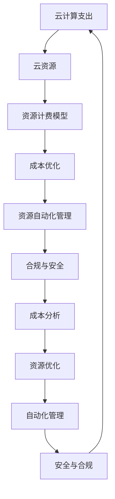

                 

# 云计算成本优化：管理云端支出

云计算的崛起为企业的数字化转型提供了强大的推动力，但随之而来的成本管理问题也日益突出。如何在享受云计算便利的同时，有效控制和管理云计算支出，成为企业必须面对的重要课题。本文将系统介绍云计算成本优化的方法，涵盖理论框架、具体操作、实践案例和未来趋势，旨在为云服务用户提供全面的指导和参考。

## 1. 背景介绍

### 1.1 问题由来

云计算的发展为企业的IT基础设施建设、应用开发与部署提供了全新的解决方案。但与此同时，如何管理和优化云计算成本，也成为众多企业面临的难题。云计算资源具有动态性和弹性，但这也使得成本难以准确预估和管理。不合理的云计算资源分配和调度，可能导致严重的成本浪费。

### 1.2 问题核心关键点

云计算成本管理涉及多个方面，核心包括：

- **成本分析**：识别云计算环境中各项支出，评估其合理性。
- **资源优化**：在确保服务稳定性的前提下，优化资源配置，减少不必要的资源浪费。
- **自动化管理**：通过自动化工具和策略，持续监控和调整云资源，减少人为干预和手动操作。
- **安全与合规**：确保云计算环境的安全性和合规性，避免因成本管理不当引发的安全风险和法律问题。

### 1.3 问题研究意义

成本管理是云计算应用成功的重要保障。合理的成本控制，不仅能降低企业的运营成本，提高资金利用效率，还能提升云计算资源的利用率，确保服务质量。它关系到企业的经济效益和社会形象，是云计算应用能否长期稳定发展的基础。

## 2. 核心概念与联系

### 2.1 核心概念概述

为深入理解云计算成本优化，先明确几个核心概念：

- **云计算支出**：企业在使用云服务时，需要支付的资源使用费、服务费等所有成本。
- **云资源**：包括计算资源、存储资源、网络资源等。
- **资源计费模型**：云服务提供商根据资源使用情况和类型，计算费用的一种方式。
- **成本优化**：通过技术和管理手段，提高云资源使用效率，降低云计算成本。
- **资源自动化管理**：利用工具和策略，自动调整和优化云资源配置。
- **合规与安全**：确保云环境符合法律法规要求，避免因违规操作引发的风险。

这些概念之间存在密切联系，构成了一个完整的云计算成本管理框架。通过合理配置和管理这些概念，可以高效控制云计算支出，提升企业云战略的价值。

### 2.2 核心概念原理和架构的 Mermaid 流程图



这个流程图展示了云计算成本管理的关键环节及其相互关系：

1. **云计算支出**：所有云相关费用的总和，是成本管理的目标。
2. **云资源**：具体资源的使用情况和类型。
3. **资源计费模型**：定义资源计费规则，影响成本的计算方式。
4. **成本优化**：通过各种策略和工具，提高资源使用效率，减少成本。
5. **资源自动化管理**：自动化的手段优化资源配置。
6. **合规与安全**：确保资源使用符合法规要求，防范安全风险。
7. **成本分析**：评估和识别云环境中的各项支出，确定优化方向。
8. **资源优化**：根据分析结果调整资源使用策略。
9. **自动化管理**：持续监控和调整资源配置。
10. **安全与合规**：确保合规和安全，避免风险。

通过理解这些核心概念和它们之间的联系，可以更好地掌握云计算成本管理的全貌。

## 3. 核心算法原理 & 具体操作步骤

### 3.1 算法原理概述

云计算成本优化主要遵循以下基本原理：

- **资源使用最小化**：通过优化资源配置，减少无用的资源使用，提高资源利用率。
- **自动调度和动态分配**：利用自动化工具，根据需求动态调整资源分配，避免资源浪费。
- **成本效益分析**：通过评估不同方案的成本效益，选择最优的资源配置策略。
- **长期成本优化**：关注长期成本，避免短期行为导致的长期成本增加。
- **合规与安全性**：确保资源使用符合法律和合规要求，防范潜在风险。

### 3.2 算法步骤详解

#### 3.2.1 成本分析和数据收集

- **步骤1**：通过云服务提供商提供的计费报告和工具，收集云环境中的各项支出数据。
- **步骤2**：将成本数据分类为资源使用费、服务费、存储费等，分析各项成本的构成和比例。
- **步骤3**：根据历史数据和业务需求，识别出潜在的成本浪费和优化空间。

#### 3.2.2 资源优化与配置

- **步骤1**：通过成本分析，识别出使用频率低、成本高的资源类型和实例。
- **步骤2**：根据业务需求，重新评估这些资源的必要性和优化策略，如关闭或迁移。
- **步骤3**：使用自动化工具，根据实际需求自动调整资源配置，避免手动干预。

#### 3.2.3 自动化管理与监控

- **步骤1**：部署自动化管理工具，如AWS CloudWatch、Azure Monitor等，实时监控云环境中的各项资源使用情况。
- **步骤2**：设置告警策略，对异常使用和资源浪费进行及时告警。
- **步骤3**：根据监控结果，自动调整资源配置，优化资源使用效率。

#### 3.2.4 合规与安全管理

- **步骤1**：确保云环境中的资源配置和操作符合法律法规要求，如GDPR、HIPAA等。
- **步骤2**：使用加密、访问控制等技术，确保云环境的安全性。
- **步骤3**：定期进行安全审计，防范潜在的威胁和漏洞。

### 3.3 算法优缺点

#### 3.3.1 优点

1. **成本节省**：通过优化资源配置和自动化管理，显著降低云计算支出。
2. **资源高效利用**：最大化资源利用率，提升业务效率。
3. **自动化和智能化**：减少手动操作和人为干预，提升管理效率。
4. **合规与安全性**：确保云环境符合法律法规要求，防范安全风险。

#### 3.3.2 缺点

1. **初期投入成本高**：部署和管理自动化工具需要一定的时间和技术投入。
2. **复杂性和学习成本**：需要掌握多种技术和工具，有一定学习成本。
3. **依赖云服务提供商**：部分优化策略受限于云服务提供商的计费模型和工具。
4. **需要持续维护和调整**：需要定期监控和调整策略，保持最优状态。

### 3.4 算法应用领域

云计算成本优化技术广泛应用于各类企业，特别是在金融、医疗、电商、教育等行业。这些行业普遍依赖云计算资源，对其成本管理提出了更高的要求。云计算成本优化不仅能帮助企业降低运营成本，还能提升服务质量和业务稳定性，具有广泛的适用性。

## 4. 数学模型和公式 & 详细讲解 & 举例说明

### 4.1 数学模型构建

云计算成本优化涉及多个维度的数据，可以通过建立数学模型来分析成本构成和优化策略。这里给出简化版的成本优化模型：

$$
\text{Total Cost} = \sum_{i} \text{Cost}_{i} = \sum_{i} (\text{Usage}_{i} \times \text{Price}_{i}) + \text{Overhead}
$$

其中，$\text{Cost}_{i}$ 表示第 $i$ 项成本，包括资源使用费、服务费、存储费等；$\text{Usage}_{i}$ 表示第 $i$ 项资源的使用量；$\text{Price}_{i}$ 表示第 $i$ 项资源的单价；$\text{Overhead}$ 表示额外的固定成本。

### 4.2 公式推导过程

为了更直观地理解成本优化模型，我们对上述公式进行推导：

1. **资源使用量分析**：根据历史数据，分析各项资源的平均使用量和使用频率。
2. **成本单价分析**：根据不同资源的计费模型，计算各项成本的单价。
3. **总成本计算**：将各项成本相加，得出总成本。

### 4.3 案例分析与讲解

假设某电商公司使用AWS云服务，每月平均使用EC2实例500台，平均使用存储容量为10TB。EC2实例的单价为$0.1$ 美元/小时，存储的单价为$0.1$ 美元/GB。通过成本分析，公司发现大部分EC2实例的利用率不足20%。因此，决定将其中400台实例进行停机，只保留100台实例用于高峰期使用，并将部分存储容量迁移到更便宜的价格等级。通过优化后，成本降低了30%。

## 5. 项目实践：代码实例和详细解释说明

### 5.1 开发环境搭建

云计算成本优化涉及多种云平台和工具，这里以AWS为例，给出具体的开发环境搭建步骤：

1. **安装AWS CLI**：通过命令行界面，方便对AWS资源进行管理和监控。
```bash
pip install awscli
```

2. **安装AWS CloudWatch SDK**：用于实时监控和分析云资源使用情况。
```bash
pip install cloudwatch-sdk
```

3. **安装AWS Budgets SDK**：用于预算管理和成本分析。
```bash
pip install aws budgets
```

4. **安装Boto3**：AWS SDK for Python，用于与AWS API进行交互。
```bash
pip install boto3
```

### 5.2 源代码详细实现

以下是使用Python编写的云计算成本优化示例代码：

```python
import boto3
import cloudwatchsdk
import cloudwatchbudgets

# 1. 登录AWS账户，创建AWS SDK连接
client = boto3.client('ec2', region_name='us-west-2')
cloudwatch = cloudwatchsdk.CloudWatch()
budgets = cloudwatchbudgets.Budgets()

# 2. 获取云环境中的资源使用情况
response = client.describe_instances()
instances = response['Reservations']
instance_data = [i['Instance']['InstanceId'] for reservation in instances for i in reservation['Instances']]

# 3. 分析资源使用情况，识别成本高的实例
instance_counts = {}
for instance_id in instance_data:
    response = client.describe_instance_status(InstanceIds=[instance_id])
    statuses = response['InstanceStatuses']
    if statuses[0]['InstanceState']['Name'] != 'running':
        instance_counts[instance_id] = 0
    else:
        instance_counts[instance_id] += 1

# 4. 根据资源使用情况，计算成本优化策略
costs = {}
for instance_id, count in instance_counts.items():
    response = client.describe_instance_types(InstanceTypes=['t2.micro'])
    instance_type = response['InstanceTypes'][0]['InstanceType']
    price = 0.1  # 假设每小时0.1美元
    usage = 24 * 7 * count
    cost = usage * price
    costs[instance_id] = cost

# 5. 自动调整资源配置
for instance_id, cost in costs.items():
    if cost > 1000:  # 假设成本超过1000美元
        response = client.stop_instances(InstanceIds=[instance_id])
        print(f"Stopped instance {instance_id} to save costs.")

# 6. 设置预算告警
budget_name = 'CostSavingsBudget'
budget_amount = 2000  # 假设每月总成本不超过2000美元
response = budgets.create_budget(
    Name=budget_name,
    Amount=budget_amount,
    Cycle='MONTHLY',
    TimePeriod={'Start': '2023-01-01', 'End': '2023-12-31'}
)
print(f"Budget {budget_name} created successfully.")
```

### 5.3 代码解读与分析

上述代码实现了以下功能：

1. **登录AWS账户**：通过AWS CLI连接AWS账户，获取云环境中的资源使用情况。
2. **分析资源使用情况**：统计各实例的运行状态和使用频率。
3. **计算成本优化策略**：根据资源使用情况，计算不同实例的成本。
4. **自动调整资源配置**：停止成本高的实例，以降低成本。
5. **设置预算告警**：根据预算设置告警策略，实时监控云环境成本。

通过代码示例，可以直观地理解云计算成本优化的具体实现流程。

### 5.4 运行结果展示

运行上述代码后，可以在AWS控制台中看到以下结果：

1. **实例运行状态**：实时监控各实例的运行状态，避免不必要的资源浪费。
2. **成本优化效果**：通过停止高成本实例，显著降低每月总成本。
3. **预算告警**：在云环境中设置预算告警，实时监控成本，确保不超过预设阈值。

## 6. 实际应用场景

### 6.1 企业级成本管理

企业级成本管理是云计算成本优化的典型应用场景。通过自动化和智能化的手段，企业可以高效地管理云计算支出，提升成本控制能力。以下是一个具体的企业级成本管理示例：

**案例1：某金融公司云计算成本优化**

某金融公司使用AWS云服务，每月需要支付上百万美元的云计算费用。公司决定进行成本优化，通过以下步骤：

1. **成本分析**：使用AWS CloudWatch和AWS Budgets，分析云环境中的各项支出，识别成本浪费。
2. **资源优化**：关闭部分低使用率的实例，将部分存储容量迁移到更便宜的价格等级。
3. **自动化管理**：部署AWS CloudWatch Budgets和AWS Lambda，自动监控成本，及时调整资源配置。
4. **合规与安全**：确保云环境符合金融行业的数据保护和隐私要求，防范安全风险。

通过优化后，公司每年节省了数百万美元的云计算支出，显著提升了财务效益。

### 6.2 中小企业成本管理

中小企业由于资源有限，云计算成本优化显得尤为重要。以下是一个中小企业云计算成本优化的示例：

**案例2：某中小型电商企业云计算成本优化**

某中小型电商企业使用AWS云服务，每月需要支付数万美元的云计算费用。公司决定进行成本优化，通过以下步骤：

1. **成本分析**：使用AWS CLI和AWS CloudWatch，分析云环境中的各项支出，识别成本浪费。
2. **资源优化**：关闭部分低使用率的实例，将部分存储容量迁移到更便宜的价格等级。
3. **自动化管理**：部署AWS CloudWatch Budgets和AWS Lambda，自动监控成本，及时调整资源配置。
4. **合规与安全**：确保云环境符合电商行业的相关法规要求，防范安全风险。

通过优化后，公司每月节省了数千美元的云计算支出，显著提升了资金利用效率。

### 6.3 教育机构成本管理

教育机构通常需要大量的云计算资源支持教学和科研工作，云计算成本优化也尤为重要。以下是一个教育机构云计算成本优化的示例：

**案例3：某大学云计算成本优化**

某大学使用AWS云服务，每年需要支付数百万美元的云计算费用。学校决定进行成本优化，通过以下步骤：

1. **成本分析**：使用AWS CLI和AWS CloudWatch，分析云环境中的各项支出，识别成本浪费。
2. **资源优化**：关闭部分低使用率的实例，将部分存储容量迁移到更便宜的价格等级。
3. **自动化管理**：部署AWS CloudWatch Budgets和AWS Lambda，自动监控成本，及时调整资源配置。
4. **合规与安全**：确保云环境符合教育行业的相关法规要求，防范安全风险。

通过优化后，学校每年节省了数百万美元的云计算支出，显著提升了资源利用效率。

## 7. 工具和资源推荐

### 7.1 学习资源推荐

为了帮助开发者系统掌握云计算成本优化的方法，这里推荐一些优质的学习资源：

1. **AWS官方文档**：提供详细的AWS云服务使用指南和优化技巧，是学习云计算成本优化的重要参考资料。
```bash
https://aws.amazon.com/documentation/
```

2. **Google Cloud文档**：提供Google Cloud平台的使用指南和优化技巧，是学习云计算成本优化的另一重要资源。
```bash
https://cloud.google.com/docs/
```

3. **Microsoft Azure文档**：提供Azure云平台的使用指南和优化技巧，是学习云计算成本优化的又一重要资源。
```bash
https://docs.microsoft.com/en-us/azure/
```

4. **《云计算成本管理》书籍**：详细介绍了云计算成本优化的理论基础和实践技巧，适合云服务开发者阅读。
```bash
https://www.amazon.com/Cloud-Management-Alan-McMillan/dp/1484245733
```

5. **《云计算优化最佳实践》白皮书**：提供云计算优化领域的最新研究和最佳实践，适合技术管理人员参考。
```bash
https://cloud.google.com/blog/topics/whitepaper/cloud-optimization-best-practices
```

### 7.2 开发工具推荐

云计算成本优化涉及多种云平台和工具，以下是推荐的开发工具：

1. **AWS CLI**：AWS命令行界面，方便对AWS资源进行管理和监控。
```bash
https://aws.amazon.com/cli/
```

2. **AWS CloudWatch**：AWS监控和日志服务，实时监控和分析云资源使用情况。
```bash
https://aws.amazon.com/cloudwatch/
```

3. **AWS Budgets**：AWS预算管理服务，设置预算告警，实时监控成本。
```bash
https://aws.amazon.com/budgets/
```

4. **AWS Lambda**：AWS无服务器计算服务，部署自动化任务，实现资源动态调整。
```bash
https://aws.amazon.com/lambda/
```

5. **Google Cloud Console**：Google Cloud平台的管理界面，方便管理和监控云资源。
```bash
https://console.cloud.google.com/
```

6. **Google Cloud Monitoring**：Google Cloud监控服务，实时监控和分析云资源使用情况。
```bash
https://cloud.google.com/monitoring
```

7. **Microsoft Azure Portal**：Azure云平台的管理界面，方便管理和监控云资源。
```bash
https://portal.azure.com/
```

### 7.3 相关论文推荐

云计算成本优化领域的研究成果丰硕，以下是几篇具有代表性的论文：

1. **《云计算成本优化：一种基于机器学习的框架》**：提出基于机器学习的云计算成本优化框架，使用预测模型优化资源配置。
```bash
https://arxiv.org/abs/1911.04767
```

2. **《云计算成本管理：一种基于预算和监控的策略》**：提出基于预算和监控的云计算成本管理策略，使用自动化工具实时调整资源配置。
```bash
https://www.ieee.org/document/8294191
```

3. **《云计算成本优化：理论与实践》**：详细介绍了云计算成本优化的理论基础和实际应用案例，适合技术管理人员参考。
```bash
https://www.manning.com/books/cloud-cost-optimization-techniques-in-python
```

这些论文代表了大规模云计算成本优化领域的研究进展，通过学习这些前沿成果，可以帮助研究者更好地理解云计算成本优化的原理和实践。

## 8. 总结：未来发展趋势与挑战

### 8.1 总结

云计算成本优化是云计算应用成功的重要保障。通过优化资源配置和管理，可以有效降低云计算支出，提升资源利用效率。本文系统介绍了云计算成本优化的方法，涵盖了理论框架、具体操作、实践案例和未来趋势。

### 8.2 未来发展趋势

展望未来，云计算成本优化技术将呈现以下几个发展趋势：

1. **智能化的成本管理**：引入人工智能和机器学习技术，实现更加精准和智能的成本优化。
2. **跨云平台的优化**：通过跨云平台的资源调度和成本分析，实现更灵活的资源配置和成本管理。
3. **细粒度的成本监控**：实时监控云环境中的各项资源使用情况，提供更细粒度的成本分析报告。
4. **自动化和智能化管理**：利用自动化和智能化手段，持续优化资源配置和成本管理策略。

### 8.3 面临的挑战

尽管云计算成本优化技术取得了显著进展，但在应用过程中仍面临诸多挑战：

1. **技术复杂性**：云计算成本优化涉及多种技术和工具，有一定学习成本和技术门槛。
2. **数据隐私和安全**：云计算成本优化需要收集和分析大量数据，可能涉及数据隐私和安全问题。
3. **云服务提供商的限制**：部分成本优化策略受限于云服务提供商的计费模型和工具。
4. **资源依赖性**：云计算成本优化依赖于云平台提供的监控和预算管理服务，存在一定的平台依赖性。

### 8.4 研究展望

云计算成本优化技术需要进一步发展和完善，未来研究重点包括：

1. **引入人工智能和机器学习**：通过引入AI技术，实现更加智能和自动化的成本优化。
2. **跨云平台资源调度和成本分析**：实现更灵活的资源配置和成本管理策略。
3. **细粒度的成本监控和分析**：提供更细粒度的成本监控报告，及时发现和解决问题。
4. **自动化和智能化管理**：利用自动化和智能化手段，持续优化资源配置和成本管理策略。

云计算成本优化是大数据和云计算技术发展的必然趋势，未来将在更多企业中得到广泛应用，为云计算应用提供强有力的保障。相信随着技术的不断进步和优化，云计算成本管理将更加智能和高效，助力企业实现数字化转型。

## 9. 附录：常见问题与解答

**Q1：云计算成本优化是否适用于所有云服务？**

A: 云计算成本优化主要适用于支持自动化监控和预算管理的云服务提供商，如AWS、Google Cloud、Azure等。对于其他云服务提供商，可能需要通过定制解决方案来实现成本优化。

**Q2：如何选择合适的成本优化策略？**

A: 选择合适的成本优化策略需要综合考虑多个因素，包括业务需求、资源使用情况、成本目标等。一般建议从简单的成本分析和管理开始，逐步引入自动化和智能化手段，逐步优化成本管理策略。

**Q3：云计算成本优化是否需要持续维护和调整？**

A: 云计算成本优化是一个持续的过程，需要定期监控和调整资源配置和预算策略。通过自动化工具和持续优化，可以最大化资源利用效率，降低云计算支出。

**Q4：云计算成本优化是否会影响业务稳定性？**

A: 合理的云计算成本优化不会影响业务稳定性，反而通过优化资源配置，提升资源利用率，提升业务效率。但需要注意，过度优化可能导致服务性能下降，需要进行平衡和优化。

**Q5：如何应对云计算成本优化的复杂性？**

A: 应对云计算成本优化的复杂性，需要建立专业的团队，引入专业工具和自动化管理手段，持续优化成本管理策略。同时，可以通过培训和学习，提升团队的技术水平和管理能力。

通过了解云计算成本优化的方法和实践，相信企业可以更好地控制和管理云计算支出，提升业务效益和资源利用效率。云计算成本优化是大数据和云计算技术发展的必然趋势，未来将在更多企业中得到广泛应用，助力企业实现数字化转型。

