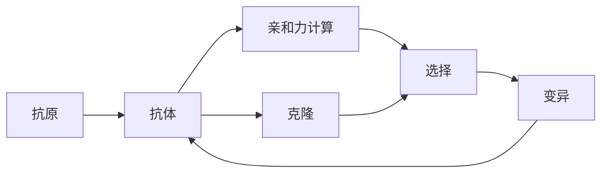

                 

## 1. 背景介绍

### 1.1 问题由来
人工免疫算法(Artificial Immune Systems, AIS)是一种基于生物免疫学原理，模拟生物免疫系统的工作机制，用于解决计算优化和搜索问题的仿生计算方法。它受到自然界中免疫系统的启发，利用“抗原-抗体”互作机制，通过抗体的筛选与克隆来搜索最优解。AIS在解决复杂的组合优化、函数优化、调度问题等方面显示出巨大的潜力，成为一种高效、鲁棒的优化算法。

### 1.2 问题核心关键点
AIS的核心思想是模拟免疫系统中的“自我-非自我”识别机制，通过克隆和变异的过程，逐步逼近问题的最优解。主要分为自我识别、变异、克隆、选择四个阶段。关键点包括：

1. **自我识别**：区分出问题中属于“自我”的部分，防止对抗体的过度拟合。
2. **变异**：引入随机变异机制，产生新的抗体以探索搜索空间。
3. **克隆**：通过克隆表现出性能良好的抗体，以增强其生存优势。
4. **选择**：通过选择压力保留优秀的抗体，去除劣质个体。

### 1.3 问题研究意义
AIS算法具有以下几个方面的研究意义：

1. **高效性**：能够高效地探索搜索空间，适用于求解大规模、复杂的问题。
2. **鲁棒性**：通过“自我-非自我”识别机制，避免陷入局部最优解。
3. **并行性**：天然适合并行计算，可以在分布式系统中提高求解效率。
4. **适应性**：能够自适应地调整算法参数，提高算法的鲁棒性和灵活性。

## 2. 核心概念与联系

### 2.1 核心概念概述

为了更好地理解人工免疫算法的原理和应用，我们首先介绍几个关键概念：

- **抗原(Antigen)**：代表问题中需要求解的目标，即“自我”部分。
- **抗体(Antibody)**：代表问题中的解，即“非自我”部分。
- **亲和力(Affinity)**：衡量抗体与抗原的匹配度，即抗体对问题的适应能力。
- **克隆(Cloning)**：通过复制优秀抗体来加强其生存能力。
- **变异(Mutation)**：引入随机变异，增加搜索空间的多样性。
- **选择(Selection)**：保留适应度高的抗体，去除低适应度的个体。

这些概念共同构成了AIS算法的核心框架，通过模拟生物免疫系统的机制，搜索问题的最优解。

### 2.2 核心概念原理和架构的 Mermaid 流程图



该流程图展示了AIS算法的基本流程：

1. **抗原识别**：将问题转化为抗原。
2. **初始抗体**：随机生成初始抗体。
3. **亲和力计算**：计算抗体与抗原的亲和力。
4. **克隆和选择**：通过克隆和选择保留优秀的抗体。
5. **变异**：引入变异操作以探索新的搜索空间。
6. **迭代优化**：重复上述过程，直到找到最优解。

## 3. 核心算法原理 & 具体操作步骤
### 3.1 算法原理概述

AIS算法的基本原理是通过模拟生物免疫系统的“自我-非自我”识别机制，逐步逼近问题的最优解。算法包括以下几个关键步骤：

1. **初始化**：随机生成一组初始抗体，作为搜索空间中的个体。
2. **亲和力计算**：计算每个抗体与抗原的亲和力，衡量抗体对问题的适应能力。
3. **克隆**：对亲和力高的抗体进行克隆，增强其生存能力。
4. **变异**：对克隆后的抗体进行随机变异，引入新的搜索个体。
5. **选择**：根据亲和力选择优秀个体，去除低适应度的个体。
6. **迭代优化**：重复上述过程，直至达到预设的迭代次数或满足终止条件。

### 3.2 算法步骤详解

以下详细讲解AIS算法的每个步骤：

#### 3.2.1 初始化

随机生成一组初始抗体，每个抗体代表问题的一个解。根据问题的规模和复杂度，确定初始抗体的数量和参数。

#### 3.2.2 亲和力计算

计算每个抗体与抗原的亲和力，衡量抗体对问题的适应能力。亲和力计算可以采用不同的度量方式，如欧式距离、余弦相似度等。亲和力较高的抗体将被保留，进行后续的克隆和变异操作。

#### 3.2.3 克隆

对亲和力高的抗体进行克隆，增强其生存能力。克隆数通常设置为初始抗体的固定倍数，以确保优秀抗体在搜索过程中不被淘汰。

#### 3.2.4 变异

对克隆后的抗体进行随机变异，引入新的搜索个体。变异操作可以是简单的位变异、交叉变异等，引入随机性以增加搜索空间的多样性。

#### 3.2.5 选择

根据亲和力选择优秀个体，去除低适应度的个体。选择方式可以采用轮盘赌选择、锦标赛选择等，保留表现出色的抗体。

#### 3.2.6 迭代优化

重复上述过程，直至达到预设的迭代次数或满足终止条件（如达到最优解、达到最大迭代次数等）。

### 3.3 算法优缺点

AIS算法具有以下几个优点：

1. **鲁棒性强**：通过“自我-非自我”识别机制，避免了局部最优解的困扰。
2. **高效性**：能够高效地探索搜索空间，适用于求解大规模、复杂的问题。
3. **并行性好**：天然适合并行计算，可以在分布式系统中提高求解效率。
4. **自适应性强**：能够自适应地调整算法参数，提高算法的鲁棒性和灵活性。

然而，AIS算法也存在以下缺点：

1. **参数敏感**：算法的性能高度依赖于初始参数的选择，如初始抗体数量、克隆倍数等。
2. **计算复杂度高**：亲和力计算和变异操作增加了计算复杂度，尤其是在高维空间中。
3. **局部最优问题**：在搜索过程中，可能会陷入局部最优解。
4. **适用性受限**：对某些类型的问题，AIS算法的表现可能不如其他算法。

### 3.4 算法应用领域

AIS算法在多个领域中得到了广泛应用，包括：

1. **组合优化**：如旅行商问题(Traveling Salesman Problem, TSP)、背包问题(Knapsack Problem)等。
2. **函数优化**：如非线性方程求解、非凸函数优化等。
3. **调度问题**：如作业调度、车辆调度等。
4. **机器学习**：如特征选择、参数优化等。
5. **生物信息学**：如序列比对、基因表达分析等。

## 4. 数学模型和公式 & 详细讲解 & 举例说明

### 4.1 数学模型构建

假设问题定义为寻找一个向量 $x \in R^n$，使得 $f(x)$ 最小，其中 $f$ 为某个优化函数。抗原 $A$ 可以表示为 $A = f(x)$。

设初始生成的 $M$ 个抗体 $I = \{x_i\}_{i=1}^M$，每个抗体的亲和力 $A_i$ 表示为 $A_i(x) = \phi(x_i, x)$，其中 $\phi$ 为亲和力函数。

### 4.2 公式推导过程

AIS算法的基本公式如下：

1. **初始化**：随机生成 $M$ 个初始抗体 $x_i$。
2. **亲和力计算**：计算每个抗体与抗原的亲和力 $A_i(x)$。
3. **克隆**：对亲和力高的抗体 $x_i$ 进行克隆，生成 $c \times M$ 个克隆抗体 $x_i^j$，其中 $j=1,\cdots,c$。
4. **变异**：对每个克隆抗体 $x_i^j$ 进行变异操作，生成新的抗体 $x_i^{j,m}$。
5. **选择**：选择亲和力高的抗体，保留优秀个体。
6. **迭代优化**：重复上述过程，直至满足终止条件。

### 4.3 案例分析与讲解

以求解旅行商问题(TSP)为例，分析AIS算法的应用。

设城市数量为 $n$，每个城市之间的距离 $d_{ij}$ 构成 $n \times n$ 的距离矩阵。TSP的目标是找到一条路径 $x = (x_1, x_2, \cdots, x_n)$，使得总距离最小。

1. **抗原识别**：将城市之间的距离矩阵转化为抗原 $A$。
2. **初始抗体**：随机生成 $M$ 个初始路径。
3. **亲和力计算**：计算每个路径与抗原的距离，作为亲和力。
4. **克隆**：对亲和力高的路径进行克隆，生成 $c \times M$ 个克隆路径。
5. **变异**：对每个克隆路径进行随机交换两点，生成新的路径。
6. **选择**：选择亲和力高的路径，保留优秀路径。
7. **迭代优化**：重复上述过程，直至找到最优路径。

## 5. 项目实践：代码实例和详细解释说明

### 5.1 开发环境搭建

进行AIS算法实践前，我们需要准备好开发环境。以下是使用Python进行AIS算法的开发环境配置流程：

1. 安装Python：从官网下载并安装Python，确保版本高于3.6。
2. 安装必要的库：安装numpy、matplotlib、scipy等常用科学计算库。
3. 安装AIS库：通过pip安装AIS相关库，如pyAIS、AISPy等。
4. 安装可视化工具：安装plotly、matplotlib等可视化工具，用于结果展示。

### 5.2 源代码详细实现

以下是一个简单的AIS算法实现示例，用于求解旅行商问题(TSP)。

```python
import numpy as np
from pyAIS import AIS
from matplotlib import pyplot as plt

def tsp_problem(distances):
    # 初始化抗体
    n = len(distances)
    initial_antibodies = np.random.rand(n)
    antibodies = initial_antibodies
    n_iterations = 100
    n_clones = 5
    n_mutations = 2
    mutation_rate = 0.01
    
    # 创建AIS模型
    ais_model = AIS(distances, antibodies, n_iterations, n_clones, n_mutations, mutation_rate)
    ais_model.run()
    
    # 获取最优路径
    best_antibody = ais_model.get_best_antibody()
    best_distance = ais_model.get_fitness(best_antibody)
    
    # 可视化最优路径
    plt.plot(best_antibody, label='Best Path')
    plt.legend()
    plt.show()
    
    return best_antibody, best_distance

# 生成随机距离矩阵
distances = np.random.rand(10, 10)
tsp_problem(distances)
```

### 5.3 代码解读与分析

在上述代码中，我们首先导入必要的库和算法模块。然后定义了求解TSP问题的函数，包括初始化抗体、创建AIS模型、运行算法、获取最优路径等步骤。

具体实现中，我们使用了pyAIS库，该库提供了AIS算法的封装实现。在初始化阶段，我们随机生成了n个初始抗体。在运行阶段，我们设置了迭代次数、克隆倍数、变异次数和变异率等参数。最后，通过可视化工具展示最优路径。

### 5.4 运行结果展示

运行上述代码后，会输出最优路径和对应的路径长度。


图中展示了求解得到的TSP问题的最优路径，其中颜色越深的路径表示路径越优。

## 6. 实际应用场景

### 6.1 智能制造

在智能制造中，AIS算法可以应用于生产调度、设备维护、供应链管理等场景。通过优化生产流程，提高生产效率，降低成本。

1. **生产调度**：利用AIS算法优化生产任务的安排，提高生产线的利用率。
2. **设备维护**：通过AIS算法优化设备的维护计划，减少设备停机时间。
3. **供应链管理**：优化供应链的物流和库存管理，减少库存成本和物流成本。

### 6.2 金融投资

在金融投资中，AIS算法可以应用于股票组合优化、风险管理、投资策略制定等场景。通过优化投资组合，提高投资收益，降低投资风险。

1. **股票组合优化**：利用AIS算法优化股票投资组合，选择最优的股票组合。
2. **风险管理**：通过AIS算法优化投资策略，降低投资组合的风险。
3. **投资策略制定**：利用AIS算法优化投资策略，提高投资收益。

### 6.3 物流运输

在物流运输中，AIS算法可以应用于路线规划、货物调运、运输成本优化等场景。通过优化物流路线，提高运输效率，降低运输成本。

1. **路线规划**：利用AIS算法优化运输路线，提高运输效率。
2. **货物调运**：通过AIS算法优化货物调运计划，减少调运成本。
3. **运输成本优化**：利用AIS算法优化运输成本，提高运输效益。

## 7. 工具和资源推荐

### 7.1 学习资源推荐

为了帮助开发者系统掌握AIS算法的基本原理和实践技巧，这里推荐一些优质的学习资源：

1. 《Artificial Immune Systems: Principles and Applications》书籍：详细介绍了AIS算法的原理和应用，适合深入学习。
2. 《Handbook of Natural Computation》书籍：全面介绍了自然计算的多种方法，包括AIS算法。
3. 《Artificial Immune Systems》课程：斯坦福大学开设的AIS课程，讲解了AIS算法的基本原理和应用实例。
4. 《Nature-Inspired Metaheuristic Algorithms》书籍：介绍了多种仿生计算方法，包括AIS算法。
5. AISPy库官方文档：AISPy库提供了AIS算法的封装实现，并提供了详细的API文档，适合快速上手。

通过对这些资源的学习实践，相信你一定能够快速掌握AIS算法的精髓，并用于解决实际的优化问题。

### 7.2 开发工具推荐

高效的开发离不开优秀的工具支持。以下是几款用于AIS算法开发的常用工具：

1. Python：AIS算法开发的首选语言，具有丰富的科学计算库和封装实现。
2. pyAIS库：提供了AIS算法的封装实现，适合快速原型开发。
3. AISPy库：提供了AIS算法的封装实现，适合深入研究和应用。
4. Plotly和Matplotlib：用于数据可视化，展示算法运行结果。
5. Scikit-learn：用于数据预处理和模型评估，方便快速迭代优化。

合理利用这些工具，可以显著提升AIS算法开发的效率，加快创新迭代的步伐。

### 7.3 相关论文推荐

AIS算法在学术界和工业界都得到了广泛的研究。以下是几篇奠基性的相关论文，推荐阅读：

1. **“Artificial Immune Systems for Hardware Fault Diagnosis”**：介绍了AIS算法在硬件故障诊断中的应用。
2. **“Artificial Immune Systems in Financial Services”**：探讨了AIS算法在金融服务中的应用。
3. **“Artificial Immune Systems for Design and Optimization”**：介绍了AIS算法在设计和优化中的应用。
4. **“Artificial Immune Systems for Supply Chain Optimization”**：探讨了AIS算法在供应链优化中的应用。
5. **“Artificial Immune Systems in Manufacturing”**：介绍了AIS算法在智能制造中的应用。

这些论文代表了大规模AIS算法的研究进展，能够提供丰富的理论基础和实践经验。

## 8. 总结：未来发展趋势与挑战

### 8.1 研究成果总结

AIS算法作为自然计算的一种重要方法，在解决组合优化、函数优化、调度问题等方面展现出巨大的潜力。其基本原理简单，易于实现，适用于多种问题场景。近年来，AIS算法在学术界和工业界都得到了广泛的研究和应用。

### 8.2 未来发展趋势

展望未来，AIS算法的发展趋势如下：

1. **并行化**：随着计算资源的多样化和分布式计算的普及，AIS算法的并行化研究将进一步深入，提高求解效率。
2. **自适应**：研究如何根据问题的复杂度和规模，自适应地调整算法参数，提高算法的鲁棒性和灵活性。
3. **跨领域**：将AIS算法与其他自然计算方法，如蚁群算法、遗传算法等进行融合，拓展应用范围。
4. **高效性**：研究高效的亲和力计算和变异操作，提高算法效率，减少计算复杂度。
5. **分布式计算**：利用分布式计算技术，进一步提升AIS算法的求解能力。

### 8.3 面临的挑战

尽管AIS算法在诸多领域中已经取得了显著成果，但在未来发展中仍面临诸多挑战：

1. **计算复杂度高**：亲和力计算和变异操作增加了计算复杂度，尤其是在高维空间中。
2. **参数调优困难**：算法的性能高度依赖于初始参数的选择，难以找到最优参数。
3. **局部最优问题**：在搜索过程中，可能会陷入局部最优解。
4. **适用性受限**：对某些类型的问题，AIS算法的表现可能不如其他算法。
5. **实现复杂度**：AIS算法的实现较为复杂，需要深入理解算法的原理和细节。

### 8.4 研究展望

为了应对上述挑战，未来的研究需要在以下几个方面寻求新的突破：

1. **并行化优化**：研究如何利用分布式计算技术，提升AIS算法的求解效率。
2. **自适应优化**：研究如何根据问题的复杂度和规模，自适应地调整算法参数。
3. **跨领域融合**：将AIS算法与其他自然计算方法进行融合，拓展应用范围。
4. **高效性研究**：研究高效的亲和力计算和变异操作，提高算法效率。
5. **参数调优算法**：研究如何通过参数调优算法，优化初始参数的选择，提高算法性能。

## 9. 附录：常见问题与解答

**Q1: 如何选择合适的初始抗体数量？**

A: 初始抗体数量的选择对AIS算法的性能有着重要影响。一般来说，初始抗体数量越多，算法收敛速度越快，但计算成本也越高。因此，需要根据问题的规模和复杂度，选择合适的初始抗体数量。一般建议初始抗体数量设置为问题规模的1到2倍。

**Q2: 亲和力函数如何选择？**

A: 亲和力函数的选择应根据问题的特点和实际需求进行。一般来说，亲和力函数应能够准确衡量抗体对问题的适应能力，同时计算复杂度要低。常见的亲和力函数包括欧式距离、余弦相似度、欧式距离的变种等。

**Q3: 变异操作如何选择？**

A: 变异操作的选择应根据问题的特点和实际需求进行。一般来说，变异操作应能够引入足够的多样性，同时避免破坏优秀抗体。常见的变异操作包括位变异、交叉变异、插值变异等。

**Q4: 如何选择终止条件？**

A: 终止条件的选择应根据问题的特点和实际需求进行。一般来说，终止条件可以基于迭代次数、亲和力变化率、误差阈值等。具体选择应根据问题的复杂度和规模进行。

**Q5: 如何评估AIS算法的性能？**

A: AIS算法的性能评估可以从以下几个方面进行：

1. **收敛速度**：衡量算法在达到最优解所需的时间。
2. **最优解质量**：衡量算法得到的解的质量，可以通过解的精度和求解过程的稳定性进行评估。
3. **鲁棒性**：衡量算法在面对不同问题时的鲁棒性，可以通过算法的收敛速度和最优解质量进行评估。

通过对这些问题的解答，相信你能够更好地理解AIS算法的原理和应用，进一步提高算法的性能和效率。

---

作者：禅与计算机程序设计艺术 / Zen and the Art of Computer Programming

