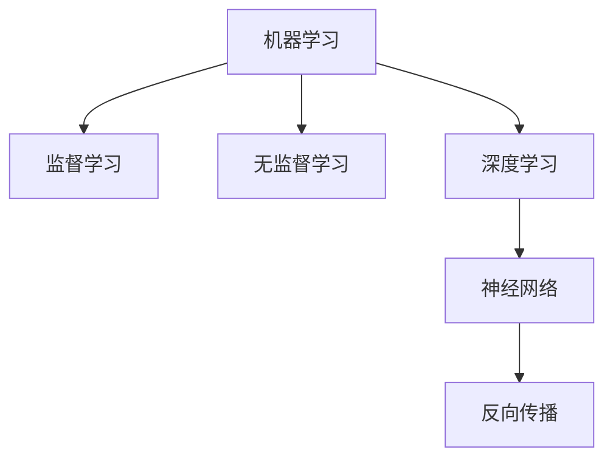

                 

# 人工智能(Artificial Intelligence) - 原理与代码实例讲解

> 关键词：人工智能,算法,机器学习,深度学习,神经网络,计算机视觉,自然语言处理,NLP

## 1. 背景介绍

### 1.1 问题由来

人工智能（Artificial Intelligence, AI）是指通过模拟人类智能行为，使机器能够执行复杂的任务，从而解决实际问题。AI的研究涉及计算机科学、数学、统计学、认知科学等多个学科，涵盖了机器学习（Machine Learning, ML）、深度学习（Deep Learning, DL）、自然语言处理（Natural Language Processing, NLP）、计算机视觉（Computer Vision, CV）等多个领域。

近年来，AI技术迅猛发展，已经在无人驾驶、语音识别、智能推荐、智能客服等多个领域展现了强大的应用潜力。AI的发展离不开算法和技术的支持，其中机器学习是AI的核心技术之一。

### 1.2 问题核心关键点

机器学习通过让计算机学习数据中的规律，从而实现自动化决策和预测。其核心在于通过算法和模型，对输入数据进行映射和转化，生成对任务的预测或分类。机器学习主要分为监督学习（Supervised Learning）、无监督学习（Unsupervised Learning）和强化学习（Reinforcement Learning）等几种形式。

监督学习通过标注数据训练模型，使其能够对新数据进行分类或预测。无监督学习则试图从数据中挖掘出隐藏的模式和结构，常用于聚类、降维等任务。强化学习通过奖励机制，训练模型在特定环境中进行最优决策。

机器学习算法和模型种类繁多，如决策树、随机森林、支持向量机、神经网络等，每种算法和模型都有其特定的应用场景。

### 1.3 问题研究意义

研究机器学习算法和模型的原理与实现，对于推动AI技术的发展具有重要意义：

1. 算法和模型优化：深入理解各种算法的原理和特点，有助于提升算法效率和效果。
2. 代码实现：通过代码实例讲解，帮助开发者更好地理解和实现机器学习算法。
3. 应用落地：学习机器学习技术，可以在实际项目中实现自动化和智能化决策，提高工作效率。
4. 创新探索：通过算法改进和模型优化，推动AI技术在更多领域的应用和突破。

## 2. 核心概念与联系

### 2.1 核心概念概述

为更好地理解机器学习的原理与实现，本节将介绍几个核心概念：

- 机器学习（Machine Learning, ML）：通过数据训练模型，实现对新数据的预测或分类。
- 监督学习（Supervised Learning）：利用标注数据训练模型，使其能够对新数据进行预测或分类。
- 无监督学习（Unsupervised Learning）：从数据中挖掘隐藏的模式和结构，无需标注数据。
- 深度学习（Deep Learning, DL）：一种特殊的机器学习技术，通过多层神经网络学习数据中的复杂表示。
- 神经网络（Neural Network）：深度学习的核心模型，由多个层次的非线性变换单元组成。
- 反向传播算法（Backpropagation）：深度学习的关键算法，用于计算模型参数的梯度。

这些核心概念之间的逻辑关系可以通过以下Mermaid流程图来展示：



这个流程图展示了机器学习的主要分支和关键算法：

1. 机器学习通过标注数据或无标注数据训练模型。
2. 监督学习利用标注数据训练模型，预测或分类新数据。
3. 无监督学习从数据中挖掘隐藏模式，无需标注数据。
4. 深度学习采用多层神经网络学习复杂表示。
5. 神经网络是深度学习的核心模型。
6. 反向传播算法用于计算模型参数梯度。

这些核心概念共同构成了机器学习的理论框架，为其在各个领域的应用提供了基础。

## 3. 核心算法原理 & 具体操作步骤

### 3.1 算法原理概述

机器学习算法和模型具有多样性，本节以监督学习中的神经网络为例，介绍其核心原理和操作步骤。

神经网络通过多层非线性变换，将输入数据映射为输出。其核心思想是利用多层神经元对数据进行特征提取和表示，从而实现复杂的模式识别和分类。

以多层感知器（Multilayer Perceptron, MLP）为例，其结构如下图所示：

```
输入层 -> 隐藏层 -> 输出层
```

其中，隐藏层由多个神经元组成，每个神经元对输入数据进行加权求和，并通过激活函数输出。激活函数引入非线性特性，使得神经网络可以学习非线性关系。

神经网络通过反向传播算法更新模型参数，最小化损失函数。损失函数衡量模型预测与真实标签之间的差异，通常采用交叉熵损失或均方误差损失等。反向传播算法通过链式法则，计算损失函数对参数的梯度，并利用梯度下降等优化算法更新参数，使得模型逐步收敛于最优解。

### 3.2 算法步骤详解

以一个简单的分类任务为例，介绍神经网络模型的构建和训练过程：

**Step 1: 数据准备**

首先，准备训练集和测试集，并对其进行预处理，如归一化、标准化等。训练集用于训练模型，测试集用于评估模型性能。

```python
import numpy as np

# 生成随机数据
X_train = np.random.randn(100, 10)
y_train = np.random.randint(0, 2, 100)

# 准备测试数据
X_test = np.random.randn(100, 10)
y_test = np.random.randint(0, 2, 100)
```

**Step 2: 定义模型**

定义一个简单的多层感知器模型，包括输入层、隐藏层和输出层。

```python
import tensorflow as tf

# 定义输入和输出
input_dim = 10
output_dim = 1
hidden_dim = 20

# 定义模型
def model(X, y):
    # 输入层
    x = tf.keras.layers.Dense(hidden_dim, activation='relu', input_shape=(input_dim,))(X)
    # 隐藏层
    x = tf.keras.layers.Dense(hidden_dim, activation='relu')(x)
    # 输出层
    x = tf.keras.layers.Dense(output_dim, activation='sigmoid')(x)
    return x
```

**Step 3: 定义损失函数和优化器**

定义交叉熵损失函数和Adam优化器。

```python
# 定义损失函数和优化器
loss_fn = tf.keras.losses.BinaryCrossentropy()
optimizer = tf.keras.optimizers.Adam()
```

**Step 4: 训练模型**

使用训练集数据进行模型训练，调整模型参数。

```python
# 定义训练过程
def train_model(X_train, y_train, X_test, y_test):
    # 初始化模型
    model = tf.keras.Sequential([
        tf.keras.layers.Dense(hidden_dim, activation='relu', input_shape=(input_dim,)),
        tf.keras.layers.Dense(hidden_dim, activation='relu'),
        tf.keras.layers.Dense(output_dim, activation='sigmoid')
    ])
    
    # 编译模型
    model.compile(optimizer=optimizer, loss=loss_fn, metrics=['accuracy'])
    
    # 训练模型
    model.fit(X_train, y_train, epochs=10, batch_size=32, validation_data=(X_test, y_test))
    
    # 评估模型
    test_loss, test_acc = model.evaluate(X_test, y_test)
    print('Test accuracy:', test_acc)
```

**Step 5: 测试和预测**

使用测试集数据评估模型性能，并进行预测。

```python
# 训练模型
train_model(X_train, y_train, X_test, y_test)
```

### 3.3 算法优缺点

神经网络具有以下优点：

1. 可扩展性：神经网络的层数和神经元数量可以灵活调整，适应不同复杂度的任务。
2. 泛化能力强：神经网络能够学习复杂的数据表示，具有较强的泛化能力。
3. 自适应性：神经网络可以适应不同领域和数据类型的任务。

同时，神经网络也存在以下缺点：

1. 计算量大：神经网络需要大量的计算资源进行训练，特别是在大型数据集上。
2. 过拟合风险高：神经网络容易过拟合，特别是在数据量不足或模型复杂度较高时。
3. 参数调优困难：神经网络需要调整多个超参数，如学习率、层数、神经元数量等，调整不当可能导致性能下降。

### 3.4 算法应用领域

神经网络广泛应用于各种领域，如计算机视觉、自然语言处理、语音识别、推荐系统等。具体应用包括：

- 图像分类：使用卷积神经网络（Convolutional Neural Network, CNN）对图像进行分类。
- 物体检测：使用目标检测神经网络（如Faster R-CNN）检测图像中的物体位置和类别。
- 语音识别：使用循环神经网络（Recurrent Neural Network, RNN）或长短期记忆网络（Long Short-Term Memory, LSTM）进行语音识别。
- 机器翻译：使用序列到序列神经网络（Sequence-to-Sequence, Seq2Seq）进行机器翻译。
- 文本生成：使用生成对抗网络（Generative Adversarial Network, GAN）或变分自编码器（Variational Autoencoder, VAE）进行文本生成。

## 4. 数学模型和公式 & 详细讲解 & 举例说明

### 4.1 数学模型构建

以多层感知器为例，介绍其数学模型构建过程。

设输入向量为 $x \in \mathbb{R}^{d_x}$，隐藏层节点数为 $d_h$，输出层节点数为 $d_y$，激活函数为 $\sigma$。

- 输入层：$x \in \mathbb{R}^{d_x}$
- 隐藏层：$h = \sigma(\mathbf{W}_hx + \mathbf{b}_h) \in \mathbb{R}^{d_h}$
- 输出层：$y = \sigma(\mathbf{W}_yh + \mathbf{b}_y) \in \mathbb{R}^{d_y}$

其中，$\mathbf{W}_h$ 和 $\mathbf{b}_h$ 为隐藏层权重和偏置，$\mathbf{W}_y$ 和 $\mathbf{b}_y$ 为输出层权重和偏置。

### 4.2 公式推导过程

以二分类任务为例，推导神经网络模型和反向传播算法的公式。

设输入为 $x$，目标输出为 $y$，输出为 $y'$。

**前向传播**

$$
y' = \sigma(\mathbf{W}_1\sigma(\mathbf{W}_0x + \mathbf{b}_0) + \mathbf{b}_1)
$$

**损失函数**

$$
L = -\frac{1}{n}\sum_{i=1}^n(y_i\log y_i' + (1-y_i)\log(1-y_i'))
$$

**反向传播算法**

$$
\frac{\partial L}{\partial \mathbf{W}_0} = \frac{1}{n}\sum_{i=1}^n(\mathbf{W}_1^T \frac{\partial L}{\partial y'})(\mathbf{W}_0^T\frac{\partial y'}{\partial x}) + \frac{\partial L}{\partial \mathbf{b}_0}
$$

**详细讲解**

通过上述公式，可以看到神经网络的训练过程包括前向传播和反向传播两个步骤。前向传播将输入数据映射为输出，反向传播计算损失函数对模型参数的梯度，并利用梯度下降等优化算法更新参数，使得模型逐步收敛于最优解。

### 4.3 案例分析与讲解

以手写数字识别任务为例，分析神经网络模型的构建和训练过程。

**Step 1: 数据准备**

首先，准备手写数字数据集，将其标准化为灰度图像。

```python
import matplotlib.pyplot as plt
from tensorflow.keras.datasets import mnist

# 加载MNIST数据集
(x_train, y_train), (x_test, y_test) = mnist.load_data()

# 标准化数据
x_train = x_train.reshape(-1, 28*28) / 255.0
x_test = x_test.reshape(-1, 28*28) / 255.0

# 显示手写数字样本
plt.imshow(x_train[0], cmap='gray')
plt.title('Training Image')
plt.show()
```

**Step 2: 定义模型**

定义一个简单的多层感知器模型，包括输入层、隐藏层和输出层。

```python
from tensorflow.keras.layers import Dense

# 定义模型
model = tf.keras.Sequential([
    Dense(64, activation='relu', input_shape=(784,)),
    Dense(64, activation='relu'),
    Dense(10, activation='softmax')
])
```

**Step 3: 定义损失函数和优化器**

定义交叉熵损失函数和Adam优化器。

```python
# 定义损失函数和优化器
loss_fn = tf.keras.losses.SparseCategoricalCrossentropy(from_logits=True)
optimizer = tf.keras.optimizers.Adam()
```

**Step 4: 训练模型**

使用训练集数据进行模型训练，调整模型参数。

```python
# 定义训练过程
def train_model(X_train, y_train, X_test, y_test):
    # 初始化模型
    model = tf.keras.Sequential([
        Dense(64, activation='relu', input_shape=(784,)),
        Dense(64, activation='relu'),
        Dense(10, activation='softmax')
    ])
    
    # 编译模型
    model.compile(optimizer=optimizer, loss=loss_fn, metrics=['accuracy'])
    
    # 训练模型
    model.fit(X_train, y_train, epochs=10, batch_size=64, validation_data=(X_test, y_test))
    
    # 评估模型
    test_loss, test_acc = model.evaluate(X_test, y_test)
    print('Test accuracy:', test_acc)
```

**Step 5: 测试和预测**

使用测试集数据评估模型性能，并进行预测。

```python
# 训练模型
train_model(x_train, y_train, x_test, y_test)
```

## 5. 项目实践：代码实例和详细解释说明

### 5.1 开发环境搭建

在进行机器学习实践前，我们需要准备好开发环境。以下是使用Python进行TensorFlow开发的环境配置流程：

1. 安装Anaconda：从官网下载并安装Anaconda，用于创建独立的Python环境。

2. 创建并激活虚拟环境：
```bash
conda create -n tf-env python=3.8 
conda activate tf-env
```

3. 安装TensorFlow：根据CUDA版本，从官网获取对应的安装命令。例如：
```bash
conda install tensorflow=2.6 -c conda-forge -c pypi
```

4. 安装TensorBoard：
```bash
pip install tensorboard
```

5. 安装TensorFlow Addons：
```bash
pip install tensorflow-addons
```

完成上述步骤后，即可在`tf-env`环境中开始机器学习实践。

### 5.2 源代码详细实现

下面我们以手写数字识别任务为例，给出使用TensorFlow对多层感知器模型进行训练的PyTorch代码实现。

```python
import tensorflow as tf
from tensorflow.keras.datasets import mnist
from tensorflow.keras.utils import to_categorical

# 加载MNIST数据集
(x_train, y_train), (x_test, y_test) = mnist.load_data()

# 标准化数据
x_train = x_train.reshape(-1, 28*28) / 255.0
x_test = x_test.reshape(-1, 28*28) / 255.0

# 定义模型
model = tf.keras.Sequential([
    tf.keras.layers.Dense(64, activation='relu', input_shape=(784,)),
    tf.keras.layers.Dense(64, activation='relu'),
    tf.keras.layers.Dense(10, activation='softmax')
])

# 定义损失函数和优化器
loss_fn = tf.keras.losses.SparseCategoricalCrossentropy(from_logits=True)
optimizer = tf.keras.optimizers.Adam()

# 编译模型
model.compile(optimizer=optimizer, loss=loss_fn, metrics=['accuracy'])

# 训练模型
model.fit(x_train, to_categorical(y_train), epochs=10, batch_size=64, validation_data=(x_test, to_categorical(y_test)))

# 评估模型
test_loss, test_acc = model.evaluate(x_test, to_categorical(y_test))
print('Test accuracy:', test_acc)
```

以上就是使用TensorFlow对多层感知器模型进行手写数字识别任务训练的完整代码实现。可以看到，TensorFlow提供了丰富的API和工具，使得机器学习模型的构建和训练变得非常便捷。

### 5.3 代码解读与分析

让我们再详细解读一下关键代码的实现细节：

**MNIST数据集**：
- `mnist.load_data()`：加载MNIST手写数字数据集，包含60,000个训练样本和10,000个测试样本。

**数据标准化**：
- `x_train = x_train.reshape(-1, 28*28) / 255.0`：将28x28的图像矩阵展开为一维向量，并除以255进行归一化处理。

**模型定义**：
- `tf.keras.layers.Dense(64, activation='relu', input_shape=(784,))`：定义一个64个神经元的全连接层，使用ReLU激活函数。
- `tf.keras.layers.Dense(64, activation='relu')`：定义一个64个神经元的全连接层，使用ReLU激活函数。
- `tf.keras.layers.Dense(10, activation='softmax')`：定义一个10个神经元的全连接层，使用softmax激活函数，输出10个类别的概率分布。

**损失函数和优化器**：
- `tf.keras.losses.SparseCategoricalCrossentropy(from_logits=True)`：定义交叉熵损失函数，用于多分类任务。
- `tf.keras.optimizers.Adam()`：定义Adam优化器，用于模型参数更新。

**模型编译和训练**：
- `model.compile(optimizer=optimizer, loss=loss_fn, metrics=['accuracy'])`：编译模型，指定优化器和损失函数，并添加准确率作为评估指标。
- `model.fit(x_train, to_categorical(y_train), epochs=10, batch_size=64, validation_data=(x_test, to_categorical(y_test)))`：训练模型，指定训练集、测试集和训练参数。

**模型评估**：
- `test_loss, test_acc = model.evaluate(x_test, to_categorical(y_test))`：评估模型，计算测试集上的损失和准确率。

可以看到，TensorFlow使得机器学习模型的实现变得非常简洁高效。开发者可以将更多精力放在模型设计和优化上，而不必过多关注底层的实现细节。

当然，工业级的系统实现还需考虑更多因素，如模型的保存和部署、超参数的自动搜索、更灵活的任务适配层等。但核心的机器学习模型构建和训练流程基本与此类似。

## 6. 实际应用场景

### 6.1 智能推荐系统

智能推荐系统通过分析用户的行为数据，推荐用户可能感兴趣的商品或内容。机器学习技术在智能推荐系统中发挥了重要作用，如协同过滤、内容推荐等。

以协同过滤为例，其基本思想是通过用户对商品或内容的评分数据，计算用户和物品之间的相似度，从而推荐其他用户可能喜欢的商品或内容。协同过滤可以通过邻域权重矩阵计算相似度，也可以使用矩阵分解方法进行隐式推荐。

在实际应用中，可以根据用户的历史行为数据，构建协同过滤模型，并使用多臂老虎机（Multi-Armed Bandit）算法进行在线推荐。通过不断优化模型参数，提升推荐效果，实现个性化推荐。

### 6.2 金融风险控制

金融风险控制是金融行业的重要任务，机器学习技术在其中得到了广泛应用。金融行业通过机器学习模型，对客户信用、市场舆情等数据进行分析，预测潜在的风险和欺诈行为，制定相应的控制策略。

以信用评分为例，通过收集客户的财务数据、交易记录等信息，构建多变量回归模型，预测客户的信用风险。模型可以包括特征选择、模型训练、模型评估等步骤，并根据预测结果进行风险控制和决策。

### 6.3 医疗诊断

医疗诊断是医疗行业的重要任务，机器学习技术在其中也发挥了重要作用。通过分析患者的病历、基因数据等信息，构建诊断模型，预测患者的病情和预后，辅助医生进行诊断和治疗。

以癌症诊断为例，通过收集患者的基因数据、病理数据等信息，构建分类模型，预测患者是否患有癌症，并根据预测结果制定治疗方案。模型可以包括特征选择、模型训练、模型评估等步骤，并根据预测结果进行诊断和治疗。

### 6.4 未来应用展望

随着机器学习技术的不断发展，其应用范围将不断扩展，为各行各业带来更多的创新和变革。

在智慧城市中，通过机器学习技术，可以实现交通管理、环境监测、城市安全等场景的智能化管理。在农业领域，通过机器学习技术，可以实现智能种植、病虫害监测等，提升农业生产效率。

此外，机器学习技术还将应用于更多领域，如自动驾驶、机器人、智能家居等，推动智能化进程。未来，机器学习技术将在更多领域得到广泛应用，为人类生活带来更多的便利和可能性。

## 7. 工具和资源推荐

### 7.1 学习资源推荐

为了帮助开发者系统掌握机器学习的原理与实现，这里推荐一些优质的学习资源：

1. 《机器学习实战》：一本经典的机器学习入门书籍，通过实践项目，帮助读者理解机器学习的基本概念和实现。
2. Coursera《机器学习》课程：由斯坦福大学开设的机器学习入门课程，有Lecture视频和配套作业，适合初学者入门。
3. DeepLearning.AI《深度学习专项课程》：由Andrew Ng等人主讲，涵盖深度学习的基础理论和实践应用，适合进阶学习。
4. arXiv：机器学习和深度学习的顶级研究论文网站，可以了解最新的研究进展和成果。
5. Kaggle：机器学习和深度学习的数据科学竞赛平台，可以通过参加比赛，提升实战能力。

通过对这些资源的学习实践，相信你一定能够快速掌握机器学习技术，并用于解决实际的业务问题。

### 7.2 开发工具推荐

高效的开发离不开优秀的工具支持。以下是几款用于机器学习开发的常用工具：

1. TensorFlow：由Google主导开发的开源深度学习框架，生产部署方便，适合大规模工程应用。
2. PyTorch：由Facebook主导开发的深度学习框架，灵活动态的计算图，适合快速迭代研究。
3. Scikit-Learn：一个Python机器学习库，提供了丰富的机器学习算法和工具，适合中小规模的数据分析和建模。
4. Keras：一个高层次的深度学习库，适合快速搭建深度学习模型，提供了丰富的预训练模型和API。
5. Jupyter Notebook：一个交互式编程环境，适合数据探索、模型训练和结果展示。
6. VS Code：一个轻量级的代码编辑器，支持Python、R等多种语言，适合代码编写和调试。

合理利用这些工具，可以显著提升机器学习模型的开发效率，加快创新迭代的步伐。

### 7.3 相关论文推荐

机器学习技术的发展源于学界的持续研究。以下是几篇奠基性的相关论文，推荐阅读：

1. 《A Tutorial on Support Vector Regression》：一篇经典的回归机器学习入门论文，介绍了支持向量机（SVM）的基本原理和实现。
2. 《A Review of Machine Learning Approaches for Credit Scoring》：一篇关于信用评分的机器学习综述论文，介绍了多种信用评分模型及其应用。
3. 《ImageNet Classification with Deep Convolutional Neural Networks》：一篇经典图像识别论文，介绍了卷积神经网络（CNN）在图像分类任务中的应用。
4. 《Natural Language Processing with TensorFlow》：一篇关于自然语言处理（NLP）的TensorFlow教程，介绍了如何使用TensorFlow进行NLP任务开发。
5. 《Neural Machine Translation by Jointly Learning to Align and Translate》：一篇经典的机器翻译论文，介绍了序列到序列（Seq2Seq）模型在机器翻译中的应用。

这些论文代表了大机器学习技术的发展脉络。通过学习这些前沿成果，可以帮助研究者把握学科前进方向，激发更多的创新灵感。

## 8. 总结：未来发展趋势与挑战

### 8.1 总结

本文对机器学习的原理与实现进行了全面系统的介绍。首先阐述了机器学习的基本概念和算法，介绍了监督学习、无监督学习和深度学习等核心范式，并通过实例讲解了神经网络模型的构建和训练过程。其次，介绍了机器学习在实际应用中的广泛应用，如智能推荐、金融风险控制、医疗诊断等，展示了其强大的应用潜力。

通过本文的系统梳理，可以看到，机器学习技术在各行各业的应用前景广阔，为各行各业带来了巨大的变革和创新。未来，机器学习技术还将继续拓展其应用范围，推动各行各业的智能化进程。

### 8.2 未来发展趋势

机器学习技术的未来发展趋势主要包括以下几个方面：

1. 算法优化：未来的机器学习算法将更加高效和鲁棒，能够处理更复杂、更大规模的数据。
2. 模型压缩：为了适应移动设备和边缘计算等资源受限场景，未来的机器学习模型将更加轻量化和高效化。
3. 模型可解释性：未来的机器学习模型将更加可解释，能够通过特征重要性等手段，解释模型的决策过程。
4. 跨领域融合：未来的机器学习技术将与其他领域的技术进行更深入的融合，如知识表示、因果推理、强化学习等，形成更全面、更智能的解决方案。
5. 自动化机器学习：未来的机器学习将更加自动化，通过自动化机器学习（AutoML）等技术，提高机器学习的效率和效果。

这些趋势将推动机器学习技术的不断进步，带来更多的创新和突破。

### 8.3 面临的挑战

尽管机器学习技术已经取得了显著进展，但在其发展过程中，仍面临一些挑战：

1. 数据质量问题：机器学习模型依赖于高质量的数据，而现实世界中的数据往往存在噪声、缺失等质量问题。
2. 计算资源需求高：机器学习模型需要大量的计算资源进行训练和推理，对于硬件和网络资源的要求较高。
3. 模型鲁棒性不足：机器学习模型在面对新数据时，容易出现过拟合、泛化能力不足等问题。
4. 模型可解释性不足：许多机器学习模型是黑盒模型，难以解释其内部工作机制和决策逻辑。
5. 算法公平性问题：机器学习模型可能存在歧视性，对某些群体产生不公平的预测结果。

这些挑战需要通过技术进步和政策支持，不断克服和优化，以推动机器学习技术的健康发展。

### 8.4 研究展望

面对机器学习所面临的诸多挑战，未来的研究需要在以下几个方面寻求新的突破：

1. 数据治理：通过数据清洗、数据增强等技术，提升数据质量，解决数据质量问题。
2. 硬件优化：通过模型压缩、模型并行等技术，降低计算资源需求，适应资源受限场景。
3. 模型鲁棒性增强：通过对抗训练、鲁棒回归等技术，提高模型的鲁棒性和泛化能力。
4. 模型可解释性提升：通过可解释性增强技术，提升机器学习模型的可解释性，增强用户信任和接受度。
5. 算法公平性优化：通过公平性约束和算法优化，提高机器学习模型的公平性和公正性，减少歧视性。

这些研究方向将推动机器学习技术的不断进步，带来更多的创新和突破。

## 9. 附录：常见问题与解答

**Q1：机器学习算法有哪些？**

A: 机器学习算法包括监督学习、无监督学习、半监督学习和强化学习等。常见的监督学习算法包括线性回归、逻辑回归、决策树、随机森林、支持向量机等。无监督学习算法包括聚类、降维等。半监督学习算法包括半监督支持向量机等。强化学习算法包括Q-learning、SARSA等。

**Q2：深度学习和神经网络有什么区别？**

A: 深度学习是机器学习的一个分支，通过多层神经网络实现复杂的学习任务。神经网络是深度学习的核心模型，由多个层次的非线性变换单元组成。深度学习通过多层神经网络，能够学习更加复杂的数据表示，从而实现更加复杂的数据建模和预测。

**Q3：如何选择合适的机器学习算法？**

A: 选择机器学习算法应考虑数据类型、任务类型、数据量等因素。对于分类任务，可以使用决策树、随机森林、支持向量机等算法。对于回归任务，可以使用线性回归、岭回归、Lasso回归等算法。对于聚类任务，可以使用K-means、层次聚类等算法。对于异常检测任务，可以使用孤立森林、局部离群因子等算法。

**Q4：机器学习模型的评估指标有哪些？**

A: 机器学习模型的评估指标包括准确率、召回率、F1值、AUC等。准确率表示模型预测正确的样本数占总样本数的比例。召回率表示模型预测正确的正样本数占实际正样本数的比例。F1值是准确率和召回率的调和平均数，用于综合评估模型性能。AUC是ROC曲线下的面积，用于衡量二分类模型的性能。

**Q5：如何防止过拟合？**

A: 防止过拟合的方法包括数据增强、正则化、早停等。数据增强通过变换训练数据，扩充数据集，防止模型过拟合。正则化通过L1正则、L2正则等方法，限制模型复杂度，防止过拟合。早停通过监控模型在验证集上的性能，及时停止训练，防止过拟合。

这些问题的答案，可以为机器学习开发者提供一些指导和参考，帮助其更好地理解和应用机器学习技术。

---

作者：禅与计算机程序设计艺术 / Zen and the Art of Computer Programming

