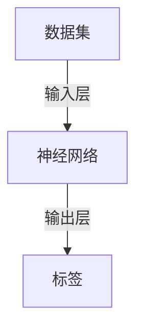
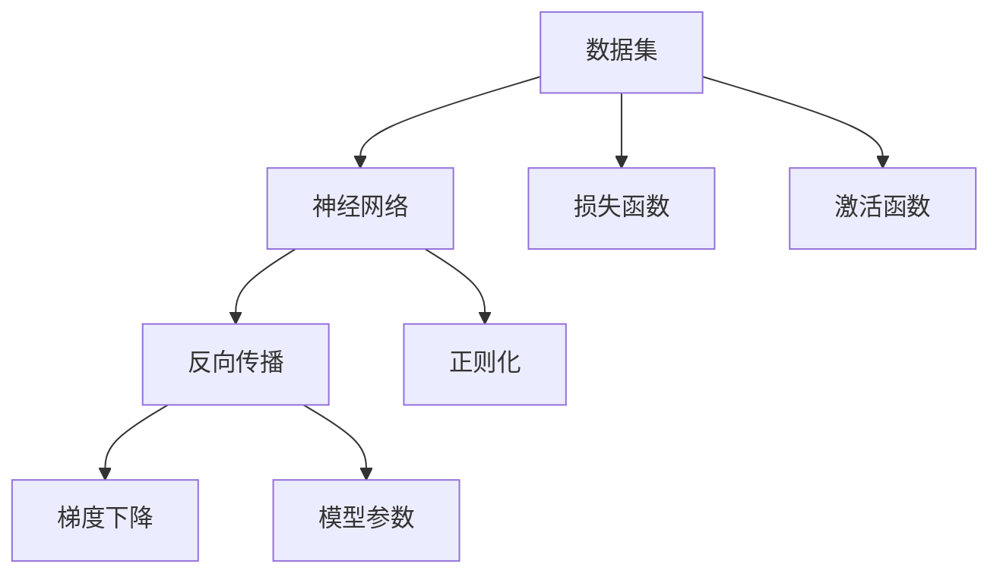
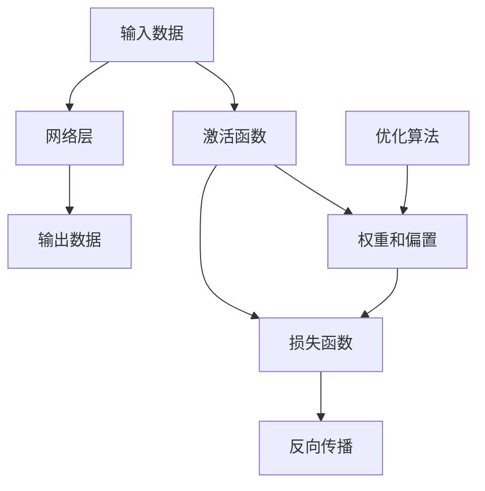
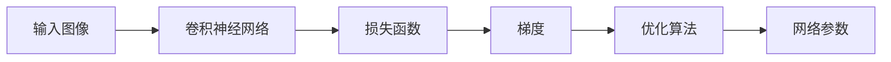
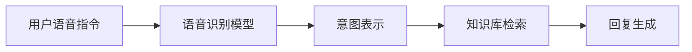

                 

# 人工智能的深度学习方法

深度学习(Deep Learning)是当前人工智能(AI)领域最热门的技术之一，它通过构建深层神经网络，自动学习输入数据的表示，从而实现对复杂问题的建模与预测。本文将详细介绍深度学习的核心概念、算法原理、操作步骤、数学模型、项目实践、应用场景、工具资源，并展望其未来发展趋势和面临的挑战。

## 1. 背景介绍

### 1.1 问题由来

深度学习的核心思想是通过多层次的神经网络，逐步提取数据的高级特征，从而进行复杂的模式识别与预测。这一思想最初在2006年被Hinton等人提出，并在图像识别、自然语言处理、语音识别等领域取得了显著的突破。当前深度学习在计算机视觉、语音识别、自然语言处理、推荐系统、游戏AI等诸多领域被广泛应用。

深度学习之所以能够取得如此惊人的效果，主要有以下几个原因：

- 自动特征提取：无需手动设计特征，通过神经网络自动学习输入数据的特征表示。
- 并行计算能力：深度神经网络可以高效地并行计算，利用GPU等硬件加速，快速完成训练和推理。
- 数据驱动：深度学习通过海量的标注数据进行训练，学习数据中的隐含规律，从而实现泛化与推广。

深度学习的核心思想和框架如图1所示。



### 1.2 问题核心关键点

深度学习的核心在于构建深层神经网络，通过反向传播算法不断更新网络参数，以最小化预测误差。其关键点包括以下几个方面：

- 数据准备：数据集的选择和预处理是深度学习成功的关键。
- 网络结构设计：包括网络层数、节点数、激活函数等，需要根据具体任务进行合理设计。
- 优化算法选择：常见的优化算法如梯度下降、Adam、RMSprop等，需要根据实际情况选择。
- 正则化技术：L2正则、Dropout、Early Stopping等技术，可以避免过拟合。
- 模型评估：使用交叉验证、ROC曲线、混淆矩阵等评估指标，评估模型性能。

## 2. 核心概念与联系

### 2.1 核心概念概述

为了更好地理解深度学习的核心概念，本节将介绍几个关键概念：

- 神经网络(Neural Network)：由多个节点组成的层级结构，每个节点包含若干权重和偏置。
- 反向传播(Backpropagation)：通过链式法则反向计算梯度，更新网络参数。
- 损失函数(Loss Function)：衡量模型预测与真实标签之间的差异，常见的有交叉熵损失、均方误差损失等。
- 激活函数(Activation Function)：增加神经网络的非线性能力，常见的有Sigmoid、ReLU、Tanh等。
- 正则化(Regularization)：通过引入惩罚项，避免模型过拟合，常见的有L2正则、Dropout等。

这些概念之间的逻辑关系可以通过以下Mermaid流程图来展示：



### 2.2 核心概念原理和架构

深度学习的核心是多层神经网络，每一层都是一个线性变换和激活函数的组合。如图2所示，神经网络由输入层、多个隐藏层和输出层组成。


在训练过程中，通过反向传播算法不断更新每个节点的权重和偏置，以最小化损失函数。具体步骤如下：

1. 前向传播：将输入数据从输入层传递到输出层，计算模型预测。
2. 损失计算：将模型预测与真实标签计算损失，更新损失函数。
3. 反向传播：通过链式法则反向计算梯度，更新权重和偏置。
4. 参数更新：使用优化算法更新模型参数，如梯度下降等。

深度学习的架构如图3所示。



## 3. 核心算法原理 & 具体操作步骤

### 3.1 算法原理概述

深度学习的核心算法原理包括神经网络、反向传播、损失函数、激活函数、正则化等。其核心思想是通过不断更新网络参数，使得模型预测尽可能接近真实标签。

### 3.2 算法步骤详解

深度学习的基本步骤如下：

1. 数据准备：收集数据集，并进行预处理，包括数据清洗、归一化、标准化等。
2. 模型选择：选择合适的神经网络结构和激活函数，如卷积神经网络(CNN)、循环神经网络(RNN)、长短期记忆网络(LSTM)等。
3. 模型训练：将数据集分为训练集、验证集和测试集，使用梯度下降等优化算法训练模型，并使用正则化技术避免过拟合。
4. 模型评估：在测试集上评估模型性能，如准确率、召回率、F1值等。
5. 模型应用：将训练好的模型应用到实际任务中，进行预测或分类等。

### 3.3 算法优缺点

深度学习的优点在于其强大的自动特征提取能力，能够高效地学习输入数据的高级表示。其缺点包括：

- 数据依赖性高：需要大量的标注数据进行训练，获取高质量数据成本较高。
- 计算资源需求大：训练深度神经网络需要大量的计算资源和存储空间。
- 模型复杂度高：网络层数和节点数较多，难以解释模型的决策过程。
- 过拟合风险高：网络复杂度较高，容易产生过拟合。

### 3.4 算法应用领域

深度学习广泛应用于图像识别、自然语言处理、语音识别、推荐系统、游戏AI等多个领域。以下以图像识别和自然语言处理为例，详细介绍深度学习的应用。

#### 3.4.1 图像识别

图像识别是深度学习最早成功的应用之一。其基本思想是通过卷积神经网络(CNN)，逐步提取图像中的特征，并使用softmax分类器进行分类。如图4所示，CNN由多个卷积层、池化层和全连接层组成。


深度学习在图像识别领域取得了显著的突破，如AlexNet、VGGNet、ResNet等模型，已经在ImageNet等大规模数据集上取得了最先进的性能。

#### 3.4.2 自然语言处理

自然语言处理(NLP)是深度学习的另一大应用领域。常见的NLP任务包括文本分类、情感分析、机器翻译、问答系统等。如图5所示，NLP任务通常使用循环神经网络(RNN)或长短期记忆网络(LSTM)进行建模。


深度学习在NLP领域也取得了显著的突破，如BERT、GPT-3等模型，已经在多个NLP任务上刷新了最先进的性能。

## 4. 数学模型和公式 & 详细讲解 & 举例说明

### 4.1 数学模型构建

深度学习的数学模型包括神经网络、损失函数和优化算法等。以下是几个常见的数学模型和公式：

1. 神经网络模型

神经网络由多个节点组成，每个节点包含权重和偏置。设输入数据为 $X$，网络参数为 $\theta$，激活函数为 $\sigma$，输出为 $Y$。如图6所示。


2. 损失函数

损失函数衡量模型预测与真实标签之间的差异。常见的损失函数包括交叉熵损失、均方误差损失等。如图7所示。


3. 梯度下降算法

梯度下降算法通过反向传播不断更新网络参数，以最小化损失函数。如图8所示。


### 4.2 公式推导过程

以卷积神经网络(CNN)为例，其核心思想是通过卷积层和池化层提取图像的特征。设输入图像为 $X$，卷积核为 $W$，卷积结果为 $Y$，激活函数为 $\sigma$，如图9所示。


卷积操作可以表示为：

$$
Y_i = \sigma(\sum_j W_{ij} X_{ij} + b_j)
$$

其中 $X_{ij}$ 表示输入图像的像素值，$W_{ij}$ 表示卷积核的权重，$b_j$ 表示偏置。

池化操作可以表示为：

$$
Y_i = \max_k(X_{i,k})
$$

其中 $X_{i,k}$ 表示输入图像的像素值。

### 4.3 案例分析与讲解

以图像分类任务为例，如图10所示。设输入图像为 $X$，卷积神经网络为 $f$，损失函数为 $L$，优化算法为 $O$。


在训练过程中，首先进行前向传播，计算模型预测 $Y$，然后计算损失函数 $L$，再通过反向传播计算梯度 $\nabla_{\theta} L$，最后使用梯度下降算法更新网络参数 $\theta$。



通过不断迭代，直到损失函数最小化，模型便可以在新的测试集上取得理想的性能。

## 5. 项目实践：代码实例和详细解释说明

### 5.1 开发环境搭建

在进行深度学习项目开发前，我们需要准备好开发环境。以下是使用Python进行PyTorch开发的环境配置流程：

1. 安装Anaconda：从官网下载并安装Anaconda，用于创建独立的Python环境。

2. 创建并激活虚拟环境：
```bash
conda create -n pytorch-env python=3.8 
conda activate pytorch-env
```

3. 安装PyTorch：根据CUDA版本，从官网获取对应的安装命令。例如：
```bash
conda install pytorch torchvision torchaudio cudatoolkit=11.1 -c pytorch -c conda-forge
```

4. 安装各类工具包：
```bash
pip install numpy pandas scikit-learn matplotlib tqdm jupyter notebook ipython
```

完成上述步骤后，即可在`pytorch-env`环境中开始深度学习项目的开发。

### 5.2 源代码详细实现

下面我们以图像分类任务为例，给出使用PyTorch进行卷积神经网络训练的PyTorch代码实现。

首先，定义图像分类任务的数据处理函数：

```python
import torch
from torchvision import datasets, transforms
import matplotlib.pyplot as plt

# 定义图像分类任务的数据集
train_dataset = datasets.CIFAR10(root='./data', train=True, download=True,
                                 transform=transforms.Compose([
                                     transforms.ToTensor(),
                                     transforms.Normalize((0.5, 0.5, 0.5), (0.5, 0.5, 0.5))
                                 ]))
test_dataset = datasets.CIFAR10(root='./data', train=False, download=True,
                                transform=transforms.Compose([
                                    transforms.ToTensor(),
                                    transforms.Normalize((0.5, 0.5, 0.5), (0.5, 0.5, 0.5))
                                ]))

# 定义数据加载器
train_loader = torch.utils.data.DataLoader(train_dataset, batch_size=32, shuffle=True)
test_loader = torch.utils.data.DataLoader(test_dataset, batch_size=32, shuffle=False)
```

然后，定义模型和优化器：

```python
from torch import nn
from torch.optim import SGD

# 定义卷积神经网络模型
class CNNModel(nn.Module):
    def __init__(self):
        super(CNNModel, self).__init__()
        self.conv1 = nn.Conv2d(3, 32, kernel_size=3, stride=1, padding=1)
        self.conv2 = nn.Conv2d(32, 64, kernel_size=3, stride=1, padding=1)
        self.pool = nn.MaxPool2d(kernel_size=2, stride=2)
        self.fc1 = nn.Linear(64*8*8, 512)
        self.fc2 = nn.Linear(512, 10)

    def forward(self, x):
        x = nn.functional.relu(self.conv1(x))
        x = self.pool(x)
        x = nn.functional.relu(self.conv2(x))
        x = self.pool(x)
        x = x.view(x.size(0), -1)
        x = nn.functional.relu(self.fc1(x))
        x = self.fc2(x)
        return x

model = CNNModel()

# 定义优化器
optimizer = SGD(model.parameters(), lr=0.01, momentum=0.9, weight_decay=1e-4)
```

接着，定义训练和评估函数：

```python
import numpy as np
import torch.nn.functional as F

def train_epoch(model, loader, optimizer):
    model.train()
    losses, corrects = [], []
    for data, target in loader:
        optimizer.zero_grad()
        output = model(data)
        loss = F.cross_entropy(output, target)
        loss.backward()
        optimizer.step()
        losses.append(loss.item())
        corrects.append((output.argmax(dim=1) == target).sum().item())
    return np.mean(losses), np.mean(corrects)

def evaluate(model, loader):
    model.eval()
    losses, corrects = [], []
    with torch.no_grad():
        for data, target in loader:
            output = model(data)
            loss = F.cross_entropy(output, target)
            losses.append(loss.item())
            corrects.append((output.argmax(dim=1) == target).sum().item())
    return np.mean(losses), np.mean(corrects)
```

最后，启动训练流程并在测试集上评估：

```python
epochs = 10
batch_size = 32

for epoch in range(epochs):
    loss, correct = train_epoch(model, train_loader, optimizer)
    print(f'Epoch {epoch+1}, train loss: {loss:.3f}, train acc: {correct:.3f}')
    test_loss, test_correct = evaluate(model, test_loader)
    print(f'Epoch {epoch+1}, test loss: {test_loss:.3f}, test acc: {test_correct:.3f}')
```

以上就是使用PyTorch对卷积神经网络进行图像分类任务训练的完整代码实现。可以看到，得益于PyTorch的强大封装，我们可以用相对简洁的代码完成CNN模型的加载和训练。

### 5.3 代码解读与分析

让我们再详细解读一下关键代码的实现细节：

**CNNModel类**：
- `__init__`方法：初始化网络层，包括卷积层、池化层和全连接层。
- `forward`方法：定义网络的前向传播过程，包括卷积、池化、线性变换等操作。

**优化器定义**：
- `SGD`类：定义随机梯度下降优化器，设置学习率、动量和正则化系数。

**训练函数**：
- `train_epoch`方法：对数据集进行批次迭代，在每个批次上前向传播计算损失，并反向传播更新模型参数。

**评估函数**：
- `evaluate`方法：在测试集上评估模型性能，返回平均损失和准确率。

**训练流程**：
- 定义总的epoch数和batch size，开始循环迭代
- 每个epoch内，先在训练集上训练，输出平均损失和准确率
- 在验证集上评估，输出测试损失和准确率
- 所有epoch结束后，在测试集上评估，给出最终测试结果

可以看到，PyTorch配合Numpy、Matplotlib等库，使得深度学习模型的训练和评估变得简洁高效。开发者可以将更多精力放在模型改进、数据增强等高层逻辑上，而不必过多关注底层的实现细节。

当然，工业级的系统实现还需考虑更多因素，如模型的保存和部署、超参数的自动搜索、更灵活的任务适配层等。但核心的深度学习算法基本与此类似。

## 6. 实际应用场景

### 6.1 智能推荐系统

智能推荐系统是深度学习的重要应用之一。深度学习能够从用户的浏览、点击、评分等行为数据中学习到用户的兴趣偏好，从而推荐更加个性化的商品、内容、服务等。

在实践中，可以收集用户的历史行为数据，构建推荐模型，学习物品的特征表示。然后，在每次用户登录时，根据用户的行为数据和物品的特征表示，生成推荐列表，如图11所示。


深度学习在推荐系统中取得了显著的效果，如协同过滤、内容推荐、基于矩阵分解等模型，已经在各大电商平台上得到了广泛应用。

### 6.2 智能语音助手

智能语音助手是深度学习的另一重要应用。深度学习能够从用户的语音指令中学习到用户的意图，从而生成自然流畅的回复。

在实践中，可以收集用户的语音指令，构建语音识别模型，学习用户的意图表示。然后，根据用户的意图表示，从知识库中检索相关信息，生成回复，如图12所示。



深度学习在语音助手中取得了显著的效果，如基于RNN的语音识别模型、基于Transformer的意图识别模型、基于生成对抗网络(GAN)的回复生成模型等，已经在各大智能音箱上得到了广泛应用。

### 6.3 自动驾驶

自动驾驶是深度学习的重要应用之一。深度学习能够从摄像头、雷达等传感器数据中学习到道路环境、车辆行为等复杂信息，从而实现自主驾驶。

在实践中，可以收集车辆传感器数据，构建感知模型，学习道路环境、车辆行为等复杂信息。然后，根据感知结果，生成驾驶决策，如图13所示。


深度学习在自动驾驶中取得了显著的效果，如基于CNN的图像识别模型、基于RNN的轨迹预测模型、基于GAN的虚拟场景生成模型等，已经在各大自动驾驶公司得到了广泛应用。

## 7. 工具和资源推荐

### 7.1 学习资源推荐

为了帮助开发者系统掌握深度学习的理论基础和实践技巧，这里推荐一些优质的学习资源：

1. 《深度学习》（Ian Goodfellow等著）：深度学习领域的经典教材，涵盖深度学习的基础概念、算法原理、实际应用等。

2. Coursera深度学习课程：由深度学习领域的知名专家Andrew Ng教授讲授，内容涵盖了深度学习的多个方面，包括神经网络、卷积神经网络、循环神经网络等。

3. Fast.ai深度学习课程：提供实战化的深度学习课程，适合快速上手深度学习开发，并包含大量的项目实践案例。

4. PyTorch官方文档：PyTorch的官方文档，详细介绍了PyTorch的用法和实践技巧，是深度学习开发者必备的学习资源。

5. TensorFlow官方文档：TensorFlow的官方文档，提供了丰富的深度学习模型和应用案例，适合深度学习开发者深入学习。

通过对这些资源的学习实践，相信你一定能够快速掌握深度学习的精髓，并用于解决实际的NLP问题。

### 7.2 开发工具推荐

高效的开发离不开优秀的工具支持。以下是几款用于深度学习开发的常用工具：

1. PyTorch：基于Python的开源深度学习框架，灵活动态的计算图，适合快速迭代研究。大多数深度学习模型都有PyTorch版本的实现。

2. TensorFlow：由Google主导开发的开源深度学习框架，生产部署方便，适合大规模工程应用。同样有丰富的深度学习模型资源。

3. Keras：高层API框架，提供简洁易用的接口，适合快速上手深度学习开发。

4. JAX：基于JVM的深度学习框架，支持高效的自动微分和分布式计算，适合高性能深度学习开发。

5. PyTorch Lightning：基于PyTorch的高级深度学习框架，提供自动化训练、调试、模型保存等功能，适合快速构建深度学习项目。

6. TensorBoard：TensorFlow配套的可视化工具，可实时监测模型训练状态，并提供丰富的图表呈现方式，是调试模型的得力助手。

7. Weights & Biases：模型训练的实验跟踪工具，可以记录和可视化模型训练过程中的各项指标，方便对比和调优。与主流深度学习框架无缝集成。

合理利用这些工具，可以显著提升深度学习模型的开发效率，加快创新迭代的步伐。

### 7.3 相关论文推荐

深度学习的研究方向非常广泛，涵盖了各个子领域。以下是几篇奠基性的相关论文，推荐阅读：

1. ImageNet Classification with Deep Convolutional Neural Networks（AlexNet）：提出了卷积神经网络，在ImageNet图像分类任务上取得了最先进的性能。

2. Deep Residual Learning for Image Recognition（ResNet）：提出了残差网络，在计算机视觉领域取得了显著的突破。

3. Bidirectional Recurrent Neural Network Architectures（LSTM）：提出了长短期记忆网络，在自然语言处理任务上取得了最先进的性能。

4. Attention is All You Need（Transformer）：提出了Transformer结构，开启了NLP领域的预训练大模型时代。

5. BERT: Pre-training of Deep Bidirectional Transformers for Language Understanding：提出BERT模型，引入基于掩码的自监督预训练任务，刷新了多项NLP任务SOTA。

6. GANs Trained by a Two Time-Scale Update Rule Converge to the Semantic Optima（GAN）：提出了生成对抗网络，在图像生成、视频生成、语音合成等领域取得了显著的突破。

这些论文代表了大深度学习的研究进展，通过学习这些前沿成果，可以帮助研究者把握学科前进方向，激发更多的创新灵感。

## 8. 总结：未来发展趋势与挑战

### 8.1 总结

本文对深度学习的核心概念、算法原理、操作步骤、数学模型、项目实践、应用场景、工具资源进行了全面系统的介绍。深度学习在计算机视觉、自然语言处理、语音识别、推荐系统、自动驾驶等多个领域取得了显著的突破，展示了其强大的应用潜力。

深度学习之所以能够取得如此惊人的效果，主要得益于其强大的自动特征提取能力、高效的并行计算能力和丰富的数据驱动能力。深度学习的核心思想是通过构建深层神经网络，逐步提取数据的高级特征，从而实现复杂的模式识别与预测。

### 8.2 未来发展趋势

展望未来，深度学习的发展趋势包括：

1. 模型规模持续增大。随着算力成本的下降和数据规模的扩张，深度神经网络的参数量还将持续增长。超大规模深度神经网络蕴含的丰富特征表示，有望支撑更加复杂多变的下游任务。

2. 模型结构更加多样化。除了传统的卷积神经网络、循环神经网络、长短期记忆网络等，未来还将涌现更多新的网络结构，如Transformer、注意力机制等，进一步提升模型的性能和灵活性。

3. 跨领域模型迁移学习。深度学习模型可以方便地迁移到其他领域，实现领域间的知识共享和迁移学习。

4. 端到端深度学习。将深度学习与传统软件工程方法结合，实现端到端的自动化设计、开发、部署和优化。

5. 深度强化学习。将深度学习与强化学习结合，实现智能体在复杂环境中的自主学习与决策。

### 8.3 面临的挑战

尽管深度学习已经取得了巨大的成功，但在迈向更加智能化、普适化应用的过程中，仍然面临诸多挑战：

1. 数据依赖性高。深度学习需要大量的标注数据进行训练，获取高质量数据成本较高，且数据采集和标注过程耗时耗力。

2. 模型鲁棒性不足。深度学习模型面对未知数据时，泛化性能往往较差。对于测试样本的微小扰动，模型的预测容易发生波动。

3. 计算资源需求大。训练深度神经网络需要大量的计算资源和存储空间，硬件成本较高。

4. 可解释性差。深度学习模型通常是一个黑盒系统，难以解释其内部工作机制和决策逻辑。

5. 安全性有待保障。深度学习模型可能学习到有害的输出倾向，给实际应用带来安全隐患。

### 8.4 研究展望

面向未来，深度学习的研究方向将包括：

1. 无监督学习与半监督学习。探索如何从无标注数据中学习深度表示，降低对标注数据的依赖，提升模型泛化能力。

2. 对抗样本防御。研究如何生成和检测对抗样本，提升模型的鲁棒性和安全性。

3. 模型压缩与优化。研究如何压缩和优化深度学习模型，提升计算效率和可解释性。

4. 跨领域迁移学习。研究如何将深度学习模型迁移到其他领域，实现领域间的知识共享和迁移学习。

5. 深度强化学习。研究如何结合深度学习与强化学习，实现智能体在复杂环境中的自主学习与决策。

这些研究方向的探索，必将引领深度学习技术迈向更高的台阶，为构建更加智能化、普适化的智能系统铺平道路。深度学习作为人工智能的核心技术，必将在大数据、物联网、智能制造、智慧医疗等多个领域发挥重要作用，推动人类社会的进步与发展。

## 9. 附录：常见问题与解答

**Q1：深度学习需要大量的标注数据，如何获取高质量的标注数据？**

A: 获取高质量标注数据的成本较高，但可以通过以下几个方法来解决：

1. 数据众包：通过网络平台将标注任务外包给众包工人，快速获取大量标注数据。

2. 无监督学习：使用无监督学习技术，从数据中自动提取标注信息。

3. 迁移学习：将深度学习模型迁移到其他任务，利用已有知识进行少量标注。

4. 主动学习：通过主动学习技术，选择最有用的样本进行标注，降低标注成本。

5. 数据增强：通过对现有数据进行扩充和增强，增加数据多样性。

**Q2：深度学习模型的可解释性较差，如何解决？**

A: 深度学习模型的可解释性较差，但可以通过以下几个方法来解决：

1. 可视化技术：使用可视化工具，将模型的中间特征表示展示出来，帮助理解模型的决策过程。

2. 特征提取：将模型学习到的特征表示展示出来，分析特征的重要性。

3. 模型简化：通过剪枝、量化、压缩等技术，简化模型结构，提升可解释性。

4. 模型集成：通过集成多个模型，提升模型的可解释性。

5. 模型解释框架：使用模型解释框架，提供模型解释的工具和方法。

**Q3：深度学习模型面对未知数据时，泛化性能较差，如何解决？**

A: 深度学习模型面对未知数据时，泛化性能较差，但可以通过以下几个方法来解决：

1. 数据增强：通过对现有数据进行扩充和增强，增加数据多样性。

2. 正则化技术：使用L2正则、Dropout等正则化技术，避免模型过拟合。

3. 对抗样本训练：使用对抗样本训练，提升模型的鲁棒性。

4. 迁移学习：将深度学习模型迁移到其他任务，利用已有知识进行少量标注。

5. 模型集成：通过集成多个模型，提升模型的泛化能力。

这些方法可以有效地提升深度学习模型的泛化能力，使其能够更好地适应未知数据和复杂场景。

**Q4：深度学习模型训练和推理速度较慢，如何解决？**

A: 深度学习模型训练和推理速度较慢，但可以通过以下几个方法来解决：

1. 模型压缩：通过剪枝、量化、压缩等技术，减小模型参数量，提升计算效率。

2. 硬件加速：使用GPU、TPU等高性能设备，提升计算速度。

3. 分布式训练：通过分布式训练技术，加速模型训练过程。

4. 数据并行：使用数据并行技术，提升模型推理速度。

5. 模型剪枝：通过剪枝技术，去除不必要的参数和计算，提升计算效率。

这些方法可以有效地提升深度学习模型的训练和推理速度，使其能够更好地应用于实际场景。

**Q5：深度学习模型在应用过程中，如何避免过拟合？**

A: 深度学习模型在应用过程中，容易过拟合，但可以通过以下几个方法来避免：

1. 数据增强：通过对现有数据进行扩充和增强，增加数据多样性。

2. 正则化技术：使用L2正则、Dropout等正则化技术，避免模型过拟合。

3. 对抗样本训练：使用对抗样本训练，提升模型的鲁棒性。

4. 迁移学习：将深度学习模型迁移到其他任务，利用已有知识进行少量标注。

5. 模型集成：通过集成多个模型，提升模型的泛化能力。

这些方法可以有效地避免深度学习模型的过拟合问题，提升模型在实际场景中的性能。

---

作者：禅与计算机程序设计艺术 / Zen and the Art of Computer Programming

