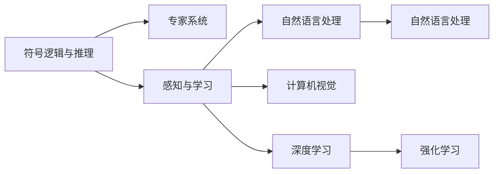

                 

# 人工智能领域的早期探索

> 关键词：人工智能,早期探索,历史演进,计算机科学,技术创新

## 1. 背景介绍

### 1.1 问题由来
人工智能（AI）领域是一个充满无限可能的研究领域，它跨越了计算机科学、数学、认知科学、行为科学等多个学科的界限。自1956年达特茅斯会议以来，人工智能的发展已经经历了几十年的风雨历程。早期，AI主要集中在符号逻辑和专家系统中，随着深度学习、自然语言处理、计算机视觉等技术的兴起，AI开始逐步走出实验室，走进现实世界，成为推动科技进步和社会变革的重要力量。本文旨在追溯人工智能的早期探索历程，探讨其对当今技术发展的启示。

## 2. 核心概念与联系

### 2.1 核心概念概述

在AI的早期探索过程中，几个核心概念起到了重要的推动作用：

- **符号逻辑与推理**：早期的AI研究主要集中在符号逻辑和推理上，使用规则和推理机来实现复杂的决策和任务。
- **专家系统**：专家系统利用规则库和知识库，模拟专家的决策过程，广泛应用于医疗、法律、金融等领域。
- **感知与学习**：20世纪80年代后，神经网络和机器学习技术开始兴起，使得AI能够通过数据进行学习和感知，应用范围进一步扩大。
- **自然语言处理**：自然语言处理技术使AI能够理解和处理人类语言，使得人机交互变得更加自然。
- **计算机视觉**：计算机视觉技术让AI能够理解和解释图像和视频内容，为自动驾驶、安防监控等领域提供了技术基础。
- **深度学习**：深度学习技术通过多层神经网络的训练，实现了在图像识别、语音识别、文本分类等领域取得突破性进展。
- **强化学习**：强化学习通过智能体与环境的互动，优化决策策略，被广泛应用于机器人控制、游戏AI等方向。

### 2.2 核心概念原理和架构的 Mermaid 流程图



## 3. 核心算法原理 & 具体操作步骤

### 3.1 算法原理概述

AI的早期探索涉及多种算法和技术，以下是其中几个核心算法的概述：

- **符号逻辑与推理**：使用符号逻辑和推理机来模拟专家的决策过程。常用的算法包括规则推理、专家系统和决策树等。
- **神经网络和机器学习**：通过训练神经网络来模拟人类大脑的学习过程，常用的算法包括反向传播算法、支持向量机等。
- **自然语言处理**：使用文本处理技术，如分词、词性标注、句法分析等，将自然语言转化为计算机可处理的结构化信息。
- **计算机视觉**：使用图像处理技术，如边缘检测、特征提取、卷积神经网络等，从图像中提取有意义的信息。
- **强化学习**：通过智能体与环境的交互，不断调整策略以优化目标函数，常用的算法包括Q-learning、策略梯度等。

### 3.2 算法步骤详解

**符号逻辑与推理**：

1. **规则库构建**：通过收集专家的知识和经验，构建规则库，用于指导决策过程。
2. **知识表示**：将规则和知识用符号表示，用于推理和匹配。
3. **推理机设计**：设计推理机，根据规则库和知识库进行推理和匹配，输出决策结果。

**神经网络和机器学习**：

1. **数据准备**：收集和预处理训练数据，确保数据的质量和多样性。
2. **模型选择**：选择合适的神经网络模型，如前馈神经网络、卷积神经网络、循环神经网络等。
3. **模型训练**：使用训练数据训练模型，调整模型参数以最小化误差。
4. **模型评估**：使用测试数据评估模型性能，调整模型参数以提高性能。

**自然语言处理**：

1. **文本预处理**：对文本进行分词、词性标注、句法分析等预处理。
2. **语义表示**：将文本转换为语义表示，如向量空间表示、语义角色标注等。
3. **语义理解**：使用语言模型、知识图谱等技术，理解文本的含义和上下文信息。
4. **任务处理**：根据任务类型，设计相应的处理方案，如文本分类、情感分析、信息抽取等。

**计算机视觉**：

1. **图像预处理**：对图像进行去噪、裁剪、归一化等预处理。
2. **特征提取**：使用边缘检测、特征提取等技术，提取图像的有用信息。
3. **模型训练**：使用训练数据训练图像识别模型，调整模型参数以提高识别率。
4. **目标检测**：使用卷积神经网络等技术，检测图像中的目标物体。

**强化学习**：

1. **环境设计**：设计可交互的环境，如游戏环境、机器人控制环境等。
2. **智能体设计**：设计智能体，用于与环境互动。
3. **策略学习**：智能体通过与环境的交互，调整策略以最大化奖励。
4. **策略评估**：使用评估指标，如成功次数、平均奖励等，评估智能体的性能。

### 3.3 算法优缺点

**符号逻辑与推理**：

优点：规则明确，易于理解和解释。
缺点：无法处理不确定性和复杂性，难以处理大规模问题。

**神经网络和机器学习**：

优点：能够处理复杂和非线性的问题，具有很强的泛化能力。
缺点：需要大量数据和计算资源，模型复杂度高。

**自然语言处理**：

优点：能够处理自然语言，使得人机交互更加自然。
缺点：语义理解的准确度受限于语言模型和知识库的质量。

**计算机视觉**：

优点：能够处理图像和视频数据，具有很强的感知能力。
缺点：图像数据的采集和标注成本高，对数据质量要求高。

**强化学习**：

优点：能够通过交互学习最优策略，具有很好的自适应能力。
缺点：需要大量计算资源和时间，难以优化复杂的策略。

### 3.4 算法应用领域

**符号逻辑与推理**：

- 专家系统：医疗诊断、法律咨询等。
- 决策支持：业务决策、风险评估等。

**神经网络和机器学习**：

- 图像识别：人脸识别、医学影像分析等。
- 自然语言处理：机器翻译、智能客服等。

**自然语言处理**：

- 信息抽取：关系抽取、事件抽取等。
- 文本分类：新闻分类、情感分析等。

**计算机视觉**：

- 自动驾驶：环境感知、路径规划等。
- 安防监控：目标检测、行为分析等。

**强化学习**：

- 机器人控制：自动搬运、自主导航等。
- 游戏AI：围棋、星际争霸等。

## 4. 数学模型和公式 & 详细讲解 & 举例说明

### 4.1 数学模型构建

以神经网络和机器学习为例，常用的数学模型包括：

- **前馈神经网络**：$y=f(Wx+b)$，其中$f$为激活函数，$W$为权重矩阵，$x$为输入向量，$b$为偏置向量。
- **卷积神经网络**：$y=f(Conv(Wx+b))$，其中$Conv$为卷积操作。
- **循环神经网络**：$y=f(W_h\cdot(W_xx+W_ix_h+b_h)+b_y)$，其中$x_h$为前一时刻的隐状态，$W_h$为隐藏层权重矩阵。

### 4.2 公式推导过程

以线性回归为例，推导最小二乘法的公式：

设训练数据集为$(x_i,y_i)$，其中$x_i$为输入，$y_i$为输出，$n$为样本数。

设模型参数为$W$和$b$，则线性回归模型为：$y=Wx+b$。

最小二乘法的目标是最小化均方误差，即：

$$
\min_{W,b}\frac{1}{2n}\sum_{i=1}^n(y_i-Wx_i-b)^2
$$

根据梯度下降法，设学习率为$\eta$，则模型参数的更新公式为：

$$
W \leftarrow W - \eta\frac{1}{n}\sum_{i=1}^n(y_i-Wx_i-b)x_i^T
$$

$$
b \leftarrow b - \eta\frac{1}{n}\sum_{i=1}^n(y_i-Wx_i-b)
$$

### 4.3 案例分析与讲解

**案例一：图像分类**

使用卷积神经网络进行图像分类，步骤如下：

1. **数据准备**：收集并预处理图像数据。
2. **模型构建**：搭建卷积神经网络，包括卷积层、池化层、全连接层等。
3. **模型训练**：使用训练数据训练模型，调整模型参数以提高分类精度。
4. **模型评估**：使用测试数据评估模型性能，调整模型参数以提高性能。

**案例二：自然语言处理**

使用循环神经网络进行文本分类，步骤如下：

1. **数据准备**：收集并预处理文本数据。
2. **模型构建**：搭建循环神经网络，包括输入层、隐藏层、输出层等。
3. **模型训练**：使用训练数据训练模型，调整模型参数以提高分类精度。
4. **模型评估**：使用测试数据评估模型性能，调整模型参数以提高性能。

## 5. 项目实践：代码实例和详细解释说明

### 5.1 开发环境搭建

在开发AI项目时，首先需要搭建开发环境。以下是Python环境下使用TensorFlow搭建环境的流程：

1. 安装Anaconda：从官网下载并安装Anaconda，用于创建独立的Python环境。
2. 创建并激活虚拟环境：
```bash
conda create -n tensorflow-env python=3.8 
conda activate tensorflow-env
```
3. 安装TensorFlow：根据CUDA版本，从官网获取对应的安装命令。例如：
```bash
conda install tensorflow -c tf -c conda-forge
```

4. 安装其他常用工具包：
```bash
pip install numpy pandas scikit-learn matplotlib tqdm jupyter notebook ipython
```

完成上述步骤后，即可在`tensorflow-env`环境中开始AI项目开发。

### 5.2 源代码详细实现

这里以手写数字识别为例，使用TensorFlow实现卷积神经网络：

```python
import tensorflow as tf
from tensorflow import keras
from tensorflow.keras import layers

# 加载MNIST数据集
(x_train, y_train), (x_test, y_test) = keras.datasets.mnist.load_data()

# 数据预处理
x_train = x_train.reshape(-1, 28, 28, 1) / 255.0
x_test = x_test.reshape(-1, 28, 28, 1) / 255.0

# 模型构建
model = keras.Sequential([
    layers.Conv2D(32, 3, activation='relu', input_shape=(28, 28, 1)),
    layers.MaxPooling2D(),
    layers.Flatten(),
    layers.Dense(10, activation='softmax')
])

# 编译模型
model.compile(optimizer='adam', loss='sparse_categorical_crossentropy', metrics=['accuracy'])

# 训练模型
model.fit(x_train, y_train, epochs=10, validation_data=(x_test, y_test))

# 评估模型
model.evaluate(x_test, y_test)
```

### 5.3 代码解读与分析

**数据预处理**：
- 将输入数据reshape为(高度,宽度,通道)的格式，并进行归一化。

**模型构建**：
- 使用`Conv2D`层构建卷积层，使用`MaxPooling2D`层进行池化操作，使用`Flatten`层将卷积层输出展平，使用`Dense`层构建全连接层，使用`softmax`函数作为输出层的激活函数。

**模型编译**：
- 使用`adam`优化器，使用`Sparse Categorical Cross-Entropy Loss`作为损失函数，使用`accuracy`作为评估指标。

**模型训练**：
- 使用`fit`方法训练模型，指定训练数据和验证数据。

**模型评估**：
- 使用`evaluate`方法评估模型性能。

## 6. 实际应用场景

### 6.4 未来应用展望

AI早期探索所涉及的多种技术和算法，已经广泛应用于各个领域，以下是一些未来的应用展望：

**医疗**：
- 智能诊断：使用AI技术，对医疗影像进行自动诊断，如肿瘤识别、病变检测等。
- 药物研发：使用AI技术，加速新药的发现和筛选，提高研发效率。

**金融**：
- 风险评估：使用AI技术，对金融市场进行风险评估和预测，提供投资建议。
- 智能客服：使用AI技术，提供智能客服解决方案，提升客户服务质量。

**制造**：
- 工业控制：使用AI技术，实现智能制造和工业自动化，提高生产效率。
- 质量检测：使用AI技术，对产品质量进行自动检测和分类，提高检测效率。

**农业**：
- 精准农业：使用AI技术，对农作物进行精准管理和优化，提高产量和质量。
- 病虫害监测：使用AI技术，对病虫害进行监测和预测，提供防治建议。

## 7. 工具和资源推荐

### 7.1 学习资源推荐

为了帮助开发者系统掌握AI的技术基础和应用方法，这里推荐一些优质的学习资源：

1. 《深度学习》书籍：由Ian Goodfellow、Yoshua Bengio和Aaron Courville所著，系统介绍了深度学习的基本概念和常用算法。
2. Coursera《机器学习》课程：斯坦福大学Andrew Ng教授开设的机器学习课程，涵盖多种机器学习算法和技术。
3. TensorFlow官方文档：提供了TensorFlow的详细教程和示例，是学习和使用TensorFlow的重要资源。
4. PyTorch官方文档：提供了PyTorch的详细教程和示例，是学习和使用PyTorch的重要资源。
5. Kaggle平台：提供了大量机器学习竞赛和数据集，帮助开发者实践和提升技能。

### 7.2 开发工具推荐

高效的开发离不开优秀的工具支持。以下是几款用于AI开发常用的工具：

1. TensorFlow：由Google主导开发的开源深度学习框架，生产部署方便，适合大规模工程应用。
2. PyTorch：由Facebook主导开发的开源深度学习框架，灵活动态的计算图，适合快速迭代研究。
3. Scikit-Learn：基于Python的机器学习库，提供了多种常用算法和数据处理工具。
4. Jupyter Notebook：用于编写和执行Python代码的交互式平台，方便进行实验和协作。
5. Visual Studio Code：轻量级的代码编辑器，支持多种语言和工具插件。

### 7.3 相关论文推荐

AI早期探索所涉及的研究论文，提供了丰富的理论基础和实践经验，以下是几篇奠基性的相关论文，推荐阅读：

1. A New Method for Pattern Recognition and Machine Learning (1958)：由Arthur Samuel所写，介绍了符号逻辑和机器学习的基本概念和方法。
2. Neural Networks and Deep Learning (2011)：由Ian Goodfellow、Yoshua Bengio和Aaron Courville所著，介绍了深度学习的原理和应用。
3. ImageNet Classification with Deep Convolutional Neural Networks (2012)：由Alex Krizhevsky等人所著，介绍了卷积神经网络的原理和应用。
4. Rethinking the Inception Architecture for Computer Vision (2015)：由Christian Szegedy等人所著，介绍了卷积神经网络的新架构Inception。
5. Sequence to Sequence Learning with Neural Networks (2014)：由Ilya Sutskever等人所著，介绍了序列到序列学习的基本方法。

## 8. 总结：未来发展趋势与挑战

### 8.1 研究成果总结

AI早期探索所涉及的研究成果，奠定了现代AI技术的基础。从符号逻辑、专家系统到神经网络和深度学习，AI技术不断进步，应用范围不断扩大。未来，AI技术将在更多领域得到应用，带来新的变革和机遇。

### 8.2 未来发展趋势

**数据驱动**：未来的AI将更加依赖大规模数据和计算资源，通过数据驱动的方式实现更智能、更精准的决策。

**跨领域融合**：AI技术将与更多领域进行融合，如自然语言处理、计算机视觉、机器人控制等，实现跨领域的智能化应用。

**可解释性和可信性**：AI技术的决策过程将更加透明和可解释，增强系统的可信性和可靠性。

**伦理和社会责任**：AI技术的发展将更加注重伦理和社会责任，避免有害的偏见和歧视，保护用户的隐私和权益。

**可持续发展**：AI技术的发展将更加注重环保和可持续发展，减少对环境的影响。

### 8.3 面临的挑战

尽管AI技术在各个领域取得了显著的成果，但仍面临一些挑战：

**数据质量**：数据质量的低下将影响AI模型的训练和效果。如何获取高质量的数据，是未来AI发展的重要问题。

**计算资源**：AI模型的训练和推理需要大量的计算资源，如何提高计算效率，降低计算成本，是未来AI发展的重要问题。

**算法透明性**：AI模型的决策过程往往难以解释，缺乏透明性和可解释性，容易引发误解和质疑。

**伦理和社会责任**：AI技术的决策可能存在偏见和歧视，如何避免有害的偏见和歧视，保护用户的隐私和权益，是未来AI发展的重要问题。

**可扩展性**：AI技术在大规模应用中的扩展性，如何实现高效、可靠的系统部署，是未来AI发展的重要问题。

### 8.4 研究展望

面对AI技术发展中的挑战，未来的研究需要在以下几个方面寻求新的突破：

**数据质量提升**：如何获取高质量的数据，减少数据标注的复杂性和成本，是未来AI发展的重要方向。

**计算资源优化**：如何提高计算效率，降低计算成本，实现更高效、可靠的AI应用，是未来AI发展的重要方向。

**算法透明性和可解释性**：如何提高AI模型的透明性和可解释性，增强系统的可信性和可靠性，是未来AI发展的重要方向。

**伦理和社会责任保障**：如何避免有害的偏见和歧视，保护用户的隐私和权益，是未来AI发展的重要方向。

**跨领域融合**：如何实现AI技术与更多领域的融合，实现跨领域的智能化应用，是未来AI发展的重要方向。

---

作者：禅与计算机程序设计艺术 / Zen and the Art of Computer Programming

