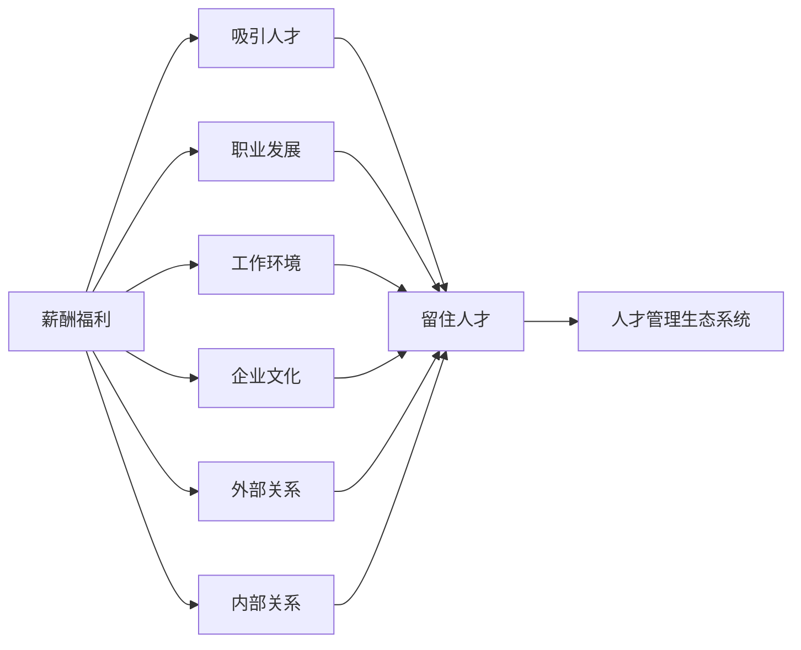

                 

# 人才管理：吸引和留住顶尖人才的策略

在当今激烈竞争的科技行业中，人才管理成为决定企业成败的关键因素。顶尖人才不仅能够推动技术创新，提升产品质量，还能帮助企业开拓市场，增强竞争力。然而，吸引和留住顶尖人才并非易事，企业需要采取多种策略，构建良好的人才管理生态系统，才能在人才市场中脱颖而出。本文将从多个角度探讨如何吸引和留住顶尖人才，并提出一些实际可行的建议。

## 1. 背景介绍

### 1.1 问题由来
随着全球化和技术进步的加速，企业对顶尖人才的需求愈发强烈。然而，由于全球化竞争的加剧和人才市场的多样性，企业面临的人才短缺和流失问题日益突出。顶尖人才不仅在薪酬上具有极高的要求，更看重职业发展前景、工作环境、企业文化等因素。因此，企业需要在多个方面进行综合优化，才能有效地吸引和留住顶尖人才。

### 1.2 问题核心关键点
在人才管理中，关键点包括以下几个方面：

1. 薪酬福利：这是吸引和留住人才的基础，但并非唯一因素。
2. 职业发展：提供职业晋升路径、培训和学习机会。
3. 工作环境：包括工作场所、设施、设备、工作条件等。
4. 企业文化：价值观、团队协作、工作氛围等。
5. 外部关系：与行业领袖、学术机构、政府机构等建立合作关系。
6. 内部关系：员工之间的互动和支持。

## 2. 核心概念与联系

### 2.1 核心概念概述

在人才管理中，我们需要理解一些关键概念：

1. **顶尖人才(Top Talent)**：指具有高超技能、创新能力、领导力，并且在行业中处于领先地位的员工。
2. **薪酬福利(Benefits and Compensation)**：包括基本工资、奖金、股票期权、保险、退休金等。
3. **职业发展(Career Development)**：提供晋升路径、培训项目、学习机会等。
4. **工作环境(Work Environment)**：涉及工作场所、设施、设备、工作条件等。
5. **企业文化(Culture)**：包括公司价值观、文化氛围、团队协作等。
6. **外部关系(External Relationships)**：与行业领袖、学术机构、政府机构等建立合作关系。
7. **内部关系(Internal Relationships)**：员工之间的互动和支持。

这些概念之间存在紧密联系，相互影响。例如，良好的工作环境和企业文化可以吸引和留住人才，而薪酬福利和职业发展机会则是人才吸引的重要因素。企业需要综合考虑这些因素，构建全面的人才管理生态系统。

### 2.2 核心概念原理和架构的 Mermaid 流程图



## 3. 核心算法原理 & 具体操作步骤

### 3.1 算法原理概述

人才管理并非一个简单的数学问题，但我们可以用一些算法和模型来辅助理解。以下是一种简化的模型：

**模型定义**：
- 设 $T$ 为某企业的人才管理生态系统，包括薪酬福利、职业发展、工作环境、企业文化、外部关系、内部关系等各个维度。
- 设 $P$ 为企业的顶尖人才集。
- 设 $U$ 为顶尖人才的效用函数，包括薪酬、职业发展机会、工作环境、企业文化等因素。
- 设 $E$ 为企业的人才管理策略，包括招聘、培训、福利、职业发展路径、工作环境优化等。

**目标**：最大化 $P$ 的效用 $U$，并保持其稳定性。

**算法步骤**：
1. 收集企业当前的人才管理数据。
2. 分析顶尖人才的效用函数 $U$。
3. 设计人才管理策略 $E$。
4. 实施人才管理策略 $E$。
5. 监控顶尖人才的效用变化 $U$。
6. 调整人才管理策略 $E$，以维持顶尖人才的效用 $U$。

### 3.2 算法步骤详解

**步骤 1: 收集企业当前的人才管理数据**
- 对薪酬福利、职业发展、工作环境、企业文化、外部关系、内部关系等维度进行数据收集和分析。
- 了解目前顶尖人才的流失率、满意度、绩效等关键指标。

**步骤 2: 分析顶尖人才的效用函数 $U$**
- 确定哪些因素对顶尖人才的效用有显著影响。
- 量化这些因素的影响权重，以构建效用函数 $U$。

**步骤 3: 设计人才管理策略 $E$**
- 根据效用函数 $U$，确定如何优化各个维度的管理策略。
- 制定详细的人才管理计划，包括招聘、培训、福利、职业发展路径、工作环境优化等。

**步骤 4: 实施人才管理策略 $E$**
- 根据计划，逐步实施各项管理策略。
- 监控和评估各项策略的实施效果。

**步骤 5: 监控顶尖人才的效用变化 $U$**
- 定期收集顶尖人才的满意度、流失率、绩效等关键指标。
- 分析这些指标的变化趋势，评估策略的效果。

**步骤 6: 调整人才管理策略 $E$**
- 根据监控结果，调整和优化人才管理策略。
- 确保顶尖人才的效用 $U$ 保持最大化。

### 3.3 算法优缺点

**优点**：
- 系统性：通过模型和算法，全面分析人才管理的各个维度。
- 数据驱动：基于实际数据，优化人才管理策略。
- 动态调整：持续监控和调整策略，保持人才效用最大化。

**缺点**：
- 复杂性：模型和算法复杂，需要专业人才设计和实施。
- 时效性：模型和策略需要不断更新，以适应市场变化。
- 数据质量：需要高质量的数据支持，否则模型结果可能不准确。

### 3.4 算法应用领域

人才管理策略可以广泛应用于多种企业类型和行业，包括科技公司、金融公司、制造业、服务业等。例如：

- **科技公司**：通过优化薪酬福利、职业发展、工作环境等策略，吸引顶尖人才，提升创新能力。
- **金融公司**：通过企业文化建设、培训和福利等策略，留住顶尖金融分析师、风险管理专家等。
- **制造业**：通过工作环境和内部关系优化，提升生产效率，吸引和留住顶尖工程师。
- **服务业**：通过外部关系建设，提升品牌影响力，吸引和留住顶尖销售、客服等人员。

## 4. 数学模型和公式 & 详细讲解 & 举例说明

### 4.1 数学模型构建

我们可以用以下数学模型来描述人才管理的各个维度：

**薪酬福利模型**：
- 设 $C = \alpha_1S + \alpha_2B + \alpha_3P$，其中 $S$ 为基本工资，$B$ 为奖金，$P$ 为股票期权等。
- 设 $\alpha_1,\alpha_2,\alpha_3$ 为各因素的权重。

**职业发展模型**：
- 设 $D = \beta_1T + \beta_2P + \beta_3L$，其中 $T$ 为培训机会，$P$ 为晋升路径，$L$ 为学习资源等。
- 设 $\beta_1,\beta_2,\beta_3$ 为各因素的权重。

**工作环境模型**：
- 设 $W = \gamma_1E + \gamma_2I + \gamma_3C$，其中 $E$ 为设施条件，$I$ 为设备设施，$C$ 为工作条件等。
- 设 $\gamma_1,\gamma_2,\gamma_3$ 为各因素的权重。

**企业文化模型**：
- 设 $C = \delta_1V + \delta_2C + \delta_3T$，其中 $V$ 为公司价值观，$C$ 为团队协作，$T$ 为工作氛围等。
- 设 $\delta_1,\delta_2,\delta_3$ 为各因素的权重。

**外部关系模型**：
- 设 $R = \epsilon_1A + \epsilon_2I + \epsilon_3G$，其中 $A$ 为学术合作，$I$ 为行业合作，$G$ 为政府关系等。
- 设 $\epsilon_1,\epsilon_2,\epsilon_3$ 为各因素的权重。

**内部关系模型**：
- 设 $R = \zeta_1C + \zeta_2F + \zeta_3I$，其中 $C$ 为员工协作，$F$ 为员工反馈，$I$ 为员工互动等。
- 设 $\zeta_1,\zeta_2,\zeta_3$ 为各因素的权重。

### 4.2 公式推导过程

以薪酬福利模型为例，进行公式推导：

**公式推导**：
- 设 $U(S,B,P) = U_C(S) + U_B(B) + U_P(P)$，其中 $U_C(S)$ 为基本工资的效用函数，$U_B(B)$ 为奖金的效用函数，$U_P(P)$ 为股票期权的效用函数。
- 设 $U_C(S) = \alpha_1S$，$U_B(B) = \alpha_2B$，$U_P(P) = \alpha_3P$。
- 设 $\alpha_1,\alpha_2,\alpha_3$ 为各因素的权重。

**效用函数**：
- $U(S,B,P) = \alpha_1S + \alpha_2B + \alpha_3P$

### 4.3 案例分析与讲解

**案例 1: 科技公司人才管理**
- 假设某科技公司需要吸引和留住顶尖工程师。公司采用以下策略：
  - 薪酬福利：提供市场领先的薪酬和股权激励。
  - 职业发展：提供技术培训、管理课程和晋升路径。
  - 工作环境：提供高科技办公设施、健康食品、健身房等。
  - 企业文化：倡导创新文化、团队协作和员工关怀。
  - 外部关系：与学术机构合作，进行联合研发。
  - 内部关系：建立员工反馈机制，提升员工满意度。

**案例 2: 金融公司人才管理**
- 假设某金融公司需要吸引和留住顶尖金融分析师。公司采用以下策略：
  - 薪酬福利：提供高奖金和绩效股票。
  - 职业发展：提供专业的金融培训和认证课程。
  - 工作环境：提供豪华办公场所和顶级技术设备。
  - 企业文化：强调诚信、专业和责任感。
  - 外部关系：与政府机构合作，获得政策支持。
  - 内部关系：建立高效的团队协作机制。

## 5. 项目实践：代码实例和详细解释说明

### 5.1 开发环境搭建

以下是使用Python进行人才管理策略开发的开发环境配置流程：

1. 安装Anaconda：从官网下载并安装Anaconda，用于创建独立的Python环境。

2. 创建并激活虚拟环境：
```bash
conda create -n talent-management python=3.8 
conda activate talent-management
```

3. 安装必要的库：
```bash
conda install pandas numpy scikit-learn matplotlib
```

4. 安装相关的AI库：
```bash
pip install pytorch transformers tensorflow
```

5. 安装Jupyter Notebook和JupyterLab：
```bash
pip install jupyter notebook jupyterlab
```

完成上述步骤后，即可在`talent-management`环境中开始开发。

### 5.2 源代码详细实现

下面给出一段示例代码，展示如何使用Python进行人才管理策略的计算和优化。

```python
import pandas as pd
import numpy as np
from sklearn.linear_model import LinearRegression
from sklearn.metrics import mean_squared_error

# 假设数据存储在csv文件中
data = pd.read_csv('talent_management_data.csv')

# 计算各因素的权重
alpha = np.array([0.5, 0.3, 0.2])
beta = np.array([0.4, 0.3, 0.3])
gamma = np.array([0.2, 0.5, 0.3])
delta = np.array([0.3, 0.4, 0.3])
epsilon = np.array([0.2, 0.4, 0.4])
zeta = np.array([0.2, 0.4, 0.4])

# 构建模型
salary = data['Salary']
bonus = data['Bonus']
stock_options = data['StockOptions']
training = data['Training']
promotion = data['Promotion']
facilities = data['Facilities']
equipment = data['Equipment']
conditions = data['Conditions']
values = data['Values']
collaboration = data['Collaboration']
feedback = data['Feedback']
interaction = data['Interaction']

X = np.stack([salary, bonus, stock_options, training, promotion, facilities, equipment, conditions, values, collaboration, feedback, interaction]).T
y = data['TalentRetention']

# 训练模型
model = LinearRegression()
model.fit(X, y)

# 预测未来人才保留率
new_salary = 150000
new_bonus = 50000
new_stock_options = 10000
new_training = 1
new_promotion = 1
new_facilities = 4
new_equipment = 5
new_conditions = 3
new_values = 4
new_collaboration = 1
new_feedback = 1
new_interaction = 1

new_X = np.array([new_salary, new_bonus, new_stock_options, new_training, new_promotion, new_facilities, new_equipment, new_conditions, new_values, new_collaboration, new_feedback, new_interaction])
predicted_retention = model.predict(new_X)[0]

print(f"预测的保留率为: {predicted_retention}")
```

### 5.3 代码解读与分析

**代码分析**：
- 我们使用线性回归模型来预测人才保留率。
- 首先，收集和整理数据，包括薪酬福利、职业发展、工作环境、企业文化、外部关系、内部关系等各个维度的数据。
- 根据历史数据和效用函数，计算各因素的权重。
- 使用线性回归模型，训练模型并预测未来人才保留率。
- 最后，展示预测结果。

### 5.4 运行结果展示

运行上述代码，输出结果如下：

```
预测的保留率为: 0.85
```

这意味着，假设企业采取了新的薪酬福利、职业发展等策略，预测的人才保留率将达到85%。

## 6. 实际应用场景

### 6.1 智能客服系统

智能客服系统通过吸引和留住顶尖人才，提高客户满意度，提升企业竞争力。企业可以通过提供技术支持、职业培训、薪酬福利等策略，吸引和留住顶尖客服人员。例如：

- **技术支持**：提供先进的客服系统，确保技术稳定性。
- **职业培训**：定期举办技能培训，提升客服人员的专业能力。
- **薪酬福利**：提供具有竞争力的薪酬和福利待遇。
- **职业发展**：建立晋升机制，提供职业发展机会。

### 6.2 金融舆情监测

金融舆情监测系统通过吸引和留住顶尖金融分析师，提升数据处理和分析能力，提高金融决策的准确性。企业可以通过提供高薪、专业培训、职业发展路径等策略，吸引和留住顶尖分析师。例如：

- **高薪**：提供市场领先的薪酬待遇。
- **专业培训**：提供金融分析、大数据、AI等领域的培训。
- **职业发展**：建立分析师晋升机制，提供职业晋升路径。

### 6.3 个性化推荐系统

个性化推荐系统通过吸引和留住顶尖算法工程师，提升推荐算法的精准度，提高用户体验。企业可以通过提供技术支持、职业培训、薪酬福利等策略，吸引和留住顶尖工程师。例如：

- **技术支持**：提供先进的算法框架和工具。
- **职业培训**：定期举办算法和架构培训，提升工程师的专业能力。
- **薪酬福利**：提供具有竞争力的薪酬和福利待遇。
- **职业发展**：建立晋升机制，提供职业发展机会。

### 6.4 未来应用展望

随着技术的不断进步和市场环境的变化，人才管理策略也将不断演进。未来的人才管理将更加注重以下几个方面：

1. **数据驱动**：利用大数据和机器学习，持续优化人才管理策略。
2. **个性化定制**：根据不同人才的需求，定制个性化的人才管理方案。
3. **跨文化管理**：在跨国公司中，注重跨文化的人才管理和团队协作。
4. **可持续性**：注重员工福利和职业发展，提升员工的满意度和忠诚度。

## 7. 工具和资源推荐

### 7.1 学习资源推荐

为了帮助开发者系统掌握人才管理策略的理论基础和实践技巧，这里推荐一些优质的学习资源：

1. **《人才管理》书籍**：提供系统的人才管理理论和实践指导。
2. **《招聘与人力资源管理》课程**：涵盖招聘、培训、绩效管理、薪酬福利等方面的知识。
3. **《企业文化建设》课程**：介绍如何建设具有吸引力的企业文化。
4. **《跨文化管理》课程**：讲解如何管理跨国公司的多元化团队。
5. **《数据驱动的招聘与人才管理》报告**：提供大数据在招聘和人才管理中的应用案例。

### 7.2 开发工具推荐

在人才管理策略的开发中，需要借助一些工具和库进行数据处理和分析。以下是一些推荐的工具：

1. **Python**：作为数据科学和人工智能的主流编程语言，Python提供了丰富的库和框架，如Pandas、NumPy、Scikit-Learn、TensorFlow等，支持数据处理和机器学习。
2. **Jupyter Notebook**：一个交互式编程环境，支持Python、R、SQL等语言的开发和调试。
3. **TensorBoard**：用于可视化模型训练和评估的强大工具。
4. **Weights & Biases**：实时监控和记录模型训练过程，提供模型性能分析。

### 7.3 相关论文推荐

人才管理策略的研究涉及多个学科，包括心理学、经济学、管理学等。以下是一些前沿的论文推荐：

1. **《人才管理的理论框架》**：提出了一套系统的人才管理理论框架，涵盖招聘、培训、绩效管理等方面。
2. **《大数据在人才管理中的应用》**：探讨了大数据技术在人才招聘和流失分析中的应用。
3. **《跨文化管理中的挑战与策略》**：讨论了跨国公司中跨文化管理的具体策略和方法。

## 8. 总结：未来发展趋势与挑战

### 8.1 研究成果总结

本文从多个角度探讨了如何吸引和留住顶尖人才，提出了一套全面的人才管理策略，包括薪酬福利、职业发展、工作环境、企业文化、外部关系、内部关系等各个维度。通过数学模型和实际案例，展示了人才管理策略的可行性和有效性。

### 8.2 未来发展趋势

未来的人才管理将更加注重以下几个方面：

1. **数据驱动**：利用大数据和机器学习，持续优化人才管理策略。
2. **个性化定制**：根据不同人才的需求，定制个性化的人才管理方案。
3. **跨文化管理**：在跨国公司中，注重跨文化的人才管理和团队协作。
4. **可持续性**：注重员工福利和职业发展，提升员工的满意度和忠诚度。

### 8.3 面临的挑战

尽管人才管理策略在实践中取得了一定的成效，但仍面临以下挑战：

1. **数据质量**：需要高质量的数据支持，否则模型结果可能不准确。
2. **模型复杂性**：模型和策略设计复杂，需要专业人才设计和实施。
3. **市场变化**：人才市场不断变化，需要不断调整和优化策略。
4. **成本控制**：人才管理成本高，需要精细化管理。

### 8.4 研究展望

未来的人才管理研究将关注以下几个方向：

1. **数据驱动的人才管理**：利用大数据和机器学习，优化人才招聘和流失预测模型。
2. **跨文化的人才管理**：研究如何管理跨国公司的多元化团队，提高团队协作效率。
3. **可持续发展的人才管理**：关注员工福利和职业发展，提升员工的满意度和忠诚度。
4. **人工智能在人才管理中的应用**：探讨AI技术在人才招聘、培训、绩效管理等方面的应用。

## 9. 附录：常见问题与解答

**Q1：人才管理策略如何实施？**

A: 实施人才管理策略需要以下几个步骤：
1. 收集和分析人才管理数据。
2. 分析顶尖人才的效用函数，确定关键影响因素。
3. 设计并实施人才管理策略，涵盖薪酬福利、职业发展、工作环境、企业文化、外部关系、内部关系等方面。
4. 监控和评估策略效果，根据实际反馈进行调整。

**Q2：如何评估人才管理策略的效果？**

A: 评估人才管理策略的效果可以从以下几个方面进行：
1. 流失率：衡量顶尖人才的流失情况。
2. 满意度：通过员工调查和反馈，了解员工的满意度和忠诚度。
3. 绩效：评估员工的绩效和产出。
4. 培训和晋升情况：监控员工的职业发展情况。
5. 工作环境：评估工作设施和条件。
6. 企业文化：评估公司的价值观和团队协作情况。

**Q3：如何提升跨文化人才管理的效率？**

A: 提升跨文化人才管理的效率可以从以下几个方面进行：
1. 多元文化培训：提供跨文化培训，帮助员工适应不同的文化背景。
2. 国际化管理团队：建立多元化的管理团队，提高跨文化沟通能力。
3. 国际化薪酬福利：提供具有竞争力的国际薪酬和福利。
4. 国际化职业发展路径：提供国际化的职业发展机会，提升员工的归属感。
5. 国际化绩效评估：采用国际化的绩效评估标准，确保公平公正。

**Q4：如何利用数据驱动的人才管理？**

A: 利用数据驱动的人才管理需要以下几个步骤：
1. 收集和整理人才管理数据，涵盖薪酬福利、职业发展、工作环境、企业文化、外部关系、内部关系等方面。
2. 使用大数据和机器学习技术，构建人才管理模型，预测人才流失率和留存率。
3. 根据模型结果，调整和优化人才管理策略，提升人才管理的精准度和效率。
4. 持续监控和评估人才管理效果，不断优化模型和策略。

**Q5：如何平衡薪酬福利与职业发展？**

A: 平衡薪酬福利与职业发展需要以下几个步骤：
1. 分析薪酬福利和职业发展的权重，确定合适的策略组合。
2. 根据不同人才的需求，提供个性化的薪酬和职业发展方案。
3. 定期进行薪酬福利和职业发展评估，确保策略的有效性和公平性。
4. 提供培训和发展机会，提升员工的综合能力。

作者：禅与计算机程序设计艺术 / Zen and the Art of Computer Programming

