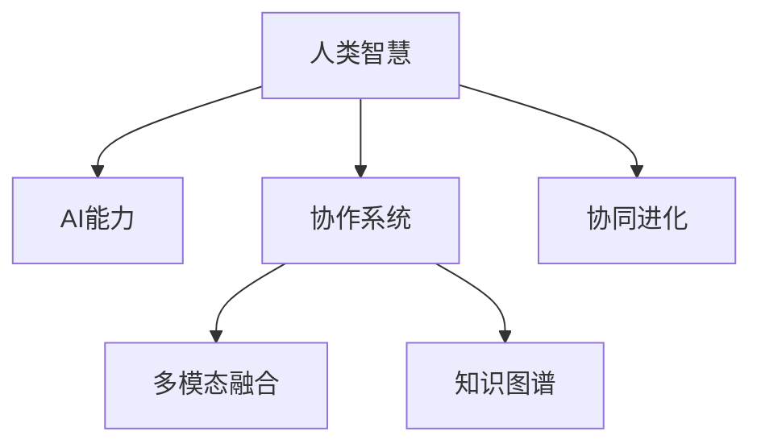

                 

# 人类-AI协作：增强人类智慧与AI能力的融合演进

> 关键词：人类智慧增强，AI能力融合，协作系统，协同进化，知识图谱，人机交互，深度学习，多模态融合

## 1. 背景介绍

### 1.1 问题由来

在当今信息爆炸和智能技术不断发展的时代，人类面临越来越多的复杂决策任务。这些任务涉及对海量数据的分析、对复杂系统的理解和操作、对未知领域的探索等，单靠人类智能难以有效应对。因此，人工智能（AI）作为人类智慧的外延和扩展，在许多领域发挥着越来越重要的作用。然而，尽管AI技术已经取得了显著进展，但其在理解和创造性方面的能力仍然有限。

为了充分发挥AI与人类智慧的协同优势，增强人类智慧和AI能力的融合演进，成为当前研究的热点。人类-AI协作系统，通过将人类的深度思考、逻辑推理、情感智能和AI的强大计算、模式识别、自动化能力结合在一起，有望解决许多传统方法难以应对的问题。

### 1.2 问题核心关键点

人类-AI协作的核心在于如何设计一个能够高效整合人类与AI优势的系统。这种系统应具有以下几个特点：

1. **透明度和可解释性**：使得人类能够理解AI决策的逻辑和依据。
2. **动态自适应**：系统能够根据人类反馈和环境变化进行自我优化和调整。
3. **高效协同**：AI和人类在任务执行中能够无缝配合，实现最优解。
4. **知识共享**：AI能够积累和存储人类智慧，并在需要时提供支持。
5. **伦理合规**：确保系统决策符合道德规范和社会伦理。

本文将围绕这些关键点，详细探讨人类-AI协作系统的设计原理、实现方法、实际应用和未来展望。

## 2. 核心概念与联系

### 2.1 核心概念概述

为了更好地理解人类-AI协作系统，本节将介绍几个关键概念及其相互联系：

- **人类智慧**：指人类基于经验、知识和直觉进行决策和判断的能力，包括逻辑推理、创造性思维、情感智能等。
- **AI能力**：指人工智能系统通过算法、模型和数据处理能力进行计算、识别和自动化决策的能力，包括模式识别、数据分析、自动化执行等。
- **协作系统**：指将人类智慧和AI能力结合在一起，协同完成复杂任务的智能系统。
- **多模态融合**：指结合文本、图像、语音、视频等多种信息形式，全面理解和处理任务信息。
- **知识图谱**：指将知识以图的形式组织起来，便于检索和推理，支持AI系统对知识进行高效利用。
- **协同进化**：指AI与人类在协作过程中相互学习和优化，实现系统性能的持续提升。

这些核心概念之间的逻辑关系可以通过以下Mermaid流程图来展示：



这个流程图展示了各个概念之间的关系：

1. 人类智慧和AI能力作为协作系统的两个核心，通过多模态融合和知识图谱的支持，协同进化，共同解决任务。

## 3. 核心算法原理 & 具体操作步骤
### 3.1 算法原理概述

人类-AI协作系统的核心算法原理主要基于人机协同决策的逻辑。其基本思想是：将人类专家的知识和经验与AI的强大计算能力结合，利用多模态数据和知识图谱，通过协同进化不断提升系统的整体性能。

具体而言，协作系统在执行任务时，先由AI系统对数据进行处理和分析，提取关键特征，生成初步结果。然后，人类专家对初步结果进行审核和修正，提出改进建议。AI系统根据这些建议进一步优化模型和算法，并重新处理数据。这样循环往复，直到满足预设的精度要求。

### 3.2 算法步骤详解

人类-AI协作系统的设计和实现，一般包括以下关键步骤：

**Step 1: 系统架构设计**
- 设计系统的模块结构，明确各个组件的功能和交互方式。
- 确定数据输入、处理、输出和反馈的流程。
- 选择合适的AI算法和模型，如深度学习、强化学习、决策树等。

**Step 2: 数据收集与预处理**
- 收集任务相关的多模态数据，包括文本、图像、语音、视频等。
- 对数据进行清洗、标注、归一化等预处理，保证数据质量。
- 构建知识图谱，将知识以结构化的形式组织起来，便于系统检索和推理。

**Step 3: 协同决策算法设计**
- 设计协同决策算法，实现人机交互和信息融合。
- 实现AI系统的模型训练和优化，生成初步结果。
- 实现人类专家的反馈机制，生成改进建议。
- 设计协同进化算法，不断优化模型和数据。

**Step 4: 系统实现与测试**
- 将设计好的系统进行编码实现，选择合适的编程语言和框架。
- 对系统进行测试和验证，确保各个组件正常工作。
- 进行系统性能评估，优化系统设计。

**Step 5: 部署与应用**
- 将系统部署到实际应用环境中，接入各类数据源和用户接口。
- 持续收集用户反馈，优化系统功能和用户体验。
- 定期更新系统和数据，保持系统的高效性和适应性。

### 3.3 算法优缺点

人类-AI协作系统的优点包括：

1. **决策透明度**：人类专家的介入使得系统决策过程透明，便于理解和审核。
2. **高效协同**：AI处理海量数据和复杂任务的能力，与人类专家的经验结合，形成高效的协同决策机制。
3. **知识积累**：系统能够不断积累和存储人类智慧，支持未来任务的智能处理。
4. **灵活适应**：系统能够根据环境变化和用户需求进行动态调整，提升适应性。

缺点包括：

1. **初始化成本高**：系统设计和开发成本较高，需要大量专业知识和经验。
2. **人机交互复杂**：人机交互界面设计复杂，需要综合考虑人类专家的使用习惯和心理需求。
3. **动态优化困难**：系统优化算法复杂，需要多轮迭代和调整才能达到理想效果。
4. **数据依赖性强**：系统依赖高质量的数据和知识图谱，数据获取和处理成本较高。

## 4. 数学模型和公式 & 详细讲解 & 举例说明
### 4.1 数学模型构建

为了更好地描述人类-AI协作系统的核心算法，本节将使用数学语言对协同决策和协同进化的过程进行严格的刻画。

假设协作系统包含人类专家和AI系统两个部分，分别用 $H$ 和 $A$ 表示。在执行任务 $T$ 时，系统的决策过程可以表示为：

$$
D(T) = f(H(T), A(T))
$$

其中 $f$ 表示协同决策函数，将人类专家和AI系统的决策结果进行融合。

AI系统的模型参数为 $\theta$，数据集为 $D_A$，训练损失函数为 $\mathcal{L}_A$，优化算法为 $O_A$。AI系统的决策过程可以表示为：

$$
A(T) = M_{\theta}(D_A)
$$

其中 $M_{\theta}$ 表示AI模型，$D_A$ 表示训练数据集。

人类专家的决策过程可以表示为：

$$
H(T) = H_T + \alpha H_R
$$

其中 $H_T$ 表示基于历史经验和知识图谱的决策，$H_R$ 表示基于实时数据和AI系统输出的反馈调整。$\alpha$ 表示反馈调整的权重。

### 4.2 公式推导过程

以一个简单的协同决策问题为例，假设任务 $T$ 为文本分类，AI系统使用深度学习模型，人类专家使用基于规则的系统。AI模型的输出为概率分布 $p(y|x)$，其中 $y$ 表示分类标签，$x$ 表示文本。人类专家的决策规则为 $H_R = \max_{y}(p(y|x))$，表示选择概率最大的分类标签。

AI系统使用交叉熵损失函数进行训练，目标是最小化损失：

$$
\mathcal{L}_A = -\frac{1}{N}\sum_{i=1}^N \sum_{y} p(y|x_i) \log p(y|x_i)
$$

人类专家对AI系统的输出进行反馈，生成改进建议。假设反馈建议为 $s$，则有：

$$
s = H_R - \max_{y}(p(y|x))
$$

根据反馈建议，AI系统对模型进行优化，更新参数：

$$
\theta \leftarrow \theta - \eta \nabla_{\theta}\mathcal{L}_A
$$

其中 $\eta$ 表示学习率，$\nabla_{\theta}\mathcal{L}_A$ 表示损失函数对模型参数的梯度。

### 4.3 案例分析与讲解

以医疗诊断为例，展示人类-AI协作系统的应用。

AI系统使用深度学习模型进行影像识别和症状分析，生成初步诊断结果。人类专家对初步结果进行审核，提出改进建议，如修改影像分析参数、调整诊断规则等。AI系统根据建议进行参数优化和模型调整，重新生成诊断结果。这样反复迭代，直到满足预设的精度要求。

## 5. 项目实践：代码实例和详细解释说明
### 5.1 开发环境搭建

在进行人类-AI协作系统的开发前，我们需要准备好开发环境。以下是使用Python进行开发的环境配置流程：

1. 安装Anaconda：从官网下载并安装Anaconda，用于创建独立的Python环境。

2. 创建并激活虚拟环境：
```bash
conda create -n human-ai python=3.8 
conda activate human-ai
```

3. 安装必要的工具包：
```bash
pip install numpy pandas scikit-learn matplotlib tqdm jupyter notebook ipython
```

4. 安装TensorFlow和TensorBoard：
```bash
pip install tensorflow tensorboard
```

5. 安装Jupyter Notebook和MXNet：
```bash
pip install jupyterlab mxnet
```

完成上述步骤后，即可在`human-ai`环境中开始协作系统的开发。

### 5.2 源代码详细实现

我们以一个简单的协同决策系统为例，展示如何使用Python和TensorFlow进行开发。

首先，定义协同决策函数：

```python
import tensorflow as tf

def collaborative_decision(human_decision, ai_output):
    # 将人类决策和AI输出进行融合
    combined_decision = human_decision + ai_output
    # 返回融合后的决策
    return combined_decision
```

然后，定义AI模型和训练过程：

```python
import mxnet as mx

# 定义AI模型
model = mx.gluon.nn.Sequential()
# 添加多个全连接层
model.add(mx.gluon.nn.Dense(128, activation='relu'))
model.add(mx.gluon.nn.Dense(64, activation='relu'))
model.add(mx.gluon.nn.Dense(10, activation='softmax'))

# 定义优化器
optimizer = mx.optimizer.Adam(learning_rate=0.001)

# 定义训练过程
def train(data, labels):
    model.train()
    loss = 0
    for batch in data:
        inputs = batch['data']
        targets = batch['label']
        # 前向传播
        outputs = model(inputs)
        # 计算损失
        loss += mx.nd.mean(mx.nd.softmax_cross_entropy(outputs, targets))
        # 反向传播和更新参数
        optimizer.step(inputs, outputs, targets)
        # 计算当前损失
        current_loss = mx.nd.mean(mx.nd.softmax_cross_entropy(outputs, targets))
        # 输出当前损失
        print('Batch loss:', current_loss.asscalar())
    # 返回总损失
    return loss.asscalar()
```

最后，定义人类专家的决策规则：

```python
def human_decision(x, model):
    # 使用AI模型进行预测
    ai_output = model.predict(x)
    # 选择概率最大的标签
    human_decision = tf.argmax(ai_output, axis=1)
    # 返回决策结果
    return human_decision.numpy()
```

完整代码实现如下：

```python
import tensorflow as tf
import mxnet as mx

def collaborative_decision(human_decision, ai_output):
    combined_decision = human_decision + ai_output
    return combined_decision

def train(data, labels):
    model = mx.gluon.nn.Sequential()
    model.add(mx.gluon.nn.Dense(128, activation='relu'))
    model.add(mx.gluon.nn.Dense(64, activation='relu'))
    model.add(mx.gluon.nn.Dense(10, activation='softmax'))
    optimizer = mx.optimizer.Adam(learning_rate=0.001)
    loss = 0
    for batch in data:
        inputs = batch['data']
        targets = batch['label']
        outputs = model(inputs)
        loss += mx.nd.mean(mx.nd.softmax_cross_entropy(outputs, targets))
        optimizer.step(inputs, outputs, targets)
        current_loss = mx.nd.mean(mx.nd.softmax_cross_entropy(outputs, targets))
        print('Batch loss:', current_loss.asscalar())
    return loss.asscalar()

def human_decision(x, model):
    ai_output = model.predict(x)
    human_decision = tf.argmax(ai_output, axis=1)
    return human_decision.numpy()
```

### 5.3 代码解读与分析

让我们再详细解读一下关键代码的实现细节：

**collaborative_decision函数**：
- 将人类决策和AI输出进行融合，生成协同决策结果。

**train函数**：
- 定义AI模型和优化器，进行模型训练。
- 遍历训练数据，进行前向传播、反向传播和参数更新。
- 计算当前损失并输出。

**human_decision函数**：
- 使用AI模型进行预测，选择概率最大的标签作为人类专家的决策结果。

**完整代码实现**：
- 将人类专家和AI系统集成到协作决策函数中，实现协同决策。
- 训练AI模型，生成初步结果。
- 人类专家对初步结果进行审核和修正，生成改进建议。
- AI系统根据建议进一步优化模型和算法，重新生成决策结果。

## 6. 实际应用场景
### 6.1 智能医疗诊断

智能医疗诊断系统可以通过人类-AI协作，实现疾病预测、影像分析、个性化治疗方案等功能的增强。AI系统使用深度学习模型进行影像识别和症状分析，生成初步诊断结果。人类专家对初步结果进行审核和修正，提出改进建议。AI系统根据建议进行参数优化和模型调整，重新生成诊断结果。这样反复迭代，直到满足预设的精度要求。

### 6.2 智能教育

智能教育系统可以通过人类-AI协作，实现个性化教学、智能评估、学习路径规划等功能。AI系统使用自然语言处理技术进行作业批改和评估，生成初步结果。人类教师对初步结果进行审核和修正，提出改进建议。AI系统根据建议进行模型优化和规则调整，重新生成评估结果。这样反复迭代，提升教学质量和学习效果。

### 6.3 智能交通

智能交通系统可以通过人类-AI协作，实现交通流量预测、事故预警、智能导航等功能。AI系统使用深度学习模型进行交通数据分析，生成初步结果。人类交通管理人员对初步结果进行审核和修正，提出改进建议。AI系统根据建议进行模型调整和规则优化，重新生成交通管理策略。这样反复迭代，提高交通管理效率和安全性。

## 7. 工具和资源推荐
### 7.1 学习资源推荐

为了帮助开发者系统掌握人类-AI协作的理论基础和实践技巧，这里推荐一些优质的学习资源：

1. 《人类-AI协作》系列博文：由人类-AI协作技术专家撰写，深入浅出地介绍了协作系统的设计原理、实现方法、应用场景等前沿话题。

2. 《协同决策》课程：斯坦福大学开设的协同决策课程，有Lecture视频和配套作业，带你入门协同决策的理论和实践。

3. 《人机协同》书籍：介绍人类-AI协作的理论和实践，涵盖多个实际案例，详细解读协作系统的设计与实现。

4. HuggingFace官方文档：提供丰富的预训练语言模型和协作系统的样例代码，是实践协作系统开发的必备资料。

5. ArXiv开源项目：人类-AI协作技术的最新研究成果，涵盖多个前沿方向，助力技术创新。

通过对这些资源的学习实践，相信你一定能够快速掌握人类-AI协作的精髓，并用于解决实际的复杂决策问题。

### 7.2 开发工具推荐

高效的开发离不开优秀的工具支持。以下是几款用于人类-AI协作系统开发的常用工具：

1. TensorFlow：基于Python的开源深度学习框架，灵活动态的计算图，适合快速迭代研究。提供丰富的AI模型和优化器，适合协作系统的设计和训练。

2. MXNet：由Apache基金会支持的深度学习框架，支持分布式训练和推理，适合大规模协作系统的部署和优化。

3. Jupyter Notebook：免费提供的交互式编程环境，支持Python和R等多种编程语言，适合快速实验和协作开发。

4. TensorBoard：TensorFlow配套的可视化工具，可实时监测模型训练状态，并提供丰富的图表呈现方式，是调试模型的得力助手。

5. Weights & Biases：模型训练的实验跟踪工具，可以记录和可视化模型训练过程中的各项指标，方便对比和调优。

6. Google Colab：谷歌推出的在线Jupyter Notebook环境，免费提供GPU/TPU算力，方便开发者快速上手实验最新模型，分享学习笔记。

合理利用这些工具，可以显著提升人类-AI协作系统的开发效率，加快创新迭代的步伐。

### 7.3 相关论文推荐

人类-AI协作技术的发展源于学界的持续研究。以下是几篇奠基性的相关论文，推荐阅读：

1. "Human-AI Collaboration in Decision Making"：探讨人类-AI协作的决策逻辑和优化方法，提出协同决策和协同进化的算法。

2. "Multimodal Fusion for Human-AI Collaboration"：介绍多模态融合技术在人类-AI协作中的应用，提出基于知识图谱的多模态推理框架。

3. "Human-AI Collaboration in Medical Diagnosis"：展示人类-AI协作在医疗诊断中的应用，提出协同决策和模型优化的具体方法。

4. "Human-AI Collaboration in Education"：介绍人类-AI协作在教育领域的应用，提出智能评估和个性化教学的算法。

5. "Human-AI Collaboration in Traffic Management"：展示人类-AI协作在智能交通中的应用，提出交通流量预测和智能导航的算法。

这些论文代表了大规模协作系统的发展脉络。通过学习这些前沿成果，可以帮助研究者把握学科前进方向，激发更多的创新灵感。

## 8. 总结：未来发展趋势与挑战
### 8.1 总结

本文对人类-AI协作系统进行了全面系统的介绍。首先阐述了人类-AI协作系统的研究背景和意义，明确了协作系统在增强人类智慧和AI能力方面的独特价值。其次，从原理到实践，详细讲解了协作系统的设计原理、实现方法、实际应用和未来展望。

通过本文的系统梳理，可以看到，人类-AI协作系统通过人机协同决策，能够实现高效、透明、智能的决策，提升复杂任务的处理能力。随着深度学习、多模态融合、协同进化等技术的不断进步，人类-AI协作系统将具有更加广泛的应用前景，为人类的智慧和AI能力的融合演进提供新的动力。

### 8.2 未来发展趋势

展望未来，人类-AI协作系统将呈现以下几个发展趋势：

1. **多模态融合的深化**：随着传感器技术的发展，多模态数据将更加丰富和多样化。系统需要更高效的多模态融合方法，实现多源数据的无缝集成和协同处理。

2. **知识图谱的扩展**：知识图谱将成为协作系统的核心组件，帮助AI系统更好地理解人类智慧和知识。未来需要更强大的知识获取和推理技术，支持大规模、多领域的知识图谱构建。

3. **协同进化的智能化**：协同进化的算法将更加智能化，能够动态学习人类反馈和环境变化，实现系统性能的持续优化。

4. **交互界面的优化**：人机交互界面将更加友好和高效，支持自然语言理解和情感智能，提升用户的使用体验。

5. **安全性与伦理**：协作系统需要在设计中考虑安全性与伦理问题，确保系统决策符合道德规范和社会价值观。

6. **边缘计算的应用**：协作系统将更多地应用于边缘计算环境中，支持本地数据处理和决策，提升系统的实时性和隐私保护。

以上趋势凸显了人类-AI协作技术的广阔前景。这些方向的探索发展，必将进一步提升协作系统的性能和应用范围，为人类智慧和AI能力的融合演进带来新的突破。

### 8.3 面临的挑战

尽管人类-AI协作技术已经取得了显著进展，但在迈向更加智能化、普适化应用的过程中，它仍面临诸多挑战：

1. **数据隐私与安全**：协作系统需要处理大量的个人数据，数据隐私和安全问题亟需解决。

2. **决策透明度**：协作系统的决策过程需要具备足够的透明度，便于人类理解和审核。

3. **动态优化困难**：系统优化算法复杂，需要多轮迭代和调整才能达到理想效果。

4. **跨领域适应性**：协作系统需要具备跨领域的适应性，能够灵活应用到不同领域和任务中。

5. **模型鲁棒性**：系统需要具备较强的鲁棒性，能够在各种异常情况下保持稳定。

6. **用户接受度**：协作系统需要符合用户的心理预期和行为习惯，提升用户接受度。

7. **技术标准与规范**：协作系统的标准化和规范化问题需要进一步研究，确保系统的互操作性和通用性。

面对这些挑战，未来的研究需要在多个方面进行深入探索和实践。只有全面提升系统性能和用户体验，才能真正实现人类-AI协作技术在多个领域的广泛应用。

### 8.4 研究展望

未来，人类-AI协作技术的发展方向主要包括：

1. **多模态融合技术的优化**：通过引入更多传感器和多模态数据，提升协作系统的感知和处理能力。

2. **知识图谱构建与演化**：研究大规模知识图谱的构建方法，实现知识图谱的动态演化和增量更新。

3. **协同进化算法的创新**：探索更加智能化和自适应的协同进化算法，提升协作系统的优化效果。

4. **人机交互界面的创新**：设计更加自然和友好的交互界面，支持多语言、多文化背景的用户。

5. **安全性与伦理的保障**：在协作系统的设计中引入安全性与伦理导向，确保系统的可靠性和可信性。

6. **边缘计算与分布式协同**：将协作系统部署到边缘计算环境中，实现本地数据处理和决策，提升系统的实时性和隐私保护。

这些研究方向的探索，必将引领人类-AI协作技术迈向更高的台阶，为构建安全、可靠、智能的协作系统提供新的动力。面向未来，人类-AI协作技术还需要与其他人工智能技术进行更深入的融合，如知识表示、因果推理、强化学习等，多路径协同发力，共同推动智能技术的进步。

## 9. 附录：常见问题与解答
----------------------------------------------------------------

**Q1: 人类-AI协作系统与传统人机交互系统有何不同？**

A: 人类-AI协作系统与传统人机交互系统的主要区别在于决策过程和数据处理方式。传统人机交互系统主要依赖规则和算法进行自动化决策，数据处理以规则为主。而人类-AI协作系统通过人机协同决策，将人类智慧和AI能力结合，实现更复杂、更精确的决策。协作系统能够动态学习人类反馈和环境变化，提升系统的自适应性和智能化水平。

**Q2: 如何设计高效的多模态融合算法？**

A: 高效的多模态融合算法需要考虑不同模态数据的特点和相互关系，设计合适的数据融合方法。一般采用深度学习模型，如卷积神经网络、注意力机制等，实现多模态数据的联合处理。同时需要引入知识图谱和语义嵌入，提升数据融合的效果。

**Q3: 如何保证协作系统的决策透明度？**

A: 协作系统的决策透明度可以通过设计合适的交互界面和反馈机制来实现。界面应支持自然语言理解和情感智能，便于用户输入和输出。反馈机制应支持用户对系统决策的审核和修正，及时反馈用户意见和建议，提升系统的决策准确性和可解释性。

**Q4: 如何优化协作系统的动态优化算法？**

A: 协作系统的动态优化算法需要考虑多轮迭代和调整的过程，设计合适的优化策略和评估指标。可以采用协同进化算法，通过多轮迭代优化系统参数和模型。同时引入正则化技术和超参数调优，防止过拟合和模型退化。

**Q5: 如何提升协作系统的跨领域适应性？**

A: 提升协作系统的跨领域适应性需要设计通用的知识图谱和算法框架，支持跨领域的数据处理和推理。可以引入通用的本体和规则，支持不同领域的知识表示和推理。同时需要引入迁移学习和少样本学习，支持系统在少量样本上的快速适应和迁移。

这些问题的探讨，有助于理解人类-AI协作系统的设计与实现，进一步推动协作技术的发展和应用。

---

作者：禅与计算机程序设计艺术 / Zen and the Art of Computer Programming

