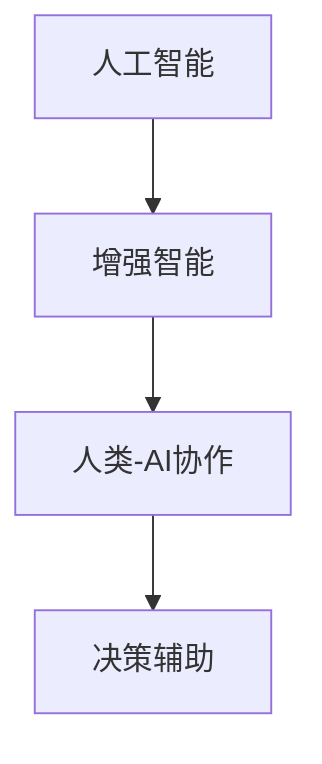

                 

# 人类-AI协作：增强人类潜能

> 关键词：人类-AI协作,增强人类潜能,AI辅助决策,人工智能,智能增强,认知科学,人机融合

## 1. 背景介绍

在快速发展的科技浪潮中，人工智能（AI）技术正逐步渗透到人类社会的各个领域，从自动化生产线到智能客服，从医疗诊断到金融交易，AI正以前所未有的速度改变着我们的生活和工作方式。然而，AI技术并非万能，它仍有许多局限性。人类作为具有复杂认知和情感能力的生物，拥有AI无法替代的直觉、创造力和情感共鸣。因此，如何结合AI与人类优势，构建一个更加高效、智能、和谐的社会，成为当前社会各界热议的话题。

本文旨在探讨人类-AI协作的理念，分析AI如何帮助人类增强潜能，以及AI与人类协作的未来展望。我们将从核心概念、算法原理、实践应用、未来发展趋势等多个角度，深入探讨AI与人类协作的潜力，并探讨其在不同领域的实际应用案例。

## 2. 核心概念与联系

### 2.1 核心概念概述

为了更好地理解人类-AI协作，我们首先需要明确几个核心概念：

- **人工智能**：指通过计算机系统模拟人类智能过程，如感知、推理、决策等。
- **增强智能**：指通过AI技术增强人类的认知和操作能力，提升人类潜能。
- **人类-AI协作**：指人类与AI系统共同工作，以实现更高效、更智能的任务处理。
- **决策辅助**：指AI系统辅助人类做出更准确、更快速的决策，尤其是在高复杂度、高风险任务中。

### 2.2 核心概念原理和架构的 Mermaid 流程图



这个流程图展示了从人工智能到增强智能，再到人类-AI协作的基本架构。人工智能通过模拟人类智能过程，实现对数据的处理和分析；增强智能则利用AI技术，提升人类的认知和操作能力；而决策辅助则是在这些基础上，进一步增强人类的决策能力，使AI与人类形成合力，提升整体工作效率和决策水平。

## 3. 核心算法原理 & 具体操作步骤

### 3.1 算法原理概述

人类-AI协作的核心在于如何利用AI技术提升人类潜能。AI系统可以通过以下几个方面来增强人类：

- **数据处理与分析**：AI可以处理和分析大量数据，从中提取出有价值的信息，帮助人类做出更加准确和快速的决策。
- **模式识别与预测**：AI可以识别数据中的模式和趋势，预测未来的变化，帮助人类预测和规划未来。
- **自动化与优化**：AI可以自动化执行重复性高、耗时长的工作，优化任务流程，提高工作效率。
- **增强学习与智能推荐**：AI通过学习和推荐，帮助人类发现新的知识和技能，提升认知水平。

### 3.2 算法步骤详解

人类-AI协作的算法步骤通常包括以下几个关键步骤：

**Step 1: 数据收集与预处理**
- 收集相关领域的数据，如医疗记录、市场数据、用户行为等。
- 对数据进行清洗、去噪和归一化处理，确保数据质量。

**Step 2: 模型训练与优化**
- 选择合适的AI模型，如决策树、神经网络、深度学习等，对数据进行训练。
- 根据模型表现进行优化，调整模型参数和算法，提升模型精度。

**Step 3: 模型集成与融合**
- 将多个AI模型集成起来，形成一个综合系统，提升整体性能。
- 引入人机交互技术，使AI模型能够根据人类需求进行适应性调整。

**Step 4: 应用部署与反馈**
- 将训练好的模型部署到实际应用中，进行实时监控和反馈。
- 根据应用效果和用户反馈，不断优化模型，提升用户体验。

### 3.3 算法优缺点

人类-AI协作具有以下优点：

- **提升效率**：AI可以处理大量数据，快速提取有价值信息，帮助人类在短时间内做出决策。
- **减少错误**：AI系统能够发现和纠正人类在数据处理和分析中的错误，提高决策准确性。
- **优化流程**：AI可以自动执行重复性高、耗时长的工作，优化任务流程，提高工作效率。

同时，该方法也存在一些局限性：

- **依赖数据质量**：AI系统的性能很大程度上依赖于数据的质量和数量，数据不足或质量不高将影响系统效果。
- **模型透明性不足**：AI模型的决策过程往往缺乏可解释性，难以对其推理逻辑进行分析和调试。
- **伦理与安全问题**：AI系统可能会引入偏见和错误，甚至对人类安全造成威胁。

### 3.4 算法应用领域

人类-AI协作已经在许多领域得到了广泛应用，例如：

- **医疗领域**：AI辅助诊断、治疗方案推荐、病历分析等。
- **金融领域**：风险评估、投资决策、欺诈检测等。
- **教育领域**：个性化学习、作业批改、知识推荐等。
- **制造领域**：生产调度、质量控制、设备维护等。
- **安防领域**：人脸识别、行为分析、异常检测等。

这些领域的应用表明，人类-AI协作能够显著提升工作效率，降低成本，提高决策准确性，为各行各业带来新的发展机遇。

## 4. 数学模型和公式 & 详细讲解 & 举例说明

### 4.1 数学模型构建

在人类-AI协作中，常用的数学模型包括线性回归、逻辑回归、决策树、随机森林、神经网络等。这些模型通过数学公式和算法，可以对数据进行分析和预测。

以神经网络为例，其数学模型构建如下：

$$
y = \sum_{i=1}^n w_i x_i + b
$$

其中，$y$ 为输出，$x_i$ 为输入特征，$w_i$ 为权重，$b$ 为偏置。神经网络通过多层非线性变换，将输入特征映射到输出结果。

### 4.2 公式推导过程

以线性回归模型为例，其目标是最小化预测值与实际值之间的误差：

$$
\min_{w,b} \frac{1}{2m} \sum_{i=1}^m (y^{(i)} - w^T x^{(i)} - b)^2
$$

通过梯度下降等优化算法，不断调整权重和偏置，使模型逼近真实数据。

### 4.3 案例分析与讲解

以金融领域的信用风险评估为例，神经网络模型可以通过对用户历史信用数据、收入情况、社交网络等特征进行分析，预测其信用风险。在模型训练过程中，通过大量标注数据进行监督学习，使模型能够从数据中学习到信用风险的规律，从而辅助银行等金融机构做出更准确的贷款决策。

## 5. 项目实践：代码实例和详细解释说明

### 5.1 开发环境搭建

在进行人类-AI协作的实践前，我们需要准备好开发环境。以下是使用Python进行TensorFlow开发的环境配置流程：

1. 安装Anaconda：从官网下载并安装Anaconda，用于创建独立的Python环境。

2. 创建并激活虚拟环境：
```bash
conda create -n tf-env python=3.8 
conda activate tf-env
```

3. 安装TensorFlow：根据CUDA版本，从官网获取对应的安装命令。例如：
```bash
conda install tensorflow tensorflow-gpu=cuda11.1 -c pytorch -c conda-forge
```

4. 安装各类工具包：
```bash
pip install numpy pandas scikit-learn matplotlib tqdm jupyter notebook ipython
```

完成上述步骤后，即可在`tf-env`环境中开始实践。

### 5.2 源代码详细实现

这里我们以信用风险评估为例，给出使用TensorFlow进行神经网络模型训练的代码实现。

```python
import tensorflow as tf
from tensorflow.keras import layers, models

# 定义输入和输出特征
input_features = layers.Input(shape=(5,), name='input')
output = layers.Dense(1, activation='sigmoid', name='output')(input_features)

# 定义模型
model = models.Model(inputs=input_features, outputs=output)
model.compile(optimizer='adam', loss='binary_crossentropy', metrics=['accuracy'])

# 加载数据集
x_train, y_train = load_data('train.csv')
x_test, y_test = load_data('test.csv')

# 训练模型
model.fit(x_train, y_train, epochs=10, batch_size=32, validation_data=(x_test, y_test))

# 评估模型
score = model.evaluate(x_test, y_test, verbose=0)
print('Test loss:', score[0])
print('Test accuracy:', score[1])
```

以上就是使用TensorFlow进行神经网络模型训练的完整代码实现。可以看到，TensorFlow提供了简单易用的API，可以快速实现各种类型的神经网络模型。

### 5.3 代码解读与分析

让我们再详细解读一下关键代码的实现细节：

- `Input`层：定义输入数据的维度和特征。
- `Dense`层：定义全连接层，将输入数据映射到输出。
- `Model`层：将输入层和输出层组合成模型。
- `compile`方法：配置优化器、损失函数和评估指标。
- `fit`方法：训练模型，指定训练数据、批次大小、训练轮数等参数。
- `evaluate`方法：评估模型，返回损失和准确率。

这些代码通过简单的几行命令，完成了神经网络模型的构建、训练和评估。TensorFlow的高级API使得代码实现变得非常简洁，开发者可以专注于模型设计和算法优化。

## 6. 实际应用场景

### 6.1 医疗领域

在医疗领域，AI辅助诊断、治疗方案推荐、病历分析等应用已得到广泛应用。AI系统可以通过对大量医学数据进行分析，辅助医生做出更准确的诊断和治疗决策，提高医疗服务质量。

例如，AI可以通过对医学影像进行深度学习，识别出肿瘤、骨折等病变，辅助医生进行诊断。同时，AI还可以通过分析患者的病历和基因数据，推荐最适合的治疗方案，提升治疗效果。

### 6.2 金融领域

金融领域也是AI应用的重要场景之一。AI系统可以通过对市场数据、用户行为等进行分析，辅助金融机构做出更准确的投资决策、风险评估和欺诈检测。

例如，AI可以通过对历史交易数据进行深度学习，预测市场趋势，辅助投资者做出更准确的投资决策。同时，AI还可以通过分析用户的交易行为，识别潜在的欺诈行为，提高金融安全。

### 6.3 教育领域

在教育领域，AI可以用于个性化学习、作业批改、知识推荐等应用。AI系统可以通过分析学生的学习数据，推荐最适合的学习资源和练习题，提升学习效果。

例如，AI可以通过对学生的作业进行批改，发现错误并提供详细的反馈，帮助学生快速纠正错误。同时，AI还可以通过分析学生的学习数据，推荐适合的学习资源和练习题，提升学习效果。

### 6.4 未来应用展望

随着AI技术的不断进步，未来AI与人类协作将展现出更加广阔的前景。以下是几个可能的发展方向：

- **多模态融合**：AI系统可以通过融合视觉、语音、文本等多种模态数据，提供更加全面的信息支持。
- **交互式AI**：AI系统可以通过自然语言处理和情感分析技术，实现与用户的交互式对话，提升用户体验。
- **伦理与安全**：AI系统需要引入伦理和安全的考虑，避免偏见和错误，确保数据和模型的安全。
- **人机协同**：AI系统与人类协作将成为未来的主流，实现更加高效、智能、和谐的任务处理。

## 7. 工具和资源推荐

### 7.1 学习资源推荐

为了帮助开发者系统掌握人类-AI协作的理论基础和实践技巧，这里推荐一些优质的学习资源：

1. **《人工智能基础》系列课程**：由斯坦福大学、麻省理工学院等名校提供的公开课，涵盖人工智能的各个基础领域，帮助理解AI的核心原理。
2. **TensorFlow官方文档**：TensorFlow的官方文档提供了详尽的API文档和示例代码，帮助开发者快速上手TensorFlow。
3. **PyTorch官方文档**：PyTorch的官方文档提供了丰富的API和示例代码，帮助开发者快速实现各种类型的神经网络模型。
4. **Kaggle竞赛**：Kaggle提供了大量的数据集和竞赛任务，帮助开发者在实践中积累经验，提升技能。
5. **arXiv预印本**：arXiv上提供了大量的前沿论文，帮助开发者了解最新的AI研究动态。

通过这些学习资源的学习实践，相信你一定能够快速掌握人类-AI协作的技术精髓，并用于解决实际的AI问题。

### 7.2 开发工具推荐

高效的开发离不开优秀的工具支持。以下是几款用于人类-AI协作开发的常用工具：

1. **TensorFlow**：由Google主导开发的深度学习框架，支持各种类型的神经网络模型，易于使用。
2. **PyTorch**：Facebook开发的深度学习框架，灵活高效，支持动态计算图。
3. **Keras**：基于TensorFlow和Theano的高级API，提供简单易用的API接口，帮助快速构建模型。
4. **Jupyter Notebook**：交互式的开发环境，支持Python代码的快速执行和结果展示。
5. **Git**：版本控制系统，帮助开发者管理代码版本，协作开发。

合理利用这些工具，可以显著提升人类-AI协作任务的开发效率，加快创新迭代的步伐。

### 7.3 相关论文推荐

人类-AI协作的研究源于学界的持续探索。以下是几篇奠基性的相关论文，推荐阅读：

1. **《深度学习》**：Goodfellow等人著，全面介绍了深度学习的原理和应用，是学习深度学习的经典教材。
2. **《增强智能：人类与人工智能的融合》**：Reilly等人著，探讨了AI如何增强人类的认知和操作能力。
3. **《人工智能与伦理》**：Russell等人著，探讨了AI技术的伦理和安全性问题。
4. **《认知科学的计算视角》**：Smolensky等人著，探讨了认知科学和计算科学的交叉，为理解AI与人类协作提供了新的视角。
5. **《人类-AI协作：技术、伦理与社会》**：Fulk等人著，探讨了人类-AI协作在技术、伦理和社会方面的挑战和机遇。

这些论文代表了人类-AI协作技术的发展脉络。通过学习这些前沿成果，可以帮助研究者把握学科前进方向，激发更多的创新灵感。

## 8. 总结：未来发展趋势与挑战

### 8.1 研究成果总结

本文对人类-AI协作的理念进行了全面系统的介绍。首先阐述了人类-AI协作的背景和意义，明确了AI如何帮助人类增强潜能。其次，从原理到实践，详细讲解了人类-AI协作的数学模型和核心算法，给出了人类-AI协作任务的开发流程。同时，本文还探讨了人类-AI协作在医疗、金融、教育等多个领域的应用案例，展示了其在实际中的广泛应用价值。

通过本文的系统梳理，可以看到，人类-AI协作技术正在成为AI应用的重要范式，极大地提升了AI系统在各行各业中的性能和应用范围。人类-AI协作不仅能够提升工作效率，还能帮助人类发现新的知识和技能，为人类认知智能的进化带来深远影响。

### 8.2 未来发展趋势

展望未来，人类-AI协作技术将呈现以下几个发展趋势：

1. **多模态融合**：AI系统将融合视觉、语音、文本等多种模态数据，提供更加全面的信息支持。
2. **交互式AI**：AI系统将实现与用户的交互式对话，提升用户体验。
3. **伦理与安全**：AI系统将引入伦理和安全的考虑，避免偏见和错误，确保数据和模型的安全。
4. **人机协同**：AI系统与人类协作将成为未来的主流，实现更加高效、智能、和谐的任务处理。
5. **自动化与智能化**：AI系统将实现更高级别的自动化和智能化，提升人类工作的效率和质量。

这些趋势凸显了人类-AI协作技术的广阔前景。这些方向的探索发展，必将进一步提升AI系统在各行各业中的性能和应用范围，为人类认知智能的进化带来深远影响。

### 8.3 面临的挑战

尽管人类-AI协作技术已经取得了瞩目成就，但在迈向更加智能化、普适化应用的过程中，它仍面临着诸多挑战：

1. **数据质量与标注成本**：AI系统性能很大程度上依赖于数据的质量和数量，数据不足或质量不高将影响系统效果。
2. **模型透明性与可解释性**：AI模型的决策过程往往缺乏可解释性，难以对其推理逻辑进行分析和调试。
3. **伦理与安全问题**：AI系统可能会引入偏见和错误，甚至对人类安全造成威胁。
4. **计算资源与效率**：AI系统需要大量的计算资源，如何在保证性能的同时，提升系统效率，降低成本，是一个重要挑战。

### 8.4 研究展望

面对人类-AI协作面临的挑战，未来的研究需要在以下几个方面寻求新的突破：

1. **无监督与半监督学习**：摆脱对大规模标注数据的依赖，利用无监督和半监督学习范式，最大限度利用非结构化数据。
2. **增强学习与智能推荐**：开发增强学习技术，使AI系统能够不断学习新的知识和技能，提升认知水平。
3. **模型优化与压缩**：研究模型优化和压缩技术，提升模型性能和计算效率，降低成本。
4. **交互式与情感智能**：开发交互式AI系统，实现与用户的情感智能交互，提升用户体验。
5. **伦理与安全机制**：引入伦理与安全机制，确保AI系统决策的公正性与安全性。

这些研究方向的探索，必将引领人类-AI协作技术迈向更高的台阶，为构建安全、可靠、可解释、可控的智能系统铺平道路。面向未来，人类-AI协作技术还需要与其他AI技术进行更深入的融合，如知识表示、因果推理、强化学习等，多路径协同发力，共同推动人类认知智能的进化。

## 9. 附录：常见问题与解答

**Q1：人类-AI协作是否适用于所有行业？**

A: 人类-AI协作在许多行业都已经得到了广泛应用，例如医疗、金融、教育、制造、安防等。然而，对于某些特定领域，如创意写作、哲学思考等，人类独有的创造力和情感智能仍然难以被AI完全替代。因此，需要结合具体情况，合理应用人类-AI协作技术。

**Q2：如何选择合适的AI模型？**

A: 选择合适的AI模型需要考虑以下几个因素：
1. **数据类型**：不同的数据类型适合不同的模型，如图像数据适合卷积神经网络，文本数据适合循环神经网络和Transformer模型。
2. **任务复杂度**：任务复杂度越高，需要模型的能力越强，如深度学习模型适合高复杂度的任务，而浅层模型适合简单的任务。
3. **资源限制**：需要考虑计算资源和硬件设备的限制，如GPU、TPU等，选择合适的模型。

**Q3：如何避免AI系统的偏见和错误？**

A: 避免AI系统的偏见和错误需要从多个方面入手：
1. **数据多样性**：确保训练数据的多样性和代表性，避免数据偏差。
2. **模型公平性**：设计公平的评价指标，确保模型对不同群体的公平性。
3. **算法透明性**：增强AI模型的透明性和可解释性，便于发现和修正错误。
4. **伦理审查**：引入伦理审查机制，确保AI系统的决策公正与安全。

**Q4：人类-AI协作的未来方向是什么？**

A: 人类-AI协作的未来方向包括：
1. **多模态融合**：融合视觉、语音、文本等多种模态数据，提供更加全面的信息支持。
2. **交互式AI**：实现与用户的交互式对话，提升用户体验。
3. **伦理与安全**：引入伦理和安全机制，确保AI系统的决策公正与安全。
4. **人机协同**：实现人机协作，提升工作效率和质量。
5. **自动化与智能化**：实现更高级别的自动化和智能化，提升人类工作的效率和质量。

通过不断探索和创新，人类-AI协作技术将进一步拓展其应用边界，为人类认知智能的进化带来深远影响。

---

作者：禅与计算机程序设计艺术 / Zen and the Art of Computer Programming

