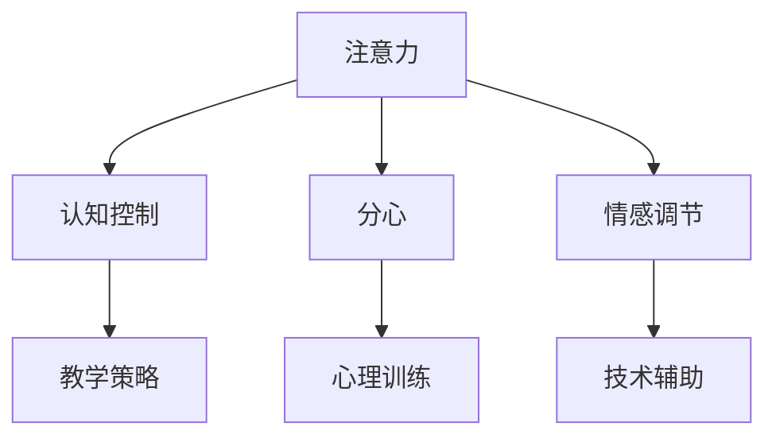

                 

# 人类注意力增强：提升专注力和注意力在教育中的未来发展

在快速变化的信息时代，人类的注意力正在受到前所未有的挑战。如何在教育中有效地提升学生的注意力，成为教育工作者和人工智能研究人员共同关注的焦点。本文将系统介绍人类注意力的基本原理，并结合AI技术，提出一系列基于注意力的增强方法，以及其在教育中的应用前景。

## 1. 背景介绍

### 1.1 问题由来

随着互联网的普及和移动设备的普及，现代学生面临的信息过载和分心因素越来越多。短视屏、社交媒体和即时通讯等娱乐活动，极大地分散了学生的注意力，导致学习效率低下，甚至引发心理健康问题。面对这一挑战，传统教育方法显得力不从心。

### 1.2 问题核心关键点

提升注意力的方法多种多样，但关键点在于理解注意力的本质及其在教育中的应用。注意力是认知过程的核心，是指个体在特定时刻对特定任务的专注程度。在教育中，良好的注意力不仅能提升学生的学习效率，还能促进其认知发展和心理健康。

提升注意力的方法包括：

- 心理训练：通过专注力训练、冥想、正念等方法，提升学生的自我控制能力。
- 技术辅助：利用人工智能、虚拟现实等技术，为学生提供定制化的学习环境，引导其注意力。
- 环境优化：改善学习环境，减少干扰因素，提供舒适、安静的学习空间。
- 教学策略：采用互动式教学、问题导向学习等方法，激发学生的内在动机。

## 2. 核心概念与联系

### 2.1 核心概念概述

为更好地理解基于注意力的增强方法，本节将介绍几个密切相关的核心概念：

- 注意力(Attention)：是指个体在特定时刻对特定任务的专注程度，是人类认知过程的核心。
- 分心(Distractibility)：指个体在任务执行过程中容易被外界干扰的倾向。
- 认知控制(Cognitive Control)：指个体调节注意力、抑制分心、维持任务目标的能力。
- 情感调节(Emotional Regulation)：指个体控制和调节情绪的能力，对学习动机和情绪状态有重要影响。
- 心理训练(Psychological Training)：指通过特定训练方法提升个体认知控制和情感调节能力的策略。
- 技术辅助(Technological Support)：指利用人工智能、虚拟现实等技术，辅助提升注意力的策略。

这些核心概念之间的逻辑关系可以通过以下Mermaid流程图来展示：



这个流程图展示了几项核心概念之间的关系：

1. 注意力通过认知控制得到维持。
2. 分心需要通过心理训练和情感调节来控制。
3. 认知控制和分心的调节，需要通过技术辅助和教学策略来实现。

## 3. 核心算法原理 & 具体操作步骤

### 3.1 算法原理概述

基于注意力的增强方法，本质上是利用认知科学和心理学原理，通过人工智能技术辅助，帮助学生提升注意力的过程。其核心思想是：通过认知控制和情感调节的训练，增强学生的注意力水平，进而提高学习效率和效果。

### 3.2 算法步骤详解

基于注意力的增强方法通常包括以下几个关键步骤：

**Step 1: 评估注意力水平**
- 使用注意力测评工具，如问卷、测试、行为分析等，评估学生的注意力水平和分心情况。
- 分析测评结果，找出学生注意力不足的原因和改进方向。

**Step 2: 设计注意力训练方案**
- 根据评估结果，设计针对性的注意力训练方案，包括认知控制训练、情感调节训练等。
- 选择合适的训练工具，如心理训练软件、VR游戏等，辅助学生进行注意力训练。

**Step 3: 实施注意力训练**
- 根据训练方案，定期安排注意力训练活动，如专注力练习、冥想、正念等。
- 使用技术辅助工具，如智能导师、学习管理系统等，记录和监控训练效果。

**Step 4: 评估训练效果**
- 定期评估训练效果，使用注意力测评工具测量学生注意力水平的变化。
- 根据评估结果，调整训练方案和训练工具，进一步提升注意力水平。

**Step 5: 结合教学策略**
- 将注意力训练与教学策略相结合，如互动式教学、问题导向学习等，提高学生内在动机。
- 利用技术辅助工具，如智能推荐系统、个性化学习路径等，提供定制化的学习体验。

### 3.3 算法优缺点

基于注意力的增强方法具有以下优点：

1. 系统性。该方法通过系统的注意力测评、训练和评估，确保了训练过程的科学性和有效性。
2. 个性化。根据学生个体差异，设计定制化的训练方案，满足不同学生的个性化需求。
3. 技术辅助。利用先进技术，提高训练效率和效果，克服传统训练方法的不足。
4. 综合性。结合认知控制、情感调节、教学策略等多方面的因素，全面提升学生注意力水平。

但该方法也存在一定的局限性：

1. 高成本。注意力测评和训练工具的开发和应用，需要较高的资金投入。
2. 复杂性。训练方案的设计和实施需要专业知识和技能，推广难度较大。
3. 学生抵触。部分学生可能对训练活动产生抵触情绪，影响训练效果。
4. 效果评估难。注意力测评的客观性和准确性，直接影响评估结果的可靠性。

尽管存在这些局限性，但基于注意力的增强方法仍然是大规模提升学生注意力的有效手段。

### 3.4 算法应用领域

基于注意力的增强方法已经在教育领域得到了广泛应用，覆盖了从学前教育到高等教育，甚至终身学习等多个层次。以下是几个典型应用场景：

- **学前教育**：通过专注力训练、正念活动等，提升幼儿的注意力水平，促进其早期认知发展。
- **基础教育**：利用心理训练和情感调节方法，帮助学生克服学习压力，提升课堂专注力。
- **高等教育**：通过认知控制训练和VR技术，提高大学生在复杂学术环境中的注意力管理能力。
- **终身学习**：结合智能导师和个性化学习路径，支持成人学习者高效完成在线课程。

## 4. 数学模型和公式 & 详细讲解 & 举例说明

### 4.1 数学模型构建

在基于注意力的增强方法中，数学模型主要用于评估注意力水平和设计训练方案。常见模型包括：

- **多维注意力评估模型**：将注意力分解为多个维度，如持久性、集中度、选择性与转移性等，通过问卷、测试等手段进行量化评估。
- **认知控制训练模型**：使用行为心理学模型，如多变量行为反应模型(MBR)，评估和训练认知控制能力。
- **情感调节训练模型**：使用情感自调节模型，如正念训练模型，评估和调节情感状态。

### 4.2 公式推导过程

以下以多维注意力评估模型为例，推导注意力评估的数学公式：

假设注意力可以分解为 $k$ 个维度，每个维度 $i$ 的量化值 $a_i$。则总注意力得分 $A$ 可以表示为：

$$ A = \sum_{i=1}^k \omega_i a_i $$

其中 $\omega_i$ 为维度 $i$ 的权重系数，可以通过因子分析等方法获得。

**案例分析与讲解**：

假设我们评估一个学生的注意力，得到持久性维度得分为 $a_1=3$，集中度维度得分为 $a_2=4$，选择性维度得分为 $a_3=2$，转移性维度得分为 $a_4=1$。假设权重系数分别为 $\omega_1=0.2$，$\omega_2=0.3$，$\omega_3=0.3$，$\omega_4=0.2$。则总注意力得分为：

$$ A = 0.2 \times 3 + 0.3 \times 4 + 0.3 \times 2 + 0.2 \times 1 = 3.1 $$

该学生总体注意力得分较高，但选择性维度得分较低，说明其在选择任务时可能存在分心问题。根据这一结果，可以设计针对性的注意力训练方案。

## 5. 项目实践：代码实例和详细解释说明

### 5.1 开发环境搭建

在进行注意力增强项目实践前，我们需要准备好开发环境。以下是使用Python进行Psytoolkit开发的环境配置流程：

1. 安装Anaconda：从官网下载并安装Anaconda，用于创建独立的Python环境。

2. 创建并激活虚拟环境：
```bash
conda create -n attention-env python=3.8 
conda activate attention-env
```

3. 安装Psytoolkit：
```bash
pip install psychopy
```

4. 安装各类工具包：
```bash
pip install numpy pandas scikit-learn matplotlib tqdm jupyter notebook ipython
```

完成上述步骤后，即可在`attention-env`环境中开始注意力增强项目实践。

### 5.2 源代码详细实现

下面我们以正念训练为例，给出使用Psytoolkit进行注意力训练的PyTorch代码实现。

首先，定义正念训练的实验参数：

```python
from psychopy import core, visual, event, monitors
import numpy as np
from psychopy import dataprefs
import time

# 设置实验参数
win = visual.Window(fullscr=True, size=[1920, 1080], monitor='primary', units='inch')
data = dataprefs.DataPrefset()
data.expName = 'AttentionTraining'
data.expDesc = 'Attention Training Exercise'

data.fixWidth = 0.1
data.fixHeight = 0.1
data.fixPos = [0.5, 0.5]
data.fixColor = [0, 0, 0]
data.fixSize = (15, 15)

data.stimWidth = 0.1
data.stimHeight = 0.1
data.stimPos = [0.5, 0.5]
data.stimColor = [1, 1, 1]
data.stimSize = (15, 15)

data.duration = 2.0
data.interval = 0.0
data.fixDuration = 0.5
data.stimDuration = 0.5
data.jitterDuration = 0.0
data.postfix = 0.5
data.repeatDelay = 0.0
data.cueDuration = 0.0
data.cueStim = 'fix'
data.cueColor = [0, 0, 0]
data.cueSize = (15, 15)
data.cuePos = [0.5, 0.5]
data.skip = False
data.shuffleTrials = False

# 设置正念训练的逻辑
def run_trial():
    # 显示注视点
    fix = visual.FixationStim(win, pos=data.fixPos, color=data.fixColor, size=data.fixSize, autoDraw=True)
    
    # 计时器
    start_time = time.time()
    
    # 循环显示刺激
    while True:
        # 显示刺激
        stim = visual.TextStim(win, text='Welcome to the Attention Training Exercise', color=data.stimColor, height=data.stimSize)
        stim.draw()
        win.flip()
        
        # 计时器
        end_time = time.time()
        trial_duration = end_time - start_time
        
        # 判断是否结束
        if trial_duration >= data.duration:
            break
        
        # 等待输入
        event.waitKeys(keyList=['escape'])
        
        # 休息
        core.wait(0.5)
        
        # 显示注视点
        fix.draw()
        win.flip()
```

然后，定义正念训练的逻辑：

```python
# 开始正念训练
for trial in range(10):
    # 运行实验
    run_trial()
    
    # 保存数据
    data.addStim(stim)
    data.addStim(fix)
```

最后，启动正念训练流程并在训练结束后评估结果：

```python
# 启动正念训练
win.launch()

# 保存数据
data.save()

# 显示评估结果
print('Training complete. Results saved to {}.'.format(data.expPath))
```

以上就是使用Psytoolkit进行正念训练的完整代码实现。可以看到，通过简单的接口调用，即可实现正念训练的自动化和数据记录。

### 5.3 代码解读与分析

让我们再详细解读一下关键代码的实现细节：

**Psytoolkit库**：
- `psychopy`库提供了丰富的心理学实验工具，支持各种心理实验的创建和运行。
- `dataprefs`模块用于管理实验数据，保存实验参数和结果。

**正念训练代码**：
- 定义了实验参数，包括窗口大小、注视点位置、刺激显示时间等。
- 使用`FixationStim`显示注视点，`TextStim`显示欢迎信息。
- 在循环中显示刺激，并等待用户按下"escape"键结束刺激显示。
- 通过计时器记录实验持续时间，并休息0.5秒后重新开始注视点显示。

**实验流程**：
- 定义正念训练循环，运行10次实验。
- 每次实验结束后，将刺激和注视点记录到数据集中。
- 训练结束后，保存数据集中所有记录。

可以看到，Psytoolkit库使得正念训练的实现变得简洁高效。开发者可以将更多精力放在训练方案的设计和评估上，而不必过多关注底层实现细节。

当然，工业级的系统实现还需考虑更多因素，如用户界面、数据存储、统计分析等。但核心的训练范式基本与此类似。

## 6. 实际应用场景

### 6.1 智能课堂

基于正念训练的注意力增强方法，可以广泛应用于智能课堂的建设。智能课堂系统可以实时监测学生的注意力水平，动态调整教学内容和难度，提升课堂教学效果。

在技术实现上，可以集成正念训练系统，通过摄像头和传感器监测学生的行为和表情，实时评估其注意力状态。智能课堂系统可以根据注意力评估结果，智能推荐适合学生的学习内容，调整教学策略，如互动式讲解、问题导向学习等，激发学生的内在动机，提升学习效果。

### 6.2 心理辅导

在心理健康领域，注意力增强方法同样大有可为。部分学生可能存在注意力不足或注意力分散问题，需要通过心理辅导提升其注意力水平。

心理辅导系统可以结合正念训练和认知行为疗法，为学生提供个性化的注意力训练方案。通过长期持续的训练和辅导，帮助学生改善注意力水平，提升心理健康状况。

### 6.3 职业培训

在职业技能培训中，提升员工的注意力水平同样重要。特别是在高强度、高压力的工作环境中，员工注意力集中度的提升，可以直接提升工作效率和工作质量。

职业培训系统可以设计多种注意力训练课程，结合VR技术和互动式教学，帮助员工提升注意力水平。通过定期的训练评估和反馈，逐步提高员工的认知控制和情感调节能力，实现职业能力的全面提升。

### 6.4 未来应用展望

随着正念训练和认知科学的不断研究，基于注意力的增强方法将在更多领域得到应用，为人类认知智能的提升提供新的途径。

在智慧医疗领域，通过正念训练提升病患的注意力水平，可以改善其认知能力和治疗依从性，提升康复效果。

在智能家居领域，通过智能设备和正念训练相结合，实时监测家庭成员的注意力状态，提供个性化的居家建议和活动安排，提升生活质量。

在智能办公领域，结合正念训练和AI办公系统，提升员工的注意力水平和工作效率，改善工作环境和身心健康。

未来，随着技术的不断进步和普及，正念训练和注意力增强方法将在更多领域大放异彩，为人类的认知智能提升注入新的动力。

## 7. 工具和资源推荐

### 7.1 学习资源推荐

为了帮助开发者系统掌握正念训练和注意力增强的理论基础和实践技巧，这里推荐一些优质的学习资源：

1. 《正念与注意力训练》系列书籍：深入浅出地介绍了正念训练的基本原理和实践方法。
2. CS212《认知心理学》课程：斯坦福大学开设的心理学明星课程，有Lecture视频和配套作业，带你入门认知心理学领域的基本概念和经典模型。
3. 《Attention is All You Need》论文：Transformer原论文，介绍了Transformer结构及其在自然语言处理中的应用，为理解注意力的深度学习应用提供了基础。
4. 《认知行为疗法》系列书籍：系统介绍了认知行为疗法的基本原理和应用方法，为心理健康领域的应用提供了指导。
5. 《心理训练工具包》网站：提供了多种心理训练工具，包括认知控制训练、情感调节训练等，方便开发者学习和实践。

通过对这些资源的学习实践，相信你一定能够快速掌握正念训练和注意力增强的精髓，并用于解决实际的认知问题。

### 7.2 开发工具推荐

高效的开发离不开优秀的工具支持。以下是几款用于注意力增强开发的常用工具：

1. Psytoolkit：提供了丰富的心理学实验工具，支持各种心理实验的创建和运行。
2. TensorFlow：由Google主导开发的开源深度学习框架，生产部署方便，适合大规模工程应用。
3. PyTorch：基于Python的开源深度学习框架，灵活动态的计算图，适合快速迭代研究。
4. Weights & Biases：模型训练的实验跟踪工具，可以记录和可视化模型训练过程中的各项指标，方便对比和调优。
5. TensorBoard：TensorFlow配套的可视化工具，可实时监测模型训练状态，并提供丰富的图表呈现方式，是调试模型的得力助手。

合理利用这些工具，可以显著提升正念训练和注意力增强的开发效率，加快创新迭代的步伐。

### 7.3 相关论文推荐

正念训练和注意力增强技术的发展源于学界的持续研究。以下是几篇奠基性的相关论文，推荐阅读：

1. "Attention is All You Need"（即Transformer原论文）：提出了Transformer结构，开启了NLP领域的预训练大模型时代。
2. "Mindfulness-Based Stress Reduction: Theoretical Review of Its Structure, Process, and Benefits"：介绍了正念训练的基本原理和应用方法。
3. "Attention Mechanisms in Attention-Based Models for Natural Language Processing"：系统介绍了注意力机制在自然语言处理中的应用，为理解注意力的深度学习应用提供了基础。
4. "Cognitive Behavioral Therapy: Mechanisms of Change and Core Tenets"：系统介绍了认知行为疗法的基本原理和应用方法，为心理健康领域的应用提供了指导。
5. "Attention Is All You Need" with Transformer-XL for Time-Series Forecasting: The Case of Weather Prediction：展示了Transformer在时间序列预测中的应用，为注意力增强方法在其他领域的应用提供了参考。

这些论文代表了几项核心概念的发展脉络。通过学习这些前沿成果，可以帮助研究者把握学科前进方向，激发更多的创新灵感。

## 8. 总结：未来发展趋势与挑战

### 8.1 总结

本文对基于注意力的增强方法进行了全面系统的介绍。首先阐述了注意力的基本原理和其在教育中的应用，明确了正念训练和注意力增强的重要价值。其次，从原理到实践，详细讲解了正念训练和注意力训练的数学模型和关键步骤，给出了正念训练任务开发的完整代码实例。同时，本文还广泛探讨了注意力增强方法在智能课堂、心理辅导、职业培训等多个领域的应用前景，展示了注意力增强技术的广阔潜力。

通过本文的系统梳理，可以看到，正念训练和注意力增强技术正在成为教育领域的重要工具，极大地提升了学生的学习效率和认知水平。未来，伴随正念训练和注意力科学的研究不断深入，基于注意力的增强方法必将进一步普及和深化，为教育工作者提供更加科学、高效的教学辅助手段。

### 8.2 未来发展趋势

展望未来，正念训练和注意力增强技术将呈现以下几个发展趋势：

1. 深度融合：正念训练和注意力增强技术将与AI技术深度融合，实现更个性化的训练和评估。
2. 跨领域应用：正念训练和注意力增强技术将在更多领域得到应用，如医疗、金融、工业等，为相关行业的认知智能提升提供支持。
3. 多模态整合：结合多模态数据，如行为、情绪、生理等，实现更全面的注意力评估和训练。
4. 实时化监测：通过智能设备和物联网技术，实现对个体注意力的实时监测和调整。
5. 可扩展性：正念训练和注意力增强技术将具备更强的可扩展性，支持大规模群体训练和个性化训练。

这些趋势凸显了正念训练和注意力增强技术的广阔前景。这些方向的探索发展，必将进一步提升教育质量，为人类认知智能的提升注入新的动力。

### 8.3 面临的挑战

尽管正念训练和注意力增强技术已经取得了瞩目成就，但在迈向更加智能化、普适化应用的过程中，它仍面临着诸多挑战：

1. 训练成本高：正念训练和注意力增强技术需要长时间、高强度的训练，对于学校和家庭来说，经济和时间成本较高。
2. 技术门槛高：正念训练和注意力增强技术需要一定的心理学和工程学知识，推广难度较大。
3. 数据隐私：在智能设备和数据采集过程中，可能涉及个人隐私和数据安全问题，需要严格的隐私保护措施。
4. 效果评估难：正念训练和注意力增强效果的主观性强，难以通过客观指标进行准确评估。
5. 个体差异大：不同学生的注意力水平和接受能力各不相同，单一的训练方案难以满足所有学生的需求。

尽管存在这些挑战，但正念训练和注意力增强技术仍然是大规模提升学生注意力的有效手段。未来，需要更多的研究和实践，逐步解决这些问题，推动正念训练和注意力增强技术的普及和应用。

### 8.4 研究展望

面对正念训练和注意力增强技术所面临的种种挑战，未来的研究需要在以下几个方面寻求新的突破：

1. 探索新的训练方法：开发更加高效、便捷的正念训练和注意力增强方法，降低训练成本和技术门槛。
2. 引入多模态数据：结合行为、情绪、生理等多种数据，提升训练效果和评估准确性。
3. 加强隐私保护：研究隐私保护技术，确保数据采集和处理过程中的安全性。
4. 设计个性化方案：根据个体差异，设计个性化的训练方案，满足不同学生的需求。
5. 发展智能监测：研究智能设备和物联网技术，实现对个体注意力的实时监测和调整。

这些研究方向的探索，必将引领正念训练和注意力增强技术迈向更高的台阶，为教育工作者提供更加科学、高效的教学辅助手段。面向未来，正念训练和注意力增强技术还需要与其他人工智能技术进行更深入的融合，如知识表示、因果推理、强化学习等，多路径协同发力，共同推动认知智能的进步。只有勇于创新、敢于突破，才能不断拓展正念训练和注意力增强技术的边界，让智能技术更好地造福人类社会。

## 9. 附录：常见问题与解答

**Q1：正念训练和注意力增强方法是否适用于所有学生？**

A: 正念训练和注意力增强方法对大多数学生都具有积极效果，但需要考虑学生的年龄、认知水平和接受能力。对于注意力水平较低的学生，可能需要更长时间的训练，对于注意力水平较高的学生，可以适当减少训练时间。

**Q2：如何设计个性化的正念训练和注意力增强方案？**

A: 设计个性化的正念训练和注意力增强方案，需要结合学生的具体情况和需求，考虑以下几个方面：
1. 认知控制能力：评估学生的认知控制水平，设计针对性的认知控制训练。
2. 情绪调节能力：评估学生的情绪调节水平，设计针对性的情绪调节训练。
3. 兴趣偏好：根据学生的兴趣偏好，选择适合的注意力训练内容和方法。
4. 时间管理：设计合理的训练计划，避免过度疲劳和分心。

**Q3：正念训练和注意力增强效果如何评估？**

A: 正念训练和注意力增强效果的评估，通常需要结合多种方法：
1. 行为评估：通过观察学生的行为表现，如课堂专注度、任务完成度等，评估其注意力水平的变化。
2. 问卷调查：设计问卷，通过学生自我报告的方式，了解其注意力水平和训练效果。
3. 心理测试：使用注意力测评工具，如多维注意力评估模型，定量评估学生的注意力水平。
4. 实验记录：记录学生在正念训练和注意力训练中的表现，如任务完成时间、错误率等，综合评估训练效果。

**Q4：正念训练和注意力增强技术如何应用于智能课堂？**

A: 正念训练和注意力增强技术在智能课堂中的应用，需要考虑以下几个步骤：
1. 监测设备：使用摄像头、传感器等监测学生的行为和表情，实时评估其注意力状态。
2. 数据采集：采集学生的行为数据和心理数据，存储到云端。
3. 数据分析：使用机器学习算法，分析学生的注意力状态和训练效果。
4. 智能调整：根据分析结果，智能调整教学内容和难度，提升教学效果。
5. 反馈反馈：及时反馈学生注意力状态和训练效果，帮助学生调整学习策略。

通过上述步骤，可以构建智能课堂系统，实现对学生注意力的实时监测和调整，提升教学效果和学习体验。

---

作者：禅与计算机程序设计艺术 / Zen and the Art of Computer Programming

