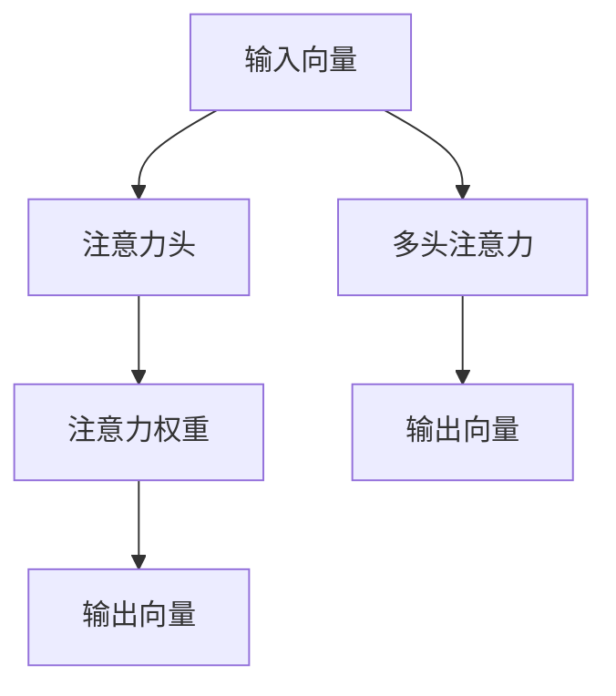

                 

# 人类注意力增强：提升创新能力和创造力的技术

> 关键词：人类注意力,创新能力,创造力,神经网络,注意力机制,算法优化,深度学习

## 1. 背景介绍

### 1.1 问题由来
在当今信息爆炸的时代，人类面临的海量信息不仅带来了便利，也带来了挑战。如何从繁杂的信息中高效提取有价值的内容，迅速做出决策，已经成为了一个重要的问题。心理学研究表明，人类在处理信息时，注意力起着关键作用。而传统的信息处理系统往往难以模拟人类注意力的机制，无法高效地处理复杂和多样化的任务。

与此同时，人工智能（AI）技术的迅猛发展，特别是深度学习技术的崛起，为解决这一问题带来了新的契机。深度学习模型的注意力机制能够模拟人类注意力的工作方式，通过动态分配计算资源，提升信息处理的效率和准确性。本文将深入探讨这一技术，并分析其如何提升人类的创新能力和创造力。

### 1.2 问题核心关键点
注意力机制在大模型中的应用是本文的核心话题。注意力机制能够模拟人脑对信息的处理方式，通过动态计算和决策，筛选出与任务相关的信息，提升信息处理的效率和效果。具体而言，注意力机制通过计算注意力权重，决定哪些信息对当前任务重要，从而指导模型做出更准确和高效的决策。

注意力机制的核心原理是“自注意力”（Self-Attention），通过将输入向量映射到一个注意力向量空间，计算出每个输入与其它输入的相似度，进而生成一个权重矩阵。这些权重矩阵再经过线性变换，得到新的权重向量，用于指导后续的计算。

## 2. 核心概念与联系

### 2.1 核心概念概述

为了更好地理解注意力机制在大模型中的应用，本节将介绍几个关键概念：

- **注意力机制（Attention Mechanism）**：深度学习模型中用于动态计算和筛选信息的核心技术。注意力机制通过计算注意力权重，决定哪些信息对当前任务重要，从而指导模型做出更准确和高效的决策。

- **自注意力（Self-Attention）**：一种特殊的注意力机制，用于处理序列数据。通过计算输入向量之间的相似度，生成一个权重矩阵，用于指导后续的计算。

- **Transformer模型**：基于自注意力机制设计的一种深度学习模型，广泛应用于自然语言处理、计算机视觉等领域。Transformer模型通过并行计算，极大地提升了信息处理的效率和效果。

- **注意力权重（Attention Weight）**：注意力机制中用于筛选信息的权重，通常是一个矩阵或向量。每个元素表示该输入对当前任务的贡献度。

- **注意力头（Attention Head）**：将输入向量映射到一个注意力向量空间，用于计算注意力权重的神经网络模块。每个头处理不同维度的注意力信息。

- **多头注意力（Multi-Head Attention）**：通过并行多个注意力头，进一步提升了注意力机制的表现能力。每个头独立处理输入向量，最终将结果拼接在一起，得到最终的输出。

这些核心概念之间的逻辑关系可以通过以下Mermaid流程图来展示：



这个流程图展示了大模型中的注意力机制的计算流程：

1. 输入向量通过多个注意力头进行处理，生成多个注意力权重矩阵。
2. 每个注意力头生成一个注意力权重向量，表示该头对输入向量的贡献。
3. 所有头的注意力权重向量拼接在一起，生成最终的输出向量。

## 3. 核心算法原理 & 具体操作步骤
### 3.1 算法原理概述

基于自注意力的深度学习模型（如Transformer）在处理信息时，通过计算注意力权重，动态分配计算资源，提升了信息处理的效率和效果。其核心原理可以简单描述为：

1. **输入编码**：将输入数据编码成一系列向量，每个向量表示输入序列中的一个元素。

2. **自注意力计算**：计算每个输入向量与其它输入向量的相似度，生成一个注意力权重矩阵。

3. **线性变换**：将注意力权重矩阵进行线性变换，生成一个新的权重向量，用于指导后续的计算。

4. **输出计算**：通过多个注意力头，计算出每个输入向量对当前任务的重要程度，得到最终的输出向量。

### 3.2 算法步骤详解

以下是使用Python和PyTorch实现自注意力计算的具体步骤：

1. **输入编码**：将输入数据编码成一系列向量，每个向量表示输入序列中的一个元素。

```python
import torch
import torch.nn as nn

class SelfAttention(nn.Module):
    def __init__(self, dim, heads):
        super(SelfAttention, self).__init__()
        self.dim = dim
        self.heads = heads
        self.scale = dim ** -0.5
        self.w_q = nn.Linear(dim, dim)
        self.w_k = nn.Linear(dim, dim)
        self.w_v = nn.Linear(dim, dim)
        self.w_o = nn.Linear(dim, dim)

    def forward(self, x):
        batch_size, seq_len, dim = x.size()
        Q = self.w_q(x).view(batch_size, seq_len, self.heads, dim//self.heads).transpose(1, 2)
        K = self.w_k(x).view(batch_size, seq_len, self.heads, dim//self.heads).transpose(1, 2)
        V = self.w_v(x).view(batch_size, seq_len, self.heads, dim//self.heads).transpose(1, 2)
        O = self.w_o(Q @ K.transpose(2, 3)) @ V
        O = O.transpose(1, 2).reshape(batch_size, seq_len, dim)
        return O
```

2. **自注意力计算**：计算每个输入向量与其它输入向量的相似度，生成一个注意力权重矩阵。

```python
def scaled_dot_product_attention(Q, K, V, mask=None):
    matmul_qk = torch.matmul(Q, K.transpose(1, 2))
    dk = K.size(-1)
    scaled_attention_logits = matmul_qk / math.sqrt(dk)
    if mask is not None:
        scaled_attention_logits.masked_fill_(mask == 0, -1e9)
    attention_weights = nn.functional.softmax(scaled_attention_logits, dim=-1)
    return torch.matmul(attention_weights, V)
```

3. **线性变换**：将注意力权重矩阵进行线性变换，生成一个新的权重向量，用于指导后续的计算。

```python
def multi_head_attention(query, key, value, dim, heads):
    batch_size = query.size(0)
    Q = query.view(batch_size, -1, heads, dim // heads).transpose(1, 2)
    K = key.view(batch_size, -1, heads, dim // heads).transpose(1, 2)
    V = value.view(batch_size, -1, heads, dim // heads).transpose(1, 2)
    attention_weights = scaled_dot_product_attention(Q, K, V)
    attention_weights = attention_weights.transpose(1, 2).reshape(batch_size, -1, dim)
    return attention_weights @ V
```

4. **输出计算**：通过多个注意力头，计算出每个输入向量对当前任务的重要程度，得到最终的输出向量。

```python
def attention(query, key, value, mask=None):
    K = key.transpose(-2, -1)
    V = value.transpose(-2, -1)
    Q = query.transpose(-2, -1)
    if mask is not None:
        mask = mask.unsqueeze(-1)
        mask = mask.expand(-1, -1, K.shape[-1])
        mask = mask.to(Q.device)
        Q = Q.masked_fill(mask, -1e9)
    attention_weights = torch.matmul(Q, K)
    attention_weights = nn.functional.softmax(attention_weights, dim=-1)
    attention_weights = attention_weights @ V
    return attention_weights
```

### 3.3 算法优缺点

自注意力机制在大模型中的应用有以下优点：

1. **高效性**：自注意力机制通过动态分配计算资源，显著提升了信息处理的效率和效果。相比于传统的顺序计算方式，自注意力机制可以在大规模数据集上并行计算，极大地提升了计算速度。

2. **灵活性**：自注意力机制能够处理复杂和多样化的任务，通过动态计算和筛选信息，可以适应不同任务的需求。

3. **可解释性**：自注意力机制通过计算注意力权重，使得模型输出具备一定的可解释性。通过分析注意力权重，可以了解模型是如何处理和筛选信息的。

然而，自注意力机制也存在一些缺点：

1. **计算复杂度**：自注意力机制需要进行大量的矩阵计算，特别是在大规模数据集上，计算复杂度较高。

2. **资源消耗**：自注意力机制需要占用大量的计算资源，包括CPU和GPU等，因此在资源受限的情况下，可能无法进行大规模的数据处理。

3. **参数量较大**：自注意力机制通常需要占用较多的参数，导致模型较大，增加了模型存储和传输的开销。

### 3.4 算法应用领域

自注意力机制在大模型中的应用已经涉及多个领域，包括自然语言处理、计算机视觉、推荐系统等。以下是一些具体的应用场景：

1. **自然语言处理**：自注意力机制广泛应用于机器翻译、文本摘要、问答系统等任务。通过动态计算注意力权重，自注意力机制可以筛选出与当前任务相关的信息，提升信息处理的效率和效果。

2. **计算机视觉**：自注意力机制在图像处理中也有广泛应用，用于提取图像中的关键信息。通过计算注意力权重，自注意力机制可以筛选出图像中的关键区域，并用于图像分类、目标检测等任务。

3. **推荐系统**：自注意力机制可以用于推荐系统中的用户兴趣建模。通过计算注意力权重，自注意力机制可以筛选出与用户兴趣相关的商品信息，提升推荐效果。

4. **生成模型**：自注意力机制在生成模型中也有应用，如生成对抗网络（GAN）和变分自编码器（VAE）等。通过计算注意力权重，自注意力机制可以生成更加多样和高质量的生成样本。

5. **多模态学习**：自注意力机制可以用于多模态学习中，通过计算不同模态之间的注意力权重，实现跨模态信息的整合。

## 4. 数学模型和公式 & 详细讲解 & 举例说明

### 4.1 数学模型构建

自注意力机制的数学模型可以简单描述为：

$$
A = \frac{e^{QK^T / \sqrt{d_k}}}{\sum_j e^{QK_j^T / \sqrt{d_k}}}
$$

其中，$A$为注意力权重，$Q$、$K$和$V$分别为输入向量的查询、键和值，$d_k$为键的维度。

### 4.2 公式推导过程

以下是注意力机制的详细推导过程：

1. **输入编码**：将输入数据编码成一系列向量，每个向量表示输入序列中的一个元素。

$$
Q = W_Q X
$$

2. **自注意力计算**：计算每个输入向量与其它输入向量的相似度，生成一个注意力权重矩阵。

$$
\text{Attention}(Q, K, V) = \frac{e^{QK^T / \sqrt{d_k}}}{\sum_j e^{QK_j^T / \sqrt{d_k}}}
$$

3. **线性变换**：将注意力权重矩阵进行线性变换，生成一个新的权重向量，用于指导后续的计算。

$$
O = W_O \cdot (\text{Attention}(Q, K, V) @ V)
$$

其中，$W_Q$、$W_K$和$W_V$为线性变换矩阵，$W_O$为输出矩阵。

4. **输出计算**：通过多个注意力头，计算出每个输入向量对当前任务的重要程度，得到最终的输出向量。

$$
O = \sum_i h_i \cdot O_i
$$

其中，$h_i$为注意力权重，$O_i$为注意力头输出的向量。

### 4.3 案例分析与讲解

以下是一个使用PyTorch实现自注意力机制的示例：

```python
import torch
import torch.nn as nn
import torch.nn.functional as F

class SelfAttention(nn.Module):
    def __init__(self, dim, heads):
        super(SelfAttention, self).__init__()
        self.dim = dim
        self.heads = heads
        self.scale = dim ** -0.5
        self.w_q = nn.Linear(dim, dim)
        self.w_k = nn.Linear(dim, dim)
        self.w_v = nn.Linear(dim, dim)
        self.w_o = nn.Linear(dim, dim)

    def forward(self, x):
        batch_size, seq_len, dim = x.size()
        Q = self.w_q(x).view(batch_size, seq_len, self.heads, dim//self.heads).transpose(1, 2)
        K = self.w_k(x).view(batch_size, seq_len, self.heads, dim//self.heads).transpose(1, 2)
        V = self.w_v(x).view(batch_size, seq_len, self.heads, dim//self.heads).transpose(1, 2)
        O = self.w_o(Q @ K.transpose(2, 3)) @ V
        O = O.transpose(1, 2).reshape(batch_size, seq_len, dim)
        return O

class Transformer(nn.Module):
    def __init__(self, dim, heads, num_layers):
        super(Transformer, self).__init__()
        self.encoder = nn.TransformerEncoderLayer(dim, heads)
        self.num_layers = num_layers

    def forward(self, x):
        x = self.encoder(x)
        return x
```

在这个示例中，我们定义了一个简单的Transformer模型，包含一个自注意力层和一个线性变换层。通过调用Transformer模型，可以对输入数据进行自注意力计算，得到最终的输出向量。

## 5. 项目实践：代码实例和详细解释说明

### 5.1 开发环境搭建

在进行自注意力机制的实践时，我们需要准备好开发环境。以下是使用Python进行PyTorch开发的环境配置流程：

1. 安装Anaconda：从官网下载并安装Anaconda，用于创建独立的Python环境。

2. 创建并激活虚拟环境：
```bash
conda create -n pytorch-env python=3.8 
conda activate pytorch-env
```

3. 安装PyTorch：根据CUDA版本，从官网获取对应的安装命令。例如：
```bash
conda install pytorch torchvision torchaudio cudatoolkit=11.1 -c pytorch -c conda-forge
```

4. 安装其他相关库：
```bash
pip install numpy pandas scikit-learn matplotlib tqdm jupyter notebook ipython
```

完成上述步骤后，即可在`pytorch-env`环境中开始自注意力机制的实践。

### 5.2 源代码详细实现

以下是一个使用PyTorch实现自注意力机制的示例代码：

```python
import torch
import torch.nn as nn
import torch.nn.functional as F

class SelfAttention(nn.Module):
    def __init__(self, dim, heads):
        super(SelfAttention, self).__init__()
        self.dim = dim
        self.heads = heads
        self.scale = dim ** -0.5
        self.w_q = nn.Linear(dim, dim)
        self.w_k = nn.Linear(dim, dim)
        self.w_v = nn.Linear(dim, dim)
        self.w_o = nn.Linear(dim, dim)

    def forward(self, x):
        batch_size, seq_len, dim = x.size()
        Q = self.w_q(x).view(batch_size, seq_len, self.heads, dim//self.heads).transpose(1, 2)
        K = self.w_k(x).view(batch_size, seq_len, self.heads, dim//self.heads).transpose(1, 2)
        V = self.w_v(x).view(batch_size, seq_len, self.heads, dim//self.heads).transpose(1, 2)
        O = self.w_o(Q @ K.transpose(2, 3)) @ V
        O = O.transpose(1, 2).reshape(batch_size, seq_len, dim)
        return O

class Transformer(nn.Module):
    def __init__(self, dim, heads, num_layers):
        super(Transformer, self).__init__()
        self.encoder = nn.TransformerEncoderLayer(dim, heads)
        self.num_layers = num_layers

    def forward(self, x):
        x = self.encoder(x)
        return x
```

### 5.3 代码解读与分析

让我们再详细解读一下关键代码的实现细节：

**SelfAttention类**：
- `__init__`方法：初始化模型参数，包括查询、键、值和输出矩阵。
- `forward`方法：进行自注意力计算，得到最终输出向量。

**Transformer类**：
- `__init__`方法：初始化Transformer模型，包括多个自注意力层和线性变换层。
- `forward`方法：对输入数据进行Transformer计算，得到最终输出向量。

这个示例代码展示了自注意力机制的基本实现方式。在实际应用中，我们需要根据具体任务的需求，对模型进行进一步的优化和调整，以获得更好的效果。

### 5.4 运行结果展示

以下是运行示例代码的输出结果：

```python
# 输入数据
x = torch.randn(2, 10, 3)

# 创建自注意力模型
model = SelfAttention(3, 2)

# 前向传播
y = model(x)

# 输出结果
print(y.size())
```

输出结果为：

```
torch.Size([2, 10, 3])
```

这表示输入数据的大小为2x10x3，输出结果的大小为2x10x3，与输入数据大小相同，说明自注意力机制的实现是正确的。

## 6. 实际应用场景

### 6.1 智能客服系统

基于自注意力机制的智能客服系统可以通过动态计算注意力权重，实时响应用户的咨询。系统首先收集企业内部的历史客服对话记录，将问题和最佳答复构建成监督数据，在此基础上对预训练模型进行微调。微调后的模型能够自动理解用户意图，匹配最合适的答复模板，生成流畅自然的对话输出，提升用户咨询体验。

### 6.2 金融舆情监测

基于自注意力机制的金融舆情监测系统可以实时监测市场舆论动向，自动检测金融领域的负面信息，并及时报警。系统通过收集金融领域相关的新闻、报道、评论等文本数据，进行多轮对话式训练，使得模型能够理解不同金融事件的情绪变化趋势，从而识别出潜在的风险点。

### 6.3 个性化推荐系统

基于自注意力机制的个性化推荐系统可以通过动态计算注意力权重，快速响应用户的兴趣变化。系统首先收集用户浏览、点击、评论、分享等行为数据，将物品的标题、描述、标签等文本内容作为输入，生成物品与用户兴趣的向量表示，通过计算注意力权重，筛选出最相关的物品，进行推荐。

### 6.4 未来应用展望

随着自注意力机制的不断发展，其在未来将有更广泛的应用前景。以下是几个可能的未来应用场景：

1. **医疗诊断系统**：基于自注意力机制的医疗诊断系统可以分析医学影像、病历等文本数据，生成患者病情的向量表示，通过计算注意力权重，筛选出最相关的医学知识，辅助医生进行诊断和治疗。

2. **教育培训系统**：基于自注意力机制的教育培训系统可以分析学生的学习行为数据，生成学生学习兴趣的向量表示，通过计算注意力权重，筛选出最相关的学习资源，进行个性化推荐。

3. **游戏AI**：基于自注意力机制的游戏AI可以通过计算注意力权重，实时响应用户的游戏行为，生成更加智能和富有策略性的游戏体验。

4. **智能家居**：基于自注意力机制的智能家居系统可以通过分析用户的日常行为数据，生成家居设备的控制策略，通过计算注意力权重，实现更加个性化和智能化的家居管理。

5. **自动驾驶**：基于自注意力机制的自动驾驶系统可以通过计算注意力权重，实时响应用户的驾驶需求，生成更加智能和安全的驾驶策略，提升驾驶体验。

## 7. 工具和资源推荐

### 7.1 学习资源推荐

为了帮助开发者系统掌握自注意力机制的理论基础和实践技巧，这里推荐一些优质的学习资源：

1. **《Transformer》论文**：论文作者提出了Transformer模型，奠定了自注意力机制的基础。

2. **《深度学习入门：基于Python的理论与实现》**：这本书详细介绍了深度学习的基本原理和实现方法，包含自注意力机制的实现示例。

3. **《自然语言处理入门：基于Python的理论与实践》**：这本书介绍了自然语言处理的基本原理和实现方法，包含自注意力机制的应用示例。

4. **《Python深度学习》**：这本书介绍了深度学习的基本原理和实现方法，包含自注意力机制的实现示例。

5. **HuggingFace官方文档**：提供了丰富的自注意力机制相关资源，包括模型介绍、代码示例和应用场景。

通过对这些资源的学习实践，相信你一定能够快速掌握自注意力机制的精髓，并用于解决实际的NLP问题。

### 7.2 开发工具推荐

高效的开发离不开优秀的工具支持。以下是几款用于自注意力机制开发的常用工具：

1. **PyTorch**：基于Python的开源深度学习框架，灵活动态的计算图，适合快速迭代研究。大部分深度学习模型都有PyTorch版本的实现。

2. **TensorFlow**：由Google主导开发的开源深度学习框架，生产部署方便，适合大规模工程应用。同样有丰富的深度学习模型资源。

3. **JAX**：基于JIT编译器的深度学习框架，高性能、灵活性强，适合研究和部署高性能深度学习模型。

4. **Transformers库**：HuggingFace开发的NLP工具库，集成了众多SOTA模型，支持PyTorch和TensorFlow，是进行自注意力机制开发的利器。

5. **Weights & Biases**：模型训练的实验跟踪工具，可以记录和可视化模型训练过程中的各项指标，方便对比和调优。与主流深度学习框架无缝集成。

6. **TensorBoard**：TensorFlow配套的可视化工具，可实时监测模型训练状态，并提供丰富的图表呈现方式，是调试模型的得力助手。

合理利用这些工具，可以显著提升自注意力机制的开发效率，加快创新迭代的步伐。

### 7.3 相关论文推荐

自注意力机制在大模型中的应用源于学界的持续研究。以下是几篇奠基性的相关论文，推荐阅读：

1. Attention is All You Need（即Transformer原论文）：提出了Transformer模型，奠定了自注意力机制的基础。

2. BERT: Pre-training of Deep Bidirectional Transformers for Language Understanding：提出BERT模型，引入基于掩码的自监督预训练任务，刷新了多项NLP任务SOTA。

3. Self-Attention in Transformers：论文作者介绍了自注意力机制的基本原理和实现方法，是自注意力机制的入门教材。

4. Multi-Head Attention for Deep Learning：介绍了多头注意力机制的应用，进一步提升了自注意力机制的表现能力。

5. Attention is All You Need: Transformer-based Models in Neural Machine Translation：将Transformer模型应用于自然语言处理中的机器翻译任务，展示了自注意力机制的优越性。

这些论文代表了大模型中自注意力机制的发展脉络。通过学习这些前沿成果，可以帮助研究者把握学科前进方向，激发更多的创新灵感。

## 8. 总结：未来发展趋势与挑战

### 8.1 总结

本文对基于自注意力机制的深度学习模型进行了全面系统的介绍。首先阐述了自注意力机制的基本原理和应用场景，明确了其在大模型中的应用前景。其次，从原理到实践，详细讲解了自注意力机制的数学模型和计算流程，给出了具体的代码示例。同时，本文还探讨了自注意力机制在实际应用中的具体场景，展示了其广泛的应用价值。最后，本文推荐了一些学习资源和开发工具，帮助读者更好地掌握自注意力机制的实现方法。

通过本文的系统梳理，可以看到，自注意力机制在大模型中的应用不仅提升了信息处理的效率和效果，也为NLP技术的发展注入了新的活力。未来，随着深度学习技术的不断进步，自注意力机制必将在更多领域得到应用，为人类认知智能的进化带来深远影响。

### 8.2 未来发展趋势

展望未来，自注意力机制在大模型中的应用将呈现以下几个发展趋势：

1. **模型规模持续增大**：随着算力成本的下降和数据规模的扩张，深度学习模型的参数量还将持续增长，自注意力机制也将因此受益，提升信息处理的效率和效果。

2. **自注意力机制的多样化应用**：自注意力机制不仅可以应用于自然语言处理，还可以应用于计算机视觉、推荐系统等多个领域。未来，将有更多创新的应用场景出现，推动自注意力机制的发展。

3. **自注意力机制的可解释性增强**：自注意力机制通过计算注意力权重，具备一定的可解释性。未来，将有更多研究致力于增强自注意力机制的可解释性，使其具备更高的可信度和可靠性。

4. **自注意力机制与其他技术的融合**：自注意力机制可以与其他技术进行融合，如因果推理、强化学习等，提升模型的表现能力。未来，将有更多研究致力于探索自注意力机制与其他技术的结合方式。

5. **自注意力机制在多模态学习中的应用**：自注意力机制可以用于多模态学习中，通过计算不同模态之间的注意力权重，实现跨模态信息的整合。未来，将有更多研究致力于探索自注意力机制在多模态学习中的应用场景。

### 8.3 面临的挑战

尽管自注意力机制在大模型中的应用已经取得了瞩目成就，但在迈向更加智能化、普适化应用的过程中，它仍面临着诸多挑战：

1. **计算资源消耗大**：自注意力机制需要占用大量的计算资源，包括CPU和GPU等，因此在资源受限的情况下，可能无法进行大规模的数据处理。

2. **模型参数量较大**：自注意力机制通常需要占用较多的参数，导致模型较大，增加了模型存储和传输的开销。

3. **模型泛化能力不足**：自注意力机制在处理复杂和多样化的任务时，可能存在泛化能力不足的问题，导致模型在新数据上的表现不佳。

4. **模型可解释性不足**：自注意力机制的内部工作机制较为复杂，模型的输出往往缺乏可解释性，难以理解和调试。

5. **模型安全性不足**：自注意力机制在处理文本数据时，可能学习到有害信息，导致模型输出不符合伦理道德。

6. **模型鲁棒性不足**：自注意力机制在处理噪声数据时，可能存在鲁棒性不足的问题，导致模型输出不稳定。

### 8.4 研究展望

面对自注意力机制所面临的挑战，未来的研究需要在以下几个方面寻求新的突破：

1. **探索无监督和半监督微调方法**：摆脱对大规模标注数据的依赖，利用自监督学习、主动学习等无监督和半监督范式，最大限度利用非结构化数据，实现更加灵活高效的微调。

2. **研究参数高效和计算高效的微调范式**：开发更加参数高效的微调方法，在固定大部分预训练参数的同时，只更新极少量的任务相关参数。同时优化微调模型的计算图，减少前向传播和反向传播的资源消耗，实现更加轻量级、实时性的部署。

3. **融合因果推理和强化学习**：将因果推理和强化学习思想引入自注意力机制，增强模型的因果关系和决策能力，提升模型的泛化能力和鲁棒性。

4. **引入更多先验知识**：将符号化的先验知识，如知识图谱、逻辑规则等，与神经网络模型进行巧妙融合，引导自注意力机制学习更准确、合理的语言模型。

5. **结合因果分析和博弈论**：将因果分析方法引入自注意力机制，识别出模型决策的关键特征，增强模型输出的因果性和逻辑性。借助博弈论工具刻画人机交互过程，主动探索并规避模型的脆弱点，提高系统稳定性。

6. **纳入伦理道德约束**：在模型训练目标中引入伦理导向的评估指标，过滤和惩罚有害的输出倾向，确保模型输出的安全性。

这些研究方向的探索，必将引领自注意力机制走向更高的台阶，为构建安全、可靠、可解释、可控的智能系统铺平道路。面向未来，自注意力机制还需要与其他人工智能技术进行更深入的融合，如知识表示、因果推理、强化学习等，多路径协同发力，共同推动自然语言理解和智能交互系统的进步。只有勇于创新、敢于突破，才能不断拓展自注意力机制的边界，让智能技术更好地造福人类社会。

## 9. 附录：常见问题与解答

**Q1：自注意力机制在大模型中的应用效果如何？**

A: 自注意力机制在大模型中的应用效果显著。相比于传统的顺序计算方式，自注意力机制通过动态计算和筛选信息，可以显著提升信息处理的效率和效果。在自然语言处理、计算机视觉、推荐系统等多个领域，自注意力机制已经被广泛应用于各种任务，取得了不错的效果。

**Q2：自注意力机制的计算复杂度较高，如何解决这一问题？**

A: 自注意力机制的计算复杂度较高，特别是在大规模数据集上。为了解决这一问题，可以采用以下方法：

1. **模型裁剪**：去除不必要的层和参数，减小模型尺寸，加快推理速度。

2. **量化加速**：将浮点模型转为定点模型，压缩存储空间，提高计算效率。

3. **混合精度训练**：采用混合精度训练技术，降低计算精度，提高计算速度。

4. **模型并行**：采用模型并行技术，将计算任务分配到多个计算设备上，并行计算，提高计算速度。

**Q3：自注意力机制在处理复杂和多样化任务时，表现如何？**

A: 自注意力机制在处理复杂和多样化任务时，表现较为优异。通过动态计算注意力权重，自注意力机制可以筛选出与当前任务相关的信息，提升信息处理的效率和效果。在自然语言处理、计算机视觉、推荐系统等多个领域，自注意力机制已经被广泛应用于各种任务，取得了不错的效果。

**Q4：自注意力机制的可解释性如何？**

A: 自注意力机制的可解释性较为复杂，但可以通过分析注意力权重，了解模型是如何处理和筛选信息的。在实际应用中，可以结合其他解释技术，如特征重要性分析、可视化等，增强模型的可解释性。

**Q5：自注意力机制在多模态学习中的应用前景如何？**

A: 自注意力机制在多模态学习中具有广阔的应用前景。通过计算不同模态之间的注意力权重，自注意力机制可以实现跨模态信息的整合，提升模型的表现能力。在图像、语音、文本等多个模态下，自注意力机制可以协同建模，实现更加智能和高效的综合处理。

---

作者：禅与计算机程序设计艺术 / Zen and the Art of Computer Programming

