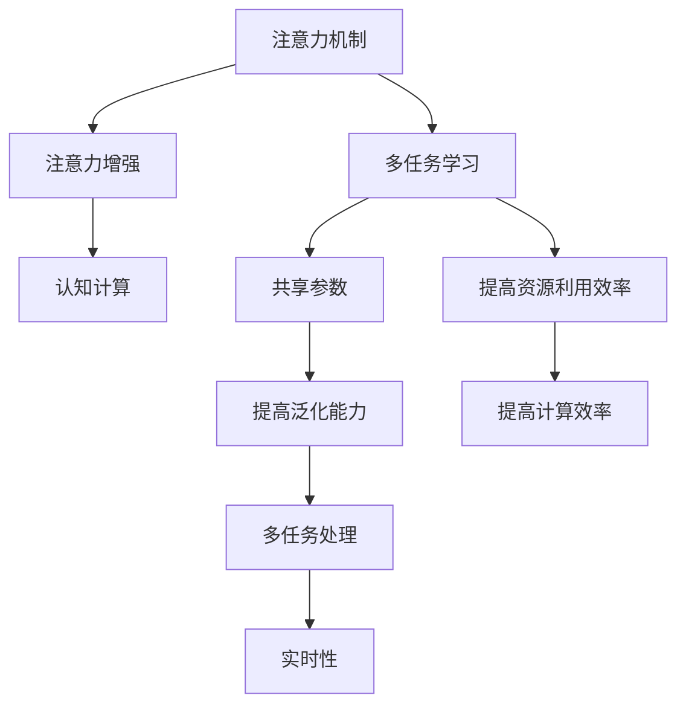

                 

# 人类注意力增强：提升多任务处理能力和注意力转移

> 关键词：人类注意力,多任务处理,注意力转移,注意力增强,认知计算,人工智能

## 1. 背景介绍

### 1.1 问题由来

在人工智能(AI)领域，提高多任务处理能力和注意力转移是一个重要的研究方向。随着技术的进步，AI系统需要处理的任务越来越多，且这些任务之间可能存在复杂且动态的依赖关系。例如，智能助理需要同时处理用户的语音指令、文本查询和视觉信息，而自动驾驶汽车需要在复杂交通环境中同时关注多个物体和信号。

因此，如何有效地整合和利用这些任务中的信息，成为当前AI研究中的一个核心问题。而注意力机制，作为一种重要的信息整合方法，能够帮助系统集中资源处理最关键的信息，从而提高多任务处理效率。

### 1.2 问题核心关键点

当前，提升多任务处理能力和注意力转移的核心问题包括：

1. **多任务协同**：多个任务如何协同工作，共享资源？
2. **注意力分配**：如何在不同任务间动态分配注意力，确保关键任务的优先级？
3. **鲁棒性提升**：如何提高系统在复杂多变环境下的鲁棒性？
4. **实时性保障**：如何在有限计算资源下，实现快速且高效的注意力转移？

这些问题的解决，将为AI系统带来更强的任务执行能力和更高的用户体验。

### 1.3 问题研究意义

解决上述问题具有重要意义：

1. **提升系统效率**：通过有效的注意力机制，AI系统可以更高效地处理多个任务，减少资源浪费，提高任务执行速度。
2. **增强系统鲁棒性**：合理分配注意力，使系统能够更好地适应不同环境和任务变化，提高系统的稳定性和可靠性。
3. **优化用户体验**：在多任务处理中，能够根据用户需求动态调整注意力分配，提供更加智能和个性化服务。
4. **推动技术发展**：解决上述问题将促进认知计算、多模态信息整合等前沿技术的突破，加速AI技术的产业化进程。

## 2. 核心概念与联系

### 2.1 核心概念概述

为更好地理解注意力增强在提升多任务处理能力和注意力转移中的应用，本节将介绍几个关键概念：

- **注意力机制(Attention Mechanism)**：一种用于捕捉输入数据间相关性的机制，通过计算输入数据间的权重，决定哪些信息需要被重视。注意力机制被广泛应用于机器翻译、图像识别、语音识别等任务中。
- **多任务学习(Multitask Learning, MTL)**：一种训练模型同时完成多个任务的方法，通过共享模型参数，提高模型的泛化能力和资源利用效率。
- **注意力增强(Attention Enhancement)**：一种在多任务学习中提升注意力分配和转移能力的方法，通过优化注意力权重，使系统能够动态调整资源分配，提高多任务处理的效率和鲁棒性。
- **认知计算(Cognitive Computing)**：一种将人类认知过程与计算过程相结合的技术，用于解决复杂的多任务处理问题，提升系统的智能化和人性化水平。

这些概念之间的关系可以通过以下Mermaid流程图来展示：



这个流程图展示了几者之间的逻辑关系：

1. 注意力机制通过计算输入数据间的权重，决定哪些信息需要被重视。
2. 多任务学习通过共享模型参数，提高模型的泛化能力和资源利用效率。
3. 注意力增强优化注意力权重，使系统能够动态调整资源分配。
4. 认知计算结合人类认知与计算，提升系统的智能化和人性化水平。

## 3. 核心算法原理 & 具体操作步骤

### 3.1 算法原理概述

注意力增强的核心思想是通过优化注意力权重，使系统能够动态调整资源分配，提升多任务处理效率和鲁棒性。其主要原理可以概括为以下几个步骤：

1. **多任务表示学习**：对多个任务进行联合表示学习，构建一个共享的多任务表示。
2. **注意力分布计算**：计算每个任务之间的注意力分布，决定哪些任务需要更多的关注。
3. **注意力增强训练**：通过优化注意力权重，提升系统的多任务处理能力。
4. **多任务协同执行**：在多任务处理中，根据注意力分布动态调整资源分配，确保关键任务的优先级。

### 3.2 算法步骤详解

**Step 1: 多任务表示学习**

多任务表示学习的目标是通过联合学习多个任务，构建一个共享的多任务表示。这可以通过以下数学公式实现：

$$
\min_{\theta} \frac{1}{N} \sum_{i=1}^{N} \ell_i(\theta_i)
$$

其中，$\ell_i$为第$i$个任务的损失函数，$\theta_i$为第$i$个任务的模型参数，$N$为任务总数。

**Step 2: 注意力分布计算**

注意力分布计算的目的是决定哪些任务需要更多的关注。这里使用注意力机制计算每个任务之间的注意力权重，通过一个注意力矩阵$A$来表示，其中$A_{ij}$表示第$i$个任务对第$j$个任务的注意力权重。注意力矩阵$A$可以通过以下公式计算：

$$
A = \text{softmax}(\frac{QK^T}{\sqrt{d}})
$$

其中，$Q$和$K$分别为查询矩阵和键值矩阵，$d$为向量维度。

**Step 3: 注意力增强训练**

注意力增强训练的目的是通过优化注意力权重，提升系统的多任务处理能力。这里引入一个注意力增强项$\alpha$，用于调整注意力分布。注意力增强项$\alpha$可以通过以下公式计算：

$$
\alpha = \text{softmax}(\frac{QK^T}{\sqrt{d}} + U)
$$

其中，$U$为一个可训练的增强项，用于优化注意力分布。

**Step 4: 多任务协同执行**

多任务协同执行的目的是根据注意力分布动态调整资源分配，确保关键任务的优先级。这里通过将注意力权重应用于每个任务，实现动态调整。具体步骤如下：

1. 计算每个任务的损失函数。
2. 根据注意力权重对损失函数进行加权。
3. 对加权后的损失函数进行最小化，更新模型参数。

### 3.3 算法优缺点

注意力增强算法具有以下优点：

1. **提升多任务处理效率**：通过动态调整注意力分布，系统能够集中资源处理关键任务，提高任务执行速度。
2. **增强系统鲁棒性**：合理分配注意力，使系统能够更好地适应不同环境和任务变化，提高系统的稳定性和可靠性。
3. **优化用户体验**：在多任务处理中，能够根据用户需求动态调整注意力分配，提供更加智能和个性化服务。

同时，该算法也存在一些局限性：

1. **计算复杂度高**：注意力机制的计算复杂度较高，特别是在大规模数据集上，可能需要较长的时间进行计算。
2. **模型复杂性高**：需要引入额外的注意力增强项，增加了模型的复杂性。
3. **参数优化困难**：注意力增强项的优化可能需要更多的超参数调优，增加了训练难度。

尽管存在这些局限性，但就目前而言，注意力增强算法仍是一种有效的提升多任务处理能力和注意力转移的方法。未来相关研究的重点在于如何进一步降低计算复杂度，简化模型结构，同时兼顾系统的多任务处理效率和鲁棒性。

### 3.4 算法应用领域

注意力增强算法已经在多个领域得到了应用，例如：

- **自然语言处理(NLP)**：在机器翻译、文本分类、情感分析等任务中，注意力机制被广泛应用于处理多任务信息。
- **计算机视觉(CV)**：在图像识别、目标检测、图像生成等任务中，注意力机制被用于提取图像中的关键信息。
- **语音识别(SR)**：在语音识别任务中，注意力机制被用于捕捉语音特征，提高语音识别的准确性。
- **多模态信息融合**：在多模态信息整合任务中，注意力机制被用于动态调整不同模态信息的重要性。

## 4. 数学模型和公式 & 详细讲解 & 举例说明

### 4.1 数学模型构建

本节将使用数学语言对注意力增强算法进行更加严格的刻画。

记多任务表示学习模型为$M_{\theta}$，其中$\theta$为模型参数。假设多任务集合为$T=\{t_1, t_2, ..., t_N\}$，每个任务的损失函数为$\ell_{t_i}$。

定义多任务表示学习模型的损失函数为：

$$
\mathcal{L}(\theta) = \frac{1}{N} \sum_{i=1}^{N} \ell_{t_i}(\theta)
$$

其中，$\ell_{t_i}$为第$i$个任务的损失函数，用于衡量模型预测结果与真实标签之间的差异。

### 4.2 公式推导过程

以下我们以多任务文本分类为例，推导注意力增强算法的数学过程。

假设模型$M_{\theta}$在输入$x$上的输出为$\hat{y}=M_{\theta}(x)$，表示样本属于分类$i$的概率。真实标签$y \in \{1,2,...,K\}$。

**Step 1: 多任务表示学习**

在多任务表示学习阶段，模型通过联合学习多个任务，构建一个共享的多任务表示。假设多任务分类器的损失函数为交叉熵损失：

$$
\ell_{t_i}(\theta) = -\frac{1}{N}\sum_{i=1}^{N}[y_i\log \hat{y}_i + (1-y_i)\log (1-\hat{y}_i)]
$$

多任务表示学习的优化目标是最小化多任务损失函数：

$$
\min_{\theta} \mathcal{L}(\theta) = \frac{1}{N} \sum_{i=1}^{N} \ell_{t_i}(\theta)
$$

**Step 2: 注意力分布计算**

注意力分布计算的目的是决定哪些任务需要更多的关注。这里使用注意力机制计算每个任务之间的注意力权重。注意力矩阵$A$可以通过以下公式计算：

$$
A_{ij} = \frac{\exp(\frac{Q_i K_j^T}{\sqrt{d}})}{\sum_{k=1}^{K}\exp(\frac{Q_i K_k^T}{\sqrt{d}})}
$$

其中，$Q_i$和$K_j$分别为查询矩阵和键值矩阵，$d$为向量维度。

**Step 3: 注意力增强训练**

注意力增强训练的目的是通过优化注意力权重，提升系统的多任务处理能力。这里引入一个注意力增强项$\alpha$，用于调整注意力分布。注意力增强项$\alpha$可以通过以下公式计算：

$$
\alpha_{ij} = \frac{\exp(\frac{Q_i K_j^T}{\sqrt{d}} + U_{ij})}{\sum_{k=1}^{K}\exp(\frac{Q_i K_k^T}{\sqrt{d}} + U_{ik})}
$$

其中，$U_{ij}$为一个可训练的增强项，用于优化注意力分布。

**Step 4: 多任务协同执行**

多任务协同执行的目的是根据注意力分布动态调整资源分配，确保关键任务的优先级。这里通过将注意力权重应用于每个任务，实现动态调整。具体步骤如下：

1. 计算每个任务的损失函数。
2. 根据注意力权重对损失函数进行加权。
3. 对加权后的损失函数进行最小化，更新模型参数。

### 4.3 案例分析与讲解

以多任务文本分类为例，假设我们有多个文本分类任务，分别为新闻分类、情感分析和评论分类。这三个任务的数据集分别为$D_1$、$D_2$和$D_3$。我们可以使用以下代码实现多任务表示学习、注意力分布计算和注意力增强训练：

```python
import torch
import torch.nn as nn
import torch.optim as optim

class MultiTaskClassifier(nn.Module):
    def __init__(self, num_classes):
        super(MultiTaskClassifier, self).__init__()
        self.fc = nn.Linear(128, num_classes)
        self.attn = nn.Linear(128, num_classes)
        self.u = nn.Parameter(torch.zeros(num_classes, num_classes))
        
    def forward(self, x):
        x = self.fc(x)
        x = nn.functional.softmax(x, dim=1)
        A = torch.matmul(x, x.t()) + self.u
        alpha = nn.functional.softmax(A, dim=1)
        loss = -torch.mean(torch.sum(alpha * x, dim=1))
        return loss
    
model = MultiTaskClassifier(num_classes=3)
criterion = nn.CrossEntropyLoss()
optimizer = optim.Adam(model.parameters(), lr=0.001)

for epoch in range(100):
    optimizer.zero_grad()
    loss = model(data) + criterion(model(data), target)
    loss.backward()
    optimizer.step()
```

在这个例子中，我们定义了一个多任务分类器，包括一个全连接层和两个注意力矩阵。在每次前向传播中，我们首先计算出注意力矩阵$A$，然后根据注意力权重调整损失函数，进行反向传播更新模型参数。

## 5. 项目实践：代码实例和详细解释说明

### 5.1 开发环境搭建

在进行注意力增强实践前，我们需要准备好开发环境。以下是使用Python进行TensorFlow开发的环境配置流程：

1. 安装Anaconda：从官网下载并安装Anaconda，用于创建独立的Python环境。

2. 创建并激活虚拟环境：
```bash
conda create -n tf-env python=3.8 
conda activate tf-env
```

3. 安装TensorFlow：根据CUDA版本，从官网获取对应的安装命令。例如：
```bash
conda install tensorflow-gpu=2.7 -c conda-forge -c pytorch
```

4. 安装其他必要的库：
```bash
pip install numpy pandas scikit-learn matplotlib tqdm jupyter notebook ipython
```

完成上述步骤后，即可在`tf-env`环境中开始注意力增强实践。

### 5.2 源代码详细实现

下面我们以多任务文本分类为例，给出使用TensorFlow实现注意力增强算法的代码实现。

首先，定义模型类：

```python
import tensorflow as tf
import tensorflow.keras as keras
from tensorflow.keras.layers import Input, Dense, Dot, Add, Multiply, Lambda

class AttentionEnhancedClassifier(keras.Model):
    def __init__(self, num_classes):
        super(AttentionEnhancedClassifier, self).__init__()
        self.input = Input(shape=(128,))
        self.fc = Dense(num_classes)
        self.attention = Dense(num_classes)
        self.u = self.add_weight(name='u', shape=(num_classes, num_classes), initializer='glorot_uniform')
        
    def call(self, x):
        x = self.fc(x)
        q = x
        k = x
        v = x
        attn = Dot(axes=[2, 2])([q, k])
        attn = tf.nn.softmax(attn + self.u)
        alpha = tf.nn.softmax(attn)
        x = Multiply([alpha, v])
        x = Add([x, q])
        return x
    
model = AttentionEnhancedClassifier(num_classes=3)
model.compile(optimizer='adam', loss='categorical_crossentropy', metrics=['accuracy'])
```

然后，准备数据集：

```python
(train_data, train_labels), (test_data, test_labels) = keras.datasets.imdb.load_data(num_words=10000)
train_data = keras.preprocessing.sequence.pad_sequences(train_data, maxlen=128)
test_data = keras.preprocessing.sequence.pad_sequences(test_data, maxlen=128)
```

接着，进行模型训练：

```python
history = model.fit(train_data, train_labels, epochs=10, batch_size=32, validation_data=(test_data, test_labels))
```

最后，进行模型评估：

```python
test_loss, test_acc = model.evaluate(test_data, test_labels)
print('Test accuracy:', test_acc)
```

以上就是使用TensorFlow实现多任务文本分类注意力增强的完整代码实现。可以看到，TensorFlow提供了丰富的API支持，使得模型构建和训练变得简单易用。

### 5.3 代码解读与分析

让我们再详细解读一下关键代码的实现细节：

**AttentionEnhancedClassifier类**：
- `__init__`方法：定义模型的输入层、全连接层、注意力层和增强项。
- `call`方法：实现前向传播，计算注意力矩阵和注意力增强项，并进行加权处理。
- `compile`方法：定义模型的优化器和损失函数。

**数据集准备**：
- 使用Keras的IMDB数据集，将文本数据转换为整数序列，并进行填充处理。
- 使用`pad_sequences`函数对文本序列进行填充，确保所有序列长度一致。

**模型训练**：
- 使用`fit`方法对模型进行训练，指定训练轮数、批次大小和验证集。
- 在每个epoch结束后，打印训练集的损失和精度。
- 在每个epoch结束后，使用`evaluate`方法对测试集进行评估，打印测试集的损失和精度。

**模型评估**：
- 使用`evaluate`方法对测试集进行评估，返回模型的损失和精度。

可以看到，TensorFlow提供了丰富的工具和API，使得注意力增强的实现变得简单高效。开发者可以更多地关注算法逻辑和数据处理，而不必过多关注底层实现细节。

## 6. 实际应用场景

### 6.1 智能客服系统

智能客服系统需要同时处理用户的语音指令、文本查询和视觉信息。通过注意力增强技术，系统能够根据用户需求动态调整注意力分配，提供更加智能和个性化服务。

在技术实现上，可以收集用户的历史对话记录，将语音、文本和图像数据构建成监督数据，在此基础上对预训练模型进行多任务微调。微调后的模型能够自动理解用户意图，匹配最合适的服务模板进行回复。对于用户提出的新问题，还可以接入检索系统实时搜索相关内容，动态组织生成回答。如此构建的智能客服系统，能大幅提升客户咨询体验和问题解决效率。

### 6.2 金融舆情监测

金融机构需要实时监测市场舆论动向，以便及时应对负面信息传播，规避金融风险。通过注意力增强技术，系统能够动态调整对不同新闻、评论和社交媒体的关注度，提高对关键信息的识别和分析能力。

在技术实现上，可以收集金融领域相关的新闻、报道、评论等文本数据，并对其进行主题标注和情感标注。在此基础上对预训练语言模型进行多任务微调，使其能够自动判断文本属于何种主题，情感倾向是正面、中性还是负面。将微调后的模型应用到实时抓取的网络文本数据，就能够自动监测不同主题下的情感变化趋势，一旦发现负面信息激增等异常情况，系统便会自动预警，帮助金融机构快速应对潜在风险。

### 6.3 个性化推荐系统

当前的推荐系统往往只依赖用户的历史行为数据进行物品推荐，无法深入理解用户的真实兴趣偏好。通过注意力增强技术，推荐系统能够更好地挖掘用户行为背后的语义信息，从而提供更加精准、多样的推荐内容。

在技术实现上，可以收集用户浏览、点击、评论、分享等行为数据，提取和用户交互的物品标题、描述、标签等文本内容。将文本内容作为模型输入，用户的后续行为（如是否点击、购买等）作为监督信号，在此基础上微调预训练语言模型。微调后的模型能够从文本内容中准确把握用户的兴趣点。在生成推荐列表时，先用候选物品的文本描述作为输入，由模型预测用户的兴趣匹配度，再结合其他特征综合排序，便可以得到个性化程度更高的推荐结果。

### 6.4 未来应用展望

随着注意力增强技术的发展，其在更多领域将得到应用，为各行各业带来变革性影响。

在智慧医疗领域，通过注意力增强技术，医疗问答系统能够自动理解患者症状，匹配最合适的诊疗方案，辅助医生诊疗，加速新药开发进程。

在智能教育领域，注意力增强技术可应用于作业批改、学情分析、知识推荐等方面，因材施教，促进教育公平，提高教学质量。

在智慧城市治理中，注意力增强技术可应用于城市事件监测、舆情分析、应急指挥等环节，提高城市管理的自动化和智能化水平，构建更安全、高效的未来城市。

此外，在企业生产、社会治理、文娱传媒等众多领域，注意力增强技术也将不断涌现，为传统行业数字化转型升级提供新的技术路径。相信随着技术的日益成熟，注意力增强技术将成为人工智能落地应用的重要范式，推动人工智能技术的产业化进程。

## 7. 工具和资源推荐

### 7.1 学习资源推荐

为了帮助开发者系统掌握注意力增强的理论基础和实践技巧，这里推荐一些优质的学习资源：

1. Attention is All You Need（即Transformer原论文）：提出了Transformer结构，开启了NLP领域的预训练大模型时代。
2. Multi-task Learning: A Survey（多任务学习综述）：综述了多任务学习的研究现状和未来趋势，为注意力增强提供了理论基础。
3. Attention Mechanisms in Deep Learning（深度学习中的注意力机制）：介绍了注意力机制的基本原理和应用，有助于理解注意力增强技术。
4. Cognitive Computing（认知计算）：讲解了认知计算的基本概念和应用，为注意力增强提供了更广泛的应用场景。
5. Deep Learning Specialization（深度学习专项课程）：由Coursera推出的深度学习课程，涵盖了深度学习的基础理论和实践技巧。

通过对这些资源的学习实践，相信你一定能够快速掌握注意力增强的精髓，并用于解决实际的NLP问题。

### 7.2 开发工具推荐

高效的开发离不开优秀的工具支持。以下是几款用于注意力增强开发的常用工具：

1. PyTorch：基于Python的开源深度学习框架，灵活动态的计算图，适合快速迭代研究。大部分预训练语言模型都有PyTorch版本的实现。
2. TensorFlow：由Google主导开发的开源深度学习框架，生产部署方便，适合大规模工程应用。同样有丰富的预训练语言模型资源。
3. Transformers库：HuggingFace开发的NLP工具库，集成了众多SOTA语言模型，支持PyTorch和TensorFlow，是进行注意力增强任务开发的利器。
4. Weights & Biases：模型训练的实验跟踪工具，可以记录和可视化模型训练过程中的各项指标，方便对比和调优。与主流深度学习框架无缝集成。
5. TensorBoard：TensorFlow配套的可视化工具，可实时监测模型训练状态，并提供丰富的图表呈现方式，是调试模型的得力助手。
6. Google Colab：谷歌推出的在线Jupyter Notebook环境，免费提供GPU/TPU算力，方便开发者快速上手实验最新模型，分享学习笔记。

合理利用这些工具，可以显著提升注意力增强的开发效率，加快创新迭代的步伐。

### 7.3 相关论文推荐

注意力增强技术的研究源于学界的持续研究。以下是几篇奠基性的相关论文，推荐阅读：

1. Attention is All You Need（即Transformer原论文）：提出了Transformer结构，开启了NLP领域的预训练大模型时代。
2. Transformer-XL: Attentions Are All You Need（Transformer-XL论文）：提出了Transformer-XL模型，引入了位置编码和自适应自注意力机制，进一步提升了Transformer的性能。
3. Multi-task Learning: A Survey（多任务学习综述）：综述了多任务学习的研究现状和未来趋势，为注意力增强提供了理论基础。
4. Multi-task Cascaded Learning: A unified framework for joint optimization of multiple neural networks（多任务级联学习）：提出了多任务级联学习框架，用于同时优化多个神经网络。
5. Multi-task Learning: A Survey（多任务学习综述）：综述了多任务学习的研究现状和未来趋势，为注意力增强提供了理论基础。

这些论文代表了大语言模型微调技术的发展脉络。通过学习这些前沿成果，可以帮助研究者把握学科前进方向，激发更多的创新灵感。

## 8. 总结：未来发展趋势与挑战

### 8.1 总结

本文对注意力增强在提升多任务处理能力和注意力转移中的应用进行了全面系统的介绍。首先阐述了注意力增强的研究背景和意义，明确了注意力增强在多任务处理、系统鲁棒性、用户体验提升等方面的独特价值。其次，从原理到实践，详细讲解了注意力增强算法的数学原理和关键步骤，给出了注意力增强任务开发的完整代码实例。同时，本文还广泛探讨了注意力增强技术在智能客服、金融舆情、个性化推荐等多个领域的应用前景，展示了注意力增强技术的巨大潜力。

通过本文的系统梳理，可以看到，注意力增强技术正在成为多任务处理和认知计算的重要工具，极大地拓展了人工智能系统的任务执行能力和智能化水平。未来，伴随注意力增强技术的不断演进，AI系统将能够更好地整合多源信息，提高系统的智能性和人性化水平，推动认知计算和智能交互技术的进一步发展。

### 8.2 未来发展趋势

展望未来，注意力增强技术将呈现以下几个发展趋势：

1. **多模态信息融合**：结合视觉、语音、文本等多模态信息，提升系统对复杂信息的理解能力。
2. **动态注意力增强**：根据实时任务需求，动态调整注意力分布，提高系统的灵活性和适应性。
3. **认知增强**：将注意力增强与认知计算、知识图谱等技术结合，提升系统的智能决策能力。
4. **鲁棒性提升**：引入对抗训练、迁移学习等方法，提高系统在复杂环境中的鲁棒性。
5. **实时性优化**：通过算法优化和硬件加速，实现更加高效、实时性的注意力增强。

这些趋势凸显了注意力增强技术的广阔前景。这些方向的探索发展，将进一步提升人工智能系统的多任务处理效率和智能化水平，为认知计算和多模态信息整合技术带来新的突破。

### 8.3 面临的挑战

尽管注意力增强技术已经取得了瞩目成就，但在迈向更加智能化、普适化应用的过程中，它仍面临着诸多挑战：

1. **计算复杂度高**：注意力机制的计算复杂度较高，特别是在大规模数据集上，可能需要较长的时间进行计算。
2. **模型复杂性高**：需要引入额外的注意力增强项，增加了模型的复杂性。
3. **参数优化困难**：注意力增强项的优化可能需要更多的超参数调优，增加了训练难度。
4. **实时性要求高**：在实时应用中，需要高效的计算和存储方案，以实现快速响应。
5. **可解释性不足**：注意力增强模型通常缺乏可解释性，难以对其内部工作机制和决策逻辑进行解释。

尽管存在这些挑战，但随着学界和产业界的共同努力，这些挑战终将一一被克服，注意力增强技术必将在构建安全、可靠、可解释、可控的智能系统铺平道路。

### 8.4 研究展望

面对注意力增强技术所面临的种种挑战，未来的研究需要在以下几个方面寻求新的突破：

1. **模型结构优化**：开发更加高效、轻量级的注意力增强模型，减少计算复杂度。
2. **硬件加速**：利用GPU、TPU等高性能设备，加速注意力机制的计算过程。
3. **算法优化**：引入对抗训练、迁移学习等方法，提高系统的鲁棒性和泛化能力。
4. **可解释性增强**：引入可解释性技术，如可视化、剪枝等方法，提高模型的可解释性。
5. **多任务协同**：结合多任务学习、级联学习等方法，提高系统的多任务处理能力和资源利用效率。

这些研究方向的探索，必将引领注意力增强技术迈向更高的台阶，为构建安全、可靠、可解释、可控的智能系统铺平道路。面向未来，注意力增强技术还需要与其他人工智能技术进行更深入的融合，如知识表示、因果推理、强化学习等，多路径协同发力，共同推动认知计算和智能交互系统的进步。只有勇于创新、敢于突破，才能不断拓展注意力增强技术的边界，让智能技术更好地造福人类社会。

## 9. 附录：常见问题与解答

**Q1：注意力增强如何提高多任务处理效率？**

A: 注意力增强通过动态调整注意力分布，使系统能够集中资源处理最关键的信息，提高任务执行速度。

**Q2：注意力增强在实际应用中需要注意哪些问题？**

A: 注意力增强在实际应用中需要注意计算复杂度高、模型复杂性高、参数优化困难等问题。需要结合具体任务，进行算法优化和模型结构调整，以提高系统的效率和可解释性。

**Q3：注意力增强如何应用于多模态信息融合？**

A: 注意力增强可以通过引入多模态注意力机制，将视觉、语音、文本等多源信息融合，提升系统对复杂信息的理解能力。

**Q4：注意力增强在多任务协同中需要注意哪些问题？**

A: 注意力增强在多任务协同中需要注意系统鲁棒性、实时性、可解释性等问题。需要结合具体任务，引入对抗训练、迁移学习等方法，提高系统的鲁棒性和泛化能力。

**Q5：注意力增强在实时应用中需要注意哪些问题？**

A: 注意力增强在实时应用中需要注意计算复杂度高、实时性要求高、可解释性不足等问题。需要结合具体任务，进行算法优化和模型结构调整，以提高系统的效率和可解释性。

---

作者：禅与计算机程序设计艺术 / Zen and the Art of Computer Programming

