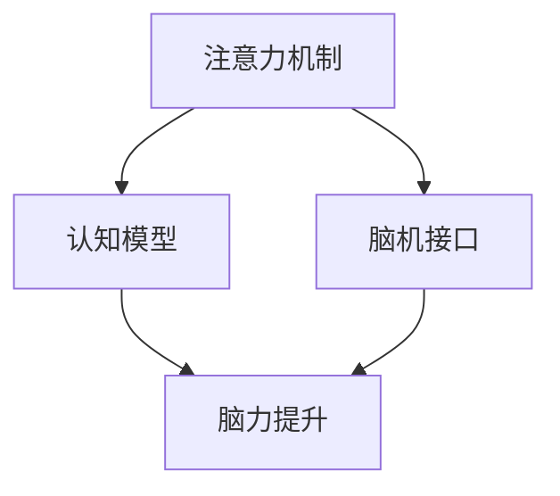

                 

# 人类注意力增强：未来的脑力提升

> 关键词：注意力增强,脑力提升,人工智能,深度学习,认知模型,神经网络,脑机接口,人机协同

## 1. 背景介绍

### 1.1 问题由来
近年来，随着深度学习和大数据技术的飞速发展，人工智能(AI)在许多领域取得了突破性进展。然而，尽管AI可以处理和分析大量数据，但人类最宝贵的认知能力——注意力，在AI中依然缺失。人类注意力作为一种高阶认知能力，能够帮助人们聚焦于重要信息，忽略无关内容，是决策和思考的基础。如何在AI系统中增强人类注意力，提升其决策能力，成为亟待解决的重要问题。

### 1.2 问题核心关键点
针对这一问题，本文提出“人类注意力增强”概念，即通过深度学习技术和脑科学原理，构建认知模型，模拟人类注意力的机制，并将其引入AI系统中。旨在提升AI系统的理解、决策和推理能力，使其更加贴近人类的认知逻辑。

### 1.3 问题研究意义
增强人类注意力，不仅能提升AI系统的智能化水平，还能增强人类自身的能力，推动人类认知能力的进化。人类注意力增强将为教育和医疗等众多领域带来深远影响，加速人工智能和人类智能的协同发展。

## 2. 核心概念与联系

### 2.1 核心概念概述

为更好地理解人类注意力增强，本节将介绍几个密切相关的核心概念：

- **注意力机制(Attention Mechanism)**：指在神经网络中通过选择性地关注输入序列的不同部分，来提升模型对信息的关注度和处理效率。常见的注意力机制有自注意力(Self-Attention)和多头注意力(Multi-Head Attention)等。
- **脑机接口(Brain-Computer Interface, BCI)**：通过记录大脑活动信号，解码出用户的注意力状态，实现人与机器之间的通信和交互。
- **认知模型(Cognitive Model)**：模拟人类认知过程的模型，涵盖感知、记忆、注意力、推理等认知过程，用于理解和提升AI系统的智能。
- **脑力提升(Brain Power Enhancement)**：通过增强认知能力，提升人类在学习和工作中的效率和效果。

这些核心概念之间的逻辑关系可以通过以下Mermaid流程图来展示：



这个流程图展示了几者之间的核心联系：注意力机制是认知模型中的重要部分，脑机接口能够解码大脑的注意力状态，认知模型通过模拟人类认知过程，用于理解人类注意力机制，脑力提升则是通过增强认知能力来提升人类的决策和思考能力。

## 3. 核心算法原理 & 具体操作步骤
### 3.1 算法原理概述

人类注意力增强的核心思想是，通过构建认知模型，模拟人类注意力的机制，并将注意力机制引入AI系统中。其核心算法原理包括：

1. **注意力计算**：通过计算输入序列中不同部分的权重，决定哪些信息值得更多关注，哪些可以忽略。
2. **注意力解码**：通过脑机接口技术，解码用户的大脑活动信号，获取注意力状态。
3. **注意力融合**：将解码得到的注意力状态与神经网络模型结合起来，指导模型进行决策和推理。

### 3.2 算法步骤详解

基于上述原理，人类注意力增强的具体操作步骤如下：

**Step 1: 准备数据和模型**
- 收集大量的任务数据，作为神经网络模型的输入。
- 设计并训练认知模型，用于模拟人类注意力的选择过程。

**Step 2: 引入注意力机制**
- 将认知模型与神经网络模型相结合，引入注意力机制。
- 使用注意力计算模块，计算输入序列中不同部分的权重。
- 根据计算得到的权重，对模型进行加权处理，提升模型的决策能力。

**Step 3: 解码注意力状态**
- 使用脑机接口技术，记录用户的大脑活动信号。
- 通过注意力解码算法，将信号转换为注意力状态。
- 将解码得到的注意力状态，作为模型的输入。

**Step 4: 集成和反馈**
- 将注意力状态与神经网络模型输出相结合，形成最终的决策结果。
- 对决策结果进行评估和反馈，调整认知模型的参数。
- 重复上述步骤，逐步提升模型的准确性和鲁棒性。

### 3.3 算法优缺点

人类注意力增强技术具有以下优点：
1. **提升决策能力**：通过引入注意力机制，AI系统可以更好地聚焦于重要信息，提升决策的准确性和效率。
2. **增强人机交互**：通过脑机接口技术，实现人与AI系统之间的无障碍通信和交互，提升用户体验。
3. **推动认知科学**：模拟人类认知过程，促进对人脑认知机制的深入理解。
4. **促进教育医疗**：增强人类注意力，提升学习和工作的效率，对教育医疗等领域带来积极影响。

然而，该技术也存在一定的局限性：
1. **技术复杂性高**：认知模型和脑机接口技术的应用，需要高水平的跨学科合作，技术门槛较高。
2. **数据需求量大**：高质量的数据是认知模型和脑机接口技术训练和优化的基础，收集和标注数据需要巨大投入。
3. **伦理和安全问题**：脑机接口技术涉及用户隐私和数据安全，可能存在隐私泄露和误用风险。
4. **计算资源消耗高**：认知模型和注意力机制的计算复杂度较高，对计算资源的需求较大。

尽管存在这些局限性，但人类注意力增强作为提升AI系统智能的重要手段，其潜力不容忽视。未来相关研究的重点在于如何降低技术门槛，提升数据获取效率，保障数据和隐私安全，同时推动认知模型和脑机接口技术的发展。

### 3.4 算法应用领域

人类注意力增强技术已经在多个领域展现出了显著的潜力：

- **智能辅助教育**：通过增强学生的注意力，提升课堂学习的效率和效果。例如，针对不同学科的学习，设计个性化的学习路径和内容，实时调整学习难度，使学习过程更加高效。
- **医疗诊断**：通过记录患者的脑电信号，解码其注意力状态，辅助医生进行诊断和治疗。例如，在注意力缺失症、抑郁症等疾病中，通过分析注意力变化，提供个性化的干预方案。
- **智能驾驶**：通过记录驾驶员的注意力状态，提高驾驶决策的准确性和安全性。例如，在复杂路况下，提醒驾驶员集中注意力，防止注意力分散导致的事故。
- **增强现实(AR)和虚拟现实(VR)**：通过增强用户的注意力，提升AR和VR体验的沉浸感和交互性。例如，在交互过程中，动态调整场景元素，吸引用户注意，提升体验效果。

除了上述这些应用，人类注意力增强技术还在游戏、人机交互、娱乐等多个领域有广泛的应用前景，为人类生活带来更多便利和乐趣。

## 4. 数学模型和公式 & 详细讲解 & 举例说明

### 4.1 数学模型构建

为了更好地理解人类注意力增强，我们将在数学上对注意力机制进行详细讲解。

记神经网络模型为 $M_{\theta}(x)$，其中 $x$ 为输入向量，$\theta$ 为模型参数。设 $a_i$ 表示输入 $x$ 中第 $i$ 个特征的注意力权重。则注意力计算公式为：

$$
a_i = \frac{\exp(u_i^\top v)}{\sum_{j=1}^n \exp(u_j^\top v)}
$$

其中 $u_i$ 为特征 $i$ 的表示向量，$v$ 为注意力向量的权重向量，$u^\top$ 表示向量点乘。

注意力计算过程实际上是对输入特征进行加权求和，权重由注意力向量决定。通过优化注意力向量，可以提升模型的决策能力。

### 4.2 公式推导过程

接下来，我们对注意力计算公式进行推导，理解其背后的数学原理。

注意力计算公式可以改写为：

$$
a_i = \frac{\exp(\sum_{j=1}^n w_{ij}x_j)}{\sum_{k=1}^n \exp(\sum_{j=1}^n w_{kj}x_j)}
$$

其中 $w_{ij}$ 表示特征 $i$ 和特征 $j$ 之间的注意力权重。该公式表示，对输入特征进行加权求和，权重由注意力向量决定。

通过优化注意力向量，可以提升模型的决策能力。具体的优化方法包括：

1. 梯度下降优化：通过反向传播算法，计算注意力向量的梯度，使用梯度下降更新注意力向量。
2. 正则化技术：使用L2正则、Dropout等技术，防止注意力向量过拟合。
3 注意力融合技术：将注意力向量与神经网络模型输出结合，形成最终的决策结果。

### 4.3 案例分析与讲解

以下以一个简单的分类任务为例，展示注意力机制在神经网络中的应用。

假设我们要对输入序列进行二分类，设输入序列为 $x=[x_1, x_2, ..., x_n]$，其中 $x_i$ 表示第 $i$ 个特征。我们设计一个简单的分类模型，其输入为特征向量 $x$，输出为二分类概率 $y$。

在模型中引入注意力机制，计算每个特征的注意力权重 $a_i$，公式如下：

$$
a_i = \frac{\exp(u_i^\top v)}{\sum_{j=1}^n \exp(u_j^\top v)}
$$

将计算得到的权重与特征向量结合，得到加权特征向量 $x_a=[x_1a_1, x_2a_2, ..., x_na_n]$，将其输入分类器，得到分类概率 $y_a$。分类概率 $y_a$ 的计算公式如下：

$$
y_a = \sigma(\sum_{i=1}^n w_{ia}x_{ia})
$$

其中 $w_{ia}$ 表示特征 $i$ 与分类器之间的权重。

该模型通过引入注意力机制，使模型能够更好地聚焦于对分类决策有用的特征，提升分类准确率。

## 5. 项目实践：代码实例和详细解释说明

### 5.1 开发环境搭建

在进行项目实践前，我们需要准备好开发环境。以下是使用Python进行PyTorch开发的环境配置流程：

1. 安装Anaconda：从官网下载并安装Anaconda，用于创建独立的Python环境。

2. 创建并激活虚拟环境：
```bash
conda create -n pytorch-env python=3.8 
conda activate pytorch-env
```

3. 安装PyTorch：根据CUDA版本，从官网获取对应的安装命令。例如：
```bash
conda install pytorch torchvision torchaudio cudatoolkit=11.1 -c pytorch -c conda-forge
```

4. 安装各类工具包：
```bash
pip install numpy pandas scikit-learn matplotlib tqdm jupyter notebook ipython
```

完成上述步骤后，即可在`pytorch-env`环境中开始项目实践。

### 5.2 源代码详细实现

这里我们以一个简单的分类任务为例，展示如何使用PyTorch构建包含注意力机制的神经网络模型。

首先，定义模型的结构和注意力计算函数：

```python
import torch
import torch.nn as nn

class Attention(nn.Module):
    def __init__(self, in_dim, attention_dim):
        super(Attention, self).__init__()
        self.linear = nn.Linear(in_dim, attention_dim)
        self.v = nn.Linear(attention_dim, 1)

    def forward(self, x):
        u = self.linear(x)
        v = self.v(u)
        a = torch.softmax(v, dim=1)
        return a * x

class Classifier(nn.Module):
    def __init__(self, in_dim, out_dim):
        super(Classifier, self).__init__()
        self.linear = nn.Linear(in_dim, out_dim)
        self.sigmoid = nn.Sigmoid()

    def forward(self, x):
        return self.sigmoid(self.linear(x))
```

然后，定义注意力计算过程和分类器：

```python
def attention_forward(x, attention):
    return attention(x)

def classifier_forward(x, classifier):
    return classifier(x)

# 输入数据
x = torch.randn(10, 5)
attention = Attention(5, 3)
classifier = Classifier(5, 2)

# 计算加权特征向量
x_a = attention_forward(x, attention)

# 计算分类概率
y_a = classifier_forward(x_a, classifier)
```

最后，使用PyTorch构建模型，进行训练和预测：

```python
import torch.optim as optim

# 定义模型
model = nn.Sequential(attention, classifier)

# 定义损失函数和优化器
criterion = nn.BCELoss()
optimizer = optim.Adam(model.parameters(), lr=0.01)

# 训练模型
for epoch in range(100):
    optimizer.zero_grad()
    y_pred = model(x)
    loss = criterion(y_pred, y)
    loss.backward()
    optimizer.step()
    if (epoch+1) % 10 == 0:
        print(f"Epoch {epoch+1}, Loss: {loss.item()}")

# 使用模型进行预测
y_pred = model(x)
```

以上就是使用PyTorch构建包含注意力机制的神经网络模型的完整代码实现。可以看到，通过简单的几行代码，便能够构建出包含注意力机制的模型，并使用PyTorch进行训练和预测。

### 5.3 代码解读与分析

让我们再详细解读一下关键代码的实现细节：

**Attention类**：
- `__init__`方法：初始化注意力计算模块，包含线性层和注意力向量计算。
- `forward`方法：计算注意力权重，并将权重与输入特征向量结合，形成加权特征向量。

**Classifier类**：
- `__init__`方法：初始化分类器，包含线性层和激活函数。
- `forward`方法：计算分类概率。

**attention_forward函数**：
- 定义注意力计算函数，通过线性层计算注意力向量，使用softmax函数计算注意力权重，并乘以输入特征向量，形成加权特征向量。

**classifier_forward函数**：
- 定义分类器计算函数，通过线性层和激活函数计算分类概率。

**模型训练和预测**：
- 使用PyTorch构建包含注意力机制的神经网络模型。
- 定义损失函数和优化器，进行模型训练。
- 在训练过程中，使用softmax函数计算注意力权重，使用sigmoid函数计算分类概率。

可以看到，通过PyTorch的强大封装，我们能够相对简洁地实现注意力机制，并使用梯度下降等优化算法进行模型训练。开发者可以将更多精力放在数据处理、模型改进等高层逻辑上，而不必过多关注底层的实现细节。

## 6. 实际应用场景

### 6.1 智能辅助教育

人类注意力增强技术可以应用于智能辅助教育，提升学生的学习效率。例如，通过对学生的注意力状态进行实时监测和分析，动态调整学习内容和难度，使学习过程更加高效和个性化。

在实践中，可以通过脑机接口技术，记录学生的脑电信号，解码其注意力状态。根据注意力变化，调整课堂讲授内容，引导学生集中注意力。例如，在数学题讲解过程中，如果发现部分学生注意力分散，可以暂停讲解，转向简单问题，重新吸引学生注意力。通过这种方式，能够显著提升学生的学习效果。

### 6.2 医疗诊断

在医疗诊断中，人类注意力增强技术可以辅助医生进行更加精准的诊断和治疗。例如，通过记录患者的注意力状态，分析其注意力变化，辅助医生进行心理评估和治疗方案的制定。

在实践中，可以通过脑机接口技术，记录患者的脑电信号，解码其注意力状态。根据注意力变化，调整治疗方案，提升治疗效果。例如，在抑郁症患者治疗中，通过记录注意力变化，监测患者对治疗的响应，及时调整治疗方案，提高治疗成功率。

### 6.3 智能驾驶

在智能驾驶中，人类注意力增强技术可以提升驾驶决策的准确性和安全性。例如，通过记录驾驶员的注意力状态，辅助系统进行驾驶决策，防止注意力分散导致的事故。

在实践中，可以通过脑机接口技术，记录驾驶员的脑电信号，解码其注意力状态。根据注意力变化，提醒驾驶员集中注意力，防止注意力分散。例如，在复杂路况下，提醒驾驶员集中注意力，提升驾驶安全。

### 6.4 未来应用展望

随着人类注意力增强技术的不断发展，其在多个领域的应用前景将更加广阔。未来，该技术将进一步推动认知科学的发展，提升人类智能的智能化水平。

在智慧城市中，人类注意力增强技术可以用于交通管理、安全监控等方面，提升城市的智能化水平。例如，通过对市民的注意力状态进行实时监测，动态调整交通信号和监控策略，提高城市管理效率。

在军事领域，人类注意力增强技术可以用于指挥决策、战场分析等方面，提升作战效率。例如，通过对士兵的注意力状态进行实时监测，动态调整战术和策略，提高作战成功率。

此外，在娱乐、游戏、人机交互等多个领域，人类注意力增强技术也将有广泛的应用前景，为人类生活带来更多便利和乐趣。

## 7. 工具和资源推荐
### 7.1 学习资源推荐

为了帮助开发者系统掌握人类注意力增强的理论基础和实践技巧，这里推荐一些优质的学习资源：

1. 《深度学习》系列书籍：由多位深度学习领域的专家共同编写，全面介绍了深度学习的基本概念和前沿技术，涵盖认知模型和注意力机制等核心内容。
2. CS231n《深度学习与计算机视觉》课程：斯坦福大学开设的深度学习课程，专注于计算机视觉方向，深入讲解了注意力机制的应用。
3. 《Human Brain Machine Interface》书籍：脑机接口领域的经典书籍，全面介绍了脑机接口的原理、技术和应用。
4. ArXiv预印本：深度学习领域的顶级学术平台，涵盖认知模型和脑机接口领域的最新研究成果，是学习前沿技术的最佳途径。
5. GitHub开源项目：包含多个认知模型和脑机接口的开源项目，便于学习和实践。

通过对这些资源的学习实践，相信你一定能够快速掌握人类注意力增强的精髓，并用于解决实际的认知和智能问题。
###  7.2 开发工具推荐

高效的开发离不开优秀的工具支持。以下是几款用于人类注意力增强开发的常用工具：

1. PyTorch：基于Python的开源深度学习框架，灵活动态的计算图，适合快速迭代研究。支持认知模型和注意力机制的构建和优化。
2. TensorFlow：由Google主导开发的开源深度学习框架，生产部署方便，适合大规模工程应用。支持多种模型的构建和优化。
3. Weights & Biases：模型训练的实验跟踪工具，可以记录和可视化模型训练过程中的各项指标，方便对比和调优。与主流深度学习框架无缝集成。
4. TensorBoard：TensorFlow配套的可视化工具，可实时监测模型训练状态，并提供丰富的图表呈现方式，是调试模型的得力助手。
5. Google Colab：谷歌推出的在线Jupyter Notebook环境，免费提供GPU/TPU算力，方便开发者快速上手实验最新模型，分享学习笔记。

合理利用这些工具，可以显著提升人类注意力增强任务的开发效率，加快创新迭代的步伐。

### 7.3 相关论文推荐

人类注意力增强技术的研究源于学界的持续探索。以下是几篇奠基性的相关论文，推荐阅读：

1. Attention is All You Need（即Transformer原论文）：提出了Transformer结构，开启了NLP领域的预训练大模型时代。
2. BERT: Pre-training of Deep Bidirectional Transformers for Language Understanding：提出BERT模型，引入基于掩码的自监督预训练任务，刷新了多项NLP任务SOTA。
3. Multi-Head Attention Networks: A New Architecture for Machine Learning (I)：介绍了多头注意力机制，成为深度学习中的重要组成部分。
4. Saliency-based Attention Learning for Weakly Supervised Scene Parsing：提出基于视觉注意力的学习机制，为计算机视觉任务提供了新思路。
5. Learning Attention with Guided Attention Network (GAN)：引入引导注意力网络，提升注意力机制的性能和鲁棒性。

这些论文代表了大语言模型微调技术的发展脉络。通过学习这些前沿成果，可以帮助研究者把握学科前进方向，激发更多的创新灵感。

## 8. 总结：未来发展趋势与挑战
### 8.1 总结

本文对人类注意力增强概念进行了全面系统的介绍。首先阐述了注意力机制在神经网络中的应用，提出了人类注意力增强的概念，并明确了其在提升AI系统智能方面的重要价值。其次，从原理到实践，详细讲解了注意力机制的数学原理和关键步骤，给出了注意力机制的应用实例。同时，本文还广泛探讨了注意力机制在教育、医疗、智能驾驶等多个领域的应用前景，展示了其巨大的潜力。此外，本文精选了注意力机制相关的学习资源，力求为读者提供全方位的技术指引。

通过本文的系统梳理，可以看到，注意力机制作为提升AI系统智能的重要手段，正在成为深度学习领域的重要范式，极大地拓展了深度学习的应用边界，催生了更多的落地场景。未来的研究需要在以下几个方向寻求新的突破：

### 8.2 未来发展趋势

展望未来，人类注意力增强技术将呈现以下几个发展趋势：

1. **多模态注意力机制**：当前的注意力机制主要是基于文本或视觉数据，未来将拓展到声音、气味等多模态数据。通过融合多种信息源，提升AI系统的感知能力。
2. **自适应注意力机制**：引入自适应算法，动态调整注意力机制的参数，适应不同任务和数据分布，提升AI系统的泛化能力。
3. **元学习注意力机制**：将注意力机制与元学习范式结合，提升AI系统的学习能力和适应性，使其能够在不同场景下自动调整注意力策略。
4. **强化学习注意力机制**：引入强化学习算法，优化注意力机制的学习过程，提升AI系统的决策能力和鲁棒性。
5. **人机协同注意力机制**：将注意力机制与脑机接口技术结合，实现人机协同交互，提升AI系统的智能水平和用户体验。

以上趋势凸显了人类注意力增强技术的广阔前景。这些方向的探索发展，必将进一步提升AI系统的智能化水平，推动人工智能技术的全面应用。

### 8.3 面临的挑战

尽管人类注意力增强技术已经取得了瞩目成就，但在迈向更加智能化、普适化应用的过程中，它仍面临着诸多挑战：

1. **技术复杂性高**：认知模型和脑机接口技术的应用，需要高水平的跨学科合作，技术门槛较高。
2. **数据需求量大**：高质量的数据是认知模型和脑机接口技术训练和优化的基础，收集和标注数据需要巨大投入。
3. **伦理和安全问题**：脑机接口技术涉及用户隐私和数据安全，可能存在隐私泄露和误用风险。
4. **计算资源消耗高**：认知模型和注意力机制的计算复杂度较高，对计算资源的需求较大。

尽管存在这些挑战，但人类注意力增强作为提升AI系统智能的重要手段，其潜力不容忽视。未来相关研究的重点在于如何降低技术门槛，提升数据获取效率，保障数据和隐私安全，同时推动认知模型和脑机接口技术的发展。

### 8.4 研究展望

面对人类注意力增强面临的挑战，未来的研究需要在以下几个方面寻求新的突破：

1. **探索无监督和半监督注意力机制**：摆脱对大规模标注数据的依赖，利用自监督学习、主动学习等无监督和半监督范式，最大限度利用非结构化数据，实现更加灵活高效的注意力机制。
2. **研究参数高效和计算高效的注意力机制**：开发更加参数高效的注意力机制，在固定大部分预训练参数的同时，只更新极少量的任务相关参数。同时优化注意力机制的计算图，减少前向传播和反向传播的资源消耗，实现更加轻量级、实时性的部署。
3. **融合因果和对比学习范式**：通过引入因果推断和对比学习思想，增强注意力机制建立稳定因果关系的能力，学习更加普适、鲁棒的语言表征，从而提升模型泛化性和抗干扰能力。
4. **引入更多先验知识**：将符号化的先验知识，如知识图谱、逻辑规则等，与注意力机制进行巧妙融合，引导注意力机制学习更准确、合理的语言模型。同时加强不同模态数据的整合，实现视觉、声音等多模态信息与文本信息的协同建模。
5. **结合因果分析和博弈论工具**：将因果分析方法引入注意力机制，识别出注意力机制决策的关键特征，增强输出解释的因果性和逻辑性。借助博弈论工具刻画人机交互过程，主动探索并规避注意力机制的脆弱点，提高系统稳定性。
6. **纳入伦理道德约束**：在注意力机制训练目标中引入伦理导向的评估指标，过滤和惩罚有害的输出倾向。同时加强人工干预和审核，建立注意力机制行为的监管机制，确保输出符合人类价值观和伦理道德。

这些研究方向的探索，必将引领人类注意力增强技术迈向更高的台阶，为构建安全、可靠、可解释、可控的智能系统铺平道路。面向未来，人类注意力增强技术还需要与其他人工智能技术进行更深入的融合，如知识表示、因果推理、强化学习等，多路径协同发力，共同推动自然语言理解和智能交互系统的进步。只有勇于创新、敢于突破，才能不断拓展注意力机制的边界，让智能技术更好地造福人类社会。

## 9. 附录：常见问题与解答

**Q1：人类注意力增强是否适用于所有AI系统？**

A: 人类注意力增强技术适用于任何需要注意力机制的AI系统，特别是需要高精度、高效率决策的系统。例如，金融交易、医疗诊断、自动驾驶等领域，人类注意力增强可以显著提升系统的智能水平和决策能力。

**Q2：如何选择合适的注意力机制？**

A: 选择合适的注意力机制需要考虑任务特点和数据分布。常见的注意力机制包括自注意力、多头注意力、全局注意力等，需要根据具体任务选择合适的机制。例如，对于机器翻译任务，多头注意力机制效果较好；对于图像处理任务，全局注意力机制更为适合。

**Q3：注意力机制的计算复杂度如何？**

A: 注意力机制的计算复杂度较高，主要取决于输入序列的长度和注意力向量的维度。为降低计算复杂度，可以引入并行计算、混合精度计算等技术，优化注意力机制的计算过程。

**Q4：人类注意力增强技术是否会影响用户隐私？**

A: 人类注意力增强技术涉及用户的脑电信号等隐私数据，因此需要严格遵守数据隐私保护法规。可以通过匿名化处理、数据加密等技术，保障用户隐私安全。

**Q5：人类注意力增强技术在未来有哪些潜在的市场应用？**

A: 人类注意力增强技术具有广阔的市场应用前景，主要集中在教育、医疗、智能驾驶、娱乐等领域。例如，在教育中，可以通过实时监测学生的注意力状态，提升课堂教学效果；在医疗中，可以通过监测患者的注意力状态，辅助医生进行精准诊断和治疗；在智能驾驶中，可以通过监测驾驶员的注意力状态，提升驾驶安全性。

通过本文的系统梳理，可以看到，人类注意力增强技术作为提升AI系统智能的重要手段，正在成为深度学习领域的重要范式，极大地拓展了深度学习的应用边界，催生了更多的落地场景。未来，随着技术的不断演进，人类注意力增强技术将在更多领域得到应用，为人类生活带来更多便利和乐趣。

