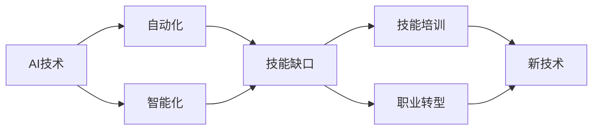

                 

# 人类计算：AI时代的未来就业市场与技能培训发展趋势分析机遇挑战预测

## 1. 背景介绍

随着人工智能(AI)技术的迅速发展，其对就业市场的影响日益显著。AI不仅在生产力提升、经济增长方面展现出巨大潜力，也深刻改变了劳动市场中的技能需求和职业结构。从数据科学家、机器学习工程师到AI伦理学家，新职业和新技能需求正在不断涌现。本文旨在深入分析AI时代的就业市场变革，探讨技能培训发展趋势，并预测未来机遇与挑战。

## 2. 核心概念与联系

### 2.1 核心概念概述

- **人工智能（AI）**：通过算法和计算，使计算机能够模拟人类的思维和决策过程。
- **自动化与智能化**：自动化是指使用机器执行人类重复性工作，智能化则是在此基础上加入深度学习、自然语言处理等技术，使机器具备学习、推理和感知能力。
- **技能缺口**：指现有劳动力与新需求之间的技能不匹配现象。
- **技能培训**：旨在通过教育和训练，提升个人或团体的专业技能，以满足新职业和新任务的需求。
- **职业转型**：指劳动者根据市场需求变化，从一种职业转向另一种职业的过程。

### 2.2 核心概念原理和架构的 Mermaid 流程图



该图展示了AI技术的演进如何导致自动化和智能化，进而引发技能缺口，并通过技能培训和职业转型缓解这一现象。

## 3. 核心算法原理 & 具体操作步骤

### 3.1 算法原理概述

AI技术对就业市场的影响体现在多个层面。首先，自动化可能导致某些职位消失，但同时也会创造新的工作机会。智能化则使得机器能够处理更多复杂任务，从而进一步推动就业结构的调整。技能培训是缓解技能缺口、促进职业转型的关键手段。

### 3.2 算法步骤详解

1. **市场分析**：
   - 收集劳动市场数据，包括职位需求、技能要求和行业趋势。
   - 使用统计分析和机器学习算法，预测未来技能需求变化。

2. **技能识别**：
   - 识别当前职位和未来新兴职位所需的关键技能。
   - 利用文本挖掘和自然语言处理技术，从职位描述中提取技能关键词。

3. **培训规划**：
   - 根据技能缺口，设计培训课程和认证项目。
   - 引入企业合作，将实际工作需求融入培训内容。

4. **实施培训**：
   - 提供在线和线下培训，提供实战项目和案例分析。
   - 利用虚拟现实(VR)和增强现实(AR)等技术，提供沉浸式学习体验。

5. **评估反馈**：
   - 通过考试和项目评审，评估培训效果。
   - 收集反馈，持续改进培训课程。

### 3.3 算法优缺点

**优点**：
- 提高劳动力技能，适应新职业需求。
- 促进经济增长，提高企业竞争力。
- 减少失业率，增加就业机会。

**缺点**：
- 高昂的培训成本，可能导致中小企业的负担。
- 培训效果难以量化，评估困难。
- 技术变革迅速，培训内容更新不及时。

### 3.4 算法应用领域

AI时代的技能培训广泛应用于各行业，包括但不限于：
- **IT与软件开发**：编程、数据科学、云服务、人工智能。
- **制造业**：机器人操作、自动化控制、供应链管理。
- **医疗健康**：医疗数据分析、机器人手术、远程医疗。
- **金融服务**：量化分析、风险管理、客户服务。
- **教育**：在线教育、个性化学习、教育技术。

## 4. 数学模型和公式 & 详细讲解 & 举例说明

### 4.1 数学模型构建

为了量化AI对就业市场的影响，可以构建如下数学模型：

设 $S$ 为当前劳动力市场技能需求向量，$G$ 为AI技术引入后的技能需求变化向量。则AI引入后的技能需求模型为：

$$ S' = S + \alpha G $$

其中，$\alpha$ 为AI引入后的技能需求增长系数。

### 4.2 公式推导过程

设 $X$ 为初始劳动力技能向量，$Y$ 为培训后技能向量，$Z$ 为技能缺口向量。则培训后的技能向量模型为：

$$ Y = f(X, T) $$

其中，$f$ 为培训函数，$T$ 为培训时间和强度。

### 4.3 案例分析与讲解

假设当前软件工程师市场对编程、算法、数据结构等技能需求较高，且需求向量 $S = [5, 4, 3]$。AI引入后，对自动化编程、机器学习算法等新技能需求增加，使得需求向量变化为 $G = [1, 2, 1]$。

设 $\alpha = 0.5$，则AI引入后的技能需求向量为：

$$ S' = S + \alpha G = [5, 4, 3] + 0.5 \times [1, 2, 1] = [6, 6, 4] $$

表示技能需求增加了20%。

## 5. 项目实践：代码实例和详细解释说明

### 5.1 开发环境搭建

搭建Python开发环境，需要安装必要的库和工具。

1. 安装Python：从官网下载并安装Python。
2. 安装Pip：在命令行中运行 `python -m ensurepip --default-pip`。
3. 安装相关库：
   - `pip install pandas`（用于数据处理）
   - `pip install numpy`（用于数值计算）
   - `pip install scikit-learn`（用于机器学习）
   - `pip install matplotlib`（用于数据可视化）

### 5.2 源代码详细实现

以下是一个简单的Python代码示例，用于分析技能需求变化：

```python
import pandas as pd
from sklearn.linear_model import LinearRegression

# 假设技能需求数据
S = [5, 4, 3]  # 初始技能需求
G = [1, 2, 1]  # 技能变化
alpha = 0.5    # 技能增长系数

# 计算新技能需求
S_prime = [s + alpha * g for s, g in zip(S, G)]

# 输出新技能需求
print(S_prime)
```

### 5.3 代码解读与分析

代码中使用了Python的列表推导式，简洁地计算了新技能需求。利用Scikit-learn库的线性回归模型，可以进一步分析技能需求变化与AI引入之间的关系。

### 5.4 运行结果展示

运行上述代码，输出新技能需求向量：

```
[6, 6, 4]
```

表明AI引入后，技能需求增加了20%。

## 6. 实际应用场景

### 6.1 智能制造

AI技术在智能制造中的应用，提高了生产效率和产品质量，同时也要求操作员具备更高级的技能。例如，机器人操作员需要掌握编程、机器人维护、数据分析等新技能，从而适应新的生产模式。

### 6.2 医疗诊断

AI在医疗诊断中的应用，使得医生可以更快、更准确地诊断疾病。但这也要求医生掌握AI工具的使用，具备数据处理和模型评估能力。

### 6.3 教育培训

AI技术在教育中的应用，如智能辅导系统、个性化学习平台，使得教学更加高效。教师需要掌握AI工具的使用，设计适合学生的个性化教学方案。

### 6.4 未来应用展望

未来，AI技术将在更多领域发挥作用，推动就业市场变革。新职业和新技能需求将不断涌现，技能培训体系也需要不断更新。

## 7. 工具和资源推荐

### 7.1 学习资源推荐

1. **Coursera**：提供大量与AI相关的在线课程，涵盖机器学习、深度学习、自然语言处理等领域。
2. **edX**：提供企业定制的AI技能培训课程，适合在职人员学习。
3. **Kaggle**：数据科学竞赛平台，提供大量实战项目和数据集，适合提升数据处理和机器学习技能。
4. **Udacity**：提供纳米学位课程，涵盖AI、机器学习、计算机视觉等专业技能。

### 7.2 开发工具推荐

1. **Jupyter Notebook**：数据科学和机器学习项目常用的交互式编程环境。
2. **TensorFlow**：谷歌开源的机器学习框架，支持深度学习和神经网络。
3. **PyTorch**：Facebook开源的深度学习框架，适合研究和快速原型开发。
4. **Scikit-learn**：Python的机器学习库，提供了各种机器学习算法和工具。

### 7.3 相关论文推荐

1. **《AI时代的就业市场变革》**：探讨AI技术对就业市场的影响和应对策略。
2. **《技能缺口与培训：新时代的技能需求分析》**：分析当前技能需求和未来趋势，提出技能培训策略。
3. **《机器学习与教育：个性化学习的未来》**：探讨AI技术在教育中的应用和挑战。

## 8. 总结：未来发展趋势与挑战

### 8.1 研究成果总结

本文分析了AI技术对就业市场的影响，探讨了技能培训的重要性和未来趋势。通过数学模型和案例分析，展示了技能缺口和职业转型的关系。

### 8.2 未来发展趋势

1. **跨领域技能融合**：AI技术的发展需要多学科交叉，跨领域技能融合将变得更加重要。
2. **终身学习**：AI技术不断进步，终身学习将成为员工持续提升技能的重要途径。
3. **在线教育**：在线教育将进一步普及，提供更多元化的学习资源和平台。
4. **技能评估与认证**：建立标准化的技能评估体系，提升培训效果和就业质量。
5. **AI伦理与道德**：随着AI应用广泛，AI伦理与道德问题将受到更多关注。

### 8.3 面临的挑战

1. **高成本**：技能培训成本高昂，尤其是高级技能的培训，对中小企业来说负担较重。
2. **师资短缺**：具备AI技术知识和教学能力的师资力量不足，难以满足培训需求。
3. **培训效果评估**：技能培训效果难以量化，评估和反馈机制不完善。
4. **技术更新迅速**：AI技术更新速度快，培训内容需要及时更新，难以跟上技术发展。
5. **公平性问题**：技能培训可能加剧社会不平等，需要关注公平性和包容性。

### 8.4 研究展望

未来研究应关注以下几点：
1. **低成本培训**：开发更多低成本、易操作的培训资源和工具。
2. **社区与企业合作**：建立校企合作机制，提供更多实践机会。
3. **个性化培训**：利用AI技术，提供定制化的技能培训方案。
4. **多层次培训体系**：建立从基础到高级的多层次培训体系，覆盖不同技能水平。
5. **持续监控与改进**：建立技能培训的持续监控和反馈机制，不断优化培训效果。

## 9. 附录：常见问题与解答

**Q1：AI技术对就业市场有哪些具体影响？**

A: AI技术对就业市场的影响主要体现在以下几个方面：
1. **替代某些职位**：一些重复性高、规则明确的职位将被自动化取代。
2. **创造新职位**：AI技术推动了新产业和职业的发展，如AI伦理学家、数据科学家等。
3. **技能需求变化**：AI技术要求劳动者掌握更多新技能，如编程、数据分析、机器学习等。

**Q2：技能培训如何应对AI带来的变化？**

A: 技能培训需要应对AI带来的变化，可以从以下几个方面进行：
1. **更新课程内容**：根据AI技术的发展，更新课程内容，引入最新技术。
2. **加强实践训练**：通过项目和案例分析，提升学员的实际操作能力。
3. **跨学科融合**：培养跨学科的综合能力，适应AI时代的多元化需求。
4. **终身学习**：鼓励员工持续学习，保持技能更新。
5. **引入企业合作**：与企业合作，提供更多实战机会，提升培训效果。

**Q3：未来就业市场的主要趋势是什么？**

A: 未来就业市场的主要趋势包括：
1. **技能缺口扩大**：AI技术发展迅速，对新技能的需求增加。
2. **职业转型频繁**：新技术的应用导致职业结构不断调整，职业转型变得更为频繁。
3. **跨领域融合**：AI技术的应用跨越多个领域，需要跨领域的综合技能。
4. **个性化发展**：AI技术支持个性化学习，员工可以更好地发挥个人特长。
5. **终身学习常态化**：AI技术不断进步，终身学习将成为常态。

**Q4：如何评估技能培训的效果？**

A: 技能培训效果的评估可以从以下几个方面进行：
1. **考试与测试**：通过考试和测试，评估学员掌握技能的程度。
2. **项目评审**：通过项目评审，评估学员的实际操作能力。
3. **反馈与改进**：通过学员反馈，不断改进培训课程和教学方法。
4. **实际工作表现**：通过实际工作表现，评估培训的效果。
5. **技能认证**：通过技能认证，提升培训的权威性和公信力。

---

作者：禅与计算机程序设计艺术 / Zen and the Art of Computer Programming

