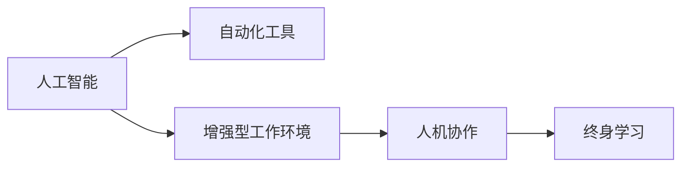

                 

# 人类计算：AI时代的未来工作技能

在AI时代，技术进步的浪潮正在改变我们的工作方式，推动各行各业向智能化、自动化转型。面对这一变化，人类需要重新审视自己的角色和技能，以适应未来的工作需求。本文将探讨AI时代人类计算的重要性和未来工作技能的发展方向，帮助职场人士更好地适应技术变革，提升自我价值。

## 1. 背景介绍

### 1.1 问题由来

随着人工智能技术的不断进步，越来越多的自动化工具和系统被引入到工作中，极大提升了生产效率。然而，技术的发展也带来了新的挑战：一方面，人类的工作被自动化工具替代，可能会失去部分工作机会；另一方面，AI系统也存在局限性，例如无法完全替代人类的创造性思维、情感理解和复杂决策。

### 1.2 问题核心关键点

AI时代的工作技能变化，关键在于理解AI与人类工作的互补关系。具体来说：

- AI擅长处理重复性高、规则明确的任务，而人类则更适合处理需要创造性、灵活性和情感判断的工作。
- 人类计算的核心，在于利用技术辅助提升自身技能，实现与AI系统的协同工作。

## 2. 核心概念与联系

### 2.1 核心概念概述

要深入理解人类计算在AI时代的重要性，需要掌握以下核心概念：

- **人工智能(AI)**：指通过算法和计算实现智能行为的技术。
- **自动化工具**：包括机器人、智能软件等，用于执行重复性和规则明确的任务。
- **增强型工作环境**：利用AI技术提升工作效率，但保留人类工作的核心能力。
- **人机协作**：AI与人类共同完成工作任务，发挥各自优势。
- **终身学习**：持续更新知识和技能，以适应技术变化。

这些概念通过以下Mermaid流程图展示其联系：



## 3. 核心算法原理 & 具体操作步骤
### 3.1 算法原理概述

人类计算的核心，在于利用AI技术和工具，提升人类在复杂任务、创造性思维、情感理解和决策能力方面的表现。其算法原理如下：

1. **数据驱动**：利用AI系统处理和分析大量数据，为人类提供决策支持。
2. **模型协同**：结合人类直觉和AI模型的结果，进行综合判断。
3. **任务分配**：根据任务特点，合理分配人类和AI系统的职责。
4. **持续优化**：通过反馈机制，不断调整人类和AI系统的协同方式，提升工作效率。

### 3.2 算法步骤详解

实现人类计算的关键步骤如下：

1. **需求分析**：明确工作的具体需求和目标，分析AI技术的适用性。
2. **数据准备**：收集和整理相关的数据，包括文本、图像、视频等，用于训练AI模型。
3. **模型选择与训练**：根据任务特点选择合适的AI模型，并利用大数据进行训练和调优。
4. **系统集成**：将训练好的AI模型集成到工作流程中，与人类操作协同工作。
5. **持续改进**：定期收集反馈信息，不断调整和优化AI模型和人类操作，提升整体效果。

### 3.3 算法优缺点

人类计算的优点在于：

- **提升效率**：通过自动化和智能化工具，减少重复性工作，提升工作效率。
- **增强决策**：利用AI处理大量数据，提供科学决策依据。
- **优化工作体验**：减少人力劳动强度，提升工作满意度和幸福感。

然而，人类计算也存在一些缺点：

- **技能要求高**：需要掌握AI技术，理解数据分析和模型应用。
- **数据依赖性**：依赖高质量、结构化的数据，数据获取成本较高。
- **技术依赖**：过度依赖AI工具，可能忽视自身能力和创意。

### 3.4 算法应用领域

人类计算的应用领域非常广泛，涵盖多个行业：

- **医疗**：利用AI进行病历分析、影像诊断等，辅助医生决策。
- **金融**：通过AI进行风险评估、市场分析等，提升投资决策。
- **制造**：利用AI进行质量控制、生产优化等，提高生产效率。
- **教育**：借助AI进行个性化教学、学习分析等，提升教育效果。
- **娱乐**：通过AI进行内容推荐、互动体验等，提升用户体验。

## 4. 数学模型和公式 & 详细讲解 & 举例说明

### 4.1 数学模型构建

以金融风险评估为例，构建数学模型如下：

设有一系列历史金融数据 $D=\{(x_i,y_i)\}_{i=1}^N$，其中 $x_i$ 为金融指标，$y_i$ 为风险评分。

定义AI模型 $M_{\theta}$ 为：

$$
M_{\theta}(x) = f_{\theta}(x;D)
$$

其中 $f_{\theta}$ 为AI模型的函数表示，$\theta$ 为模型参数。

目标是最小化模型预测误差，即：

$$
\hat{\theta} = \mathop{\arg\min}_{\theta} \mathcal{L}(M_{\theta},D)
$$

其中 $\mathcal{L}$ 为损失函数。

### 4.2 公式推导过程

以线性回归模型为例，其公式推导如下：

设模型 $M_{\theta}(x) = \theta_0 + \theta_1 x_1 + \theta_2 x_2 + \ldots + \theta_n x_n$，目标是最小化误差平方和：

$$
\mathcal{L}(\theta) = \frac{1}{N} \sum_{i=1}^N (y_i - M_{\theta}(x_i))^2
$$

根据最小二乘法，求解 $\theta$：

$$
\hat{\theta} = \mathop{\arg\min}_{\theta} \mathcal{L}(\theta)
$$

求解过程如下：

$$
\hat{\theta} = (\mathbf{X}^T\mathbf{X})^{-1}\mathbf{X}^T\mathbf{Y}
$$

其中 $\mathbf{X}$ 为特征矩阵，$\mathbf{Y}$ 为目标向量。

### 4.3 案例分析与讲解

以医疗影像分析为例，构建AI模型进行病灶识别：

- **数据准备**：收集医疗影像数据 $D=\{(x_i,y_i)\}_{i=1}^N$，其中 $x_i$ 为影像图像，$y_i$ 为病灶位置或类型。
- **模型选择**：选择卷积神经网络(CNN)作为AI模型。
- **模型训练**：利用数据集训练模型，优化参数 $\theta$。
- **系统集成**：将训练好的模型集成到医疗影像分析系统中，辅助医生进行病灶识别。
- **持续改进**：收集医生反馈，不断调整模型参数和分析方法，提升诊断准确率。

## 5. 项目实践：代码实例和详细解释说明

### 5.1 开发环境搭建

1. **Python环境**：安装Python 3.8以上版本，使用虚拟环境。
2. **数据集准备**：收集并清洗医疗影像数据，准备训练集和测试集。
3. **模型库安装**：安装TensorFlow、Keras等深度学习框架。
4. **开发工具**：使用Jupyter Notebook、PyCharm等工具进行开发。

### 5.2 源代码详细实现

以下是一个简单的医疗影像病灶识别模型的实现代码：

```python
import tensorflow as tf
from tensorflow.keras import layers, models

# 定义模型
model = models.Sequential([
    layers.Conv2D(32, (3, 3), activation='relu', input_shape=(256, 256, 1)),
    layers.MaxPooling2D((2, 2)),
    layers.Conv2D(64, (3, 3), activation='relu'),
    layers.MaxPooling2D((2, 2)),
    layers.Conv2D(128, (3, 3), activation='relu'),
    layers.MaxPooling2D((2, 2)),
    layers.Flatten(),
    layers.Dense(128, activation='relu'),
    layers.Dense(1, activation='sigmoid')
])

# 编译模型
model.compile(optimizer='adam',
              loss='binary_crossentropy',
              metrics=['accuracy'])

# 训练模型
model.fit(train_images, train_labels, epochs=10, validation_data=(test_images, test_labels))
```

### 5.3 代码解读与分析

以上代码实现了一个简单的CNN模型，用于医疗影像病灶识别。代码主要分为以下几个部分：

1. **模型定义**：定义了多层卷积和池化层，最后添加全连接层和输出层。
2. **模型编译**：选择Adam优化器和二元交叉熵损失函数，并设置评价指标为准确率。
3. **模型训练**：使用训练集数据训练模型，并设置10个epochs。

### 5.4 运行结果展示

在模型训练完成后，可以对其效果进行评估和验证：

```python
test_loss, test_acc = model.evaluate(test_images, test_labels)
print('Test accuracy:', test_acc)
```

## 6. 实际应用场景

### 6.1 金融风险评估

在金融领域，AI模型可以用于风险评估，利用历史数据预测客户违约概率，帮助金融机构进行风险管理。人类计算在此基础上，通过深度学习模型的结果，结合金融知识进行综合判断，制定更加科学的投资策略。

### 6.2 医疗影像诊断

医疗影像诊断是AI技术的重要应用之一。AI模型通过大量医学影像数据进行训练，可以帮助医生快速识别病灶，但最终诊断仍需依赖医生的专业知识和经验。人类计算在此基础上，通过AI辅助分析结果，进行综合判断，提高诊断准确率。

### 6.3 智能制造优化

在制造领域，AI模型可以用于质量控制、生产优化等。人类计算在此基础上，结合AI模型的结果，制定更加合理的生产计划，提升生产效率和产品质量。

### 6.4 未来应用展望

未来，随着AI技术的不断进步，人类计算的应用范围将更加广泛。主要发展趋势包括：

1. **多模态数据融合**：结合文本、图像、语音等多种数据，提升综合分析能力。
2. **跨领域应用扩展**：从医疗、金融扩展到教育、娱乐等领域，推动各行业智能化转型。
3. **AI伦理和安全性**：关注AI技术的伦理和安全性问题，确保技术应用符合社会价值观和法律规范。
4. **人机协作深化**：提升AI系统与人类协作的智能性和灵活性，实现更高效的协同工作。
5. **终身学习机制**：建立终身学习机制，持续更新知识和技能，适应技术发展变化。

## 7. 工具和资源推荐

### 7.1 学习资源推荐

1. **《深度学习》（Ian Goodfellow等著）**：介绍深度学习的基本原理和算法。
2. **Coursera深度学习课程**：由Andrew Ng教授主讲，涵盖深度学习基础知识和实践。
3. **Kaggle竞赛平台**：参与实际数据竞赛，提升数据处理和模型优化能力。
4. **Python数据科学手册**：全面介绍Python在数据科学和机器学习中的应用。
5. **TensorFlow官方文档**：详细说明TensorFlow的使用方法，包含丰富的代码示例。

### 7.2 开发工具推荐

1. **PyTorch**：基于Python的深度学习框架，灵活易用。
2. **TensorFlow**：由Google开发的深度学习框架，功能强大。
3. **Keras**：高层次API，简化深度学习模型的构建。
4. **Jupyter Notebook**：交互式开发环境，方便编写和运行代码。
5. **PyCharm**：流行的Python IDE，提供丰富的开发工具和插件。

### 7.3 相关论文推荐

1. **"Deep Learning" by Ian Goodfellow, Yoshua Bengio, Aaron Courville**：深度学习领域经典著作，涵盖基本理论和应用。
2. **"Human-Computer Interaction" by George Polya, J. E. Mazur**：介绍人机交互的理论和方法，对人类计算有重要参考价值。
3. **"Artificial Intelligence: A Modern Approach" by Stuart Russell, Peter Norvig**：全面介绍人工智能的发展和应用，对未来工作技能有指导意义。
4. **"Machine Learning Yearning" by Andrew Ng**：实战指南，帮助开发者提高机器学习项目开发效率。
5. **"Human-AI Collaboration: Future Work in AI" by P. S. Aspuru-Guzik**：探讨人类与AI协同工作的未来趋势和挑战。

## 8. 总结：未来发展趋势与挑战

### 8.1 研究成果总结

人类计算作为AI时代的重要工作技能，具有广泛的应用前景和重要的理论意义。其主要成果包括：

1. **提升工作效率**：利用AI技术自动化处理重复性任务，解放人类劳动力。
2. **增强决策能力**：通过数据驱动和模型分析，提供科学决策依据。
3. **优化工作体验**：减少人力劳动强度，提升工作满意度和幸福感。

### 8.2 未来发展趋势

未来，人类计算的发展趋势如下：

1. **多模态融合**：结合文本、图像、语音等多种数据，提升综合分析能力。
2. **跨领域应用**：从医疗、金融扩展到教育、娱乐等领域，推动各行业智能化转型。
3. **伦理和安全性**：关注AI技术的伦理和安全性问题，确保技术应用符合社会价值观和法律规范。
4. **人机协作深化**：提升AI系统与人类协作的智能性和灵活性，实现更高效的协同工作。
5. **终身学习机制**：建立终身学习机制，持续更新知识和技能，适应技术发展变化。

### 8.3 面临的挑战

人类计算面临的主要挑战包括：

1. **技能要求高**：需要掌握AI技术，理解数据分析和模型应用。
2. **数据依赖性**：依赖高质量、结构化的数据，数据获取成本较高。
3. **技术依赖**：过度依赖AI工具，可能忽视自身能力和创意。
4. **伦理和安全性**：AI技术的伦理和安全性问题，如偏见、歧视、隐私保护等。

### 8.4 研究展望

未来，人类计算的研究展望如下：

1. **多模态融合**：结合文本、图像、语音等多种数据，提升综合分析能力。
2. **跨领域应用**：从医疗、金融扩展到教育、娱乐等领域，推动各行业智能化转型。
3. **伦理和安全性**：关注AI技术的伦理和安全性问题，确保技术应用符合社会价值观和法律规范。
4. **人机协作深化**：提升AI系统与人类协作的智能性和灵活性，实现更高效的协同工作。
5. **终身学习机制**：建立终身学习机制，持续更新知识和技能，适应技术发展变化。

## 9. 附录：常见问题与解答

**Q1：人类计算与人工智能有什么区别？**

A: 人工智能是通过算法和计算实现智能行为的技术，而人类计算是利用AI技术和工具，提升人类在复杂任务、创造性思维、情感理解和决策能力方面的表现。

**Q2：人类计算在哪些领域有应用？**

A: 人类计算在医疗、金融、制造、教育、娱乐等领域有广泛应用，通过AI技术提升工作效率和决策质量。

**Q3：如何应对人类计算面临的挑战？**

A: 需要持续学习和更新技能，关注数据质量和技术应用，遵守伦理规范，提升人机协作能力，建立终身学习机制。

**Q4：未来人类计算的发展趋势是什么？**

A: 多模态融合、跨领域应用、伦理和安全性、人机协作深化、终身学习机制是未来人类计算的主要发展趋势。

---

作者：禅与计算机程序设计艺术 / Zen and the Art of Computer Programming

