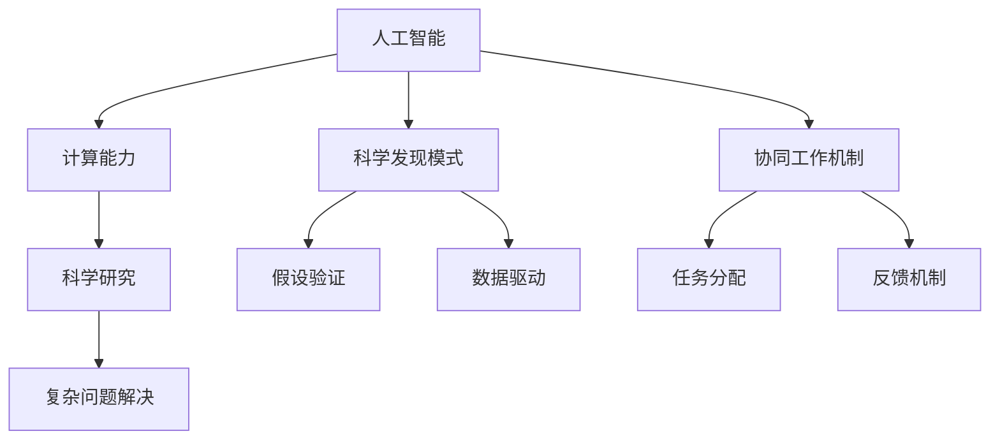

                 

# 人类计算：科学研究的新范式

## 1. 背景介绍

### 1.1 问题由来

近年来，人工智能技术迅猛发展，其在科学研究中的应用日益广泛，成为推动科学进步的新引擎。特别是在复杂系统模拟、药物设计、材料科学等领域，人工智能已经展现出巨大的潜力和应用价值。然而，当前人工智能仍然存在一些局限性，如难以应对未知领域的复杂性、缺乏逻辑推理能力等。因此，将人工智能与人类计算结合起来，充分利用人类智能与机器智能的各自优势，成为推动科学发展的全新范式。

### 1.2 问题核心关键点

“人类计算”旨在通过将人工智能与人类智能结合，实现对复杂科学问题的解决。其核心关键点包括：
- 人工智能的自动化、泛化能力
- 人类专家对问题的深度理解
- 计算能力的提升
- 科学发现的新模式
- 人工智能与人类的协同工作机制

这些关键点构成了“人类计算”这一新范式的基础，使得其在科学研究中具有广泛的适用性和潜力。

### 1.3 问题研究意义

通过“人类计算”方法，不仅可以加速科学研究的进程，提升研究效率，还可以促进跨学科知识的融合，推动科学前沿的突破。同时，这种新的研究范式也为人工智能技术的发展提供了新的方向，推动其在更多领域的应用。

## 2. 核心概念与联系

### 2.1 核心概念概述

为更好地理解“人类计算”这一新范式，本节将介绍几个密切相关的核心概念：

- 人工智能(AI)：一种模拟人类智能行为的技术，包括机器学习、自然语言处理、计算机视觉等子领域。
- 人类计算(Human Computing)：将人工智能与人类专家知识结合，共同解决复杂问题的研究范式。
- 计算能力：指通过算法和计算资源完成特定任务的能力，包括CPU、GPU、TPU等硬件资源，以及自动化的算法和模型。
- 科学发现模式：指从观察、实验到理论总结的科学研究过程，包括假设验证、数据驱动等方法。
- 协同工作机制：指人工智能与人类在任务中协同合作的模式，包括任务分配、反馈机制等。

这些核心概念之间的逻辑关系可以通过以下Mermaid流程图来展示：



这个流程图展示了一些核心概念的逻辑关系：

1. 人工智能与计算能力的结合，提供了强大的科学研究工具。
2. 科学发现模式通过假设验证和数据驱动等方法，推动新知识的产生。
3. 协同工作机制确保人工智能与人类专家在任务中高效协作。
4. 这些元素共同构成了“人类计算”这一新范式，解决复杂的科学研究问题。

## 3. 核心算法原理 & 具体操作步骤

### 3.1 算法原理概述

“人类计算”的核心算法原理主要包括以下几个方面：

- 数据采集与标注：收集相关领域的数据，并标注出有用的信息，供人工智能模型训练和分析。
- 模型训练与优化：使用深度学习、强化学习等算法，训练出适用于特定问题的模型，并通过调整参数和算法，优化模型性能。
- 数据处理与特征提取：通过特征提取技术，将原始数据转换为模型可以处理的特征向量，以提高模型效果。
- 结果验证与反馈：通过实验验证模型结果的准确性，并结合专家反馈，不断调整和优化模型。
- 任务分配与协同：将复杂任务拆分成多个子任务，分配给不同的人工智能模块和人类专家，实现协同工作。

### 3.2 算法步骤详解

“人类计算”的具体操作步骤主要包括以下几个关键步骤：

**Step 1: 数据准备**
- 收集领域内相关的数据，并标注出有用的信息。
- 确保数据的多样性和完整性，以涵盖问题的各个方面。
- 对数据进行预处理，包括去噪、标准化、归一化等操作。

**Step 2: 模型选择与训练**
- 选择合适的深度学习模型，如神经网络、卷积神经网络、循环神经网络等。
- 使用标注数据对模型进行训练，通过交叉验证等方法，调整模型参数和结构。
- 优化算法包括梯度下降、Adam、RMSprop等，以达到更好的训练效果。

**Step 3: 数据处理与特征提取**
- 使用特征提取技术，将原始数据转换为模型可以处理的特征向量。
- 常见特征提取技术包括PCA、LDA、Autoencoder等。
- 利用数据增强技术，扩充训练集，避免过拟合。

**Step 4: 结果验证与反馈**
- 通过实验验证模型的预测结果，并结合专家反馈进行调整。
- 使用混淆矩阵、ROC曲线等方法，评估模型性能。
- 结合专家意见，对模型进行优化，改进其准确性和鲁棒性。

**Step 5: 任务分配与协同**
- 将复杂任务拆分成多个子任务，分配给不同的人工智能模块和人类专家。
- 确定各子任务的优先级和依赖关系，确保任务协同高效。
- 通过协同工具，如Slack、Zoom等，实现团队沟通和协作。

以上是“人类计算”的一般流程，实际应用中还需根据具体问题进行调整和优化。

### 3.3 算法优缺点

“人类计算”方法具有以下优点：

1. 结合人类专家知识，提升模型对问题的理解深度。
2. 利用人工智能的自动化和泛化能力，加速科学研究的进程。
3. 涵盖多种数据来源，丰富模型的输入信息，提高模型效果。
4. 协同工作机制确保任务的全面性和有效性。

同时，该方法也存在一些局限性：

1. 对数据质量和标注的依赖较大。
2. 需要高水平的专家参与，增加研究成本。
3. 协同工作中的信息传递可能存在延迟和误解。
4. 模型的解释性和可解释性不足。
5. 模型的大规模训练和部署可能存在资源限制。

尽管存在这些局限性，但“人类计算”仍是一种值得探索和应用的新范式，具有广阔的发展前景。

### 3.4 算法应用领域

“人类计算”方法已经在多个领域得到了应用，例如：

- 生物信息学：使用人工智能分析基因序列和蛋白质结构，结合人类专家的生物学知识，加速药物研发和疾病诊断。
- 物理学：利用人工智能分析大型科学实验数据，结合物理学家的理论知识，推动物理理论的创新。
- 天文学：通过人工智能分析天文观测数据，结合天文学家的知识，发现新的天体和宇宙现象。
- 化学：利用人工智能分析化学反应数据，结合化学家的经验，优化化学反应路径和产物。
- 环境科学：结合人工智能的环境监测数据，人类专家的生态学知识，评估环境变化趋势。

## 4. 数学模型和公式 & 详细讲解 & 举例说明

### 4.1 数学模型构建

本节将使用数学语言对“人类计算”的研究范式进行更加严格的刻画。

记待解决的问题为 $P$，相关领域的数据集为 $D$，人工智能模型为 $M_{\theta}$，其中 $\theta$ 为模型参数。

定义 $M_{\theta}$ 在数据集 $D$ 上的损失函数为 $\ell(D, M_{\theta})$，通过最小化损失函数，训练出适用于问题 $P$ 的模型：

$$
\theta^* = \mathop{\arg\min}_{\theta} \ell(D, M_{\theta})
$$

在实际应用中，我们通常使用深度学习、强化学习等算法，训练出适用于特定问题的模型。

### 4.2 公式推导过程

以下我们以深度学习在生物信息学中的应用为例，推导其中的数学公式。

假设有一个基因序列 $S$，我们需要预测其对应的蛋白质结构 $T$。首先，将基因序列 $S$ 转换为向量 $S_v$，然后将其输入深度学习模型 $M_{\theta}$ 中，得到预测结果 $T_v$。接下来，通过比较 $T_v$ 和 $T$，计算预测误差：

$$
\ell(S, T; M_{\theta}) = \frac{1}{N} \sum_{i=1}^N \|T_v - T\|
$$

其中 $N$ 为训练样本数量，$\| \cdot \|$ 表示向量范数。

模型训练的目标是最小化预测误差，即：

$$
\theta^* = \mathop{\arg\min}_{\theta} \ell(S, T; M_{\theta})
$$

在训练过程中，我们使用梯度下降等优化算法，计算损失函数对模型参数 $\theta$ 的梯度，并使用更新公式：

$$
\theta \leftarrow \theta - \eta \nabla_{\theta}\ell(S, T; M_{\theta})
$$

其中 $\eta$ 为学习率，$\nabla_{\theta}\ell(S, T; M_{\theta})$ 为损失函数对 $\theta$ 的梯度。

### 4.3 案例分析与讲解

以药物设计为例，分析“人类计算”方法的具体应用。

**案例描述：**
在药物设计中，我们需要预测一个分子 $M$ 的生物活性。首先，使用人工智能模型 $M_{\theta}$ 对分子 $M$ 进行结构表征，得到特征向量 $M_v$。然后，结合人类专家的生物学知识，调整模型参数 $\theta$，得到预测结果 $A$，即分子 $M$ 的生物活性。最后，通过实验验证预测结果的准确性，并结合专家反馈，调整模型参数，提高预测精度。

**计算过程：**
1. 数据准备：收集已知分子 $M$ 的生物活性数据 $D$，并进行预处理和标注。
2. 模型选择：选择深度学习模型 $M_{\theta}$ 进行分子结构的表征和预测。
3. 特征提取：使用PCA等特征提取技术，将分子 $M$ 转换为特征向量 $M_v$。
4. 模型训练：使用标注数据 $D$ 对模型 $M_{\theta}$ 进行训练，调整参数 $\theta$，得到预测结果 $A$。
5. 结果验证：通过实验验证预测结果 $A$ 的准确性，并结合专家反馈进行调整。
6. 任务分配：将复杂任务拆分成多个子任务，分配给不同的人工智能模块和人类专家。
7. 协同工作：通过协同工具，如Slack、Zoom等，实现团队沟通和协作，提升工作效率。

通过这一过程，我们可以有效地将人工智能与人类专家知识结合起来，解决复杂的药物设计问题。

## 5. 项目实践：代码实例和详细解释说明

### 5.1 开发环境搭建

在进行“人类计算”实践前，我们需要准备好开发环境。以下是使用Python进行TensorFlow开发的环境配置流程：

1. 安装Anaconda：从官网下载并安装Anaconda，用于创建独立的Python环境。

2. 创建并激活虚拟环境：
```bash
conda create -n tensorflow-env python=3.8 
conda activate tensorflow-env
```

3. 安装TensorFlow：根据CUDA版本，从官网获取对应的安装命令。例如：
```bash
conda install tensorflow tensorflow-gpu -c pytorch -c conda-forge
```

4. 安装TensorFlow Addons：用于获取TensorFlow的额外功能模块。
```bash
pip install tensorflow-addons
```

5. 安装各类工具包：
```bash
pip install numpy pandas scikit-learn matplotlib tqdm jupyter notebook ipython
```

完成上述步骤后，即可在`tensorflow-env`环境中开始实践。

### 5.2 源代码详细实现

这里我们以生物信息学中的基因序列预测为例，给出使用TensorFlow进行深度学习的Python代码实现。

首先，定义数据处理函数：

```python
import tensorflow as tf
import numpy as np
import pandas as pd

def read_data(file_path):
    data = pd.read_csv(file_path)
    return data.iloc[:, 0].values, data.iloc[:, 1].values

def preprocess_data(x, y):
    x = (x - x.mean()) / x.std()  # 标准化处理
    y = (y - y.mean()) / y.std()  # 标准化处理
    return x, y
```

然后，定义模型和优化器：

```python
model = tf.keras.Sequential([
    tf.keras.layers.Dense(64, activation='relu'),
    tf.keras.layers.Dense(1)
])

optimizer = tf.keras.optimizers.Adam(learning_rate=0.001)
```

接着，定义训练和评估函数：

```python
def train_epoch(model, x_train, y_train, x_val, y_val, batch_size, epochs):
    model.compile(optimizer=optimizer, loss='mse')
    
    history = model.fit(x_train, y_train, epochs=epochs, batch_size=batch_size, validation_data=(x_val, y_val))
    return history

def evaluate_model(model, x_test, y_test, batch_size):
    loss = model.evaluate(x_test, y_test, batch_size=batch_size)
    return loss
```

最后，启动训练流程并在测试集上评估：

```python
file_path = 'data.csv'

x_train, y_train = read_data(file_path)
x_val, y_val = read_data(file_path)

x_train, y_train = preprocess_data(x_train, y_train)
x_val, y_val = preprocess_data(x_val, y_val)
x_test = read_data(file_path)[0]
y_test = read_data(file_path)[1]

epochs = 100
batch_size = 32

history = train_epoch(model, x_train, y_train, x_val, y_val, batch_size, epochs)

test_loss = evaluate_model(model, x_test, y_test, batch_size)

print('Test loss:', test_loss)
```

以上就是使用TensorFlow进行生物信息学中的基因序列预测的完整代码实现。可以看到，通过TensorFlow的高效封装，我们可以快速搭建深度学习模型并进行训练和评估。

### 5.3 代码解读与分析

让我们再详细解读一下关键代码的实现细节：

**read_data函数：**
- 从文件中读取基因序列和其对应的生物活性数据，返回作为模型输入的数据。

**preprocess_data函数：**
- 对数据进行标准化处理，即将数据转换为均值为0、标准差为1的分布，以便更好地进行模型训练。

**train_epoch函数：**
- 定义训练过程，包括模型编译、数据划分、训练循环等。
- 使用Adam优化器进行模型参数更新，损失函数为均方误差。

**evaluate_model函数：**
- 定义评估过程，包括模型评估和损失计算。

**训练流程：**
- 加载数据集，并进行预处理。
- 定义训练和评估参数，如学习率、批量大小、迭代轮数等。
- 调用训练函数进行模型训练，并使用测试集进行模型评估。
- 输出测试集的损失结果。

可以看到，TensorFlow提供了丰富的工具和库，可以方便地进行数据处理、模型搭建、训练和评估。开发者可以利用这些工具，快速实现复杂的深度学习模型，并应用于各种科学研究问题中。

## 6. 实际应用场景

### 6.1 智能药物研发

“人类计算”方法在智能药物研发中的应用，可以极大地加速新药的发现和开发进程。

传统药物研发需要经历长时间的筛选、测试和验证，成本高、周期长。而使用“人类计算”方法，可以将人工智能与人类专家的知识结合，加速药物筛选和设计过程。

具体而言，可以通过以下步骤：

1. 收集已有药物的分子结构、生物活性数据，并进行预处理。
2. 使用深度学习模型对分子结构进行表征，得到特征向量。
3. 结合人类专家的生物学知识，调整模型参数，得到预测结果。
4. 通过实验验证预测结果，并结合专家反馈进行调整。
5. 优化模型参数，提升预测精度。

通过这一过程，可以快速筛选出潜在的候选药物，加速药物研发进程。

### 6.2 基因编辑

基因编辑技术在现代生物医学中具有重要应用，可以用于治疗遗传疾病、改善农作物特性等。然而，基因编辑技术的应用需要高精度的设计和实施，且存在较高的失败率。

使用“人类计算”方法，可以结合人工智能与人类专家的知识，优化基因编辑的设计和实施。

具体而言，可以通过以下步骤：

1. 收集基因编辑的相关数据，并进行预处理。
2. 使用深度学习模型对基因序列进行表征，得到特征向量。
3. 结合人类专家的基因编辑知识，调整模型参数，得到预测结果。
4. 通过实验验证预测结果，并结合专家反馈进行调整。
5. 优化模型参数，提升预测精度。

通过这一过程，可以优化基因编辑的设计，提高其成功率和效果。

### 6.3 环境监测

“人类计算”方法在环境监测中的应用，可以实时监测环境变化，预测环境风险。

传统环境监测依赖人工观测和数据分析，效率低、准确性不足。而使用“人类计算”方法，可以将人工智能与人类专家的知识结合，提高监测的效率和准确性。

具体而言，可以通过以下步骤：

1. 收集环境监测数据，并进行预处理。
2. 使用深度学习模型对环境数据进行表征，得到特征向量。
3. 结合人类专家的环境知识，调整模型参数，得到预测结果。
4. 通过实验验证预测结果，并结合专家反馈进行调整。
5. 优化模型参数，提升预测精度。

通过这一过程，可以实时监测环境变化，预测环境风险，及时采取措施，保护生态环境。

### 6.4 未来应用展望

随着“人类计算”方法的不断发展，其在科学研究中的应用前景将更加广阔。未来，以下领域可能成为其新的应用场景：

1. 材料科学：利用“人类计算”方法，结合人工智能与材料科学家的知识，优化新材料的研发和设计。
2. 天文学：通过“人类计算”方法，结合人工智能与天文学家的知识，分析天文观测数据，发现新的天体和宇宙现象。
3. 经济学：利用“人类计算”方法，结合人工智能与经济学家的知识，分析经济数据，预测经济趋势。
4. 医学：通过“人类计算”方法，结合人工智能与医学专家的知识，优化诊断和治疗方案。
5. 交通运输：利用“人类计算”方法，结合人工智能与交通运输专家的知识，优化交通规划和调度。

总之，“人类计算”方法将人工智能与人类专家知识结合，利用各自优势，解决复杂的科学研究问题，推动科学研究的进步。

## 7. 工具和资源推荐

### 7.1 学习资源推荐

为了帮助开发者系统掌握“人类计算”的理论基础和实践技巧，这里推荐一些优质的学习资源：

1. 《深度学习》系列书籍：由多位深度学习专家撰写，深入浅出地介绍了深度学习的原理、算法和应用。
2. 《TensorFlow 2.0实战》：TensorFlow官方文档，提供了丰富的教程和样例，适合初学者入门。
3. 《人工智能导论》：全面介绍了人工智能的基本概念、算法和应用，适合对人工智能感兴趣的读者。
4. 《生物信息学原理》：介绍了生物信息学的基本原理和应用，适合生物信息学领域的开发者。
5. 《计算物理学》：介绍了计算物理学的基本原理和应用，适合物理学家和计算机科学家。

通过学习这些资源，相信你一定能够快速掌握“人类计算”的精髓，并用于解决实际的科学研究问题。

### 7.2 开发工具推荐

高效的开发离不开优秀的工具支持。以下是几款用于“人类计算”开发的常用工具：

1. TensorFlow：基于Python的开源深度学习框架，灵活动态的计算图，适合快速迭代研究。
2. PyTorch：基于Python的开源深度学习框架，灵活的动态图，适合深度学习研究。
3. TensorFlow Addons：TensorFlow的额外功能模块，提供更多的算法和工具，适合更复杂的模型训练和优化。
4. Jupyter Notebook：交互式的Python开发环境，方便代码调试和结果展示。
5. Visual Studio Code：轻量级代码编辑器，支持多种语言和工具插件，适合开发和学习。

合理利用这些工具，可以显著提升“人类计算”任务的开发效率，加快创新迭代的步伐。

### 7.3 相关论文推荐

“人类计算”技术的发展源于学界的持续研究。以下是几篇奠基性的相关论文，推荐阅读：

1. "The Use of Deep Neural Networks for Novel Drug Discovery"：介绍了深度学习在药物发现中的应用，展示了其潜力和效果。
2. "A Survey of Deep Learning Techniques for Biological Data Analysis"：全面综述了深度学习在生物信息学中的应用，提供了丰富的算法和模型。
3. "Combining Deep Learning and Human Expertise for Scientific Discovery"：介绍了深度学习与人专家知识的结合，展示了其优势和应用。
4. "Harnessing the Power of Machine Learning in Environmental Monitoring"：介绍了机器学习在环境监测中的应用，展示了其效果和前景。
5. "The Role of AI in Pharmaceutical Development"：介绍了人工智能在药物开发中的应用，展示了其潜力和效果。

这些论文代表了大规模人类计算技术的发展脉络。通过学习这些前沿成果，可以帮助研究者把握学科前进方向，激发更多的创新灵感。

## 8. 总结：未来发展趋势与挑战

### 8.1 总结

本文对“人类计算”这一新范式进行了全面系统的介绍。首先阐述了“人类计算”的研究背景和意义，明确了人工智能与人类知识结合的独特价值。其次，从原理到实践，详细讲解了“人类计算”的数学模型和操作步骤，给出了“人类计算”任务开发的完整代码实例。同时，本文还广泛探讨了“人类计算”方法在药物研发、基因编辑、环境监测等多个领域的应用前景，展示了其巨大的潜力。最后，本文精选了“人类计算”技术的各类学习资源，力求为读者提供全方位的技术指引。

通过本文的系统梳理，可以看到，“人类计算”这一新范式正在成为科学研究的重要工具，将人工智能与人类知识结合，加速科学研究的进程，推动科学前沿的突破。未来，伴随“人类计算”方法的不断演进，相信其将在更多领域得到应用，为科学研究的进步注入新的动力。

### 8.2 未来发展趋势

展望未来，“人类计算”方法将呈现以下几个发展趋势：

1. 数据驱动与专家指导相结合：将数据驱动与专家指导相结合，实现更全面、更准确的科学研究。
2. 多模态信息的融合：将多模态信息（如图像、视频、音频）与文本信息融合，提升模型的感知能力。
3. 自动化的协同工作：通过自动化协同工具，实现人工智能与人类专家在任务中的高效协作。
4. 跨学科知识的融合：将不同学科的知识结合，实现更全面、更深入的科学研究。
5. 可解释性与透明性：提高模型的可解释性和透明性，使研究过程更具可信性和可验证性。
6. 持续学习与知识更新：实现模型的持续学习和知识更新，保持其时效性和适应性。

这些趋势凸显了“人类计算”方法在科学研究中的广阔前景。这些方向的探索发展，必将进一步提升“人类计算”方法的效果和应用范围，为科学研究的进步提供新的工具和手段。

### 8.3 面临的挑战

尽管“人类计算”方法已经取得了瞩目成就，但在迈向更加智能化、普适化应用的过程中，仍面临诸多挑战：

1. 数据获取与标注的难度：高质量的数据和标注往往难以获取，限制了“人类计算”方法的应用范围。
2. 知识整合的复杂性：不同学科的知识结合需要跨学科的合作和理解，存在一定的复杂性和困难。
3. 协同工作的挑战：人工智能与人类专家的协同工作需要良好的沟通和协调，存在一定的技术和管理难度。
4. 可解释性与透明性：模型的可解释性和透明性不足，难以满足高风险应用的需求。
5. 资源限制：大规模计算和数据存储需要大量的硬件资源，存在一定的成本和技术瓶颈。
6. 伦理与安全问题：人工智能可能学习到有害信息，对模型进行道德约束和安全防护是一个重要问题。

正视“人类计算”面临的这些挑战，积极应对并寻求突破，将是大规模人类计算方法走向成熟的必由之路。

### 8.4 研究展望

面对“人类计算”面临的挑战，未来的研究需要在以下几个方面寻求新的突破：

1. 数据自动获取与标注：利用自动化工具和算法，自动获取和标注数据，降低“人类计算”方法的成本和技术难度。
2. 跨学科知识的自动融合：利用知识图谱等技术，实现跨学科知识的自动融合，提升模型的全面性和准确性。
3. 协同工作的优化：开发自动化的协同工具，提高人工智能与人类专家的沟通和协作效率。
4. 模型的可解释性与透明性：通过可解释性算法和技术，提升模型的可解释性和透明性，增强其可信性和可验证性。
5. 资源优化与性能提升：通过硬件优化和算法改进，提升“人类计算”方法的计算效率和资源利用率。
6. 伦理与安全约束：制定伦理规范和安全标准，确保“人类计算”方法的应用符合道德和法律要求。

这些研究方向的探索，必将引领“人类计算”方法迈向更高的台阶，为科学研究提供更全面、更高效、更安全的工具和手段。面向未来，“人类计算”方法需要与其他人工智能技术进行更深入的融合，共同推动科学研究的进步。

## 9. 附录：常见问题与解答

**Q1：“人类计算”方法是否适用于所有科学研究问题？**

A: “人类计算”方法在大多数科学研究问题中都能取得较好的效果，但不同的问题可能需要不同的数据和算法。对于某些特定领域的问题，可能需要结合领域专家的知识，才能取得最佳效果。

**Q2：如何选择合适的深度学习模型？**

A: 选择合适的深度学习模型需要考虑问题的特点和数据的质量。一般来说，选择较深的网络结构、合适的激活函数、正则化技术等，可以提高模型的准确性和泛化能力。

**Q3：“人类计算”方法在协同工作中的信息传递如何避免延迟和误解？**

A: 利用协同工具如Slack、Zoom等，实现实时沟通和协作，可以有效避免信息传递中的延迟和误解。同时，通过定期会议和反馈机制，及时解决协作中的问题。

**Q4：如何提升“人类计算”方法的鲁棒性？**

A: 通过引入对抗训练、数据增强等技术，提高模型的鲁棒性和泛化能力。同时，利用多模态信息融合等技术，提升模型的感知能力，提高其鲁棒性。

**Q5：如何优化“人类计算”方法的计算效率？**

A: 利用硬件优化（如GPU、TPU等）和算法改进（如混合精度训练、梯度累加等），提高计算效率和资源利用率。同时，利用分布式计算和模型并行等技术，提升计算性能。

这些问题的解答将帮助读者更好地理解“人类计算”方法的理论基础和实践技巧，为解决实际的科学研究问题提供参考和指导。

---

作者：禅与计算机程序设计艺术 / Zen and the Art of Computer Programming

