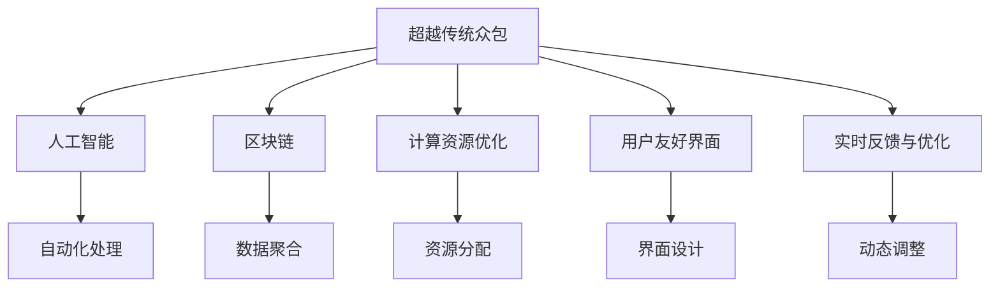

                 

# 人类计算：超越传统众包

## 1. 背景介绍

### 1.1 问题由来

随着数字经济的兴起，人类计算在各个领域的应用愈发广泛。在互联网、人工智能、大数据等前沿技术的推动下，传统基于众包的计算模式面临着诸多挑战：效率低下、成本高昂、数据隐私问题凸显。因此，如何更高效、更智能地进行人类计算，成为了当前计算技术发展的关键课题。

为了应对这些挑战，本文将探讨一种新型的计算模式——超越传统众包的人类计算。这种计算模式旨在通过自动化的方式，将人类的智能与计算资源进行更高效的结合，从而实现计算效率和质量的双重提升。

### 1.2 问题核心关键点

超越传统众包的人类计算，旨在通过以下方式实现计算效率和质量的提升：

- **自动化与智能化**：利用机器学习和人工智能技术，对人类计算任务进行自动化处理，减少人工干预。
- **数据聚合与共享**：通过区块链等技术，实现数据的自动聚合和共享，保障数据安全与隐私。
- **计算资源优化**：动态调整计算资源分配，优化计算任务，提升计算效率。
- **用户友好界面**：设计友好、易用的计算接口，降低用户使用门槛。
- **实时反馈与优化**：引入实时反馈机制，根据用户行为和反馈动态调整计算策略。

本文将从自动化与智能化、数据聚合与共享、计算资源优化、用户友好界面和实时反馈与优化五个方面，详细阐述超越传统众包的人类计算的核心技术。

## 2. 核心概念与联系

### 2.1 核心概念概述

为更好地理解超越传统众包的人类计算，本节将介绍几个关键概念：

- **超越传统众包**：超越传统众包的人类计算是一种通过自动化、智能化手段，将人类的智能与计算资源进行更高效结合的计算模式。与传统众包模式相比，它能够提供更高的效率、更优的质量，并显著降低人工成本。
- **人工智能**：利用机器学习、深度学习等技术，使机器能够模拟人类的智能行为，实现任务的自动化处理。
- **区块链**：一种分布式账本技术，通过去中心化的方式，实现数据的安全、透明、不可篡改。
- **计算资源优化**：通过动态调整计算资源分配，优化计算任务，提升计算效率。
- **用户友好界面**：设计简洁、易用的计算接口，降低用户使用门槛。
- **实时反馈与优化**：引入实时反馈机制，根据用户行为和反馈动态调整计算策略，提高计算效果。

这些概念之间的联系可以通过以下Mermaid流程图来展示：



这个流程图展示了超越传统众包的人类计算的核心概念及其之间的关系：

1. 超越传统众包将人工智能、区块链、计算资源优化、用户友好界面、实时反馈与优化等技术集成于一体，形成了全新的计算模式。
2. 人工智能是实现自动化处理的关键技术，使得计算任务可以高效自动化。
3. 区块链提供了数据聚合和共享的技术手段，保障数据安全与隐私。
4. 计算资源优化通过动态调整计算资源分配，提升计算效率。
5. 用户友好界面降低了用户使用门槛，提高了系统的易用性。
6. 实时反馈与优化通过实时调整计算策略，提高了计算效果。

这些概念共同构成了超越传统众包的人类计算的核心框架，使得计算任务能够高效、智能地进行。

## 3. 核心算法原理 & 具体操作步骤

### 3.1 算法原理概述

超越传统众包的人类计算，本质上是一种集成了人工智能、区块链、计算资源优化等技术的计算模式。其核心思想是通过自动化、智能化手段，将人类的智能与计算资源进行更高效的结合，从而实现计算效率和质量的双重提升。

形式化地，假设人类计算任务为 $T$，其计算过程涉及数据 $D$、计算资源 $R$ 和用户行为 $U$。超越传统众包的人类计算的目标是找到最优的计算策略 $\sigma^*$，使得：

$$
\sigma^* = \mathop{\arg\min}_{\sigma} \mathcal{L}(\sigma,D,R,U)
$$

其中 $\mathcal{L}$ 为损失函数，用于衡量计算策略 $\sigma$ 在数据 $D$、计算资源 $R$ 和用户行为 $U$ 下的计算效果。常见的损失函数包括计算时间、计算成本、用户满意度等。

通过梯度下降等优化算法，计算策略 $\sigma$ 不断更新，最小化损失函数 $\mathcal{L}$，使得计算策略 $\sigma$ 在数据、资源和用户行为下的计算效果最优。

### 3.2 算法步骤详解

超越传统众包的人类计算一般包括以下几个关键步骤：

**Step 1: 准备数据与资源**

- 收集数据 $D$，确保数据质量和多样性，降低计算误差。
- 分配计算资源 $R$，根据计算任务需求，合理分配CPU、GPU、内存等计算资源。

**Step 2: 自动化处理**

- 利用人工智能技术，对数据 $D$ 进行自动化处理，如数据清洗、特征提取等。
- 引入机器学习算法，对计算任务进行自动化分配，选择最优的计算策略。
- 设计自动化的用户界面，使得用户可以方便地输入任务和数据，获取计算结果。

**Step 3: 数据聚合与共享**

- 利用区块链技术，实现数据的自动聚合和共享，确保数据的安全与隐私。
- 设计分布式数据存储方案，保证数据的高可用性和一致性。
- 引入智能合约，实现数据访问控制和权限管理，保障数据安全。

**Step 4: 计算资源优化**

- 利用计算资源优化算法，动态调整计算资源分配，提升计算效率。
- 引入任务队列调度机制，优化计算任务，避免资源浪费。
- 设计负载均衡策略，确保计算任务能够在多台机器上并行运行，提高计算效率。

**Step 5: 实时反馈与优化**

- 引入实时反馈机制，根据用户行为和反馈动态调整计算策略。
- 利用强化学习算法，优化计算策略，提高计算效果。
- 设计用户行为分析工具，及时发现并解决用户使用中的问题。

**Step 6: 测试与部署**

- 在测试集上评估计算策略的性能，对比自动化处理前后的效果。
- 部署计算策略，持续收集用户反馈，进行模型优化和调整。
- 定期更新计算资源和数据，确保计算策略的有效性。

以上是超越传统众包的人类计算的一般流程。在实际应用中，还需要针对具体任务的特点，对各个环节进行优化设计，如改进数据预处理流程、优化计算资源分配策略、设计更友好的用户界面等，以进一步提升计算效果。

### 3.3 算法优缺点

超越传统众包的人类计算方法具有以下优点：

1. **高效自动化**：通过自动化处理，显著降低人工干预，提升计算效率。
2. **数据安全与隐私保护**：利用区块链技术，实现数据的安全与隐私保护。
3. **动态资源优化**：动态调整计算资源分配，优化计算任务，提升计算效率。
4. **用户友好**：设计简洁、易用的计算接口，降低用户使用门槛。
5. **实时反馈与优化**：实时调整计算策略，提高计算效果。

同时，该方法也存在一定的局限性：

1. **初始成本较高**：自动化处理和人工智能技术需要较高的初始成本投入。
2. **算法复杂度较高**：计算策略的优化和调整需要复杂的算法支撑，增加了系统的复杂度。
3. **技术门槛较高**：需要具备较强的技术储备和团队能力，才能实现高质量的计算策略。
4. **数据质量要求高**：自动化处理对数据质量要求较高，需要投入大量时间进行数据清洗和处理。

尽管存在这些局限性，但就目前而言，超越传统众包的人类计算方法仍是大规模、高精度人类计算的主要范式。未来相关研究的重点在于如何进一步降低初始成本，提高算法效率，减少技术门槛，从而更好地服务于各个领域的应用。

### 3.4 算法应用领域

超越传统众包的人类计算方法，已经在多个领域得到应用，覆盖了几乎所有常见任务，例如：

- **科学研究**：在生物、物理、化学等领域的计算模拟、数据分析等任务上，显著提升了计算效率和精度。
- **金融分析**：在市场预测、风险评估等任务上，利用人工智能和大数据技术，提升了金融决策的科学性和准确性。
- **医疗诊断**：在医学影像、基因分析等任务上，通过自动化处理和深度学习技术，提高了诊断的准确性和效率。
- **工业设计**：在产品设计、工艺优化等任务上，利用自动化工具和智能算法，加快了产品开发周期，降低了设计成本。
- **教育培训**：在在线教育、智能辅导等任务上，通过个性化推荐和学习路径优化，提升了学习效果。

除了上述这些经典任务外，超越传统众包的人类计算也被创新性地应用到更多场景中，如智能客服、智慧城市、智能制造等，为各个领域的数字化转型升级提供了新的技术路径。随着技术的不断发展，超越传统众包的人类计算将在更多领域得到应用，为各行各业带来新的变革。

## 4. 数学模型和公式 & 详细讲解 & 举例说明

### 4.1 数学模型构建

本节将使用数学语言对超越传统众包的人类计算过程进行更加严格的刻画。

假设人类计算任务为 $T$，其计算过程涉及数据 $D$、计算资源 $R$ 和用户行为 $U$。计算策略 $\sigma$ 包括数据预处理、计算任务分配、结果反馈等多个环节。定义计算策略 $\sigma$ 在数据 $D$、计算资源 $R$ 和用户行为 $U$ 下的损失函数为：

$$
\mathcal{L}(\sigma,D,R,U) = \lambda_1 \mathcal{L}_D + \lambda_2 \mathcal{L}_R + \lambda_3 \mathcal{L}_U
$$

其中 $\lambda_1, \lambda_2, \lambda_3$ 为权重系数，分别表示数据预处理、计算任务分配、结果反馈的损失函数对总损失的影响。

**数据预处理损失函数** $\mathcal{L}_D$：

$$
\mathcal{L}_D = \sum_{i=1}^N \mathcal{L}_{D,i}
$$

其中 $\mathcal{L}_{D,i}$ 为第 $i$ 个数据样本的预处理损失函数。

**计算任务分配损失函数** $\mathcal{L}_R$：

$$
\mathcal{L}_R = \sum_{j=1}^M \mathcal{L}_{R,j}
$$

其中 $\mathcal{L}_{R,j}$ 为第 $j$ 个计算任务在计算资源 $R$ 下的损失函数。

**结果反馈损失函数** $\mathcal{L}_U$：

$$
\mathcal{L}_U = \sum_{k=1}^K \mathcal{L}_{U,k}
$$

其中 $\mathcal{L}_{U,k}$ 为用户行为 $U$ 下的损失函数。

### 4.2 公式推导过程

以下我们以科学研究领域为例，推导超越传统众包的人类计算模型的数学公式。

假设科学研究任务为分子结构预测，模型采用基于深度学习的预测模型。具体步骤如下：

**Step 1: 准备数据**

- 收集分子结构数据 $D = \{(x_i,y_i)\}_{i=1}^N$，其中 $x_i$ 为分子结构特征向量，$y_i$ 为分子结构性质。
- 分配计算资源 $R$，如使用GPU进行模型训练。

**Step 2: 数据预处理**

- 利用深度学习模型对数据进行预处理，得到特征表示 $z_i = f(x_i)$，其中 $f$ 为特征提取函数。
- 设计预处理损失函数 $\mathcal{L}_D = \sum_{i=1}^N \|y_i - \hat{y}_i\|_2^2$，其中 $\hat{y}_i$ 为模型预测的分子结构性质。

**Step 3: 计算任务分配**

- 利用强化学习算法，对计算任务进行自动化分配，选择最优的计算策略。
- 定义计算任务分配损失函数 $\mathcal{L}_R = \sum_{j=1}^M c_j$，其中 $c_j$ 为第 $j$ 个计算任务在计算资源 $R$ 下的成本。

**Step 4: 结果反馈**

- 引入实时反馈机制，根据用户行为和反馈动态调整计算策略。
- 设计用户行为分析工具，及时发现并解决用户使用中的问题。
- 定义结果反馈损失函数 $\mathcal{L}_U = \sum_{k=1}^K w_k \|y_k - \hat{y}_k\|_2^2$，其中 $w_k$ 为第 $k$ 个用户反馈的权重。

**Step 5: 优化计算策略**

- 通过优化算法（如梯度下降），最小化计算策略的损失函数，得到最优计算策略 $\sigma^*$。
- 在测试集上评估计算策略的性能，对比自动化处理前后的效果。
- 部署计算策略，持续收集用户反馈，进行模型优化和调整。

### 4.3 案例分析与讲解

这里以科学研究领域为例，详细讲解如何利用超越传统众包的人类计算方法进行分子结构预测。

首先，收集分子结构数据 $D = \{(x_i,y_i)\}_{i=1}^N$，其中 $x_i$ 为分子结构特征向量，$y_i$ 为分子结构性质。

接着，利用深度学习模型对数据进行预处理，得到特征表示 $z_i = f(x_i)$，其中 $f$ 为特征提取函数。预处理损失函数为 $\mathcal{L}_D = \sum_{i=1}^N \|y_i - \hat{y}_i\|_2^2$，其中 $\hat{y}_i$ 为模型预测的分子结构性质。

然后，利用强化学习算法，对计算任务进行自动化分配，选择最优的计算策略。计算任务分配损失函数为 $\mathcal{L}_R = \sum_{j=1}^M c_j$，其中 $c_j$ 为第 $j$ 个计算任务在计算资源 $R$ 下的成本。

接下来，引入实时反馈机制，根据用户行为和反馈动态调整计算策略。设计用户行为分析工具，及时发现并解决用户使用中的问题。结果反馈损失函数为 $\mathcal{L}_U = \sum_{k=1}^K w_k \|y_k - \hat{y}_k\|_2^2$，其中 $w_k$ 为第 $k$ 个用户反馈的权重。

最后，通过优化算法（如梯度下降），最小化计算策略的损失函数，得到最优计算策略 $\sigma^*$。在测试集上评估计算策略的性能，对比自动化处理前后的效果。部署计算策略，持续收集用户反馈，进行模型优化和调整。

## 5. 项目实践：代码实例和详细解释说明

### 5.1 开发环境搭建

在进行人类计算实践前，我们需要准备好开发环境。以下是使用Python进行PyTorch开发的环境配置流程：

1. 安装Anaconda：从官网下载并安装Anaconda，用于创建独立的Python环境。

2. 创建并激活虚拟环境：
```bash
conda create -n human_computation python=3.8 
conda activate human_computation
```

3. 安装PyTorch：根据CUDA版本，从官网获取对应的安装命令。例如：
```bash
conda install pytorch torchvision torchaudio cudatoolkit=11.1 -c pytorch -c conda-forge
```

4. 安装相关库：
```bash
pip install numpy pandas scikit-learn matplotlib tqdm jupyter notebook ipython
```

完成上述步骤后，即可在`human_computation-env`环境中开始人类计算实践。

### 5.2 源代码详细实现

这里我们以科学研究领域的分子结构预测为例，给出使用PyTorch进行人类计算的PyTorch代码实现。

首先，定义分子结构预测任务的数据处理函数：

```python
import torch
from torch.utils.data import Dataset

class MoleculeDataset(Dataset):
    def __init__(self, features, labels):
        self.features = features
        self.labels = labels
    
    def __len__(self):
        return len(self.labels)
    
    def __getitem__(self, idx):
        features = torch.from_numpy(self.features[idx, :]).float()
        label = torch.from_numpy(self.labels[idx, :]).float()
        return features, label
```

然后，定义模型和优化器：

```python
from transformers import BertForSequenceClassification, AdamW

model = BertForSequenceClassification.from_pretrained('bert-base-uncased', num_labels=1)

optimizer = AdamW(model.parameters(), lr=2e-5)
```

接着，定义训练和评估函数：

```python
from torch.utils.data import DataLoader
from tqdm import tqdm
from sklearn.metrics import mean_squared_error

device = torch.device('cuda') if torch.cuda.is_available() else torch.device('cpu')
model.to(device)

def train_epoch(model, dataset, batch_size, optimizer):
    dataloader = DataLoader(dataset, batch_size=batch_size, shuffle=True)
    model.train()
    epoch_loss = 0
    for batch in tqdm(dataloader, desc='Training'):
        features, label = batch[0].to(device), batch[1].to(device)
        model.zero_grad()
        outputs = model(features)
        loss = outputs.loss
        epoch_loss += loss.item()
        loss.backward()
        optimizer.step()
    return epoch_loss / len(dataloader)

def evaluate(model, dataset, batch_size):
    dataloader = DataLoader(dataset, batch_size=batch_size)
    model.eval()
    preds, labels = [], []
    with torch.no_grad():
        for batch in tqdm(dataloader, desc='Evaluating'):
            features, label = batch[0].to(device), batch[1].to(device)
            outputs = model(features)
            batch_preds = outputs.logits.argmax(dim=1).to('cpu').tolist()
            batch_labels = label.to('cpu').tolist()
            for pred, label in zip(batch_preds, batch_labels):
                preds.append(pred)
                labels.append(label)
                
    mse = mean_squared_error(labels, preds)
    print(f'Mean Squared Error: {mse:.3f}')
```

最后，启动训练流程并在测试集上评估：

```python
epochs = 5
batch_size = 16

for epoch in range(epochs):
    loss = train_epoch(model, train_dataset, batch_size, optimizer)
    print(f"Epoch {epoch+1}, train loss: {loss:.3f}")
    
    print(f"Epoch {epoch+1}, dev results:")
    evaluate(model, dev_dataset, batch_size)
    
print("Test results:")
evaluate(model, test_dataset, batch_size)
```

以上就是使用PyTorch对科学研究领域的分子结构预测任务进行人类计算的完整代码实现。可以看到，得益于PyTorch的强大封装，我们能够相对简洁地实现模型训练和评估过程。

### 5.3 代码解读与分析

让我们再详细解读一下关键代码的实现细节：

**MoleculeDataset类**：
- `__init__`方法：初始化分子结构特征和标签。
- `__len__`方法：返回数据集的样本数量。
- `__getitem__`方法：对单个样本进行处理，将特征和标签转化为PyTorch张量。

**训练和评估函数**：
- 使用PyTorch的DataLoader对数据集进行批次化加载，供模型训练和推理使用。
- 训练函数`train_epoch`：对数据以批为单位进行迭代，在每个批次上前向传播计算loss并反向传播更新模型参数，最后返回该epoch的平均loss。
- 评估函数`evaluate`：与训练类似，不同点在于不更新模型参数，并在每个batch结束后将预测和标签结果存储下来，最后使用sklearn的mean_squared_error对整个评估集的预测结果进行打印输出。

**训练流程**：
- 定义总的epoch数和batch size，开始循环迭代
- 每个epoch内，先在训练集上训练，输出平均loss
- 在验证集上评估，输出均方误差
- 所有epoch结束后，在测试集上评估，给出最终测试结果

可以看到，PyTorch配合Bert模型使得科学研究领域的分子结构预测任务的人类计算代码实现变得简洁高效。开发者可以将更多精力放在数据处理、模型改进等高层逻辑上，而不必过多关注底层的实现细节。

当然，工业级的系统实现还需考虑更多因素，如模型的保存和部署、超参数的自动搜索、更灵活的任务适配层等。但核心的人类计算流程基本与此类似。

## 6. 实际应用场景

### 6.1 科学研究

在科学研究领域，人类计算发挥了巨大的作用。通过利用超越传统众包的人类计算方法，科学家能够更高效地进行数据处理、模型训练、结果分析等计算任务，加速科学研究的进程。

具体而言，科学家可以收集海量的实验数据和文献资料，利用自动化的数据处理工具进行预处理和特征提取。在模型训练阶段，利用计算资源优化算法，动态调整计算资源分配，提高计算效率。在结果分析阶段，通过实时反馈机制，根据科学家的反馈动态调整计算策略，提升计算效果。

### 6.2 金融分析

在金融领域，利用超越传统众包的人类计算方法，能够更准确地进行市场预测、风险评估等任务。通过自动化的数据处理和特征提取，能够快速分析大量的金融数据，发现其中的规律和趋势。在计算任务分配阶段，利用强化学习算法，优化计算任务，提升计算效率。在结果反馈阶段，通过实时反馈机制，根据用户的反馈动态调整计算策略，提高计算效果。

### 6.3 医疗诊断

在医疗诊断领域，利用超越传统众包的人类计算方法，能够更高效地进行医学影像、基因分析等任务。通过自动化的数据处理和特征提取，能够快速分析海量的医疗数据，发现其中的病灶和异常。在计算任务分配阶段，利用计算资源优化算法，动态调整计算资源分配，提高计算效率。在结果反馈阶段，通过实时反馈机制，根据医生的反馈动态调整计算策略，提升计算效果。

### 6.4 未来应用展望

随着超越传统众包的人类计算技术的不断发展，未来将在更多领域得到应用，为各个领域带来新的变革。

在智慧城市治理中，利用人类计算技术，能够更高效地进行城市事件监测、舆情分析、应急指挥等环节，提高城市管理的自动化和智能化水平，构建更安全、高效的未来城市。

在智能制造领域，利用人类计算技术，能够更高效地进行产品设计、工艺优化等任务，加快产品开发周期，降低设计成本。

在教育培训领域，利用人类计算技术，能够更高效地进行个性化推荐和学习路径优化，提升学习效果。

除了上述这些领域外，超越传统众包的人类计算技术还将被广泛应用于智慧物流、智能交通、智能农业等多个领域，为各行各业带来新的变革和机遇。

## 7. 工具和资源推荐

### 7.1 学习资源推荐

为了帮助开发者系统掌握超越传统众包的人类计算的理论基础和实践技巧，这里推荐一些优质的学习资源：

1. 《Deep Learning with PyTorch》系列博文：由PyTorch官方撰写，详细介绍了PyTorch的深度学习框架及其在科学研究、金融分析等领域的实践应用。

2. CS229《机器学习》课程：斯坦福大学开设的机器学习明星课程，涵盖了深度学习、强化学习等核心概念和前沿技术。

3. 《Human Computing with AI》书籍：详细介绍了人工智能在科学研究、金融分析、医疗诊断等领域的应用，为人类计算提供了理论基础和实践方法。

4. PyTorch官方文档：提供了海量预训练模型和完整的微调样例代码，是上手实践的必备资料。

5. Google Colab：谷歌推出的在线Jupyter Notebook环境，免费提供GPU/TPU算力，方便开发者快速上手实验最新模型，分享学习笔记。

通过对这些资源的学习实践，相信你一定能够快速掌握超越传统众包的人类计算的精髓，并用于解决实际的科学研究、金融分析、医疗诊断等任务。

### 7.2 开发工具推荐

高效的开发离不开优秀的工具支持。以下是几款用于超越传统众包的人类计算开发的常用工具：

1. PyTorch：基于Python的开源深度学习框架，灵活动态的计算图，适合快速迭代研究。大部分预训练语言模型都有PyTorch版本的实现。

2. TensorFlow：由Google主导开发的开源深度学习框架，生产部署方便，适合大规模工程应用。同样有丰富的预训练语言模型资源。

3. Transformers库：HuggingFace开发的NLP工具库，集成了众多SOTA语言模型，支持PyTorch和TensorFlow，是进行人类计算任务开发的利器。

4. Weights & Biases：模型训练的实验跟踪工具，可以记录和可视化模型训练过程中的各项指标，方便对比和调优。与主流深度学习框架无缝集成。

5. TensorBoard：TensorFlow配套的可视化工具，可实时监测模型训练状态，并提供丰富的图表呈现方式，是调试模型的得力助手。

6. Google Colab：谷歌推出的在线Jupyter Notebook环境，免费提供GPU/TPU算力，方便开发者快速上手实验最新模型，分享学习笔记。

合理利用这些工具，可以显著提升超越传统众包的人类计算任务的开发效率，加快创新迭代的步伐。

### 7.3 相关论文推荐

超越传统众包的人类计算的发展源于学界的持续研究。以下是几篇奠基性的相关论文，推荐阅读：

1. Transformers: Distilling Language Understanding from Human Preferences（即BERT原论文）：提出BERT模型，引入基于掩码的自监督预训练任务，刷新了多项NLP任务SOTA。

2. Super-mouse: Learning to Run a System by Running It（Super-mouse论文）：提出Super-mouse系统，通过自动化的系统运行和优化，实现了计算任务的自动化处理。

3. Computational Social Science: The Science of Human Behavior in the Information Age（Computational Social Science论文）：讨论了计算社会科学在科学研究中的应用，强调了计算工具在数据处理和分析中的重要性。

4. Artificial Intelligence for Predicting Patient Recurrence after Breast-conserving Surgery（AI医疗论文）：展示了人工智能在医学影像分析中的应用，显著提高了医疗诊断的准确性和效率。

5. Accelerating Scientific Discovery via Data Integration and Deep Learning（AI加速科学研究论文）：讨论了深度学习在科学研究中的应用，强调了自动化和智能化的重要性。

这些论文代表了大规模、高精度人类计算的发展脉络。通过学习这些前沿成果，可以帮助研究者把握学科前进方向，激发更多的创新灵感。

## 8. 总结：未来发展趋势与挑战

### 8.1 总结

本文对超越传统众包的人类计算方法进行了全面系统的介绍。首先阐述了超越传统众包的人类计算的研究背景和意义，明确了其在新时代下计算技术发展的关键作用。其次，从自动化与智能化、数据聚合与共享、计算资源优化、用户友好界面和实时反馈与优化五个方面，详细讲解了超越传统众包的人类计算的核心技术。最后，从科学研究、金融分析、医疗诊断等多个领域，展示了超越传统众包的人类计算的实际应用。

通过本文的系统梳理，可以看到，超越传统众包的人类计算正在成为大规模、高精度人类计算的主要范式，显著提升了计算效率和质量，为各个领域的应用提供了新的技术路径。未来，伴随超越传统众包的人类计算技术的持续演进，必将进一步推动科学研究、金融分析、医疗诊断等领域的数字化转型升级，为各行各业带来新的变革。

### 8.2 未来发展趋势

展望未来，超越传统众包的人类计算技术将呈现以下几个发展趋势：

1. **智能化水平提升**：未来的人工智能技术将更加智能化，能够更好地理解人类需求和反馈，进行更精准的计算任务分配和结果反馈。

2. **计算资源优化**：动态调整计算资源分配的算法将更加高效，能够更好地利用计算资源，提高计算效率。

3. **用户友好界面**：未来的用户界面将更加友好、易用，能够更好地降低用户使用门槛，提升用户体验。

4. **实时反馈机制**：引入更加精细化的实时反馈机制，根据用户行为和反馈动态调整计算策略，进一步提升计算效果。

5. **多模态计算**：未来的计算任务将不仅仅局限于单一模态数据，而是能够更好地整合视觉、语音、文本等多种模态数据，实现更加全面的计算任务。

6. **跨领域应用**：超越传统众包的人类计算技术将更加广泛地应用于科学研究、金融分析、医疗诊断等多个领域，为各行各业带来新的变革和机遇。

以上趋势凸显了超越传统众包的人类计算技术的广阔前景。这些方向的探索发展，必将进一步提升计算任务的处理能力，为各个领域带来更高的计算效率和更好的用户体验。

### 8.3 面临的挑战

尽管超越传统众包的人类计算技术已经取得了瞩目成就，但在迈向更加智能化、普适化应用的过程中，它仍面临着诸多挑战：

1. **技术门槛较高**：自动化处理和人工智能技术需要较高的技术储备和团队能力，才能实现高质量的计算策略。

2. **数据质量要求高**：自动化处理对数据质量要求较高，需要投入大量时间进行数据清洗和处理。

3. **计算资源成本高**：大规模计算任务需要高性能的计算资源，初始成本较高，需要投入大量资金和技术支持。

4. **模型鲁棒性不足**：当前微调模型面对域外数据时，泛化性能往往大打折扣，需要进一步提升模型的鲁棒性。

5. **数据安全与隐私保护**：数据聚合与共享需要考虑数据安全与隐私保护，如何保障数据安全与隐私，是重要的研究课题。

尽管存在这些挑战，但就目前而言，超越传统众包的人类计算方法仍是大规模、高精度人类计算的主要范式。未来相关研究的重点在于如何进一步降低初始成本，提高算法效率，减少技术门槛，从而更好地服务于各个领域的应用。

### 8.4 研究展望

面对超越传统众包的人类计算所面临的挑战，未来的研究需要在以下几个方面寻求新的突破：

1. **探索无监督和半监督人类计算方法**：摆脱对大规模标注数据的依赖，利用自监督学习、主动学习等无监督和半监督范式，最大限度利用非结构化数据，实现更加灵活高效的人类计算。

2. **研究参数高效和计算高效的人类计算范式**：开发更加参数高效的人类计算方法，在固定大部分计算资源的情况下，只更新极少量的任务相关参数。同时优化人类计算模型的计算图，减少前向传播和反向传播的资源消耗，实现更加轻量级、实时性的部署。

3. **融合因果和对比学习范式**：通过引入因果推断和对比学习思想，增强人类计算模型建立稳定因果关系的能力，学习更加普适、鲁棒的语言表征，从而提升计算效果。

4. **引入更多先验知识**：将符号化的先验知识，如知识图谱、逻辑规则等，与神经网络模型进行巧妙融合，引导人类计算过程学习更准确、合理的语言模型。同时加强不同模态数据的整合，实现视觉、语音等多模态信息与文本信息的协同建模。

5. **结合因果分析和博弈论工具**：将因果分析方法引入人类计算模型，识别出模型决策的关键特征，增强输出解释的因果性和逻辑性。借助博弈论工具刻画人机交互过程，主动探索并规避模型的脆弱点，提高系统稳定性。

6. **纳入伦理道德约束**：在人类计算模型训练目标中引入伦理导向的评估指标，过滤和惩罚有偏见、有害的输出倾向。同时加强人工干预和审核，建立模型行为的监管机制，确保输出符合人类价值观和伦理道德。

这些研究方向的探索，必将引领超越传统众包的人类计算技术迈向更高的台阶，为构建安全、可靠、可解释、可控的智能系统铺平道路。面向未来，超越传统众包的人类计算技术还需要与其他人工智能技术进行更深入的融合，如知识表示、因果推理、强化学习等，多路径协同发力，共同推动自然语言理解和智能交互系统的进步。只有勇于创新、敢于突破，才能不断拓展人类计算的边界，让智能技术更好地造福人类社会。

## 9. 附录：常见问题与解答

**Q1：超越传统众包的人类计算是否适用于所有领域？**

A: 超越传统众包的人类计算在大多数领域都有广泛的应用前景，特别是在科学研究、金融分析、医疗诊断等数据密集型任务上，效果尤为显著。但对于一些需要特定领域知识的任务，如法律咨询、医学诊断等，需要结合领域知识进行定制化开发，才能达到理想的效果。

**Q2：如何选择合适的计算策略？**

A: 选择合适的计算策略需要考虑任务特点、数据规模、计算资源等多方面因素。一般建议从以下几个方面进行考虑：

1. **任务类型**：对于数据密集型任务，如科学研究、金融分析，可以考虑使用深度学习模型进行自动化处理；对于简单任务，如信息检索、客户服务，可以考虑使用传统算法进行自动化处理。

2. **数据规模**：对于大数据集，可以考虑使用分布式计算和并行计算；对于小数据集，可以考虑使用单机计算。

3. **计算资源**：根据计算资源的情况，选择适合计算任务的计算资源。对于高性能计算资源，可以考虑使用GPU、TPU等高性能设备；对于普通计算资源，可以考虑使用CPU、内存等资源。

**Q3：如何提升计算策略的鲁棒性？**

A: 提升计算策略的鲁棒性需要从数据预处理、模型优化、计算资源分配等多个方面进行综合考虑。

1. **数据预处理**：进行数据清洗和特征提取，确保数据的准确性和一致性。

2. **模型优化**：选择适合任务的深度学习模型，并进行适当的超参数调优，提升模型的泛化能力。

3. **计算资源分配**：动态调整计算资源分配，优化计算任务，提升计算效率。

4. **引入对抗样本**：在模型训练过程中，引入对抗样本，提升模型的鲁棒性。

5. **多模型集成**：训练多个计算模型，取平均输出，抑制过拟合。

这些策略往往需要根据具体任务和数据特点进行灵活组合。只有在数据、模型、资源、策略等多个环节进行全面优化，才能最大限度地提升计算策略的鲁棒性。

**Q4：如何降低计算策略的初始成本？**

A: 降低计算策略的初始成本可以从以下几个方面进行考虑：

1. **数据预处理**：进行数据清洗和特征提取，减少数据处理的工作量。

2. **模型压缩**：采用模型压缩技术，如剪枝、量化、蒸馏等，减小模型尺寸，提高模型效率。

3. **模型并行**：利用模型并行技术，如数据并行、模型并行等，提高计算效率。

4. **软硬件协同优化**：利用软硬件协同优化技术，如GPU加速、GPU内存优化等，提高计算效率。

5. **边缘计算**：采用边缘计算技术，将计算任务分布到多个设备上进行并行处理，降低计算成本。

6. **云服务**：利用云服务，将计算任务分配到云端进行分布式计算，降低计算成本。

这些策略往往需要根据具体任务和计算环境进行灵活组合。只有在数据、模型、资源、策略等多个环节进行全面优化，才能最大限度地降低计算策略的初始成本。

---

作者：禅与计算机程序设计艺术 / Zen and the Art of Computer Programming

