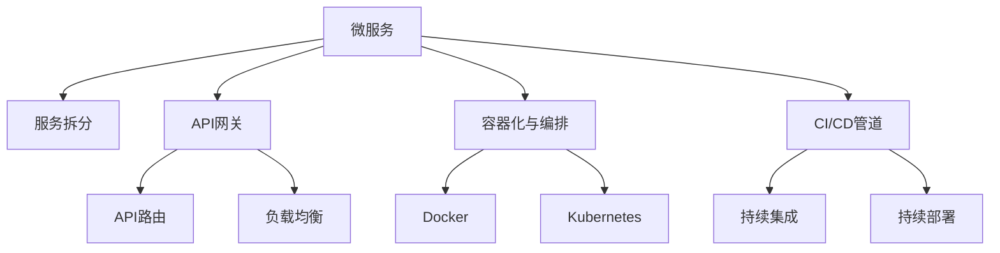

                 

# 从全栈开发到微服务架构师的晋升之路

## 1. 背景介绍

### 1.1 问题由来

随着互联网技术的发展，软件开发变得更加复杂和多变。传统单体架构的应用逐渐暴露出诸如代码膨胀、维护成本高、扩展性差等问题。为了应对这些挑战，微服务架构应运而生。微服务架构通过将应用程序拆分成一组独立、自包含的服务，使得开发者能够以更灵活、可维护的方式构建和部署应用。

### 1.2 问题核心关键点

微服务架构的关键点包括：

1. **服务拆分**：将应用程序拆分成多个小型服务，每个服务独立运行。
2. **自治服务**：每个服务拥有自己的数据库和通信机制，可以独立部署和更新。
3. **API治理**：通过RESTful API进行服务间的通信和数据交换，确保服务的自治性和独立性。
4. **自动化部署**：采用持续集成(CI)和持续部署(CD)工具，实现快速、频繁的代码发布。
5. **分布式事务管理**：处理跨服务的分布式事务，确保数据的完整性和一致性。

这些关键点共同构成了微服务架构的核心思想，使其在应对大规模、高复杂度应用时表现出色。

### 1.3 问题研究意义

掌握微服务架构的开发和部署技能，对于提高软件开发效率、降低维护成本、提升系统性能具有重要意义。微服务架构不仅能够使系统更具扩展性和灵活性，还能够使团队成员专注于业务功能开发，提高开发效率。同时，微服务架构的应用也标志着现代软件开发的成熟度提升，是云计算和DevOps文化的重要组成部分。

## 2. 核心概念与联系

### 2.1 核心概念概述

为了更好地理解微服务架构，本节将介绍几个密切相关的核心概念：

- **微服务(Microservice)**：将应用程序拆分为多个小型、自治的服务，每个服务围绕特定的业务功能进行构建和部署。
- **服务拆分(Service Decomposition)**：通过将单体应用程序拆分为多个独立的服务，使得各个服务可以独立运行和部署。
- **API网关(API Gateway)**：作为服务间的通信枢纽，通过API网关管理服务间的请求和响应。
- **容器化与编排(Docker, Kubernetes)**：采用Docker容器化和Kubernetes容器编排，实现服务的自动化部署和扩展。
- **CI/CD管道(Continuous Integration/Continuous Deployment)**：通过CI/CD管道实现自动化的构建、测试和部署，提高开发效率和系统稳定性。

这些核心概念之间的逻辑关系可以通过以下Mermaid流程图来展示：



这个流程图展示了微服务架构的主要组成部分及其相互关系：

1. 微服务是整个架构的核心，由多个独立的小服务组成。
2. 服务拆分是微服务的实现方式，将单体应用程序拆分为多个服务。
3. API网关负责服务间的通信和管理，确保服务自治。
4. 容器化与编排通过Docker和Kubernetes实现服务的自动化部署和扩展。
5. CI/CD管道实现自动化构建、测试和部署，提高开发效率和系统稳定性。

这些概念共同构成了微服务架构的基本框架，使其能够在复杂的业务环境中发挥其独特的优势。

## 3. 核心算法原理 & 具体操作步骤
### 3.1 算法原理概述

微服务架构的开发和部署主要遵循以下算法原理：

- **服务拆分算法**：通过领域驱动设计(Domain-Driven Design, DDD)等方法，将应用程序拆分为多个独立的服务。
- **API路由算法**：通过API网关将客户端请求路由到对应的服务实例，实现服务的自治。
- **负载均衡算法**：通过负载均衡器将请求分散到多个服务实例，确保系统的负载均衡和可用性。
- **分布式事务处理算法**：通过事务协调器(如TCC、Saga等)处理跨服务的分布式事务，确保数据的一致性和完整性。

### 3.2 算法步骤详解

微服务架构的开发和部署通常包括以下几个关键步骤：

**Step 1: 设计服务拆分**

- 采用领域驱动设计(DDD)等方法，将应用程序划分为多个独立的服务。
- 根据业务功能划分服务边界，确保每个服务有明确的业务目标和功能边界。

**Step 2: 设计API网关**

- 设计API网关，管理服务间的请求和响应。
- 配置路由规则和负载均衡策略，确保请求能够高效地分发和服务。

**Step 3: 实现服务自治**

- 为每个服务独立开发数据库和通信机制，确保服务自治。
- 采用Docker容器化技术，将服务打包为可移植、可部署的容器镜像。

**Step 4: 实现自动化部署**

- 搭建CI/CD管道，实现代码的自动化构建、测试和部署。
- 配置自动化测试、持续集成、持续部署等流程，提高开发效率和系统稳定性。

**Step 5: 实现分布式事务**

- 采用事务协调器处理跨服务的分布式事务，确保数据一致性和完整性。
- 配置事务回滚、超时控制、补偿机制等，提高系统的可靠性。

### 3.3 算法优缺点

微服务架构的优势包括：

1. **灵活性**：服务之间可以独立部署和更新，提高系统的灵活性和扩展性。
2. **自治性**：每个服务独立运行，降低维护成本，提高系统的稳定性和可靠性。
3. **技术多样性**：服务可以采用不同的技术栈，提高团队的技术多样性和创新能力。
4. **高可扩展性**：服务可以独立扩展，快速应对业务增长需求。

同时，微服务架构也存在以下局限性：

1. **复杂性**：服务间的依赖关系增加了系统复杂性，管理难度加大。
2. **通信开销**：服务间的通信开销增加，影响系统性能。
3. **分布式事务管理**：跨服务的分布式事务管理复杂，需要额外的协调和处理。

尽管存在这些局限性，微服务架构仍在大规模、高复杂度应用中得到广泛应用，成为现代软件开发的重要范式。

### 3.4 算法应用领域

微服务架构在多个领域得到了广泛应用，包括但不限于：

- **电子商务**：电商平台采用微服务架构，实现商品、订单、支付等服务的独立部署和扩展。
- **金融服务**：金融机构采用微服务架构，实现账户管理、交易处理、风险控制等服务的自治和独立。
- **社交媒体**：社交媒体平台采用微服务架构，实现用户管理、内容发布、消息推送等服务的灵活扩展。
- **医疗健康**：医疗健康平台采用微服务架构，实现患者管理、诊疗记录、药品管理等服务的自治和独立。
- **智能制造**：智能制造系统采用微服务架构，实现设备管理、生产调度、质量控制等服务的独立部署和扩展。

微服务架构的应用领域非常广泛，几乎覆盖了所有需要高可扩展性、高可用性、高灵活性的业务场景。

## 4. 数学模型和公式 & 详细讲解 & 举例说明
### 4.1 数学模型构建

微服务架构的数学模型主要包括以下几个组成部分：

- **服务拆分模型**：描述服务之间的依赖关系和拆分边界。
- **API路由模型**：描述API网关如何路由请求和响应。
- **负载均衡模型**：描述负载均衡器如何分配请求到不同的服务实例。
- **分布式事务模型**：描述跨服务的分布式事务如何协调和处理。

### 4.2 公式推导过程

以下是微服务架构的数学模型及其公式推导过程：

- **服务拆分模型**：
  $$
  S = \{S_1, S_2, ..., S_n\}
  $$
  其中，$S_i$ 表示第 $i$ 个服务。

- **API路由模型**：
  $$
  R(i,j) = \begin{cases}
  i & \text{if request target $i$} \\
  j & \text{if request target $j$}
  \end{cases}
  $$
  其中，$R(i,j)$ 表示请求目标为 $i$ 或 $j$ 时，API网关的路由结果。

- **负载均衡模型**：
  $$
  L(n) = \begin{cases}
  L_1 & \text{if $n = 1$} \\
  L_n & \text{if $n = 2$} \\
  L_{n-1} & \text{if $n > 2$}
  \end{cases}
  $$
  其中，$L_i$ 表示第 $i$ 个负载均衡器的负载分配结果。

- **分布式事务模型**：
  $$
  T(S_i, S_j) = \begin{cases}
  T_1 & \text{if $S_i$ and $S_j$ in the same transaction} \\
  T_2 & \text{if $S_i$ and $S_j$ in different transactions}
  \end{cases}
  $$
  其中，$T_1$ 和 $T_2$ 分别表示事务协调器在事务内部和事务之间处理事务的方式。

### 4.3 案例分析与讲解

下面以一个电商平台的微服务架构为例，分析其服务拆分、API路由、负载均衡和分布式事务的处理方式：

**服务拆分**：电商平台将订单管理、商品管理、支付处理、物流管理等业务拆分为多个独立的服务，每个服务独立运行和管理。

**API路由**：通过API网关将客户端请求路由到对应的服务实例。例如，客户端请求订单信息时，API网关将请求路由到订单管理服务。

**负载均衡**：采用负载均衡器将请求分散到多个服务实例，确保系统的负载均衡和可用性。例如，订单管理服务部署多个实例，负载均衡器将请求均匀分配到每个实例。

**分布式事务**：采用TCC事务协调器处理跨服务的分布式事务。例如，用户下单时，订单管理和支付处理服务需要协同处理，TCC事务协调器确保事务的一致性和完整性。

## 5. 项目实践：代码实例和详细解释说明
### 5.1 开发环境搭建

在进行微服务架构开发前，我们需要准备好开发环境。以下是使用Java和Spring Boot进行微服务架构开发的开发环境配置流程：

1. 安装Java Development Kit(JDK)。从官网下载并安装JDK，确保JDK版本与Spring Boot兼容。
2. 安装Maven。从官网下载并安装Maven，用于依赖管理。
3. 创建Spring Boot项目。使用Spring Initializr网站，根据需求创建Maven项目。
4. 配置Spring Boot应用。编写Spring Boot应用，并配置Spring Boot启动器、依赖管理等配置。

### 5.2 源代码详细实现

我们以一个电商平台的微服务架构为例，展示如何通过Spring Boot实现微服务架构的开发和部署。

**订单管理服务(Order Service)**：

```java
@RestController
@RequestMapping("/orders")
public class OrderController {
    
    @Autowired
    private OrderService orderService;
    
    @GetMapping("/{id}")
    public ResponseEntity<Order> getOrder(@PathVariable Long id) {
        return ResponseEntity.ok(orderService.findById(id));
    }
    
    @PostMapping
    public ResponseEntity<String> placeOrder(@RequestBody Order order) {
        orderService.placeOrder(order);
        return ResponseEntity.ok("Order placed successfully.");
    }
}
```

**商品管理服务(Product Service)**：

```java
@RestController
@RequestMapping("/products")
public class ProductController {
    
    @Autowired
    private ProductService productService;
    
    @GetMapping("/{id}")
    public ResponseEntity<Product> getProduct(@PathVariable Long id) {
        return ResponseEntity.ok(productService.findById(id));
    }
    
    @PostMapping
    public ResponseEntity<String> addProduct(@RequestBody Product product) {
        productService.addProduct(product);
        return ResponseEntity.ok("Product added successfully.");
    }
}
```

**支付处理服务(Payment Service)**：

```java
@RestController
@RequestMapping("/payments")
public class PaymentController {
    
    @Autowired
    private PaymentService paymentService;
    
    @PostMapping
    public ResponseEntity<String> processPayment(@RequestBody Payment payment) {
        paymentService.processPayment(payment);
        return ResponseEntity.ok("Payment processed successfully.");
    }
}
```

**负载均衡与API网关**：

```java
@RestController
@RequestMapping("/gateway")
public class GatewayController {
    
    @Autowired
    private OrderService orderService;
    @Autowired
    private ProductService productService;
    @Autowired
    private PaymentService paymentService;
    
    @GetMapping("/orders/{id}")
    public ResponseEntity<Order> getOrder(@PathVariable Long id) {
        return ResponseEntity.ok(orderService.findById(id));
    }
    
    @GetMapping("/products/{id}")
    public ResponseEntity<Product> getProduct(@PathVariable Long id) {
        return ResponseEntity.ok(productService.findById(id));
    }
    
    @PostMapping("/payment")
    public ResponseEntity<String> processPayment(@RequestBody Payment payment) {
        paymentService.processPayment(payment);
        return ResponseEntity.ok("Payment processed successfully.");
    }
}
```

**微服务配置**：

```yaml
spring:
  application:
    name: order-service
  datasource:
    url: jdbc:mysql://localhost:3306/order_service
    username: root
    password: root
  web:
    client-connection-timeout: 20000
    server:
      port: 8080
```

**Kubernetes配置**：

```yaml
apiVersion: v1
kind: Deployment
metadata:
  name: order-service
spec:
  replicas: 3
  selector:
    matchLabels:
      app: order-service
  template:
    metadata:
      labels:
        app: order-service
    spec:
      containers:
      - name: order-service
        image: order-service:latest
        ports:
        - containerPort: 8080
        readinessProbe:
          httpGet:
            path: /health
            port: 8080
          initialDelaySeconds: 5
          periodSeconds: 5
```

**CI/CD配置**：

- 配置Jenkins CI/CD管道，实现自动化的构建、测试和部署。
- 配置GitLab CI/CD管道，实现自动化的代码审查和持续集成。

### 5.3 代码解读与分析

让我们再详细解读一下关键代码的实现细节：

**订单管理服务(Order Service)**：

- 使用Spring Boot的@RestController注解，定义了处理订单相关的请求路径和方法。
- 使用@Autowired注解注入OrderService服务，实现业务逻辑处理。
- 使用@GetMapping和@PostMapping注解，定义了订单信息查询和下单的接口。

**商品管理服务(Product Service)**：

- 使用Spring Boot的@RestController注解，定义了处理商品相关的请求路径和方法。
- 使用@Autowired注解注入ProductService服务，实现业务逻辑处理。
- 使用@GetMapping和@PostMapping注解，定义了商品信息查询和添加的商品接口。

**支付处理服务(Payment Service)**：

- 使用Spring Boot的@RestController注解，定义了处理支付相关的请求路径和方法。
- 使用@Autowired注解注入PaymentService服务，实现业务逻辑处理。
- 使用@PostMapping注解，定义了支付处理的接口。

**负载均衡与API网关**：

- 使用Spring Boot的@RestController注解，定义了处理订单、商品和支付相关的请求路径和方法。
- 使用@Autowired注解注入各个服务的接口，实现API路由。
- 使用@GetMapping和@PostMapping注解，定义了API网关的接口。

**微服务配置**：

- 使用Spring Boot的application.yaml配置文件，定义了数据库连接信息、服务端口等配置。
- 使用Kubernetes的Deployment配置文件，定义了服务的部署信息和资源配置。

**CI/CD配置**：

- 使用Jenkins和GitLab等工具，配置CI/CD管道，实现自动化的构建、测试和部署。
- 通过GitLab CI/CD管道，实现代码审查和持续集成。

以上代码展示了微服务架构的实现过程，通过Spring Boot和Kubernetes等工具，实现了订单管理、商品管理和支付处理等服务的独立部署和扩展。同时，通过CI/CD管道，实现了自动化的构建、测试和部署。

## 6. 实际应用场景
### 6.1 电子商务

电子商务平台采用微服务架构，将订单管理、商品管理、支付处理、物流管理等业务拆分为多个独立的服务，每个服务独立运行和管理。通过API网关实现服务间的通信和路由，确保系统的自治性和高可用性。采用Docker容器化和Kubernetes容器编排，实现服务的自动化部署和扩展。通过CI/CD管道，实现自动化的构建、测试和部署，提高开发效率和系统稳定性。

### 6.2 金融服务

金融机构采用微服务架构，实现账户管理、交易处理、风险控制等服务的自治和独立。通过API网关管理服务间的请求和响应，确保服务自治。采用分布式事务协调器处理跨服务的分布式事务，确保数据的一致性和完整性。通过负载均衡器分配请求到不同的服务实例，确保系统的负载均衡和可用性。

### 6.3 社交媒体

社交媒体平台采用微服务架构，实现用户管理、内容发布、消息推送等服务的灵活扩展。通过API网关实现服务间的通信和路由，确保系统的自治性和高可用性。采用Docker容器化和Kubernetes容器编排，实现服务的自动化部署和扩展。通过CI/CD管道，实现自动化的构建、测试和部署，提高开发效率和系统稳定性。

### 6.4 医疗健康

医疗健康平台采用微服务架构，实现患者管理、诊疗记录、药品管理等服务的自治和独立。通过API网关管理服务间的请求和响应，确保服务自治。采用分布式事务协调器处理跨服务的分布式事务，确保数据的一致性和完整性。通过负载均衡器分配请求到不同的服务实例，确保系统的负载均衡和可用性。

### 6.5 智能制造

智能制造系统采用微服务架构，实现设备管理、生产调度、质量控制等服务的独立部署和扩展。通过API网关实现服务间的通信和路由，确保系统的自治性和高可用性。采用Docker容器化和Kubernetes容器编排，实现服务的自动化部署和扩展。通过CI/CD管道，实现自动化的构建、测试和部署，提高开发效率和系统稳定性。

## 7. 工具和资源推荐
### 7.1 学习资源推荐

为了帮助开发者系统掌握微服务架构的理论基础和实践技巧，这里推荐一些优质的学习资源：

1. **《微服务架构：构建分布式系统》**：Pete McDeermott等著，全面介绍了微服务架构的设计和实现。
2. **《Spring Boot实战》**：Claude Nabimbanjara等著，介绍了Spring Boot框架的使用和微服务架构的开发。
3. **《Kubernetes：深度指南》**：Gina Traverso O'Regan等著，介绍了Kubernetes容器编排的实践和最佳实践。
4. **《CI/CD：持续集成与持续部署》**：Sandra Franks等著，介绍了CI/CD管道的实现和最佳实践。

通过对这些资源的学习实践，相信你一定能够快速掌握微服务架构的精髓，并用于解决实际的业务问题。

### 7.2 开发工具推荐

高效的开发离不开优秀的工具支持。以下是几款用于微服务架构开发的常用工具：

1. **Spring Boot**：基于Spring框架的快速开发框架，支持微服务的开发和管理。
2. **Docker**：开源容器化平台，支持微服务的部署和扩展。
3. **Kubernetes**：开源容器编排工具，支持微服务的自动化部署和扩展。
4. **Jenkins**：开源CI/CD管道工具，支持微服务的自动化构建和部署。
5. **GitLab CI/CD**：GitLab提供的服务，支持微服务的自动化代码审查和持续集成。

合理利用这些工具，可以显著提升微服务架构的开发效率，加快创新迭代的步伐。

### 7.3 相关论文推荐

微服务架构的发展源于学界的持续研究。以下是几篇奠基性的相关论文，推荐阅读：

1. **《分布式系统设计原则》**：Roy F. Rubin等著，介绍了微服务架构的设计原则和实践经验。
2. **《从单体到微服务：架构演进之路》**：Matt Grunt等著，介绍了微服务架构的演进过程和挑战。
3. **《微服务的演化与优化》**：Adrian Abramson等著，介绍了微服务架构的演化和优化技术。
4. **《微服务架构的实战经验》**：Christian Petersen等著，介绍了微服务架构的实战经验和最佳实践。

这些论文代表了大规模微服务架构的发展脉络，通过学习这些前沿成果，可以帮助研究者把握学科前进方向，激发更多的创新灵感。

## 8. 总结：未来发展趋势与挑战
### 8.1 研究成果总结

本文对微服务架构的开发和部署方法进行了全面系统的介绍。首先阐述了微服务架构的背景和意义，明确了微服务架构在应对大规模、高复杂度应用中的独特价值。其次，从原理到实践，详细讲解了微服务架构的数学模型和关键步骤，给出了微服务架构的完整代码实例。同时，本文还广泛探讨了微服务架构在多个领域的应用前景，展示了微服务架构的广阔应用空间。

通过本文的系统梳理，可以看到，微服务架构正在成为现代软件开发的重要范式，极大地提高了软件开发效率和系统性能。未来，伴随微服务架构的不断发展，必将进一步推动软件开发的智能化、自动化、灵活化进程，为各行各业带来更高效、更可靠、更灵活的软件解决方案。

### 8.2 未来发展趋势

展望未来，微服务架构的发展趋势包括：

1. **容器化和云原生**：微服务架构将继续与容器化、云原生等技术结合，实现更高效的部署和管理。
2. **自动化与智能化**：通过自动化工具和AI技术，提高微服务架构的开发效率和系统性能。
3. **安全与隐私**：微服务架构需要进一步加强安全性和隐私保护，确保系统的安全稳定。
4. **可观察性和监控**：通过监控和日志分析工具，提升系统的可观察性和性能调优能力。
5. **弹性与自愈**：微服务架构需要具备更强的弹性与自愈能力，确保系统在面对异常时能够快速恢复。

以上趋势凸显了微服务架构的广阔前景。这些方向的探索发展，必将进一步提升微服务架构的技术水平和应用效果，为各行各业带来更高效、更可靠、更灵活的软件解决方案。

### 8.3 面临的挑战

尽管微服务架构已经取得了显著成就，但在迈向更加智能化、普适化应用的过程中，它仍面临着诸多挑战：

1. **系统复杂性**：微服务架构的复杂性增加，管理难度加大。
2. **服务通信开销**：服务间的通信开销增加，影响系统性能。
3. **分布式事务管理**：跨服务的分布式事务管理复杂，需要额外的协调和处理。
4. **安全性与隐私**：微服务架构需要进一步加强安全性和隐私保护，确保系统的安全稳定。
5. **运维成本**：微服务架构的运维成本增加，需要专门的运维团队和工具。

尽管存在这些挑战，微服务架构仍在大规模、高复杂度应用中得到广泛应用，成为现代软件开发的重要范式。未来需要不断优化和完善微服务架构，提升其技术水平和应用效果。

### 8.4 研究展望

面对微服务架构面临的挑战，未来的研究需要在以下几个方面寻求新的突破：

1. **简化系统复杂性**：通过服务拆分、接口设计等方法，降低微服务架构的复杂性，提高系统可维护性。
2. **优化服务通信**：采用高效的通信协议和负载均衡策略，降低服务通信开销，提高系统性能。
3. **改进分布式事务管理**：采用先进的事务协调器，简化分布式事务的处理，提高系统的可靠性。
4. **加强安全与隐私保护**：通过加密、认证、权限控制等方法，加强微服务架构的安全性和隐私保护。
5. **降低运维成本**：采用自动化工具和DevOps文化，提高微服务架构的运维效率和稳定性。

这些研究方向的探索，必将引领微服务架构技术迈向更高的台阶，为构建更高效、更可靠、更灵活的微服务架构提供新的思路和方法。面向未来，微服务架构需要与其他技术进行更深入的融合，如容器化、云原生、自动化工具等，共同推动软件开发的智能化、自动化、灵活化进程。

## 9. 附录：常见问题与解答

**Q1：微服务架构与单体架构有什么区别？**

A: 微服务架构与单体架构的主要区别在于拆分方式和部署方式。微服务架构将应用程序拆分为多个独立的服务，每个服务独立运行和部署。单体架构则是整个应用程序作为一个整体进行部署和维护。微服务架构通过服务拆分和自治，提高了系统的灵活性和可扩展性，但同时也增加了系统的复杂性和维护难度。

**Q2：如何选择合适的服务拆分粒度？**

A: 服务拆分粒度的选择应考虑业务功能、数据依赖和系统复杂性等因素。通常，拆分粒度应该适中，既不能过细也不能过粗。过于细小的服务会增加系统复杂性，而过于粗大的服务则无法满足灵活性和扩展性的需求。一般建议将微服务按照业务功能、数据依赖和数据访问模式进行拆分。

**Q3：微服务架构的部署方式有哪些？**

A: 微服务架构的部署方式主要包括容器化、云原生和自动化部署等。容器化通过Docker等工具将服务打包为可移植、可部署的容器镜像，实现服务的自动化部署和扩展。云原生通过Kubernetes等工具，实现服务的自动化部署、扩缩容和运维管理。自动化部署通过CI/CD管道，实现自动化的构建、测试和部署，提高开发效率和系统稳定性。

**Q4：微服务架构如何实现负载均衡？**

A: 微服务架构的负载均衡通常采用负载均衡器实现。通过负载均衡器将请求分散到不同的服务实例，确保系统的负载均衡和可用性。常用的负载均衡器包括Nginx、HAProxy、Kubernetes等。

**Q5：微服务架构如何处理跨服务的分布式事务？**

A: 微服务架构的跨服务分布式事务处理通常采用TCC或Saga等事务协调器实现。通过事务协调器确保事务的一致性和完整性。TCC通过调用服务的本地事务处理，实现事务的协调和回滚；Saga通过全局事务管理器，实现复杂的事务处理。

这些问题的解答展示了微服务架构的实现细节，帮助读者更好地理解微服务架构的原理和应用。通过系统的学习实践，相信你一定能够掌握微服务架构的精髓，并用于解决实际的业务问题。

---

作者：禅与计算机程序设计艺术 / Zen and the Art of Computer Programming

