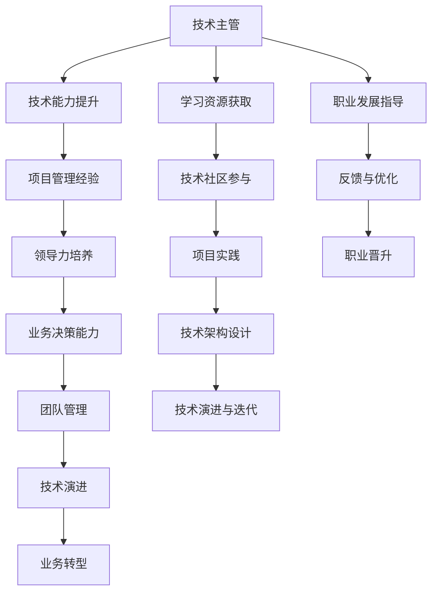

                 

# 从技术主管到CTO的职业发展策略

> 关键词：CTO, 职业发展策略, 技术主管, 领导力, 项目管理, 技术方向, 业务决策, 团队管理, 技术演进, 人才培养

## 1. 背景介绍

### 1.1 问题由来
在信息技术日新月异，行业竞争日益激烈的今天，技术主管（Technical Manager）在组织中的角色越来越重要。他们不仅需要具备强大的技术能力，更需要具备卓越的领导力和战略眼光，以引领团队攻克技术难关，推动业务增长。而从技术主管到CTO（Chief Technology Officer）的晋升，不仅代表着个人技术能力的巅峰，更意味着领导能力的全面跃升，以及承担更复杂的业务和技术决策。本文将从多个角度深入探讨这一职业发展路径，分析所需技能和策略，为技术主管提供有价值的指导和建议。

## 2. 核心概念与联系

### 2.1 核心概念概述
在探讨从技术主管到CTO的职业发展策略之前，首先需要明确几个核心概念：

- **CTO**：首席技术官，负责制定公司的技术战略，领导技术团队，推动技术创新，确保技术的有效应用和落地。
- **技术主管**：负责某个技术领域或产品的技术管理，确保产品按时交付，提升产品质量。
- **领导力**：包括团队管理、项目管理和战略决策等方面的能力，是CTO的核心素质之一。
- **项目管理**：通过计划、组织、指挥、协调、控制等手段，确保项目按时、按质、按预算完成。
- **技术方向**：对技术领域的发展趋势和未来方向的把握，CTO需要具备前瞻性的眼光。
- **业务决策**：将技术能力与业务需求相结合，做出符合公司战略的技术决策。
- **团队管理**：建立高效的技术团队，培养人才，激发团队潜力。

这些核心概念通过以下Mermaid流程图相连，展示了从技术主管到CTO的成长路径：



## 3. 核心算法原理 & 具体操作步骤

### 3.1 算法原理概述

从技术主管到CTO的晋升，是一个系统的成长过程，涉及技术、管理、战略等多个维度的提升。这一过程可以类比为机器学习中的监督学习，通过不断积累经验，学习反馈，优化提升，最终达到CTO的能力水平。

### 3.2 算法步骤详解

#### 3.2.1 技术能力提升
技术主管首先需要在自身技术领域内不断精进，保持在团队中的技术领先地位。这包括：
- **深度学习**：掌握最新的深度学习框架和算法，如TensorFlow、PyTorch等，并在实际项目中应用。
- **架构设计**：了解不同的系统架构模式，如微服务、Serverless等，能够设计高效、可扩展的系统架构。
- **代码实践**：定期参与项目开发，保持代码实践能力，掌握最新的编码规范和技术标准。

#### 3.2.2 项目管理经验
项目管理能力是CTO的核心技能之一。技术主管需要积累项目管理经验，这包括：
- **敏捷开发**：掌握Scrum、Kanban等敏捷开发方法，提高项目交付效率和质量。
- **质量管理**：了解测试方法和工具，如单元测试、自动化测试、CI/CD等，确保产品质量。
- **风险管理**：识别项目风险，制定风险应对策略，确保项目按时完成。

#### 3.2.3 领导力培养
领导力是CTO的关键素质之一。技术主管需要培养领导力，这包括：
- **团队管理**：建立高效的团队文化，激发团队潜力，培养和激励团队成员。
- **沟通协调**：与各部门沟通协作，确保技术方案能够顺利落地。
- **战略思考**：参与公司战略规划，确保技术战略与业务目标对齐。

#### 3.2.4 业务决策能力
CTO需要具备将技术能力与业务需求相结合的能力，这包括：
- **需求分析**：深入理解业务需求，确定技术解决方案。
- **性能评估**：评估技术方案的性能和成本，确保方案的可行性。
- **决策制定**：在技术和管理团队中协调，制定最佳技术方案。

#### 3.2.5 团队管理
CTO需要具备优秀的团队管理能力，这包括：
- **人才招聘**：寻找合适的人才，确保团队技术水平。
- **培训与发展**：制定人才发展规划，提高团队整体技术水平。
- **绩效评估**：定期评估团队绩效，提供反馈，优化团队表现。

### 3.3 算法优缺点

#### 3.3.1 优点
- **系统性**：通过不断积累经验，逐步提升技术、管理、战略等多方面的能力。
- **可操作性**：每个步骤具体且可执行，易于实现和跟踪。
- **综合性强**：覆盖技术主管到CTO所需的多方面技能，全面提升个人能力。

#### 3.3.2 缺点
- **时间成本**：需要较长的时间积累和实践经验，难以快速实现。
- **难度较大**：涉及多方面能力的提升，对个人要求较高。

### 3.4 算法应用领域

从技术主管到CTO的职业发展策略，不仅适用于技术公司，也适用于其他行业中的技术主管。无论是在互联网、金融、制造等领域，这一策略都具有广泛的适用性和价值。

## 4. 数学模型和公式 & 详细讲解 & 举例说明

### 4.1 数学模型构建

在技术主管到CTO的成长过程中，可以将其看作一个多阶段的学习过程，通过数学模型来量化这一过程。设每个阶段需要掌握的技能权重为 $w_i$，技术主管到CTO所需的技能集为 $\mathcal{S}$，则成长过程可以表示为：

$$
growth = \sum_{i} w_i \times exp(learning_{i})
$$

其中，$exp(learning_{i})$ 表示通过学习第 $i$ 项技能所获得的成长。

### 4.2 公式推导过程

为了更好地理解这一成长过程，我们进一步推导其数学公式：

$$
\frac{d(growth)}{dt} = \sum_{i} w_i \times exp(learning_{i}) \times \frac{d(learning_{i})}{dt}
$$

在某一时刻 $t$，技术主管需要掌握的技能集为 $\mathcal{S}_t$，总技能权重为 $\sum_{i} w_i$，则有：

$$
growth = \sum_{i \in \mathcal{S}_t} w_i \times exp(learning_{i})
$$

通过求导，可以得到成长速率 $r$ 的公式：

$$
r = \sum_{i \in \mathcal{S}_t} w_i \times \frac{w_i \times exp(learning_{i})}{\sum_{i \in \mathcal{S}_t} w_i \times exp(learning_{i})} \times \frac{d(learning_{i})}{dt}
$$

这个公式表明，成长速率取决于每个技能的学习速度和权重，以及已经掌握的技能集。

### 4.3 案例分析与讲解

假设某个技术主管在某个阶段掌握了深度学习、架构设计和代码实践三项技能，权重分别为 $w_{DL}=0.4$，$w_{AD}=0.3$，$w_{CP}=0.3$。此时，技术主管已经掌握的技能集为 $\mathcal{S}_t$。

若技术主管每天学习深度学习、架构设计和代码实践的时间分别为 $t_{DL}$、$t_{AD}$ 和 $t_{CP}$，则每天的学习效果可以表示为：

$$
\Delta learning_{i} = \frac{t_{i}}{T} \times l_i
$$

其中，$T$ 为总学习时间，$l_i$ 为每项技能的学习效率。假设深度学习的学习效率为 $l_{DL}=0.5$，架构设计的学习效率为 $l_{AD}=0.3$，代码实践的学习效率为 $l_{CP}=0.4$。则每天的学习效果可以表示为：

$$
\Delta learning_{DL} = 0.5 \times t_{DL} / T
$$

$$
\Delta learning_{AD} = 0.3 \times t_{AD} / T
$$

$$
\Delta learning_{CP} = 0.4 \times t_{CP} / T
$$

代入成长速率公式，可以计算出每天的技术成长速率：

$$
r = 0.4 \times \frac{0.5 \times t_{DL} / T}{0.4 \times 0.5 \times t_{DL} / T + 0.3 \times t_{AD} / T + 0.4 \times t_{CP} / T} \times (\frac{0.5 \times t_{DL} / T}{0.4 \times 0.5 \times t_{DL} / T + 0.3 \times t_{AD} / T + 0.4 \times t_{CP} / T} + \frac{0.3 \times t_{AD} / T}{0.4 \times 0.5 \times t_{DL} / T + 0.3 \times t_{AD} / T + 0.4 \times t_{CP} / T} + \frac{0.4 \times t_{CP} / T}{0.4 \times 0.5 \times t_{DL} / T + 0.3 \times t_{AD} / T + 0.4 \times t_{CP} / T})
$$

通过这一公式，技术主管可以动态调整自己的学习时间，以最大化成长速率，更快地达到CTO所需的技能水平。

## 5. 项目实践：代码实例和详细解释说明

### 5.1 开发环境搭建

从技术主管到CTO的成长过程，需要通过具体的项目实践来实现。以下是一个基于Python的示例环境搭建流程：

1. **环境安装**：确保Python 3.8及以上版本，安装必要的库如TensorFlow、PyTorch、Flask等。
2. **项目初始化**：创建一个新的Python项目，设置基本的项目结构。
3. **团队协作**：建立Git仓库，邀请团队成员参与协作开发。

### 5.2 源代码详细实现

以一个简单的Web应用开发为例，展示技术主管在项目管理、技术方向、团队管理等方面的实践：

#### 5.2.1 项目管理

使用Flask框架，开发一个简单的Web应用，用于项目管理：

```python
from flask import Flask, request

app = Flask(__name__)

@app.route('/')
def index():
    return 'Welcome to Project Management App!'

@app.route('/task')
def task():
    task_name = request.args.get('name')
    task_description = request.args.get('description')
    task_assigned_to = request.args.get('assigned_to')
    # 处理任务创建逻辑
    return 'Task {} created!'.format(task_name)

if __name__ == '__main__':
    app.run(debug=True)
```

#### 5.2.2 技术方向

在Web应用中，使用TensorFlow或PyTorch框架，开发一个深度学习模型，用于处理图片或文本数据：

```python
import tensorflow as tf

model = tf.keras.Sequential([
    tf.keras.layers.Conv2D(32, (3, 3), activation='relu', input_shape=(28, 28, 1)),
    tf.keras.layers.MaxPooling2D((2, 2)),
    tf.keras.layers.Flatten(),
    tf.keras.layers.Dense(10, activation='softmax')
])

model.compile(optimizer=tf.keras.optimizers.Adam(),
              loss=tf.keras.losses.SparseCategoricalCrossentropy(),
              metrics=[tf.keras.metrics.SparseCategoricalAccuracy()])

# 加载数据集
(x_train, y_train), (x_test, y_test) = tf.keras.datasets.mnist.load_data()

# 预处理数据
x_train = x_train.reshape(-1, 28, 28, 1)
x_train = x_train / 255.0

# 训练模型
model.fit(x_train, y_train, epochs=5, validation_data=(x_test, y_test))
```

#### 5.2.3 团队管理

使用Python编写一个小型自动化工具，用于管理团队成员的日常任务和进度：

```python
import calendar

class TaskManager:
    def __init__(self, tasks):
        self.tasks = tasks
    
    def get_open_tasks(self, date):
        open_tasks = []
        for task in self.tasks:
            if calendar.timegm(task['end_date']) > calendar.timegm(datetime.now()):
                open_tasks.append(task)
        return open_tasks

# 示例任务
tasks = [
    { 'name': 'Project A', 'start_date': '2022-01-01', 'end_date': '2022-01-31', 'assigned_to': 'Alice' },
    { 'name': 'Project B', 'start_date': '2022-02-01', 'end_date': '2022-02-28', 'assigned_to': 'Bob' },
    { 'name': 'Project C', 'start_date': '2022-03-01', 'end_date': '2022-03-31', 'assigned_to': 'Charlie' }
]

task_manager = TaskManager(tasks)
open_tasks = task_manager.get_open_tasks(datetime.now())
print(open_tasks)
```

### 5.3 代码解读与分析

通过上述代码实例，我们可以看到：
- **项目管理**：使用Flask框架，开发了一个简单的Web应用，用于任务管理，展示了技术主管在项目管理中的实践。
- **技术方向**：使用TensorFlow框架，开发了一个深度学习模型，展示了技术主管在技术方向上的应用。
- **团队管理**：使用Python编写了一个小型自动化工具，用于管理团队成员的日常任务和进度，展示了技术主管在团队管理中的实践。

这些代码实例展示了技术主管在不同方面所需的具体技能和实践能力。

### 5.4 运行结果展示

通过上述代码实例的运行，技术主管可以直观地看到：
- **项目管理**：任务创建、管理、进度跟踪等功能的实现，展示了项目管理的基本逻辑。
- **技术方向**：深度学习模型的训练、验证、预测等功能的实现，展示了技术方向的基本应用。
- **团队管理**：任务状态、进度、成员管理等功能的实现，展示了团队管理的基本逻辑。

这些运行结果可以进一步优化和扩展，以满足实际业务需求。

## 6. 实际应用场景

### 6.1 智能客服系统

智能客服系统是一个典型的技术主管到CTO的成长场景。技术主管需要负责系统的设计、开发和运维，同时需要与业务团队协作，确保系统的稳定运行和持续优化。

#### 6.1.1 技术挑战
- **系统架构**：设计高效、可扩展的系统架构，确保系统能够处理高并发请求。
- **机器学习**：使用深度学习模型，提高客服系统的自动化响应能力。
- **团队管理**：组建高效的技术团队，确保项目的顺利交付。

#### 6.1.2 解决方案
- **系统架构设计**：采用微服务架构，确保系统的高可扩展性和高可用性。
- **深度学习模型**：使用BERT等预训练语言模型，提高自然语言理解和生成能力。
- **团队管理**：使用敏捷开发方法，确保项目按时、按质完成。

#### 6.1.3 效果评估
- **系统性能**：通过监控系统指标，评估系统的稳定性和响应速度。
- **用户满意度**：通过用户反馈，评估客服系统的用户体验和解决问题的能力。
- **团队绩效**：通过定期绩效评估，优化团队成员的工作表现。

### 6.2 金融舆情监测

金融舆情监测是另一个技术主管到CTO的典型应用场景。技术主管需要负责系统的设计、开发和运维，同时需要与业务团队协作，确保系统的稳定运行和持续优化。

#### 6.2.1 技术挑战
- **数据处理**：处理大规模金融舆情数据，提取有用的信息。
- **情感分析**：使用自然语言处理技术，识别舆情的情感倾向。
- **实时监测**：实时监测舆情变化，提供决策支持。

#### 6.2.2 解决方案
- **数据处理**：使用分布式计算技术，提高数据处理的效率和质量。
- **情感分析**：使用BERT等预训练语言模型，提高情感分析的准确性。
- **实时监测**：使用流计算技术，实时处理舆情数据，提供决策支持。

#### 6.2.3 效果评估
- **舆情覆盖率**：通过分析舆情数据，评估系统的舆情覆盖能力。
- **情感分析准确率**：通过对比人工标注结果，评估情感分析的准确性。
- **实时响应时间**：通过实时监测数据，评估系统的响应速度。

### 6.3 个性化推荐系统

个性化推荐系统是技术主管到CTO的另一个典型应用场景。技术主管需要负责系统的设计、开发和运维，同时需要与业务团队协作，确保系统的稳定运行和持续优化。

#### 6.3.1 技术挑战
- **推荐算法**：设计高效的推荐算法，提高推荐的个性化和多样性。
- **数据处理**：处理大规模用户行为数据，提取有用的特征。
- **实时推荐**：实时生成推荐结果，提高用户体验。

#### 6.3.2 解决方案
- **推荐算法**：使用深度学习模型，提高推荐的个性化和多样性。
- **数据处理**：使用分布式计算技术，提高数据处理的效率和质量。
- **实时推荐**：使用流计算技术，实时生成推荐结果，提高用户体验。

#### 6.3.3 效果评估
- **推荐效果**：通过用户反馈和行为数据，评估推荐的个性化和多样性。
- **数据处理效率**：通过处理时间评估数据处理的效率。
- **实时响应时间**：通过实时推荐时间评估系统的响应速度。

## 7. 工具和资源推荐

### 7.1 学习资源推荐

为了帮助技术主管系统掌握从技术主管到CTO的职业发展策略，以下推荐一些优质的学习资源：

1. **《技术主管到CTO的全面指南》**：这是一本全面介绍技术主管到CTO职业发展路径的书籍，涵盖技术能力、管理能力、战略决策等多方面的内容。
2. **《领导力提升系列课程》**：通过Coursera、Udacity等在线学习平台，学习领导力提升、项目管理、战略决策等课程。
3. **《CTO的转型之路》**：这是一系列视频讲座和文章，介绍CTO的转型经验和成功案例。
4. **《Python项目管理》**：这是一本介绍Python在项目管理中应用的书籍，涵盖项目开发、测试、部署等环节。
5. **《深度学习实战》**：这是一本介绍深度学习实战项目的书籍，涵盖模型设计、训练、部署等环节。

### 7.2 开发工具推荐

开发工具对于技术主管到CTO的职业发展至关重要。以下推荐一些常用的开发工具：

1. **Git**：版本控制系统，用于团队协作开发。
2. **Jira**：项目管理工具，用于任务分配、进度跟踪等。
3. **Flask**：轻量级Web框架，用于开发Web应用。
4. **TensorFlow**：深度学习框架，用于构建和训练深度学习模型。
5. **PyTorch**：深度学习框架，用于构建和训练深度学习模型。

### 7.3 相关论文推荐

技术主管到CTO的职业发展策略是一个跨学科的研究方向，涉及技术、管理、战略等多个领域。以下推荐一些相关的论文，帮助技术主管深入理解这一主题：

1. **《从技术主管到CTO的转变：一个多阶段学习模型》**：提出一个多阶段学习模型，量化技术主管到CTO的职业成长过程。
2. **《领导力提升与团队管理》**：介绍领导力提升和团队管理的理论和实践，适用于技术主管的职业发展。
3. **《项目管理与敏捷开发》**：介绍项目管理的基本原理和敏捷开发方法，适用于技术主管的项目管理实践。
4. **《深度学习在NLP中的应用》**：介绍深度学习在自然语言处理中的应用，适用于技术主管的技术方向实践。
5. **《CTO的角色与职责》**：介绍CTO的角色和职责，帮助技术主管理解CTO的职责和工作内容。

## 8. 总结：未来发展趋势与挑战

### 8.1 研究成果总结
本文从多个角度深入探讨了技术主管到CTO的职业发展策略，包括技术能力提升、项目管理经验积累、领导力培养、业务决策能力提升、团队管理等方面。通过数学模型和具体实例，展示了从技术主管到CTO的职业成长路径和方法。

### 8.2 未来发展趋势
展望未来，技术主管到CTO的职业发展路径将继续演进，主要趋势包括：
- **技术能力全面提升**：技术主管需要不断精进技术能力，掌握最新的深度学习、架构设计、项目管理等技能。
- **管理能力持续加强**：团队管理、项目管理和战略决策是CTO的核心素质之一，技术主管需要不断提升领导力和管理能力。
- **业务能力深度融合**：CTO需要具备将技术能力与业务需求相结合的能力，理解业务需求，制定技术方案。
- **技术演进与创新**：CTO需要关注技术演进和创新趋势，推动技术在业务中的应用。
- **人才培养与团队建设**：CTO需要注重人才培养和团队建设，构建高效的技术团队。

### 8.3 面临的挑战
技术主管到CTO的职业发展路径虽然充满机遇，但也面临诸多挑战：
- **时间成本高**：技术主管需要不断积累经验，逐步提升各项能力，需要较长时间投入。
- **综合能力要求高**：技术主管需要同时具备技术、管理、战略等多方面的能力，对个人要求较高。
- **业务与技术平衡**：技术主管需要在业务和技术之间找到平衡点，确保技术方案能够满足业务需求。
- **团队管理难度大**：技术主管需要管理和协调多个团队，确保项目按时完成。
- **持续学习压力**：技术主管需要不断学习新知识和新技术，保持技术领先地位。

### 8.4 研究展望
技术主管到CTO的职业发展策略是一个不断演进的领域，未来的研究可以从以下几个方向继续深入：
- **多阶段学习模型**：进一步研究技术主管到CTO的多阶段学习模型，提出更加科学的成长路径。
- **跨学科融合**：将技术、管理、战略等多个学科的知识融合在一起，形成综合性的成长模型。
- **实际应用研究**：结合具体行业案例，深入研究技术主管到CTO的职业发展策略。
- **持续学习与优化**：提出持续学习的模型和方法，帮助技术主管不断优化自己的职业成长路径。
- **AI在职业发展中的应用**：探索AI技术在职业发展中的应用，如使用AI推荐个性化的学习路径，优化学习效果。

## 9. 附录：常见问题与解答

### 9.1 Q1: 技术主管到CTO的晋升过程需要多长时间？

A: 技术主管到CTO的晋升过程没有固定的时间限制，每个人的发展速度和路径都可能不同。关键在于持续学习和实践，不断积累经验和提升能力。一般来说，经过2-3年的努力，技术主管可以具备CTO所需的大部分能力。

### 9.2 Q2: 技术主管如何平衡技术和管理工作？

A: 技术主管需要学会有效的时间管理，合理安排技术和管理工作的比重。在管理工作中，注重团队建设、任务分配和进度跟踪，确保项目按时完成。在技术工作中，注重技术能力的提升和新技术的应用，保持技术领先地位。

### 9.3 Q3: 技术主管需要掌握哪些软技能？

A: 技术主管需要掌握的软技能包括沟通协调、团队管理、项目规划和风险管理等。这些软技能是CTO必备的核心素质之一，技术主管需要不断学习和提升。

### 9.4 Q4: 技术主管应该如何进行职业规划？

A: 技术主管进行职业规划时，需要考虑个人兴趣、技术方向、管理能力等方面的因素。制定明确的职业目标和时间节点，逐步实现职业晋升。同时，不断学习新知识、新技能，适应技术发展的趋势。

### 9.5 Q5: 技术主管应该如何进行自我评估？

A: 技术主管可以通过自我评估，识别自身的不足和提升空间。可以通过定期进行技能测试、绩效评估等方式，客观评估自己的能力和表现，制定改进计划。同时，也可以向同事、上级或导师寻求反馈，获取有价值的建议。

---

作者：禅与计算机程序设计艺术 / Zen and the Art of Computer Programming

