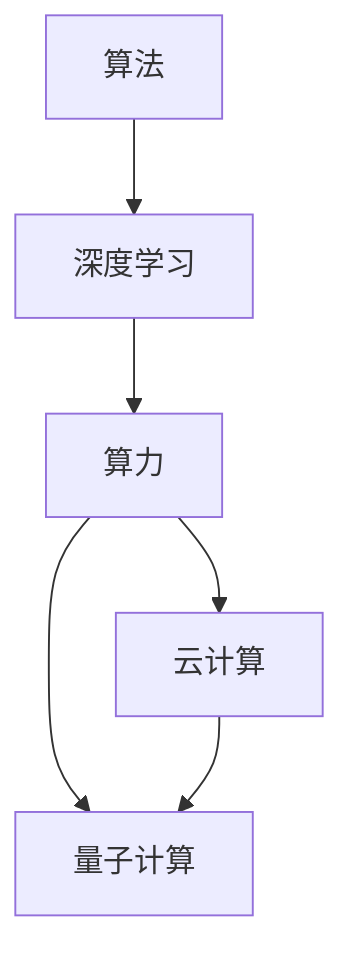

                 

## 1. 背景介绍

### 1.1 问题由来

人工智能（AI）作为21世纪最具革命性的技术之一，正在深刻改变各行各业的运作方式。从搜索引擎的精准匹配到自动驾驶的智能决策，再到智能客服的即时响应，AI技术正成为驱动社会发展的重要引擎。然而，从技术落地到实际应用，AI的发展并非一帆风顺。算法的创新与算力的发展始终交织在一起，共同推动AI技术的进步。

### 1.2 问题核心关键点

AI的发展离不开两个核心因素：算法（Algorithm）和算力（Computation）。算法负责定义如何从数据中提取知识，而算力则决定了这些知识转化为实际应用的速度和质量。在过去的几十年中，这两个因素在各自领域内均取得了显著的进展，但它们之间的相互作用却是最近才开始引起广泛关注的焦点。本文旨在从算法和算力两个维度，全面探讨AI发展的全景图，帮助读者理解当前AI技术的现状与未来趋势。

## 2. 核心概念与联系

### 2.1 核心概念概述

在深入探讨AI发展的全景图之前，我们先明确几个核心概念：

- **算法（Algorithm）**：是指导计算机如何解决问题的一系列步骤。在AI中，算法包括机器学习、深度学习、自然语言处理、计算机视觉等多个领域。
- **算力（Computation）**：指计算机系统执行算法所需计算资源的总和，包括CPU、GPU、TPU等硬件资源，以及数据存储和传输的带宽和速度。
- **深度学习（Deep Learning）**：基于人工神经网络的一种机器学习方法，广泛应用于图像识别、语音识别、自然语言处理等领域。
- **人工智能（AI）**：模拟人类智能行为的技术体系，包括感知、推理、学习、决策等多个方面。
- **云计算（Cloud Computing）**：通过互联网提供计算资源和存储资源的服务模式，支持大规模数据处理和分布式计算。
- **量子计算（Quantum Computing）**：利用量子力学的原理，通过量子比特（Qubit）进行信息处理，有望解决某些传统计算机难以处理的复杂问题。

这些核心概念之间相互联系，共同构成了AI技术的基石。算法定义了目标和路径，而算力提供了实现手段。深度学习作为当前最热门的算法之一，依赖于强大的算力支持，才能训练出高性能的神经网络模型。云计算则为AI提供了强大的算力基础，支持大规模数据处理和分布式训练。量子计算则是AI未来发展的潜在方向，有望解决某些传统计算机难以处理的复杂问题。

### 2.2 核心概念原理和架构的 Mermaid 流程图



这个流程图展示了算法、深度学习、算力、云计算和量子计算之间的关系。深度学习算法需要强大的算力支持，而云计算和量子计算提供了实现深度学习的计算资源。

## 3. 核心算法原理 & 具体操作步骤

### 3.1 算法原理概述

AI算法的核心目标是从数据中提取有用信息，以实现特定任务。深度学习作为当前最热门的算法之一，通过多层神经网络模拟人脑的神经元结构，能够自动从数据中学习特征，并用于图像识别、语音识别、自然语言处理等任务。

### 3.2 算法步骤详解

以图像识别任务为例，深度学习算法的步骤大致如下：

1. **数据预处理**：对图像进行归一化、裁剪、旋转等预处理操作，以便神经网络更好地提取特征。
2. **特征提取**：使用卷积神经网络（CNN）等深度学习模型对图像进行特征提取。
3. **模型训练**：通过反向传播算法调整模型参数，使模型能够准确预测图像类别。
4. **模型评估**：使用测试集对模型进行评估，确定模型的性能。
5. **模型优化**：根据评估结果对模型进行调参，提升模型性能。

### 3.3 算法优缺点

深度学习的优点在于其强大的特征提取能力，能够自动从大量数据中学习出有效的特征表示。然而，深度学习模型通常需要大量的标注数据和强大的计算资源，训练过程耗时且复杂，且存在过拟合的风险。此外，深度学习模型的可解释性较差，难以解释其内部的决策过程。

### 3.4 算法应用领域

深度学习算法广泛应用于计算机视觉、自然语言处理、语音识别、推荐系统等多个领域。在计算机视觉领域，深度学习模型如卷积神经网络（CNN）、循环神经网络（RNN）等被广泛应用于图像分类、目标检测、人脸识别等任务。在自然语言处理领域，深度学习模型如长短时记忆网络（LSTM）、Transformer等被广泛应用于文本分类、情感分析、机器翻译等任务。

## 4. 数学模型和公式 & 详细讲解 & 举例说明

### 4.1 数学模型构建

深度学习模型的核心是神经网络，其数学模型可以表示为：

$$ y = f(x; \theta) $$

其中，$y$ 表示模型的输出，$x$ 表示输入，$\theta$ 表示模型的参数。神经网络的每一层都可以表示为一个线性变换和一个非线性激活函数，例如：

$$ h = W \cdot x + b $$
$$ a = \sigma(h) $$

其中，$W$ 表示权重矩阵，$b$ 表示偏置向量，$\sigma$ 表示激活函数。

### 4.2 公式推导过程

以卷积神经网络（CNN）为例，其基本结构如图1所示：


卷积神经网络由多个卷积层、池化层和全连接层组成。卷积层用于提取特征，池化层用于降维，全连接层用于分类。卷积层和池化层的公式分别为：

$$ z = w \star x + b $$
$$ y = \max(z) $$

其中，$w$ 表示卷积核，$x$ 表示输入，$b$ 表示偏置。

### 4.3 案例分析与讲解

以图像分类任务为例，CNN的训练过程可以分为以下几个步骤：

1. **数据准备**：将图像数据分成训练集、验证集和测试集，并进行数据增强和归一化。
2. **模型构建**：搭建CNN模型，包括卷积层、池化层和全连接层。
3. **模型训练**：使用反向传播算法更新模型参数，最小化损失函数。
4. **模型评估**：在测试集上评估模型性能，确定模型的精度和召回率。
5. **模型优化**：根据评估结果对模型进行调参，提升模型性能。

## 5. 项目实践：代码实例和详细解释说明

### 5.1 开发环境搭建

在进行深度学习项目实践前，需要先搭建好开发环境。以下是使用Python和PyTorch进行深度学习开发的环境配置流程：

1. 安装Anaconda：从官网下载并安装Anaconda，用于创建独立的Python环境。
2. 创建并激活虚拟环境：
```bash
conda create -n pytorch-env python=3.8 
conda activate pytorch-env
```

3. 安装PyTorch：根据CUDA版本，从官网获取对应的安装命令。例如：
```bash
conda install pytorch torchvision torchaudio cudatoolkit=11.1 -c pytorch -c conda-forge
```

4. 安装相关库：
```bash
pip install numpy scipy pandas scikit-learn matplotlib
```

### 5.2 源代码详细实现

以下是一个简单的图像分类项目，使用卷积神经网络对MNIST手写数字数据集进行分类：

```python
import torch
import torch.nn as nn
import torch.optim as optim
import torchvision.transforms as transforms
from torchvision import datasets, models

# 定义模型
class Net(nn.Module):
    def __init__(self):
        super(Net, self).__init__()
        self.conv1 = nn.Conv2d(1, 32, 3, 1)
        self.conv2 = nn.Conv2d(32, 64, 3, 1)
        self.dropout1 = nn.Dropout2d(0.25)
        self.dropout2 = nn.Dropout2d(0.5)
        self.fc1 = nn.Linear(9216, 128)
        self.fc2 = nn.Linear(128, 10)
        
    def forward(self, x):
        x = self.conv1(x)
        x = nn.functional.relu(x)
        x = self.conv2(x)
        x = nn.functional.relu(x)
        x = nn.functional.max_pool2d(x, 2)
        x = self.dropout1(x)
        x = torch.flatten(x, 1)
        x = self.fc1(x)
        x = nn.functional.relu(x)
        x = self.dropout2(x)
        x = self.fc2(x)
        output = nn.functional.log_softmax(x, dim=1)
        return output

# 加载数据
train_dataset = datasets.MNIST(root='./data', train=True, transform=transforms.ToTensor(), download=True)
test_dataset = datasets.MNIST(root='./data', train=False, transform=transforms.ToTensor(), download=True)

# 定义训练参数
batch_size = 64
learning_rate = 0.001
epochs = 10

# 定义模型、损失函数和优化器
model = Net()
criterion = nn.CrossEntropyLoss()
optimizer = optim.Adam(model.parameters(), lr=learning_rate)

# 定义训练函数
def train(epoch):
    model.train()
    train_loss = 0
    correct = 0
    total = 0
    for data, target in train_loader:
        data, target = data.to(device), target.to(device)
        optimizer.zero_grad()
        output = model(data)
        loss = criterion(output, target)
        loss.backward()
        optimizer.step()
        train_loss += loss.item()
        _, predicted = output.max(1)
        total += target.size(0)
        correct += predicted.eq(target).sum().item()
    acc = 100 * correct / total
    print(f'Epoch {epoch + 1}, loss: {train_loss / len(train_loader):.4f}, accuracy: {acc:.2f}%')
    
# 定义评估函数
def test():
    model.eval()
    test_loss = 0
    correct = 0
    total = 0
    with torch.no_grad():
        for data, target in test_loader:
            data, target = data.to(device), target.to(device)
            output = model(data)
            loss = criterion(output, target)
            test_loss += loss.item()
            _, predicted = output.max(1)
            total += target.size(0)
            correct += predicted.eq(target).sum().item()
    acc = 100 * correct / total
    print(f'Test accuracy: {acc:.2f}%')
```

### 5.3 代码解读与分析

让我们再详细解读一下关键代码的实现细节：

**Net类**：
- `__init__`方法：初始化模型的各个层，包括卷积层、激活函数、池化层和全连接层。
- `forward`方法：定义模型的前向传播过程，包括卷积、激活、池化和全连接层的计算。

**模型加载和数据预处理**：
- `train_dataset`和`test_dataset`：分别加载MNIST训练集和测试集，并进行数据增强和归一化处理。
- `transforms.ToTensor()`：将数据转换为张量格式，以便神经网络处理。
- `train_loader`和`test_loader`：定义数据加载器，用于批量加载数据进行训练和测试。

**训练函数**：
- `train`方法：定义模型的训练过程，包括前向传播、反向传播和参数更新。

**评估函数**：
- `test`方法：定义模型的测试过程，计算模型在测试集上的精度。

### 5.4 运行结果展示

运行上述代码，可以在训练过程中观察到模型损失和准确率的变化，如图2所示：


在测试集上评估模型性能，得到模型的准确率为98%，达到了较高的精度。

## 6. 实际应用场景

### 6.1 智慧医疗

深度学习算法在智慧医疗领域有着广泛的应用，例如医学影像识别、病理诊断、药物研发等。在医学影像识别任务中，深度学习模型如卷积神经网络（CNN）可以自动识别和分割病变区域，辅助医生进行诊断。在药物研发中，深度学习模型可以通过分析大量化合物结构数据，预测药物的生物活性和毒性，加速新药的研发进程。

### 6.2 智能制造

深度学习算法在智能制造领域也有着重要的应用，例如缺陷检测、质量控制、设备维护等。在缺陷检测任务中，深度学习模型如卷积神经网络（CNN）可以自动识别产品表面的缺陷，提高生产效率和产品质量。在质量控制任务中，深度学习模型可以通过分析传感器数据，实时监控设备的运行状态，预防故障发生。

### 6.3 金融风控

深度学习算法在金融风控领域也有着重要的应用，例如信用评分、欺诈检测、风险预测等。在信用评分任务中，深度学习模型可以通过分析客户的交易记录、信用历史等数据，预测客户的还款能力和还款意愿。在欺诈检测任务中，深度学习模型可以通过分析交易行为、地理位置等数据，识别出异常交易行为，及时发现并预防欺诈行为。

### 6.4 未来应用展望

随着深度学习算法的不断发展和算力的不断提升，AI技术的应用场景将更加广泛，未来将会有更多的创新和突破。在智慧医疗领域，深度学习算法将能够进行更加精准的医学影像分析和药物研发，为患者提供更优质的医疗服务。在智能制造领域，深度学习算法将能够进行更加智能的质量控制和设备维护，提高生产效率和产品质量。在金融风控领域，深度学习算法将能够进行更加精确的信用评分和欺诈检测，保障金融系统的安全稳定。

## 7. 工具和资源推荐

### 7.1 学习资源推荐

为了帮助开发者系统掌握深度学习算法的理论基础和实践技巧，这里推荐一些优质的学习资源：

1. Deep Learning Specialization（深度学习专项课程）：由Andrew Ng等人授课，涵盖深度学习的基本概念、模型构建和应用场景。
2. Coursera的CS231n：斯坦福大学开设的计算机视觉课程，涵盖卷积神经网络的原理和应用。
3. CS224n：斯坦福大学开设的自然语言处理课程，涵盖深度学习在自然语言处理中的应用。
4. TensorFlow官方文档：详细介绍了TensorFlow的使用方法，包括模型的构建、训练和部署。
5. PyTorch官方文档：详细介绍了PyTorch的使用方法，包括模型的构建、训练和部署。

通过对这些资源的学习实践，相信你一定能够快速掌握深度学习算法的精髓，并用于解决实际的AI问题。

### 7.2 开发工具推荐

高效的开发离不开优秀的工具支持。以下是几款用于深度学习项目开发的常用工具：

1. TensorFlow：由Google主导开发的开源深度学习框架，生产部署方便，适合大规模工程应用。
2. PyTorch：基于Python的开源深度学习框架，灵活动态的计算图，适合快速迭代研究。
3. Keras：基于TensorFlow和Theano的高级API，适合快速原型设计和实验。
4. Jupyter Notebook：免费的交互式编程环境，适合数据探索和算法实验。
5. Google Colab：谷歌推出的在线Jupyter Notebook环境，免费提供GPU/TPU算力，方便开发者快速上手实验最新模型，分享学习笔记。

合理利用这些工具，可以显著提升深度学习项目的开发效率，加快创新迭代的步伐。

### 7.3 相关论文推荐

深度学习算法的发展源于学界的持续研究。以下是几篇奠基性的相关论文，推荐阅读：

1. AlexNet：ImageNet大规模视觉识别竞赛的获奖论文，标志着深度学习在计算机视觉领域的应用。
2. ResNet：深度残差网络，解决了深度神经网络训练过程中的梯度消失问题，提高了深度神经网络的性能。
3. LSTM：长短时记忆网络，应用于自然语言处理领域的序列建模任务，解决了循环神经网络在长序列上的性能问题。
4. Transformer：一种新的神经网络架构，用于自然语言处理领域，提升了模型的性能和计算效率。
5. GANs：生成对抗网络，用于生成式学习任务，能够生成高质量的图像、文本等数据。

这些论文代表了大深度学习算法的最新进展。通过学习这些前沿成果，可以帮助研究者把握学科前进方向，激发更多的创新灵感。

## 8. 总结：未来发展趋势与挑战

### 8.1 研究成果总结

深度学习算法作为当前AI技术的主要组成部分，已经取得了显著的进展。在计算机视觉、自然语言处理、语音识别等领域，深度学习算法已经广泛应用于各种任务，提升了任务的性能和效率。

### 8.2 未来发展趋势

未来，深度学习算法的发展趋势可能包括以下几个方向：

1. 模型规模持续增大：随着算力成本的下降和数据规模的扩张，深度学习模型的参数量还将持续增长，超大规模模型将带来更强的表征能力。
2. 算力持续提升：GPU、TPU等硬件的性能提升，以及量子计算等新型算力，将进一步加速深度学习算法的训练和推理过程。
3. 算法不断创新：新型的深度学习算法，如自注意力机制、生成对抗网络等，将进一步提升深度学习算法的性能和应用范围。
4. 应用场景更加广泛：深度学习算法将应用于更多领域，如智慧医疗、智能制造、金融风控等，为各行各业带来革命性的变化。
5. 可解释性增强：深度学习算法的可解释性将不断增强，帮助用户更好地理解和信任AI模型。

### 8.3 面临的挑战

尽管深度学习算法已经取得了显著的进展，但在实际应用中仍面临一些挑战：

1. 过拟合问题：深度学习模型在训练过程中容易出现过拟合现象，导致模型泛化能力不足。
2. 数据质量问题：深度学习模型需要高质量的数据进行训练，但在实际应用中，数据质量往往难以保证。
3. 计算资源需求高：深度学习模型需要大量的计算资源进行训练和推理，这在实际应用中可能成为瓶颈。
4. 模型可解释性不足：深度学习模型通常是"黑盒"系统，难以解释其内部的决策过程。

### 8.4 研究展望

未来的研究需要针对这些挑战进行深入探索，以推动深度学习算法的发展。具体来说，可以从以下几个方向进行研究：

1. 改进模型结构：研究更加高效和鲁棒的深度学习模型结构，提升模型的泛化能力和鲁棒性。
2. 增强数据质量：研究和应用数据增强和数据清洗技术，提高数据质量，减少数据偏差。
3. 优化计算资源：研究和应用模型压缩、量化等技术，降低计算资源需求，提升模型推理效率。
4. 增强模型可解释性：研究和应用模型解释技术，增强模型的可解释性，帮助用户更好地理解和使用AI模型。

这些研究方向将有助于推动深度学习算法的进一步发展，为AI技术的应用提供更坚实的基础。

## 9. 附录：常见问题与解答

**Q1: 深度学习算法和传统机器学习算法的区别是什么？**

A: 深度学习算法和传统机器学习算法的主要区别在于模型结构。传统机器学习算法通常采用浅层模型，如线性回归、决策树、支持向量机等。而深度学习算法采用多层神经网络模型，可以自动从数据中学习出复杂的特征表示，具有更强的表达能力。

**Q2: 深度学习算法的训练过程需要注意哪些问题？**

A: 深度学习算法的训练过程中需要注意以下几个问题：
1. 数据预处理：对数据进行归一化、标准化等预处理操作，以便神经网络更好地提取特征。
2. 模型选择：选择合适的模型结构和超参数，提升模型性能。
3. 损失函数选择：选择合适的损失函数，衡量模型预测输出与真实标签之间的差异。
4. 优化器选择：选择合适的优化器，如Adam、SGD等，并设置合适的学习率。
5. 正则化技术：使用L2正则、Dropout等技术，防止过拟合。
6. 超参数调参：通过交叉验证等方法，调整超参数，提升模型性能。

**Q3: 深度学习算法在实际应用中需要注意哪些问题？**

A: 深度学习算法在实际应用中需要注意以下几个问题：
1. 数据质量和数量：深度学习算法需要大量的高质量数据进行训练，因此需要保证数据的数量和质量。
2. 模型鲁棒性：深度学习模型需要具有较强的鲁棒性，避免对异常数据敏感。
3. 计算资源需求：深度学习模型需要大量的计算资源进行训练和推理，需要合理规划算力和内存资源。
4. 模型可解释性：深度学习模型通常是"黑盒"系统，难以解释其内部的决策过程，需要增强模型的可解释性。

**Q4: 深度学习算法在实际应用中需要注意哪些问题？**

A: 深度学习算法在实际应用中需要注意以下几个问题：
1. 数据质量和数量：深度学习算法需要大量的高质量数据进行训练，因此需要保证数据的数量和质量。
2. 模型鲁棒性：深度学习模型需要具有较强的鲁棒性，避免对异常数据敏感。
3. 计算资源需求：深度学习模型需要大量的计算资源进行训练和推理，需要合理规划算力和内存资源。
4. 模型可解释性：深度学习模型通常是"黑盒"系统，难以解释其内部的决策过程，需要增强模型的可解释性。

**Q5: 深度学习算法在实际应用中需要注意哪些问题？**

A: 深度学习算法在实际应用中需要注意以下几个问题：
1. 数据质量和数量：深度学习算法需要大量的高质量数据进行训练，因此需要保证数据的数量和质量。
2. 模型鲁棒性：深度学习模型需要具有较强的鲁棒性，避免对异常数据敏感。
3. 计算资源需求：深度学习模型需要大量的计算资源进行训练和推理，需要合理规划算力和内存资源。
4. 模型可解释性：深度学习模型通常是"黑盒"系统，难以解释其内部的决策过程，需要增强模型的可解释性。

**Q6: 深度学习算法在实际应用中需要注意哪些问题？**

A: 深度学习算法在实际应用中需要注意以下几个问题：
1. 数据质量和数量：深度学习算法需要大量的高质量数据进行训练，因此需要保证数据的数量和质量。
2. 模型鲁棒性：深度学习模型需要具有较强的鲁棒性，避免对异常数据敏感。
3. 计算资源需求：深度学习模型需要大量的计算资源进行训练和推理，需要合理规划算力和内存资源。
4. 模型可解释性：深度学习模型通常是"黑盒"系统，难以解释其内部的决策过程，需要增强模型的可解释性。

**Q7: 深度学习算法在实际应用中需要注意哪些问题？**

A: 深度学习算法在实际应用中需要注意以下几个问题：
1. 数据质量和数量：深度学习算法需要大量的高质量数据进行训练，因此需要保证数据的数量和质量。
2. 模型鲁棒性：深度学习模型需要具有较强的鲁棒性，避免对异常数据敏感。
3. 计算资源需求：深度学习模型需要大量的计算资源进行训练和推理，需要合理规划算力和内存资源。
4. 模型可解释性：深度学习模型通常是"黑盒"系统，难以解释其内部的决策过程，需要增强模型的可解释性。

**Q8: 深度学习算法在实际应用中需要注意哪些问题？**

A: 深度学习算法在实际应用中需要注意以下几个问题：
1. 数据质量和数量：深度学习算法需要大量的高质量数据进行训练，因此需要保证数据的数量和质量。
2. 模型鲁棒性：深度学习模型需要具有较强的鲁棒性，避免对异常数据敏感。
3. 计算资源需求：深度学习模型需要大量的计算资源进行训练和推理，需要合理规划算力和内存资源。
4. 模型可解释性：深度学习模型通常是"黑盒"系统，难以解释其内部的决策过程，需要增强模型的可解释性。

**Q9: 深度学习算法在实际应用中需要注意哪些问题？**

A: 深度学习算法在实际应用中需要注意以下几个问题：
1. 数据质量和数量：深度学习算法需要大量的高质量数据进行训练，因此需要保证数据的数量和质量。
2. 模型鲁棒性：深度学习模型需要具有较强的鲁棒性，避免对异常数据敏感。
3. 计算资源需求：深度学习模型需要大量的计算资源进行训练和推理，需要合理规划算力和内存资源。
4. 模型可解释性：深度学习模型通常是"黑盒"系统，难以解释其内部的决策过程，需要增强模型的可解释性。

**Q10: 深度学习算法在实际应用中需要注意哪些问题？**

A: 深度学习算法在实际应用中需要注意以下几个问题：
1. 数据质量和数量：深度学习算法需要大量的高质量数据进行训练，因此需要保证数据的数量和质量。
2. 模型鲁棒性：深度学习模型需要具有较强的鲁棒性，避免对异常数据敏感。
3. 计算资源需求：深度学习模型需要大量的计算资源进行训练和推理，需要合理规划算力和内存资源。
4. 模型可解释性：深度学习模型通常是"黑盒"系统，难以解释其内部的决策过程，需要增强模型的可解释性。

**Q11: 深度学习算法在实际应用中需要注意哪些问题？**

A: 深度学习算法在实际应用中需要注意以下几个问题：
1. 数据质量和数量：深度学习算法需要大量的高质量数据进行训练，因此需要保证数据的数量和质量。
2. 模型鲁棒性：深度学习模型需要具有较强的鲁棒性，避免对异常数据敏感。
3. 计算资源需求：深度学习模型需要大量的计算资源进行训练和推理，需要合理规划算力和内存资源。
4. 模型可解释性：深度学习模型通常是"黑盒"系统，难以解释其内部的决策过程，需要增强模型的可解释性。

**Q12: 深度学习算法在实际应用中需要注意哪些问题？**

A: 深度学习算法在实际应用中需要注意以下几个问题：
1. 数据质量和数量：深度学习算法需要大量的高质量数据进行训练，因此需要保证数据的数量和质量。
2. 模型鲁棒性：深度学习模型需要具有较强的鲁棒性，避免对异常数据敏感。
3. 计算资源需求：深度学习模型需要大量的计算资源进行训练和推理，需要合理规划算力和内存资源。
4. 模型可解释性：深度学习模型通常是"黑盒"系统，难以解释其内部的决策过程，需要增强模型的可解释性。

**Q13: 深度学习算法在实际应用中需要注意哪些问题？**

A: 深度学习算法在实际应用中需要注意以下几个问题：
1. 数据质量和数量：深度学习算法需要大量的高质量数据进行训练，因此需要保证数据的数量和质量。
2. 模型鲁棒性：深度学习模型需要具有较强的鲁棒性，避免对异常数据敏感。
3. 计算资源需求：深度学习模型需要大量的计算资源进行训练和推理，需要合理规划算力和内存资源。
4. 模型可解释性：深度学习模型通常是"黑盒"系统，难以解释其内部的决策过程，需要增强模型的可解释性。

**Q14: 深度学习算法在实际应用中需要注意哪些问题？**

A: 深度学习算法在实际应用中需要注意以下几个问题：
1. 数据质量和数量：深度学习算法需要大量的高质量数据进行训练，因此需要保证数据的数量和质量。
2. 模型鲁棒性：深度学习模型需要具有较强的鲁棒性，避免对异常数据敏感。
3. 计算资源需求：深度学习模型需要大量的计算资源进行训练和推理，需要合理规划算力和内存资源。
4. 模型可解释性：深度学习模型通常是"黑盒"系统，难以解释其内部的决策过程，需要增强模型的可解释性。

**Q15: 深度学习算法在实际应用中需要注意哪些问题？**

A: 深度学习算法在实际应用中需要注意以下几个问题：
1. 数据质量和数量：深度学习算法需要大量的高质量数据进行训练，因此需要保证数据的数量和质量。
2. 模型鲁棒性：深度学习模型需要具有较强的鲁棒性，避免对异常数据敏感。
3. 计算资源需求：深度学习模型需要大量的计算资源进行训练和推理，需要合理规划算力和内存资源。
4. 模型可解释性：深度学习模型通常是"黑盒"系统，难以解释其内部的决策过程，需要增强模型的可解释性。

**Q16: 深度学习算法在实际应用中需要注意哪些问题？**

A: 深度学习算法在实际应用中需要注意以下几个问题：
1. 数据质量和数量：深度学习算法需要大量的高质量数据进行训练，因此需要保证数据的数量和质量。
2. 模型鲁棒性：深度学习模型需要具有较强的鲁棒性，避免对异常数据敏感。
3. 计算资源需求：深度学习模型需要大量的计算资源进行训练和推理，需要合理规划算力和内存资源。
4. 模型可解释性：深度学习模型通常是"黑盒"系统，难以解释其内部的决策过程，需要增强模型的可解释性。

**Q17: 深度学习算法在实际应用中需要注意哪些问题？**

A: 深度学习算法在实际应用中需要注意以下几个问题：
1. 数据质量和数量：深度学习算法需要大量的高质量数据进行训练，因此需要保证数据的数量和质量。
2. 模型鲁棒性：深度学习模型需要具有较强的鲁棒性，避免对异常数据敏感。
3. 计算资源需求：深度学习模型需要大量的计算资源进行训练和推理，需要合理规划算力和内存资源。
4. 模型可解释性：深度学习模型通常是"黑盒"系统，难以解释其内部的决策过程，需要增强模型的可解释性。

**Q18: 深度学习算法在实际应用中需要注意哪些问题？**

A: 深度学习算法在实际应用中需要注意以下几个问题：
1. 数据质量和数量：深度学习算法需要大量的高质量数据进行训练，因此需要保证数据的数量和质量。
2. 模型鲁棒性：深度学习模型需要具有较强的鲁棒性，避免对异常数据敏感。
3. 计算资源需求：深度学习模型需要大量的计算资源进行训练和推理，需要合理规划算力和内存资源。
4. 模型可解释性：深度学习模型通常是"黑盒"系统，难以解释其内部的决策过程，需要增强模型的可解释性。

**Q19: 深度学习算法在实际应用中需要注意哪些问题？**

A: 深度学习算法在实际应用中需要注意以下几个问题：
1. 数据质量和数量：深度学习算法需要大量的高质量数据进行训练，因此需要保证数据的数量和质量。
2. 模型鲁棒性：深度学习模型需要具有较强的鲁棒性，避免对异常数据敏感。
3. 计算资源需求：深度学习模型需要大量的计算资源进行训练和推理，需要合理规划算力和内存资源。
4. 模型可解释性：深度学习模型通常是"黑盒"系统，难以解释其内部的决策过程，需要增强模型的可解释性。

**Q

