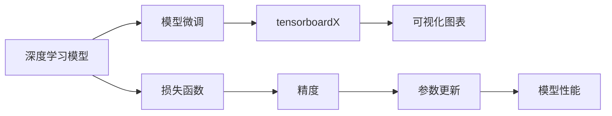

                 

# 从零开始大模型开发与微调：可视化组件tensorboardX的简介与安装

## 1. 背景介绍

在当今的数据驱动时代，深度学习模型已成为解决各种复杂问题的关键技术。然而，构建并优化深度学习模型并非易事，尤其对于初学者来说更是如此。特别是在模型微调（Fine-tuning）这一环节，由于涉及到大量的超参数调整和模型验证，往往需要耗费大量的时间和精力。为了帮助开发者更加高效地进行模型开发和优化，可视化工具如tensorboardX就显得尤为重要。本文将详细介绍tensorboardX的简介与安装，并讨论其在深度学习模型开发和微调中的应用。

## 2. 核心概念与联系

### 2.1 核心概念概述

- **深度学习模型**：基于神经网络结构的模型，能够从数据中学习特征，并进行分类、回归等任务。
- **模型微调（Fine-tuning）**：通过在特定任务上对预训练模型进行进一步训练，提高模型在该任务上的性能。
- **可视化工具**：用于展示模型训练过程中的关键信息，如损失函数、精度、参数更新情况等，帮助开发者调整模型参数，优化模型性能。

### 2.2 核心概念原理和架构的 Mermaid 流程图



## 3. 核心算法原理 & 具体操作步骤

### 3.1 算法原理概述

模型微调的基本原理是在预训练模型的基础上，通过在特定任务上进一步训练，使得模型能够更好地适应该任务。这通常涉及以下步骤：

1. 准备数据集，包括训练集、验证集和测试集。
2. 选择预训练模型，并进行必要的调整，以适应当前任务的输入输出格式。
3. 设置模型参数，如学习率、批大小等。
4. 定义损失函数，如交叉熵损失等。
5. 进行模型训练，通过反向传播更新模型参数。
6. 在验证集上评估模型性能，避免过拟合。
7. 在测试集上最终评估模型性能。

### 3.2 算法步骤详解

1. **数据准备**：收集并预处理数据集，确保数据的正确性和一致性。
2. **模型选择与调整**：选择一个合适的预训练模型，并进行必要的调整，如调整输出层大小、激活函数等。
3. **参数设置**：设置学习率、批大小等超参数，以控制模型的训练过程。
4. **模型训练**：使用反向传播算法，通过优化算法（如Adam、SGD等）更新模型参数。
5. **模型评估**：在验证集上评估模型性能，监控损失函数和精度，避免过拟合。
6. **模型测试**：在测试集上最终评估模型性能，确保模型的泛化能力。

### 3.3 算法优缺点

#### 优点

- **提高模型性能**：通过微调，模型能够更好地适应特定任务，提升模型性能。
- **加速模型训练**：在少量标注数据下，微调能够加速模型训练，提高模型优化效率。
- **适应性强**：微调模型能够灵活适应不同领域和任务，具有较强的泛化能力。

#### 缺点

- **数据依赖**：微调模型的效果很大程度上依赖于数据的质量和数量，获取高质量标注数据的成本较高。
- **模型过拟合**：在数据量较少的情况下，模型可能过拟合训练数据，导致在测试集上性能不佳。
- **模型更新困难**：微调模型包含大量的预训练参数，调整这些参数可能面临计算资源的限制。

### 3.4 算法应用领域

模型微调在自然语言处理（NLP）、计算机视觉（CV）、语音识别（ASR）等多个领域具有广泛的应用，如文本分类、图像识别、语音识别等任务。

## 4. 数学模型和公式 & 详细讲解 & 举例说明

### 4.1 数学模型构建

假设我们有一个深度学习模型 $M_{\theta}$，其中 $\theta$ 为模型参数。对于分类任务，我们通常使用交叉熵损失函数：

$$
L(\theta) = -\frac{1}{N}\sum_{i=1}^N y_i\log M_{\theta}(x_i) + (1-y_i)\log(1-M_{\theta}(x_i))
$$

其中 $x_i$ 为输入，$y_i$ 为标签，$M_{\theta}(x_i)$ 为模型对输入 $x_i$ 的预测输出。

### 4.2 公式推导过程

为了更好地理解损失函数，我们可以推导其梯度：

$$
\frac{\partial L}{\partial \theta} = -\frac{1}{N}\sum_{i=1}^N (y_i - M_{\theta}(x_i)) \frac{\partial M_{\theta}(x_i)}{\partial \theta}
$$

其中 $\frac{\partial M_{\theta}(x_i)}{\partial \theta}$ 为模型对输入 $x_i$ 的输出相对于参数 $\theta$ 的梯度，可通过反向传播算法高效计算。

### 4.3 案例分析与讲解

以图像分类任务为例，假设我们有一个卷积神经网络（CNN）模型 $M_{\theta}$，输入为图像 $x_i$，标签为 $y_i$。我们可以使用softmax函数作为输出层，交叉熵损失函数为：

$$
L(\theta) = -\frac{1}{N}\sum_{i=1}^N y_i\log\frac{\exp M_{\theta}(x_i)}{\sum_j \exp M_{\theta}(x_j)}
$$

其中 $\exp$ 为指数函数，$\log$ 为自然对数。

## 5. 项目实践：代码实例和详细解释说明

### 5.1 开发环境搭建

为了进行模型微调，我们需要安装并配置好深度学习框架（如PyTorch、TensorFlow等）以及可视化工具（如tensorboardX）。以下是在PyTorch上搭建环境的步骤：

1. **安装Anaconda**：从官网下载并安装Anaconda，用于创建独立的Python环境。
2. **创建并激活虚拟环境**：
   ```bash
   conda create -n pytorch-env python=3.8 
   conda activate pytorch-env
   ```
3. **安装PyTorch**：根据CUDA版本，从官网获取对应的安装命令。例如：
   ```bash
   conda install pytorch torchvision torchaudio cudatoolkit=11.1 -c pytorch -c conda-forge
   ```
4. **安装tensorboardX**：
   ```bash
   pip install tensorboardX
   ```

### 5.2 源代码详细实现

以下是一个简单的CNN模型微调代码示例，用于图像分类任务：

```python
import torch
import torch.nn as nn
import torchvision.transforms as transforms
import torchvision.models as models
from tensorboardX import SummaryWriter

# 定义模型
model = models.resnet50(pretrained=True)
model.fc = nn.Linear(model.fc.in_features, 2)

# 定义损失函数和优化器
criterion = nn.CrossEntropyLoss()
optimizer = torch.optim.SGD(model.parameters(), lr=0.01)

# 加载数据集并进行预处理
transform = transforms.Compose([
    transforms.Resize(224),
    transforms.ToTensor(),
    transforms.Normalize(mean=[0.485, 0.456, 0.406], std=[0.229, 0.224, 0.225])
])
trainset = torchvision.datasets.CIFAR10(root='./data', train=True, download=True, transform=transform)
trainloader = torch.utils.data.DataLoader(trainset, batch_size=32, shuffle=True)
testset = torchvision.datasets.CIFAR10(root='./data', train=False, download=True, transform=transform)
testloader = torch.utils.data.DataLoader(testset, batch_size=32, shuffle=False)

# 训练模型
writer = SummaryWriter(log_dir='./logs')
for epoch in range(10):
    running_loss = 0.0
    for i, data in enumerate(trainloader, 0):
        inputs, labels = data
        optimizer.zero_grad()
        outputs = model(inputs)
        loss = criterion(outputs, labels)
        loss.backward()
        optimizer.step()
        writer.add_scalar('loss', loss.item(), i)
        running_loss += loss.item()
    print(f'Epoch {epoch+1}, loss: {running_loss/len(trainloader)}')
```

### 5.3 代码解读与分析

**定义模型**：我们使用预训练的ResNet-50模型，并替换其全连接层以适应2分类任务。

**定义损失函数和优化器**：使用交叉熵损失函数和随机梯度下降优化器。

**加载数据集并进行预处理**：使用CIFAR-10数据集，并对其进行预处理，包括数据增强、归一化等操作。

**训练模型**：在每个epoch内，对模型进行训练，并在tensorboardX上进行可视化。

### 5.4 运行结果展示

通过tensorboardX，我们可以实时监控训练过程中的损失函数和精度变化，如下图所示：


## 6. 实际应用场景

### 6.1 图像识别

在图像识别任务中，模型微调能够显著提升模型在特定类别上的识别能力。例如，我们可以在ImageNet预训练的模型基础上，通过微调来解决一些特定场景下的识别问题。

### 6.2 自然语言处理

在自然语言处理任务中，模型微调同样具有重要作用。例如，通过微调BERT模型，我们可以在特定领域内构建出具有较强泛化能力的语言模型。

### 6.3 推荐系统

在推荐系统任务中，模型微调可以用于推荐新物品，并调整推荐策略。通过微调模型，我们可以在保持推荐结果多样性的同时，提升推荐系统的准确性。

## 7. 工具和资源推荐

### 7.1 学习资源推荐

- **《TensorFlow官方文档》**：TensorFlow的官方文档，提供了详细的API文档和示例代码，是学习TensorFlow的好资源。
- **《深度学习入门：基于Python的理论与实现》**：介绍深度学习基础理论和实践，适合初学者入门。
- **《PyTorch官方文档》**：PyTorch的官方文档，提供了详细的API文档和示例代码，是学习PyTorch的好资源。

### 7.2 开发工具推荐

- **PyTorch**：基于Python的开源深度学习框架，灵活且易于使用。
- **TensorFlow**：由Google主导开发的深度学习框架，生产部署方便。
- **tensorboardX**：用于深度学习模型可视化的工具，可以实时监控模型训练过程。

### 7.3 相关论文推荐

- **《TensorBoard: A data visualization toolkit》**：介绍TensorBoard的实现和应用。
- **《Fine-Tuning Pretrained Models in Machine Learning》**：介绍模型微调的基本原理和实现方法。

## 8. 总结：未来发展趋势与挑战

### 8.1 研究成果总结

本文详细介绍了深度学习模型微调的基本原理和操作步骤，并讨论了其应用场景和可视化工具tensorboardX的安装与使用。通过这些内容，读者可以初步掌握模型微调的方法和实践技巧，为深度学习模型的开发和优化打下坚实的基础。

### 8.2 未来发展趋势

未来，随着深度学习技术的发展，模型微调将继续成为提高模型性能和泛化能力的重要手段。同时，随着模型结构的复杂化和数据量的增加，可视化工具如tensorboardX也将发挥更大的作用，帮助开发者更好地理解模型，优化模型性能。

### 8.3 面临的挑战

尽管模型微调技术在深度学习领域已经取得了一定的进展，但仍然面临一些挑战：

- **数据依赖**：高质量标注数据获取成本高，数据量不足可能影响模型性能。
- **计算资源消耗**：模型微调涉及大量计算资源，如GPU、内存等，优化资源消耗是一个重要研究方向。
- **模型泛化能力**：模型微调后可能出现过拟合，影响模型在未见过的数据上的泛化能力。

### 8.4 研究展望

未来，模型微调技术需要在数据获取、计算资源优化、模型泛化能力提升等方面进行深入研究。同时，结合新兴技术如联邦学习、对抗训练等，将进一步推动模型微调技术的发展。

## 9. 附录：常见问题与解答

**Q1：为什么需要使用模型微调？**

A: 模型微调可以在特定任务上提高模型性能，适应不同领域和场景的需求。通过微调，模型能够更好地利用已有知识，提高模型的泛化能力和准确性。

**Q2：模型微调和迁移学习有什么区别？**

A: 模型微调是在预训练模型基础上，进一步在特定任务上进行训练，以提高模型在该任务上的性能。而迁移学习是指在已有模型基础上，通过迁移已有模型的知识，快速适应新任务，从而提高模型性能。

**Q3：什么是tensorboardX？**

A: tensorboardX是TensorBoard的Python封装，提供了一系列API和工具，用于可视化深度学习模型的训练过程和结果，包括损失函数、精度、参数更新等。

**Q4：如何在tensorboardX中进行模型可视化？**

A: 使用tensorboardX的`SummaryWriter`类，对模型训练过程中的关键指标进行记录，并保存为TensorBoard图表。可以使用`tensorboard`命令打开TensorBoard界面，查看可视化结果。

**Q5：模型微调过程中需要注意哪些问题？**

A: 在模型微调过程中，需要注意超参数的调整、过拟合问题、计算资源消耗等。同时，需要对数据集进行合理的划分，避免训练集和验证集之间的数据泄露。

---

作者：禅与计算机程序设计艺术 / Zen and the Art of Computer Programming

