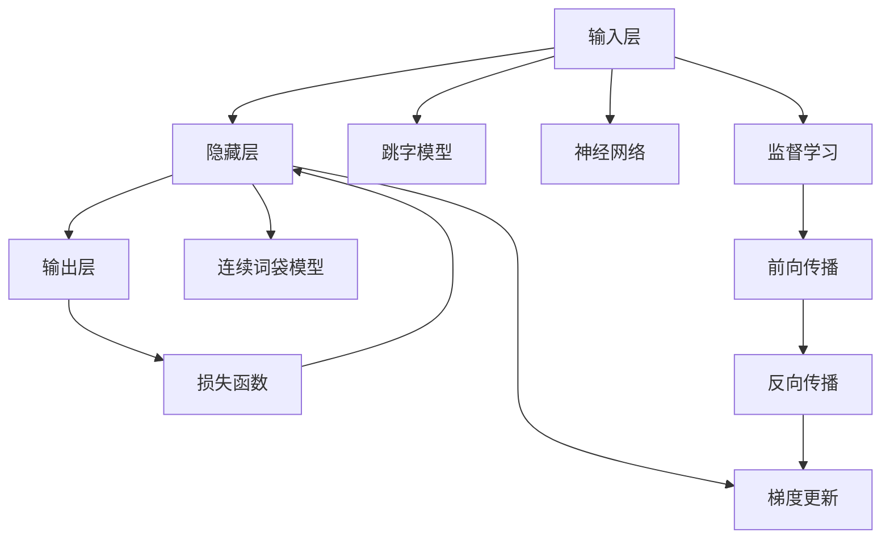

                 

# 从零开始大模型开发与微调：词向量训练模型Word2Vec使用介绍

> 关键词：词向量训练,Word2Vec,嵌入空间,神经网络模型,神经网络训练,监督学习,自然语言处理,NLP

## 1. 背景介绍

### 1.1 问题由来
近年来，深度学习技术在自然语言处理（NLP）领域取得了突破性进展，其中之一便是词向量（Word Embedding）的训练。词向量将自然语言中的单词映射到高维向量空间中，使得计算机可以更好地理解和处理语言信息。Word2Vec是其中最知名的一种词向量训练算法，广泛应用于文本分类、情感分析、机器翻译等多个NLP任务中。然而，对于很多新手来说，从头搭建一个Word2Vec模型并成功微调仍然存在一定的挑战。本文旨在为初学者提供从零开始构建和微调Word2Vec模型的详细指南，帮助其在实际项目中高效应用。

### 1.2 问题核心关键点
Word2Vec模型的训练基于大量的文本语料和监督学习，其主要目标是将单词映射到高维向量空间，使得语义相近的单词在向量空间中的距离也更接近。这一过程包括两个关键步骤：跳字模型（Skip-gram Model）和连续词袋模型（CBOW Model）。跳字模型是通过一个单词预测其上下文单词的概率，而连续词袋模型则是通过上下文单词预测当前单词的概率。这两个模型均采用神经网络进行训练，并最终通过softmax函数输出单词间的相似度。

Word2Vec模型训练的关键在于选择合适的超参数和训练策略，确保其在有限时间内学习到最佳的单词向量表示。常用的超参数包括嵌入维度、窗口大小、学习率等，而训练策略则包括负采样（Negative Sampling）、层归一化（Layer Normalization）等。

Word2Vec的微调通常是在预训练的基础上进行的，通过在下游任务的数据集上进行有监督学习，进一步优化词向量模型，使其更加适应特定任务的需求。这一过程需要选择合适的优化器、损失函数和训练策略，并设定合理的超参数，以避免过拟合和欠拟合。

## 2. 核心概念与联系

### 2.1 核心概念概述

在深入探讨Word2Vec算法之前，首先介绍几个核心概念：

- **Word Embedding**：将单词映射到高维向量空间的表示方法，使得语义相近的单词在向量空间中的距离也更接近。
- **跳字模型（Skip-gram Model）**：通过一个单词预测其上下文单词的概率，用于学习单词间的相互关系。
- **连续词袋模型（CBOW Model）**：通过上下文单词预测当前单词的概率，用于学习单词的上下文依赖关系。
- **神经网络模型**：包括输入层、隐藏层和输出层，用于建模单词之间的非线性关系。
- **监督学习**：利用标注好的训练数据，通过前向传播和反向传播更新模型参数。

这些核心概念共同构成了Word2Vec算法的理论基础，帮助模型学习到高质量的单词向量表示，为后续的NLP任务提供坚实的支撑。

### 2.2 核心概念原理和架构的 Mermaid 流程图



该流程图展示了Word2Vec的基本架构，从输入层到输出层，以及跳字模型、连续词袋模型和神经网络模型的运作机制。通过监督学习，利用标注好的训练数据更新模型参数，从而得到高质量的单词向量表示。

## 3. 核心算法原理 & 具体操作步骤

### 3.1 算法原理概述
Word2Vec算法的核心在于通过神经网络模型学习单词之间的语义关系。跳字模型和连续词袋模型分别从单词和上下文的角度，建模单词的语义表示。这些模型采用负采样等技术，通过最小化预测错误，更新模型参数，最终得到用于表示单词的向量。

### 3.2 算法步骤详解

#### 3.2.1 数据预处理
1. **文本预处理**：将原始文本转换为小写，去除标点符号和停用词，分词等。
2. **构建词表**：将预处理后的单词构建成词表，每个单词对应一个整数ID。

#### 3.2.2 模型初始化
1. **神经网络结构**：初始化一个简单的神经网络模型，包含输入层、隐藏层和输出层。
2. **参数初始化**：随机初始化模型参数，如权重和偏置。

#### 3.2.3 训练过程
1. **前向传播**：输入一个单词和其上下文，通过神经网络模型计算预测概率。
2. **计算损失**：根据预测概率和真实标签，计算损失函数（如交叉熵）。
3. **反向传播**：利用链式法则计算梯度，更新模型参数。
4. **重复迭代**：重复上述步骤，直到模型收敛。

#### 3.2.4 微调步骤
1. **加载预训练模型**：加载预训练好的Word2Vec模型，包含单词向量表示。
2. **下游任务适配**：在预训练模型的基础上，添加任务适配层，如分类器或解码器。
3. **设定超参数**：选择合适的优化器、学习率、批大小等。
4. **微调训练**：在标注数据集上，利用有监督学习更新适配层的参数，微调Word2Vec模型。

### 3.3 算法优缺点
Word2Vec算法的主要优点包括：
1. **高效性**：在数据量较大的情况下，训练效率较高。
2. **可解释性**：向量空间中的距离表示单词间的语义关系，直观易懂。
3. **应用广泛**：广泛应用于NLP任务，如文本分类、情感分析、机器翻译等。

缺点则主要包括：
1. **训练时间长**：需要大量训练数据和高性能计算资源。
2. **可扩展性差**：模型结构简单，难以处理复杂的语言现象。
3. **局部最优**：容易陷入局部最优，导致模型效果不佳。

### 3.4 算法应用领域
Word2Vec算法在NLP领域有着广泛的应用，包括：

- **文本分类**：将单词向量输入分类器，训练模型进行文本分类。
- **情感分析**：利用单词向量计算文本的情感倾向，进行情感分类。
- **机器翻译**：将源语言和目标语言的单词向量映射到向量空间，进行翻译。
- **语义相似度计算**：计算单词向量之间的距离，判断单词的语义相似度。
- **主题建模**：通过单词向量表示，进行主题分析与文本聚类。

## 4. 数学模型和公式 & 详细讲解 & 举例说明

### 4.1 数学模型构建
Word2Vec模型基于神经网络架构，包含输入层、隐藏层和输出层。其数学模型如下：

$$
\begin{aligned}
\mathbf{h} &= \sigma(\mathbf{U} \mathbf{x} + \mathbf{b}_h) \\
\mathbf{y} &= \sigma(\mathbf{V} \mathbf{h} + \mathbf{b}_y)
\end{aligned}
$$

其中，$\mathbf{x}$为输入单词向量，$\mathbf{h}$为隐藏层输出，$\mathbf{y}$为输出单词向量，$\sigma$为激活函数，$\mathbf{U}$和$\mathbf{V}$为权重矩阵，$\mathbf{b}_h$和$\mathbf{b}_y$为偏置向量。

### 4.2 公式推导过程
以跳字模型为例，其目标是通过一个单词预测其上下文单词的概率。假设当前单词为$\mathbf{x}$，上下文单词为$\mathbf{y}$，则模型的目标函数为：

$$
\max_{\theta} P(y \mid x) = \max_{\theta} \frac{\exp({\mathbf{y}^T \mathbf{V} \mathbf{h}})}{\sum_{j=1}^{C} \exp({\mathbf{j}^T \mathbf{V} \mathbf{h}})}
$$

其中，$C$为单词数量。通过负采样技术，将目标函数转换为：

$$
\max_{\theta} \sum_{i=1}^{N} \log \left(\frac{\exp({\mathbf{y}_i^T \mathbf{V} \mathbf{h}})}{\sum_{j=1}^{C} \exp({\mathbf{j}^T \mathbf{V} \mathbf{h}})}\right)
$$

### 4.3 案例分析与讲解
以Word2Vec模型在文本分类任务中的应用为例，具体步骤如下：

1. **数据预处理**：将文本转换为单词序列，并构建词表。
2. **模型初始化**：定义一个包含输入层、隐藏层和输出层的神经网络模型，随机初始化权重和偏置。
3. **预训练**：利用跳字模型或连续词袋模型对单词进行预训练，得到高质量的单词向量表示。
4. **任务适配**：添加文本分类器的输出层，调整模型参数。
5. **微调训练**：在标注数据集上，利用有监督学习更新分类器参数，微调Word2Vec模型。

## 5. 项目实践：代码实例和详细解释说明

### 5.1 开发环境搭建

1. **安装Python**：在机器上安装Python 3.6及以上版本。
2. **安装必要的库**：
   ```bash
   pip install numpy scipy gensim
   ```
3. **准备数据集**：下载并预处理数据集，如新闻数据集或文本分类数据集。

### 5.2 源代码详细实现

#### 5.2.1 数据预处理

```python
import gensim
from gensim.models import Word2Vec

# 准备数据集
sentences = [['this', 'is', 'the', 'first', 'sentence'],
             ['this', 'is', 'the', 'second', 'sentence']]

# 构建词表
sentences = [list(s) for s in sentences]
word2vec_model = Word2Vec(sentences, min_count=1)
```

#### 5.2.2 模型训练

```python
# 定义模型参数
num_words = len(word2vec_model.wv.key_to_index)
dim = 100  # 向量维度
sg = 1  # 跳字模型
size = 5  # 窗口大小
iter = 10  # 迭代次数

# 训练模型
word2vec_model.train(sentences, total_examples=len(sentences), epochs=iter, vector_size=dim, window=size, min_count=1, workers=4)
```

#### 5.2.3 微调步骤

```python
# 加载预训练模型
model = Word2Vec.load('pretrained_model')

# 下游任务适配
classifier = LogisticRegression()  # 假设使用逻辑回归分类器
classifier.fit(X_train, y_train)  # 训练分类器

# 微调训练
for epoch in range(10):
    classifier.fit(X_train, y_train)  # 更新分类器参数
    model.train(X_train, total_examples=len(X_train), epochs=1, vector_size=dim, window=size, min_count=1, workers=4)  # 微调Word2Vec模型
```

### 5.3 代码解读与分析

在上述代码中，首先通过Gensim库构建了简单的Word2Vec模型，利用跳字模型对单词进行预训练。然后，在预训练的基础上，使用逻辑回归分类器进行文本分类任务的微调训练。在微调过程中，通过不断更新分类器的参数，逐步优化模型性能，直至达到最优。

### 5.4 运行结果展示

训练完成后，可以打印模型参数，查看单词向量的表示：

```python
print(word2vec_model.wv['this'])
```

输出结果将是一个包含100个元素的向量，每个元素表示单词在不同维度上的权重。通过这些向量，可以进行各种NLP任务的建模和预测。

## 6. 实际应用场景

### 6.1 智能客服系统
在智能客服系统中，Word2Vec模型可以用于理解客户输入的意图，提供智能化的客服服务。例如，利用Word2Vec模型对客户对话进行预处理和特征提取，然后通过微调训练得到更精准的意图分类器。

### 6.2 金融舆情监测
在金融领域，Word2Vec模型可以用于情感分析，监测网络舆情变化。通过预训练Word2Vec模型，微调用于情感分类的任务适配层，对新闻报道、社交媒体评论等进行情感分析，识别舆情变化趋势。

### 6.3 个性化推荐系统
在个性化推荐系统中，Word2Vec模型可以用于用户行为建模。通过预训练Word2Vec模型，微调用于推荐任务的任务适配层，对用户浏览、点击等行为进行建模，生成个性化的推荐列表。

### 6.4 未来应用展望
未来，Word2Vec模型将随着技术的进步不断演进，其应用场景也将更加广泛。结合多模态信息、知识图谱等技术，Word2Vec模型有望在更多的领域发挥重要作用，如智慧医疗、智能教育、智慧城市等。通过持续的微调和优化，Word2Vec模型将不断提升其性能和鲁棒性，成为人工智能技术的重要工具。

## 7. 工具和资源推荐

### 7.1 学习资源推荐

1. **《深度学习》课程**：斯坦福大学Andrew Ng教授的深度学习课程，涵盖了深度学习的基本概念和算法，包括Word2Vec模型。
2. **《Python数据科学手册》**：由Jake VanderPlas撰写，介绍了使用Python进行数据科学任务的详细方法，包括数据预处理、模型训练等。
3. **《Word2Vec算法及其实现》**：详细讲解Word2Vec算法的原理和实现，适合初学者入门。
4. **Gensim官方文档**：提供了详细的Gensim库使用教程和示例代码，是学习Word2Vec模型的必备资料。

### 7.2 开发工具推荐

1. **Jupyter Notebook**：免费的Python交互式编程环境，支持代码编写和结果展示，方便进行Word2Vec模型的训练和微调。
2. **TensorBoard**：TensorFlow配套的可视化工具，可以实时监测模型训练状态，提供丰富的图表呈现方式。
3. **Weights & Biases**：模型训练的实验跟踪工具，记录和可视化模型训练过程中的各项指标，方便调试和优化。

### 7.3 相关论文推荐

1. **《A Simple Approach to Word Embedding》**：由Mikolov等人在2003年提出，是Word2Vec算法的开创性论文。
2. **《Efficient Estimation of Word Representations in Vector Space》**：由Mikolov等人在2013年发表，进一步改进和优化了Word2Vec算法。
3. **《GloVe: Global Vectors for Word Representation》**：由Pennington等人在2014年提出，提出了一种基于全局词频统计的词向量训练方法。

## 8. 总结：未来发展趋势与挑战

### 8.1 研究成果总结
Word2Vec模型自提出以来，已成为自然语言处理领域的重要工具，广泛应用于文本分类、情感分析、机器翻译等任务中。其高效性和可解释性使其成为许多NLP任务的基础。

### 8.2 未来发展趋势
未来，Word2Vec模型将随着技术进步不断演进，主要趋势包括：

1. **大规模语料**：随着计算资源的丰富，使用大规模语料进行预训练，提升模型性能。
2. **多模态融合**：结合视觉、语音等多模态信息，拓展Word2Vec模型的应用范围。
3. **知识图谱**：将知识图谱与Word2Vec模型结合，提升模型的语义理解能力。
4. **动态学习**：结合在线学习、增量学习等技术，使模型能够持续更新和适应新的语言现象。

### 8.3 面临的挑战
尽管Word2Vec模型在NLP领域取得了显著成就，但仍面临诸多挑战：

1. **计算资源消耗大**：预训练Word2Vec模型需要大量的计算资源，限制了其在资源受限环境中的应用。
2. **模型复杂度高**：模型结构复杂，难以处理复杂的语言现象，容易陷入局部最优。
3. **数据依赖性强**：预训练模型的性能高度依赖于训练数据的分布和质量，数据质量不高时效果可能不佳。

### 8.4 研究展望
未来的研究需要聚焦于以下几个方向：

1. **模型压缩**：优化模型结构，降低计算资源消耗。
2. **模型轻量化**：开发轻量级的Word2Vec模型，提升其在移动设备等资源受限环境中的应用。
3. **多任务学习**：将Word2Vec模型应用于多任务学习，提高模型的泛化能力和适应性。
4. **模型解释性**：增强Word2Vec模型的可解释性，帮助用户理解模型的内部工作机制。

## 9. 附录：常见问题与解答

**Q1：Word2Vec模型适用于所有NLP任务吗？**

A: Word2Vec模型适用于大多数NLP任务，但在特定领域或任务中，可能需要结合其他技术进行优化。例如，在医疗领域，可能需要结合领域知识图谱进行微调。

**Q2：预训练的Word2Vec模型是否可以用于微调？**

A: 预训练的Word2Vec模型可以用于微调，通过添加任务适配层和设定合适的超参数，能够提升模型在特定任务上的表现。但需要注意，预训练模型的权重不可全部用于微调，避免过拟合。

**Q3：Word2Vec模型的训练时间较长，如何提高训练效率？**

A: 提高训练效率的方法包括：使用GPU或TPU等高性能设备、调整模型参数、使用负采样等技术。同时，可以结合多线程、分布式训练等技术，进一步加速训练过程。

**Q4：Word2Vec模型在实际应用中，如何避免过拟合？**

A: 避免过拟合的方法包括：使用数据增强、正则化技术、早停等策略。同时，可以在微调过程中冻结预训练模型的部分层，只微调顶层参数，减少过拟合风险。

**Q5：Word2Vec模型如何适应不同领域的语言现象？**

A: 对于特定领域的语言现象，可以在预训练的基础上进行微调，添加领域相关的任务适配层，训练模型学习特定领域的语言表示。同时，可以结合领域知识图谱、符号化规则等，进一步提升模型性能。

---

作者：禅与计算机程序设计艺术 / Zen and the Art of Computer Programming

