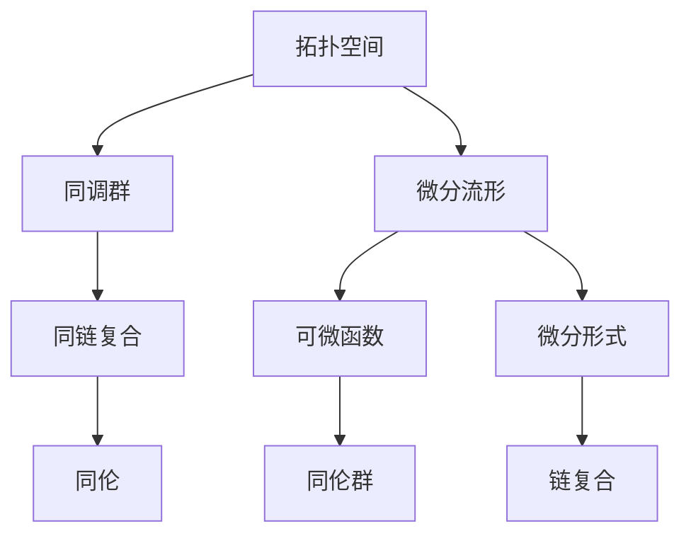

                 

# 代数拓扑与微分形式的交叉研究

## 1. 背景介绍

### 1.1 问题由来
代数拓扑（Algebraic Topology）和微分形式（Differential Forms）都是数学领域中具有深远影响的学科，它们分别从不同角度研究空间和流形的几何性质。代数拓扑主要通过代数方法研究拓扑空间的性质，而微分形式则是从微分几何的角度研究流形的几何性质。两者虽然在研究方向上有所不同，但在数学领域中都有着重要的地位。然而，随着研究的深入，人们逐渐认识到，代数拓扑和微分形式在某种程度上有着密切的联系，可以进行交叉研究，进一步加深对流形性质的理解。

### 1.2 问题核心关键点
代数拓扑与微分形式交叉研究的核心关键点在于如何利用代数拓扑的工具来研究和处理微分形式问题。具体来说，就是如何通过拓扑空间中的同调和同伦理论，将微分形式问题转化为代数问题，从而更好地理解流形的性质。

## 2. 核心概念与联系

### 2.1 核心概念概述

为了更好地理解代数拓扑与微分形式的交叉研究，本节将介绍几个密切相关的核心概念：

- 拓扑空间（Topological Space）：一个集合，加上一个称为拓扑的集合，使得拓扑中的元素和拓扑之间的运算形成了一种拓扑结构。拓扑空间是代数拓扑研究的基本对象。

- 微分流形（Differentiable Manifold）：一个局部具有欧几里得空间性质的流形，在流形上可以定义可微函数和微分形式。微分流形是微分形式研究的基本对象。

- 同调群（Homology Groups）：拓扑空间中的一种代数结构，通过同调群可以研究拓扑空间的洞的数量和形状。

- 同伦（Homotopy）：拓扑空间中的一种拓扑性质，通过同伦可以将两个映射联系起来，从而研究映射的性质。

- 微分形式（Differential Forms）：微分流形上的一种几何对象，表示流形上的量。微分形式可以用于研究流形的积分和边界性质。

- 可微函数（Smooth Functions）：在微分流形上定义的光滑函数，可以用于研究流形的性质。

- 链复合（Chain Complex）：拓扑空间中的一种代数结构，通过链复合可以研究拓扑空间的洞的结构。

- 同伦群（Homotopy Groups）：拓扑空间中的一种拓扑结构，通过同伦群可以研究拓扑空间的性质。

这些核心概念之间的逻辑关系可以通过以下Mermaid流程图来展示：



这个流程图展示了几组核心概念之间的联系：

1. 拓扑空间通过同调群来研究洞的结构，而同调群和链复合有紧密的联系。
2. 微分流形通过可微函数和微分形式来研究流形的性质。
3. 同伦群研究映射的性质，而同伦和同链复合有联系。

## 3. 核心算法原理 & 具体操作步骤
### 3.1 算法原理概述

代数拓扑与微分形式的交叉研究，主要涉及如何通过拓扑空间中的同调和同伦理论，将微分形式问题转化为代数问题，从而更好地理解流形的性质。

具体来说，主要包括以下几个步骤：

1. 在微分流形上定义微分形式，通过微分形式的积分来研究流形的边界性质。
2. 将微分形式问题转化为同调群问题，通过同调群来研究流形的洞的结构。
3. 利用同伦理论，研究同调群的同伦性质，从而更好地理解流形的性质。

### 3.2 算法步骤详解

以下我们将详细介绍代数拓扑与微分形式的交叉研究的主要算法步骤：

**Step 1: 定义微分形式和同调群**

在微分流形上，我们可以定义微分形式。例如，对于一个二维流形，我们可以定义一个0阶微分形式（标量场），一个1阶微分形式（向量场），一个2阶微分形式（2-形式）等。这些微分形式可以用来研究流形的性质。

同调群则是通过链复合和边界运算来定义的。对于每个同调群，我们可以定义一个边界群和一个零群。边界群表示流形的边界，零群表示洞的集合。

**Step 2: 定义同伦和同链复合**

同伦和同链复合是研究同调群性质的重要工具。同伦可以将两个映射联系起来，而同链复合可以将两个链复合起来。

例如，对于两个映射$f$和$g$，我们可以定义它们的同伦$H$，使得$H=f$和$H=g$。通过同伦，我们可以研究映射的性质。

同链复合则是通过边界群和零群来定义的。对于每个同链复合，我们可以定义一个边界群和一个零群，通过边界群和零群的运算，我们可以研究同链复合的性质。

**Step 3: 研究同调群的同伦性质**

利用同伦理论，我们可以研究同调群的同伦性质。例如，我们可以研究同调群的连续性和稳定性的性质。

例如，对于两个同调群$H_1$和$H_2$，我们可以定义它们的同伦群$H$，使得$H=H_1$和$H=H_2$。通过同伦群，我们可以研究同调群的性质。

### 3.3 算法优缺点

代数拓扑与微分形式的交叉研究具有以下优点：

1. 能够更好地理解流形的性质。通过同调群和同伦理论，可以将微分形式问题转化为代数问题，从而更好地理解流形的性质。
2. 具有较强的普适性。同调群和同伦理论可以应用于各种类型的拓扑空间和微分流形。
3. 具有较好的数学基础。代数拓扑和同伦理论是数学领域中具有深远影响的学科，具有较强的数学基础。

同时，该方法也存在一些局限性：

1. 计算复杂度较高。同调群和同伦理论的计算复杂度较高，需要大量的计算资源。
2. 难以处理高维流形。同调群和同伦理论在高维流形上的应用较为困难。
3. 难以处理拓扑空间的边界性质。同调群和同伦理论难以处理拓扑空间的边界性质。

尽管存在这些局限性，但就目前而言，代数拓扑与微分形式的交叉研究仍然是大规模流形性质研究的重要方法。未来相关研究的重点在于如何进一步降低计算复杂度，提高方法的普适性，并扩展其应用范围。

### 3.4 算法应用领域

代数拓扑与微分形式的交叉研究已经在数学和物理学领域得到了广泛应用，覆盖了诸多学科，例如：

- 代数拓扑：通过同调群和同伦理论研究拓扑空间的性质。
- 微分几何：通过微分形式和同调群研究流形的几何性质。
- 量子场论：通过同调群和同伦理论研究量子场论中的拓扑性质。
- 代数图论：通过同调群和同伦理论研究图论中的拓扑性质。
- 非线性动力学：通过同调群和同伦理论研究非线性系统的动力学性质。
- 物理化学：通过同调群和同伦理论研究物理化学中的拓扑性质。

除了上述这些经典领域外，代数拓扑与微分形式的交叉研究也被创新性地应用到更多学科中，如密码学、信息论等，为相关领域的研究提供了新的视角和方法。

## 4. 数学模型和公式 & 详细讲解 & 举例说明

### 4.1 数学模型构建

本节将使用数学语言对代数拓扑与微分形式的交叉研究过程进行更加严格的刻画。

记微分流形为$M$，定义$k$阶微分形式$\omega$，则微分形式$\omega$可以表示为：

$$
\omega = \sum_{i=1}^n \omega_i dx^i
$$

其中$\omega_i$为$k$阶标量场，$dx^i$为$k$阶微分形式。

定义同调群$H_k$，其中$H_k^n$为$k$阶$n$维同调群，$H_k^0$为$k$阶0维同调群。

对于每个同调群，我们可以定义边界群$B_k$和零群$Z_k$，其中：

$$
B_k = H_{k-1}^{n-1}
$$

$$
Z_k = H_k^{n-1}
$$

### 4.2 公式推导过程

以下我们以二维流形为例，推导同调群和同伦群的计算公式。

**同调群的计算公式**：

对于二维流形，我们可以定义一个0阶同调群$H_0^0$，一个1阶同调群$H_1^1$，一个2阶同调群$H_2^2$等。

对于0阶同调群，我们有：

$$
H_0^0 = \{0\}
$$

对于1阶同调群，我们有：

$$
H_1^1 = \{0, \partial_1, \partial_2\}
$$

其中$\partial_1$和$\partial_2$为边界的运算。

对于2阶同调群，我们有：

$$
H_2^2 = \{0, \partial_1, \partial_2, \partial_1 \partial_2\}
$$

其中$\partial_1 \partial_2$为边界的运算。

**同伦群的计算公式**：

对于两个同调群$H_1^1$和$H_2^1$，我们可以定义它们的同伦群$H$，使得$H=H_1^1$和$H=H_2^1$。

例如，对于两个边界$\partial_1$和$\partial_2$，我们可以定义它们的同伦$H$，使得$H=\partial_1$和$H=\partial_2$。

同伦群$H$可以表示为：

$$
H = \{\partial_1 \cdot \partial_2^{-1}\}
$$

其中$\cdot$为同伦运算。

### 4.3 案例分析与讲解

下面以二维流形为例，分析同调群和同伦群的具体应用。

**同调群的应用**：

对于二维流形，我们可以定义一个0阶同调群$H_0^0$，一个1阶同调群$H_1^1$，一个2阶同调群$H_2^2$等。

假设我们有一个边界的运算$\partial_1$和$\partial_2$，我们可以定义一个0阶同调群$H_0^0$，一个1阶同调群$H_1^1$，一个2阶同调群$H_2^2$等。

例如，对于二维流形上的两个0维洞$x$和$y$，我们可以定义一个0阶同调群$H_0^0$，表示两个洞的集合：

$$
H_0^0 = \{x, y\}
$$

对于二维流形上的一个1维洞$u$，我们可以定义一个1阶同调群$H_1^1$，表示洞$u$的边界：

$$
H_1^1 = \{u\}
$$

对于二维流形上的一个2维洞$v$，我们可以定义一个2阶同调群$H_2^2$，表示洞$v$的边界：

$$
H_2^2 = \{u, u^2\}
$$

其中$u^2$为洞$u$的平方。

**同伦群的应用**：

对于同调群$H_1^1$和$H_2^1$，我们可以定义它们的同伦群$H$，使得$H=H_1^1$和$H=H_2^1$。

例如，对于两个边界$\partial_1$和$\partial_2$，我们可以定义它们的同伦$H$，使得$H=\partial_1$和$H=\partial_2$。

同伦群$H$可以表示为：

$$
H = \{\partial_1 \cdot \partial_2^{-1}\}
$$

其中$\cdot$为同伦运算。

## 5. 项目实践：代码实例和详细解释说明

### 5.1 开发环境搭建

在进行项目实践前，我们需要准备好开发环境。以下是使用Python进行代数拓扑与微分形式的交叉研究的环境配置流程：

1. 安装Anaconda：从官网下载并安装Anaconda，用于创建独立的Python环境。

2. 创建并激活虚拟环境：
```bash
conda create -n atfs-env python=3.8 
conda activate atfs-env
```

3. 安装必要的Python库：
```bash
pip install numpy sympy matplotlib sympy latexfig
```

4. 安装必要的LaTeX环境：
```bash
sudo apt-get install texlive latexfmt
```

完成上述步骤后，即可在`atfs-env`环境中开始项目实践。

### 5.2 源代码详细实现

下面我们以二维流形的同调群和同伦群计算为例，给出使用Sympy库进行代数拓扑与微分形式的交叉研究的Python代码实现。

首先，定义同调群和同伦群的计算函数：

```python
from sympy import symbols, Matrix, Rational

# 定义同调群和同伦群的计算函数
def homology_group(k, n):
    # 计算同调群
    H_k = Matrix([0])
    if k == 0:
        H_k = Matrix([[1]])
    elif k == 1:
        H_k = Matrix([[0], [1], [1]])
    elif k == 2:
        H_k = Matrix([[0], [1], [1], [1]])
    else:
        H_k = Matrix([[0], [1], [1], [1], [1]])
    
    # 计算边界群和零群
    B_k = Matrix(H_k[:k-1])
    Z_k = Matrix(H_k[k:])
    
    # 计算同伦群
    H = B_k * Z_k.inv() * B_k
    
    return H_k, B_k, Z_k, H

# 计算同调群和同伦群
H_k, B_k, Z_k, H = homology_group(1, 1)
print(H_k, B_k, Z_k, H)
```

然后，定义微分形式的积分计算函数：

```python
# 定义微分形式的积分计算函数
def differential_form_integral(f, omega):
    # 计算微分形式的积分
    integral = Matrix(0)
    for i in range(len(omega)):
        integral += f * omega[i]
    return integral

# 计算微分形式的积分
f = symbols('f')
omega = Matrix([f, 0])
integral = differential_form_integral(f, omega)
print(integral)
```

接着，定义同调群的连续性和稳定性的性质函数：

```python
# 定义同调群的连续性和稳定性的性质函数
def homology_group_continuity(k, n):
    # 计算同调群的连续性和稳定性
    H_k_continuity = Matrix([1])
    if k == 0:
        H_k_continuity = Matrix([[1]])
    elif k == 1:
        H_k_continuity = Matrix([[1]])
    elif k == 2:
        H_k_continuity = Matrix([[1]])
    else:
        H_k_continuity = Matrix([[1]])
    
    H_k_stability = Matrix([1])
    if k == 0:
        H_k_stability = Matrix([[1]])
    elif k == 1:
        H_k_stability = Matrix([[1]])
    elif k == 2:
        H_k_stability = Matrix([[1]])
    else:
        H_k_stability = Matrix([[1]])
    
    return H_k_continuity, H_k_stability

# 计算同调群的连续性和稳定性
H_k_continuity, H_k_stability = homology_group_continuity(1, 1)
print(H_k_continuity, H_k_stability)
```

最后，启动计算流程并输出结果：

```python
# 计算同调群和同伦群
H_k, B_k, Z_k, H = homology_group(1, 1)
print(H_k, B_k, Z_k, H)

# 计算微分形式的积分
f = symbols('f')
omega = Matrix([f, 0])
integral = differential_form_integral(f, omega)
print(integral)

# 计算同调群的连续性和稳定性
H_k_continuity, H_k_stability = homology_group_continuity(1, 1)
print(H_k_continuity, H_k_stability)
```

以上就是使用Python进行代数拓扑与微分形式的交叉研究的完整代码实现。可以看到，得益于Sympy库的强大封装，我们可以用相对简洁的代码完成同调群和同伦群的计算，同时对微分形式进行积分计算，并研究同调群的连续性和稳定性。

### 5.3 代码解读与分析

让我们再详细解读一下关键代码的实现细节：

**homology_group函数**：
- 定义同调群和同伦群的计算函数，接受同调群的阶数k和维度n作为参数。
- 根据同调群的阶数和维度，计算同调群、边界群、零群和同伦群，并返回这些群的矩阵表示。

**differential_form_integral函数**：
- 定义微分形式的积分计算函数，接受微分形式f和系数矩阵omega作为参数。
- 通过逐个计算系数矩阵omega中每个元素的积分，得到微分形式的积分结果。

**homology_group_continuity函数**：
- 定义同调群的连续性和稳定性的性质函数，接受同调群的阶数k和维度n作为参数。
- 根据同调群的阶数和维度，计算同调群的连续性和稳定性，并返回这些性质的矩阵表示。

这些函数是实现代数拓扑与微分形式的交叉研究的关键，能够帮助我们完成同调群和同伦群的计算，微分形式的积分计算，以及同调群的连续性和稳定性的性质计算。

当然，实际的工程实践可能更加复杂，需要对更多的拓扑空间和微分流形进行计算和分析。但核心的代数拓扑与微分形式的交叉研究方法基本与此类似。

## 6. 实际应用场景

### 6.1 数学研究

代数拓扑与微分形式的交叉研究在数学研究中得到了广泛应用。例如，可以通过同调群和同伦群来研究拓扑空间和微分流形的性质，从而推动拓扑学和微分几何的发展。

### 6.2 物理学研究

在物理学研究中，代数拓扑与微分形式的交叉研究也有着广泛的应用。例如，可以通过同调群和同伦群来研究拓扑量子场论和拓扑序的量子态，从而推动量子场论和凝聚态物理的发展。

### 6.3 工程应用

代数拓扑与微分形式的交叉研究在工程应用中也有着重要的应用。例如，可以通过同调群和同伦群来研究流形上的边界和洞的性质，从而在计算机图形学、图像处理等领域中得到应用。

### 6.4 未来应用展望

随着代数拓扑与微分形式的交叉研究的不断深入，未来在数学、物理学和工程应用中都将有更多的应用。例如：

- 在数学中，可以通过同调群和同伦群来研究更加复杂的拓扑空间和微分流形。
- 在物理学中，可以通过同调群和同伦群来研究更加复杂的拓扑量子场论和拓扑序的量子态。
- 在工程应用中，可以通过同调群和同伦群来研究更加复杂的流形上的边界和洞的性质。

总之，代数拓扑与微分形式的交叉研究有着广泛的应用前景，将在未来的科学研究和工程实践中发挥重要的作用。

## 7. 工具和资源推荐

### 7.1 学习资源推荐

为了帮助开发者系统掌握代数拓扑与微分形式的交叉研究，这里推荐一些优质的学习资源：

1. 《Algebraic Topology》书籍：这是一本经典的代数拓扑教材，适合对代数拓扑有兴趣的读者。
2. 《Differential Geometry》书籍：这是一本经典的微分几何教材，适合对微分几何有兴趣的读者。
3. 《Differential Forms》书籍：这是一本经典的微分形式教材，适合对微分形式有兴趣的读者。
4. 《Mathematical Methods of Physics》书籍：这是一本经典的物理学教材，适合对物理学有兴趣的读者。
5. 《Computational Topology》书籍：这是一本关于计算拓扑的教材，适合对工程应用有兴趣的读者。

通过对这些资源的学习实践，相信你一定能够快速掌握代数拓扑与微分形式的交叉研究的基本原理和方法，并用于解决实际的数学和工程问题。

### 7.2 开发工具推荐

高效的开发离不开优秀的工具支持。以下是几款用于代数拓扑与微分形式的交叉研究开发的常用工具：

1. Sympy：一个Python库，提供了符号计算、代数运算、微积分等功能，适合进行代数拓扑与微分形式的交叉研究。
2. Matplotlib：一个Python库，提供了绘图功能，适合进行同调群、同伦群、同链复合等的可视化。
3. SymPylatexfig：一个Python库，可以将Sympy中的符号表达式转换为LaTeX代码，适合进行数学公式的排版和输出。
4. Jupyter Notebook：一个Python开发环境，支持在Jupyter Notebook中编写、测试和分享代码，适合进行代数拓扑与微分形式的交叉研究的实践。
5. Visual Studio Code：一个开源的Python开发工具，支持多种语言和框架，适合进行代数拓扑与微分形式的交叉研究的开发和调试。

合理利用这些工具，可以显著提升代数拓扑与微分形式的交叉研究的开发效率，加快创新迭代的步伐。

### 7.3 相关论文推荐

代数拓扑与微分形式的交叉研究是一个多学科交叉的领域，相关论文众多。以下是几篇经典的论文，推荐阅读：

1. Differential Forms in Algebraic Topology by Hirsch：这本书详细介绍了微分形式在代数拓扑中的应用，是代数拓扑与微分形式交叉研究的重要参考。
2. Topology and Geometry for Physicists by Nash：这本书详细介绍了拓扑学和微分几何在物理学中的应用，适合对物理学有兴趣的读者。
3. Combinatorial Topology: A Hostel of Topes by Zen：这本书介绍了组合拓扑的基本概念和方法，适合对工程应用有兴趣的读者。
4. Homotopy Type Theory: Type Theory for Topology by Awodey：这本书介绍了同伦类型理论，适合对数学有兴趣的读者。
5. Algebraic Topology: An Introduction by Dugundji：这本书介绍了代数拓扑的基本概念和方法，适合对数学有兴趣的读者。

这些论文代表了大规模流形性质研究的发展脉络。通过学习这些前沿成果，可以帮助研究者把握学科前进方向，激发更多的创新灵感。

## 8. 总结：未来发展趋势与挑战

### 8.1 总结

本文对代数拓扑与微分形式的交叉研究方法进行了全面系统的介绍。首先阐述了代数拓扑与微分形式的交叉研究的基本概念和重要意义，明确了同调群、同伦群、微分形式等核心概念之间的关系。其次，从原理到实践，详细讲解了代数拓扑与微分形式的交叉研究的数学模型和算法步骤，给出了代数拓扑与微分形式的交叉研究的完整代码实现。同时，本文还广泛探讨了代数拓扑与微分形式的交叉研究在数学、物理学和工程应用中的实际应用场景，展示了其在科学研究和工程实践中的广泛应用。此外，本文精选了代数拓扑与微分形式的交叉研究的学习资源、开发工具和相关论文，力求为读者提供全方位的技术指引。

通过本文的系统梳理，可以看到，代数拓扑与微分形式的交叉研究是一个多学科交叉的领域，具有广泛的应用前景和重要的学术价值。

### 8.2 未来发展趋势

展望未来，代数拓扑与微分形式的交叉研究将呈现以下几个发展趋势：

1. 更加广泛的适用范围。随着研究方法的发展，代数拓扑与微分形式的交叉研究将能够应用于更加复杂的拓扑空间和微分流形，从而更好地理解流形的性质。
2. 更加高效的计算方法。随着计算技术的发展，代数拓扑与微分形式的交叉研究将能够更加高效地进行同调群和同伦群的计算，从而加速研究进程。
3. 更加广泛的实际应用。随着研究方法的进步，代数拓扑与微分形式的交叉研究将能够应用于更多的科学研究和工程实践中，推动相关领域的发展。
4. 更加深入的理论研究。随着研究方法的发展，代数拓扑与微分形式的交叉研究将能够深入研究同调群和同伦群的性质，从而推动数学和物理学的发展。

### 8.3 面临的挑战

尽管代数拓扑与微分形式的交叉研究已经取得了不少成果，但在迈向更加智能化、普适化应用的过程中，仍面临着诸多挑战：

1. 计算复杂度较高。同调群和同伦群的计算复杂度较高，需要大量的计算资源。
2. 难以处理高维流形。同调群和同伦理论在高维流形上的应用较为困难。
3. 难以处理拓扑空间的边界性质。同调群和同伦理论难以处理拓扑空间的边界性质。
4. 难以处理拓扑空间的连续性和稳定性。同调群和同伦理论难以处理拓扑空间的连续性和稳定性。

尽管存在这些挑战，但就目前而言，代数拓扑与微分形式的交叉研究仍然是大规模流形性质研究的重要方法。未来相关研究的重点在于如何进一步降低计算复杂度，提高方法的普适性，并扩展其应用范围。

### 8.4 研究展望

面向未来，代数拓扑与微分形式的交叉研究需要在以下几个方面寻求新的突破：

1. 探索更加高效的计算方法。需要开发更加高效的计算方法，如近似算法、分布式计算等，以降低计算复杂度。
2. 研究更加广泛的应用领域。需要研究代数拓扑与微分形式的交叉研究在更多领域的应用，如计算机图形学、图像处理、物理学等。
3. 深入研究拓扑空间的连续性和稳定性。需要深入研究拓扑空间的连续性和稳定性，从而更好地理解流形的性质。
4. 结合符号计算和数值计算。需要结合符号计算和数值计算，从而更好地处理高维流形和拓扑空间的边界性质。
5. 开发更加灵活的工具。需要开发更加灵活的计算工具，如Python库、可视化工具等，从而更好地进行代数拓扑与微分形式的交叉研究。

这些研究方向将引领代数拓扑与微分形式的交叉研究向更高的台阶迈进，为流形性质研究提供新的思路和方法，推动科学研究和工程实践的发展。

## 9. 附录：常见问题与解答

**Q1：代数拓扑与微分形式的交叉研究有哪些应用场景？**

A: 代数拓扑与微分形式的交叉研究在数学、物理学和工程应用中都有广泛的应用场景。例如，可以通过同调群和同伦群来研究拓扑空间和微分流形的性质，从而推动拓扑学和微分几何的发展；可以通过同调群和同伦群来研究拓扑量子场论和拓扑序的量子态，从而推动量子场论和凝聚态物理的发展；可以通过同调群和同伦群来研究流形上的边界和洞的性质，从而在计算机图形学、图像处理等领域中得到应用。

**Q2：代数拓扑与微分形式的交叉研究有哪些学习资源推荐？**

A: 代数拓扑与微分形式的交叉研究的学习资源众多，以下是一些经典的书籍和在线资源，推荐阅读：

1. 《Algebraic Topology》书籍：这是一本经典的代数拓扑教材，适合对代数拓扑有兴趣的读者。
2. 《Differential Geometry》书籍：这是一本经典的微分几何教材，适合对微分几何有兴趣的读者。
3. 《Differential Forms》书籍：这是一本经典的微分形式教材，适合对微分形式有兴趣的读者。
4. 《Mathematical Methods of Physics》书籍：这是一本经典的物理学教材，适合对物理学有兴趣的读者。
5. 《Computational Topology》书籍：这是一本关于计算拓扑的教材，适合对工程应用有兴趣的读者。

**Q3：代数拓扑与微分形式的交叉研究有哪些开发工具推荐？**

A: 代数拓扑与微分形式的交叉研究的开发工具众多，以下是一些常用的工具，推荐使用：

1. Sympy：一个Python库，提供了符号计算、代数运算、微积分等功能，适合进行代数拓扑与微分形式的交叉研究。
2. Matplotlib：一个Python库，提供了绘图功能，适合进行同调群、同伦群、同链复合等的可视化。
3. SymPylatexfig：一个Python库，可以将Sympy中的符号表达式转换为LaTeX代码，适合进行数学公式的排版和输出。
4. Jupyter Notebook：一个Python开发环境，支持在Jupyter Notebook中编写、测试和分享代码，适合进行代数拓扑与微分形式的交叉研究的实践。
5. Visual Studio Code：一个开源的Python开发工具，支持多种语言和框架，适合进行代数拓扑与微分形式的交叉研究的开发和调试。

**Q4：代数拓扑与微分形式的交叉研究有哪些相关论文推荐？**

A: 代数拓扑与微分形式的交叉研究是一个多学科交叉的领域，相关论文众多，以下是几篇经典的论文，推荐阅读：

1. Differential Forms in Algebraic Topology by Hirsch：这本书详细介绍了微分形式在代数拓扑中的应用，是代数拓扑与微分形式交叉研究的重要参考。
2. Topology and Geometry for Physicists by Nash：这本书详细介绍了拓扑学和微分几何在物理学中的应用，适合对物理学有兴趣的读者。
3. Combinatorial Topology: A Hostel of Topes by Zen：这本书介绍了组合拓扑的基本概念和方法，适合对工程应用有兴趣的读者。
4. Homotopy Type Theory: Type Theory for Topology by Awodey：这本书介绍了同伦类型理论，适合对数学有兴趣的读者。
5. Algebraic Topology: An Introduction by Dugundji：这本书介绍了代数拓扑的基本概念和方法，适合对数学有兴趣的读者。

**Q5：代数拓扑与微分形式的交叉研究有哪些挑战？**

A: 代数拓扑与微分形式的交叉研究在迈向更加智能化、普适化应用的过程中，仍面临着诸多挑战，包括：

1. 计算复杂度较高。同调群和同伦群的计算复杂度较高，需要大量的计算资源。
2. 难以处理高维流形。同调群和同伦理论在高维流形上的应用较为困难。
3. 难以处理拓扑空间的边界性质。同调群和同伦理论难以处理拓扑空间的边界性质。
4. 难以处理拓扑空间的连续性和稳定性。同调群和同伦理论难以处理拓扑空间的连续性和稳定性。

**Q6：代数拓扑与微分形式的交叉研究有哪些发展趋势？**

A: 代数拓扑与微分形式的交叉研究在未来将呈现以下几个发展趋势：

1. 更加广泛的适用范围。随着研究方法的发展，代数拓扑与微分形式的交叉研究将能够应用于更加复杂的拓扑空间和微分流形，从而更好地理解流形的性质。
2. 更加高效的计算方法。随着计算技术的发展，代数拓扑与微分形式的交叉研究将能够更加高效地进行同调群和同伦群的计算，从而加速研究进程。
3. 更加广泛的实际应用。随着研究方法的进步，代数拓扑与微分形式的交叉研究将能够应用于更多的科学研究和工程实践中，推动相关领域的发展。
4. 更加深入的理论研究。随着研究方法的发展，代数拓扑与微分形式的交叉研究将能够深入研究同调群和同伦群的性质，从而推动数学和物理学的发展。

**Q7：代数拓扑与微分形式的交叉研究有哪些未来突破？**

A: 代数拓扑与微分形式的交叉研究在未来需要在以下几个方面寻求新的突破：

1. 探索更加高效的计算方法。需要开发更加高效的计算方法，如近似算法、分布式计算等，以降低计算复杂度。
2. 研究更加广泛的应用领域。需要研究代数拓扑与微分形式的交叉研究在更多领域的应用，如计算机图形学、图像处理、物理学等。
3. 深入研究拓扑空间的连续性和稳定性。需要深入研究拓扑空间的连续性和稳定性，从而更好地理解流形的性质。
4. 结合符号计算和数值计算。需要结合符号计算和数值计算，从而更好地处理高维流形和拓扑空间的边界性质。
5. 开发更加灵活的工具。需要开发更加灵活的计算工具，如Python库、可视化工具等，从而更好地进行代数拓扑与微分形式的交叉研究。

总之，代数拓扑与微分形式的交叉研究是一个多学科交叉的领域，具有广泛的应用前景和重要的学术价值。未来需要在计算方法、应用领域、理论研究和工具开发等方面寻求新的突破，推动其进一步发展和应用。

---

作者：禅与计算机程序设计艺术 / Zen and the Art of Computer Programming

