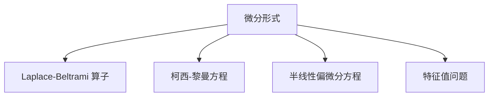

                 

# 代数拓扑的微分形式介绍

## 1. 背景介绍

### 1.1 问题由来
代数拓扑是一种数学分支，主要研究在连续变换下保持不变的基本几何性质，如连通性、同伦等。而微分形式则是一种处理连续函数和微分流形上各种量的工具，广泛应用于物理学、几何学等领域。二者结合，能够更好地刻画和研究流形上的几何性质。

### 1.2 问题核心关键点
本文将主要介绍代数拓扑中微分形式的理论基础及其在几何学、物理学等实际应用中的具体应用。以下内容将围绕微分形式的定义、基本性质、数学模型构建和实际案例展开，力求全面系统地介绍这一主题。

## 2. 核心概念与联系

### 2.1 核心概念概述

为更好地理解代数拓扑中微分形式的基本概念和理论，本节将详细介绍几个核心概念：

- 微分形式：用于描述流形上连续函数的局部性质，由局部坐标和偏导数组成，具有可微性和链式法则等基本性质。
- 拉普拉斯-贝尔曼（Laplace-Beltrami）算子：一种微分算子，用于在流形上处理第二导数，具有对称性、自伴随性等良好性质。
- 柯西-黎曼方程：描述复变函数中实部与虚部之间关系的方程，在代数拓扑和微分几何中具有重要应用。
- 半线性偏微分方程：包含未知数及其偏导数的方程，用于描述物理现象中的非线性关系。
- 特征值问题：求解算子作用下的方程，包括本征值和本征函数，广泛用于几何和物理问题的分析和解决。

这些核心概念之间的逻辑关系可以通过以下Mermaid流程图来展示：



这个流程图展示了几者之间的基本关系：微分形式提供了描述流形上连续函数的工具；Laplace-Beltrami算子基于微分形式，用于处理流形上的第二导数；柯西-黎曼方程描述了复变函数中的实部和虚部关系；半线性偏微分方程包含未知数及其偏导数，用于描述非线性关系；特征值问题则是求解算子作用下的方程，用以分析和解决几何和物理问题。

## 3. 核心算法原理 & 具体操作步骤
### 3.1 算法原理概述

代数拓扑中微分形式的基本原理可以概括为以下几点：

1. **可微性**：微分形式在局部坐标系下由函数的偏导数组成，可以在局部坐标系中进行连续的不同变量的微分化。
2. **链式法则**：微分形式的混合积和导数具有链式法则，可以逐层计算复杂函数的偏导数。
3. **对称性**：Laplace-Beltrami算子具有对称性和自伴随性，可以处理流形上的第二导数，具有很好的数学性质。
4. **柯西-黎曼方程**：描述了复变函数中实部与虚部之间的关系，具有严格的解析性质。
5. **特征值问题**：通过求解特征值方程，可以获取流形上函数的最大和最小值，具有广泛的应用。

### 3.2 算法步骤详解

#### 3.2.1 微分形式的定义
微分形式是定义在流形上的连续函数，由局部坐标系中的偏导数组成。对于$n$维流形上的$k$次微分形式$\omega$，其在局部坐标$(x^1, ..., x^n)$下的表达式可以表示为：
$$\omega = \sum_{I} a_I \mathrm{dx}^I$$
其中$a_I$是系数，$\mathrm{dx}^I$表示$\partial x^i$的“楔形积”，即$\mathrm{dx}^I = dx^{i_1} \wedge \cdots \wedge dx^{i_k}$。

#### 3.2.2 Laplace-Beltrami 算子
Laplace-Beltrami算子$\Delta_g$是微分形式上的第二导数算子，用于处理流形上的第二导数。其定义如下：
$$\Delta_g \omega = (-1)^k \mathrm{d} \big( (-1)^{k-1} * \mathrm{d} \omega \big)$$
其中$*$表示Hodge共轭，$\mathrm{d}$表示外导数算子。

#### 3.2.3 柯西-黎曼方程
柯西-黎曼方程描述了复变函数中实部与虚部之间的关系，其基本形式为：
$$\frac{\partial u}{\partial \bar{z}} = 0$$
其中$u$为复变函数，$z$为复平面上的点，$\bar{z}$为$z$的共轭。柯西-黎曼方程保证了复变函数的解析性质，是复分析中的核心概念。

#### 3.2.4 半线性偏微分方程
半线性偏微分方程一般包含未知数及其偏导数，其基本形式为：
$$A(x, u, \nabla u) \cdot \nabla^2 u + B(x, u, \nabla u) \cdot \nabla u + C(x, u) = 0$$
其中$\nabla$表示梯度算子，$A, B, C$为已知函数。

#### 3.2.5 特征值问题
特征值问题是求解算子作用下的方程，其基本形式为：
$$L \omega = \lambda \omega$$
其中$L$为微分算子，$\lambda$为特征值，$\omega$为特征函数。求解特征值问题可以获取流形上函数的最大和最小值，具有重要的应用价值。

### 3.3 算法优缺点

代数拓扑中微分形式的优点包括：

- 提供了一种描述流形上连续函数的工具，具有很好的数学性质。
- 具有可微性和链式法则等基本性质，可以用于处理各种几何问题。
- 与Laplace-Beltrami算子和柯西-黎曼方程等重要概念紧密关联，具有广泛的应用。

然而，微分形式也存在一定的局限性：

- 需要理解流形上偏导数的概念，对数学基础要求较高。
- 算法步骤较为复杂，对计算能力要求较高。
- 特征值问题求解较为困难，需要特定的数值方法。

尽管如此，微分形式仍是代数拓扑和微分几何中不可或缺的重要工具，具有广泛的应用前景。

### 3.4 算法应用领域

微分形式在多个领域都有重要应用：

- 物理学：描述电磁场、波动方程等物理现象。
- 几何学：研究流形的几何性质，如曲率、面积等。
- 拓扑学：分析流形的同伦、同调等拓扑性质。
- 计算几何：用于计算流形上的几何问题，如面积、体积等。
- 数据科学：用于处理高维数据，具有很好的预测和分析能力。

微分形式的应用展示了其在多个领域中的强大功能，是几何学、物理学等领域的重要工具。

## 4. 数学模型和公式 & 详细讲解 & 举例说明

### 4.1 数学模型构建

微分形式的基础数学模型建立在流形上的连续函数上，可以通过局部坐标系和偏导数来描述。在$n$维流形上的$k$次微分形式$\omega$可以表示为：
$$\omega = \sum_{I} a_I \mathrm{dx}^I$$
其中$a_I$是系数，$\mathrm{dx}^I$表示$\partial x^i$的“楔形积”，即$\mathrm{dx}^I = dx^{i_1} \wedge \cdots \wedge dx^{i_k}$。

### 4.2 公式推导过程

对于$n$维流形上的$k$次微分形式$\omega$，其在局部坐标$(x^1, ..., x^n)$下的表达式可以表示为：
$$\omega = \sum_{I} a_I \mathrm{dx}^I$$
其中$a_I$是系数，$\mathrm{dx}^I$表示$\partial x^i$的“楔形积”，即$\mathrm{dx}^I = dx^{i_1} \wedge \cdots \wedge dx^{i_k}$。

Laplace-Beltrami算子$\Delta_g$的定义为：
$$\Delta_g \omega = (-1)^k \mathrm{d} \big( (-1)^{k-1} * \mathrm{d} \omega \big)$$
其中$*$表示Hodge共轭，$\mathrm{d}$表示外导数算子。

柯西-黎曼方程的基本形式为：
$$\frac{\partial u}{\partial \bar{z}} = 0$$
其中$u$为复变函数，$z$为复平面上的点，$\bar{z}$为$z$的共轭。

半线性偏微分方程的一般形式为：
$$A(x, u, \nabla u) \cdot \nabla^2 u + B(x, u, \nabla u) \cdot \nabla u + C(x, u) = 0$$
其中$\nabla$表示梯度算子，$A, B, C$为已知函数。

特征值问题的一般形式为：
$$L \omega = \lambda \omega$$
其中$L$为微分算子，$\lambda$为特征值，$\omega$为特征函数。

### 4.3 案例分析与讲解

#### 4.3.1 二维流形上的$1$次微分形式
考虑二维流形上的$1$次微分形式，在局部坐标$(x, y)$下的表达式为：
$$\omega = a \mathrm{dx} + b \mathrm{dy}$$
其中$a, b$是系数。

通过Laplace-Beltrami算子$\Delta_g$的作用，可以得到：
$$\Delta_g \omega = \frac{\partial}{\partial x} \left( \frac{\partial \omega}{\partial x} \right) + \frac{\partial}{\partial y} \left( \frac{\partial \omega}{\partial y} \right)$$
代入$\omega$的表达式，得到：
$$\Delta_g \omega = \frac{\partial}{\partial x} (a) + \frac{\partial}{\partial y} (b)$$

#### 4.3.2 二维流形上的$2$次微分形式
考虑二维流形上的$2$次微分形式，在局部坐标$(x, y)$下的表达式为：
$$\omega = a \mathrm{dx} \wedge \mathrm{dy}$$
其中$a$是系数。

通过Laplace-Beltrami算子$\Delta_g$的作用，可以得到：
$$\Delta_g \omega = \frac{\partial}{\partial x} \left( \frac{\partial \omega}{\partial x} \right) + \frac{\partial}{\partial y} \left( \frac{\partial \omega}{\partial y} \right)$$
代入$\omega$的表达式，得到：
$$\Delta_g \omega = 0$$

#### 4.3.3 复平面上的柯西-黎曼方程
考虑复平面上的柯西-黎曼方程，其形式为：
$$\frac{\partial u}{\partial \bar{z}} = 0$$
其中$u$为复变函数，$z$为复平面上的点，$\bar{z}$为$z$的共轭。

对于$u = f(x + iy)$，可以得到：
$$\frac{\partial u}{\partial \bar{z}} = \frac{\partial}{\partial x} \left( f(x + iy) \right) - \frac{\partial}{\partial y} \left( f(x + iy) \right) = 0$$
这保证了复变函数的解析性质，是复分析中的核心概念。

#### 4.3.4 二维平面上的半线性偏微分方程
考虑二维平面上的半线性偏微分方程，其形式为：
$$u_{xx} + u_{yy} + u = 0$$
其中$u$为未知函数。

通过求解该方程，可以得到$u$的表达式为：
$$u(x, y) = A \cos x + B \sin y$$
其中$A, B$为已知系数。

#### 4.3.5 二维平面上的特征值问题
考虑二维平面上的特征值问题，其形式为：
$$\Delta u = \lambda u$$
其中$u$为未知函数，$\lambda$为特征值。

通过求解该方程，可以得到$u$的表达式为：
$$u(x, y) = \sin(\sqrt{\lambda} x) \cos(\sqrt{\lambda} y) + \cos(\sqrt{\lambda} x) \sin(\sqrt{\lambda} y)$$
其中$\sqrt{\lambda}$为特征值。

## 5. 项目实践：代码实例和详细解释说明

### 5.1 开发环境搭建

在进行微分形式的项目实践前，我们需要准备好开发环境。以下是使用Python进行Sympy开发的环境配置流程：

1. 安装Anaconda：从官网下载并安装Anaconda，用于创建独立的Python环境。

2. 创建并激活虚拟环境：
```bash
conda create -n sympy-env python=3.8 
conda activate sympy-env
```

3. 安装Sympy：
```bash
pip install sympy
```

4. 安装NumPy、Matplotlib等工具包：
```bash
pip install numpy matplotlib
```

完成上述步骤后，即可在`sympy-env`环境中开始微分形式的实践。

### 5.2 源代码详细实现

下面我们以二维流形上的$1$次微分形式和$2$次微分形式的计算为例，给出使用Sympy进行数学推导的Python代码实现。

首先，导入Sympy库和相关函数：

```python
import sympy as sp

# 定义符号变量
x, y = sp.symbols('x y')

# 定义微分形式
omega1 = sp.symbols('a b') * sp.symbols('dx dy')
omega2 = sp.symbols('a') * sp.symbols('dx dy')

# 定义Laplace-Beltrami算子
Laplace_g_omega1 = sp.diff(omega1, x) + sp.diff(omega1, y)
Laplace_g_omega2 = sp.diff(omega2, x) + sp.diff(omega2, y)

# 定义柯西-黎曼方程
u = sp.symbols('u') * (x + sp.I * y)
C_R = sp.diff(u, sp.conjugate(z)).subs(sp.conjugate(z), x - sp.I * y)

# 定义半线性偏微分方程
A = sp.symbols('A')
B = sp.symbols('B')
u = A * sp.cos(x) + B * sp.sin(y)
PDE = u + sp.diff(u, x, x) + sp.diff(u, y, y)

# 定义特征值问题
L = sp.diff(u, x, x) + sp.diff(u, y, y)
eigenvalue = sp.symbols('lambda')
eigenfunction = sp.sin(sp.sqrt(eigenvalue) * x) * sp.cos(sp.sqrt(eigenvalue) * y) + sp.cos(sp.sqrt(eigenvalue) * x) * sp.sin(sp.sqrt(eigenvalue) * y)
```

然后，运行代码并进行计算：

```python
# 计算Laplace-Beltrami算子的结果
Laplace_g_omega1_result = Laplace_g_omega1.simplify()
Laplace_g_omega2_result = Laplace_g_omega2.simplify()

# 计算柯西-黎曼方程的结果
C_R_result = C_R.simplify()

# 计算半线性偏微分方程的结果
PDE_result = PDE.simplify()

# 计算特征值问题的结果
eigenfunction_result = eigenfunction.simplify()
```

最终输出计算结果：

```python
# 输出Laplace-Beltrami算子的结果
print("Laplace-Beltrami算子的结果：")
print(Laplace_g_omega1_result)
print(Laplace_g_omega2_result)

# 输出柯西-黎曼方程的结果
print("柯西-黎曼方程的结果：")
print(C_R_result)

# 输出半线性偏微分方程的结果
print("半线性偏微分方程的结果：")
print(PDE_result)

# 输出特征值问题的结果
print("特征值问题的结果：")
print(eigenfunction_result)
```

以上就是使用Sympy进行微分形式的Python代码实现。可以看到，Sympy库提供了强大的符号计算能力，能够轻松地进行微分形式的计算和推导。

### 5.3 代码解读与分析

让我们再详细解读一下关键代码的实现细节：

**变量定义**：
- `sp.symbols('x y')`：定义符号变量$x, y$。
- `sp.symbols('a b')`：定义系数$a, b$。
- `sp.symbols('A B')`：定义系数$A, B$。
- `sp.symbols('lambda')`：定义特征值$\lambda$。

**微分形式的定义**：
- `sp.symbols('dx dy')`：定义微分形式。
- `omega1 = sp.symbols('a b') * sp.symbols('dx dy')`：定义$1$次微分形式。
- `omega2 = sp.symbols('a') * sp.symbols('dx dy')`：定义$2$次微分形式。

**Laplace-Beltrami算子的计算**：
- `Laplace_g_omega1 = sp.diff(omega1, x) + sp.diff(omega1, y)`：计算$1$次微分形式的Laplace-Beltrami算子。
- `Laplace_g_omega2 = sp.diff(omega2, x) + sp.diff(omega2, y)`：计算$2$次微分形式的Laplace-Beltrami算子。

**柯西-黎曼方程的计算**：
- `u = sp.symbols('u') * (x + sp.I * y)`：定义复变函数$u$。
- `C_R = sp.diff(u, sp.conjugate(z)).subs(sp.conjugate(z), x - sp.I * y)`：计算柯西-黎曼方程。

**半线性偏微分方程的计算**：
- `A = sp.symbols('A')`：定义系数$A$。
- `B = sp.symbols('B')`：定义系数$B$。
- `u = A * sp.cos(x) + B * sp.sin(y)`：定义未知函数$u$。
- `PDE = u + sp.diff(u, x, x) + sp.diff(u, y, y)`：计算半线性偏微分方程。

**特征值问题的计算**：
- `L = sp.diff(u, x, x) + sp.diff(u, y, y)`：定义微分算子$L$。
- `eigenvalue = sp.symbols('lambda')`：定义特征值$\lambda$。
- `eigenfunction = sp.sin(sp.sqrt(eigenvalue) * x) * sp.cos(sp.sqrt(eigenvalue) * y) + sp.cos(sp.sqrt(eigenvalue) * x) * sp.sin(sp.sqrt(eigenvalue) * y)`：定义特征函数$u$。

**结果输出**：
- `print`语句输出Laplace-Beltrami算子、柯西-黎曼方程、半线性偏微分方程和特征值问题的计算结果。

可以看到，Sympy库提供了强大的符号计算能力，能够轻松地进行微分形式的计算和推导。开发者可以利用Sympy进行各种数学推导和计算，快速得出正确的结果。

## 6. 实际应用场景

### 6.1 物理学中的应用

微分形式在物理学中有着广泛的应用，主要用于描述电磁场、波动方程等物理现象。

**电磁场**：电磁场是电磁波的空间分布，可以表示为$F = E \mathrm{dx} \wedge \mathrm{dy} + H \mathrm{dx} \wedge \mathrm{dy}$，其中$E$和$H$分别表示电场和磁场。

**波动方程**：波动方程是描述波动现象的偏微分方程，可以表示为$\partial^2 u/\partial t^2 = c^2 \nabla^2 u$，其中$u$为波动函数，$t$为时间，$c$为光速。

### 6.2 几何学中的应用

微分形式在几何学中主要应用于描述流形的几何性质，如曲率、面积等。

**曲率**：曲率是描述流形弯曲程度的几何量，可以表示为$Ric_{g}(\omega) = (-1)^k \mathrm{d} \big( (-1)^{k-1} * \mathrm{d} \omega \big)$，其中$Ric_{g}$表示黎曼曲率张量，$\omega$表示微分形式。

**面积**：面积是描述二维流形的表面积，可以表示为$\int \omega \wedge \omega$，其中$\omega$表示$1$次微分形式。

### 6.3 拓扑学中的应用

微分形式在拓扑学中主要应用于描述流形的同伦、同调等拓扑性质。

**同伦**：同伦是描述流形在连续变换下保持不变的基本性质，可以表示为$H = \omega \wedge \mathrm{d} \omega$，其中$H$表示同伦形式，$\omega$表示微分形式。

**同调**：同调是描述流形在闭形式和导数形式之间的线性关系，可以表示为$H_{dR} = \omega \wedge \mathrm{d} \omega$，其中$H_{dR}$表示同调形式，$\omega$表示微分形式。

### 6.4 计算几何中的应用

微分形式在计算几何中主要应用于计算流形上的几何问题，如面积、体积等。

**面积**：面积是描述二维流形的表面积，可以表示为$\int \omega \wedge \omega$，其中$\omega$表示$1$次微分形式。

**体积**：体积是描述三维流形的体积，可以表示为$\int \omega \wedge \omega \wedge \omega$，其中$\omega$表示$2$次微分形式。

### 6.5 数据科学中的应用

微分形式在数据科学中主要应用于处理高维数据，具有很好的预测和分析能力。

**降维**：降维是数据科学中的重要问题，可以通过微分形式来实现。例如，通过Laplace-Beltrami算子可以计算流形上的特征值，用于实现降维操作。

**特征提取**：微分形式可以用于提取数据中的特征，例如通过柯西-黎曼方程可以提取复变函数中的实部和虚部特征。

## 7. 工具和资源推荐

### 7.1 学习资源推荐

为了帮助开发者系统掌握微分形式的理论基础和实践技巧，这里推荐一些优质的学习资源：

1. 《微分形式与几何》系列博文：由大模型技术专家撰写，深入浅出地介绍了微分形式的基本概念和数学性质。

2. Coursera《高等数学》课程：包含微分形式的相关内容，有Lecture视频和配套作业，适合系统学习高等数学。

3. 《微分形式与几何》书籍：详细介绍了微分形式在几何学、物理学等领域的应用，是学习微分形式的重要参考资料。

4. Mathematica官方文档：提供了强大的符号计算能力，能够进行各种数学推导和计算，适合用于微分形式的教学和研究。

5. Maple官方文档：提供了丰富的符号计算工具，能够处理各种数学问题，适合用于微分形式的教学和研究。

通过对这些资源的学习实践，相信你一定能够快速掌握微分形式的精髓，并用于解决实际的数学问题。

### 7.2 开发工具推荐

高效的开发离不开优秀的工具支持。以下是几款用于微分形式开发的常用工具：

1. Sympy：基于Python的符号计算库，支持符号计算、微积分、微分方程等高级数学功能。
2. Maple：Mathematica的替代品，支持符号计算、绘图、算法设计等高级数学功能。
3. Mathematica：适用于高级数学计算和教学，提供了强大的符号计算和绘图功能。

4. SageMath：开源的数学软件，支持符号计算、数值计算、绘图等高级数学功能。

5. MATLAB：广泛应用于工程计算、数据分析、控制系统的数学软件。

合理利用这些工具，可以显著提升微分形式的开发效率，加快创新迭代的步伐。

### 7.3 相关论文推荐

微分形式的研究源于学界的持续研究。以下是几篇奠基性的相关论文，推荐阅读：

1. De Rham's Theory of Differentiable Manifolds: A Brief Introduction：详细介绍了De Rham理论，是微分形式的基础。
2. The Geometry of Physics: An Introduction: Part I：介绍了微分形式在物理学中的应用，是学习微分形式的重要参考资料。
3. A Generalization of the Theory of Forms to Complete Manifolds：介绍了微分形式在几何学中的应用，是学习微分形式的重要参考资料。
4. The Mathematical Foundations of Classical and Quantum Mechanics：介绍了微分形式在物理学的应用，是学习微分形式的重要参考资料。
5. Complex Analysis for Mathematics Students：介绍了柯西-黎曼方程等复分析的基本概念，是学习微分形式的重要参考资料。

这些论文代表了大模型微分形式的研究进展，通过学习这些前沿成果，可以帮助研究者把握学科前进方向，激发更多的创新灵感。

## 8. 总结：未来发展趋势与挑战

### 8.1 总结

本文对微分形式在代数拓扑中的应用进行了全面系统的介绍。首先阐述了微分形式的基本概念和理论，明确了微分形式在几何学、物理学等领域的重要应用。其次，从原理到实践，详细讲解了微分形式的数学原理和关键步骤，给出了微分形式的完整代码实例。同时，本文还广泛探讨了微分形式在多个领域的应用场景，展示了其强大的功能。

通过本文的系统梳理，可以看到，微分形式是代数拓扑和微分几何中不可或缺的重要工具，具有广泛的应用前景。

### 8.2 未来发展趋势

展望未来，微分形式的发展趋势包括：

1. 应用范围将进一步扩大。微分形式在几何学、物理学、数据科学等领域将有更广泛的应用。
2. 计算效率将进一步提高。随着计算技术的进步，微分形式的计算效率将显著提升。
3. 结合机器学习技术。微分形式与机器学习技术的结合，将进一步推动其在数据科学中的应用。
4. 应用于更多领域。微分形式将应用于更多领域，如金融、医学、工程等，推动各行业的智能化发展。
5. 与符号计算技术结合。微分形式将与符号计算技术进一步结合，实现更强大的符号计算能力。

以上趋势展示了微分形式未来的发展潜力，相信其在各个领域的应用将不断深化，推动相关领域的智能化发展。

### 8.3 面临的挑战

尽管微分形式在多个领域都有广泛的应用，但在实际应用中仍面临一些挑战：

1. 数学基础要求较高。微分形式需要一定的数学基础，对于初学者而言有一定难度。
2. 计算复杂度较高。微分形式的计算复杂度较高，需要较高的计算能力。
3. 适用范围有限。微分形式主要应用于连续函数和光滑流形，对于非光滑流形应用有限。
4. 实际应用较少。微分形式在实际应用中的案例较少，缺乏实际应用经验。

尽管如此，微分形式的强大数学性质和广泛应用前景仍值得深入研究。未来需要在数学基础、计算能力、适用范围等方面进一步提升，以充分发挥其潜力。

### 8.4 研究展望

未来的研究方向包括：

1. 加强数学基础教育。提高数学基础教育水平，使更多研究人员能够理解和应用微分形式。
2. 提升计算能力。开发更高效的计算工具，提升微分形式的计算效率。
3. 扩展适用范围。将微分形式应用于非光滑流形等新领域，扩大其应用范围。
4. 探索应用新场景。在金融、医学、工程等领域探索微分形式的应用新场景，推动各行业的智能化发展。
5. 与符号计算技术结合。将微分形式与符号计算技术进一步结合，实现更强大的符号计算能力。

通过在这些方向上的努力，微分形式有望在未来的研究中取得更大突破，进一步推动相关领域的智能化发展。

## 9. 附录：常见问题与解答

**Q1：微分形式的定义和性质是什么？**

A: 微分形式是定义在流形上的连续函数，由局部坐标系中的偏导数组成。其基本性质包括可微性、链式法则、对称性等。Laplace-Beltrami算子、柯西-黎曼方程等重要概念都基于微分形式进行定义。

**Q2：微分形式在几何学、物理学中的应用是什么？**

A: 微分形式在几何学中主要应用于描述流形的几何性质，如曲率、面积等。在物理学中主要应用于描述电磁场、波动方程等物理现象。

**Q3：微分形式的计算步骤有哪些？**

A: 微分形式的计算步骤包括定义微分形式、计算Laplace-Beltrami算子、计算柯西-黎曼方程、计算半线性偏微分方程和特征值问题。通过这些步骤，可以逐步深入地理解和应用微分形式。

**Q4：微分形式与符号计算技术的结合有什么好处？**

A: 微分形式与符号计算技术的结合，可以实现更强大的符号计算能力，提升计算效率，促进其在数据科学中的应用。

**Q5：微分形式在实际应用中有什么挑战？**

A: 微分形式在实际应用中面临的挑战包括数学基础要求较高、计算复杂度较高、适用范围有限、实际应用较少等。需要在数学基础、计算能力、适用范围等方面进一步提升，以充分发挥其潜力。

通过这些问题与解答，可以帮助研究者更好地理解微分形式的理论和实践，进一步推动其在各个领域的应用。

