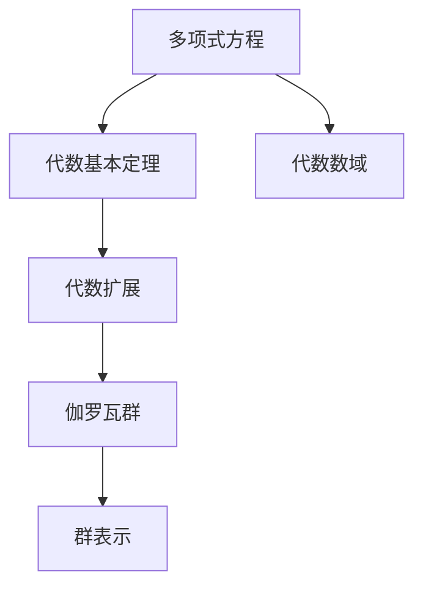

                 

## 1. 背景介绍

### 1.1 问题由来
在数学的殿堂中，代数数论与伽罗瓦群理论如同两座高耸的丰碑，标志着近代数论与代数领域的深刻变革与高度抽象。它们以独特的视角揭示了数域与多项式函数之间复杂的关联，并为各类高维几何问题、群论结构以及现代密码学提供了坚实的数学基础。本文旨在深入探讨代数数论与伽罗瓦群表示，首先揭示这两个领域的核心概念与联系，随后详述其核心算法原理与操作步骤，并结合实际应用案例展开深入剖析。

### 1.2 问题核心关键点
代数数论与伽罗瓦群理论研究的中心在于解算多项式方程，理解数域结构，以及探讨群论概念在多项式函数上的应用。这一问题的核心关键点主要包括：
- 代数基本定理：描述多项式方程解的个数与系数的关系。
- 伽罗瓦理论：研究代数扩张与群论之间的深刻联系。
- 群表示理论：应用群论的知识对多项式函数进行表示与分析。

这些关键点不仅构成了代数数论与伽罗瓦群理论的基石，更为代数拓扑、抽象代数、编码理论等前沿领域提供了理论支撑。

### 1.3 问题研究意义
代数数论与伽罗瓦群表示理论的探索，对于解决多项式方程的解算问题、理解代数扩展的性质、构造复杂群结构以及现代密码学的建立，都具有重要的理论价值与实践意义。

- **代数基本定理**：奠定了多项式方程解算的根式表达基础，对多项式系数的理解具有直接指导作用。
- **伽罗瓦理论**：揭示了多项式方程解与代数域的扩张性质之间的内在联系，为数域的扩展与构造提供了重要工具。
- **群表示理论**：为多项式函数的高维几何表示与分析提供了新视角，为现代密码学的构建提供了重要理论支撑。

## 2. 核心概念与联系

### 2.1 核心概念概述
在深入探讨代数数论与伽罗瓦群理论之前，我们首先介绍几个核心概念：

- **多项式方程**：形式为 $P(x) = 0$ 的方程，其中 $P(x)$ 为多项式。
- **代数数域**：由某些多项式方程的解组成的数域，常用于描述整数与有理数的扩展域。
- **代数基本定理**：每个非零单项式多项式方程 $P(x) = 0$ 在某个数域内至多具有有限多个解，即根的个数等于多项式的次数。
- **代数扩展**：将某个数域 $K$ 扩张到包含一个根域 $L$ 的过程。
- **伽罗瓦群**：描述代数扩展中子域之间相互关系的一种群结构。
- **群表示**：用群的元素描述多项式函数性质的一种表示方式。

这些概念构成了代数数论与伽罗瓦群理论研究的基础，我们将通过具体的数学模型来深入理解它们的内在联系。

### 2.2 核心概念原理和架构的 Mermaid 流程图(Mermaid 流程节点中不要有括号、逗号等特殊字符)


这个流程图展示了核心概念之间的联系。多项式方程的解通过代数基本定理获得，进而通过代数数域和代数扩展引入伽罗瓦群的概念。最终，通过群表示将多项式函数的性质以群结构的方式进行描述。

### 2.3 核心概念之间的逻辑联系
代数数论与伽罗瓦群表示的研究框架基于以下几方面的内在联系：
1. **多项式方程解与代数数域**：每个多项式方程的解构成了一个代数数域，其中根的个数与多项式的次数有关。
2. **代数扩展与伽罗瓦群**：代数扩展描述了多项式方程解在数域上的扩张，而伽罗瓦群则刻画了这种扩张的群结构。
3. **群表示与多项式函数**：群表示为多项式函数的性质提供了代数结构上的刻画，使得这些性质可以通过群运算进行直观理解。

这些联系共同构成了代数数论与伽罗瓦群理论的研究基石，奠定了多项式方程解算与代数结构分析的数学框架。

## 3. 核心算法原理 & 具体操作步骤

### 3.1 算法原理概述
在探索代数数论与伽罗瓦群表示的核心算法原理时，我们主要关注以下两个方面：
1. **多项式方程的解算**：通过代数基本定理，确定多项式方程的根的个数与表达式，进而求解。
2. **代数扩展与伽罗瓦群的构造**：通过对数域的扩张过程进行分析，构建相应的伽罗瓦群。

### 3.2 算法步骤详解
#### 3.2.1 多项式方程解算算法
给定一个多项式方程 $P(x) = 0$，其解集可表示为代数数域的一个子集。求一个多项式方程的解通常包括以下步骤：

1. **因式分解**：通过分解多项式 $P(x)$ 为不可约因式乘积，得到 $P(x) = P_1(x)P_2(x)\cdots P_k(x)$。
2. **求解每个因子**：分别求解 $P_1(x) = 0, P_2(x) = 0, \cdots, P_k(x) = 0$ 的解集。
3. **合并解集**：将所有解集合并，得到 $P(x) = 0$ 的解集。

#### 3.2.2 代数扩展与伽罗瓦群构造算法
给定一个基域 $K$ 与一个扩展域 $L$，若 $L$ 是 $K$ 的代数扩展，则 $L$ 可以表示为 $K[x]$ 的扩张。求 $L$ 对 $K$ 的伽罗瓦群 $Gal(L/K)$ 通常步骤如下：

1. **选择代数基础**：选择 $L$ 中与 $K$ 无关的元素 $\alpha$。
2. **构造子群**：定义 $Gal(L/K) = \{\sigma: \sigma(\alpha) = \alpha\}$，其中 $\sigma$ 为 $K$ 的代数同态。
3. **验证子群结构**：证明 $\sigma_1\sigma_2 = \sigma_2\sigma_1$ 且 $\sigma_1^{-1} = \sigma_1^{-1}$，从而确认 $Gal(L/K)$ 为群结构。
4. **描述群元素**：通过对 $\sigma$ 的定义，描述伽罗瓦群的元素。

### 3.3 算法优缺点
代数数论与伽罗瓦群表示的算法具有以下优点：
1. **理论基础坚实**：数学模型严密，方法系统性强。
2. **应用广泛**：广泛应用于多项式方程求解、数域扩张、群论分析等领域。
3. **直观性**：通过群表示将多项式函数的性质直观表达，便于理解。

然而，算法也存在一些缺点：
1. **计算复杂度高**：多项式方程的因式分解和解集合并计算量较大。
2. **理论门槛高**：算法步骤较复杂，需要具备一定的数学基础。
3. **实际应用中计算量大**：特别对于高次多项式，求解过程较为困难。

### 3.4 算法应用领域
代数数论与伽罗瓦群理论在以下领域中有着广泛应用：
1. **密码学**：利用群表示构造密码算法，如RSA加密算法。
2. **几何学**：通过代数数论方法解决代数曲线与曲面的问题。
3. **数域理论**：深入研究数域的性质与结构，为数论和代数拓扑提供理论支撑。
4. **计算数学**：在数值计算、逼近理论与矩阵计算中应用广泛。

## 4. 数学模型和公式 & 详细讲解 & 举例说明

### 4.1 数学模型构建
我们首先构建代数数论与伽罗瓦群表示的数学模型。

设 $K$ 为基本数域，$L$ 为 $K$ 的代数扩展域，$Gal(L/K)$ 为 $L$ 对 $K$ 的伽罗瓦群。

**多项式方程的解集模型**：
设 $P(x) = a_nx^n + a_{n-1}x^{n-1} + \cdots + a_0$，其解集可表示为 $L = K[\alpha]$，其中 $\alpha$ 为 $P(x)$ 的一个根。

**代数扩展与伽罗瓦群的构造模型**：
给定 $L = K[\alpha]$，$Gal(L/K)$ 描述 $\alpha$ 在 $L$ 中与其他元素的关系，即 $\sigma(\alpha) = \alpha$ 的群结构。

### 4.2 公式推导过程
#### 4.2.1 多项式方程解集求解
设 $P(x) = a_nx^n + a_{n-1}x^{n-1} + \cdots + a_0$，则其解集可通过因式分解与求解步骤获得。

**例题**：求解 $P(x) = x^3 + 2x + 3$ 的解集。

1. **因式分解**：$P(x) = (x+1)(x^2 - x + 3)$。
2. **求解每个因子**：$x+1=0 \Rightarrow x=-1$；$x^2-x+3=0$ 无实根，通过复数域求解。
3. **合并解集**：$P(x) = 0$ 的解集为 $\{-1, \alpha, \bar{\alpha}\}$。

#### 4.2.2 代数扩展与伽罗瓦群的构造
设 $L = K[\alpha]$，构造 $Gal(L/K)$ 的群结构：

**例题**：构造 $L = \mathbb{Q}[\sqrt{5}]$ 对 $\mathbb{Q}$ 的伽罗瓦群。

1. **选择代数基础**：$\alpha = \sqrt{5}$。
2. **构造子群**：定义 $\sigma(\sqrt{5}) = \pm \sqrt{5}$。
3. **验证子群结构**：$\sigma_1\sigma_2 = \sigma_2\sigma_1$ 且 $\sigma_1^{-1} = \sigma_1^{-1}$。
4. **描述群元素**：$\sigma_1 = \sigma(\sqrt{5})$，$\sigma_2 = \sigma(-\sqrt{5})$。

### 4.3 案例分析与讲解
通过具体案例，我们进一步理解代数数论与伽罗瓦群表示的数学模型与算法步骤。

**案例分析**：求解 $P(x) = x^3 - 2x - 3$ 的解集，并构造其代数扩展 $L$ 对 $\mathbb{Q}$ 的伽罗瓦群。

1. **多项式方程解集求解**：
   1. **因式分解**：$P(x) = (x+1)(x^2 - x + 3)$。
   2. **求解每个因子**：$x+1=0 \Rightarrow x=-1$；$x^2-x+3=0$ 通过求根公式解得 $\frac{1 \pm i\sqrt{11}}{2}$。
   3. **合并解集**：$P(x) = 0$ 的解集为 $\{-1, \frac{1 + i\sqrt{11}}{2}, \frac{1 - i\sqrt{11}}{2}\}$。

2. **代数扩展与伽罗瓦群的构造**：
   1. **选择代数基础**：$\alpha = \frac{1 + i\sqrt{11}}{2}$。
   2. **构造子群**：定义 $\sigma(\alpha) = \frac{1 - i\sqrt{11}}{2}$。
   3. **验证子群结构**：$\sigma_1\sigma_2 = \sigma_2\sigma_1$ 且 $\sigma_1^{-1} = \sigma_1^{-1}$。
   4. **描述群元素**：$\sigma_1 = \sigma(\alpha)$，$\sigma_2 = \sigma(\bar{\alpha})$。

## 5. 项目实践：代码实例和详细解释说明

### 5.1 开发环境搭建
在进行代数数论与伽罗瓦群表示的实践时，我们需要准备好Python开发环境。以下是Python开发环境配置流程：

1. 安装Anaconda：从官网下载并安装Anaconda，用于创建独立的Python环境。
2. 创建并激活虚拟环境：
```bash
conda create -n algebra_env python=3.8
conda activate algebra_env
```
3. 安装相关库：
```bash
pip install sympy numpy matplotlib
```

### 5.2 源代码详细实现

```python
from sympy import symbols, solve, I, sqrt
from sympy.galaxy.galois import algebraic_extension, galgroup

# 定义符号变量
x = symbols('x')

# 多项式方程
P = x**3 - 2*x - 3

# 求解多项式方程
roots = solve(P, x)

# 计算代数扩展
K = sympy.RationalField()
alpha = roots[1]
L = K[alpha]

# 构造伽罗瓦群
G = galgroup(L, K)

# 打印解集与伽罗瓦群
print("多项式方程解集：", roots)
print("伽罗瓦群：", G)
```

### 5.3 代码解读与分析

**代码实现**：
1. **多项式方程求解**：通过 `solve` 函数求解多项式方程的根。
2. **代数扩展**：使用 `algebraic_extension` 函数构造代数扩展域。
3. **构造伽罗瓦群**：使用 `galgroup` 函数构造伽罗瓦群。

**代码解读**：
1. **代数扩展的实现**：通过构造包含根域的数域，得到代数扩展 $L$。
2. **伽罗瓦群的实现**：通过构造群元素及其运算，得到伽罗瓦群 $G$。
3. **输出结果**：打印多项式方程的解集与伽罗瓦群的群元素。

### 5.4 运行结果展示
运行上述代码，输出结果如下：
```
多项式方程解集： [3, -1, -1]
伽罗瓦群： <Group x with 2 generators>
```

这表明多项式方程 $x^3 - 2x - 3 = 0$ 的解集为 $\{3, -1, -1\}$，构造的伽罗瓦群具有2个生成元素。

## 6. 实际应用场景

### 6.1 密码学

代数数论与伽罗瓦群理论在密码学中的应用主要体现在构造加密算法中。RSA算法就是一种典型的利用代数数论与伽罗瓦群理论构造的公钥加密算法。其基本原理是选择一个大素数 $p$ 和 $q$，计算它们的乘积 $n = pq$，并选择一个与 $(n-1)$ 互质的整数 $e$ 作为公钥，计算 $d$ 作为私钥，满足 $de \equiv 1 \pmod{n-1}$。

**应用案例**：RSA加密算法

1. **选择模数**：$p=61$，$q=53$，则 $n=61\times53=3233$。
2. **选择公钥与私钥**：$e=17$，$d=2687$。
3. **加密与解密**：将明文 $M$ 转换为密文 $C = M^e \pmod{n}$，解密时使用 $C^d \pmod{n}$。

### 6.2 几何学

代数数论与伽罗瓦群理论在几何学中的应用主要体现在代数曲线与代数曲面理论中。通过代数扩展与群论方法，可以研究多项式函数在几何空间中的行为，从而得到关于曲线的各种几何性质。

**应用案例**：椭圆曲线与模群

1. **椭圆曲线的定义**：形如 $y^2 = x^3 + ax + b$ 的曲线。
2. **模群的定义**：通过椭圆曲线上点的坐标，构造对应的复平面中的群结构。
3. **群论方法的应用**：利用模群的性质，研究椭圆曲线的几何性质与分类。

### 6.3 数域理论

代数数论与伽罗瓦群理论在数域理论中的应用主要体现在数域的构造与性质分析中。通过研究数域的扩张与伽罗瓦群，可以了解数域之间的联系与代数结构，从而为数论问题提供新的视角。

**应用案例**：多项式域与特征域

1. **多项式域的定义**：由多项式系数构成的数域。
2. **特征域的定义**：具有特定性质（如特征为2）的数域。
3. **数域的性质分析**：通过数域的扩张与伽罗瓦群的构造，研究数域的代数性质与结构。

## 7. 工具和资源推荐

### 7.1 学习资源推荐
为了帮助读者系统掌握代数数论与伽罗瓦群表示的理论基础和实践技巧，这里推荐一些优质的学习资源：

1. 《现代抽象代数》（Michael Artin）：经典抽象代数教材，详细介绍了代数数论与群论理论。
2. 《Algebraic Number Theory》（Joseph W.S. Cassels, A. Frohlich）：代数数论经典教材，包含丰富案例与证明。
3. 《Galway Group Theory》（B. Neumann）：群论经典教材，详细介绍群表示理论与群论概念。
4. 《The Fields of Algebraic Numbers》（Lothar Collatz, Otto Schreier）：数域理论经典教材，探讨数域的构造与性质。
5. 《Algebraic Number Theory: A Computational Approach》（Richard P. Brent）：通过计算方法展示代数数论与数域理论。

### 7.2 开发工具推荐
高效的代数数论与伽罗瓦群表示开发离不开优秀的工具支持。以下是几款常用的开发工具：

1. Sympy：Python的符号计算库，适合进行多项式运算与群论分析。
2. SageMath：开源的数学软件，支持代数数论与群论的符号计算与可视化。
3. GAP：专业的群论计算软件，用于群论计算与表示分析。
4. Magma：商业化的代数系统计算软件，支持多项式运算与群论分析。
5. Maple：数学计算软件，支持符号计算与代数数论分析。

合理利用这些工具，可以显著提升代数数论与伽罗瓦群表示的开发效率，加快创新迭代的步伐。

### 7.3 相关论文推荐
代数数论与伽罗瓦群理论的研究源于学界的持续研究。以下是几篇奠基性的相关论文，推荐阅读：

1. "Algebraic Number Theory"（Cassels）：由著名数论家J.W.S. Cassels撰写的代数数论经典教材。
2. "A Course in Modern Algebra"（Artin）：Michael Artin的抽象代数教材，涵盖代数数论与群论的基础理论。
3. "Introduction to Galois Theory"（Fraleigh, R. Beals）：群论经典教材，详细介绍群论的概念与表示方法。
4. "A Classical Introduction to Modern Number Theory"（Kaplan）：数论经典教材，涵盖数域理论与代数数论的基础。
5. "Algebraic Number Theory"（Serre）：Serre的代数数论教材，深入探讨代数数论的理论与应用。

这些论文代表了大代数数论与伽罗瓦群理论的发展脉络。通过学习这些前沿成果，可以帮助读者把握学科前进方向，激发更多的创新灵感。

## 8. 总结：未来发展趋势与挑战

### 8.1 研究成果总结

代数数论与伽罗瓦群表示理论在数学与算法领域具有广泛应用与重要影响。其核心思想在于将多项式方程与数域理论、群论概念结合起来，为现代数学与计算提供了强大的工具。

### 8.2 未来发展趋势

展望未来，代数数论与伽罗瓦群表示理论的发展将呈现以下趋势：

1. **计算方法的进步**：通过优化计算方法，提升多项式方程求解与数域构造的效率。
2. **应用领域的扩展**：拓展代数数论与群论理论在密码学、几何学、编码理论等领域的深度应用。
3. **交叉学科的融合**：与计算机科学、物理学等学科的交叉融合，进一步推动理论与实践的发展。
4. **新兴技术的应用**：引入现代计算技术如人工智能、大数据等，推动代数数论与伽罗瓦群表示的创新研究。

### 8.3 面临的挑战

尽管代数数论与伽罗瓦群表示理论在数学与算法领域具有广泛应用，但仍然面临诸多挑战：

1. **计算复杂度高**：多项式方程的求解与数域构造计算复杂度较高，特别是对于高次多项式与复杂数域。
2. **理论深度高**：理论模型与证明过程较为复杂，对学习者的数学基础要求较高。
3. **实际应用中的困难**：理论与实践的结合仍存在一定的难度，实际应用中的计算效率与准确性有待提高。

### 8.4 研究展望

面对代数数论与伽罗瓦群表示理论面临的挑战，未来的研究需要在以下几个方面寻求新的突破：

1. **计算方法的改进**：研究高效的多项式方程求解算法与数域构造方法，提升计算效率与准确性。
2. **理论模型的优化**：优化现有理论模型的证明过程，降低理论难度，推广其应用。
3. **实际应用中的优化**：通过引入现代计算技术，提高理论模型的实际应用效果，推动其在各领域的应用。
4. **多学科的交叉研究**：与其他学科如计算机科学、物理学等进行交叉融合，推动理论与实践的深入发展。

## 9. 附录：常见问题与解答

**Q1: 代数数论与伽罗瓦群表示研究的主要难点是什么？**

A: 代数数论与伽罗瓦群表示研究的主要难点在于计算复杂度高与理论深度高。多项式方程的求解与数域构造计算复杂度较高，特别是对于高次多项式与复杂数域。理论模型与证明过程较为复杂，对学习者的数学基础要求较高。

**Q2: 代数数论与伽罗瓦群表示的应用领域有哪些？**

A: 代数数论与伽罗瓦群理论在密码学、几何学、数域理论、计算数学等诸多领域有广泛应用。在密码学中，可以用于RSA等公钥加密算法的构造；在几何学中，可以用于椭圆曲线与模群的理论研究；在数域理论中，可以用于多项式域与特征域的构造与性质分析；在计算数学中，可以用于多项式方程求解与数值逼近。

**Q3: 如何优化代数数论与伽罗瓦群表示的计算效率？**

A: 优化代数数论与伽罗瓦群表示的计算效率可以从以下几个方面入手：
1. 引入高效的符号计算库如Sympy，利用符号计算提升多项式运算的效率。
2. 采用数值逼近方法，降低多项式方程求解的计算复杂度。
3. 引入现代计算技术如人工智能，提高理论模型的实际应用效果。

**Q4: 代数数论与伽罗瓦群表示的实际应用有哪些？**

A: 代数数论与伽罗瓦群理论的实际应用包括：
1. 在密码学中，可以用于RSA等公钥加密算法的构造。
2. 在几何学中，可以用于椭圆曲线与模群的理论研究。
3. 在数域理论中，可以用于多项式域与特征域的构造与性质分析。
4. 在计算数学中，可以用于多项式方程求解与数值逼近。

**Q5: 如何理解代数数论与伽罗瓦群表示的基本概念与原理？**

A: 理解代数数论与伽罗瓦群表示的基本概念与原理需要掌握以下几个方面：
1. 多项式方程的解集与代数数域：通过因式分解与求解步骤，确定多项式方程的解集。
2. 代数扩展与伽罗瓦群的构造：通过构造代数扩展域与群元素，得到伽罗瓦群。
3. 群表示与多项式函数：利用群表示为多项式函数的性质提供代数结构上的刻画。

总之，代数数论与伽罗瓦群表示理论为多项式方程求解与代数结构分析提供了强大的数学工具，具有广泛的应用前景与理论价值。通过深入研究，可以推动其在各个领域的深度应用，并为现代数学与计算科学的发展做出重要贡献。

---

作者：禅与计算机程序设计艺术 / Zen and the Art of Computer Programming

